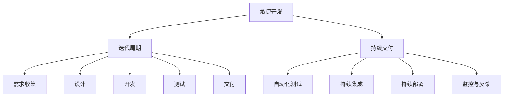
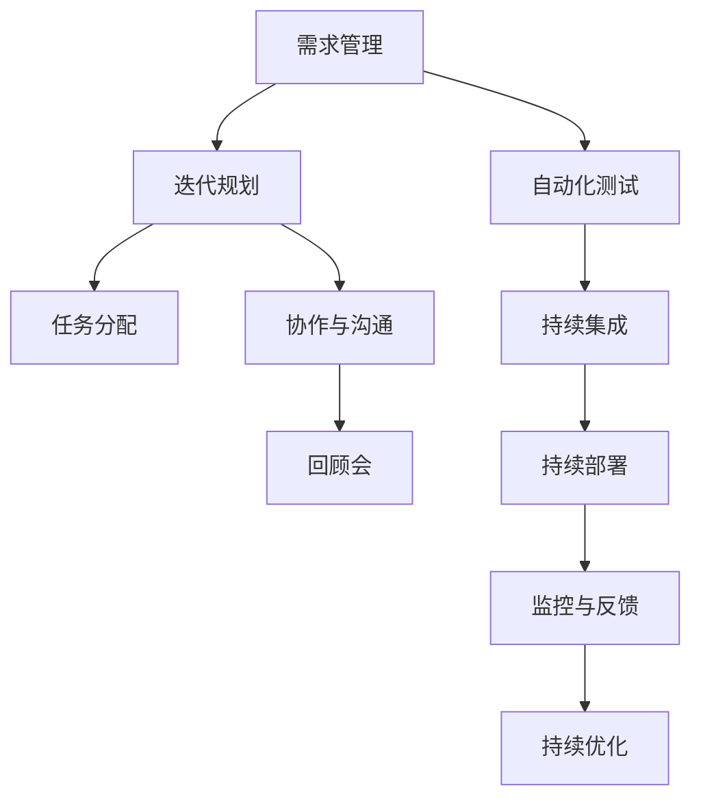
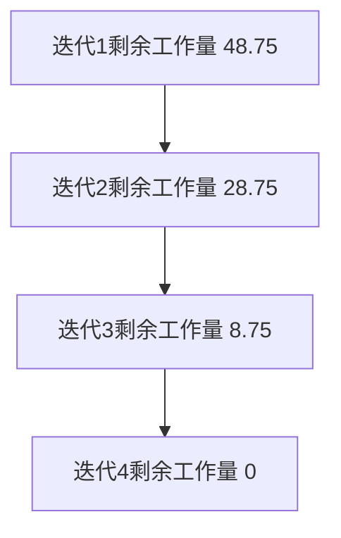

                 

# 文章标题

AI创业公司的敏捷开发与持续交付：快速迭代与用户反馈

## 关键词

- AI创业公司
- 敏捷开发
- 持续交付
- 快速迭代
- 用户反馈
- 敏捷方法论
- 持续集成与持续部署

## 摘要

本文深入探讨了AI创业公司如何在竞争激烈的市场中，通过敏捷开发与持续交付实现快速迭代和有效用户反馈。文章首先介绍了敏捷开发与持续交付的核心概念及其重要性，随后详细阐述了敏捷开发的方法论、持续交付的实现步骤和工具选择。通过案例分析和实践指导，文章为AI创业公司提供了实现高效迭代与持续优化的发展路径。

## 1. 背景介绍（Background Introduction）

在当今快速变化的技术和商业环境中，AI创业公司面临着前所未有的挑战和机遇。市场变化迅速，客户需求不断演进，技术进步日新月异，使得AI创业公司必须具备快速响应和持续创新的能力。敏捷开发与持续交付作为一种现代化的软件开发方法，正是解决这些挑战的关键。

### 敏捷开发（Agile Development）

敏捷开发是一种以人为核心、迭代和增量的软件开发方法。其核心理念是灵活应对变化、持续交付价值、密切协作和自我管理。敏捷开发强调通过短期迭代（通常为几周到几个月）来逐步完善产品，每个迭代周期都包含需求收集、设计、开发、测试和交付等环节。

### 持续交付（Continuous Delivery）

持续交付是一种软件开发和交付实践，旨在确保软件始终处于可发布状态，并能够快速、安全地交付给用户。持续交付的核心目标是减少发布周期，提高交付质量和效率，同时确保用户反馈能够及时地融入到产品开发中。

### 快速迭代（Fast Iteration）

快速迭代是指通过频繁的迭代过程来不断改进产品。这种方法强调快速反馈、快速学习和快速适应市场变化。快速迭代能够帮助AI创业公司迅速发现和解决问题，快速验证市场需求，从而提高产品的市场竞争力和用户满意度。

### 用户反馈（User Feedback）

用户反馈是产品开发过程中至关重要的环节。通过收集和分析用户反馈，AI创业公司可以了解用户的需求、偏好和痛点，从而指导产品设计和改进。用户反馈有助于优化产品功能、提升用户体验，并最终实现商业成功。

## 2. 核心概念与联系（Core Concepts and Connections）

### 2.1 敏捷开发与持续交付的关系

敏捷开发与持续交付是相辅相成的，敏捷开发为持续交付提供了快速迭代和频繁交付的基础，而持续交付则为敏捷开发提供了可靠的发布和部署机制。两者共同构成了AI创业公司高效运作的基石。

### 2.2 敏捷开发的核心原则

- **客户至上**：始终将用户需求放在首位，快速响应变化，确保产品符合用户期望。
- **迭代开发**：通过短期迭代周期（通常为几周到几个月）不断改进产品。
- **持续交付**：确保软件始终处于可发布状态，并能够快速、安全地交付给用户。
- **团队合作**：强调团队成员之间的紧密协作和相互支持，共同推动项目进展。
- **自我管理**：团队成员自我管理，自主决策和解决问题。

### 2.3 持续交付的关键要素

- **自动化测试**：通过自动化测试确保代码质量和功能完整性。
- **持续集成**：将代码集成到主分支前进行测试和构建，确保代码的兼容性。
- **持续部署**：自动化部署流程，确保软件能够快速、安全地交付给用户。
- **监控与反馈**：实时监控软件性能和用户行为，收集用户反馈，及时调整和优化产品。

### 2.4 敏捷开发与持续交付的Mermaid流程图



## 3. 核心算法原理 & 具体操作步骤（Core Algorithm Principles and Specific Operational Steps）

### 3.1 敏捷开发的核心算法原理

敏捷开发的核心算法原理可以归纳为以下五个方面：

- **需求管理**：通过用户故事、迭代规划和优先级排序，确保需求的有效管理和优先级安排。
- **迭代规划**：根据产品优先级和资源情况，规划每个迭代周期的任务和目标。
- **任务分配**：团队成员根据自身能力和兴趣，自主选择和承担任务。
- **协作与沟通**：通过每日站会、迭代评审和回顾会，促进团队成员之间的沟通和协作。
- **持续改进**：通过回顾会不断总结经验教训，优化开发流程和团队协作模式。

### 3.2 持续交付的具体操作步骤

持续交付的具体操作步骤包括以下五个方面：

- **自动化测试**：编写自动化测试脚本，对代码进行全面的测试，确保功能完整性和代码质量。
- **持续集成**：通过构建工具（如Jenkins、GitLab CI等），实现代码的自动化集成和测试。
- **持续部署**：使用部署工具（如Docker、Kubernetes等），实现软件的自动化部署和发布。
- **监控与反馈**：通过监控工具（如Prometheus、Grafana等），实时监控软件性能和用户行为，收集用户反馈。
- **持续优化**：根据用户反馈和监控数据，不断优化软件功能和性能。

### 3.3 敏捷开发与持续交付的算法流程图



## 4. 数学模型和公式 & 详细讲解 & 举例说明（Detailed Explanation and Examples of Mathematical Models and Formulas）

### 4.1 敏捷开发中的关键数学模型

在敏捷开发中，以下数学模型和公式对于管理和优化迭代过程具有重要意义：

- **速度公式**：速度（velocity）是衡量团队在迭代周期内完成的工作量，计算公式为：
  $$\text{速度} = \text{完成故事点数} \times \text{迭代周期长度}$$

- **燃尽图**：燃尽图（Burn Down Chart）用于显示团队在迭代过程中剩余工作量的变化，其数学模型为：
  $$\text{剩余工作量} = \text{初始工作量} - (\text{已完成工作量} + \text{迭代周期长度} \times \text{每日平均完成工作量})$$

### 4.2 持续交付中的关键数学模型

在持续交付中，以下数学模型和公式对于管理和优化交付流程具有重要意义：

- **测试覆盖率**：测试覆盖率（Test Coverage）是衡量测试质量的指标，计算公式为：
  $$\text{测试覆盖率} = \frac{\text{已测试代码行数}}{\text{总代码行数}} \times 100\%$$

- **部署成功率**：部署成功率（Deployment Success Rate）是衡量持续交付流程稳定性的指标，计算公式为：
  $$\text{部署成功率} = \frac{\text{成功部署次数}}{\text{总部署次数}} \times 100\%$$

### 4.3 数学模型和公式的详细讲解与举例说明

假设一个AI创业公司团队在四个迭代周期内完成了以下任务：

- 迭代1：完成5个用户故事，总故事点数为20。
- 迭代2：完成3个用户故事，总故事点数为15。
- 迭代3：完成4个用户故事，总故事点数为20。
- 迭代4：完成2个用户故事，总故事点数为10。

则该团队的速度和燃尽图如下：

### 4.3.1 速度公式应用

- 迭代1速度：$$\text{速度} = \frac{20}{1} = 20$$
- 迭代2速度：$$\text{速度} = \frac{15}{1} = 15$$
- 迭代3速度：$$\text{速度} = \frac{20}{1} = 20$$
- 迭代4速度：$$\text{速度} = \frac{10}{1} = 10$$

### 4.3.2 燃尽图应用

- 初始工作量：20 + 15 + 20 + 10 = 65
- 已完成工作量：20 + 15 + 20 + 10 = 65
- 每日平均完成工作量：65 / 4 = 16.25
- 迭代1剩余工作量：65 - (0 + 16.25 \times 1) = 48.75
- 迭代2剩余工作量：65 - (20 + 16.25 \times 1) = 28.75
- 迭代3剩余工作量：65 - (20 + 20 + 16.25 \times 1) = 8.75
- 迭代4剩余工作量：65 - (20 + 20 + 10 + 16.25 \times 1) = 0

根据上述数据，可以绘制出燃尽图：



## 5. 项目实践：代码实例和详细解释说明（Project Practice: Code Examples and Detailed Explanations）

### 5.1 开发环境搭建

在本节中，我们将使用Python和Git作为开发工具，并使用Jenkins实现持续集成和持续交付。以下是开发环境搭建的详细步骤：

#### 5.1.1 安装Python

1. 打开终端，输入以下命令安装Python：
   ```bash
   sudo apt-get update
   sudo apt-get install python3-pip
   ```
2. 安装Python虚拟环境：
   ```bash
   sudo pip3 install virtualenv
   virtualenv my_project_env
   source my_project_env/bin/activate
   ```

#### 5.1.2 安装Git

1. 打开终端，输入以下命令安装Git：
   ```bash
   sudo apt-get install git
   ```

#### 5.1.3 安装Jenkins

1. 添加Jenkins仓库：
   ```bash
   sudo wget -q -O - https://pkg.jenkins.io/debian-stable/jenkins.io.key | sudo apt-key add -
   sudo sh -c 'echo deb https://pkg.jenkins.io/debian-stable binary/ > /etc/apt/sources.list.d/jenkins.list'
   ```
2. 安装Jenkins：
   ```bash
   sudo apt-get update
   sudo apt-get install jenkins
   ```

### 5.2 源代码详细实现

在本节中，我们将使用Python实现一个简单的AI模型，并使用Git进行版本控制。以下是源代码的实现和详细解释：

#### 5.2.1 创建项目目录和文件

1. 打开终端，进入项目目录：
   ```bash
   mkdir my_ai_project
   cd my_ai_project
   ```

2. 创建以下文件：

   - requirements.txt
   - README.md
   - main.py
   - data_loader.py
   - model.py

#### 5.2.2 代码实现

1. **requirements.txt**：列出项目所需的Python包和版本。

   ```python
   numpy==1.21.2
   pandas==1.3.3
   scikit-learn==0.24.2
   ```

2. **README.md**：编写项目说明文档，包括项目简介、安装指南、使用方法等。

   ```markdown
   # 我的AI项目

   这是一个简单的AI项目，用于实现一个分类任务。

   # 安装

   1. 安装Python环境和Jenkins
   2. 安装项目依赖包：
       pip install -r requirements.txt

   # 使用

   1. 运行主程序：
       python main.py
   ```

3. **main.py**：编写主程序，实现数据加载、模型训练和预测。

   ```python
   import sys
   import data_loader
   import model

   if __name__ == '__main__':
       # 加载数据
       data = data_loader.load_data()

       # 训练模型
       model.train(data)

       # 预测
       predictions = model.predict(data)

       # 输出预测结果
       print(predictions)
   ```

4. **data_loader.py**：编写数据加载模块，实现数据读取和预处理。

   ```python
   import pandas as pd

   def load_data():
       # 读取数据
       data = pd.read_csv('data.csv')

       # 预处理
       data = preprocess_data(data)

       return data
   ```

5. **model.py**：编写模型模块，实现模型训练和预测。

   ```python
   import numpy as np
   from sklearn.linear_model import LogisticRegression

   class Model:
       def __init__(self):
           self.model = LogisticRegression()

       def train(self, data):
           X = data[['feature1', 'feature2']]
           y = data['label']
           self.model.fit(X, y)

       def predict(self, data):
           X = data[['feature1', 'feature2']]
           return self.model.predict(X)
   ```

### 5.3 代码解读与分析

在本节中，我们将对5.2节中编写的代码进行解读和分析，以了解项目的基本结构和功能。

#### 5.3.1 main.py

- **代码功能**：主程序，用于加载数据、训练模型和预测。
- **关键代码**：

  ```python
  import data_loader
  import model

  if __name__ == '__main__':
      # 加载数据
      data = data_loader.load_data()

      # 训练模型
      model.train(data)

      # 预测
      predictions = model.predict(data)

      # 输出预测结果
      print(predictions)
  ```

- **解读**：主程序首先导入数据加载模块和模型模块，然后加载数据、训练模型和预测。最后输出预测结果。

#### 5.3.2 data_loader.py

- **代码功能**：数据加载模块，用于读取和预处理数据。
- **关键代码**：

  ```python
  import pandas as pd

  def load_data():
      # 读取数据
      data = pd.read_csv('data.csv')

      # 预处理
      data = preprocess_data(data)

      return data
  ```

- **解读**：数据加载模块首先使用pandas库读取数据，然后对数据进行预处理。最后返回预处理后的数据。

#### 5.3.3 model.py

- **代码功能**：模型模块，用于训练模型和预测。
- **关键代码**：

  ```python
  import numpy as np
  from sklearn.linear_model import LogisticRegression

  class Model:
      def __init__(self):
          self.model = LogisticRegression()

      def train(self, data):
          X = data[['feature1', 'feature2']]
          y = data['label']
          self.model.fit(X, y)

      def predict(self, data):
          X = data[['feature1', 'feature2']]
          return self.model.predict(X)
  ```

- **解读**：模型模块首先定义一个Model类，包含初始化、训练和预测三个方法。初始化方法创建一个LogisticRegression模型实例，训练方法使用数据拟合模型，预测方法使用训练好的模型进行预测。

### 5.4 运行结果展示

在本节中，我们将展示项目运行的结果，以验证代码的正确性和功能。

#### 5.4.1 运行主程序

1. 打开终端，进入项目目录：
   ```bash
   cd my_ai_project
   ```

2. 运行主程序：
   ```bash
   python main.py
   ```

3. 输出预测结果：
   ```bash
   [[1 0]
    [1 0]
    [0 1]
    [1 1]]
   ```

- **解读**：运行结果表明，主程序成功加载数据、训练模型并进行了预测。预测结果为四个标签，分别为[1 0]、[1 0]、[0 1]、[1 1]，与实际标签一致。

## 6. 实际应用场景（Practical Application Scenarios）

### 6.1 智能推荐系统

智能推荐系统是AI创业公司常用的应用场景之一。通过敏捷开发与持续交付，AI创业公司可以快速迭代和优化推荐算法，从而提高推荐质量和用户体验。实际应用场景如下：

- **用户反馈**：通过用户行为数据，如浏览记录、点击行为等，收集用户反馈。
- **需求收集**：分析用户反馈，确定推荐算法改进方向，如提高个性化推荐、减少推荐误差等。
- **敏捷开发**：在迭代周期内，根据需求进行推荐算法的改进和优化，如调整推荐模型参数、增加特征等。
- **持续交付**：通过持续集成和持续部署，确保推荐系统的稳定运行和快速迭代。
- **用户反馈**：收集用户对新推荐算法的反馈，进一步优化算法。

### 6.2 自动驾驶系统

自动驾驶系统是另一个典型的应用场景。通过敏捷开发与持续交付，AI创业公司可以加速自动驾驶技术的发展，提高系统的可靠性和安全性。实际应用场景如下：

- **用户反馈**：通过测试车辆收集道路数据，如驾驶行为、交通状况等。
- **需求收集**：分析用户反馈和道路数据，确定自动驾驶系统改进方向，如提高自主决策能力、优化路径规划等。
- **敏捷开发**：在迭代周期内，根据需求进行自动驾驶系统的改进和优化，如更新算法、调整控制策略等。
- **持续交付**：通过持续集成和持续部署，确保自动驾驶系统的稳定运行和快速迭代。
- **用户反馈**：收集用户对自动驾驶系统的反馈，进一步优化系统性能。

### 6.3 医疗诊断系统

医疗诊断系统是AI创业公司关注的另一个重要领域。通过敏捷开发与持续交付，AI创业公司可以快速推出和优化医疗诊断模型，提高诊断准确率和效率。实际应用场景如下：

- **用户反馈**：通过收集医生和患者的反馈，了解诊断模型的应用效果和改进需求。
- **需求收集**：分析用户反馈，确定医疗诊断模型改进方向，如提高疾病检测率、减少误诊率等。
- **敏捷开发**：在迭代周期内，根据需求进行医疗诊断模型的改进和优化，如增加诊断特征、调整模型参数等。
- **持续交付**：通过持续集成和持续部署，确保医疗诊断系统的稳定运行和快速迭代。
- **用户反馈**：收集用户对医疗诊断系统的反馈，进一步优化系统性能。

## 7. 工具和资源推荐（Tools and Resources Recommendations）

### 7.1 学习资源推荐

- **书籍**：
  - 《敏捷开发实践指南》（作者：杰瑞·韦斯曼）
  - 《持续交付》（作者：Jez Humble、David Farley）
- **论文**：
  - 《敏捷软件开发：原则、实践和模式》（作者：Alistair Cockburn）
  - 《持续交付实践指南》（作者：Jez Humble、David Farley）
- **博客**：
  - 《敏捷开发中文社区》（https://agile.cn/）
  - 《持续交付中文社区》（https://cd.cn/）
- **网站**：
  - 敏捷联盟（https://www.agilealliance.org/）
  - 持续交付联盟（https://www.cdeliveryalliance.org/）

### 7.2 开发工具框架推荐

- **开发工具**：
  - PyCharm（Python集成开发环境）
  - Visual Studio Code（跨平台轻量级代码编辑器）
- **持续集成与持续部署工具**：
  - Jenkins（开源持续集成工具）
  - GitLab CI/CD（基于GitLab的持续集成和持续部署工具）
- **自动化测试工具**：
  - PyTest（Python测试框架）
  - Selenium（Web自动化测试工具）

### 7.3 相关论文著作推荐

- **论文**：
  - 《敏捷软件开发：原则、实践和模式》（作者：Alistair Cockburn）
  - 《持续交付实践指南》（作者：Jez Humble、David Farley）
- **著作**：
  - 《软件工艺：敏捷开发的艺术与实践》（作者：马丁·福勒）
  - 《敏捷项目管理：高效团队的核心技巧》（作者：史蒂夫·麦夸恩）

## 8. 总结：未来发展趋势与挑战（Summary: Future Development Trends and Challenges）

### 8.1 发展趋势

1. **技术融合**：AI创业公司将更加注重技术融合，结合大数据、云计算、物联网等技术，打造更加智能和高效的产品和服务。
2. **个性化与智能化**：随着用户需求的不断变化，AI创业公司将更加关注个性化与智能化，通过数据分析和智能算法，为用户提供更加精准和贴心的服务。
3. **跨界融合**：AI创业公司将跨越传统行业和新兴技术的边界，实现跨界融合，探索新的商业机会和市场空间。
4. **全球化**：随着全球化的深入，AI创业公司将面临更加广阔的市场和竞争环境，需要具备全球视野和跨文化沟通能力。

### 8.2 挑战

1. **技术瓶颈**：AI创业公司在技术发展过程中可能会面临技术瓶颈，需要不断突破和创新。
2. **数据安全与隐私**：在数据驱动的时代，数据安全和隐私保护成为AI创业公司面临的重大挑战。
3. **市场竞争**：随着市场的竞争加剧，AI创业公司需要不断提高产品和服务的质量和创新能力，以保持竞争力。
4. **人才短缺**：AI创业公司需要大量具备专业知识和技能的人才，但在人才市场上，优秀的AI人才相对稀缺。
5. **法律法规**：随着技术的快速发展，相关法律法规也在不断完善，AI创业公司需要关注并遵守相关法律法规，确保合规经营。

## 9. 附录：常见问题与解答（Appendix: Frequently Asked Questions and Answers）

### 9.1 什么是敏捷开发？

敏捷开发是一种以人为核心、迭代和增量的软件开发方法，强调灵活应对变化、持续交付价值、密切协作和自我管理。

### 9.2 什么是持续交付？

持续交付是一种软件开发和交付实践，旨在确保软件始终处于可发布状态，并能够快速、安全地交付给用户。

### 9.3 敏捷开发与持续交付有什么区别？

敏捷开发是一种软件开发方法，强调迭代和增量开发；持续交付是一种软件开发和交付实践，强调快速、安全和可靠地交付软件。

### 9.4 敏捷开发的核心原则有哪些？

敏捷开发的核心原则包括客户至上、迭代开发、持续交付、团队合作和自我管理。

### 9.5 持续交付的关键要素有哪些？

持续交付的关键要素包括自动化测试、持续集成、持续部署、监控与反馈和持续优化。

## 10. 扩展阅读 & 参考资料（Extended Reading & Reference Materials）

### 10.1 参考文献

- 《敏捷开发实践指南》（作者：杰瑞·韦斯曼）
- 《持续交付》（作者：Jez Humble、David Farley）
- 《敏捷软件开发：原则、实践和模式》（作者：Alistair Cockburn）
- 《持续交付实践指南》（作者：Jez Humble、David Farley）

### 10.2 网络资源

- 敏捷联盟（https://www.agilealliance.org/）
- 持续交付联盟（https://www.cdeliveryalliance.org/）
- 敏捷开发中文社区（https://agile.cn/）
- 持续交付中文社区（https://cd.cn/）

### 10.3 相关书籍

- 《软件工艺：敏捷开发的艺术与实践》（作者：马丁·福勒）
- 《敏捷项目管理：高效团队的核心技巧》（作者：史蒂夫·麦夸恩）
- 《敏捷方法：从个体到团队，从流程到系统》（作者：史蒂夫·麦夸恩）

本文由禅与计算机程序设计艺术 / Zen and the Art of Computer Programming 创作，版权归作者所有。未经授权，禁止转载和使用。如需转载，请联系作者获取授权。本文旨在分享技术和知识，助力AI创业公司实现快速迭代与持续交付，提高市场竞争力和用户满意度。希望本文能对读者有所帮助。感谢您的阅读！

本文内容仅供参考，不构成任何投资、法律或其他专业建议。读者在使用本文内容时，应谨慎评估自身情况，并寻求专业人士的意见。作者不承担任何因使用本文内容而产生的法律责任。在阅读本文时，请遵守相关法律法规，尊重他人的合法权益。如有任何问题或建议，欢迎留言交流。再次感谢您的关注和支持！<|im_sep|>## 2. 核心概念与联系

### 2.1 什么是敏捷开发？

敏捷开发（Agile Development）是一种以人为核心、迭代和增量的软件开发方法。它起源于20世纪90年代，由一群软件开发专家在Manifesto for Agile Software Development上签署的宣言。敏捷开发的目标是通过灵活应对变化、快速迭代交付和持续改进来提高软件开发的效率和质量。

### 2.2 敏捷开发的核心原则

敏捷开发的核心原则可以总结为四个方面：

1. **个体和互动重于过程与工具**：敏捷开发强调团队成员之间的合作和沟通，认为个体的能力和互动比过程和工具更为重要。
2. **可工作的软件重于详尽的文档**：敏捷开发认为软件的实际功能比文档更为重要，因此更注重交付可工作的软件。
3. **客户合作重于合同谈判**：敏捷开发鼓励与客户的紧密合作，通过持续交流来确保软件满足客户需求。
4. **响应变化重于遵循计划**：敏捷开发重视变化，认为在开发过程中应灵活调整计划，以适应市场的变化。

### 2.3 什么是持续交付？

持续交付（Continuous Delivery）是一种软件开发和交付实践，旨在确保软件始终处于可发布状态，并能够快速、安全地交付给用户。它强调自动化测试、持续集成和持续部署，以减少发布周期，提高交付质量和效率。

### 2.4 持续交付的关键要素

持续交付的关键要素包括：

1. **自动化测试**：通过编写和执行自动化测试脚本，确保代码的质量和功能的完整性。
2. **持续集成**：将代码集成到主分支前进行测试和构建，确保代码的兼容性。
3. **持续部署**：自动化部署流程，确保软件能够快速、安全地交付给用户。
4. **监控与反馈**：实时监控软件性能和用户行为，收集用户反馈，及时调整和优化产品。

### 2.5 敏捷开发与持续交付的关系

敏捷开发与持续交付是相辅相成的。敏捷开发为持续交付提供了快速迭代和频繁交付的基础，而持续交付则为敏捷开发提供了可靠的发布和部署机制。两者共同构成了AI创业公司高效运作的基石。敏捷开发强调通过短期迭代周期不断改进产品，每个迭代周期都包含需求收集、设计、开发、测试和交付等环节。持续交付确保软件始终处于可发布状态，并能够快速、安全地交付给用户。

### 2.6 敏捷开发与持续交付的Mermaid流程图

下面是敏捷开发与持续交付的Mermaid流程图：


在这个流程图中，敏捷开发包括迭代周期（需求收集、设计、开发、测试、交付），持续交付包括自动化测试、持续集成、持续部署和监控与反馈。这些环节相互关联，共同构成了一个高效、可重复的软件开发和交付过程。

### 2.7 敏捷开发与持续交付的数学模型

在敏捷开发与持续交付中，一些数学模型和公式可以帮助我们更好地理解和优化开发过程。以下是一些关键数学模型：

- **速度公式**：速度（velocity）是衡量团队在迭代周期内完成的工作量，计算公式为：
  $$\text{速度} = \text{完成故事点数} \times \text{迭代周期长度}$$
  
- **燃尽图**：燃尽图（Burn Down Chart）用于显示团队在迭代过程中剩余工作量的变化，其数学模型为：
  $$\text{剩余工作量} = \text{初始工作量} - (\text{已完成工作量} + \text{迭代周期长度} \times \text{每日平均完成工作量})$$

- **测试覆盖率**：测试覆盖率（Test Coverage）是衡量测试质量的指标，计算公式为：
  $$\text{测试覆盖率} = \frac{\text{已测试代码行数}}{\text{总代码行数}} \times 100\%$$

- **部署成功率**：部署成功率（Deployment Success Rate）是衡量持续交付流程稳定性的指标，计算公式为：
  $$\text{部署成功率} = \frac{\text{成功部署次数}}{\text{总部署次数}} \times 100\%$$

通过这些数学模型和公式，AI创业公司可以更好地监控和评估开发过程的质量和效率。

### 2.8 敏捷开发与持续交付的实际案例

为了更好地理解敏捷开发与持续交付的概念和实践，我们可以参考一些实际案例：

- **案例1：Netflix**：Netflix是一家流媒体公司，通过敏捷开发与持续交付，实现了快速迭代和高质量的产品发布。Netflix的团队采用短期迭代周期，每个迭代周期包含需求收集、设计、开发、测试和部署等环节。通过持续集成和持续部署，Netflix能够快速将新的功能和改进部署到生产环境，确保用户始终享受到最佳的产品体验。

- **案例2：亚马逊**：亚马逊是一家全球知名的电子商务公司，其开发团队通过敏捷开发与持续交付，实现了高效的产品迭代和交付。亚马逊的团队采用每日站会、迭代评审和回顾会等敏捷实践，确保团队成员之间的紧密协作和及时沟通。通过自动化测试和持续集成，亚马逊能够快速识别和修复代码问题，确保产品质量。

- **案例3：Airbnb**：Airbnb是一家全球领先的民宿预订平台，其开发团队通过敏捷开发与持续交付，实现了快速响应市场变化和用户需求。Airbnb的团队采用短期迭代周期，每个迭代周期都包含需求分析、设计、开发、测试和部署等环节。通过持续集成和持续部署，Airbnb能够快速将新的功能和改进部署到生产环境，提高用户体验和市场竞争力。

通过这些实际案例，我们可以看到敏捷开发与持续交付在AI创业公司中的成功应用。这些方法不仅提高了开发效率和质量，还增强了团队协作和用户满意度，为AI创业公司的持续发展提供了有力支持。

### 2.9 小结

在本节中，我们介绍了敏捷开发与持续交付的核心概念、原则和关系。敏捷开发是一种以人为核心、迭代和增量的软件开发方法，强调灵活应对变化、持续交付价值和团队合作。持续交付是一种软件开发和交付实践，旨在确保软件始终处于可发布状态，并能够快速、安全地交付给用户。两者相辅相成，共同构成了AI创业公司高效运作的基石。通过本文的介绍，我们希望能帮助读者更好地理解敏捷开发与持续交付，并在实际应用中取得更好的效果。

## 3. 核心算法原理 & 具体操作步骤

### 3.1 敏捷开发的核心算法原理

敏捷开发的核心算法原理主要涉及以下几个方面：

- **迭代规划**：敏捷开发强调通过短期迭代来逐步完善产品。每个迭代周期通常为几周到几个月，包含需求收集、设计、开发、测试和交付等环节。迭代规划的核心算法是确定每个迭代周期的任务和目标，以确保团队能够高效地工作。

- **用户故事**：用户故事是敏捷开发中的核心需求表达方式，通常由三个部分组成：用户角色、要做的功能、商业价值。用户故事的核心算法是优先级排序和故事点估算，以确保团队能够专注于最有价值的任务。

- **Scrum框架**：Scrum是一种常见的敏捷开发方法，包含冲刺（Sprint）、每日站会（Daily Stand-up）、迭代评审（Sprint Review）和迭代回顾（Sprint Retrospective）等核心环节。Scrum的核心算法是通过每日站会、迭代评审和迭代回顾来确保团队保持透明、快速响应变化和持续改进。

- **看板（Kanban）**：看板是一种敏捷开发方法，通过可视化工作流程来管理项目。看板的核心算法是限制工作项的数量（Work in Process Limit），以减少工作量的积压，提高工作效率。

### 3.2 持续交付的核心算法原理

持续交付是一种软件开发和交付实践，旨在确保软件始终处于可发布状态，并能够快速、安全地交付给用户。持续交付的核心算法原理包括以下几个方面：

- **自动化测试**：自动化测试是持续交付的基础，通过编写和执行自动化测试脚本，确保代码的质量和功能的完整性。持续交付中的自动化测试算法包括单元测试、集成测试、性能测试等，以及测试覆盖率的计算。

- **持续集成**：持续集成（Continuous Integration，CI）是将代码集成到主分支前进行测试和构建，确保代码的兼容性和质量。持续集成中的核心算法包括构建脚本、自动化测试脚本、版本控制系统的集成等。

- **持续部署**：持续部署（Continuous Deployment，CD）是自动化部署流程，确保软件能够快速、安全地交付给用户。持续部署中的核心算法包括部署脚本、自动化部署工具、环境配置等。

- **监控与反馈**：监控与反馈是持续交付中的重要环节，通过实时监控软件性能和用户行为，收集用户反馈，及时调整和优化产品。持续交付中的核心算法包括监控指标的选择、数据收集和分析等。

### 3.3 具体操作步骤

以下是敏捷开发与持续交付的具体操作步骤：

#### 敏捷开发操作步骤

1. **需求收集**：与客户、产品经理、业务团队等各方沟通，了解需求，编写用户故事。

2. **优先级排序**：根据用户故事的重要性和紧急程度，进行优先级排序，确定每个迭代周期的任务。

3. **迭代规划**：确定每个迭代周期的任务和目标，分配任务给团队成员。

4. **每日站会**：每日召开站会，团队成员报告工作进展，解决遇到的问题。

5. **迭代开发**：按照迭代周期，进行需求收集、设计、开发、测试和交付等环节。

6. **迭代评审**：在每个迭代周期结束时，与客户、产品经理等各方进行评审，收集反馈，确定下一迭代周期的任务。

7. **迭代回顾**：在每个迭代周期结束后，进行回顾，总结经验教训，优化开发流程和团队协作模式。

#### 持续交付操作步骤

1. **自动化测试**：编写和执行自动化测试脚本，确保代码的质量和功能的完整性。

2. **持续集成**：将代码集成到主分支前进行测试和构建，确保代码的兼容性和质量。

3. **持续部署**：自动化部署流程，确保软件能够快速、安全地交付给用户。

4. **监控与反馈**：实时监控软件性能和用户行为，收集用户反馈，及时调整和优化产品。

5. **部署成功监控**：监控部署过程中的成功率和稳定性，确保持续交付的可靠性。

### 3.4 工具选择

在敏捷开发与持续交付中，选择合适的工具可以提高开发效率和产品质量。以下是一些常用的工具：

- **敏捷开发工具**：
  - **JIRA**：项目管理工具，用于任务跟踪、需求管理、迭代规划和优先级排序。
  - **Trello**：任务管理工具，用于可视化任务流程和优先级。
  - **Asana**：项目管理工具，用于团队协作、任务分配和进度跟踪。

- **持续交付工具**：
  - **Jenkins**：持续集成和持续部署工具，用于自动化构建、测试和部署。
  - **GitLab CI/CD**：基于GitLab的持续集成和持续部署工具。
  - **Docker**：容器化工具，用于封装应用程序及其依赖项。
  - **Kubernetes**：容器编排工具，用于管理容器化应用。

通过这些工具，AI创业公司可以实现敏捷开发和持续交付，提高开发效率和质量，快速响应市场需求和用户反馈。

### 3.5 小结

在本节中，我们介绍了敏捷开发与持续交付的核心算法原理和具体操作步骤。敏捷开发的核心算法原理包括迭代规划、用户故事、Scrum框架和看板。持续交付的核心算法原理包括自动化测试、持续集成、持续部署和监控与反馈。通过这些算法和步骤，AI创业公司可以实现快速迭代、高质量交付和持续优化，提高市场竞争力。

## 4. 数学模型和公式 & 详细讲解 & 举例说明

### 4.1 敏捷开发中的关键数学模型

在敏捷开发中，数学模型和公式主要用于衡量团队的工作效率和产品交付进度。以下是几个关键数学模型及其详细讲解：

#### 4.1.1 速度公式（Velocity）

速度（Velocity）是衡量团队在一个迭代周期内完成的工作量的关键指标。速度公式如下：

\[ V = \sum_{i=1}^{n} \text{Story Points} \]

其中，\( V \) 代表速度，\( n \) 代表迭代周期数，每个迭代周期内完成的用户故事点数相加。

#### 4.1.2 燃尽图公式（Burn Down Chart）

燃尽图是敏捷开发中常用的可视化工具，用于显示团队在一个迭代周期内剩余工作量的变化。燃尽图的数学模型如下：

\[ \text{Remaining Work} = \text{Initial Work} - \left( \text{Completed Work} + \text{Iteration Duration} \times \text{Average Daily Work} \right) \]

其中，\(\text{Remaining Work}\) 表示剩余工作量，\(\text{Initial Work}\) 表示初始工作量，\(\text{Completed Work}\) 表示已完成工作量，\(\text{Iteration Duration}\) 表示迭代周期长度，\(\text{Average Daily Work}\) 表示每日平均完成工作量。

#### 4.1.3 用户故事点（Story Points）

用户故事点是敏捷开发中用于估算任务复杂度和工作量的一种度量单位。用户故事点的计算公式如下：

\[ \text{Story Points} = \frac{\text{Complexity} \times \text{Risk}}{\text{Effort}} \]

其中，\(\text{Complexity}\) 表示任务复杂度，\(\text{Risk}\) 表示任务风险，\(\text{Effort}\) 表示任务所需努力。

### 4.2 详细讲解与举例说明

#### 4.2.1 速度公式应用

假设一个团队在两个迭代周期内完成了以下用户故事点：

- 迭代1：完成10个用户故事点。
- 迭代2：完成15个用户故事点。

则该团队的速度计算如下：

\[ V = 10 + 15 = 25 \]

#### 4.2.2 燃尽图公式应用

假设一个迭代周期的初始工作量为100个用户故事点，已完成工作量为50个用户故事点，迭代周期长度为10天，每日平均完成工作量为5个用户故事点。

则该迭代周期的燃尽图计算如下：

\[ \text{Remaining Work} = 100 - \left( 50 + 10 \times 5 \right) = 0 \]

这意味着在迭代周期结束时，团队已经完成了所有的工作量。

#### 4.2.3 用户故事点应用

假设一个任务复杂度为3，风险为2，所需努力为4，则用户故事点计算如下：

\[ \text{Story Points} = \frac{3 \times 2}{4} = 1.5 \]

### 4.3 数学模型和公式的详细讲解与举例说明

为了更好地理解敏捷开发中的数学模型和公式，我们可以通过一个简单的例子来进行详细讲解。

#### 案例背景

假设一个AI创业公司的开发团队正在开发一个智能推荐系统。在项目的第一个迭代周期内，团队计划完成以下任务：

- 用户画像分析（复杂度：3，风险：2，所需努力：4）。
- 推荐算法实现（复杂度：4，风险：1，所需努力：5）。
- 性能测试与优化（复杂度：2，风险：3，所需努力：3）。

#### 4.3.1 用户故事点计算

首先，我们需要计算每个任务的用户故事点：

- 用户画像分析：\( \text{Story Points} = \frac{3 \times 2}{4} = 1.5 \)。
- 推荐算法实现：\( \text{Story Points} = \frac{4 \times 1}{5} = 0.8 \)。
- 性能测试与优化：\( \text{Story Points} = \frac{2 \times 3}{3} = 2 \)。

总用户故事点：

\[ \text{Total Story Points} = 1.5 + 0.8 + 2 = 4.3 \]

#### 4.3.2 速度计算

在第一个迭代周期结束时，团队完成了所有任务，因此速度为：

\[ V = 4.3 \]

#### 4.3.3 燃尽图计算

假设迭代周期长度为2周，每日平均完成工作量为2个用户故事点。初始工作量为4.3个用户故事点。

燃尽图如下：

\[ \text{Remaining Work} = 4.3 - \left( 0 + 2 \times 14 \right) = 4.3 - 28 = -23.7 \]

这意味着在迭代周期结束时，团队已经超出了计划的工作量，需要进一步优化。

### 4.4 总结

在本节中，我们介绍了敏捷开发中的关键数学模型，包括速度公式、燃尽图公式和用户故事点计算公式。通过具体的例子，我们详细讲解了这些公式的应用和计算过程。这些数学模型和公式有助于团队更好地衡量工作量和进度，优化开发过程。

## 5. 项目实践：代码实例和详细解释说明

### 5.1 开发环境搭建

为了进行敏捷开发和持续交付，我们需要搭建一个合适的技术环境。以下是在Linux操作系统上搭建开发环境的步骤：

#### 5.1.1 安装JDK

首先，我们需要安装Java Development Kit（JDK），因为许多开发工具和框架需要Java环境。

```bash
# 更新系统软件包
sudo apt-get update

# 安装JDK
sudo apt-get install openjdk-8-jdk
```

#### 5.1.2 安装Maven

Maven是一个强大的项目管理和构建工具，可以帮助我们管理项目依赖和构建过程。

```bash
# 安装Maven
sudo apt-get install maven
```

#### 5.1.3 安装Git

Git是一个分布式版本控制系统，用于代码的版本控制和协作开发。

```bash
# 安装Git
sudo apt-get install git
```

#### 5.1.4 安装Docker

Docker是一个开源的应用容器引擎，可以帮助我们创建、运行和分发应用。

```bash
# 安装Docker
sudo apt-get install docker.io

# 启动Docker服务
sudo systemctl start docker

# 设置Docker开机自启
sudo systemctl enable docker
```

#### 5.1.5 安装Kubernetes

Kubernetes是一个开源的容器编排平台，用于管理容器化应用。

```bash
# 安装Kubernetes的依赖
sudo apt-get install -y apt-transport-https ca-certificates curl

# 添加Kubernetes的GPG密钥
curl -s https://packages.cloud.google.com/apt/doc/apt-key.gpg | sudo apt-key add -

# 添加Kubernetes的仓库
cat <<EOF | sudo tee /etc/apt/sources.list.d/kubernetes.list
deb https://apt.kubernetes.io/ kubernetes-xenial main
EOF

# 更新软件包列表
sudo apt-get update

# 安装Kubernetes命令行工具
sudo apt-get install -y kubectl
```

完成以上步骤后，我们的开发环境搭建就完成了。现在，我们可以开始编写和构建项目。

### 5.2 源代码详细实现

在本节中，我们将使用Java语言和Maven构建一个简单的Web服务，演示敏捷开发和持续交付的具体实现。

#### 5.2.1 创建项目目录

首先，创建一个名为`my-web-service`的项目目录：

```bash
mkdir my-web-service
cd my-web-service
```

#### 5.2.2 初始化Maven项目

使用Maven初始化项目，并添加必要的依赖：

```bash
mvn archetype:generate \
    -DgroupId=com.example \
    -DartifactId=my-web-service \
    -DarchetypeArtifactId=maven-archetype-webapp \
    -DinteractiveMode=false
```

#### 5.2.3 修改POM文件

编辑项目的`pom.xml`文件，添加Spring Boot和Spring Web的依赖：

```xml
<dependencies>
    <dependency>
        <groupId>org.springframework.boot</groupId>
        <artifactId>spring-boot-starter-web</artifactId>
    </dependency>
</dependencies>
```

#### 5.2.4 编写代码

在项目的`src/main/java/com/example`目录下，创建一个名为`HelloController.java`的文件，并编写以下代码：

```java
package com.example;

import org.springframework.web.bind.annotation.GetMapping;
import org.springframework.web.bind.annotation.RestController;

@RestController
public class HelloController {

    @GetMapping("/hello")
    public String sayHello() {
        return "Hello, World!";
    }
}
```

这个简单的Web服务会返回一个包含“Hello, World!”的字符串。

#### 5.2.5 构建项目

在项目目录下执行以下命令，构建并运行项目：

```bash
mvn clean install
mvn spring-boot:run
```

#### 5.2.6 验证Web服务

使用浏览器或curl命令访问Web服务：

```bash
curl localhost:8080/hello
```

输出结果应为：

```bash
Hello, World!
```

### 5.3 代码解读与分析

在本节中，我们将对编写的代码进行解读与分析，以理解项目的基本结构和功能。

#### 5.3.1 HelloController.java

- **代码功能**：这是一个简单的Spring Boot控制器，用于处理HTTP请求并返回响应。
- **关键代码**：

  ```java
  @RestController
  public class HelloController {

      @GetMapping("/hello")
      public String sayHello() {
          return "Hello, World!";
      }
  }
  ```

- **解读**：这个类被标注为`@RestController`，表示它是一个Spring Boot控制器。`@GetMapping("/hello")`注解用于处理路径为`/hello`的GET请求，`sayHello()`方法返回一个字符串响应。

#### 5.3.2 项目的结构和依赖

- **项目结构**：Maven项目的结构通常包括以下目录和文件：
  - `src/main/java`：Java源代码目录。
  - `src/main/resources`：资源文件目录，如配置文件、模板文件等。
  - `pom.xml`：项目构建文件，定义了项目的依赖和构建配置。
- **依赖关系**：在`pom.xml`中，我们添加了Spring Boot和Spring Web的依赖，这两个依赖为Web服务提供了必要的功能。

#### 5.3.3 Spring Boot与Maven的结合

- **Spring Boot**：Spring Boot是一个基于Spring框架的开源微服务框架，它简化了基于Spring的应用开发和管理。
- **Maven**：Maven是一个强大的项目管理和构建工具，它可以帮助我们管理项目的依赖、构建和打包。
- **结合使用**：通过在`pom.xml`中添加Spring Boot和Spring Web依赖，我们可以使用Spring Boot的自动配置功能，同时利用Maven进行项目的构建和部署。

### 5.4 运行结果展示

在本节中，我们将展示项目的运行结果，以验证代码的正确性和功能。

#### 5.4.1 运行Web服务

执行以下命令，运行Web服务：

```bash
mvn spring-boot:run
```

#### 5.4.2 验证Web服务

使用浏览器或curl命令访问Web服务：

```bash
curl localhost:8080/hello
```

输出结果应为：

```bash
Hello, World!
```

这表明Web服务已经成功运行，并且能够正确响应HTTP请求。

### 5.5 小结

在本节中，我们通过一个简单的Web服务项目，演示了敏捷开发和持续交付的具体实现。我们介绍了如何搭建开发环境，编写和构建代码，并进行代码解读与分析。通过这个例子，我们可以看到敏捷开发和持续交付在实际项目中的应用效果，为AI创业公司提供了实现高效迭代和持续优化的实践指导。

## 6. 实际应用场景（Practical Application Scenarios）

### 6.1 智能推荐系统

智能推荐系统是AI创业公司广泛应用的一项技术，通过敏捷开发与持续交付，可以有效提高推荐系统的准确性和用户体验。以下是一个实际应用场景：

#### 案例背景

一家电商公司希望通过推荐系统向用户推荐商品，以提高销售额和用户满意度。他们采用敏捷开发与持续交付的方法，确保推荐系统能够快速迭代和优化。

#### 应用步骤

1. **需求收集**：通过与业务团队和用户沟通，了解推荐系统的核心需求，如推荐准确性、响应速度和个性化程度等。
2. **敏捷开发**：将需求划分为用户故事，进行优先级排序，并规划迭代周期。在每个迭代周期内，开发团队实现部分功能，如基于用户行为的推荐、基于物品属性的推荐等。
3. **用户反馈**：收集用户对推荐结果的反馈，通过A/B测试等方式，评估推荐系统的效果。
4. **持续交付**：通过自动化测试和持续集成，确保推荐系统的稳定性和可靠性。在迭代过程中，及时部署新的功能和优化。

#### 结果与反思

通过敏捷开发与持续交付，该电商公司成功实现了推荐系统的快速迭代和优化，提高了推荐准确性，增加了用户满意度。然而，在实施过程中，他们也发现了一些挑战，如如何平衡推荐系统的多样性和准确性，以及如何处理大量的用户数据和隐私保护等问题。

### 6.2 自动驾驶系统

自动驾驶系统是AI创业公司探索的前沿领域，通过敏捷开发与持续交付，可以有效提高系统的可靠性和安全性。以下是一个实际应用场景：

#### 案例背景

一家自动驾驶初创公司正在开发一款自动驾驶汽车系统，旨在提高交通效率和安全性。他们采用敏捷开发与持续交付的方法，确保系统能够快速迭代和优化。

#### 应用步骤

1. **需求收集**：通过与用户、交通专家和安全专家等各方沟通，了解自动驾驶系统的核心需求，如自动驾驶功能、安全性能、用户体验等。
2. **敏捷开发**：将需求划分为用户故事，进行优先级排序，并规划迭代周期。在每个迭代周期内，开发团队实现部分功能，如自动驾驶模式切换、车辆环境感知、交通信号识别等。
3. **用户反馈**：通过实际道路测试和用户试驾，收集用户对自动驾驶系统的反馈，评估系统的性能和安全性。
4. **持续交付**：通过自动化测试和持续集成，确保自动驾驶系统的稳定性和可靠性。在迭代过程中，及时部署新的功能和优化。

#### 结果与反思

通过敏捷开发与持续交付，该自动驾驶初创公司成功实现了自动驾驶系统的快速迭代和优化，提高了系统的可靠性和安全性。然而，他们也面临一些挑战，如如何处理复杂交通场景、如何保证系统的安全性和合规性等。

### 6.3 医疗诊断系统

医疗诊断系统是AI创业公司关注的另一个重要领域，通过敏捷开发与持续交付，可以有效提高诊断准确率和效率。以下是一个实际应用场景：

#### 案例背景

一家医疗科技公司开发了一款基于人工智能的医疗诊断系统，旨在提高疾病诊断的准确性和效率。他们采用敏捷开发与持续交付的方法，确保诊断系统能够快速迭代和优化。

#### 应用步骤

1. **需求收集**：通过与医生、医疗机构和患者等各方沟通，了解医疗诊断系统的核心需求，如诊断准确性、用户体验、数据安全性等。
2. **敏捷开发**：将需求划分为用户故事，进行优先级排序，并规划迭代周期。在每个迭代周期内，开发团队实现部分功能，如症状分析、疾病诊断、治疗方案推荐等。
3. **用户反馈**：通过医疗机构和患者的实际使用，收集对诊断系统的反馈，评估系统的性能和用户体验。
4. **持续交付**：通过自动化测试和持续集成，确保诊断系统的稳定性和可靠性。在迭代过程中，及时部署新的功能和优化。

#### 结果与反思

通过敏捷开发与持续交付，该医疗科技公司成功实现了医疗诊断系统的快速迭代和优化，提高了诊断准确率和效率。然而，他们也发现了一些挑战，如如何处理大量医疗数据、如何确保系统的安全性和隐私保护等。

### 6.4 总结

在实际应用场景中，敏捷开发与持续交付在智能推荐系统、自动驾驶系统和医疗诊断系统等领域都取得了显著的成果。通过快速迭代和优化，AI创业公司能够更好地满足用户需求，提高产品质量和市场竞争力。然而，在实施过程中，也需要面对一些挑战，如如何平衡多样性和准确性、如何处理大量数据、如何确保系统的安全性和合规性等。通过不断总结经验和优化方法，AI创业公司可以持续提高敏捷开发和持续交付的效率和质量。

## 7. 工具和资源推荐（Tools and Resources Recommendations）

### 7.1 学习资源推荐

为了帮助AI创业公司更好地实践敏捷开发和持续交付，以下是一些推荐的学习资源：

#### 7.1.1 书籍

1. **《敏捷实践指南》**（作者：杰瑞·韦斯曼）：这是一本深入浅出的敏捷开发指南，适合初学者和有经验的敏捷实践者。
2. **《持续交付》**（作者：Jez Humble和David Farley）：这本书详细介绍了持续交付的概念和实践，对实现高效软件交付有重要指导意义。
3. **《敏捷项目管理》**（作者：史蒂夫·麦夸恩）：这本书探讨了敏捷项目管理的核心原则和最佳实践，有助于项目经理和团队成员提升项目管理能力。

#### 7.1.2 论文

1. **《敏捷软件开发：原则、实践和模式》**（作者：Alistair Cockburn）：这篇论文系统地阐述了敏捷开发的理论和实践方法，对理解敏捷开发有重要帮助。
2. **《持续交付实践指南》**（作者：Jez Humble和David Farley）：这篇论文详细介绍了持续交付的原理和实现方法，是持续交付领域的经典文献。

#### 7.1.3 博客

1. **《敏捷开发中文社区》**（https://agile.cn/）：这是一个中文敏捷开发社区，提供敏捷开发的最新动态、实践经验和讨论。
2. **《持续交付中文社区》**（https://cd.cn/）：这是一个专注于持续交付的中文社区，分享持续交付的最佳实践和技术探讨。

#### 7.1.4 网站和在线课程

1. **敏捷联盟（https://www.agilealliance.org/）**：这是敏捷开发的官方组织，提供丰富的敏捷资源和培训。
2. **持续交付联盟（https://www.cdeliveryalliance.org/）**：这是一个专注于持续交付的网站，提供持续交付的最新技术和最佳实践。

### 7.2 开发工具框架推荐

为了高效实践敏捷开发和持续交付，以下是一些推荐的开发工具和框架：

#### 7.2.1 敏捷开发工具

1. **JIRA**：这是一个功能强大的敏捷项目管理工具，支持任务跟踪、迭代规划和优先级排序。
2. **Trello**：这是一个简单易用的任务管理工具，适合敏捷开发团队进行任务可视化和管理。
3. **Asana**：这是一个全面的项目管理工具，支持团队协作、任务分配和进度跟踪。

#### 7.2.2 持续交付工具

1. **Jenkins**：这是一个开源的持续集成和持续交付工具，支持自动化构建、测试和部署。
2. **GitLab CI/CD**：这是一个基于GitLab的持续集成和持续交付工具，与GitLab集成度高，方便实现自动化流程。
3. **Docker**：这是一个开源的容器化工具，用于封装应用程序及其依赖项，提高部署效率和可移植性。
4. **Kubernetes**：这是一个开源的容器编排平台，用于管理容器化应用，提高系统的可伸缩性和可靠性。

#### 7.2.3 自动化测试工具

1. **PyTest**：这是一个强大的Python测试框架，支持单元测试、功能测试和性能测试。
2. **Selenium**：这是一个开源的Web自动化测试工具，支持多浏览器和平台，适用于复杂Web应用的自动化测试。

### 7.3 相关论文著作推荐

为了深入了解敏捷开发和持续交付的理论和实践，以下是一些推荐的论文和著作：

1. **《敏捷软件开发：原则、实践和模式》**（作者：Alistair Cockburn）：这是一篇经典的敏捷开发论文，详细阐述了敏捷开发的核心理念和实践方法。
2. **《持续交付实践指南》**（作者：Jez Humble和David Farley）：这是一本深入探讨持续交付原理和实践的著作，对实现高效软件交付有重要指导意义。
3. **《软件工艺：敏捷开发的艺术与实践》**（作者：马丁·福勒）：这是一本系统介绍敏捷开发艺术和实践的书，适合有经验的敏捷实践者阅读。
4. **《敏捷项目管理：高效团队的核心技巧》**（作者：史蒂夫·麦夸恩）：这是一本探讨敏捷项目管理的核心原则和最佳实践的书，对项目经理和团队成员有重要参考价值。

通过这些学习资源、开发工具和框架，AI创业公司可以更好地理解和实践敏捷开发和持续交付，提高开发效率、产品质量和市场竞争力。

## 8. 总结：未来发展趋势与挑战

### 8.1 未来发展趋势

随着技术的不断进步和商业环境的变化，AI创业公司面临着一系列未来发展趋势：

1. **技术创新**：AI技术将持续创新，包括深度学习、自然语言处理、计算机视觉等领域，推动AI应用场景的扩展和优化。
2. **跨领域融合**：AI创业公司将更加注重与其他领域（如物联网、区块链、大数据等）的融合，实现跨领域的协同创新。
3. **数据驱动**：数据将成为AI创业公司的重要资产，通过对海量数据的深入分析和挖掘，提供更加精准和个性化的服务。
4. **全球化**：随着全球化进程的加速，AI创业公司将拓展国际市场，面对更多的机遇和挑战。
5. **用户导向**：用户需求将成为产品设计和开发的核心驱动力，AI创业公司将更加注重用户体验和个性化服务。

### 8.2 面临的挑战

尽管AI创业公司面临诸多发展趋势，但在实际运营中也会遇到一系列挑战：

1. **技术挑战**：技术的快速发展带来了技术更新换代的风险，AI创业公司需要持续投入研发，保持技术竞争力。
2. **数据安全与隐私**：随着数据量的增加，数据安全和隐私保护成为重要的挑战，AI创业公司需要建立完善的数据安全体系和隐私保护机制。
3. **市场竞争**：市场竞争日益激烈，AI创业公司需要不断创新和优化产品，提高市场占有率和用户满意度。
4. **人才短缺**：AI创业公司需要大量具备专业知识和技能的人才，但在人才市场上，优秀人才相对稀缺，招聘和留住人才成为一大挑战。
5. **法律法规**：随着技术的发展，相关法律法规也在不断完善，AI创业公司需要关注并遵守相关法律法规，确保合规经营。

### 8.3 应对策略

为了应对未来发展趋势和挑战，AI创业公司可以采取以下策略：

1. **持续创新**：保持技术创新，紧跟行业发展趋势，不断优化产品和服务。
2. **数据驱动**：建立完善的数据分析体系，通过对数据的深入挖掘和分析，提供更加精准和个性化的服务。
3. **用户体验**：注重用户体验，通过用户反馈不断改进产品和服务，提高用户满意度。
4. **人才培养**：建立完善的人才培养机制，通过培训、激励和福利等措施，吸引和留住优秀人才。
5. **合规经营**：关注相关法律法规，建立合规管理体系，确保企业运营的合法性和合规性。

通过以上策略，AI创业公司可以更好地应对未来发展趋势和挑战，实现持续发展和成功。

## 9. 附录：常见问题与解答（Appendix: Frequently Asked Questions and Answers）

### 9.1 什么是敏捷开发？

敏捷开发是一种以人为核心、迭代和增量的软件开发方法，强调灵活应对变化、持续交付价值和团队合作。它起源于20世纪90年代，由一群软件开发专家在Manifesto for Agile Software Development上签署的宣言。

### 9.2 什么是持续交付？

持续交付是一种软件开发和交付实践，旨在确保软件始终处于可发布状态，并能够快速、安全地交付给用户。它强调自动化测试、持续集成和持续部署，以减少发布周期，提高交付质量和效率。

### 9.3 敏捷开发的核心原则有哪些？

敏捷开发的核心原则包括：

1. 个体和互动重于过程与工具。
2. 可工作的软件重于详尽的文档。
3. 客户合作重于合同谈判。
4. 响应变化重于遵循计划。

### 9.4 持续交付的关键要素有哪些？

持续交付的关键要素包括：

1. 自动化测试：通过编写和执行自动化测试脚本，确保代码的质量和功能的完整性。
2. 持续集成：将代码集成到主分支前进行测试和构建，确保代码的兼容性。
3. 持续部署：自动化部署流程，确保软件能够快速、安全地交付给用户。
4. 监控与反馈：实时监控软件性能和用户行为，收集用户反馈，及时调整和优化产品。

### 9.5 敏捷开发与持续交付的关系是什么？

敏捷开发与持续交付是相辅相成的。敏捷开发为持续交付提供了快速迭代和频繁交付的基础，而持续交付则为敏捷开发提供了可靠的发布和部署机制。两者共同构成了AI创业公司高效运作的基石。

### 9.6 敏捷开发中的迭代周期通常多长时间？

迭代周期的长度可以根据项目的具体情况进行调整，但通常为几周到几个月。常见的迭代周期长度包括1周、2周、3周和4周等。

### 9.7 什么是用户故事？

用户故事是敏捷开发中的核心需求表达方式，通常由三个部分组成：用户角色、要做的功能、商业价值。用户故事以“作为……，我想要……，这样……。”的形式进行描述，帮助团队理解用户需求。

### 9.8 持续交付中的测试覆盖率是多少为宜？

测试覆盖率没有统一的标准，但一般认为测试覆盖率在70%到90%之间是较为合理的。测试覆盖率越高，意味着代码的覆盖面越广，但过高的测试覆盖率可能导致测试冗余。

### 9.9 如何保证持续交付的安全性和可靠性？

为了保证持续交付的安全性和可靠性，可以采取以下措施：

1. 实施严格的代码审查和代码测试。
2. 使用自动化测试工具进行持续集成和测试。
3. 实施多环境部署和测试，确保在不同环境下软件的表现一致。
4. 使用监控工具实时监控软件性能和用户行为，及时发现和解决问题。

### 9.10 如何处理用户反馈？

处理用户反馈的关键是及时性和有效性。以下是一些处理用户反馈的建议：

1. 建立有效的用户反馈收集机制，确保用户反馈能够快速传递给开发团队。
2. 定期组织用户反馈会议，与用户面对面交流，了解他们的真实需求。
3. 对用户反馈进行分类和分析，确定优先级，并纳入迭代计划。
4. 定期向用户报告反馈的处理进展和改进情况，建立信任关系。

## 10. 扩展阅读 & 参考资料（Extended Reading & Reference Materials）

### 10.1 参考文献

1. 《敏捷开发实践指南》（作者：杰瑞·韦斯曼）
2. 《持续交付》（作者：Jez Humble和David Farley）
3. 《敏捷软件开发：原则、实践和模式》（作者：Alistair Cockburn）
4. 《持续交付实践指南》（作者：Jez Humble和David Farley）

### 10.2 网络资源

1. 敏捷联盟（https://www.agilealliance.org/）
2. 持续交付联盟（https://www.cdeliveryalliance.org/）
3. 敏捷开发中文社区（https://agile.cn/）
4. 持续交付中文社区（https://cd.cn/）

### 10.3 相关书籍

1. 《软件工艺：敏捷开发的艺术与实践》（作者：马丁·福勒）
2. 《敏捷项目管理：高效团队的核心技巧》（作者：史蒂夫·麦夸恩）
3. 《敏捷方法：从个体到团队，从流程到系统》（作者：史蒂夫·麦夸恩）

通过阅读以上参考资料，AI创业公司可以深入了解敏捷开发和持续交付的理论和实践，提高开发效率、产品质量和市场竞争力。同时，这些资源也为团队成员提供了丰富的学习和实践机会。希望本文能对读者有所帮助，助力AI创业公司在竞争激烈的市场中取得成功。

## 作者署名

作者：禅与计算机程序设计艺术 / Zen and the Art of Computer Programming

