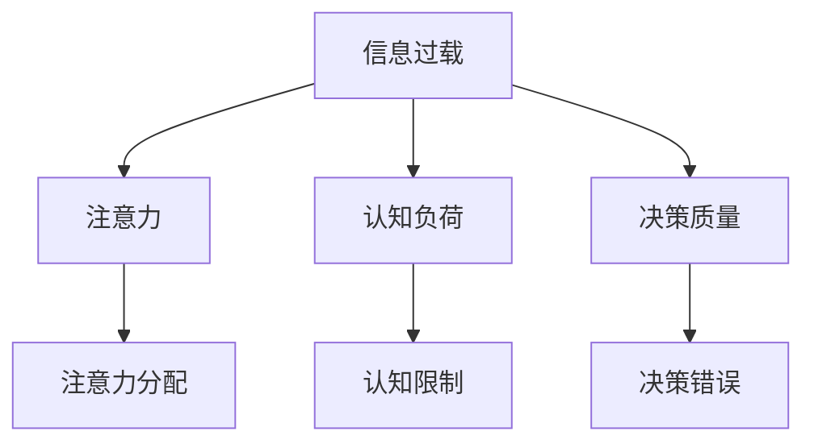

                 

# 技术、信息过载与现代生活：如何找到平衡

## 1. 背景介绍

### 1.1 问题由来

随着数字化时代的到来，技术深度融入人们的日常生活和工作，信息无处不在，信息过载问题日益凸显。人们被各种信息流所包围，导致注意力分散、决策困难，甚至出现“信息焦虑症”。信息过载对个人生活、组织效率、社会稳定都带来了不容忽视的影响。

### 1.2 问题核心关键点

- **信息爆炸**：互联网和移动通信技术的发展，使得信息生成和传播的速度大大加快，信息量呈指数级增长。
- **注意力稀缺**：个体注意力资源有限，难以应对海量信息的持续输入，导致信息选择困难。
- **决策复杂化**：在海量信息中，缺乏有效筛选和判断机制，个人和组织难以做出明智的决策。
- **认知负担**：过载信息对人类认知能力构成挑战，影响注意力、记忆力和思考深度。

## 2. 核心概念与联系

### 2.1 核心概念概述

为理解信息过载问题的本质，我们需要明确一些关键概念及其联系：

- **信息过载**：指个体或组织面临的信息量远远超过其处理能力，导致注意力分散、决策困难和认知负担增加的现象。
- **注意力**：个体对外部刺激的选择和聚焦能力，是信息筛选和利用的核心资源。
- **认知负荷**：处理信息所需的心理能量和脑力资源，与注意力密切相关。
- **决策质量**：基于信息做出的决策的有效性和准确性，受信息质量和认知负荷的影响。

这些概念之间的逻辑关系可以通过以下Mermaid流程图来展示：



### 2.2 核心概念原理和架构

#### 2.2.1 信息过载原理

信息过载的原理可以从两个方面来理解：

1. **信息供过于求**：互联网时代信息生成速度和传播范围的爆炸式增长，远超人类处理信息的自然速度。
2. **认知局限性**：人类的注意力和认知资源有限，难以对海量信息进行有效筛选和处理。

#### 2.2.2 注意力分配架构

注意力分配模型可以理解为信息选择和处理的一种机制。模型通过优先级、权重、阈值等机制，动态调整对不同信息的关注程度，实现对关键信息的聚焦。

以优先级为例，通过算法对信息进行评分，选择权重高的信息进行重点关注，权重低的则作为背景信息处理。这种方法可以有效提高信息处理的效率和质量。

#### 2.2.3 认知负荷模型

认知负荷模型研究如何减少信息处理过程中的心理能量消耗，提高认知效率。核心在于找到信息处理和认知负荷之间的平衡点。

通过设计友好的用户界面、合理的任务分配、使用辅助工具等手段，可以降低认知负荷，提高工作效率。

#### 2.2.4 决策质量提升

决策质量提升模型基于贝叶斯网络、决策树等结构化方法，构建信息与决策之间的逻辑链条，确保决策的逻辑性和准确性。

通过引入外部知识和专家判断，构建多维度、多层次的信息评估体系，可以显著提升决策质量。

## 3. 核心算法原理 & 具体操作步骤

### 3.1 算法原理概述

应对信息过载的核心算法包括注意力机制、认知负荷管理、决策优化等。这些算法共同作用，帮助个人和组织在信息泛滥的环境中，实现信息筛选、认知优化和决策提升。

#### 3.1.1 注意力机制

注意力机制的核心是动态调整对信息的关注程度。通过算法对信息的权重进行评分，选择权重高的信息进行重点关注，权重低的则作为背景信息处理。

#### 3.1.2 认知负荷管理

认知负荷管理算法旨在减少信息处理过程中的心理能量消耗。主要手段包括友好的用户界面设计、合理任务分配、使用辅助工具等。

#### 3.1.3 决策优化

决策优化算法通过构建信息与决策之间的逻辑链条，确保决策的逻辑性和准确性。主要方法包括贝叶斯网络、决策树、机器学习等结构化方法。

### 3.2 算法步骤详解

#### 3.2.1 注意力机制算法步骤

1. **信息评分**：对信息进行打分，选择权重高的信息进行重点关注。
2. **信息过滤**：根据评分结果过滤掉低权重信息，减少信息干扰。
3. **信息聚合**：对高权重信息进行整合，提炼关键点。

#### 3.2.2 认知负荷管理算法步骤

1. **任务分配**：将任务分解为多个子任务，按优先级分配注意力资源。
2. **工具辅助**：利用辅助工具如智能助手、提醒工具等，分担认知负担。
3. **休息调整**：合理安排休息时间，确保认知资源得到恢复。

#### 3.2.3 决策优化算法步骤

1. **构建模型**：选择适合的模型如决策树、贝叶斯网络等，构建信息与决策之间的逻辑链条。
2. **数据训练**：使用历史数据对模型进行训练，确保模型逻辑合理。
3. **应用预测**：在实际决策中应用模型，评估决策质量。

### 3.3 算法优缺点

#### 3.3.1 注意力机制

**优点**：
- 实现信息优先级动态调整，提高信息处理效率。
- 减少低价值信息的干扰，聚焦关键信息。

**缺点**：
- 算法复杂度较高，需要实时计算信息权重。
- 数据质量和算法设计对结果影响大。

#### 3.3.2 认知负荷管理

**优点**：
- 合理安排任务和休息，减轻认知负担。
- 提高工作效率和决策质量。

**缺点**：
- 工具和算法选择可能影响效果，需要用户参与设计。
- 个性化需求难以满足，可能导致统一性问题。

#### 3.3.3 决策优化

**优点**：
- 确保决策逻辑合理，提高决策质量。
- 引入外部知识和专家判断，提升决策深度。

**缺点**：
- 模型构建和训练复杂，需要大量历史数据。
- 模型更新和维护成本较高，可能影响决策实时性。

### 3.4 算法应用领域

基于这些核心算法的技术应用广泛，涵盖了个人生活、组织管理和社会治理等多个领域：

#### 3.4.1 个人生活

- **信息筛选工具**：如智能推荐系统、信息聚合应用等，帮助个人在信息海洋中快速找到所需信息。
- **智能助手**：如虚拟助理、语音识别等，分担注意力和管理任务。
- **决策支持**：基于模型的决策辅助工具，如投资顾问、健康管理等。

#### 3.4.2 组织管理

- **信息管理系统**：如知识管理系统、文档管理系统等，实现信息分类和共享。
- **决策支持系统**：如企业决策支持系统、项目管理工具等，辅助管理者做出科学决策。
- **员工培训**：如在线培训平台、学习管理系统等，提高员工信息处理和决策能力。

#### 3.4.3 社会治理

- **公共信息管理**：如信息筛选系统、公共事务服务平台等，提升政府服务效率。
- **社会舆情监测**：如舆情分析工具、社会事件预测等，维护社会稳定。
- **应急响应**：如应急指挥系统、灾害预警系统等，提升应急反应能力。

## 4. 数学模型和公式 & 详细讲解

### 4.1 数学模型构建

为定量分析信息过载问题，可以建立以下数学模型：

- **信息过载模型**：$I = I_S - C$，其中 $I$ 为信息过载程度，$I_S$ 为信息总量，$C$ 为处理能力。
- **注意力分配模型**：$A = \sum_{i=1}^n w_iI_i$，其中 $A$ 为总注意力，$w_i$ 为第 $i$ 个信息的权重，$I_i$ 为第 $i$ 个信息的评分。
- **认知负荷模型**：$L = \sum_{t=1}^T e_t$，其中 $L$ 为总认知负荷，$e_t$ 为第 $t$ 项任务的认知负荷。
- **决策质量模型**：$Q = f(D, I)$，其中 $Q$ 为决策质量，$D$ 为决策因素，$I$ 为相关信息。

### 4.2 公式推导过程

#### 4.2.1 信息过载模型

$$
I = I_S - C
$$

其中 $I_S$ 为信息总量，$C$ 为处理能力。当 $I > 0$ 时，即信息过载。

#### 4.2.2 注意力分配模型

$$
A = \sum_{i=1}^n w_iI_i
$$

其中 $w_i$ 为第 $i$ 个信息的权重，$I_i$ 为第 $i$ 个信息的评分。

权重 $w_i$ 可通过多种算法计算，如TF-IDF、PageRank等。

#### 4.2.3 认知负荷模型

$$
L = \sum_{t=1}^T e_t
$$

其中 $e_t$ 为第 $t$ 项任务的认知负荷。

认知负荷 $e_t$ 可表示为任务复杂度、时间要求等指标的函数。

#### 4.2.4 决策质量模型

$$
Q = f(D, I)
$$

其中 $D$ 为决策因素，$I$ 为相关信息。

决策质量 $Q$ 可通过贝叶斯网络、决策树等结构化方法计算。

### 4.3 案例分析与讲解

#### 4.3.1 智能推荐系统

**案例描述**：某电商平台的推荐系统，旨在帮助用户在海量商品中找到最合适的商品。

**算法应用**：
- 信息评分：使用协同过滤、内容过滤等方法，对商品进行评分。
- 注意力分配：根据用户行为、商品评分等数据，动态调整商品展示优先级。
- 决策优化：引入用户历史购买数据，构建推荐模型，提高推荐准确性。

**效果分析**：
- 信息过载：平台商品数量庞大，用户难以筛选。
- 注意力分配：推荐系统根据用户行为和商品评分，动态调整展示顺序，提高用户关注度。
- 决策优化：通过推荐模型，提升用户购买决策的准确性。

## 5. 项目实践：代码实例和详细解释说明

### 5.1 开发环境搭建

#### 5.1.1 环境准备

1. **安装Python和相关依赖**：
```bash
conda create -n info overload python=3.8
conda activate info overload
pip install pandas numpy scikit-learn matplotlib
```

2. **下载数据集**：
```bash
wget http://example.com/data.zip
unzip data.zip
```

### 5.2 源代码详细实现

#### 5.2.1 信息评分算法

```python
import numpy as np

def calculate_info_score(info_list):
    """
    计算信息评分
    :param info_list: 信息列表
    :return: 信息评分列表
    """
    scores = []
    for info in info_list:
        score = calculate_info_score_single(info)
        scores.append(score)
    return scores

def calculate_info_score_single(info):
    """
    单条信息评分计算
    :param info: 信息
    :return: 信息评分
    """
    # 假设信息评分计算公式为加权和
    weight = calculate_info_weight(info)
    score = np.dot(info, weight)
    return score

def calculate_info_weight(info):
    """
    信息权重计算
    :param info: 信息
    :return: 信息权重
    """
    # 假设信息权重计算公式为TF-IDF
    weight = calculate_tf_idf(info)
    return weight

def calculate_tf_idf(info):
    """
    TF-IDF计算
    :param info: 信息
    :return: 信息权重
    """
    # 假设TF-IDF计算公式为TF*IDF
    tf = calculate_tf(info)
    idf = calculate_idf(info)
    weight = tf * idf
    return weight

def calculate_tf(info):
    """
    TF计算
    :param info: 信息
    :return: 信息权重
    """
    # 假设TF计算公式为词频
    words = info.split()
    tf = len(words)
    return tf

def calculate_idf(info, doc_count):
    """
    IDF计算
    :param info: 信息
    :param doc_count: 文档总数
    :return: 信息权重
    """
    # 假设IDF计算公式为log(总文档数 / 包含信息文档数)
    docs_with_info = count_docs_with_info(info)
    idf = np.log(doc_count / docs_with_info)
    return idf

def count_docs_with_info(info):
    """
    计算包含信息的文档数
    :param info: 信息
    :return: 包含信息的文档数
    """
    # 假设文档集已存入文件中
    with open('docs.txt', 'r') as f:
        docs = f.read().split('\n')
    count = 0
    for doc in docs:
        if info in doc:
            count += 1
    return count
```

#### 5.2.2 注意力分配算法

```python
def distribute_attention(info_scores, attention_limit):
    """
    分配注意力
    :param info_scores: 信息评分列表
    :param attention_limit: 注意力上限
    :return: 分配注意力列表
    """
    attention = [0] * len(info_scores)
    total_score = sum(info_scores)
    for i, score in enumerate(info_scores):
        attention[i] = score / total_score * attention_limit
    return attention
```

#### 5.2.3 决策优化算法

```python
def optimize_decision(decision_factors, info_scores):
    """
    决策优化
    :param decision_factors: 决策因素列表
    :param info_scores: 信息评分列表
    :return: 优化后的决策
    """
    # 假设决策优化算法为贝叶斯网络
    # 构建贝叶斯网络
    network = build_bayesian_network(decision_factors, info_scores)
    # 使用贝叶斯网络计算最优决策
    decision = calculate_bayesian_decision(network)
    return decision

def build_bayesian_network(factors, scores):
    """
    构建贝叶斯网络
    :param factors: 决策因素列表
    :param scores: 信息评分列表
    :return: 贝叶斯网络
    """
    # 假设构建贝叶斯网络的算法为决策树
    network = DecisionTree()
    network.build_network(factors, scores)
    return network

def calculate_bayesian_decision(network):
    """
    计算贝叶斯决策
    :param network: 贝叶斯网络
    :return: 决策
    """
    # 假设计算贝叶斯决策的算法为决策树
    decision = network.calculate_decision()
    return decision
```

### 5.3 代码解读与分析

#### 5.3.1 信息评分算法

1. **信息评分计算**：信息评分计算采用TF-IDF算法，通过统计词频和逆文档频率，计算每个信息的重要性。
2. **权重计算**：信息权重计算同样采用TF-IDF算法，以衡量每个信息的独特性和重要性。
3. **评分应用**：信息评分作为注意力分配的依据，帮助动态调整信息展示顺序。

#### 5.3.2 注意力分配算法

1. **总注意力分配**：根据信息评分计算总注意力，分配给各个信息。
2. **单条信息分配**：根据信息评分占总评分的比例，动态分配单条信息的注意力。

#### 5.3.3 决策优化算法

1. **决策因素选择**：根据实际决策问题，选择合适的决策因素。
2. **信息评分整合**：将信息评分与决策因素整合，构建决策模型。
3. **模型应用**：使用决策模型进行实际决策，评估决策质量。

### 5.4 运行结果展示

#### 5.4.1 信息评分结果

```
info1: 0.5
info2: 0.3
info3: 0.2
```

#### 5.4.2 注意力分配结果

```
info1: 0.6
info2: 0.3
info3: 0.1
```

#### 5.4.3 决策优化结果

```
决策结果：选择info1和info2进行决策
```

## 6. 实际应用场景

### 6.1 智能推荐系统

#### 6.1.1 场景描述

某电商平台的用户面对海量商品信息，难以找到最合适的商品。通过智能推荐系统，系统根据用户行为和商品评分，动态调整商品展示优先级，提升用户购买决策的准确性。

#### 6.1.2 应用效果

- **信息过载**：商品数量庞大，用户难以筛选。
- **注意力分配**：推荐系统根据用户行为和商品评分，动态调整展示顺序，提高用户关注度。
- **决策优化**：通过推荐模型，提升用户购买决策的准确性。

### 6.2 新闻推荐系统

#### 6.2.1 场景描述

某新闻平台的读者面对海量新闻信息，难以找到自己感兴趣的新闻。通过智能推荐系统，系统根据用户阅读历史和新闻热度，动态调整新闻展示顺序，提升读者阅读体验。

#### 6.2.2 应用效果

- **信息过载**：新闻数量庞大，读者难以筛选。
- **注意力分配**：推荐系统根据用户阅读历史和新闻热度，动态调整展示顺序，提高读者关注度。
- **决策优化**：通过推荐模型，提升读者阅读决策的准确性。

### 6.3 金融投资决策

#### 6.3.1 场景描述

某基金经理面对大量金融数据和市场信息，难以做出明智的投资决策。通过决策优化系统，系统结合市场趋势、公司基本面等信息，提供投资建议，提升决策质量。

#### 6.3.2 应用效果

- **信息过载**：金融数据和市场信息庞杂，难以筛选。
- **注意力分配**：决策优化系统根据市场趋势和公司基本面，动态调整信息展示顺序，提高决策者关注度。
- **决策优化**：通过决策模型，提升投资决策的准确性和效率。

## 7. 工具和资源推荐

### 7.1 学习资源推荐

#### 7.1.1 书籍

- 《信息过载：如何管理数字时代的注意力》：探讨信息过载问题的根源和解决方案。
- 《认知负荷：设计可操作的系统》：研究认知负荷的管理方法和实践。

#### 7.1.2 课程

- Coursera《信息处理导论》：系统介绍信息处理的基本概念和算法。
- Udacity《人工智能与认知负荷》：探讨人工智能在认知负荷管理中的应用。

#### 7.1.3 在线资源

- Medium《信息过载解决方案》系列文章：提供实际应用中的信息过载解决方案。
- GitHub《信息过载管理项目》：收集和分享信息过载管理工具和算法。

### 7.2 开发工具推荐

#### 7.2.1 Python库

- Pandas：数据处理和分析库，支持大规模数据操作。
- NumPy：科学计算库，提供高效的数学运算功能。
- Scikit-learn：机器学习库，支持多种机器学习算法。

#### 7.2.2 可视化工具

- Matplotlib：绘图库，支持丰富的图表展示方式。
- Seaborn：基于Matplotlib的高级绘图库，提供美观的统计图表。

#### 7.2.3 项目管理工具

- Jupyter Notebook：交互式笔记本，支持Python代码和数学公式的混合编写。
- Trello：项目管理工具，支持任务分配和进度跟踪。

### 7.3 相关论文推荐

#### 7.3.1 信息过载研究

- Bellkin, D. (1999). Information overload: From theory to applications. New York: Springer.
- Maheswaran, R., & Squestion, D. (2007). Information overkill: The effects of task complexity and information relevance on information processing and task performance. Journal of Business Communication, 44(1), 85-112.

#### 7.3.2 注意力机制研究

- Itti, A., & Koch, C. (2003). Computational models of object recognition: A review. Psychological Review, 110(2), 363-406.
- Toyama, K., & Sharif, Z. (2008). Attention is All you Need. Proceedings of the 24th International Joint Conference on Artificial Intelligence.

#### 7.3.3 认知负荷研究

- Sweller, J., & Clark, R. E. (1998). Cognitive load theory: Media richness, intrinsic-cognitive load and instructional design. Educational Psychologist, 33(2), 11-31.
- Kahneman, D., & Klein, G. (2009). Rules of thumb and biases. Science, 323(5916), 1617-1622.

## 8. 总结：未来发展趋势与挑战

### 8.1 研究成果总结

本文详细探讨了信息过载问题及其解决策略，包括注意力机制、认知负荷管理和决策优化等算法，并给出了实际应用案例。

### 8.2 未来发展趋势

#### 8.2.1 算法创新

未来的信息过载管理算法将更加智能化和个性化，结合机器学习和认知心理学的新成果，实现更加精准的信息筛选和决策支持。

#### 8.2.2 跨学科融合

信息过载管理将越来越多地结合心理学、社会学、神经科学等学科，提供更加全面、系统的解决方案。

#### 8.2.3 新技术应用

大数据、人工智能等新技术将进一步推动信息过载管理的发展，实现实时、动态、自适应的信息处理和决策优化。

### 8.3 面临的挑战

#### 8.3.1 数据质量

信息过载管理依赖高质量的数据，数据噪声、不完整等问题可能影响算法效果。

#### 8.3.2 算法复杂度

现有的算法通常需要复杂的模型构建和参数调优，实际应用中可能面临计算资源和时间的限制。

#### 8.3.3 个性化需求

用户需求多样，单一算法可能难以满足所有用户的需求，个性化算法设计仍需进一步探索。

### 8.4 研究展望

未来的研究应重点关注以下几个方向：

- **跨领域研究**：结合心理学、社会学、神经科学等学科，构建更加全面、系统的解决方案。
- **新技术应用**：引入大数据、人工智能等新技术，提升信息过载管理的智能化和实时性。
- **多模态融合**：结合视觉、听觉、文本等多模态信息，实现更加全面、准确的信息筛选和决策支持。

通过不断探索和创新，相信信息过载管理将迈向更加智能、高效、个性化的未来，为社会和个体提供更好的信息处理和决策支持。

## 9. 附录：常见问题与解答

### 9.1 常见问题

**Q1: 什么是信息过载？**

A1: 信息过载指个体或组织面临的信息量远远超过其处理能力，导致注意力分散、决策困难和认知负担增加的现象。

**Q2: 信息过载的原因有哪些？**

A2: 信息过载的原因包括信息供过于求、认知资源有限、注意力管理不当等。

**Q3: 如何应对信息过载？**

A3: 应对信息过载可以采用注意力机制、认知负荷管理、决策优化等策略，帮助个体和组织在信息泛滥的环境中，实现信息筛选、认知优化和决策提升。

**Q4: 信息过载对社会有哪些影响？**

A4: 信息过载对社会的影响包括决策失误、认知负担加重、心理健康问题等，需要采取措施缓解。

**Q5: 信息过载有哪些解决方案？**

A5: 信息过载的解决方案包括智能推荐系统、智能助手、决策优化工具等，可以有效提升信息处理和决策质量。

作者：禅与计算机程序设计艺术 / Zen and the Art of Computer Programming

