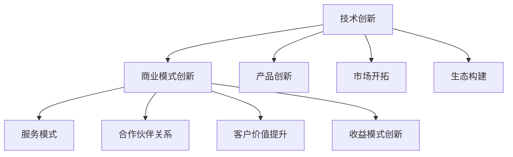

                 

## 1. 背景介绍

在人工智能(AI)的浪潮下，技术创新与商业模式创新已经成为了驱动企业发展的重要引擎。Lepton AI作为一个典型代表，通过将强大的AI技术与前瞻性的商业模式相结合，不仅实现了技术的突破，更开创了人工智能在垂直领域的全新应用场景。本文将深入探讨Lepton AI的技术创新与商业模式创新，并揭示其成功背后的核心理念和实施路径。

### 1.1 技术创新背景

人工智能领域的技术创新始于20世纪50年代，经历了从逻辑推理、专家系统到深度学习、神经网络的多次演变。近年来，随着计算能力的飞速提升和数据量的爆炸性增长，AI技术尤其是深度学习在图像识别、语音识别、自然语言处理等诸多领域取得了显著进展。然而，仅依赖技术突破已不足以支撑AI应用的广泛落地，商业模式创新成为了实现技术价值的重要手段。

### 1.2 商业模式创新背景

商业模式的创新，不仅仅是企业盈利模式和市场策略的调整，更是企业基于技术优势构建的新型价值链、供应链和生态系统。在AI时代，传统的B2B或B2C模式正逐步向SaaS（软件即服务）、BaaS（区块链即服务）、IoT（物联网）等新型商业模式转变，这不仅降低了AI技术的准入门槛，也打开了更多产业应用的场景。

## 2. 核心概念与联系

### 2.1 核心概念概述

Lepton AI的成功在于其对技术创新和商业模式创新的深度融合。以下是几个核心概念：

- **技术创新**：通过研发先进的AI技术，实现算法和模型的突破，提升产品的核心竞争力。
- **商业模式创新**：基于AI技术，构建创新的业务模式和商业模式，开辟新的市场空间和利润点。
- **双轮驱动**：以技术创新为引擎，以商业模式创新为导向，实现企业的持续增长。

这些概念之间的逻辑关系可以通过以下Mermaid流程图来展示：



### 2.2 核心概念原理和架构

- **技术创新**：技术创新包括算法研究、模型训练、技术积累等方面。通过大数据、深度学习、强化学习等前沿技术，不断提升AI模型的精度和泛化能力。架构上，构建基于云计算的分布式计算平台，支持大规模数据处理和模型训练。

- **商业模式创新**：商业模式创新包括产品形态、市场定位、合作伙伴、收益模式等方面。通过构建平台、开放API、云服务等新型服务模式，降低AI技术的进入门槛，同时通过合作和联盟，扩大市场覆盖面，提升客户价值。

## 3. 核心算法原理 & 具体操作步骤

### 3.1 算法原理概述

Lepton AI的技术创新主要集中在以下几个方面：

1. **深度学习框架优化**：针对通用深度学习框架（如TensorFlow、PyTorch）进行优化，提高计算效率和模型性能。
2. **神经网络结构改进**：设计新型神经网络结构（如ResNet、Inception等），提升模型深度和复杂度。
3. **数据增强与迁移学习**：通过数据增强和迁移学习方法，提升模型对新数据的适应能力。
4. **强化学习与自我优化**：引入强化学习算法，使模型具备自我优化和适应环境变化的能力。

### 3.2 算法步骤详解

1. **数据准备**：收集并预处理大规模数据集，确保数据的多样性和质量。
2. **模型设计**：选择合适的神经网络结构，设计合适的损失函数和优化器。
3. **模型训练**：使用优化器更新模型参数，最小化损失函数。
4. **模型评估与调优**：在验证集上评估模型性能，根据评估结果调整超参数。
5. **模型部署与监控**：将训练好的模型部署到生产环境，实时监控性能和异常。

### 3.3 算法优缺点

**优点**：
- **高效性**：通过算法优化和模型改进，提高计算效率，缩短训练和推理时间。
- **泛化能力**：通过迁移学习和数据增强，模型具备较强的泛化能力，适应新任务和新数据。
- **自优化能力**：通过引入强化学习，模型具备自我优化和适应环境变化的能力。

**缺点**：
- **资源需求高**：深度学习模型通常需要大量的计算资源和存储空间。
- **复杂性高**：模型设计复杂，训练和调优需要专业知识和经验。
- **解释性差**：深度学习模型黑箱特性，难以解释其决策过程。

### 3.4 算法应用领域

Lepton AI的技术创新主要应用于以下几个领域：

1. **计算机视觉**：通过优化深度学习框架和改进神经网络结构，实现高效、准确的图像识别和分类。
2. **自然语言处理**：通过改进语言模型和引入迁移学习，提升自然语言理解和生成能力。
3. **语音识别**：通过优化声学模型和改进数据增强方法，提高语音识别的准确性和鲁棒性。
4. **强化学习**：通过引入强化学习算法，实现智能决策和自我优化。

## 4. 数学模型和公式 & 详细讲解

### 4.1 数学模型构建

Lepton AI的技术创新涉及多个数学模型，以下是几个核心模型的构建：

1. **卷积神经网络(CNN)**：用于图像识别和分类任务，模型公式为：$$y = f(Wx + b)$$
2. **循环神经网络(RNN)**：用于序列数据处理和生成任务，模型公式为：$$y_t = f(Wx_t + Uy_{t-1} + b)$$
3. **注意力机制(Attention)**：用于增强模型对输入序列中重要信息的关注，模型公式为：$$a_i = \frac{e^{z_{i}}}{\sum_{j=1}^{n}e^{z_{j}}}$$
4. **自编码器(Autoencoder)**：用于数据压缩和降噪，模型公式为：$$y = Wx + b$$

### 4.2 公式推导过程

- **CNN模型**：$$y = f(Wx + b)$$
  - $W$ 为卷积核权重，$x$ 为输入特征，$b$ 为偏置项，$f$ 为激活函数。
  - 推导过程：通过前向传播和反向传播算法，最小化损失函数 $L$，得到参数 $W$ 和 $b$ 的更新公式。

- **RNN模型**：$$y_t = f(Wx_t + Uy_{t-1} + b)$$
  - $W$ 为权重矩阵，$x_t$ 为当前时间步的输入，$y_{t-1}$ 为上一时间步的输出，$U$ 为连接矩阵，$f$ 为激活函数。
  - 推导过程：通过递归地计算 $y_{t-1}$，结合当前时间步的输入，计算当前时间步的输出。

- **注意力机制**：$$a_i = \frac{e^{z_{i}}}{\sum_{j=1}^{n}e^{z_{j}}}$$
  - $z_i$ 为注意力得分，$e^{z_i}$ 为注意力权重，$\sum_{j=1}^{n}e^{z_{j}}$ 为归一化因子。
  - 推导过程：通过计算注意力得分，最大化注意力权重，得到注意力向量。

- **自编码器模型**：$$y = Wx + b$$
  - $W$ 为编码器权重，$x$ 为输入数据，$b$ 为偏置项，$y$ 为解码器输出。
  - 推导过程：通过前向传播和反向传播算法，最小化重构误差 $L$，得到参数 $W$ 和 $b$ 的更新公式。

### 4.3 案例分析与讲解

以Lepton AI在自然语言处理领域的案例为例：

- **BERT模型的构建与训练**：
  - 数据准备：使用大规模语料库进行预训练。
  - 模型设计：采用Transformer结构，引入注意力机制和双向编码。
  - 模型训练：通过优化器更新参数，最小化预测误差。
  - 模型评估：在验证集上评估模型性能，调整超参数。
  - 模型部署：将训练好的模型部署到生产环境，实时处理用户输入。

## 5. 项目实践：代码实例和详细解释说明

### 5.1 开发环境搭建

- **Python环境**：安装Python 3.7及以上版本。
- **深度学习框架**：安装TensorFlow 2.0及以上版本。
- **数据处理工具**：安装NumPy、Pandas、Scikit-learn等。

### 5.2 源代码详细实现

以下以图像分类任务为例，展示Lepton AI在卷积神经网络方面的代码实现。

```python
import tensorflow as tf
from tensorflow.keras import layers, models

# 定义CNN模型
def create_model(input_shape):
    model = models.Sequential()
    model.add(layers.Conv2D(32, (3, 3), activation='relu', input_shape=input_shape))
    model.add(layers.MaxPooling2D((2, 2)))
    model.add(layers.Conv2D(64, (3, 3), activation='relu'))
    model.add(layers.MaxPooling2D((2, 2)))
    model.add(layers.Conv2D(128, (3, 3), activation='relu'))
    model.add(layers.MaxPooling2D((2, 2)))
    model.add(layers.Flatten())
    model.add(layers.Dense(64, activation='relu'))
    model.add(layers.Dense(10, activation='softmax'))
    return model

# 加载数据集
(x_train, y_train), (x_test, y_test) = tf.keras.datasets.mnist.load_data()
x_train = x_train.reshape(-1, 28, 28, 1)
x_test = x_test.reshape(-1, 28, 28, 1)

# 创建模型并编译
model = create_model(input_shape=(28, 28, 1))
model.compile(optimizer='adam', loss='categorical_crossentropy', metrics=['accuracy'])

# 训练模型
model.fit(x_train, y_train, epochs=10, validation_data=(x_test, y_test))
```

### 5.3 代码解读与分析

- **模型定义**：通过Keras API定义卷积神经网络，包含卷积层、池化层、全连接层等。
- **数据加载**：使用MNIST数据集，将数据转化为张量。
- **模型编译**：设置优化器、损失函数、评估指标。
- **模型训练**：通过fit方法进行模型训练，验证集上进行性能评估。

### 5.4 运行结果展示

在训练过程中，可以通过TensorBoard进行实时监控，展示训练损失和准确率的曲线变化。通过可视化工具，如Matplotlib、Seaborn等，展示训练结果和模型性能。

```python
import tensorflow as tf
from tensorflow.keras import layers, models
import matplotlib.pyplot as plt

# 定义CNN模型
def create_model(input_shape):
    model = models.Sequential()
    model.add(layers.Conv2D(32, (3, 3), activation='relu', input_shape=input_shape))
    model.add(layers.MaxPooling2D((2, 2)))
    model.add(layers.Conv2D(64, (3, 3), activation='relu'))
    model.add(layers.MaxPooling2D((2, 2)))
    model.add(layers.Conv2D(128, (3, 3), activation='relu'))
    model.add(layers.MaxPooling2D((2, 2)))
    model.add(layers.Flatten())
    model.add(layers.Dense(64, activation='relu'))
    model.add(layers.Dense(10, activation='softmax'))
    return model

# 加载数据集
(x_train, y_train), (x_test, y_test) = tf.keras.datasets.mnist.load_data()
x_train = x_train.reshape(-1, 28, 28, 1)
x_test = x_test.reshape(-1, 28, 28, 1)

# 创建模型并编译
model = create_model(input_shape=(28, 28, 1))
model.compile(optimizer='adam', loss='categorical_crossentropy', metrics=['accuracy'])

# 训练模型并保存结果
history = model.fit(x_train, y_train, epochs=10, validation_data=(x_test, y_test))

# 绘制损失和准确率曲线
plt.plot(history.history['loss'], label='Train Loss')
plt.plot(history.history['val_loss'], label='Validation Loss')
plt.plot(history.history['accuracy'], label='Train Accuracy')
plt.plot(history.history['val_accuracy'], label='Validation Accuracy')
plt.xlabel('Epoch')
plt.ylabel('Loss/Accuracy')
plt.legend()
plt.show()
```

## 6. 实际应用场景

### 6.1 智能安防系统

Lepton AI在智能安防系统中的应用，通过计算机视觉技术，实现视频监控、人脸识别、异常检测等功能。通过优化深度学习模型和引入强化学习算法，系统能够实时处理大量视频流，快速识别异常行为，保障公共安全。

### 6.2 智慧医疗系统

在智慧医疗系统中，Lepton AI通过自然语言处理技术，实现电子病历分析、患者问答、智能诊断等功能。通过改进语言模型和引入迁移学习，系统能够理解和处理复杂的医疗文本，提供准确的医疗建议和决策支持。

### 6.3 金融风险控制系统

金融领域中，Lepton AI通过深度学习技术，实现风险评估、欺诈检测、信用评分等功能。通过优化神经网络结构和引入强化学习，系统能够实时分析海量金融数据，识别潜在的风险点和欺诈行为，保障金融安全。

### 6.4 未来应用展望

未来，Lepton AI将在更多领域展现其技术创新和商业模式创新的优势：

- **自动驾驶**：通过计算机视觉和深度学习技术，实现精准的车辆控制和路径规划，提升驾驶安全性和效率。
- **智能家居**：通过语音识别和自然语言处理技术，实现智能化的家居控制和场景变换，提升用户的生活体验。
- **工业自动化**：通过图像识别和强化学习技术，实现智能化的工业检测和维护，提升生产效率和产品质量。

## 7. 工具和资源推荐

### 7.1 学习资源推荐

- **《深度学习》书籍**：Ian Goodfellow等著，全面介绍深度学习的基本理论和实践。
- **CS231n课程**：斯坦福大学的计算机视觉课程，涵盖图像识别、目标检测、语义分割等多个方面。
- **ArXiv论文**：查找最新的人工智能研究论文，获取前沿技术动态。
- **Kaggle竞赛**：参与AI相关的数据科学竞赛，提升实战能力和创新思维。

### 7.2 开发工具推荐

- **Jupyter Notebook**：交互式编程环境，支持Python、R等多种语言。
- **TensorFlow**：强大的深度学习框架，支持分布式计算和模型优化。
- **PyTorch**：灵活的深度学习框架，支持动态图和静态图。
- **Keras**：简单易用的深度学习框架，适合初学者和快速原型开发。

### 7.3 相关论文推荐

- **ImageNet大规模视觉识别挑战赛（ILSVRC）**：展示计算机视觉技术的最新进展。
- **自然语言处理会议（ACL、EMNLP）**：展示自然语言处理领域的最新研究。
- **强化学习会议（ICML、NeurIPS）**：展示强化学习技术的最新应用。

## 8. 总结：未来发展趋势与挑战

### 8.1 研究成果总结

Lepton AI通过技术创新和商业模式创新，实现了AI技术的深度应用，取得了显著的成果。技术创新主要集中在深度学习框架优化、神经网络结构改进、数据增强与迁移学习、强化学习与自我优化等方面。商业模式创新主要集中在平台化、开放API、云服务、合作与联盟、客户价值提升和收益模式创新等方面。

### 8.2 未来发展趋势

未来，Lepton AI将进一步深化技术创新和商业模式创新，推动AI技术在更多领域落地应用：

- **技术创新**：继续优化深度学习框架，改进神经网络结构，提升模型的计算效率和泛化能力。
- **商业模式创新**：进一步构建平台、开放API、云服务、合作与联盟，提升AI技术的市场覆盖面和用户价值。
- **多领域应用**：拓展AI技术在智能安防、智慧医疗、金融风险控制、自动驾驶、智能家居、工业自动化等多个领域的应用。

### 8.3 面临的挑战

尽管Lepton AI在技术创新和商业模式创新方面取得了显著进展，但仍面临以下挑战：

- **数据隐私和安全**：在AI应用中，数据隐私和安全问题尤为突出。如何在保障数据隐私和安全的前提下，实现模型的训练和应用，是一大挑战。
- **模型解释性和透明度**：AI模型的黑箱特性，难以解释其决策过程，这对于金融、医疗等高风险领域尤为重要。
- **技术壁垒和成本**：AI技术的实现和应用需要高昂的计算资源和专业技能，如何降低进入门槛，提升技术普及度，是另一大挑战。
- **算法偏见和公平性**：AI模型可能学习到数据中的偏见，导致不公平的决策，如何检测和消除算法偏见，确保公平性，仍需深入研究。

### 8.4 研究展望

未来，Lepton AI需要在以下几个方面进一步加强研究：

- **隐私保护技术**：开发隐私保护算法和模型，实现数据隐私和安全的双重保障。
- **模型解释性**：引入可解释性技术，提高AI模型的透明度和可信度。
- **技术普及**：通过教育和培训，降低AI技术的准入门槛，推动技术的广泛应用。
- **公平性算法**：研究公平性算法和评估指标，确保AI模型的公平性和公正性。

## 9. 附录：常见问题与解答

**Q1：如何评估模型性能？**

A: 模型的性能评估主要通过训练集和验证集的准确率、精确率、召回率、F1值等指标进行衡量。在实际应用中，还需考虑模型的鲁棒性、泛化能力和实际效果。

**Q2：如何优化模型参数？**

A: 模型参数的优化主要通过梯度下降算法进行。需设置合适的学习率、批次大小、迭代轮数等超参数，同时使用正则化技术如L2正则、Dropout等，防止过拟合。

**Q3：如何提高模型的泛化能力？**

A: 提高模型的泛化能力需从数据、模型和训练三个方面进行优化。通过数据增强、迁移学习和正则化等技术，提升模型的泛化能力。

**Q4：如何保证模型的安全性？**

A: 模型的安全性需从数据、模型和应用三个方面进行保障。需对数据进行清洗和加密，对模型进行审计和监控，对应用进行防护和加固。

**Q5：如何降低技术壁垒？**

A: 降低技术壁垒需从教育、培训和工具支持三个方面进行努力。通过教育和培训，提升从业者的技术能力；通过工具支持，降低技术的准入门槛；通过社区和开源项目，促进技术的普及和共享。

---

作者：禅与计算机程序设计艺术 / Zen and the Art of Computer Programming

