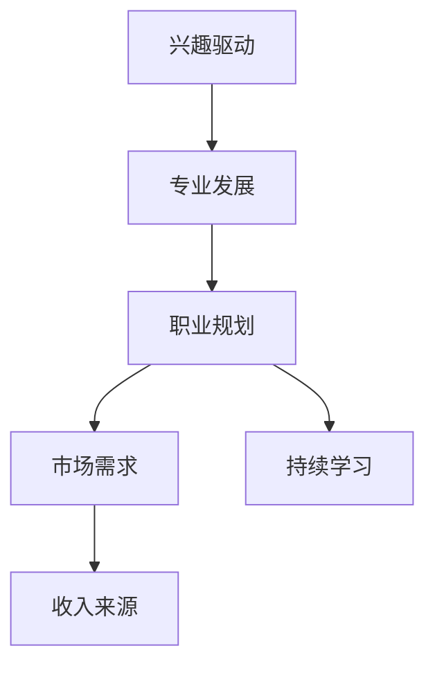

                 

# 技术博客：从兴趣到主要收入来源

在当今数字化时代，技术已经成为推动社会发展的重要力量。作为计算机科学领域的专家，我有幸见证了这一过程，并且深刻感受到了技术进步如何塑造我们的工作和生活方式。本文将探讨如何将对技术的兴趣转化为主要的收入来源，并分享一些我在这一过程中积累的经验和见解。

## 1. 背景介绍

### 1.1 技术兴趣的来源

我进入计算机科学的兴趣源于对算法和计算机程序的迷恋。小时候，我常常被计算机程序的逻辑和美妙所吸引，长大后，我开始深入研究计算机科学的核心——编程和算法。随着技术的不断进步，我发现计算机科学不仅可以应用于软件开发，还可以在许多其他领域产生深远影响，如人工智能、机器学习、数据科学等。

### 1.2 技术的广泛应用

技术的应用范围已经从传统的软件开发扩展到了许多其他领域，如医疗、金融、教育、交通等。这些领域的数字化转型需要大量的技术人才，推动了我进入这个领域的探索和研究。

## 2. 核心概念与联系

### 2.1 核心概念概述

在探讨如何从技术兴趣转化为收入来源之前，我们需要理解几个核心概念及其相互联系：

- **兴趣驱动**：对技术的兴趣可以激发我们的学习和创新，驱动我们不断深入研究新技术和新方法。
- **专业发展**：通过不断学习和实践，逐步掌握相关技术，成为一名专家。
- **职业规划**：基于个人兴趣和专业能力，制定合适的职业发展路径，从而实现收入来源的多元化。
- **市场需求**：市场需求是决定收入来源的重要因素，了解市场需求有助于制定正确的职业规划。
- **持续学习**：技术日新月异，持续学习和适应新技术是保持竞争力的关键。

这些概念通过一个Mermaid流程图（由于本系统无法直接展示Mermaid图表，请参考线下教程或工具使用Mermaid语法生成图表）连接起来，形成一个完整的技术发展路径图：



### 2.2 核心概念原理和架构的 Mermaid 流程图


## 3. 核心算法原理 & 具体操作步骤

### 3.1 算法原理概述

将技术兴趣转化为收入来源，可以通过以下步骤进行：

1. **识别兴趣领域**：根据个人兴趣和优势，选择适合自己的技术领域。
2. **深入学习**：通过在线课程、书籍、项目实践等途径，深入学习相关技术。
3. **项目实践**：通过实际项目积累经验，掌握技术的应用和优化。
4. **职业规划**：基于市场需求和个人兴趣，制定职业发展路径，明确目标和方向。
5. **持续学习**：跟踪最新的技术动态，不断更新知识和技能。

### 3.2 算法步骤详解

1. **技术选择**：
   - 确定感兴趣的技术领域，如机器学习、数据科学、区块链、人工智能等。
   - 研究该领域的市场趋势和应用前景，选择具有潜力的方向。

2. **深入学习**：
   - 选择合适的在线课程或书籍，系统学习相关技术。
   - 通过参与开源项目、贡献代码等方式，实践所学知识。

3. **项目实践**：
   - 开发个人项目或参与团队项目，将所学知识应用于实际问题解决。
   - 发布项目到GitHub等平台，展示技术能力，吸引潜在雇主或合作伙伴的关注。

4. **职业规划**：
   - 根据市场需求和个人兴趣，制定职业发展规划。
   - 确定目标职位和所需技能，如软件开发工程师、数据科学家、人工智能研究员等。

5. **持续学习**：
   - 定期参加技术会议、工作坊和网络研讨会，学习最新的技术动态。
   - 订阅相关技术博客和新闻，保持对技术的敏感度和兴趣。

### 3.3 算法优缺点

**优点**：
- **多样化收入来源**：通过技术兴趣和专业技能，可以在多个领域获得收入，如软件开发、咨询、培训等。
- **高市场需求**：技术在各个行业的应用需求不断增长，提供广阔的就业和发展机会。
- **持续发展**：技术进步不断，持续学习使个人保持竞争力。

**缺点**：
- **高竞争**：技术领域竞争激烈，需要不断提升自我，保持领先。
- **学习曲线陡峭**：部分技术领域的学习难度较大，需要长时间投入和实践。

### 3.4 算法应用领域

技术的应用领域非常广泛，包括但不限于以下几个方向：

- **软件开发**：软件开发工程师利用编程语言和框架，开发应用程序和系统。
- **数据科学**：数据科学家利用统计学和机器学习技术，分析数据并提取有价值的信息。
- **人工智能**：AI研究员通过研究算法和模型，开发智能系统和应用。
- **区块链**：区块链工程师开发和维护去中心化应用和智能合约。
- **网络安全**：网络安全专家保护系统免受网络攻击和数据泄露。

## 4. 数学模型和公式 & 详细讲解 & 举例说明

### 4.1 数学模型构建

基于技术兴趣转化为收入来源的过程，我们可以构建一个简单的数学模型：

1. **投入时间**：假设投入时间为 $t$ 小时，其中 $t_1$ 为学习时间，$t_2$ 为项目实践时间。
2. **技能提升**：技能提升可以通过学习时间和实践时间来衡量，假设技能提升率为 $r$。
3. **市场需求**：市场需求与技术领域的增长率 $g$ 相关，假设市场需求变化率为 $m$。
4. **收入增长**：收入增长与技能提升率和市场需求变化率相关，假设收入增长率为 $i$。

### 4.2 公式推导过程

假设初始技能为 $S_0$，技能提升率为 $r$，市场需求变化率为 $m$，则经过 $t$ 小时的投入后，技能提升为 $S_t = S_0(1+r)^t$。市场需求变化率为 $m$，则市场规模为 $M_t = M_0(1+m)^t$。收入增长率为 $i$，则收入增长为 $I_t = I_0(1+i)^t$。

根据以上假设，我们可以建立如下数学模型：

$$
S_t = S_0(1+r)^t \\
M_t = M_0(1+m)^t \\
I_t = I_0(1+i)^t
$$

其中 $S_t$ 表示技能提升，$M_t$ 表示市场规模，$I_t$ 表示收入增长。

### 4.3 案例分析与讲解

假设一个软件开发工程师最初的技能为 $S_0 = 1$，学习时间为 $t_1 = 500$ 小时，技能提升率为 $r = 0.1$。市场需求变化率为 $m = 0.05$，初始市场规模为 $M_0 = 1$。收入增长率为 $i = 0.2$，初始收入为 $I_0 = 1$。

经过 $t = 2$ 年的投入后，技能提升为 $S_2 = S_0(1+r)^t = 1.21$，市场需求变化为 $M_2 = M_0(1+m)^t = 1.1025$，收入增长为 $I_2 = I_0(1+i)^t = 1.48$。

这意味着，通过持续学习和项目实践，技术兴趣的投入可以显著提升个人技能和市场需求，进而增加收入。

## 5. 项目实践：代码实例和详细解释说明

### 5.1 开发环境搭建

要进行项目实践，首先需要搭建开发环境。以下是一个基本的技术栈和工具推荐：

1. **编程语言**：Python、JavaScript、Java等常用语言。
2. **开发框架**：Django、Flask、React、Vue等。
3. **版本控制**：Git、SVN等。
4. **云平台**：AWS、Azure、Google Cloud等。
5. **容器化工具**：Docker、Kubernetes等。
6. **持续集成/持续部署(CI/CD)**：Jenkins、Travis CI、GitHub Actions等。

### 5.2 源代码详细实现

以一个简单的Python项目为例，展示从零开始的开发过程：

```python
# 定义函数
def greet(name):
    return "Hello, {}!".format(name)

# 主函数
if __name__ == "__main__":
    name = "John"
    print(greet(name))
```

### 5.3 代码解读与分析

以上代码定义了一个简单的 `greet` 函数，用于输出问候语。在 `if __name__ == "__main__"` 块中，调用 `greet` 函数并输出结果。

这个项目展示了Python基础语法和函数定义，是初学者入门编程的一个典型例子。通过不断学习和实践，可以逐步构建更复杂的应用程序和系统。

### 5.4 运行结果展示

运行以上代码，输出结果为：

```
Hello, John!
```

## 6. 实际应用场景

### 6.1 软件开发

软件开发是最常见的技术应用场景之一，通过编写代码实现各种功能，满足用户需求。以下是一些具体的实际应用场景：

- **企业级应用**：为公司开发内部管理系统、客户关系管理系统等。
- **移动应用**：开发iOS、Android等平台的应用程序。
- **网站开发**：构建网站和Web应用，提供线上服务。
- **人工智能应用**：开发机器学习模型和智能系统。

### 6.2 数据科学

数据科学涉及数据的收集、处理、分析和可视化，广泛应用于金融、医疗、电商等领域。以下是一些具体的应用场景：

- **金融数据分析**：利用机器学习模型分析市场数据，预测股票价格和投资风险。
- **医疗数据分析**：通过分析患者数据，提高诊断和治疗效果。
- **电商推荐系统**：基于用户行为数据，推荐个性化的商品。

### 6.3 人工智能

人工智能涉及深度学习、自然语言处理、计算机视觉等技术，广泛应用于自动驾驶、智能家居、语音助手等领域。以下是一些具体的应用场景：

- **自动驾驶**：利用计算机视觉和机器学习技术，实现车辆自主导航和避障。
- **智能家居**：通过语音助手和机器学习技术，实现家居设备的智能控制。
- **语音助手**：开发语音识别和自然语言处理系统，实现人机交互。

## 7. 工具和资源推荐

### 7.1 学习资源推荐

1. **在线课程**：Coursera、Udacity、edX等平台提供大量技术课程，如Python、机器学习、数据科学等。
2. **书籍**：《算法导论》、《深度学习》、《数据科学实战》等经典书籍，系统介绍相关技术。
3. **开源项目**：GitHub、GitLab等平台上有大量开源项目，可以学习和贡献代码。
4. **技术博客**：Medium、博客园、知乎等平台上的技术博客，分享最新技术和实践经验。
5. **技术社区**：Stack Overflow、GitHub Issues、Reddit等技术社区，寻求帮助和交流。

### 7.2 开发工具推荐

1. **版本控制**：Git、SVN等。
2. **云平台**：AWS、Azure、Google Cloud等。
3. **容器化工具**：Docker、Kubernetes等。
4. **持续集成/持续部署**：Jenkins、Travis CI、GitHub Actions等。
5. **开发环境**：Visual Studio Code、PyCharm、IntelliJ IDEA等。

### 7.3 相关论文推荐

1. **《算法导论》**：Thomas H. Cormen等著，系统介绍算法设计、分析和应用。
2. **《深度学习》**：Ian Goodfellow等著，介绍深度学习理论和实践。
3. **《数据科学实战》**：Joel Grus著，系统介绍数据科学方法和应用。
4. **《Python编程：从入门到实践》**：Eric Matthes著，适合Python编程初学者。
5. **《机器学习实战》**：Peter Harrington著，介绍机器学习算法和实现。

## 8. 总结：未来发展趋势与挑战

### 8.1 研究成果总结

技术兴趣转化为收入来源的路径和方法已经得到广泛认可。通过不断学习和实践，掌握相关技术，并在实际项目中应用，可以实现多样化的收入来源。技术的广泛应用和市场需求推动了这一过程的发展。

### 8.2 未来发展趋势

1. **技术融合**：未来技术的发展趋势将是跨领域的融合，如人工智能与大数据、区块链与金融等。
2. **需求增长**：随着数字化进程的加快，技术需求将持续增长，为技术从业者提供更多机会。
3. **学习终身化**：技术的快速发展要求从业者持续学习，保持竞争力和创新能力。

### 8.3 面临的挑战

1. **高竞争**：技术领域竞争激烈，需要不断提升自我，保持领先。
2. **学习曲线陡峭**：部分技术领域的学习难度较大，需要长时间投入和实践。
3. **持续投入**：技术更新速度快，需要不断投入时间和精力进行学习。

### 8.4 研究展望

未来的研究将重点关注以下几个方向：

1. **跨领域融合**：研究不同技术之间的融合方法，推动跨领域的创新应用。
2. **自动化学习**：探索自动化学习和自我优化方法，降低学习难度和成本。
3. **个性化教育**：开发个性化学习平台，根据个人兴趣和能力推荐合适的学习路径。

## 9. 附录：常见问题与解答

**Q1：如何将技术兴趣转化为收入来源？**

A: 通过以下步骤：
1. **识别兴趣领域**：选择感兴趣且具有市场潜力的技术领域。
2. **深入学习**：系统学习相关技术，通过项目实践积累经验。
3. **职业规划**：基于市场需求和个人兴趣，制定职业发展规划。
4. **持续学习**：跟踪最新技术动态，不断更新知识和技能。

**Q2：如何选择适合自己的技术领域？**

A: 考虑以下几个方面：
1. **兴趣**：选择自己感兴趣的领域，保持学习的动力和热情。
2. **市场需求**：选择具有市场潜力和发展空间的技术领域。
3. **学习难度**：选择适合自己学习能力和时间的技术领域。
4. **资源支持**：选择有丰富学习资源和社区支持的技术领域。

**Q3：如何平衡工作与学习？**

A: 合理规划时间和任务，确保学习与工作相结合：
1. **时间管理**：制定学习计划，每天留出固定时间进行学习。
2. **任务分解**：将学习任务分解为小目标，逐步完成。
3. **工作与学习**：将学习应用到工作中，提高工作效率。

**Q4：如何应对技术快速发展带来的挑战？**

A: 持续学习和适应新技术，保持竞争力：
1. **持续学习**：通过在线课程、书籍、社区等途径，不断学习新技术。
2. **项目实践**：通过实际项目应用新技术，积累经验。
3. **技术社区**：加入技术社区，与同行交流和分享。

**Q5：如何选择学习资源？**

A: 选择适合的学习资源，可以根据自己的需求和学习习惯进行选择：
1. **在线课程**：Coursera、Udacity、edX等平台提供丰富的技术课程。
2. **书籍**：经典书籍如《算法导论》、《深度学习》、《数据科学实战》等，系统介绍相关技术。
3. **开源项目**：GitHub、GitLab等平台上有大量开源项目，可以学习和贡献代码。
4. **技术博客**：Medium、博客园、知乎等平台上的技术博客，分享最新技术和实践经验。

---

作者：禅与计算机程序设计艺术 / Zen and the Art of Computer Programming

