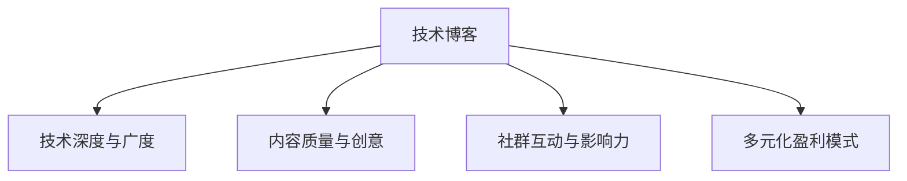

                 

# 技术博客：从爱好到主要收入来源

> 关键词：技术爱好,技术博客,收入来源,编程,写作,影响力,开源社区,企业合作

## 1. 背景介绍

### 1.1 问题由来
在现代信息技术飞速发展的今天，技术的运用已深刻影响着各行各业。对于热爱技术的人来说，通过技术撰写博客、分享经验已成为一种传播知识、提升影响力的重要途径。技术博客不仅是个人兴趣的延伸，更成为连接技术爱好者、企业和创新者的桥梁。随着博客内容的影响力不断提升，技术爱好者不仅实现了个人成长，还通过博客获取了丰厚回报。

### 1.2 问题核心关键点
为何技术博客会成为许多人重要的收入来源？这一转变背后的核心关键点包括：

- **技术深度与广度**：对某个技术领域有深入理解和广泛认知的技术博主更容易获取关注。
- **内容质量与创意**：高质量、有创意的原创内容能吸引大量读者，从而增加广告、赞助和付费订阅的机会。
- **社群互动与影响力**：通过与读者互动，技术博主可以积累大量忠实粉丝，提升自身影响力。
- **多元化盈利模式**：除了广告收入，技术博主还可以通过赞助、付费订阅、线上课程、企业合作等多种方式获取收益。

### 1.3 问题研究意义
研究技术博客从爱好到主要收入来源的过程，对于理解技术传播与变现的模式，以及技术博客的发展趋势具有重要意义：

- 洞察技术博客成功案例的共性，提炼核心要素。
- 分析如何通过技术博客实现商业化，帮助更多人实现从技术爱好到主要收入的转变。
- 总结技术博客的发展趋势和未来方向，为技术爱好者提供切实可行的参考。

## 2. 核心概念与联系

### 2.1 核心概念概述

技术博客作为一种信息传播形式，本质上是对某一技术领域的深入探索与分享。其核心概念包括：

- **技术博客**：通过博客平台分享技术内容，提供信息、经验和见解。
- **技术深度与广度**：对技术领域理解的程度和涉及的广度。
- **内容质量与创意**：内容的深度、原创性和创新性。
- **社群互动与影响力**：读者互动和社群影响力的大小。
- **多元化盈利模式**：通过广告、赞助、付费订阅、课程等多元化手段获取收益。

这些概念之间的逻辑关系可以通过以下Mermaid流程图来展示：



这个流程图展示技术博客的几个关键概念及其之间的关系：

1. **技术博客**是核心，依托对技术深度与广度的理解。
2. **内容质量与创意**决定了博客的吸引力。
3. **社群互动与影响力**是传播与变现的媒介。
4. **多元化盈利模式**是收入来源的多样化体现。

## 3. 核心算法原理 & 具体操作步骤
### 3.1 算法原理概述

技术博客的收入来源可通过多种算法和策略进行优化，主要涉及内容生成、用户互动和商业变现三个方面。

- **内容生成算法**：如SEO（搜索引擎优化）、内容推荐算法、情感分析等，用于提升内容曝光率和质量。
- **用户互动算法**：如社交网络分析、社区管理算法等，用于增强用户参与度和社群影响力。
- **商业变现算法**：如广告竞价、付费订阅模型、内容定价策略等，用于实现收入最大化。

### 3.2 算法步骤详解

技术博客从爱好到主要收入来源的步骤通常包括：

**Step 1: 选择合适的平台**
- 确定目标受众，选择合适的博客平台。如WordPress、Medium、知乎等。
- 考虑平台的易用性、推广便利性和社区活跃度。

**Step 2: 建立专业内容体系**
- 确定技术领域，进行深入学习和研究。
- 创建高质量、原创、实用的技术文章，逐步建立起专业的技术博客形象。

**Step 3: 优化内容质量与创意**
- 使用SEO优化提升文章在搜索引擎中的排名。
- 引入多媒体元素（如代码片段、图表等），提升内容的吸引力和可读性。
- 利用内容推荐算法，将文章推送给更多潜在读者。

**Step 4: 加强社群互动与影响力**
- 定期与读者互动，回答评论和提问，提升读者黏性。
- 创建社区论坛或微信群，增强社群影响力。
- 组织线上线下技术交流活动，扩大影响力。

**Step 5: 多元化盈利模式探索**
- 探索多种盈利模式，如广告收入、赞助、付费订阅、课程、电子书等。
- 制定合适的定价策略和市场推广计划，最大化收入。
- 利用社交媒体平台提升个人品牌和影响力。

### 3.3 算法优缺点

技术博客的盈利模式具有以下优点：

- **高自由度**：技术博主可以自由选择文章主题和发布频率，创作更加个性化和富有激情的内容。
- **受众广泛**：通过技术博客，技术博主可以触达全球范围内的技术爱好者和专业人士。
- **多样化盈利**：除了广告收入，还可以通过多种渠道实现收入多样化。

同时，技术博客的盈利模式也存在一些缺点：

- **盈利周期较长**：技术博客的成功往往需要较长时间的积累和坚持。
- **内容更新压力大**：需要不断更新内容以保持读者兴趣，这对时间和精力都是一种挑战。
- **竞争激烈**：技术领域竞争激烈，需要不断提升自身技术和内容质量，才能脱颖而出。

### 3.4 算法应用领域

技术博客的盈利模式在多个领域已得到应用，例如：

- **企业IT部门**：技术博客成为IT人员分享技术经验、展示技术实力的重要平台。
- **软件开发社区**：如Stack Overflow、GitHub等，技术博主通过博客分享技术解决方案，提升自身和社区的影响力。
- **产品经理**：通过博客分享产品设计和开发心得，提升自身市场地位和技术影响力。
- **科技媒体**：如TechCrunch、The Verge等，技术博主通过深度报道和评论，获取读者和广告收入。

## 4. 数学模型和公式 & 详细讲解 & 举例说明（备注：数学公式请使用latex格式，latex嵌入文中独立段落使用 $$，段落内使用 $)
### 4.1 数学模型构建

技术博客的收入模型可以通过多个数学模型来描述，主要涉及内容曝光率、用户参与度、广告收入和多元化盈利等多个方面。

假设技术博客的平均点击率为 $P$，每篇文章的平均阅读时间为 $T$，每千次曝光的平均广告收入为 $A$，每篇文章的平均付费订阅收入为 $S$，每篇文章的平均付费课程收入为 $C$。则总收入 $I$ 可以表示为：

$$
I = P \times T \times A + P \times T \times S + P \times T \times C
$$

### 4.2 公式推导过程

以广告收入为例，假设平均每篇文章的曝光次数为 $E$，则总收入 $A_{total}$ 可以表示为：

$$
A_{total} = A \times E \times T \times P
$$

其中，$A$ 为每千次曝光的广告收入，$E$ 为平均每篇文章的曝光次数，$T$ 为每篇文章的平均阅读时间，$P$ 为平均点击率。

通过上述公式，可以清晰地看到，技术博客的广告收入主要取决于曝光率、阅读时间和点击率。

### 4.3 案例分析与讲解

以某知名技术博客为例，该博客平均每篇文章的曝光次数为 $E=10^4$，平均阅读时间为 $T=5$ 分钟，平均点击率为 $P=0.01$，每千次曝光的广告收入为 $A=1000$。则平均每篇文章的广告收入 $A_{avg}$ 为：

$$
A_{avg} = A \times E \times T \times P = 1000 \times 10^4 \times 5 \times 0.01 = 50000
$$

类似地，通过推导其他收入来源的公式，技术博主可以更清晰地看到不同收入来源的影响因素，从而优化博客运营策略。

## 5. 项目实践：代码实例和详细解释说明
### 5.1 开发环境搭建

在进行技术博客项目开发前，需要搭建一个适合的技术环境，以下是Python开发环境的搭建步骤：

1. 安装Anaconda：从官网下载并安装Anaconda，用于创建独立的Python环境。
2. 创建并激活虚拟环境：
```bash
conda create -n blog-env python=3.8 
conda activate blog-env
```
3. 安装必要的Python包，如Flask、Jinja2等：
```bash
pip install flask Jinja2
```
4. 配置本地域名：通过`etc/hosts`文件配置本地域名，方便本地开发和测试。

### 5.2 源代码详细实现

以下是一个简单的Flask技术博客后端代码实现：

```python
from flask import Flask, render_template, request

app = Flask(__name__)

@app.route('/')
def home():
    return render_template('index.html')

@app.route('/blog', methods=['GET', 'POST'])
def blog():
    if request.method == 'POST':
        title = request.form['title']
        content = request.form['content']
        # 将数据保存到数据库或文件系统中
        return render_template('blog.html', title=title, content=content)
    else:
        return render_template('blog.html')

if __name__ == '__main__':
    app.run(debug=True)
```

上述代码创建了一个简单的Flask应用，包含了首页和博客文章发布页面。通过简单的HTML模板，可以展示博客文章列表和单个文章的详细信息。

### 5.3 代码解读与分析

以下是关键代码的实现细节：

- 通过Flask框架，创建了一个简单的Web应用。
- `@app.route` 装饰器用于定义路由，将请求映射到相应的函数。
- `render_template` 方法用于渲染HTML模板，动态生成网页内容。
- `request` 对象用于获取用户提交的表单数据。

这些代码实现了基本的博客功能，包括首页展示和博客文章发布。当然，在实际项目中，还需要进一步完善，如添加数据库支持、用户认证、文章分类、评论功能等。

### 5.4 运行结果展示

运行上述代码，可以通过浏览器访问`http://127.0.0.1:5000`，看到博客首页。点击“写博客”链接，可以进入博客文章发布页面，提交后，文章将展示在博客首页上。

## 6. 实际应用场景

### 6.1 企业IT部门

企业IT部门的技术人员通过技术博客分享自身项目经验、技术解决方案，不仅能提升自身影响力，还能展示技术实力，吸引潜在客户和合作伙伴。

**应用场景**：某企业IT部门的技术专家通过技术博客分享了一系列关于云计算和大数据的技术文章，吸引了大量IT从业人员阅读。不久后，某知名云计算公司找到该企业，希望合作开发新的云服务项目，企业通过技术博客建立了良好的行业口碑。

### 6.2 软件开发社区

在软件开发社区如GitHub等平台上，技术博主通过博客分享代码片段、项目进展和解决方案，提升自身和社区的影响力。

**应用场景**：某开源项目的技术负责人通过博客分享了项目设计和实现细节，吸引了大量开发者关注。不少开发者基于其博客内容，进行了项目改进和优化，提升了项目的整体质量。

### 6.3 产品经理

产品经理通过技术博客分享产品设计和开发心得，提升自身市场地位和技术影响力。

**应用场景**：某产品经理通过技术博客分享了产品的设计和开发过程，详细介绍了项目背景、技术选型、设计思路和开发难点。这些文章吸引了大量用户和开发者关注，为产品推广和合作提供了有力支持。

### 6.4 科技媒体

技术博主通过深度报道和评论，获取读者和广告收入。

**应用场景**：某科技媒体博主撰写了一系列关于最新科技趋势和产品的深度报道，吸引了大量读者关注。随着影响力的提升，不少科技公司与博主合作，通过广告和赞助获取收入。

## 7. 工具和资源推荐
### 7.1 学习资源推荐

为了帮助技术博主提升技术水平和运营能力，以下是一些优质的学习资源：

1. **《Python编程快速上手》**：适合初学者学习Python编程基础。
2. **《Flask Web开发实战》**：深入讲解Flask框架的用法和最佳实践。
3. **《SEO优化实战》**：介绍SEO原理和优化技巧，提升技术博客的曝光率。
4. **《内容营销策略》**：系统讲解内容营销的策略和方法，提升技术博客的读者黏性。
5. **《博客运营实战》**：分享博客运营的成功经验，提升技术博客的运营效率和收入。

通过学习这些资源，技术博主可以不断提升自己的技术水平和运营能力，为博客的成功打下坚实基础。

### 7.2 开发工具推荐

高效的技术博客开发离不开优秀的工具支持。以下是几款常用的开发工具：

1. **Flask**：轻量级Web框架，适合开发小型博客应用。
2. **Jinja2**：模板引擎，支持动态渲染HTML页面。
3. **GitHub**：开源代码托管平台，支持博客的发布和分享。
4. **Notion**：内容管理系统，支持创建博客、文章管理和社群互动。
5. **Adobe Photoshop**：图像编辑工具，用于制作高质量的博客图片。

合理利用这些工具，可以显著提升技术博客的开发效率和用户体验。

### 7.3 相关论文推荐

技术博客的发展也离不开相关研究的支持。以下是几篇经典的论文，推荐阅读：

1. **《博客传播与社会网络分析》**：介绍如何通过社交网络分析技术，提升技术博客的影响力和互动性。
2. **《博客内容的多元化盈利模式》**：讨论技术博客如何通过多元化盈利模式，实现收入最大化。
3. **《内容推荐算法的研究与实践》**：介绍基于协同过滤和深度学习的内容推荐算法，提升技术博客的曝光率和用户黏性。

这些论文代表了大规模技术博客运营的理论前沿，通过学习这些前沿成果，技术博主可以更好地理解运营策略和优化方法，提升博客的成功率。

## 8. 总结：未来发展趋势与挑战

### 8.1 总结

本文对技术博客从爱好到主要收入来源的过程进行了全面系统的介绍。首先阐述了技术博客的研究背景和意义，明确了技术博客成功案例的共性要素。其次，从原理到实践，详细讲解了技术博客的盈利算法和具体操作步骤，给出了技术博客的完整代码实现。同时，本文还探讨了技术博客在企业IT部门、软件开发社区、产品经理和科技媒体等多个领域的应用场景，展示了技术博客的广泛影响力。

通过本文的系统梳理，可以看到，技术博客通过高质量、原创、实用的技术分享，不仅实现了个人成长，还通过多种盈利模式获得了丰厚的回报。技术博客的成功不仅需要技术深度和广度，更需要内容质量与创意、社群互动与影响力、多元化盈利模式等多方面的协同发力。相信随着技术博客的不断发展和壮大，技术爱好者可以通过博客实现从爱好到主要收入的转变，为技术传播和落地应用贡献力量。

### 8.2 未来发展趋势

展望未来，技术博客的发展趋势主要包括以下几个方面：

1. **内容多样化和多媒体化**：技术博客将更加注重内容的丰富性和多媒体化，如图文并茂的代码展示、视频讲解等，提升用户体验。
2. **社区互动与协同创作**：技术博客将更加注重社区互动和协同创作，如评论系统、社区论坛、合作项目等，增强用户参与感和粘性。
3. **智能化内容推荐**：通过机器学习和大数据技术，实现智能化内容推荐，提升技术博客的曝光率和读者黏性。
4. **多元化的盈利模式**：技术博主将探索更多元化的盈利模式，如知识付费、SaaS产品、技术咨询等，实现收入多元化。
5. **个性化技术分享**：技术博主将更加注重个性化技术分享，通过精准定位读者需求，提供更有针对性的技术内容。
6. **跨界融合**：技术博客将与其他领域的内容形式（如视频、播客等）进行跨界融合，拓展技术传播的渠道和形式。

以上趋势将进一步推动技术博客的发展，使其成为技术传播的重要平台。技术博主需要不断学习新技术、新方法，提升内容质量和用户体验，才能在竞争激烈的市场中脱颖而出。

### 8.3 面临的挑战

尽管技术博客在技术传播和变现上取得了显著成效，但在迈向更加智能化、普适化应用的过程中，仍面临诸多挑战：

1. **内容创作压力大**：技术博主需要持续输出高质量内容，才能保持读者的兴趣和黏性。
2. **商业变现难度大**：技术博客的盈利模式多样，但需要找到合适的变现策略和市场推广计划。
3. **市场竞争激烈**：技术博主需要不断提升自己的技术水平和运营能力，才能在竞争激烈的市场中生存和发展。
4. **用户互动不足**：技术博主需要增强与读者的互动，提升社群影响力和用户黏性。
5. **隐私和数据安全**：技术博主需要注重用户隐私和数据安全，保护用户信息不被滥用。

解决这些挑战需要技术博主不断优化内容创作、运营策略和技术手段，才能在技术博客领域持续取得成功。

### 8.4 研究展望

未来，技术博客的研究需要在以下几个方面寻求新的突破：

1. **智能内容生成**：利用人工智能技术，实现智能化的内容生成和推荐，提升技术博客的内容质量和用户体验。
2. **社区互动优化**：通过机器学习和社交网络分析，优化技术博客的社区互动，增强用户参与感和粘性。
3. **跨领域技术传播**：技术博主需要跨领域进行技术传播，如结合数据科学、人工智能等领域的知识，提升技术博客的深度和广度。
4. **个性化推荐系统**：开发个性化推荐系统，根据读者的兴趣和行为，推荐更加精准的技术内容，提升用户满意度。
5. **内容付费和知识变现**：探索内容付费和知识变现的新模式，如知识订阅、在线课程、技术咨询等，实现技术博客的多元化盈利。
6. **社交媒体整合**：将技术博客与社交媒体进行整合，通过社交媒体平台提升技术博客的影响力和互动性。

这些研究方向的探索，将进一步推动技术博客的发展，使其成为技术传播和变现的重要平台。技术博主需要不断学习新技术、新方法，提升内容质量和用户体验，才能在竞争激烈的市场中持续取得成功。

## 9. 附录：常见问题与解答

**Q1：技术博客如何提升内容的曝光率？**

A: 提升技术博客内容的曝光率，可以通过以下策略：

1. **SEO优化**：优化文章关键词、标题和摘要，提升在搜索引擎中的排名。
2. **内容推荐算法**：使用协同过滤、深度学习等算法，将文章推荐给更多潜在读者。
3. **社交媒体推广**：通过Twitter、LinkedIn等社交媒体平台，推广技术文章。
4. **合作伙伴推广**：与相关领域的技术博主、媒体合作，互相推广内容。
5. **广告投放**：通过Google Ads、Baidu Ads等平台进行广告投放，提升文章曝光率。

通过以上策略，技术博主可以有效提升技术博客的曝光率和阅读量。

**Q2：技术博客如何实现多元化盈利？**

A: 技术博客的多元化盈利模式包括：

1. **广告收入**：通过在文章中加入广告代码，获取广告收入。
2. **付费订阅**：通过提供优质内容和专属内容，吸引读者付费订阅。
3. **课程和电子书**：开发技术课程和电子书，通过付费下载和在线学习获取收入。
4. **SaaS产品**：开发技术相关的软件和工具，提供收费服务。
5. **技术咨询**：提供技术咨询和定制化解决方案，获取咨询费用。

技术博主需要根据自身情况和读者需求，选择合适的盈利模式，最大化收入。

**Q3：技术博客如何提升用户互动和社群影响力？**

A: 提升技术博客的用户互动和社群影响力，可以通过以下策略：

1. **评论和互动**：积极回复读者评论，增强与读者的互动。
2. **社区论坛**：创建社区论坛或微信群，促进读者之间的交流和讨论。
3. **技术讨论会**：组织线上线下技术讨论会，增强社群凝聚力。
4. **内容投票**：通过内容投票，了解读者兴趣和需求，优化内容创作。
5. **读者反馈**：定期收集读者反馈，改进博客内容和运营策略。

通过以上策略，技术博主可以有效提升技术博客的用户互动和社群影响力，增强读者的黏性和忠诚度。

---

作者：禅与计算机程序设计艺术 / Zen and the Art of Computer Programming

