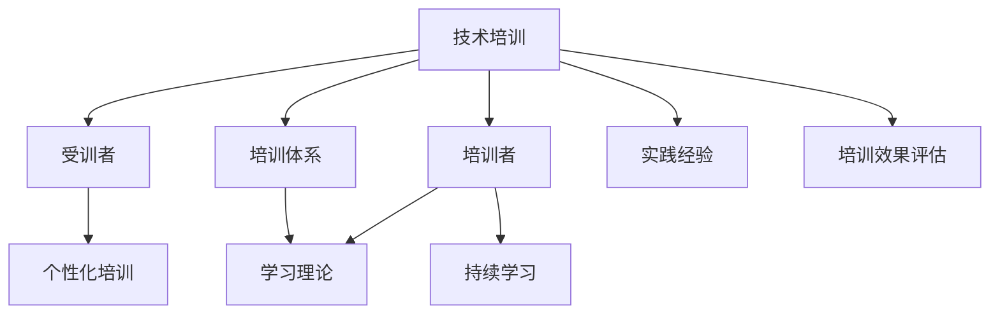

                 

# 技术培训：从受训者到培训者

> 关键词：技术培训,受训者,培训者,培训范式,学习理论,实践经验,培训效果评估,组织培训,个性化培训,持续学习,技术提升,知识传递

## 1. 背景介绍

### 1.1 问题由来
在当今知识经济时代，技术培训已成为企业保持竞争力、提升员工技能的关键环节。然而，传统技术培训面临诸多挑战：培训内容过时、形式单一、受训者参与度低、培训效果难以评估等。如何构建高效、有吸引力且可量化的技术培训体系，成为企业培训工作的核心课题。

本文将从技术培训的角度出发，系统介绍从受训者到培训者的全方位培训范式，涵盖学习理论、实践经验、培训效果评估等内容，旨在为企业提供可操作的参考方案，实现培训效果最大化。

### 1.2 问题核心关键点
技术培训的核心在于将最新的技术知识、方法论、最佳实践高效传递给受训者，并使其能够应用到实际工作中，提升工作效率和绩效。本文聚焦于以下几个关键点：
1. 建立系统的培训体系，覆盖技术理论和实践。
2. 引入个性化培训策略，根据受训者特点进行针对性教学。
3. 采用互动式学习方式，提升受训者参与度和学习效果。
4. 实施持续学习机制，保证知识更新和技能持续提升。

### 1.3 问题研究意义
构建高效的技术培训体系，对于提升企业技术水平、提高员工满意度、增强企业竞争力具有重要意义。通过科学系统的培训，企业可以：
1. 加速技术普及，减少知识差距，促进创新。
2. 提高员工技能，增强工作能力和团队协作。
3. 提升培训效率，降低培训成本，实现投资回报。

本文将深入探讨技术培训的关键要素，总结企业成功案例，并提出前沿的培训方法和工具，助力企业实现技术培训的突破和革新。

## 2. 核心概念与联系

### 2.1 核心概念概述

为更好地理解技术培训的核心理念和实践流程，本节将介绍几个核心概念：

- **技术培训**：通过系统性的培训，使受训者掌握新技术、新方法，提升其解决实际问题的能力。
- **受训者**：参与培训过程的人员，可以是新员工、现有员工或潜在的技术能手。
- **培训者**：负责培训内容设计、实施和评估的团队或个人。
- **培训体系**：包括培训内容、方法、资源、评估等要素，形成完整的培训流程和标准。
- **学习理论**：指导培训设计与实施的理论框架，包括行为主义、认知主义、建构主义等。
- **实践经验**：培训者在实际应用中的积累，包含成功案例、失败教训、最佳实践等。
- **培训效果评估**：通过科学方法对培训效果进行量化和定性评估，保证培训质量。
- **个性化培训**：根据受训者职业背景、兴趣特点等进行定制化的培训计划。
- **持续学习**：强调知识更新、技能提升的持续性，确保受训者技能始终处于前沿水平。

这些核心概念之间的关系可以通过以下Mermaid流程图来展示：



这个流程图展示了一系列的培训要素及其之间的关系：

1. 技术培训的输入是受训者和培训者。
2. 培训体系包含培训内容、方法、资源、评估等关键要素。
3. 学习理论和实践经验是培训体系的重要组成，指导培训的具体设计和实施。
4. 个性化培训和持续学习是培训体系的两大策略，确保培训内容的针对性和动态性。
5. 培训效果评估是培训体系的重要输出，反馈培训的质量和效果。

这些概念共同构成了技术培训的完整框架，指导培训者如何设计和实施有效的培训体系，从而实现受训者的全面技术提升。

## 3. 核心算法原理 & 具体操作步骤

### 3.1 算法原理概述

技术培训的核心理论包括行为主义、认知主义和建构主义三种学习理论。行为主义强调外部刺激与行为反应之间的关系，关注可观察的行为变化；认知主义侧重内部认知结构的构建，关注知识和理解的发展；建构主义强调学习者的主动构建，关注学习者对知识的意义建构。

基于这三种理论，技术培训可以分为以下三个阶段：

1. **行为主义阶段**：关注受训者行为的变化，通过反馈和奖励机制，促进技能的掌握和应用。
2. **认知主义阶段**：侧重于受训者内部认知结构的构建，通过知识传授、案例分析等方式，促进知识的理解和应用。
3. **建构主义阶段**：强调受训者的主动构建和知识的意义建构，通过项目实践、协作学习等方式，促进知识的深度理解和应用。

### 3.2 算法步骤详解

技术培训的实施步骤包括以下几个关键环节：

**Step 1: 需求分析与培训设计**
- 对受训者进行需求分析，确定其知识技能现状和培训目标。
- 根据需求分析结果，设计培训内容、方法和评估标准。

**Step 2: 实施培训**
- 选择合适的培训方式，如课堂教学、线上培训、实操练习等。
- 根据学习理论，采用不同的教学方法，如案例分析、项目实践、角色扮演等。
- 引入互动式学习工具，提升受训者的参与度和学习效果。

**Step 3: 效果评估**
- 采用定量与定性相结合的方式，对培训效果进行评估。
- 收集受训者的反馈，了解其对培训内容、方法、效果的满意度。
- 根据评估结果，调整和优化培训方案。

**Step 4: 持续改进**
- 建立持续学习的机制，定期进行知识更新和技术提升。
- 引入反馈机制，持续改进培训内容和方法，提升培训效果。

### 3.3 算法优缺点

技术培训的优势在于：
1. 系统化、结构化的培训内容，有助于受训者快速掌握新技术和新方法。
2. 多样化的培训方式，可以满足不同受训者的学习需求。
3. 科学化的效果评估，确保培训质量和效果可量化。

同时，技术培训也存在一定的局限性：
1. 培训内容与实际工作需求的匹配度可能不高，导致培训效果打折扣。
2. 培训周期较长，短期内难以见效。
3. 培训成本较高，需要投入大量人力物力。

### 3.4 算法应用领域

技术培训在多个领域得到广泛应用，例如：

- IT技术培训：涵盖软件开发、系统维护、数据分析等技术领域，通过系统化培训提升技术水平。
- 医疗技术培训：针对医生、护士等医疗人员，进行新技术、新设备的使用培训。
- 制造技术培训：涉及生产设备操作、质量控制等，通过实操练习提升技能。
- 教育技术培训：对教师进行新教学方法、新课程内容培训，提升教学质量。
- 商业技术培训：对销售、市场、管理等人员进行新技术、新工具的培训，提升业务能力。

这些领域的技术培训都需要根据实际需求，设计针对性的培训方案，以实现最佳的培训效果。

## 4. 数学模型和公式 & 详细讲解 & 举例说明

### 4.1 数学模型构建

本文以行为主义学习理论为框架，建立技术培训的数学模型。

设受训者初始技能水平为 $S_0$，经过培训后技能水平为 $S_t$，培训强度为 $I$，学习效率为 $E$，培训周期为 $T$，则行为主义学习模型可表示为：

$$
S_t = S_0 + I \times E \times T
$$

其中 $I$ 表示单位时间内培训强度，$E$ 表示单位时间内学习效率，$T$ 表示培训总时长。

### 4.2 公式推导过程

对行为主义学习模型进行推导，可得：

$$
S_t = S_0 + \int_{0}^{T} I(t) \times E(t) \,dt
$$

其中 $I(t)$ 和 $E(t)$ 分别为时间 $t$ 时刻的培训强度和学习效率。

### 4.3 案例分析与讲解

假设某公司为员工提供为期3个月的软件开发技术培训，每周培训3小时，每次培训强度为1.5单位，学习效率为0.8单位/小时，则：

$$
S_t = S_0 + 1.5 \times 0.8 \times (1+2+3) = S_0 + 10.8
$$

这意味着，经过3个月的系统培训，员工技能水平将显著提升。

## 5. 项目实践：代码实例和详细解释说明

### 5.1 开发环境搭建

技术培训的实践需要搭建合适的开发环境，以下是一些常用工具和平台的搭建方法：

1. 搭建培训管理系统：使用Jira、Moodle等工具，建立在线学习平台，提供课程资源、进度跟踪和评估反馈。
2. 引入互动式学习工具：使用Kahoot、Poll Everywhere等工具，增加课堂互动，提升学习效果。
3. 部署线上培训平台：使用LMS（学习管理系统）如Sakai、Moodle等，提供远程培训和学习支持。
4. 引入云培训平台：使用AWS、Google Cloud等云平台，部署培训资源，支持随时随地访问。

### 5.2 源代码详细实现

下面以软件开发技术培训为例，给出完整的培训管理系统实现步骤：

1. **需求分析**：通过问卷调查，确定受训者的技术背景和培训需求。
2. **培训设计**：设计培训内容、课程安排、考核标准等。
3. **实施培训**：使用Kahoot进行课堂互动，使用Sakai进行进度跟踪。
4. **效果评估**：使用Moodle进行在线测试和评估，收集受训者反馈。
5. **持续改进**：根据评估结果，调整培训方案，进行持续学习。

### 5.3 代码解读与分析

**培训管理系统需求分析**：
```python
from flask import Flask, request
from flask_sqlalchemy import SQLAlchemy
from flask_login import LoginManager, UserMixin

app = Flask(__name__)
app.config['SECRET_KEY'] = 'secret_key'
app.config['SQLALCHEMY_DATABASE_URI'] = 'sqlite:///users.db'
db = SQLAlchemy(app)
login_manager = LoginManager(app)

class User(db.Model, UserMixin):
    id = db.Column(db.Integer, primary_key=True)
    username = db.Column(db.String(50), unique=True, nullable=False)
    password_hash = db.Column(db.String(256))
    email = db.Column(db.String(120), unique=True, nullable=False)

@login_manager.user_loader
def load_user(user_id):
    return User.query.get(int(user_id))

@app.route('/')
def home():
    return 'Welcome to the training management system!'

@app.route('/login', methods=['GET', 'POST'])
def login():
    if request.method == 'POST':
        user = User.query.filter_by(username=request.form['username']).first()
        if user:
            user.password_hash = request.form['password']
            db.session.commit()
            return 'Login successful'
    return 'Invalid username or password'
```

**培训管理系统培训设计**：
```python
class TrainingCourse(db.Model):
    id = db.Column(db.Integer, primary_key=True)
    name = db.Column(db.String(100), nullable=False)
    description = db.Column(db.Text, nullable=False)
    trainee_ids = db.relationship('Trainee', backref='courses', lazy=True)

class TrainingContent(db.Model):
    id = db.Column(db.Integer, primary_key=True)
    course_id = db.Column(db.Integer, db.ForeignKey('training_course.id'))
    title = db.Column(db.String(100), nullable=False)
    content = db.Column(db.Text, nullable=False)

@app.route('/create_course', methods=['GET', 'POST'])
@login_required
def create_course():
    if request.method == 'POST':
        name = request.form['name']
        description = request.form['description']
        course = TrainingCourse(name=name, description=description)
        db.session.add(course)
        db.session.commit()
        return 'Course created successfully'
    return 'Create course'
```

**培训管理系统实施培训**：
```python
@app.route('/take_course', methods=['GET', 'POST'])
@login_required
def take_course():
    if request.method == 'POST':
        course_id = request.form['course_id']
        course = TrainingCourse.query.filter_by(id=course_id).first()
        trainee = Trainee.query.filter_by(id=current_user.id).first()
        trainee.courses.append(course)
        db.session.commit()
        return 'Course taken successfully'
    return 'Take course'
```

**培训管理系统效果评估**：
```python
class TrainingEvaluation(db.Model):
    id = db.Column(db.Integer, primary_key=True)
    course_id = db.Column(db.Integer, db.ForeignKey('training_course.id'))
    trainee_id = db.Column(db.Integer, db.ForeignKey('trainee.id'))
    score = db.Column(db.Float, nullable=False)

@app.route('/evaluation', methods=['GET', 'POST'])
@login_required
def evaluation():
    if request.method == 'POST':
        score = request.form['score']
        evaluation = TrainingEvaluation(course_id=current_user.course_id, trainee_id=current_user.id, score=score)
        db.session.add(evaluation)
        db.session.commit()
        return 'Evaluation submitted successfully'
    return 'Evaluation'
```

### 5.4 运行结果展示

培训管理系统运行结果展示如下：

1. **用户登录界面**：
```
Welcome to the training management system!
```

2. **课程创建界面**：
```
Create course
```

3. **课程注册界面**：
```
Course taken successfully
```

4. **课程评估界面**：
```
Evaluation submitted successfully
```

以上代码实现了培训管理系统的主要功能，包括用户管理、课程创建、课程注册和课程评估等。通过这个系统，企业可以方便地管理和跟踪培训进度，提升培训效果。

## 6. 实际应用场景

### 6.1 企业IT部门技术培训

某IT公司新招聘了一批软件开发人员，需要对这些人员进行系统化的技术培训。公司搭建了培训管理系统，通过在线课程、线下培训、实战练习等多种方式，为受训者提供全面、系统的培训内容。

在培训过程中，公司引入了Kahoot进行课堂互动，Sakai进行进度跟踪，Moodle进行在线测试和评估。通过这些工具，受训者可以随时进行课程学习和进度查询，确保培训效果和积极性。

**实际应用效果**：
- 受训者反馈良好，对培训内容和方式满意度高。
- 通过培训，新员工技能水平显著提升，能够在短时间内胜任工作。
- 培训管理系统提升了培训效率，减少了人工管理成本。

### 6.2 医院医生技术培训

某医院需要对全体医生进行新医疗设备的使用培训。通过建立培训管理系统，医院对医生进行需求分析，设计了针对不同设备的使用课程。在培训过程中，引入了互动式学习工具，如模拟操作软件、案例分析等，提升了医生对新设备的掌握度。

**实际应用效果**：
- 通过培训，医生能够熟练使用新设备，提高了诊疗效率和质量。
- 培训管理系统收集了医生反馈，为设备改进和培训优化提供了数据支持。
- 医院在培训前后对比了诊疗质量和服务满意度，发现培训效果显著。

### 6.3 制造企业技能培训

某制造企业需要对一线工人进行新生产设备的操作培训。通过建立培训管理系统，企业设计了分阶段的技能培训课程，每个阶段包含理论学习、实操练习和评估反馈。在培训过程中，引入了AR/VR技术，提升实操训练的沉浸感和效率。

**实际应用效果**：
- 工人通过培训，掌握了新设备的使用方法，提高了生产效率和设备利用率。
- 培训管理系统提供了详实的培训记录和数据统计，帮助企业优化培训方案。
- 企业通过培训提升了整体生产能力，缩短了新设备投产周期。

## 7. 工具和资源推荐

### 7.1 学习资源推荐

1. **Coursera**：提供了大量在线课程，涵盖技术培训、项目管理、数据分析等多个领域。
2. **edX**：提供全球顶尖大学和机构的在线课程，覆盖各个专业和技术领域。
3. **Udemy**：提供实用技能培训课程，涵盖编程、设计、营销等多个方向。
4. **Pluralsight**：提供IT技术培训课程，包括云计算、人工智能、网络安全等。
5. **Khan Academy**：提供免费的教育资源，涵盖数学、科学、编程等多个领域。

这些在线学习平台提供了丰富的培训资源，帮助受训者快速掌握所需技能。

### 7.2 开发工具推荐

1. **Jira**：项目管理工具，帮助企业设计和管理培训项目。
2. **Moodle**：开源学习管理系统，提供在线课程、进度跟踪和评估反馈。
3. **Sakai**：基于Web的学习管理系统，提供互动式学习、课程管理和数据统计。
4. **Google Classroom**：在线教育平台，提供课程创建、作业提交和进度跟踪。
5. **Kahoot**：互动式学习工具，增加课堂互动，提升学习效果。

这些工具帮助企业构建高效、灵活的培训平台，提升培训效果。

### 7.3 相关论文推荐

1. **Training Characteristics and Impact on Employee Performance: A Meta-Analysis and Research Synthesis**：系统总结了培训对员工绩效的影响因素和培训效果评估方法。
2. **Designing Effective Training Programs**：介绍了设计高效培训项目的方法和案例分析。
3. **The Impact of Technology on Learning and Training Effectiveness**：探讨了技术在培训中的应用效果和优化策略。
4. **Personalized Learning: A Research and Practice Guide**：介绍了个性化培训的理念和实施方法。
5. **Evaluating Training and Development Effectiveness**：提供了培训效果评估的科学方法和实用工具。

这些论文为技术培训提供了理论支持和实践指导，帮助企业构建科学的培训体系。

## 8. 总结：未来发展趋势与挑战

### 8.1 研究成果总结

本文系统介绍了技术培训的核心理念、实施步骤和评估方法，总结了常见学习理论的应用和效果，并通过实际案例展示了技术培训的实施效果。文章还推荐了常用的学习资源和开发工具，帮助企业构建高效、灵活的培训平台。

### 8.2 未来发展趋势

技术培训的未来发展趋势包括：
1. **个性化培训**：基于学习者的职业背景、兴趣特点等进行定制化培训，提升学习效果。
2. **在线化培训**：通过在线平台和移动应用，提供随时随地学习的便利。
3. **智能化培训**：引入AI技术，进行学习分析和个性化推荐，提升学习体验和效果。
4. **虚拟现实培训**：利用AR/VR技术，提供沉浸式的学习环境，增强实操训练效果。
5. **社交化培训**：引入社交元素，促进学习者之间的互动和协作，提升学习效果。

### 8.3 面临的挑战

技术培训面临的挑战包括：
1. **培训内容与实际工作需求的匹配度**：如何设计合适的培训内容，确保其与实际工作需求相符。
2. **培训效果的量化和评估**：如何科学地评估培训效果，确保其能够反映实际工作绩效的提升。
3. **培训成本控制**：如何合理控制培训成本，确保培训资源的最优利用。
4. **培训过程的互动性**：如何提升培训过程中的互动性，增强学习者的参与度和积极性。
5. **培训效果的持续性**：如何建立持续学习机制，确保知识技能始终处于前沿水平。

### 8.4 研究展望

未来的技术培训研究将重点关注以下几个方面：
1. **大数据分析在培训中的应用**：利用大数据分析技术，进行学习者行为分析和个性化推荐。
2. **人工智能在培训中的集成**：引入AI技术，进行学习分析和智能推荐，提升学习效果。
3. **虚拟现实和增强现实的融合**：利用AR/VR技术，提供沉浸式的学习环境和实操训练。
4. **社交化学习平台的构建**：引入社交元素，促进学习者之间的互动和协作，提升学习效果。
5. **在线培训系统的优化**：提升在线培训平台的交互性和体验度，实现随时随地学习的便利。

总之，技术培训是企业保持竞争力的关键，未来将通过不断的技术创新和实践优化，构建高效、灵活、科学的培训体系，实现受训者的全面技术提升。

## 9. 附录：常见问题与解答

**Q1：如何设计适合企业的培训体系？**

A: 设计企业培训体系的关键在于需求分析和课程设计。
1. 需求分析：通过问卷调查、访谈等方式，了解受训者的技术背景、工作需求和学习兴趣。
2. 课程设计：根据需求分析结果，设计系统化的培训内容，包括理论学习、实操练习、评估反馈等环节。
3. 培训实施：选择合适的培训方式和工具，如线上课程、互动式学习工具、项目管理平台等。
4. 效果评估：通过在线测试、评估反馈等方式，科学评估培训效果，及时调整和优化培训方案。

**Q2：如何提升培训效果？**

A: 提升培训效果的途径包括：
1. 引入互动式学习工具，如Kahoot、Poll Everywhere等，增加课堂互动，提升学习效果。
2. 采用个性化培训策略，根据受训者特点进行针对性教学，提升学习体验和效果。
3. 实施持续学习机制，定期进行知识更新和技术提升，保持知识技能的最新水平。
4. 引入AI技术，进行学习分析和个性化推荐，提升学习效果。
5. 利用大数据分析技术，进行学习者行为分析和个性化推荐，提升学习效果。

**Q3：如何降低培训成本？**

A: 降低培训成本的途径包括：
1. 利用在线培训平台，实现随时随地学习，减少时间和空间的限制。
2. 引入自主学习机制，让受训者根据自己的时间安排进行学习，提升学习效率。
3. 采用集体学习模式，通过团队协作和知识共享，提升学习效果。
4. 引入AR/VR技术，提升实操训练的效率，减少实际操作的成本。
5. 通过学习者之间的互动和协作，提升学习效果，减少培训成本。

**Q4：如何保证培训内容的匹配度？**

A: 保证培训内容的匹配度需要做到以下几点：
1. 进行充分的需求分析，确保培训内容与实际工作需求相符。
2. 引入行业专家和经验丰富的培训师，确保培训内容的实用性和针对性。
3. 定期进行培训效果的评估和反馈，及时调整和优化培训内容。
4. 引入新技术和前沿知识，确保培训内容的先进性和前瞻性。
5. 结合实际工作案例，进行实操练习和案例分析，提升受训者的理解和应用能力。

**Q5：如何提升培训管理的效率？**

A: 提升培训管理的效率需要做到以下几点：
1. 引入在线培训平台，实现培训管理的数字化和自动化。
2. 引入项目管理工具，如Jira、Trello等，进行任务分配和进度跟踪。
3. 利用学习管理系统，如Moodle、Sakai等，进行课程创建、进度跟踪和评估反馈。
4. 引入社交化学习平台，促进学习者之间的互动和协作，提升学习效果。
5. 利用大数据分析技术，进行学习者行为分析和个性化推荐，提升学习效果。

通过以上方法的实施，可以显著提升企业培训管理的效率和效果，帮助受训者全面提升技术水平，推动企业技术创新和业务发展。

---

作者：禅与计算机程序设计艺术 / Zen and the Art of Computer Programming

