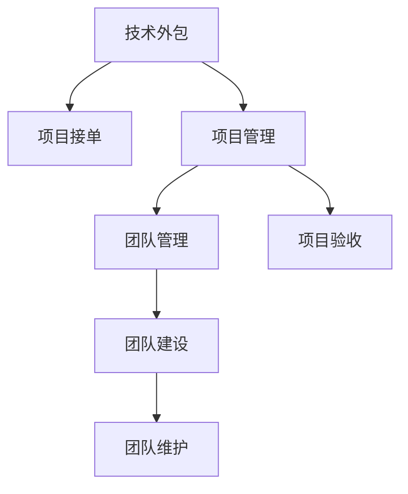

                 

# 技术外包：从接单到建立团队

> 关键词：技术外包,项目接单,团队管理,项目管理,软件开发

## 1. 背景介绍

### 1.1 问题由来

在现代科技飞速发展的背景下，软件技术的更新迭代速度极快，企业为了保持竞争力和市场领先地位，往往需要不断地投入资源进行技术研发和产品迭代。然而，技术的复杂性和不确定性使得软件开发和运维成本高昂，周期长，且对人力、物力资源的需求极大。技术外包成为企业解决这些问题的有效方式。

技术外包，即通过第三方技术团队或平台，以合同方式为其提供技术服务和解决方案，不仅能够帮助企业降低技术投入和运营成本，还能提高项目执行的效率和质量。但技术外包并非简单的外包，需要企业在接单、管理、执行、验收等各个环节进行系统性规划和严格控制，才能实现其预期的效果。

### 1.2 问题核心关键点

技术外包的成功与否，取决于是否能够准确评估项目需求，合理规划项目预算，高效管理团队和资源，以及确保项目按时高质量交付。本文将从技术外包的接单流程、项目管理、团队建设与维护、项目验收等几个关键环节，详细介绍如何系统性地推进技术外包的实施。

## 2. 核心概念与联系

### 2.1 核心概念概述

为更好地理解技术外包的实施过程，本节将介绍几个密切相关的核心概念：

- **技术外包**：企业将技术项目发包给第三方技术团队或平台，以获得技术服务和解决方案的过程。包括软件开发、系统运维、技术咨询等。
- **项目接单**：企业根据自身需求和技术团队的能力范围，选择合适的项目，并与技术团队签订合同的过程。
- **项目管理**：确保项目按时、高质量、高效地完成，并达到预期目标的管理过程。包括需求分析、资源规划、进度跟踪、质量控制等。
- **团队管理**：对技术团队成员进行招募、培训、考核、激励，以提高团队协作效率和士气，确保项目按时高质量完成。
- **项目验收**：对完成的项目进行评估和验证，确保项目符合合同要求和技术标准的过程。包括功能测试、性能测试、安全测试等。

这些核心概念之间的逻辑关系可以通过以下Mermaid流程图来展示：



这个流程图展示出技术外包实施的核心环节及其相互关系：

1. **技术外包**：作为外包过程的起点和终点，企业需要评估和选择合适的技术外包团队，并对完成的项目进行验收。
2. **项目接单**：根据企业需求和技术团队能力，选择合适项目进行外包。
3. **项目管理**：贯穿外包项目始终，确保项目按计划进行。
4. **团队管理**：关注团队成员的招聘、培训和考核，提升团队协作效率。
5. **项目验收**：对完成项目进行全面评估，确保项目满足预期。

这些核心概念共同构成了技术外包的实施框架，帮助企业系统性地推进技术外包项目。

## 3. 核心算法原理 & 具体操作步骤

### 3.1 算法原理概述

技术外包的实施，本质上是一个综合性的项目管理过程，涉及资源规划、团队协调、风险控制等诸多环节。其核心思想是：根据企业需求，选择合适的技术团队，通过系统的项目管理方法和工具，进行有效的资源配置和团队管理，确保项目按时、高质量地完成。

形式化地，假设外包项目为 $P$，企业需求为 $D$，技术团队为 $T$，外包合同为 $C$。技术外包的优化目标是最小化项目成本和时延，即找到最优解 $P^*$：

$$
P^* = \mathop{\arg\min}_{P} \left( \text{Cost}(P) + \text{Delay}(P) \right) \quad \text{subject to} \quad P \in T, P \in D, P \in C
$$

其中 $\text{Cost}(P)$ 为项目成本，$\text{Delay}(P)$ 为项目时延。约束条件 $P \in T$ 表示项目 $P$ 必须由技术团队 $T$ 完成，$P \in D$ 表示项目 $P$ 必须符合企业需求 $D$，$P \in C$ 表示项目 $P$ 必须符合外包合同 $C$。

### 3.2 算法步骤详解

技术外包的实施步骤主要包括接单、项目管理、团队管理、项目验收等环节。

**Step 1: 项目接单**

- **需求评估**：明确企业需求，包括功能需求、性能需求、安全需求、预算和时间限制等。
- **能力评估**：对技术团队的能力进行评估，包括技术栈、经验、历史案例等，确保其能够胜任项目需求。
- **合同签订**：根据需求评估和能力评估结果，与技术团队签订外包合同，明确项目范围、时间表、质量标准、费用和支付方式等条款。

**Step 2: 项目管理**

- **需求分析**：进一步细化需求，形成详细的项目规格说明，确保所有需求被准确理解和记录。
- **资源规划**：根据项目需求，合理配置项目资源，包括人力资源、工具、设备和环境等。
- **进度跟踪**：使用项目管理工具，如JIRA、Trello等，实时监控项目进度，及时发现和解决问题。
- **质量控制**：引入代码审查、单元测试、集成测试等质量控制手段，确保代码质量和项目进度。
- **风险管理**：识别项目风险，制定应对措施，及时调整项目计划。

**Step 3: 团队管理**

- **团队组建**：根据项目需求，组建多学科团队，确保团队成员的专业互补。
- **培训和辅导**：对团队成员进行培训和辅导，提高其技能水平和工作效率。
- **绩效评估**：定期进行绩效评估，识别高绩效团队成员，给予奖励和激励。
- **团队协作**：建立有效的沟通机制，促进团队协作，提高工作效率。

**Step 4: 项目验收**

- **功能测试**：验证项目的各项功能是否符合预期，进行单元测试、集成测试、系统测试等。
- **性能测试**：评估项目性能指标，包括响应时间、吞吐量、并发用户数等。
- **安全测试**：对项目的安全性进行测试，确保系统安全性和合规性。
- **用户体验测试**：通过用户测试和反馈，改进产品体验和用户体验。

### 3.3 算法优缺点

技术外包的实施，具有以下优点：

- **成本效益高**：通过外包可以降低企业技术投入和运营成本，提高资源利用效率。
- **灵活性高**：外包团队能够快速响应企业需求变化，灵活调整项目计划和资源配置。
- **专业性强**：外包团队往往具有丰富的经验和专业技能，能够高质量地完成复杂项目。

但技术外包也存在一些局限性：

- **沟通成本高**：外包团队和客户之间需要频繁沟通，容易出现信息不对称问题。
- **质量难以控制**：外包团队的技术水平和服务质量难以完全把控，容易出现质量问题。
- **安全风险高**：外包团队可能泄露企业敏感信息，带来安全风险。

尽管存在这些局限性，但技术外包在许多企业中被广泛采用，成为技术项目管理和软件开发的重要手段。

### 3.4 算法应用领域

技术外包在许多领域都有广泛应用，包括但不限于：

- **软件开发**：包括应用开发、定制开发、系统集成等。
- **系统运维**：包括网络运维、系统监控、故障排查等。
- **技术咨询**：包括技术评估、技术规划、技术培训等。
- **数据分析**：包括数据采集、数据清洗、数据分析等。
- **人工智能**：包括算法开发、模型训练、应用开发等。

这些应用领域涵盖了企业数字化转型的各个方面，有助于企业提升技术实力和市场竞争力。

## 4. 数学模型和公式 & 详细讲解 & 举例说明

### 4.1 数学模型构建

本节将使用数学语言对技术外包的实施过程进行更加严格的刻画。

假设外包项目为 $P$，企业需求为 $D$，技术团队为 $T$，外包合同为 $C$。则技术外包的优化目标为：

$$
P^* = \mathop{\arg\min}_{P} \left( \text{Cost}(P) + \text{Delay}(P) \right) \quad \text{subject to} \quad P \in T, P \in D, P \in C
$$

其中 $\text{Cost}(P)$ 为项目成本，$\text{Delay}(P)$ 为项目时延。

### 4.2 公式推导过程

我们以软件开发项目为例，来推导技术外包成本和时延的计算公式。

假设项目 $P$ 分为 $n$ 个模块，每个模块的开发周期为 $t_i$，开发成本为 $c_i$，则总成本为：

$$
\text{Cost}(P) = \sum_{i=1}^n c_i t_i
$$

总时延为：

$$
\text{Delay}(P) = \sum_{i=1}^n t_i
$$

因此，外包项目的优化目标为：

$$
P^* = \mathop{\arg\min}_{t_i} \left( \sum_{i=1}^n c_i t_i + \sum_{i=1}^n t_i \right) \quad \text{subject to} \quad \sum_{i=1}^n t_i \leq T, c_i t_i \leq C_i
$$

其中 $T$ 为总时间限制，$C_i$ 为每个模块的预算限制。约束条件 $\sum_{i=1}^n t_i \leq T$ 表示所有模块的开发周期之和不能超过总时间限制，$c_i t_i \leq C_i$ 表示每个模块的开发成本不能超过预算限制。

### 4.3 案例分析与讲解

假设某软件开发项目，分为两个模块，每个模块的开发周期和成本如下：

- 模块1：开发周期 $t_1 = 10$ 天，开发成本 $c_1 = 5000$ 元/天。
- 模块2：开发周期 $t_2 = 20$ 天，开发成本 $c_2 = 8000$ 元/天。
- 总时间限制 $T = 30$ 天，总预算 $C = 20000$ 元。

根据上述公式，可以得到：

- 总成本 $\text{Cost}(P) = 5000 \times 10 + 8000 \times 20 = 130000$ 元
- 总时延 $\text{Delay}(P) = 10 + 20 = 30$ 天

显然，这个项目已经超出了预算和时间限制，需要重新规划。

假设我们将模块1的开发周期缩短为 $t_1' = 5$ 天，成本不变，则新的成本和时延为：

- 新的总成本 $\text{Cost}(P) = 5000 \times 5 + 8000 \times 20 = 95000$ 元
- 新的总时延 $\text{Delay}(P) = 5 + 20 = 25$ 天

新的方案在成本和时间上均满足要求，说明合理的资源配置是确保外包项目成功的关键。

## 5. 项目实践：代码实例和详细解释说明

### 5.1 开发环境搭建

在进行技术外包项目的开发实践前，我们需要准备好开发环境。以下是使用Python进行JIRA开发的开发环境配置流程：

1. 安装JIRA：从Atlassian官网下载并安装JIRA，用于管理项目进度和任务分配。

2. 配置环境变量：
```bash
export JIRA_BASE_URL=http://your-jira-base-url
export JIRA_USER=your-jira-username
export JIRA_PASS=your-jira-password
```

3. 安装Python包：
```bash
pip install jira
```

4. 编写JIRA接口脚本：
```python
from jira import JIRA
import requests

# 配置JIRA客户端
jira = JIRA(base_url=JIRA_BASE_URL, basic_auth=(JIRA_USER, JIRA_PASS))

# 创建任务
project_id = "your-project-id"
summary = "项目任务"
description = "项目任务描述"
labels = ["task", "high-priority"]
assignee = "your-jira-username"

jira.create_issue(project=project_id, summary=summary, description=description, labels=labels, assignee=assignee)

# 查询任务
query = f"project={project_id} and status=Open"
tasks = jira.search_issues(jql=query)
print([task.key for task in tasks])
```

完成上述步骤后，即可在JIRA上创建和查询任务，方便管理项目进度。

### 5.2 源代码详细实现

下面我们以软件开发项目为例，给出使用JIRA进行项目管理的需求分析和资源规划的Python代码实现。

首先，定义项目需求和任务：

```python
from jira import JIRA
import requests

# 配置JIRA客户端
jira = JIRA(base_url=JIRA_BASE_URL, basic_auth=(JIRA_USER, JIRA_PASS))

# 创建项目
project_id = "your-project-id"
project_name = "软件开发项目"

jira.create_project(project_id=project_id, name=project_name)

# 创建需求
summary1 = "模块1需求"
description1 = "模块1的需求描述"
labels1 = ["需求"]
priority1 = "高优先级"

issue_id1 = jira.create_issue(project_id=project_id, summary=summary1, description=description1, labels=labels1, priority=priority1)

summary2 = "模块2需求"
description2 = "模块2的需求描述"
labels2 = ["需求"]
priority2 = "高优先级"

issue_id2 = jira.create_issue(project_id=project_id, summary=summary2, description=description2, labels=labels2, priority=priority2)
```

然后，定义资源配置和任务分配：

```python
# 定义资源
resource_id1 = "your-resource-id-1"
resource_name1 = "资源1"

jira.add_resource_to_project(project_id=project_id, resource_id=resource_id1, name=resource_name1)

resource_id2 = "your-resource-id-2"
resource_name2 = "资源2"

jira.add_resource_to_project(project_id=project_id, resource_id=resource_id2, name=resource_name2)

# 分配任务
jira.add_assignee_to_issue(issue_id1, resource_id1)
jira.add_assignee_to_issue(issue_id2, resource_id2)

# 更新任务状态
jira.transition_issue(issue_id1, status_id="In Progress")
jira.transition_issue(issue_id2, status_id="In Progress")
```

最后，使用JIRA接口监控项目进度：

```python
# 查询任务
query = f"project={project_id} and status=In Progress"
tasks = jira.search_issues(jql=query)
print([task.key for task in tasks])

# 统计任务进展
for task in tasks:
    jira.transition_issue(task.key, status_id="Done")
```

以上就是使用JIRA进行软件开发项目需求分析和资源规划的完整代码实现。可以看到，JIRA提供了强大的项目管理和任务分配功能，能够显著提升项目管理效率和质量。

### 5.3 代码解读与分析

让我们再详细解读一下关键代码的实现细节：

**JIRA接口函数**：
- `jira.create_project`：创建项目。
- `jira.create_issue`：创建任务。
- `jira.add_resource_to_project`：添加资源到项目。
- `jira.add_assignee_to_issue`：分配任务。
- `jira.transition_issue`：更新任务状态。

**任务分配与进度监控**：
- 通过JIRA创建项目和任务，将需求分解为多个子任务，分配到不同的资源上。
- 利用JIRA的任务状态管理功能，实时监控任务进度，确保项目按时完成。

JIRA等项目管理工具的应用，极大提升了技术外包项目的透明度和可控性，使得项目管理和团队协作变得更加高效和灵活。

## 6. 实际应用场景

### 6.1 软件开发

技术外包在软件开发领域得到了广泛应用。企业可以将应用开发、定制开发、系统集成等任务外包给专业的软件开发团队，通过JIRA等项目管理工具，系统性地推进项目进度，确保按时高质量交付。

### 6.2 系统运维

系统运维也是技术外包的重要应用场景。企业可以将网络运维、系统监控、故障排查等任务外包给专业的运维团队，通过项目管理工具，实时监控系统状态，快速响应故障，保障系统稳定运行。

### 6.3 数据分析

数据分析任务同样适合技术外包。企业可以将数据采集、数据清洗、数据分析等任务外包给专业的数据分析团队，通过项目管理工具，高效管理和分配任务，确保数据分析结果准确可靠。

### 6.4 人工智能

人工智能领域的任务外包也日益增多。企业可以将算法开发、模型训练、应用开发等任务外包给专业的AI团队，通过项目管理工具，系统性地推进项目进度，确保AI项目按时高质量交付。

## 7. 工具和资源推荐

### 7.1 学习资源推荐

为了帮助开发者系统掌握技术外包的理论基础和实践技巧，这里推荐一些优质的学习资源：

1. **《敏捷软件开发：原则、模式与实践》**：这是一本经典的敏捷开发书籍，介绍了敏捷软件开发的原则、模式和实践，是技术外包项目管理的必备参考资料。
2. **《JIRA用户手册》**：JIRA的官方用户手册，详细介绍了JIRA的各项功能和使用技巧，是使用JIRA进行项目管理的重要参考资料。
3. **《项目管理知识体系指南（PMBOK）》**：项目管理领域的经典指南，介绍了项目管理的各个环节和最佳实践，帮助开发者系统性提升项目管理能力。
4. **《技术外包：实践与挑战》**：一本专注于技术外包管理的书籍，详细介绍了技术外包的各个环节和常见问题，为技术外包项目提供了实用的指导。

通过对这些资源的学习实践，相信你一定能够快速掌握技术外包的精髓，并用于解决实际的IT项目问题。

### 7.2 开发工具推荐

高效的开发离不开优秀的工具支持。以下是几款用于技术外包开发常用的工具：

1. **JIRA**：项目管理工具，提供任务分配、进度跟踪、资源管理等功能，是技术外包项目管理的重要工具。
2. **Trello**：可视化项目管理工具，适合小型团队进行任务分配和进度跟踪。
3. **Slack**：团队沟通工具，支持即时消息、文件共享、视频会议等功能，帮助团队高效协作。
4. **GitLab**：代码管理和持续集成工具，支持版本控制、代码审查、持续集成等功能，是软件开发项目的重要支持。
5. **Confluence**：文档管理工具，支持团队协作和知识共享，帮助团队高效存储和检索文档。

合理利用这些工具，可以显著提升技术外包项目的开发效率，加快创新迭代的步伐。

### 7.3 相关论文推荐

技术外包领域的研究也在不断深入，以下是几篇奠基性的相关论文，推荐阅读：

1. **《敏捷软件开发实践》**：介绍了敏捷开发的核心思想和方法，为技术外包项目提供了理论基础。
2. **《基于DevOps的云计算环境管理与优化》**：探讨了DevOps和云计算环境管理优化的方法，为技术外包提供了技术保障。
3. **《项目管理的最佳实践》**：介绍了项目管理的最佳实践，为技术外包项目提供了系统的管理方法。
4. **《技术外包的成本和风险管理》**：分析了技术外包的成本和风险，为技术外包项目提供了风险控制的方法。

这些论文代表了大规模外包项目的实践经验和管理思路，帮助开发者系统性地推进技术外包项目的实施。

## 8. 总结：未来发展趋势与挑战

### 8.1 总结

本文对技术外包的接单流程、项目管理、团队建设与维护、项目验收等关键环节进行了详细讲解。首先阐述了技术外包在现代企业中的应用背景和优势，明确了技术外包成功实施的各个环节及其相互关系。其次，从算法原理到实际操作，系统性地介绍了技术外包的实施方法，给出了完整的项目实践代码实现。同时，本文还广泛探讨了技术外包在软件开发、系统运维、数据分析、人工智能等领域的实际应用，展示了技术外包的广泛价值和应用前景。

通过本文的系统梳理，可以看到，技术外包在企业数字化转型中发挥着越来越重要的作用，帮助企业提升技术实力和市场竞争力。未来，随着技术的不断进步和市场需求的持续变化，技术外包将迎来更多的创新和变革，成为企业提升技术创新能力和市场反应速度的重要手段。

### 8.2 未来发展趋势

展望未来，技术外包的发展将呈现以下几个趋势：

1. **技术栈多样化**：随着技术的发展，新兴技术栈如微服务、DevOps、云计算等将得到广泛应用，技术外包团队需要具备更广泛的技术能力和实践经验。
2. **项目管理精细化**：项目管理的工具和方法将不断完善，更加注重任务细分、资源调配、进度跟踪等环节，提高项目执行的效率和质量。
3. **团队协作网络化**：团队协作工具和技术将不断进步，通过网络化协作、远程办公等方式，提高团队协作的效率和灵活性。
4. **成本效益优化**：随着外包市场竞争加剧，外包团队将更加注重成本效益，通过合理的资源配置和高效的项目管理，提升项目的成功率和利润率。
5. **风险控制全面化**：外包项目面临的风险将更加多样化，如数据泄露、安全漏洞、质量缺陷等，需要从项目启动到验收的各个环节进行全面控制和风险管理。

这些趋势将进一步推动技术外包的规范化、精细化和高效化，为企业的技术创新和数字化转型提供有力支持。

### 8.3 面临的挑战

尽管技术外包在许多企业中得到了广泛应用，但仍面临诸多挑战：

1. **沟通障碍**：外包团队和客户之间的沟通成本高，容易出现信息不对称问题。
2. **质量难以控制**：外包团队的技术水平和服务质量难以完全把控，容易出现质量问题。
3. **安全风险高**：外包团队可能泄露企业敏感信息，带来安全风险。
4. **人员流动性大**：外包团队人员流动性大，可能导致项目中断和进度延误。
5. **管理复杂性高**：外包项目的复杂性和多样性高，项目管理难度大。

这些挑战需要通过系统的项目管理、团队管理、风险管理等措施来解决，才能确保技术外包项目的顺利实施。

### 8.4 研究展望

未来，技术外包的研究需要在以下几个方面寻求新的突破：

1. **智能项目管理**：引入人工智能技术，实现项目管理自动化、智能化，提升项目管理效率和质量。
2. **动态资源配置**：引入动态资源配置技术，根据项目需求和资源情况，实时调整资源配置，优化资源利用效率。
3. **安全保障机制**：引入安全保障机制，确保外包团队的操作符合企业安全规范，防止数据泄露和安全漏洞。
4. **风险评估模型**：引入风险评估模型，全面评估外包项目的技术、成本、时间、质量等风险，制定有效的风险管理策略。
5. **项目管理平台**：开发集成的项目管理平台，整合JIRA、Trello、GitLab、Confluence等工具，实现统一的项目管理。

这些研究方向将进一步提升技术外包项目的成功率和效率，为企业数字化转型提供有力支撑。

## 9. 附录：常见问题与解答

**Q1：技术外包是否适用于所有企业？**

A: 技术外包并非适用于所有企业，一般适用于以下几种情况：

1. **技术复杂度高**：企业内部缺乏足够的技术人才，无法独立完成复杂项目。
2. **项目周期长**：项目周期较长，企业内部资源有限，无法按时完成项目。
3. **技术创新快**：企业需要快速响应市场和技术变化，保持技术领先地位。

企业需要根据自身实际情况，评估是否适合进行技术外包。

**Q2：如何选择合适的外包团队？**

A: 选择合适的外包团队需要考虑以下几个因素：

1. **技术实力**：外包团队需要具备丰富的技术经验和专业技能，能够高效完成项目任务。
2. **历史案例**：外包团队需要提供成功案例，证明其能力和信誉。
3. **价格和成本**：外包团队的价格和成本需要合理，避免高昂的额外成本。
4. **沟通效率**：外包团队需要具备良好的沟通能力和项目管理经验，确保项目顺利推进。
5. **售后服务**：外包团队需要提供完善的售后服务和技术支持，确保项目长期稳定运行。

选择合适的外包团队是技术外包成功的基础。

**Q3：如何控制外包项目的成本？**

A: 控制外包项目的成本需要从以下几个方面入手：

1. **需求明确**：项目需求需要明确和详细，避免需求变更带来的额外成本。
2. **合理分配资源**：合理分配项目资源，避免资源浪费和过度投入。
3. **质量控制**：建立严格的质量控制机制，避免返工和质量问题带来的额外成本。
4. **项目管理**：使用项目管理工具，实时监控项目进度和资源使用情况，及时发现和解决问题。
5. **合同条款**：合同条款需要明确规定项目成本和费用，避免额外费用和纠纷。

通过系统的项目管理，可以有效控制外包项目的成本，确保项目在预算范围内完成。

**Q4：如何提高外包项目的成功率？**

A: 提高外包项目的成功率需要从以下几个方面入手：

1. **需求沟通**：与外包团队进行充分沟通，明确需求和期望，确保项目目标一致。
2. **项目管理**：建立完善的项目管理机制，确保项目按计划推进，及时发现和解决问题。
3. **质量控制**：建立严格的质量控制机制，确保项目质量符合预期。
4. **风险管理**：建立风险管理机制，全面评估项目风险，制定有效的风险管理策略。
5. **团队协作**：建立良好的团队协作机制，确保团队成员高效协作，提升项目执行效率。

通过系统的项目管理、质量控制和风险管理，可以有效提高外包项目的成功率。

**Q5：外包团队如何保证项目进度？**

A: 外包团队需要从以下几个方面入手，确保项目进度：

1. **任务细分**：将项目任务进行细化和分解，明确每个任务的具体要求和交付时间。
2. **资源配置**：根据项目需求，合理配置项目资源，确保每个任务都有足够的资源支持。
3. **进度跟踪**：使用项目管理工具，实时监控项目进度，及时发现和解决问题。
4. **沟通机制**：建立良好的沟通机制，确保团队成员及时沟通和协作，避免进度延误。
5. **风险管理**：识别项目风险，制定应对措施，及时调整项目计划，确保项目按时完成。

通过完善的任务管理、资源配置、进度跟踪和风险管理，外包团队可以有效保证项目进度，按时高质量完成项目。

---

作者：禅与计算机程序设计艺术 / Zen and the Art of Computer Programming

