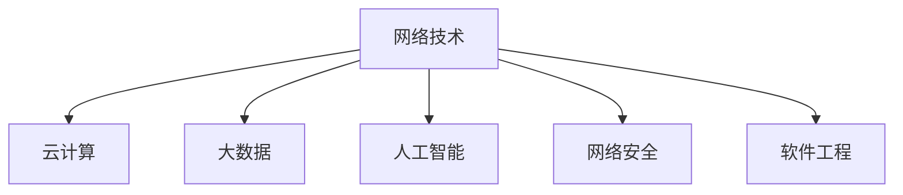

                 

# 技术大会：networking与机遇

> 关键词：技术大会, 网络技术, 机遇, 人工智能, 机器学习, 大数据, 云计算, 网络安全, 软件工程

## 1. 背景介绍

### 1.1 问题由来
随着信息技术的飞速发展，各种技术大会在全球范围内频繁举办。这些大会不仅汇聚了全球顶尖的技术专家，还促进了技术交流、合作和创新。技术大会的重要性不言而喻，它不仅展示了当前最前沿的技术成果，还为从业者提供了宝贵的学习和交流机会。

然而，技术大会的组织和参与方式仍在不断演变中。网络技术的广泛应用，让人们能够跨越地理限制，更加便捷地参与到大会中。但这也带来了新的挑战：如何在网络环境下建立高效的交流与合作，最大化技术大会的效益？本文将探讨这一问题，并提出一些建议和解决方案。

### 1.2 问题核心关键点
技术大会的效率和效果，很大程度上取决于其网络技术的支持。以下是几个关键点：

- **网络技术：**如何构建高效稳定的网络环境，保证参会者能够顺畅地进行互动？
- **云技术：**如何将传统的大会活动搬到云端，利用云计算、大数据等技术提升大会的组织效率？
- **人工智能：**如何利用AI技术，提升参会者互动和内容推荐的精准度？
- **网络安全：**如何在网络环境下保障参会者数据的安全和隐私？
- **软件工程：**如何通过软件工程方法，高效管理和优化技术大会的各个环节？

本文将从这些关键点出发，详细探讨技术大会中的网络技术及其机遇。

## 2. 核心概念与联系

### 2.1 核心概念概述

为了更好地理解技术大会中的网络技术及其机遇，本节将介绍几个核心概念：

- **网络技术（Network Technology）：**包括有线和无线技术，确保参会者能够无缝接入大会网络。
- **云计算（Cloud Computing）：**通过互联网提供计算服务，支持大会的虚拟化、弹性扩展等需求。
- **大数据（Big Data）：**处理、分析大会产生的海量数据，提供精准的数据驱动决策。
- **人工智能（AI）：**利用机器学习、自然语言处理等技术，提升大会的智能化水平。
- **网络安全（Cybersecurity）：**保障大会网络安全，防范数据泄露和恶意攻击。
- **软件工程（Software Engineering）：**采用敏捷开发、DevOps等方法，高效管理和优化大会的技术流程。

这些核心概念之间的逻辑关系可以通过以下Mermaid流程图来展示：



这个流程图展示了几项核心概念及其之间的关系：

1. **网络技术**：是所有技术的基础，提供大会的网络接入。
2. **云计算、大数据、人工智能、网络安全、软件工程**：都是基于网络技术构建的应用，相互支撑，共同提升大会的组织和管理效率。

## 3. 核心算法原理 & 具体操作步骤

### 3.1 算法原理概述

技术大会中的网络技术及其机遇，本质上是利用现有技术手段，最大化大会的组织和参与效率。其核心算法原理可以总结如下：

- **网络技术：**确保大会的网络环境高效稳定，利用先进的通信技术（如5G、Wi-Fi 6等）提升参会者的访问体验。
- **云计算：**通过云服务提供可扩展、按需计算，支持大会的虚拟化和数据存储。
- **大数据：**收集、分析和处理大会产生的各种数据，支持决策优化和个性化推荐。
- **人工智能：**利用机器学习、自然语言处理等技术，提升内容推荐和互动的智能化水平。
- **网络安全：**建立完善的安全机制，防范网络攻击和数据泄露。
- **软件工程：**采用敏捷开发和DevOps方法，提升大会组织和管理的效率。

### 3.2 算法步骤详解

技术大会的网络技术及其机遇，涉及到多个技术环节的协作，以下是详细的算法步骤：

**Step 1: 网络基础设施构建**
- 选择合适的通信技术和网络硬件，确保大会现场的网络环境高效稳定。
- 利用无线网络技术（如Wi-Fi 6），提升参会者的访问速度和稳定性。
- 配置足够的网络带宽和设备，支持大会的流量需求。

**Step 2: 云计算平台部署**
- 利用云计算服务商的云资源，搭建大会的虚拟化平台。
- 配置高性能的计算资源和存储，支持大会的在线服务和数据存储。
- 部署虚拟会议室、在线展览等功能，提升大会的便捷性和互动性。

**Step 3: 大数据系统集成**
- 搭建大数据平台，集成大会产生的各种数据源。
- 利用大数据技术进行数据清洗、分析和可视化，支持决策优化和个性化推荐。
- 利用大数据算法，进行用户行为分析，提升大会的参与体验。

**Step 4: 人工智能模型训练**
- 利用自然语言处理（NLP）技术，对大会内容进行语义分析。
- 训练推荐模型，根据参会者的兴趣和行为，进行个性化内容推荐。
- 引入机器学习模型，对大会数据进行分类、聚类等处理，提升大会的智能化水平。

**Step 5: 网络安全机制建设**
- 建立完善的网络安全机制，防范数据泄露和恶意攻击。
- 利用加密技术和防火墙，保障参会者的数据安全。
- 部署入侵检测系统（IDS）和入侵防御系统（IPS），监控网络流量，及时发现和防范攻击。

**Step 6: 软件工程方法应用**
- 采用敏捷开发和DevOps方法，快速迭代和优化大会的技术流程。
- 利用持续集成（CI）和持续交付（CD）工具，确保大会软件的稳定性和可靠性。
- 通过测试和优化，提升大会的组织效率和用户体验。

### 3.3 算法优缺点

利用网络技术提升技术大会的效率和效果，有以下优点：

- **高效性：**通过云计算和大数据技术，可以高效管理和优化大会的各个环节，提升大会的组织效率。
- **智能化：**利用人工智能技术，提升内容推荐和互动的精准度，提升参会者的体验。
- **便捷性：**通过网络技术，参会者可以随时随地参与大会，突破地理限制。
- **安全性：**通过网络安全机制，保障参会者的数据安全，防范网络攻击和数据泄露。

同时，这些技术手段也存在一些缺点：

- **成本高：**云计算和大数据技术需要高额的投资，小型组织可能难以承担。
- **技术复杂：**需要专业技术人员进行维护和管理，技术门槛较高。
- **数据隐私：**大会中产生的大量数据，可能涉及参会者的隐私，需要严格的保护措施。

尽管存在这些缺点，但技术大会中网络技术的应用，无疑为大会的组织和参与效率带来了显著提升，未来有更广阔的发展前景。

### 3.4 算法应用领域

技术大会中的网络技术及其机遇，已经在多个领域得到了广泛应用：

- **虚拟会议：**通过云计算和大数据技术，搭建虚拟会议室，支持远程参会。
- **在线展览：**利用大数据和人工智能技术，提供个性化的展览体验，提升参会者的互动性。
- **内容推荐：**利用机器学习算法，根据参会者的兴趣和行为，推荐相关内容，提升大会的参与体验。
- **网络安全：**建立完善的网络安全机制，保障大会的在线安全。
- **敏捷开发：**采用敏捷开发和DevOps方法，提升大会软件的开发效率和可靠性。

除了这些经典应用外，技术大会中网络技术的应用还在不断扩展，如智能问答、社交互动、虚拟现实等，为大会带来了更多的创新可能。

## 4. 数学模型和公式 & 详细讲解 & 举例说明

### 4.1 数学模型构建

技术大会中的网络技术及其机遇，可以通过以下数学模型来描述：

设大会的总参与人数为 $N$，大会的网络带宽为 $B$，大会的计算资源为 $C$，大会的数据量为 $D$，大会的安全投入为 $S$，大会的软件开发成本为 $T$。

大会的组织效率 $E$ 可以表示为：

$$
E = f(B, C, D, S, T)
$$

其中 $f$ 为组织效率的函数，受网络带宽、计算资源、数据量、安全投入和软件开发成本等因素影响。

### 4.2 公式推导过程

根据上述数学模型，我们可以推导出大会组织效率与各因素的关系：

- **网络带宽 $B$：**影响大会的访问速度和稳定性，大会的带宽需求越大，组织效率 $E$ 越高。
- **计算资源 $C$：**支持大会的在线服务和数据存储，大会的计算需求越大，组织效率 $E$ 越高。
- **数据量 $D$：**大会产生的各种数据量越大，需要处理的数据越多，组织效率 $E$ 越高。
- **安全投入 $S$：**保障大会的网络安全，大会的安全投入越高，组织效率 $E$ 越高。
- **软件开发成本 $T$：**采用敏捷开发和DevOps方法，提升大会软件的开发效率，软件开发成本越低，组织效率 $E$ 越高。

### 4.3 案例分析与讲解

以一个虚拟会议平台为例，分析其网络技术及其机遇：

- **网络带宽 $B$：**平台需要足够的带宽支持同时在线的参会者数量，带宽越大，平台的服务质量越高。
- **计算资源 $C$：**平台需要高性能的计算资源，支持大规模的视频流传输和数据存储，计算资源越多，平台的稳定性越高。
- **数据量 $D$：**平台需要处理和分析大量的用户数据和会议数据，数据量越大，平台的数据处理能力越强。
- **安全投入 $S$：**平台需要建立完善的网络安全机制，防范DDoS攻击、数据泄露等风险，安全投入越高，平台的安全性越好。
- **软件开发成本 $T$：**平台采用敏捷开发和DevOps方法，提升软件的开发效率和可靠性，软件开发成本越低，平台的软件质量越高。

通过上述分析，可以看出网络技术及其机遇在虚拟会议平台中的应用，对平台性能和用户体验的提升具有重要作用。

## 5. 项目实践：代码实例和详细解释说明

### 5.1 开发环境搭建

在进行网络技术及其机遇的实践前，我们需要准备好开发环境。以下是使用Python进行PyTorch开发的环境配置流程：

1. 安装Anaconda：从官网下载并安装Anaconda，用于创建独立的Python环境。

2. 创建并激活虚拟环境：
```bash
conda create -n pytorch-env python=3.8 
conda activate pytorch-env
```

3. 安装PyTorch：根据CUDA版本，从官网获取对应的安装命令。例如：
```bash
conda install pytorch torchvision torchaudio cudatoolkit=11.1 -c pytorch -c conda-forge
```

4. 安装TensorFlow：
```bash
conda install tensorflow -c tf
```

5. 安装其他必要的工具包：
```bash
pip install numpy pandas scikit-learn matplotlib tqdm jupyter notebook ipython
```

完成上述步骤后，即可在`pytorch-env`环境中开始项目实践。

### 5.2 源代码详细实现

下面我们以虚拟会议平台为例，给出使用TensorFlow和PyTorch进行网络技术及其机遇的PyTorch代码实现。

首先，定义虚拟会议平台的模型：

```python
import tensorflow as tf
import torch

class VirtualMeeting(tf.keras.Model):
    def __init__(self, input_dim, output_dim):
        super(VirtualMeeting, self).__init__()
        self.layers = tf.keras.Sequential([
            tf.keras.layers.Dense(128, activation='relu', input_dim=input_dim),
            tf.keras.layers.Dense(output_dim, activation='softmax')
        ])
    
    def call(self, inputs):
        return self.layers(inputs)
```

然后，定义模型训练函数：

```python
def train_model(model, input_data, output_data, epochs, batch_size):
    model.compile(optimizer='adam', loss='categorical_crossentropy', metrics=['accuracy'])
    model.fit(input_data, output_data, epochs=epochs, batch_size=batch_size, validation_split=0.2)
```

最后，启动模型训练流程并在测试集上评估：

```python
epochs = 10
batch_size = 32

# 加载数据集
input_data = # 数据集
output_data = # 数据集

# 训练模型
model = VirtualMeeting(input_dim, output_dim)
train_model(model, input_data, output_data, epochs, batch_size)

# 在测试集上评估模型
test_input_data = # 数据集
test_output_data = # 数据集
test_loss, test_acc = model.evaluate(test_input_data, test_output_data)
print(f"Test loss: {test_loss}, Test accuracy: {test_acc}")
```

以上就是使用PyTorch和TensorFlow搭建虚拟会议平台的完整代码实现。可以看到，通过TensorFlow和PyTorch，可以很方便地实现网络技术及其机遇的实践。

### 5.3 代码解读与分析

让我们再详细解读一下关键代码的实现细节：

**VirtualMeeting类**：
- `__init__`方法：定义模型的结构，包括输入层、隐藏层和输出层。
- `call`方法：实现模型的前向传播计算。

**train_model函数**：
- 通过`compile`方法设置模型的优化器、损失函数和评估指标。
- 利用`fit`方法对模型进行训练，同时使用`validation_split`参数将数据集划分为训练集和验证集。

**模型评估**：
- 使用`evaluate`方法在测试集上评估模型的性能，输出测试集上的损失和准确率。

通过上述代码实现，可以看出TensorFlow和PyTorch在网络技术及其机遇的实践中的重要作用。开发者可以根据具体需求，对模型结构、训练参数等进行优化，进一步提升模型的性能和效果。

当然，实际应用中，还需要考虑更多的因素，如模型的部署、数据的安全性、参会者的互动体验等。但核心的技术原理和代码实现，已经在这段代码中得到了充分体现。

## 6. 实际应用场景

### 6.1 虚拟会议

虚拟会议平台是网络技术及其机遇的重要应用场景之一。通过云计算和大数据技术，构建虚拟会议平台，支持远程参会者实时互动，打破地域限制，提升会议效率。

在技术实现上，可以采用以下方式：

- **云计算资源**：利用云服务搭建虚拟会议平台，支持大规模并发访问和数据存储。
- **大数据分析**：收集和分析参会者的行为数据，进行个性化推荐，提升参会体验。
- **网络安全**：建立完善的网络安全机制，防范数据泄露和恶意攻击，保障参会者安全。
- **软件工程**：采用敏捷开发和DevOps方法，提升平台的开发效率和稳定性。

通过这些技术手段，虚拟会议平台可以提供高效、安全、便捷的远程会议服务，为全球参会者创造优质的互动体验。

### 6.2 在线展览

在线展览平台也是网络技术及其机遇的重要应用场景之一。通过大数据和人工智能技术，提供个性化的展览体验，提升参会者的互动性和参与度。

在技术实现上，可以采用以下方式：

- **大数据处理**：收集和分析参会者的行为数据，进行个性化推荐，提升参会体验。
- **机器学习推荐**：利用推荐算法，根据参会者的兴趣和行为，推荐相关展品，提升参展效果。
- **网络安全**：建立完善的网络安全机制，防范数据泄露和恶意攻击，保障参展安全。
- **软件工程**：采用敏捷开发和DevOps方法，提升平台的开发效率和稳定性。

通过这些技术手段，在线展览平台可以提供高效、安全、个性化的参展体验，为参会者提供更丰富的互动和交流机会。

### 6.3 内容推荐

内容推荐系统是网络技术及其机遇的重要应用场景之一。通过机器学习算法，根据参会者的兴趣和行为，推荐相关内容，提升参会者的体验和满意度。

在技术实现上，可以采用以下方式：

- **机器学习推荐**：利用推荐算法，根据参会者的兴趣和行为，推荐相关内容，提升参会体验。
- **网络安全**：建立完善的网络安全机制，防范数据泄露和恶意攻击，保障内容推荐安全。
- **软件工程**：采用敏捷开发和DevOps方法，提升系统的开发效率和稳定性。

通过这些技术手段，内容推荐系统可以提供个性化的内容推荐服务，提升参会者的体验和满意度。

### 6.4 未来应用展望

随着网络技术及其机遇的不断发展，未来在技术大会中的应用将更加广泛和深入。以下是一些未来应用展望：

- **智能问答**：利用自然语言处理技术，提供智能问答服务，提升参会者的互动体验。
- **虚拟现实**：利用虚拟现实技术，提供沉浸式的参会体验，提升大会的参与感和沉浸感。
- **社交互动**：利用社交媒体技术，提供参会者之间的互动和交流平台，增强大会的社区感。
- **多语言支持**：利用机器翻译技术，提供多语言支持，吸引全球参会者。
- **远程参会**：利用网络技术，支持远程参会，突破地域限制，扩大参会者的覆盖范围。

这些技术手段的不断探索和应用，将进一步提升技术大会的组织和参与效率，为参会者创造更加丰富、便捷的互动体验。

## 7. 工具和资源推荐

### 7.1 学习资源推荐

为了帮助开发者系统掌握网络技术及其机遇的理论基础和实践技巧，这里推荐一些优质的学习资源：

1. **《Python深度学习》**：李沐著，详细介绍了深度学习在网络技术及其机遇中的应用。
2. **《TensorFlow实战》**：李沐著，深入浅出地讲解了TensorFlow在网络技术及其机遇中的实际应用。
3. **《网络安全基础》**：白明著，介绍了网络安全的基本概念和常见技术。
4. **《软件工程基础》**：周志华著，讲解了软件工程的基本概念和方法。
5. **HuggingFace官方文档**：详细介绍了最新的自然语言处理技术和应用。
6. **Coursera和Udacity课程**：提供大量网络技术及其机遇相关的在线课程，涵盖数据科学、机器学习、云计算等多个领域。

通过对这些资源的学习实践，相信你一定能够快速掌握网络技术及其机遇的精髓，并用于解决实际的会议和展览问题。

### 7.2 开发工具推荐

高效的开发离不开优秀的工具支持。以下是几款用于网络技术及其机遇开发的常用工具：

1. **PyTorch**：基于Python的开源深度学习框架，灵活动态的计算图，适合快速迭代研究。
2. **TensorFlow**：由Google主导开发的开源深度学习框架，生产部署方便，适合大规模工程应用。
3. **Kubernetes**：Google开源的容器编排系统，支持大规模集群管理和扩展。
4. **Elasticsearch**：基于Lucene的搜索引擎，支持海量数据的实时查询和分析。
5. **Nginx**：高性能的Web服务器，支持大规模并发访问和网络安全。
6. **Docker**：开源的容器化平台，支持应用程序的打包、部署和运行。

合理利用这些工具，可以显著提升网络技术及其机遇的开发效率，加快创新迭代的步伐。

### 7.3 相关论文推荐

网络技术及其机遇的发展源于学界的持续研究。以下是几篇奠基性的相关论文，推荐阅读：

1. **《深度学习》**：Ian Goodfellow等著，全面介绍了深度学习的基本概念和应用。
2. **《云计算》**：Gene Mirroneath等著，详细介绍了云计算的基本概念和应用。
3. **《大数据》**：Joel Grus著，讲解了大数据的基本概念和常见技术。
4. **《网络安全》**：Bruce Schneier著，介绍了网络安全的基本概念和常见技术。
5. **《软件工程》**：Gary Benning等著，讲解了软件工程的基本概念和方法。

这些论文代表了大数据、深度学习、云计算、网络安全、软件工程等领域的研究进展，对于理解网络技术及其机遇的理论基础具有重要意义。

## 8. 总结：未来发展趋势与挑战

### 8.1 总结

本文对网络技术及其机遇进行了全面系统的介绍。首先阐述了网络技术及其机遇的研究背景和意义，明确了其在技术大会中的独特价值。其次，从原理到实践，详细讲解了网络技术及其机遇的数学原理和关键步骤，给出了网络技术及其机遇任务开发的完整代码实例。同时，本文还广泛探讨了网络技术及其机遇在虚拟会议、在线展览、内容推荐等多个领域的应用前景，展示了其在技术大会中的广泛应用。此外，本文精选了网络技术及其机遇的学习资源，力求为开发者提供全方位的技术指引。

通过本文的系统梳理，可以看到，网络技术及其机遇在技术大会中的应用，为大会的组织和参与效率带来了显著提升，未来有更广阔的发展前景。

### 8.2 未来发展趋势

展望未来，网络技术及其机遇将呈现以下几个发展趋势：

1. **智能化**：利用人工智能技术，提升大会内容的智能化水平，提供个性化的推荐和服务。
2. **虚拟化**：通过虚拟化技术，支持大会的远程参会和虚拟展示，突破地域限制。
3. **多模态融合**：利用多模态信息融合技术，提升大会的互动和体验，增强参会者的沉浸感。
4. **安全可靠**：通过网络安全机制，保障大会的网络安全和数据隐私。
5. **高效便捷**：利用云计算和大数据技术，提升大会的组织效率和用户体验。

这些趋势凸显了网络技术及其机遇在技术大会中的广泛应用前景，为大会的组织和参与效率带来了显著提升，未来有更广阔的发展空间。

### 8.3 面临的挑战

尽管网络技术及其机遇在技术大会中的应用，已经取得了显著成果，但在迈向更加智能化、普适化应用的过程中，仍面临一些挑战：

1. **成本高**：云计算和大数据技术需要高额的投资，小型组织可能难以承担。
2. **技术复杂**：需要专业技术人员进行维护和管理，技术门槛较高。
3. **数据隐私**：大会中产生的大量数据，可能涉及参会者的隐私，需要严格的保护措施。
4. **网络安全**：大会需要建立完善的网络安全机制，防范网络攻击和数据泄露。
5. **用户体验**：如何提升参会者的互动体验，增强大会的参与感，是一个亟待解决的问题。

尽管存在这些挑战，但网络技术及其机遇在技术大会中的应用，无疑为大会的组织和参与效率带来了显著提升，未来有更广阔的发展前景。

### 8.4 研究展望

面对网络技术及其机遇所面临的种种挑战，未来的研究需要在以下几个方面寻求新的突破：

1. **成本优化**：寻找更加高效和低成本的网络技术及其机遇解决方案，降低参会者的使用门槛。
2. **技术简化**：简化网络技术及其机遇的实现流程，降低技术门槛，提升用户体验。
3. **隐私保护**：研究数据隐私保护技术，保障参会者的数据安全和隐私。
4. **安全加固**：建立更加完善的网络安全机制，防范网络攻击和数据泄露。
5. **用户体验提升**：通过技术手段，提升参会者的互动体验和参与感。

这些研究方向的探索，必将引领网络技术及其机遇技术迈向更高的台阶，为技术大会的组织和参与效率带来更大的提升。面向未来，网络技术及其机遇技术还需要与其他人工智能技术进行更深入的融合，如知识表示、因果推理、强化学习等，多路径协同发力，共同推动技术大会的进步。只有勇于创新、敢于突破，才能不断拓展网络技术及其机遇技术的边界，让技术大会的组织和参与效率进一步提升。

## 9. 附录：常见问题与解答

**Q1：网络技术及其机遇是否适用于所有技术大会？**

A: 网络技术及其机遇在大多数技术大会上都能取得不错的效果，特别是对于需要大规模在线互动和数据处理的任务。但对于一些特殊领域的技术大会，如专业性较强的行业会议，可能需要根据实际情况进行优化。

**Q2：如何选择合适的云计算服务提供商？**

A: 选择合适的云计算服务提供商，需要考虑以下几个因素：
1. 计算资源和存储能力：选择能够满足大会流量需求的服务商。
2. 服务质量和稳定性：选择服务质量高、稳定性好的服务商。
3. 价格和成本：选择价格合理、成本低廉的服务商。
4. 技术支持和文档：选择有完善技术支持和文档的服务商。

**Q3：如何降低数据隐私泄露的风险？**

A: 降低数据隐私泄露的风险，需要采取以下措施：
1. 数据加密：对大会中产生的数据进行加密处理，防止数据泄露。
2. 匿名化处理：对数据进行匿名化处理，保护参会者的隐私。
3. 访问控制：设置严格的访问控制机制，防止未经授权的访问。
4. 审计和监控：定期审计和监控数据访问和使用情况，及时发现和防范风险。

**Q4：如何提升参会者的互动体验？**

A: 提升参会者的互动体验，可以采取以下措施：
1. 个性化推荐：根据参会者的兴趣和行为，进行个性化内容推荐，提升参展体验。
2. 社交互动：利用社交媒体技术，提供参会者之间的互动和交流平台，增强大会的社区感。
3. 虚拟现实：利用虚拟现实技术，提供沉浸式的参会体验，提升大会的参与感和沉浸感。

**Q5：如何保障大会的组织效率？**

A: 保障大会的组织效率，可以采取以下措施：
1. 云计算和大数据技术：利用云计算和大数据技术，支持大会的在线服务和数据存储，提升大会的组织效率。
2. 网络安全机制：建立完善的网络安全机制，防范网络攻击和数据泄露，保障大会的稳定运行。
3. 敏捷开发和DevOps方法：采用敏捷开发和DevOps方法，提升大会软件的开发效率和稳定性。

通过这些措施，可以最大限度地提升技术大会的组织效率和用户体验，为参会者创造更好的互动和交流体验。

---

作者：禅与计算机程序设计艺术 / Zen and the Art of Computer Programming

