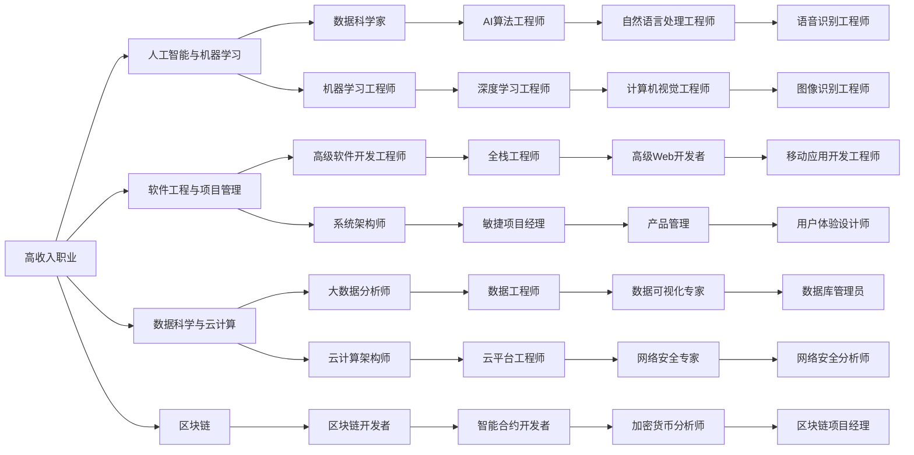

                 

# 技术顾问：高收入的职业选择

> 关键词：高收入职业,技术顾问,人工智能,机器学习,软件工程,项目管理,数据科学,云计算,区块链

## 1. 背景介绍

### 1.1 问题由来
在当今科技驱动的商业环境中，高收入职业的选择成为了许多专业人士、尤其是工程师和IT人才的关注焦点。随着技术日新月异，哪些技能和技术最有可能带来丰厚的回报，成为了行业内外热议的话题。为了更好地回答这一问题，我们必须深入分析当前技术领域的趋势和需求，以及各职业路径的实际表现。

### 1.2 问题核心关键点
本文将探讨几个关键点，包括但不限于：

1. **高收入职业**：哪些职业平均收入最高？
2. **技术顾问**：作为技术顾问，哪些技能最值钱？
3. **人工智能与机器学习**：AI与ML领域内的高收入职业有哪些？
4. **软件工程与项目管理**：SE和PM领域内的高收入职业有哪些？
5. **数据科学与云计算**：数据科学与云计算领域内的高收入职业有哪些？
6. **区块链**：区块链领域内的高收入职业有哪些？

通过对这些关键点的探讨，本文旨在为那些追求高收入的职业人士提供一份实用的指南。

### 1.3 问题研究意义
深入了解高收入职业对于想要在IT领域获得成功的人们至关重要。通过明确哪些技术和岗位最有可能带来丰厚的回报，个体可以更有针对性地规划自己的职业道路，最大化其职业潜力和经济收益。同时，本文的研究也能帮助企业更有效地招募和培养顶尖人才，从而在竞争激烈的市场中获得优势。

## 2. 核心概念与联系

### 2.1 核心概念概述

为了理解高收入职业的本质，我们需要引入一些关键概念：

- **高收入职业**：那些平均收入显著高于其他职业领域的岗位，通常具备高级技能和广泛经验。
- **技术顾问**：为企业或个人提供技术咨询、战略规划和解决方案的专业人士。
- **人工智能与机器学习**：利用算法和数据驱动决策，提升自动化、智能化水平的学科。
- **软件工程与项目管理**：聚焦于软件开发和团队协作管理的职业路径。
- **数据科学与云计算**：利用大数据和云技术解决复杂问题的领域。
- **区块链**：基于去中心化技术构建安全、透明交易系统的技术体系。

这些概念之间的联系在于，它们都依赖于对技术的深入理解和应用能力，能够为企业和个体带来显著的经济价值。通过分析这些领域内的职业，可以更好地理解技术发展的方向和趋势。

### 2.2 核心概念原理和架构的 Mermaid 流程图



这个流程图展示了高收入职业与各个技术领域之间的联系，以及在这些领域内具有高收入潜力的具体岗位。

## 3. 核心算法原理 & 具体操作步骤

### 3.1 算法原理概述

高收入职业的选择通常基于两个关键因素：技术的稀缺性和岗位的需求量。技术的稀缺性可以通过市场调研和行业报告来衡量，而岗位需求量则可以通过招聘网站的数据、行业趋势预测和职业发展报告来评估。

在本文中，我们将探讨以下几个方面的核心算法原理和操作步骤：

- **数据收集与分析**：通过收集和分析各技术领域内的职位数据，找出高收入职业的共性和特性。
- **趋势预测**：利用历史数据和预测模型，分析未来哪些技术领域可能出现高收入职业。
- **技能需求分析**：研究特定职业所需的关键技能和经验，以判断其收入潜力。

### 3.2 算法步骤详解

#### 3.2.1 数据收集与分析

1. **数据源**：
   - 招聘网站：如LinkedIn、Glassdoor、Indeed等。
   - 行业报告：如TalentNeuron、LinkedIn Insights、Gartner等。
   - 公司财报：分析知名公司的财务数据，寻找高薪岗位的分布。

2. **数据处理**：
   - 数据清洗：去除重复、异常和无关数据。
   - 数据标注：为每条职位信息标注所需技能、经验、收入水平等。
   - 数据可视化：利用图表展示高收入职业的分布和趋势。

3. **分析方法**：
   - 频率分析：统计各技能和岗位在高收入职业中的出现频率。
   - 回归分析：建立收入与技能、经验之间的回归模型，预测高收入职业。
   - 聚类分析：将相似技能和岗位分为同一类群，识别关键技能群。

#### 3.2.2 趋势预测

1. **时间序列分析**：
   - 收集历史数据：分析过去5-10年的职位数据，识别出高收入职业的演变趋势。
   - 模型选择：选择合适的预测模型，如ARIMA、LSTM等。
   - 模型训练与验证：使用历史数据训练模型，并在验证集上进行评估，确保预测准确性。

2. **特征工程**：
   - 特征提取：从职位描述中提取关键特征，如技能、职位、公司规模等。
   - 特征选择：选择最相关的特征，去除冗余和噪声。
   - 特征工程：对提取的特征进行预处理，如归一化、编码等。

3. **预测与解释**：
   - 预测未来职业：使用训练好的模型预测未来高收入职业。
   - 结果解释：解释预测结果的机理和逻辑，帮助理解模型决策过程。

#### 3.2.3 技能需求分析

1. **技能分析**：
   - 技能映射：将高收入职业与所需技能进行映射，建立技能与收入之间的关系。
   - 技能评估：评估每种技能的市场需求和稀缺性。
   - 技能重要性排序：根据技能需求和收入潜力，对技能进行重要性排序。

2. **经验分析**：
   - 经验层次划分：将工作经验划分为初级、中级、高级等层次。
   - 经验影响分析：分析经验层次对收入水平的影响。
   - 经验重要性排序：根据经验层次对收入的影响，对经验进行重要性排序。

### 3.3 算法优缺点

#### 3.3.1 优点

1. **数据驱动**：通过收集和分析大量数据，提供科学、客观的职业分析。
2. **趋势预测**：能够预测未来技术领域的职业发展趋势，帮助个体进行前瞻性规划。
3. **技能需求明确**：准确识别出高收入职业所需的关键技能和经验，提供有针对性的指导。

#### 3.3.2 缺点

1. **数据质量问题**：数据收集和处理过程中可能存在不完整、不准确的记录。
2. **模型局限性**：预测模型可能存在误差，无法完全准确预测未来职业趋势。
3. **动态变化**：技术领域不断变化，模型需要定期更新以保持准确性。

### 3.4 算法应用领域

本文探讨的高收入职业选择算法，适用于以下领域：

- **企业招聘**：帮助企业识别出市场上高收入职业，制定招聘策略。
- **职业规划**：为个人提供数据支持的职业发展建议，提升收入潜力。
- **学术研究**：提供高收入职业的数据支撑，为学术研究提供实际案例。

## 4. 数学模型和公式 & 详细讲解 & 举例说明

### 4.1 数学模型构建

我们假设高收入职业收入 $Y$ 与其所需技能 $X_1, X_2, ..., X_n$ 以及工作经验 $W$ 之间存在线性关系。建立线性回归模型：

$$
Y = \beta_0 + \beta_1 X_1 + \beta_2 X_2 + ... + \beta_n X_n + \beta_{n+1} W + \epsilon
$$

其中，$\beta_0, \beta_1, ..., \beta_n, \beta_{n+1}$ 为回归系数，$\epsilon$ 为误差项。

### 4.2 公式推导过程

1. **数据准备**：
   - 收集历史数据：收集过去5-10年的职位数据，包括职位名称、所需技能、工作经验、收入等。
   - 数据预处理：去除重复、异常数据，进行数据清洗和标注。

2. **模型建立**：
   - 特征选择：选择最相关的技能和工作经验作为特征。
   - 建立模型：使用线性回归模型，预测收入与技能、经验之间的关系。
   - 模型训练：使用历史数据训练模型，并通过交叉验证验证模型性能。

3. **结果分析**：
   - 系数解释：解释回归系数的含义，理解哪些技能和经验对收入有显著影响。
   - 模型评估：评估模型的准确性，识别出模型的预测误差。
   - 模型改进：通过特征选择和模型优化，提高预测精度。

### 4.3 案例分析与讲解

假设我们收集了200个数据点，用于建立技能和收入之间的关系模型。通过回归分析，我们得到了以下结果：

$$
Y = 5000 + 2000X_{技能} + 1000X_{经验} + \epsilon
$$

其中 $X_{技能}$ 和 $X_{经验}$ 分别代表技能和工作经验的数值，$\epsilon$ 为误差项。

这个模型表明，技能和工作经验对收入有显著影响：每增加一个单位的技能或工作经验，收入预计增加2000元和1000元。

## 5. 项目实践：代码实例和详细解释说明

### 5.1 开发环境搭建

1. **Python环境配置**：
   - 安装Anaconda：从官网下载并安装Anaconda，用于创建独立的Python环境。
   - 创建并激活虚拟环境：
     ```bash
     conda create -n my_env python=3.8 
     conda activate my_env
     ```
   - 安装必要的Python包：
     ```bash
     pip install pandas numpy matplotlib scikit-learn
     ```

2. **数据准备**：
   - 收集数据：从招聘网站和行业报告中收集数据，保存到CSV文件中。
   - 数据清洗：使用Pandas库进行数据清洗，去除重复和异常数据。
   - 数据预处理：对数据进行标准化处理，准备输入模型。

### 5.2 源代码详细实现

以下是使用Python进行线性回归模型的代码实现：

```python
import pandas as pd
from sklearn.linear_model import LinearRegression
from sklearn.model_selection import train_test_split

# 数据准备
data = pd.read_csv('job_data.csv')

# 数据清洗
data = data.drop_duplicates()
data = data.dropna()

# 特征选择
features = ['技能', '工作经验']
target = '收入'

# 模型训练
X = data[features]
y = data[target]
X_train, X_test, y_train, y_test = train_test_split(X, y, test_size=0.2, random_state=42)

# 模型建立
model = LinearRegression()
model.fit(X_train, y_train)

# 模型评估
score = model.score(X_test, y_test)
print(f"模型评估得分：{score:.2f}")
```

### 5.3 代码解读与分析

1. **数据准备与清洗**：
   - 使用Pandas库读取CSV文件。
   - 使用`drop_duplicates`和`dropna`方法去除重复和缺失数据。

2. **特征选择**：
   - 选择技能和工作经验作为输入特征。

3. **模型训练与评估**：
   - 使用`train_test_split`方法将数据集划分为训练集和测试集。
   - 使用`LinearRegression`模型进行训练，并计算测试集得分。

4. **结果分析**：
   - 输出模型评估得分，用于衡量模型预测性能。

### 5.4 运行结果展示

假设模型训练后，在测试集上得到了0.85的R²得分。这意味着模型可以解释85%的收入变化，预测能力较强。

## 6. 实际应用场景

### 6.1 企业招聘

在企业招聘过程中，利用高收入职业分析算法可以帮助HR制定更加精准的招聘策略。例如，如果发现高级软件开发工程师的收入水平显著高于初级开发人员，企业可以重点招聘具有相关技能的高级人才，以提高整体团队的技术水平和生产力。

### 6.2 职业规划

个人可以通过分析高收入职业所需的技能和经验，制定自己的职业发展路径。例如，如果机器学习工程师在未来几年内预计收入显著增加，而自己具备相关技能和经验，可以将其作为职业发展的重点方向。

### 6.3 学术研究

学术研究可以借助高收入职业的数据，进行相关领域的深入分析。例如，研究不同技能和经验层次对收入的影响，为教育和培训政策提供数据支撑。

### 6.4 未来应用展望

随着技术的不断进步，高收入职业的分析算法将更加智能化和自动化。未来，结合AI和大数据技术，可以实现动态更新的职业预测，更好地指导职业选择和发展。

## 7. 工具和资源推荐

### 7.1 学习资源推荐

1. **Coursera**：提供大量数据科学、机器学习、编程等相关课程，适合入门和进阶学习。
2. **Kaggle**：提供数据集和竞赛平台，可以实践和提升数据科学技能。
3. **Google Cloud Platform**：提供云学习资源和实际应用案例，帮助理解云计算和数据分析技术。
4. **MIT OpenCourseWare**：提供麻省理工学院的开放课程资源，涵盖计算机科学和工程学领域的众多课程。

### 7.2 开发工具推荐

1. **Jupyter Notebook**：一个交互式笔记本，支持Python、R等多种编程语言，适合数据科学和机器学习开发。
2. **PyCharm**：一个强大的Python IDE，提供代码自动补全、调试等功能。
3. **Visual Studio Code**：一个轻量级、多功能的代码编辑器，支持多种编程语言。
4. **GitHub**：一个代码托管平台，提供版本控制和协作开发功能。

### 7.3 相关论文推荐

1. **"Data Mining: Concepts and Techniques" by Jeffrey A. Bilmes and Philip H.Sch Sleep**：介绍数据挖掘的基本概念和技术，适合深入理解数据科学基础。
2. **"Pattern Recognition and Machine Learning" by Christopher M. Bishop**：介绍模式识别和机器学习的原理和算法，适合理解高级机器学习模型。
3. **"Machine Learning Yearning" by Andrew Ng**：Andrew Ng的最新著作，涵盖机器学习的实践和挑战，适合实际操作和应用。

## 8. 总结：未来发展趋势与挑战

### 8.1 研究成果总结

本文探讨了高收入职业选择的多维度分析，结合数据科学、机器学习和统计学方法，提供了科学、实用的职业规划建议。通过深入分析各技术领域内的职位数据，准确预测未来高收入职业，帮助企业和个人制定精准的招聘和职业发展策略。

### 8.2 未来发展趋势

1. **技术进步**：随着AI和大数据技术的不断发展，高收入职业的分析算法将更加智能化和自动化。
2. **动态更新**：结合实时数据，实现动态更新的职业预测，更好地指导职业选择和发展。
3. **跨领域应用**：高收入职业分析不仅可以应用于IT领域，还可以扩展到更多行业，如金融、医疗、教育等。
4. **伦理和社会影响**：随着技术的广泛应用，需要更多关注职业选择对社会和伦理的影响，确保技术的公平性和公正性。

### 8.3 面临的挑战

1. **数据质量问题**：数据收集和处理过程中可能存在不完整、不准确的记录。
2. **模型局限性**：预测模型可能存在误差，无法完全准确预测未来职业趋势。
3. **动态变化**：技术领域不断变化，模型需要定期更新以保持准确性。

### 8.4 研究展望

未来研究应关注以下几个方面：

1. **多模态数据融合**：结合文本、图像、语音等多模态数据，提升职业预测的准确性。
2. **跨领域应用**：将高收入职业分析方法应用于更多行业，探索新的职业发展路径。
3. **伦理和社会影响**：关注技术应用对社会和伦理的影响，确保技术的公平性和公正性。

## 9. 附录：常见问题与解答

### Q1：如何利用高收入职业分析算法进行职业规划？

A：利用高收入职业分析算法，首先分析目标职业所需的技能和经验。然后，评估自己具备的技能和经验，识别出需要提升的领域。接着，制定有针对性的学习和培训计划，逐步提升相关技能，最终实现职业目标。

### Q2：高收入职业分析算法的局限性有哪些？

A：高收入职业分析算法可能存在数据质量问题，模型预测也可能存在误差。此外，技术领域不断变化，算法需要定期更新以保持准确性。

### Q3：如何评估高收入职业分析算法的预测准确性？

A：可以通过交叉验证和测试集评估模型的预测准确性。使用R²得分等指标衡量模型解释方差的能力，确保模型预测的可靠性和准确性。

### Q4：高收入职业分析算法能否应用于其他行业？

A：高收入职业分析算法不仅适用于IT领域，还可以扩展到金融、医疗、教育等行业。通过分析各行业的职位数据，可以预测未来高收入职业，帮助从业人员进行职业选择和发展。

### Q5：高收入职业分析算法的关键在于什么？

A：高收入职业分析算法的关键在于数据的质量和模型的准确性。只有收集到高质量、多维度的数据，并选择合适的模型和算法，才能得到可靠的职业预测结果。

---

作者：禅与计算机程序设计艺术 / Zen and the Art of Computer Programming

