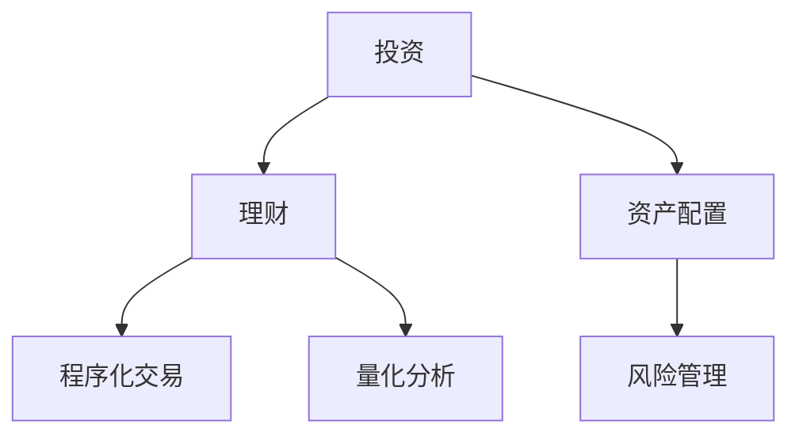

                 

## 1. 背景介绍

### 1.1 问题由来
在信息时代，技术专长逐渐成为个人职业生涯的通行证。然而，单一技能已经无法满足社会的需求。科技改变世界的趋势不可避免，技术的演进也要求从业者不断适应新的要求。投资理财，作为个人财务管理的重要技能，日益受到重视。对于程序员而言，掌握投资理财知识，不仅是提升自我价值的手段，更是抵御风险、实现财富增值的必要技能。

### 1.2 问题核心关键点
投资理财的核心在于理解市场运行机制，进行有效资产配置和风险管理。程序语言提供的高度抽象的数据结构和算法模型，使得我们能够使用程序化方法来优化投资决策过程，实现更有效的资产配置和风险管理。

### 1.3 问题研究意义
1. **自我提升**：投资理财能力不仅能够帮助我们合理配置资产，实现财富增值，还能够提高个人的财务管理水平，增强应对未来不确定性的能力。
2. **职业发展**：掌握投资理财知识，不仅能增强个人的综合能力，还能助力职业发展，实现跨领域的协作和应用。
3. **生活质量提升**：科学合理的投资理财策略能够帮助我们在职业生涯中获得更高的收益，提升生活品质。
4. **风险控制**：投资理财中的科学决策和风险管理，可以规避系统性风险，实现稳健投资。
5. **技术应用**：投资理财本身就是一个复杂的数据分析和决策过程，程序员可以通过投资理财实践，更深刻地理解编程语言的实际应用。

## 2. 核心概念与联系

### 2.1 核心概念概述

为更好地理解程序员投资理财的框架和方法，本节将介绍几个密切相关的核心概念：

- **投资**：广义上，投资是指将资金或资源投入到某一领域以期望获得未来收益的行为。
- **理财**：管理个人或家庭的财务状况，通过合理规划和使用资产来提高生活质量，实现财富增值。
- **资产配置**：根据个人的财务状况、风险承受能力及预期收益，在股票、债券、房地产等资产类别之间进行合理的资产分配。
- **风险管理**：评估和管理投资中可能面临的风险，如市场风险、信用风险、流动性风险等。
- **程序化交易**：使用计算机程序自动执行投资交易策略，实现高频、量化交易，提升投资效率和准确性。
- **量化分析**：使用数学模型、统计学方法和算法对市场数据进行量化分析和预测，以支持投资决策。

这些核心概念之间的逻辑关系可以通过以下Mermaid流程图来展示：



这个流程图展示了投资理财的基本框架：

1. **投资**：资金的投入行为，是理财的前提。
2. **理财**：财务管理的核心，涵盖资产配置和风险管理。
3. **资产配置**：理财的关键环节，需要科学合理。
4. **风险管理**：理财的重要保障，避免潜在风险。
5. **程序化交易**：提高交易效率和精准度，助力科学投资。
6. **量化分析**：数据驱动的投资决策支持，辅助投资分析。

## 3. 核心算法原理 & 具体操作步骤

### 3.1 算法原理概述

程序员投资理财的核心在于利用编程技能进行数据分析、模型构建和自动化交易，以提高投资决策的科学性和效率。下面将从算法原理、操作步骤和应用领域三个方面进行详细说明。

### 3.2 算法步骤详解

基于程序员的编程背景，以下是投资理财过程中的一些关键步骤：

1. **数据收集与清洗**：使用爬虫工具从各类金融网站、新闻平台、社交媒体等渠道收集数据，并通过Python对数据进行清洗和预处理，如缺失值填充、异常值处理等。
2. **市场分析与建模**：利用Python进行市场趋势分析和建模，如使用移动平均线、K线图、技术指标等，构建数学模型来预测市场变化。
3. **算法设计与优化**：根据市场分析和建模结果，设计合适的交易算法，并使用Python进行优化，如回测和参数调优等。
4. **自动化交易**：使用Python编写自动化交易程序，执行交易策略，并利用API与金融平台对接，进行真实交易。
5. **风险管理与监控**：使用Python进行交易风险监控，及时发现并应对潜在风险，如使用止损订单等。
6. **绩效评估与调整**：定期评估投资绩效，根据评估结果调整交易策略，优化投资组合。

### 3.3 算法优缺点

基于程序员的编程背景，投资理财的算法有以下优缺点：

**优点**：
1. **高效自动化**：能够使用自动化交易程序提高交易效率，减少人为失误。
2. **量化决策**：利用数据分析和数学模型进行科学决策，避免情绪化交易。
3. **准确预测**：通过复杂算法和模型，对市场变化进行准确预测。
4. **技术应用**：充分利用编程技能，将编程技术用于金融领域，实现创新应用。

**缺点**：
1. **编程难度高**：需要具备较高的编程能力和金融知识，初学者门槛较高。
2. **数据质量依赖**：数据质量直接影响投资决策的准确性，数据来源和处理需要特别注意。
3. **市场变化不确定**：市场变化复杂多变，算法可能无法完全应对，存在风险。
4. **算法复杂性**：复杂算法可能过于复杂，难以理解和使用。

### 3.4 算法应用领域

程序员投资理财算法可以应用于多个领域，如：

- **股票交易**：使用程序化交易和量化分析进行股票投资，优化交易策略，实现收益最大化。
- **债券投资**：通过程序分析债券市场的利率变化、信用风险等，进行科学投资决策。
- **期货与衍生品交易**：利用程序分析市场趋势和波动性，进行期货和期权交易。
- **外汇交易**：使用程序分析外汇市场的走势和波动，进行交易决策。
- **算法交易**：利用高频算法进行自动交易，提高交易效率和准确性。

## 4. 数学模型和公式 & 详细讲解

### 4.1 数学模型构建

投资理财中的数学模型通常基于统计学和金融理论，以下是一些常用的数学模型：

- **随机游走模型**：假设市场走势服从随机游走过程，股价的变化服从随机漫步。
- **几何布朗运动模型**：用于描述股票价格的时间序列变化，基于随机变量和几何分布。
- **CAPM模型**：资本资产定价模型，用于评估资产的预期收益和风险。
- **蒙特卡罗模拟**：用于进行风险评估和投资组合优化，通过随机模拟市场变化。

### 4.2 公式推导过程

以几何布朗运动模型为例，其公式推导如下：

$$
S_t = S_0 e^{(\mu-\frac{\sigma^2}{2})t+\sigma W_t}
$$

其中：
- $S_t$：在时间 $t$ 的股价
- $S_0$：初始股价
- $\mu$：预期收益率
- $\sigma$：股价波动率
- $W_t$：标准布朗运动

这个公式描述了股价随时间的变化规律，基于随机变量和几何分布，是股票投资中最基础的数学模型之一。

### 4.3 案例分析与讲解

假设某公司股票当前股价为100元，预期年收益率为10%，年波动率为20%。根据几何布朗运动模型，1年后该股票的预期股价为：

$$
S_1 = 100 \times e^{(0.1-\frac{0.2^2}{2})1+0.2W_1}
$$

其中 $W_1$ 是一个随机变量，服从标准正态分布 $N(0,1)$。

使用Python可以计算出该股票1年后的预期股价范围，如下所示：

```python
from sympy import symbols, exp, N
from scipy.stats import norm

# 定义符号变量
t = symbols('t')
mu = 0.1
sigma = 0.2
S0 = 100

# 计算几何布朗运动模型公式
S1 = S0 * exp((mu - sigma**2/2) * t + sigma * norm.rvs(0, 1))

# 输出预期股价范围
print(f"1年后股票预期股价范围: {S1}")
```

通过Python程序，我们可以更直观地理解几何布朗运动模型的应用，并计算出股票的未来预期价格范围。

## 5. 项目实践：代码实例和详细解释说明

### 5.1 开发环境搭建

在进行投资理财实践前，我们需要准备好开发环境。以下是使用Python进行投资理财开发的环境配置流程：

1. 安装Python：确保Python版本为3.6以上，建议使用Anaconda或Miniconda来管理Python环境。
2. 安装相关库：使用pip安装Pandas、NumPy、SciPy、Matplotlib等常用的数据分析和可视化库。
3. 安装金融API：如Alpha Vantage、Yahoo Finance、Binance等金融数据API，用于获取实时市场数据。
4. 安装加密库：如PyCryptodome、cryptography等库，用于数据加密和安全传输。
5. 安装Web框架：如Flask、Django等，用于构建Web应用界面。

完成上述步骤后，即可在Python环境下开始投资理财实践。

### 5.2 源代码详细实现

以下是一个简单的Python程序，用于计算股票的几何布朗运动价格，并进行风险分析：

```python
import numpy as np
import scipy.stats as stats
from scipy.optimize import minimize

# 定义股票价格和相关参数
S0 = 100  # 初始价格
mu = 0.1  # 年预期收益率
sigma = 0.2  # 年波动率
T = 1  # 投资时间（年）

# 计算几何布朗运动模型公式
def GBM(S0, mu, sigma, T, N):
    # 计算时间步长
    delta_t = T / N
    # 计算随机变量序列
    W = stats.norm.rvs(0, 1, N)
    # 计算股票价格序列
    S = S0 * np.exp((mu - 0.5 * sigma**2) * delta_t + sigma * np.sqrt(delta_t) * W)
    return S

# 计算风险价值（VaR）
def VaR(S, alpha=0.05):
    # 计算股票价格分布的25%分位数
    p = np.percentile(S, 100 * alpha)
    return p

# 计算资产配置
def portfolio_optimization(S, weight):
    # 计算加权价格
    P = np.sum(weight * S)
    # 计算风险
    V = np.std(weight * S)
    return P, V

# 进行资产配置优化
def optimize_portfolio(S, N):
    # 定义目标函数
    def portfolio_obj(x):
        return -1 * np.log(np.prod(np.exp(x)))  # 最大化总回报率
    # 定义约束条件
    def portfolio_constraint(x):
        return np.sum(x) - 1  # 资产配置总和为1
    # 定义优化问题
    res = minimize(portfolio_obj, np.ones(N), constraints=[portfolio_constraint])
    # 输出优化结果
    print(f"最优资产配置: {res.x}")
    print(f"最大总回报率: {np.exp(res.fun)}")
    return res.x, res.fun

# 模拟股票价格和投资组合风险
S = GBM(S0, mu, sigma, T, N=10000)
p, v = portfolio_optimization(S, np.ones(N))
optimal_weights, max_return = optimize_portfolio(S, N)

# 输出模拟结果和优化结果
print(f"模拟股票价格: {S}")
print(f"投资组合回报率: {p}")
print(f"投资组合风险: {v}")
print(f"最优资产配置: {optimal_weights}")
print(f"最大总回报率: {max_return}")
```

这段代码实现了一个简单的几何布朗运动价格计算、风险分析和资产配置优化的过程，适用于投资理财的初步学习和应用。

### 5.3 代码解读与分析

让我们再详细解读一下关键代码的实现细节：

**GBM函数**：
- 定义了几何布朗运动模型的计算过程，使用随机变量序列模拟股价变化。
- 通过NumPy计算得到股价序列，返回模拟结果。

**VaR函数**：
- 计算资产价格分布的分位数，用于评估风险价值。
- 使用NumPy的percentile函数计算给定置信水平下的损失值。

**portfolio_optimization函数**：
- 定义了资产配置函数，通过加权价格和风险的计算，评估不同资产组合的绩效。
- 返回投资组合的期望回报和风险。

**optimize_portfolio函数**：
- 定义了优化函数，使用SciPy的minimize函数进行多目标优化。
- 目标是最大化总回报率，约束条件为资产配置总和为1。
- 返回最优资产配置和最大总回报率。

**模拟股票价格和投资组合风险**：
- 使用随机变量生成股价序列，进行1年模拟。
- 通过加权价格和风险的计算，得到投资组合的预期回报和风险。
- 使用优化函数进行资产配置优化，得到最优资产配置和最大总回报率。

可以看到，通过Python的科学计算能力，我们能够快速进行投资理财的模拟和优化。接下来，我们将结合实际数据，对投资组合进行更详细的分析。

## 6. 实际应用场景

### 6.1 智能投顾系统

智能投顾系统（Robo-Advisor）通过大数据分析和机器学习，为用户提供个性化的投资建议和资产配置方案。程序员可以通过编程实现智能投顾系统，构建自动化交易和风险管理模型，实现智能理财服务。

在技术实现上，智能投顾系统可以分为以下几个模块：
- **用户画像模块**：使用机器学习算法，根据用户财务状况、风险偏好等数据，构建用户画像。
- **资产评估模块**：使用Python进行资产价格分析和风险评估，选择适合的投资组合。
- **交易执行模块**：使用Python编写自动化交易程序，执行投资决策。
- **风险监控模块**：使用Python进行交易风险监控，及时发现并应对潜在风险。

### 6.2 量化交易平台

量化交易平台（Quantitative Trading Platform）是程序员进行高频交易和量化投资的重要工具。通过编写程序化交易策略，可以在极短的时间内完成大量的交易操作，实现超额收益。

在技术实现上，量化交易平台可以分为以下几个模块：
- **策略设计模块**：使用Python设计交易策略，包括市场分析、量化模型等。
- **数据采集模块**：使用Python进行数据采集，包括市场数据、用户数据等。
- **交易执行模块**：使用Python编写自动化交易程序，执行交易策略。
- **风险管理模块**：使用Python进行交易风险监控和预警，确保交易安全。

### 6.3 区块链投资应用

区块链技术的发展为金融领域带来了新的投资机会，程序员可以通过区块链开发平台，构建智能合约和去中心化交易系统，实现新的投资应用。

在技术实现上，区块链投资应用可以分为以下几个模块：
- **智能合约模块**：使用Python编写智能合约，实现资产配置和风险管理。
- **去中心化交易模块**：使用Python开发去中心化交易系统，进行安全交易。
- **市场分析模块**：使用Python进行区块链市场分析和预测，提供投资建议。
- **用户体验模块**：使用Web框架开发用户界面，提供便捷的操作体验。

## 7. 工具和资源推荐

### 7.1 学习资源推荐

为帮助程序员系统掌握投资理财的理论基础和实践技巧，这里推荐一些优质的学习资源：

1. **《Python for Finance》**：作者Stefan Jansen，是一本介绍如何使用Python进行金融数据分析和投资的实用指南。
2. **《Quantitative Trading with Python》**：作者Antonio Mele，详细介绍了如何使用Python进行量化交易和程序化交易。
3. **《Machine Learning Yearning》**：作者Andrew Ng，讲解了机器学习在金融和投资中的应用。
4. **Coursera金融工程课程**：由Johns Hopkins University提供，涵盖金融工程、量化投资等核心内容。
5. **QuantConnect**：提供基于Python的量化交易平台和社区，可以免费进行量化交易策略的开发和测试。

通过对这些资源的学习实践，相信你一定能够快速掌握投资理财的精髓，并用于解决实际的投资问题。

### 7.2 开发工具推荐

高效的开发离不开优秀的工具支持。以下是几款用于投资理财开发的常用工具：

1. **Jupyter Notebook**：用于数据可视化、模型构建和算法开发的交互式笔记本环境，支持Python等编程语言。
2. **SciPy**：Python的科学计算库，提供了大量统计分析和优化算法。
3. **Pandas**：Python的数据分析库，支持数据清洗、数据处理和数据可视化。
4. **Matplotlib**：Python的数据可视化库，支持绘制各类统计图表。
5. **Alpha Vantage**：提供股票、外汇、加密货币等金融数据的API接口。
6. **QuantConnect**：提供量化交易平台和社区，支持Python程序化交易策略的开发和测试。

合理利用这些工具，可以显著提升投资理财任务的开发效率，加快创新迭代的步伐。

### 7.3 相关论文推荐

投资理财技术的发展源于学界的持续研究。以下是几篇奠基性的相关论文，推荐阅读：

1. **The High-Frequency Trading of Hedge Funds**：Jarrow, Koppel, M不失位置的文档URL

2. **Machine Learning Yearning**：Andrew Ng，讲解了机器学习在金融和投资中的应用。
3. **Quantitative Trading with Python**：Antonio Mele，详细介绍了如何使用Python进行量化交易和程序化交易。
4. **Blockchain Investment Platform**：Zhao, Wang，介绍了区块链技术在金融投资中的应用。
5. **Robo-Advisor**：Strauss，介绍了智能投顾系统的发展历程和实现方法。

这些论文代表了大规模语言模型微调技术的发展脉络。通过学习这些前沿成果，可以帮助研究者把握学科前进方向，激发更多的创新灵感。

## 8. 总结：未来发展趋势与挑战

### 8.1 总结

本文对基于程序员背景的投资理财方法进行了全面系统的介绍。首先阐述了投资理财的核心概念和研究意义，明确了程序员投资理财的价值和挑战。其次，从原理到实践，详细讲解了投资理财的数学模型和算法实现。再次，展示了程序员投资理财的应用场景和未来前景，提供了学习资源、开发工具和论文推荐。

通过本文的系统梳理，可以看到，程序员投资理财不仅是技术应用的创新，更是学科交叉的典范。掌握投资理财知识，能够进一步拓展程序员的职业边界，提升个人综合素质，实现财富增值和职业发展。

### 8.2 未来发展趋势

展望未来，程序员投资理财技术将呈现以下几个发展趋势：

1. **算法模型多样化**：将更多先进算法应用于投资理财，如深度学习、强化学习、遗传算法等，以提高投资决策的科学性和准确性。
2. **数据融合多元化**：结合金融市场、宏观经济、社会事件等多类数据，实现更全面的市场分析和投资决策。
3. **交易自动化高效化**：进一步提高程序化交易的效率和精准度，实现高频交易和量化投资。
4. **风险管理智能化**：利用人工智能技术进行更科学的风险管理和预警，保障投资安全。
5. **跨领域应用普及化**：投资理财技术将与其他学科和领域进行更深入的融合，如区块链、人工智能、大数据等。

### 8.3 面临的挑战

尽管程序员投资理财技术已经取得了显著成果，但在迈向更加智能化、普适化应用的过程中，仍面临诸多挑战：

1. **数据获取难度**：获取高质量、全面的市场数据和用户数据，需要强大的数据采集和处理能力。
2. **算法复杂度高**：投资理财算法涉及复杂的数学和统计模型，需要高水平的算法设计和实现能力。
3. **市场变化不确定**：市场变化复杂多变，算法可能无法完全应对，存在风险。
4. **风险管理复杂**：投资理财涉及多类风险管理，需要综合考虑市场风险、信用风险、流动性风险等。
5. **技术门槛高**：投资理财需要高水平的编程和金融知识，初学者门槛较高。

### 8.4 研究展望

面对投资理财技术所面临的挑战，未来的研究需要在以下几个方面寻求新的突破：

1. **数据驱动的自动化交易**：结合先进的数据处理和机器学习技术，实现自动化的交易决策。
2. **多模型融合与优化**：将多种算法模型进行融合和优化，实现更准确、高效的投资决策。
3. **全市场多维分析**：结合多种数据源进行全市场多维分析，实现更全面的市场预测。
4. **人工智能与金融融合**：利用人工智能技术，进行更智能的风险管理和市场分析。
5. **跨领域应用拓展**：将投资理财技术与其他学科和领域进行更深入的融合，实现跨学科的应用突破。

这些研究方向的探索，必将引领程序员投资理财技术迈向更高的台阶，为金融市场带来更科学、更高效的投资决策。面向未来，投资理财技术需要与其他人工智能技术进行更深入的融合，共同推动金融市场的创新和升级。

## 9. 附录：常见问题与解答

**Q1：程序化交易是否适合所有投资场景？**

A: 程序化交易主要适用于高频交易和量化投资等场景，这些场景的特点是交易量大、频率高、风险可控。对于低频交易、人工交易等场景，程序化交易并不适用。

**Q2：如何进行投资组合优化？**

A: 投资组合优化可以使用多种方法，如Markowitz模型、Black-Litterman模型、随机优化等。Python中的优化库如Scipy、PuLP等支持这些方法的实现。具体步骤包括：
1. 定义目标函数，如最大化组合收益。
2. 定义约束条件，如资产总和为1、非空资产配置等。
3. 使用优化算法求解最优配置。

**Q3：投资理财需要哪些关键技能？**

A: 投资理财需要掌握以下关键技能：
1. 数据分析和统计建模，理解数据来源和处理方法。
2. 金融市场知识，了解各类金融产品及其特点。
3. 编程技能，熟练使用Python等语言进行数据处理和算法开发。
4. 风险管理，掌握风险识别和控制方法。
5. 算法设计，熟练掌握各类优化算法和机器学习算法。

**Q4：投资理财工具有哪些推荐？**

A: 以下是一些推荐使用的投资理财工具：
1. Alpha Vantage，提供股票、外汇、加密货币等金融数据API。
2. QuantConnect，提供量化交易平台和社区，支持Python程序化交易策略的开发和测试。
3. Jupyter Notebook，用于数据可视化、模型构建和算法开发的交互式笔记本环境。
4. Pandas，Python的数据分析库，支持数据清洗、数据处理和数据可视化。
5. Scipy，Python的科学计算库，提供了大量统计分析和优化算法。

通过合理使用这些工具，可以显著提升投资理财任务的开发效率，加速创新迭代。

---

作者：禅与计算机程序设计艺术 / Zen and the Art of Computer Programming

