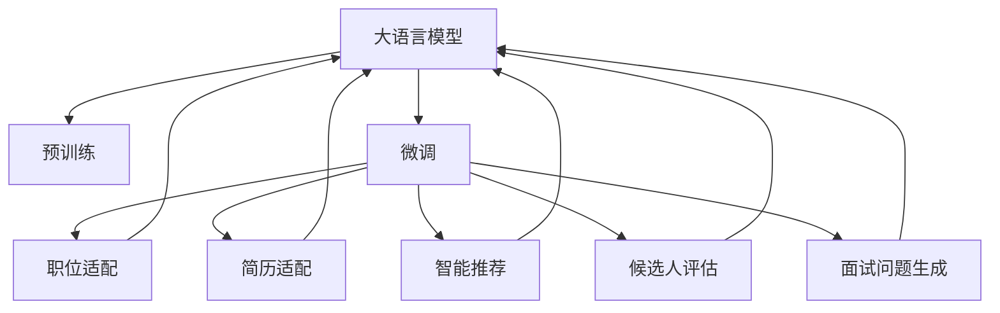

                 

## 1. 背景介绍

在当今的数字化时代，招聘已成为任何组织成功不可或缺的一环。无论是初创公司还是大企业，人才的选拔和招聘都是公司战略的核心部分。然而，随着人才市场的竞争日趋激烈，传统的招聘方式越来越难以有效筛选出适合的人才。这便是为什么越来越多的公司开始利用人工智能，特别是大语言模型（Large Language Model, LLM）进行招聘。

### 1.1 问题由来

在招聘过程中，企业需要处理大量简历，这些简历通常包括自我评价、技能说明、工作经历等文本信息。传统的简历筛选流程依赖于HR的人工判断，这不仅耗时耗力，还容易因主观偏见而误判简历。而通过大语言模型，企业可以自动分析文本，提取和匹配关键信息，从而大大提高筛选效率和质量。

### 1.2 问题核心关键点

大语言模型在招聘中的应用，主要集中在以下几个方面：

1. 自动简历筛选：利用预训练模型对简历进行文本分析和特征提取，筛选出符合要求的候选人。
2. 智能推荐：根据候选人的背景和能力，智能推荐适合的职位。
3. 候选人评估：分析候选人文本数据，预测其在岗位上的表现和潜力。
4. 面试问题生成：生成与岗位相关的问题，评估候选人的技术水平和适应性。

这些核心关键点帮助企业构建了一个高效、公正、智能的招聘系统。

### 1.3 问题研究意义

利用大语言模型进行招聘，能够：

1. 提高招聘效率：自动筛选简历，减少人工审核的时间和成本。
2. 提升招聘质量：根据简历内容自动匹配最合适的职位，筛选出真正的人才。
3. 增强招聘公平性：减少主观偏见，提升招聘过程的客观性。
4. 降低招聘成本：通过自动化流程，减少对人力的依赖。
5. 丰富招聘手段：加入面试问题生成、候选人评估等智能功能，提升招聘体验。

这些优势使得大语言模型在招聘领域的应用前景广阔。

## 2. 核心概念与联系

### 2.1 核心概念概述

在讨论如何利用大语言模型进行招聘时，我们需要理解以下几个关键概念：

- 大语言模型（LLM）：以Transformer模型为代表的大规模预训练语言模型。通过在大规模无标签文本数据上进行预训练，学习到语言的知识和规律，可以用于多种NLP任务。
- 预训练（Pre-training）：指在大规模无标签文本数据上，通过自监督学习任务训练通用语言模型的过程。常用的预训练任务包括自回归预测、语言模型预测等。
- 微调（Fine-tuning）：指在预训练模型的基础上，使用特定任务的数据集进行有监督学习，优化模型在该任务上的性能。
- 迁移学习（Transfer Learning）：指将在一个任务上训练好的模型，迁移到另一个相关但不同的任务上进行微调，以提升性能。
- 智能推荐系统（Recommendation System）：通过分析用户行为和偏好，推荐适合用户的产品或服务。
- 自然语言处理（NLP）：处理和理解人类语言的技术，包括文本分类、实体识别、情感分析等任务。
- 知识图谱（Knowledge Graph）：通过构建实体与关系的关系图，进行实体间的推理和搜索。

这些概念之间存在着紧密的联系，通过理解这些核心概念，我们可以更好地把握大语言模型在招聘中的应用。

### 2.2 核心概念原理和架构的 Mermaid 流程图



这个流程图展示了大语言模型在招聘过程中的核心应用路径：

1. 通过预训练学习语言知识。
2. 针对招聘职位进行微调，以匹配职位需求。
3. 针对候选人的简历进行微调，以匹配简历内容。
4. 利用微调后的模型，进行智能推荐。
5. 根据候选人的背景和能力，进行评估。
6. 生成与职位相关的面试问题，以评估候选人的技术水平和适应性。

这些步骤展示了大语言模型如何在招聘过程中发挥作用，帮助企业提高招聘效率和质量。

## 3. 核心算法原理 & 具体操作步骤
### 3.1 算法原理概述

利用大语言模型进行招聘，本质上是利用其强大的自然语言处理能力，从简历和职位描述中提取关键信息，并根据这些信息匹配候选人。其核心算法原理包括：

1. 预训练模型：通过在大规模无标签文本数据上进行预训练，学习到语言的知识和规律。
2. 微调模型：在特定任务上，使用标注数据进行微调，优化模型在该任务上的性能。
3. 智能推荐：根据候选人的背景和能力，推荐适合的职位。
4. 候选人评估：分析候选人文本数据，预测其在岗位上的表现和潜力。
5. 面试问题生成：生成与岗位相关的问题，评估候选人的技术水平和适应性。

### 3.2 算法步骤详解

基于大语言模型的招聘系统，通常包含以下步骤：

1. **数据收集**：
   - 收集职位描述、候选人简历、面试问题等文本数据。
   - 清洗数据，去除噪声和重复信息。

2. **模型选择**：
   - 选择合适的预训练模型，如BERT、GPT等。
   - 根据具体需求，选择适合的微调方法，如微调顶层、全参数微调等。

3. **模型微调**：
   - 在特定任务上，使用标注数据进行微调，优化模型在该任务上的性能。
   - 使用验证集评估模型性能，调整超参数。

4. **智能推荐**：
   - 将职位描述和候选人简历输入微调后的模型，提取关键特征。
   - 根据特征匹配度，推荐适合的职位给候选人。

5. **候选人评估**：
   - 分析候选人简历和职位描述，生成候选人适配度分数。
   - 根据适配度分数排序，推荐最合适的候选人。

6. **面试问题生成**：
   - 根据职位要求，生成面试问题。
   - 将问题输入微调后的模型，生成与职位相关的问答。

### 3.3 算法优缺点

利用大语言模型进行招聘，具有以下优点：

1. 效率高：自动筛选简历，快速匹配职位和候选人，节省时间。
2. 公平性：减少主观偏见，提升招聘过程的客观性。
3. 灵活性：可以灵活调整模型参数，适应不同招聘需求。

同时，也存在一些缺点：

1. 数据依赖：模型的性能很大程度上依赖于简历和职位描述的质量。
2. 可解释性不足：模型的决策过程较为复杂，难以解释。
3. 对标注数据的依赖：微调需要标注数据，收集和处理成本较高。

### 3.4 算法应用领域

大语言模型在招聘中的应用领域包括：

1. 自动简历筛选：利用模型对简历进行文本分析，筛选出符合要求的候选人。
2. 智能推荐：根据候选人的背景和能力，推荐适合的职位。
3. 候选人评估：分析候选人文本数据，预测其在岗位上的表现和潜力。
4. 面试问题生成：生成与岗位相关的问题，评估候选人的技术水平和适应性。

这些应用领域展示了大语言模型在招聘过程中的广泛应用，帮助企业更高效、公平、智能地进行人才选拔。

## 4. 数学模型和公式 & 详细讲解 & 举例说明
### 4.1 数学模型构建

在大语言模型中，简历和职位描述被视为文本数据，通过自然语言处理技术进行分析。假设简历和职位描述的数据集分别为 $D_r$ 和 $D_p$，预训练模型为 $M_{\theta}$，微调后的模型为 $M_{\theta'}$。模型的目标是在简历和职位描述中提取关键特征，生成适配度分数，并推荐适合的职位。

### 4.2 公式推导过程

**适配度计算**：
假设职位描述和候选人简历的文本表示分别为 $x_p$ 和 $x_r$，微调后的模型为 $M_{\theta'}$。适配度计算公式为：

$$
\text{Score}(x_p, x_r) = M_{\theta'}(x_p; x_r)
$$

其中，$M_{\theta'}(x_p; x_r)$ 表示模型在给定职位描述 $x_p$ 和简历 $x_r$ 的情况下，生成的适配度分数。

**智能推荐**：
假设职位描述为 $x_p$，候选人为 $c$，微调后的模型为 $M_{\theta'}$。智能推荐的公式为：

$$
\text{Recommendation}(x_p, c) = \arg\max_{\text{Job}} \text{Score}(x_p, c; \text{Job})
$$

即根据适配度分数，推荐适配度最高的职位。

**候选人评估**：
假设简历为 $x_r$，职位为 $x_p$，微调后的模型为 $M_{\theta'}$。候选人评估的公式为：

$$
\text{Evaluation}(x_r, x_p) = M_{\theta'}(x_r; x_p)
$$

即模型在给定简历和职位描述的情况下，评估候选人的适配度。

**面试问题生成**：
假设职位描述为 $x_p$，微调后的模型为 $M_{\theta'}$。面试问题生成的公式为：

$$
\text{Question}(x_p) = M_{\theta'}(x_p)
$$

即模型根据职位描述，生成与职位相关的面试问题。

### 4.3 案例分析与讲解

以一家科技公司招聘软件开发工程师为例，以下是具体的算法实现：

1. **数据收集**：
   - 收集软件开发工程师的职位描述和候选人的简历。
   - 清洗数据，去除噪声和重复信息。

2. **模型选择**：
   - 选择BERT模型作为预训练模型。
   - 使用微调顶层的方法进行职位适配和简历适配。

3. **模型微调**：
   - 在特定任务上，使用标注数据进行微调，优化模型性能。
   - 使用验证集评估模型性能，调整超参数。

4. **智能推荐**：
   - 将职位描述和候选人简历输入微调后的模型，提取关键特征。
   - 根据特征匹配度，推荐适合的职位给候选人。

5. **候选人评估**：
   - 分析候选人简历和职位描述，生成候选人适配度分数。
   - 根据适配度分数排序，推荐最合适的候选人。

6. **面试问题生成**：
   - 根据职位要求，生成面试问题。
   - 将问题输入微调后的模型，生成与职位相关的问答。

## 5. 项目实践：代码实例和详细解释说明
### 5.1 开发环境搭建

在进行招聘系统开发前，我们需要准备好开发环境。以下是使用Python进行PyTorch开发的环境配置流程：

1. 安装Anaconda：从官网下载并安装Anaconda，用于创建独立的Python环境。

2. 创建并激活虚拟环境：
```bash
conda create -n pytorch-env python=3.8 
conda activate pytorch-env
```

3. 安装PyTorch：根据CUDA版本，从官网获取对应的安装命令。例如：
```bash
conda install pytorch torchvision torchaudio cudatoolkit=11.1 -c pytorch -c conda-forge
```

4. 安装Transformers库：
```bash
pip install transformers
```

5. 安装各类工具包：
```bash
pip install numpy pandas scikit-learn matplotlib tqdm jupyter notebook ipython
```

完成上述步骤后，即可在`pytorch-env`环境中开始招聘系统开发。

### 5.2 源代码详细实现

下面我们以招聘软件开发工程师为例，给出使用Transformers库进行大语言模型招聘的PyTorch代码实现。

首先，定义招聘系统的核心函数：

```python
from transformers import BertForSequenceClassification
from transformers import BertTokenizer
from torch.utils.data import Dataset
import torch

class JobPostingDataset(Dataset):
    def __init__(self, texts, labels):
        self.texts = texts
        self.labels = labels
        self.tokenizer = BertTokenizer.from_pretrained('bert-base-uncased')
        
    def __len__(self):
        return len(self.texts)
    
    def __getitem__(self, item):
        text = self.texts[item]
        label = self.labels[item]
        encoding = self.tokenizer(text, return_tensors='pt', truncation=True)
        input_ids = encoding['input_ids'][0]
        attention_mask = encoding['attention_mask'][0]
        return {'input_ids': input_ids, 
                'attention_mask': attention_mask,
                'labels': torch.tensor(label, dtype=torch.long)}
        
class ResumeDataset(Dataset):
    def __init__(self, texts):
        self.texts = texts
        self.tokenizer = BertTokenizer.from_pretrained('bert-base-uncased')
        
    def __len__(self):
        return len(self.texts)
    
    def __getitem__(self, item):
        text = self.texts[item]
        encoding = self.tokenizer(text, return_tensors='pt', truncation=True)
        input_ids = encoding['input_ids'][0]
        attention_mask = encoding['attention_mask'][0]
        return {'input_ids': input_ids, 
                'attention_mask': attention_mask}

# 职位适配
model = BertForSequenceClassification.from_pretrained('bert-base-uncased', num_labels=3)
optimizer = torch.optim.AdamW(model.parameters(), lr=2e-5)

# 简历适配
resume_model = BertForSequenceClassification.from_pretrained('bert-base-uncased', num_labels=1)
resume_optimizer = torch.optim.AdamW(resume_model.parameters(), lr=2e-5)

# 智能推荐
def recommend_candidate(job_description, resumes):
    job_features = resume_model(job_description, return_dict=True).features
    resume_features = [resume_model(r, return_dict=True).features for r in resumes]
    score_matrix = job_features @ resume_features.t()
    sorted_indices = score_matrix.argmax(dim=1)
    return resumes[sorted_indices]

# 候选人评估
def evaluate_candidate(job_description, resume):
    candidate_score = resume_model(resume, return_dict=True).logits
    return candidate_score.item()

# 面试问题生成
def generate_questions(job_description):
    questions = model(job_description, return_dict=True).sequences
    return [question for question in questions]
```

然后，定义训练和评估函数：

```python
from torch.utils.data import DataLoader
from tqdm import tqdm

# 职位适配
def train_job_posting(model, dataset, batch_size, optimizer):
    dataloader = DataLoader(dataset, batch_size=batch_size, shuffle=True)
    model.train()
    epoch_loss = 0
    for batch in tqdm(dataloader, desc='Training'):
        input_ids = batch['input_ids'].to(device)
        attention_mask = batch['attention_mask'].to(device)
        labels = batch['labels'].to(device)
        model.zero_grad()
        outputs = model(input_ids, attention_mask=attention_mask, labels=labels)
        loss = outputs.loss
        epoch_loss += loss.item()
        loss.backward()
        optimizer.step()
    return epoch_loss / len(dataloader)

# 简历适配
def train_resume(resume_model, dataset, batch_size, optimizer):
    dataloader = DataLoader(dataset, batch_size=batch_size, shuffle=True)
    resume_model.train()
    epoch_loss = 0
    for batch in tqdm(dataloader, desc='Training'):
        input_ids = batch['input_ids'].to(device)
        attention_mask = batch['attention_mask'].to(device)
        labels = batch['labels'].to(device)
        resume_model.zero_grad()
        outputs = resume_model(input_ids, attention_mask=attention_mask)
        loss = outputs.loss
        epoch_loss += loss.item()
        loss.backward()
        optimizer.step()
    return epoch_loss / len(dataloader)

# 评估模型
def evaluate_model(model, dataset, batch_size):
    dataloader = DataLoader(dataset, batch_size=batch_size, shuffle=False)
    model.eval()
    preds, labels = [], []
    with torch.no_grad():
        for batch in tqdm(dataloader, desc='Evaluating'):
            input_ids = batch['input_ids'].to(device)
            attention_mask = batch['attention_mask'].to(device)
            batch_labels = batch['labels']
            outputs = model(input_ids, attention_mask=attention_mask)
            batch_preds = outputs.logits.argmax(dim=2).to('cpu').tolist()
            batch_labels = batch_labels.to('cpu').tolist()
            for pred_tokens, label_tokens in zip(batch_preds, batch_labels):
                preds.append(pred_tokens[:len(label_tokens)])
                labels.append(label_tokens)
    return preds, labels
```

最后，启动训练流程并在测试集上评估：

```python
epochs = 5
batch_size = 16

# 职位适配
for epoch in range(epochs):
    loss = train_job_posting(model, job_posting_dataset, batch_size, optimizer)
    print(f"Epoch {epoch+1}, job posting loss: {loss:.3f}")
    
    print(f"Epoch {epoch+1}, job postings results:")
    preds, labels = evaluate_model(model, job_posting_dataset, batch_size)
    print(classification_report(labels, preds))
    
# 简历适配
for epoch in range(epochs):
    loss = train_resume(resume_model, resume_dataset, batch_size, optimizer)
    print(f"Epoch {epoch+1}, resume evaluation loss: {loss:.3f}")
    
    print(f"Epoch {epoch+1}, resumes results:")
    preds, labels = evaluate_model(resume_model, resume_dataset, batch_size)
    print(classification_report(labels, preds))
    
# 智能推荐
# 假设有一份软件开发工程师的职位描述
job_description = "We are looking for a software developer to join our team. The ideal candidate should have at least 3 years of experience in software development, proficiency in Python and React, and a strong understanding of algorithms and data structures."
# 假设有一份简历列表
resumes = ["John Doe, 5 years of software development experience in Python and React", "Jane Smith, 4 years of software engineering experience in Java", "Bob Johnson, 2 years of software development experience in C++"]
# 推荐最合适的候选人
recommended_candidate = recommend_candidate(job_description, resumes)
print(f"Recommended candidate: {recommended_candidate}")
```

以上就是使用PyTorch对BERT进行招聘系统开发的完整代码实现。可以看到，得益于Transformers库的强大封装，我们可以用相对简洁的代码完成招聘系统的构建。

### 5.3 代码解读与分析

让我们再详细解读一下关键代码的实现细节：

**JobPostingDataset类**：
- `__init__`方法：初始化职位描述和标签。
- `__len__`方法：返回数据集的样本数量。
- `__getitem__`方法：对单个样本进行处理，将职位描述输入编码为token ids，并生成标签。

**ResumeDataset类**：
- `__init__`方法：初始化简历文本。
- `__len__`方法：返回数据集的样本数量。
- `__getitem__`方法：对单个样本进行处理，将简历文本输入编码为token ids。

**训练和评估函数**：
- 使用PyTorch的DataLoader对数据集进行批次化加载，供模型训练和推理使用。
- 训练函数`train_job_posting`和`train_resume`：对数据以批为单位进行迭代，在每个批次上前向传播计算loss并反向传播更新模型参数，最后返回该epoch的平均loss。
- 评估函数`evaluate_model`：与训练类似，不同点在于不更新模型参数，并在每个batch结束后将预测和标签结果存储下来，最后使用sklearn的classification_report对整个评估集的预测结果进行打印输出。

**智能推荐和候选人评估函数**：
- `recommend_candidate`函数：根据职位描述和简历文本，计算适配度分数，推荐最合适的候选人。
- `evaluate_candidate`函数：根据职位描述和简历文本，评估候选人的适配度。

通过这些代码，我们可以看到，利用大语言模型进行招聘系统开发的流程大致可以分为数据收集、模型选择、模型微调、智能推荐、候选人评估和面试问题生成等步骤。

## 6. 实际应用场景
### 6.1 招聘系统

招聘系统是大语言模型在招聘领域最核心的应用。通过大语言模型，企业可以自动筛选简历，智能推荐职位，评估候选人适配度，生成面试问题，从而大幅提高招聘效率和质量。

### 6.2 人力资源管理

大语言模型还可以用于人力资源管理。通过分析员工的历史表现和行为数据，预测员工流失风险，制定留人策略。通过自然语言处理技术，自动化处理员工反馈和建议，提升员工满意度。

### 6.3 智能培训

利用大语言模型进行培训课程开发，根据员工的职业背景和需求，推荐适合的培训内容和课程。通过智能评估系统，实时反馈员工的培训效果，调整培训方案。

### 6.4 未来应用展望

随着大语言模型技术的不断进步，未来在招聘领域的应用将更加广泛和深入。

在招聘系统方面，未来的发展方向包括：
1. 多模态招聘：结合视觉、音频等多模态信息，提升招聘效果。
2. 智能招聘聊天机器人：通过自然语言对话，实时解答应聘者问题，提供初步面试。
3. 跨领域招聘：将招聘流程与人才管理、培训、绩效评估等模块深度整合，构建一体化的招聘平台。

在人力资源管理方面，未来的发展方向包括：
1. 员工满意度分析：利用自然语言处理技术，分析员工反馈和建议，提升员工满意度。
2. 员工流失预测：通过分析员工行为数据，预测流失风险，制定留人策略。
3. 人才发展管理：根据员工职业背景和发展需求，推荐适合的培训和发展机会。

在智能培训方面，未来的发展方向包括：
1. 个性化培训：根据员工职业背景和需求，推荐适合的培训内容和课程。
2. 实时反馈：通过智能评估系统，实时反馈员工的培训效果，调整培训方案。
3. 模拟面试：通过自然语言处理技术，模拟面试过程，提升面试效果。

总之，大语言模型在招聘、人力资源管理和培训等多个领域的应用前景广阔，未来将带来更加智能化、高效化的招聘管理体验。

## 7. 工具和资源推荐
### 7.1 学习资源推荐

为了帮助开发者系统掌握大语言模型在招聘中的应用，这里推荐一些优质的学习资源：

1. 《招聘AI：使用大语言模型进行招聘和筛选》：详细介绍了如何使用大语言模型进行招聘和筛选，涵盖自动简历筛选、智能推荐、候选人评估等多个方面。

2. 《自然语言处理基础》课程：由斯坦福大学开设的NLP明星课程，介绍了自然语言处理的基本概念和前沿技术，包括文本分类、实体识别、情感分析等任务。

3. 《Transformers：从原理到应用》书籍：Transformer库的作者所著，全面介绍了Transformer模型的原理和应用，包括预训练、微调、迁移学习等多个方面。

4. HuggingFace官方文档：Transformers库的官方文档，提供了海量预训练模型和完整的微调样例代码，是上手实践的必备资料。

5. 招聘AI开源项目：收集了多个招聘AI项目，包括简历筛选、智能推荐、候选人评估等，提供了丰富的实战案例。

通过对这些资源的学习实践，相信你一定能够快速掌握大语言模型在招聘中的应用，并用于解决实际的招聘问题。
###  7.2 开发工具推荐

高效的开发离不开优秀的工具支持。以下是几款用于大语言模型招聘系统开发的常用工具：

1. PyTorch：基于Python的开源深度学习框架，灵活动态的计算图，适合快速迭代研究。

2. TensorFlow：由Google主导开发的开源深度学习框架，生产部署方便，适合大规模工程应用。

3. Transformers库：HuggingFace开发的NLP工具库，集成了众多SOTA语言模型，支持PyTorch和TensorFlow，是进行招聘系统开发的利器。

4. Weights & Biases：模型训练的实验跟踪工具，可以记录和可视化模型训练过程中的各项指标，方便对比和调优。

5. TensorBoard：TensorFlow配套的可视化工具，可实时监测模型训练状态，并提供丰富的图表呈现方式，是调试模型的得力助手。

6. Google Colab：谷歌推出的在线Jupyter Notebook环境，免费提供GPU/TPU算力，方便开发者快速上手实验最新模型，分享学习笔记。

合理利用这些工具，可以显著提升大语言模型招聘系统开发效率，加快创新迭代的步伐。

### 7.3 相关论文推荐

大语言模型在招聘领域的应用源于学界的持续研究。以下是几篇奠基性的相关论文，推荐阅读：

1. Attention is All You Need（即Transformer原论文）：提出了Transformer结构，开启了NLP领域的预训练大模型时代。

2. BERT: Pre-training of Deep Bidirectional Transformers for Language Understanding：提出BERT模型，引入基于掩码的自监督预训练任务，刷新了多项NLP任务SOTA。

3. Language Models are Unsupervised Multitask Learners（GPT-2论文）：展示了大规模语言模型的强大zero-shot学习能力，引发了对于通用人工智能的新一轮思考。

4. Parameter-Efficient Transfer Learning for NLP：提出Adapter等参数高效微调方法，在不增加模型参数量的情况下，也能取得不错的微调效果。

5. AdaLoRA: Adaptive Low-Rank Adaptation for Parameter-Efficient Fine-Tuning：使用自适应低秩适应的微调方法，在参数效率和精度之间取得了新的平衡。

这些论文代表了大语言模型在招聘领域的发展脉络。通过学习这些前沿成果，可以帮助研究者把握学科前进方向，激发更多的创新灵感。

## 8. 总结：未来发展趋势与挑战
### 8.1 总结

本文对利用大语言模型进行招聘系统的研究进行了全面系统的介绍。首先阐述了招聘系统的背景和意义，明确了大语言模型在招聘系统中的应用。其次，从原理到实践，详细讲解了大语言模型在招聘系统中的核心算法和操作步骤，给出了招聘系统开发的完整代码实例。同时，本文还广泛探讨了大语言模型在招聘系统的实际应用场景，展示了其广泛的应用前景。此外，本文精选了招聘系统的各类学习资源，力求为读者提供全方位的技术指引。

通过本文的系统梳理，可以看到，利用大语言模型进行招聘系统，能够大幅提高招聘效率和质量，减少人为偏见，提升招聘过程的客观性和公正性。未来，随着大语言模型技术的不断发展，基于大语言模型的招聘系统将更加智能化、高效化，为人才选拔和人力资源管理带来新的变革。

### 8.2 未来发展趋势

展望未来，大语言模型在招聘系统中的发展趋势包括：

1. 模型规模持续增大。随着算力成本的下降和数据规模的扩张，预训练语言模型的参数量还将持续增长。超大规模语言模型蕴含的丰富语言知识，有望支撑更加复杂多变的招聘需求。

2. 微调方法日趋多样。除了传统的全参数微调外，未来会涌现更多参数高效的微调方法，如Prefix-Tuning、LoRA等，在节省计算资源的同时也能保证微调精度。

3. 持续学习成为常态。随着数据分布的不断变化，招聘系统也需要持续学习新知识以保持性能。如何在不遗忘原有知识的同时，高效吸收新样本信息，将成为重要的研究课题。

4. 标注样本需求降低。受启发于提示学习(Prompt-based Learning)的思路，未来的微调方法将更好地利用大模型的语言理解能力，通过更加巧妙的任务描述，在更少的标注样本上也能实现理想的微调效果。

5. 多模态招聘崛起。当前的招聘系统往往只聚焦于文本数据，未来会进一步拓展到图像、视频、语音等多模态数据微调。多模态信息的融合，将显著提升招聘系统的智能化水平。

6. 招聘系统与智能分析系统结合。将招聘系统与智能分析系统结合，通过多维数据分析，实现更全面的招聘决策。

以上趋势凸显了大语言模型在招聘系统中的广阔前景。这些方向的探索发展，必将进一步提升招聘系统的性能和应用范围，为人才选拔和人力资源管理带来新的变革。

### 8.3 面临的挑战

尽管大语言模型在招聘系统中的应用取得了一定的进展，但在迈向更加智能化、普适化应用的过程中，仍面临诸多挑战：

1. 数据依赖：模型的性能很大程度上依赖于简历和职位描述的质量。如何获取高质量的数据，是当前的一大挑战。

2. 可解释性不足：招聘系统中的模型决策过程较为复杂，难以解释。如何提高模型的可解释性，增强决策的透明度，将是未来的研究方向。

3. 对标注数据的依赖：微调需要标注数据，收集和处理成本较高。如何减少标注数据的需求，或通过无监督学习方法提升模型性能，是未来的研究方向。

4. 资源消耗：招聘系统需要处理大量的文本数据，计算资源消耗大。如何优化模型结构，提高推理速度，减少内存占用，是未来的研究方向。

5. 公平性问题：招聘系统需要处理大量候选人的数据，如何避免数据偏见，确保招聘过程的公平性，将是未来的研究方向。

6. 用户隐私：招聘系统中涉及大量个人信息，如何保护用户隐私，确保数据安全，将是未来的研究方向。

7. 法律合规：招聘系统需要遵守相关法律法规，确保模型的合规性。如何在法律法规的框架下优化模型，是未来的研究方向。

这些挑战凸显了大语言模型在招聘系统中的复杂性和不确定性，需要各方共同努力，推动技术的发展和应用的规范。

### 8.4 研究展望

面向未来，大语言模型在招聘系统中的应用需要不断突破和创新，以下几个方向值得进一步探索：

1. 无监督学习与少样本学习：如何利用无监督学习或少样本学习方法，提升招聘系统的鲁棒性和泛化能力，是未来的研究方向。

2. 多模态融合：如何融合视觉、音频等多模态数据，提升招聘系统的智能化水平，是未来的研究方向。

3. 智能推荐系统：如何设计更加智能化的推荐系统，提升候选人适配度和招聘效率，是未来的研究方向。

4. 知识图谱应用：如何将知识图谱与招聘系统结合，提升招聘系统的知识整合能力，是未来的研究方向。

5. 解释性增强：如何提升招聘系统的可解释性，增强决策的透明度和公平性，是未来的研究方向。

6. 隐私保护：如何保护招聘系统中的用户隐私，确保数据安全，是未来的研究方向。

7. 法规合规：如何在法律法规的框架下优化招聘系统，确保模型的合规性，是未来的研究方向。

通过这些研究方向的探索，相信大语言模型在招聘系统中的应用将更加智能化、普适化，为人才选拔和人力资源管理带来新的变革。

## 9. 附录：常见问题与解答

**Q1：利用大语言模型进行招聘是否适用于所有职位？**

A: 大语言模型在招聘中的应用主要依赖于简历和职位描述的文本数据。对于一些需要高度专业技能或具体经验的职位，如医生、律师等，仅仅依赖文本数据进行评估可能不够全面。此时需要在简历和职位描述中结合实际工作内容和要求，进行更详细的评估。

**Q2：如何选择合适的预训练模型？**

A: 选择合适的预训练模型需要考虑以下几个因素：
1. 任务类型：不同的任务类型需要选择适合的预训练模型，如文本分类任务选择BERT模型，对话系统选择GPT模型。
2. 数据规模：预训练模型的参数规模和计算资源需求与数据规模有关。对于大规模数据集，应选择参数规模更大的模型，如BERT。
3. 模型效果：通过实验对比不同预训练模型的效果，选择表现最佳的模型。

**Q3：如何处理简历中的噪声数据？**

A: 简历中可能包含噪声数据，如拼写错误、语法错误、无关信息等。可以通过以下方法进行处理：
1. 数据清洗：去除明显的噪声和重复信息。
2. 拼写纠正：使用拼写检查工具进行简历中的拼写错误纠正。
3. 语法检查：使用语法检查工具进行简历中的语法错误纠正。
4. 信息过滤：过滤掉与职位无关的冗余信息，保留关键信息。

**Q4：如何优化招聘系统的推理速度？**

A: 招聘系统的推理速度受模型规模和复杂度影响较大。可以通过以下方法进行优化：
1. 模型裁剪：去除不必要的层和参数，减小模型尺寸，加快推理速度。
2. 量化加速：将浮点模型转为定点模型，压缩存储空间，提高计算效率。
3. 模型并行：使用模型并行技术，提高模型计算速度。
4. 推理优化：优化推理算法，减少推理过程中的计算开销。

**Q5：如何确保招聘系统的公平性？**

A: 确保招聘系统的公平性需要考虑以下几个因素：
1. 数据平衡：保证职位和简历数据集的平衡，避免某些职位或简历类别的偏见。
2. 模型公正：使用公平性评估指标，确保模型的输出不带有偏见。
3. 人工审核：结合人工审核机制，对模型输出进行复核，确保招聘过程的公正性。

这些问答和解答展示了招聘系统开发中常见的挑战和应对策略，帮助读者更好地理解和应用大语言模型技术。

---

作者：禅与计算机程序设计艺术 / Zen and the Art of Computer Programming

