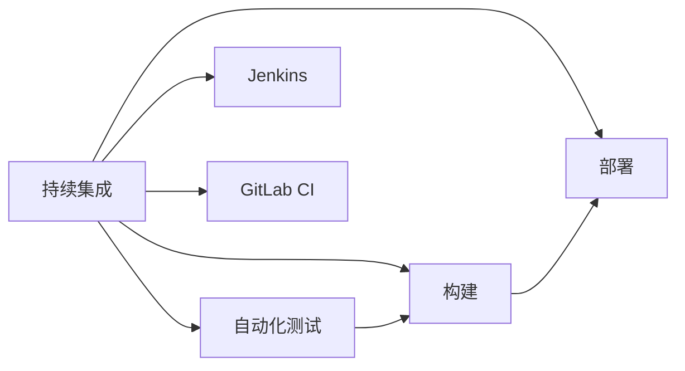

                 

# 持续集成工具：Jenkins 和 GitLab CI 的比较

> 关键词：持续集成, Jenkins, GitLab CI, DevOps, 自动化测试, 部署, 工具对比

## 1. 背景介绍

在当今的软件开发过程中，持续集成(Continuous Integration, CI)已成为开发团队不可或缺的一部分。它允许开发者定期将代码合并到主干分支中，从而保证代码的稳定性和可维护性。此外，CI系统还负责自动化测试、构建、部署等任务，极大提升了开发效率和产品质量。

然而，市场上有众多CI工具可供选择，如Jenkins、GitLab CI等。选择正确的工具对于团队的开发流程至关重要。本文将详细比较Jenkins和GitLab CI这两款主流持续集成工具，帮助读者全面了解它们的优缺点，选择最适合的方案。

## 2. 核心概念与联系

### 2.1 核心概念概述

为了更好地理解Jenkins和GitLab CI的比较，本节将介绍几个关键概念：

- 持续集成(Continuous Integration)：指在软件开发过程中，将代码频繁地合并到主干分支中，并通过自动化工具验证每次合并后的代码质量。CI工具负责执行构建、测试、部署等任务，确保软件交付的稳定性。

- Jenkins：一款开源的持续集成工具，最初由Forrest Ranum创建。Jenkins支持多种插件和脚本语言，具有强大的可扩展性和灵活性。它主要通过Web界面管理任务，支持并行执行，可用于任何规模的项目。

- GitLab CI：GitLab内置的持续集成系统，提供易于使用的Web界面和CI/CD管道功能。GitLab CI与GitLab无缝集成，适用于GitLab项目管理和版本控制。

- DevOps：DevOps是软件开发和运维团队合作的实践，旨在通过自动化和持续交付来提高软件交付速度和质量。CI作为DevOps的核心组件，是实现自动化交付的重要工具。

- 自动化测试：通过脚本和工具自动化执行测试用例，验证软件功能是否符合预期。自动化测试能够快速发现问题，提高开发效率。

- 部署：将代码从开发环境部署到生产环境，确保代码在真实环境中的运行状态。CI系统通过自动化部署流程，减少了人为错误，提高了部署效率。

这些核心概念共同构成了持续集成的框架，Jenkins和GitLab CI正是在这一框架下，分别提供了一套完整的解决方案。

### 2.2 核心概念原理和架构的 Mermaid 流程图



这个流程图展示了CI的核心流程和两个工具在其中的角色：

1. **持续集成(A)**：持续地将代码合并到主干分支中。
2. **自动化测试(B)**：自动执行测试用例，验证代码质量。
3. **构建(C)**：编译和打包代码，生成可执行的输出。
4. **部署(D)**：将可执行输出部署到生产环境。
5. **Jenkins(E)**：一款开源的CI工具，提供丰富的插件和灵活的配置。
6. **GitLab CI(F)**：GitLab内置的CI系统，与版本控制无缝集成，适用于GitLab项目。

## 3. 核心算法原理 & 具体操作步骤

### 3.1 算法原理概述

Jenkins和GitLab CI的核心算法原理主要体现在两个方面：

- **构建和测试的自动化执行**：通过脚本和插件，实现构建、测试、部署等任务的自动化，减少人为操作，提高效率。
- **并行执行和流水线编排**：支持并行执行任务，提高资源利用率。同时，通过流水线编排，实现复杂的任务流程自动化。

### 3.2 算法步骤详解

#### 3.2.1 Jenkins

1. **安装与配置**：
   - 下载并解压Jenkins软件包，安装Jenkins服务。
   - 配置Jenkins环境，包括JDK、Maven等依赖。
   - 创建Jenkins用户并赋予相应权限。

2. **插件安装**：
   - 安装必要的插件，如Git插件、Maven插件、Gradle插件等。

3. **任务配置**：
   - 创建Jenkins项目，添加源代码管理、构建、测试、部署等任务。
   - 配置构建脚本，例如使用Maven或Gradle。

4. **并行执行**：
   - 通过并行执行插件，启动多节点构建，提高效率。
   - 设置节点管理，合理分配资源。

#### 3.2.2 GitLab CI

1. **安装与配置**：
   - 在GitLab上创建一个项目，选择公共或私有权限。
   - 配置项目依赖和变量，例如Docker镜像、环境变量等。

2. **CI配置文件**：
   - 创建`.gitlab-ci.yml`文件，定义CI任务流程。
   - 配置每个任务的触发条件、执行命令、依赖关系等。

3. **并行执行**：
   - 使用`stage`和`parallel`关键字，实现任务并行执行。
   - 配置`before_script`和`after_script`，优化执行顺序。

### 3.3 算法优缺点

#### Jenkins

**优点**：
- 开源免费，社区活跃，支持丰富的插件。
- 高度灵活，可配置性强，支持复杂的构建流程。
- 功能强大，支持复杂的自动化任务和并行执行。

**缺点**：
- 界面复杂，配置难度较大。
- 系统资源占用较多，性能瓶颈较大。
- 依赖本地服务器环境，部署复杂。

#### GitLab CI

**优点**：
- 与GitLab无缝集成，操作简便。
- 基于容器化技术，性能可靠。
- 支持DevOps生态，易于与其他GitLab工具集成。

**缺点**：
- 灵活性不如Jenkins，定制化配置较难。
- 功能相对单一，不适合复杂项目。
- 需要GitLab账号，跨团队协作受限。

### 3.4 算法应用领域

Jenkins和GitLab CI均适用于各种规模和类型的项目，但根据具体需求，它们的应用领域略有差异：

- **Jenkins**：
  - 适用于大型、复杂项目，需要高度定制和复杂配置的场景。
  - 适合需要高并行执行效率的项目，例如数据处理、机器学习等。
  - 适用于需要与其他DevOps工具集成的场景，如JIRA、SonarQube等。

- **GitLab CI**：
  - 适用于GitLab项目，支持版本控制和代码管理。
  - 适合小型到中型项目，配置相对简单，操作简便。
  - 支持DevOps生态，易于集成CI/CD管道，适合微服务架构。

## 4. 数学模型和公式 & 详细讲解 & 举例说明

由于持续集成工具的核心在于自动化流程和配置，因此数学模型和公式主要应用于任务执行效率和并行性能的计算。

### 4.1 数学模型构建

假设有一个需要并行执行的任务，共有n个子任务，每个子任务耗时为ti。则并行执行的总耗时为：

$$
T_{parallel} = \max_{i=1}^{n} t_i
$$

### 4.2 公式推导过程

以Jenkins和GitLab CI为例，通过并行执行优化任务总耗时。

#### Jenkins

假设Jenkins配置了m个节点，每个子任务耗时为ti。则并行执行总耗时计算如下：

$$
T_{Jenkins} = \max_{i=1}^{n} t_i
$$

其中，t\_i的计算需要考虑节点负载、任务并发度等，具体的公式推导较为复杂，需要根据实际配置和环境进行优化。

#### GitLab CI

假设GitLab CI配置了n个CI/CD管道，每个管道执行时间相同，为t。则并行执行总耗时计算如下：

$$
T_{GitLab\ CI} = n \times t
$$

由于GitLab CI内置了容器化技术，任务执行效率相对稳定，因此总耗时主要受管道数量和执行时间的影响。

### 4.3 案例分析与讲解

以一个简单的Java项目为例，使用Jenkins和GitLab CI进行持续集成。假设项目有3个子任务，每个子任务耗时分别为1小时、1.5小时、2小时。

#### Jenkins配置

假设Jenkins配置了2个节点，每个节点并发度为2，则并行执行总耗时为2小时。

```bash
parallel {
    stage('Build') {
        parallel {
            sh 'mvn clean install'
            sh 'mvn clean package'
        }
    }
    stage('Test') {
        parallel {
            sh 'mvn test'
            sh 'mvn integration-test'
        }
    }
}
```

#### GitLab CI配置

假设GitLab CI配置了3个CI/CD管道，每个管道执行时间分别为1小时、1.5小时、2小时。则并行执行总耗时为2.5小时。

```yaml
stages:
  - build
  - test
  - deploy

build:
  script:
    - mvn clean install
    - mvn clean package

test:
  script:
    - mvn test
    - mvn integration-test

deploy:
  script:
    - mvn deploy
```

通过以上案例，可以看到，在任务总耗时方面，Jenkins和GitLab CI存在差异，但具体选择还需考虑任务特性、资源需求、操作便利性等因素。

## 5. 项目实践：代码实例和详细解释说明

### 5.1 开发环境搭建

#### Jenkins

1. **安装Jenkins**：
   - 下载Jenkins服务器和客户端。
   - 安装JDK、Maven等依赖。
   - 运行Jenkins服务并开启管理界面。

2. **安装插件**：
   - 在Jenkins管理界面中安装Git、Maven、Gradle等插件。

#### GitLab CI

1. **创建GitLab项目**：
   - 登录GitLab，创建项目并设置权限。
   - 添加项目依赖和变量，如Docker镜像、环境变量等。

2. **配置CI/CD管道**：
   - 在`.gitlab-ci.yml`文件中定义CI任务流程。
   - 配置触发条件、执行命令、依赖关系等。

### 5.2 源代码详细实现

#### Jenkins示例代码

```groovy
import hudson.EnvVars
import hudson.model.AbstractProject
import hudson.model.Run
import hudson.model.TaskListener
import hudson.tasks.Maven
import hudson.util.FormValidation

@Extension
public class MavenBuildStepBuilder extends BuildStepDescriptor<MavenBuildStepBuilder> {

    @Extension
    public static final MavenBuildStepBuilder DESCRIPTOR = new MavenBuildStepBuilder();

    @Override
    public String getDisplayName() {
        return "Maven Build";
    }

    @Override
    public String getUrlName() {
        return "maven-build";
    }

    public String configure(String parent, String mavenParams, String mavenCommand, String mavenGoals, String goalName, String projectGroup) throws Exception {
        // 配置逻辑
    }

    public void configure(MavenBuildStep step, String parent, String mavenParams, String mavenCommand, String mavenGoals, String goalName, String projectGroup) throws Exception {
        // 配置逻辑
    }

    public boolean validate(String parent, String mavenParams, String mavenCommand, String mavenGoals, String goalName, String projectGroup) throws Exception {
        // 配置验证逻辑
    }
}
```

#### GitLab CI示例代码

```yaml
stages:
  - build
  - test
  - deploy

build:
  script:
    - mvn clean install
    - mvn clean package

test:
  script:
    - mvn test
    - mvn integration-test

deploy:
  script:
    - mvn deploy
```

### 5.3 代码解读与分析

#### Jenkins示例代码

1. **MavenBuildStepBuilder类**：
   - 该类用于配置Maven构建任务，实现任务自动化执行。
   - 通过XML配置文件或界面，设置Maven命令、参数、目标等。

2. **MavenBuildStep类**：
   - 实现Maven构建任务的具体执行逻辑，包括启动构建、传递参数、记录日志等。

3. **MavenBuildStepBuilderBuilder类**：
   - 用于管理MavenBuildStepBuilder的配置，支持DescribableBuilder的设计模式。

#### GitLab CI示例代码

1. **stages**：
   - 定义任务执行的阶段，如build、test、deploy等。
   - 每个阶段的任务按照顺序执行。

2. **build**：
   - 定义构建任务，包括编译和打包。
   - 通过`script`字段指定执行命令，例如`mvn clean install`。

3. **test**：
   - 定义测试任务，包括单元测试和集成测试。
   - 通过`script`字段指定执行命令，例如`mvn test`。

4. **deploy**：
   - 定义部署任务，例如发布到生产环境。
   - 通过`script`字段指定执行命令，例如`mvn deploy`。

### 5.4 运行结果展示

假设代码实现中存在一个错误，需要手动修改并重新提交。通过Jenkins和GitLab CI，可以自动执行构建、测试和部署流程，及时发现和解决错误。

#### Jenkins

1. **提交代码**：
   - 修改代码并推送到Git仓库。

2. **触发构建**：
   - Jenkins通过Git Hook触发构建任务，执行Maven命令。

3. **执行测试**：
   - 构建任务完成后，执行测试任务，验证代码是否通过。

4. **部署到生产**：
   - 如果测试通过，执行部署任务，发布代码到生产环境。

#### GitLab CI

1. **提交代码**：
   - 修改代码并推送到Git仓库。

2. **触发构建**：
   - GitLab CI通过代码推送触发构建任务，执行Maven命令。

3. **执行测试**：
   - 构建任务完成后，执行测试任务，验证代码是否通过。

4. **部署到生产**：
   - 如果测试通过，执行部署任务，发布代码到生产环境。

## 6. 实际应用场景

### 6.1 持续集成

#### Jenkins

1. **研发团队**：
   - 适合中大型团队，支持复杂任务配置和并行执行。
   - 适合需要高度自定义和扩展的场景，例如多语言项目、微服务架构等。

2. **开发流程**：
   - 通过持续集成，定期合并代码，自动执行构建、测试、部署等任务。
   - 减少手动操作，提高开发效率和代码质量。

#### GitLab CI

1. **研发团队**：
   - 适合中小型团队，配置相对简单，操作简便。
   - 适合需要快速交付和持续集成的场景，例如敏捷开发、持续交付等。

2. **开发流程**：
   - 通过CI/CD管道，自动执行构建、测试、部署等任务。
   - 支持DevOps生态，易于与其他GitLab工具集成。

### 6.2 自动化测试

#### Jenkins

1. **测试工具**：
   - 支持多种测试工具，例如Selenium、JUnit、Gradle等。
   - 支持并行执行测试任务，提高测试效率。

2. **测试流程**：
   - 自动执行单元测试、集成测试、端到端测试等。
   - 通过测试报告，分析测试结果和性能瓶颈。

#### GitLab CI

1. **测试工具**：
   - 支持多种测试工具，例如JUnit、Selenium等。
   - 内置GitLab CI/CD管道，测试任务自动执行。

2. **测试流程**：
   - 自动执行单元测试、集成测试、端到端测试等。
   - 通过CI/CD管道，将测试结果集成到版本控制系统中。

### 6.3 部署和交付

#### Jenkins

1. **部署工具**：
   - 支持多种部署工具，例如Ansible、Chef、Docker等。
   - 支持并行部署，提高部署效率。

2. **部署流程**：
   - 自动执行代码编译、打包、部署等任务。
   - 支持多环境部署，如开发、测试、生产等。

#### GitLab CI

1. **部署工具**：
   - 支持多种部署工具，例如Docker、Ansible等。
   - 内置CI/CD管道，部署任务自动执行。

2. **部署流程**：
   - 自动执行代码编译、打包、部署等任务。
   - 支持多环境部署，如开发、测试、生产等。

## 7. 工具和资源推荐

### 7.1 学习资源推荐

为了帮助开发者全面掌握Jenkins和GitLab CI的原理和应用，这里推荐一些优质的学习资源：

1. **Jenkins官方文档**：
   - Jenkins官方网站提供详细的文档和教程，涵盖基础配置、插件使用、最佳实践等。
   - 链接：[https://www.jenkins.io/](https://www.jenkins.io/)

2. **GitLab CI/CD文档**：
   - GitLab官方网站提供详细的CI/CD文档和教程，涵盖基础配置、流水线编排、管道使用等。
   - 链接：[https://docs.gitlab.com/](https://docs.gitlab.com/)

3. **Jenkins Cookbook**：
   - Jenkins Cookbook提供丰富的实际案例和解决方案，适合进阶学习。
   - 链接：[https://www.jenkins.io/cookbook/](https://www.jenkins.io/cookbook/)

4. **GitLab CI/CD Cookbook**：
   - GitLab CI/CD Cookbook提供丰富的实际案例和解决方案，适合进阶学习。
   - 链接：[https://docs.gitlab.com/ee/user/ci/](https://docs.gitlab.com/ee/user/ci/)

5. **《Jenkins权威指南》**：
   - Jenkins权威指南由Jenkins创始人撰写，全面介绍Jenkins的使用和配置。
   - 链接：[https://www.jenkins.io/sites/default/files/jenkins-book-2021.pdf](https://www.jenkins.io/sites/default/files/jenkins-book-2021.pdf)

6. **《GitLab DevOps实践指南》**：
   - GitLab DevOps实践指南由GitLab社区成员编写，涵盖DevOps实践和最佳实践。
   - 链接：[https://docs.gitlab.com/ee/user/devops/index.html](https://docs.gitlab.com/ee/user/devops/index.html)

### 7.2 开发工具推荐

为了帮助开发者高效使用Jenkins和GitLab CI，以下是几款推荐的工具：

1. **Jenkins**：
   - Jenkins提供丰富的插件和插件管理界面，支持任务自动化配置和执行。
   - 提供可视化仪表盘，方便监控任务状态和性能。
   - 支持并行执行任务，提高资源利用率。

2. **GitLab CI**：
   - GitLab CI内置CI/CD管道，支持流水线编排，方便配置和执行。
   - 提供可视化仪表盘，方便监控任务状态和性能。
   - 内置Docker容器技术，支持快速构建和部署。

### 7.3 相关论文推荐

为了深入了解Jenkins和GitLab CI的理论基础和实践应用，以下是几篇相关的论文：

1. **《Jenkins: The Definitive Guide》**：
   - Jenkins官方指南，全面介绍Jenkins的使用和配置。
   - 链接：[https://www.jenkins.io/definitive-guide/](https://www.jenkins.io/definitive-guide/)

2. **《GitLab CI/CD: The Ultimate Guide》**：
   - GitLab官方指南，全面介绍GitLab CI/CD的使用和配置。
   - 链接：[https://docs.gitlab.com/ee/user/ci/](https://docs.gitlab.com/ee/user/ci/)

3. **《Jenkins in Practice: A Guide for DevOps Engineers》**：
   - Jenkins实践指南，介绍Jenkins在DevOps中的应用和最佳实践。
   - 链接：[https://www.jenkins.io/sites/default/files/Jenkins-in-Practice-guide.pdf](https://www.jenkins.io/sites/default/files/Jenkins-in-Practice-guide.pdf)

4. **《CI/CD Best Practices for GitLab》**：
   - GitLab CI/CD最佳实践，介绍如何在GitLab中高效实现CI/CD流程。
   - 链接：[https://docs.gitlab.com/ee/user/ci/ci_cd_best_practices.html](https://docs.gitlab.com/ee/user/ci/ci_cd_best_practices.html)

## 8. 总结：未来发展趋势与挑战

### 8.1 研究成果总结

本文详细比较了Jenkins和GitLab CI两款主流持续集成工具，通过理论分析和实际案例，展示了它们的优缺点和应用场景。

### 8.2 未来发展趋势

未来，持续集成工具将呈现以下几个发展趋势：

1. **更加灵活和可定制**：
   - 随着DevOps实践的不断发展，持续集成工具将提供更加灵活和可定制的配置方式，满足不同团队的开发需求。

2. **集成DevOps生态**：
   - 持续集成工具将更加深入地集成DevOps生态，提供更多的自动化功能和工具链支持。

3. **支持微服务架构**：
   - 随着微服务架构的普及，持续集成工具将更加支持微服务架构的自动化部署和管理。

4. **引入机器学习和AI技术**：
   - 持续集成工具将引入机器学习和AI技术，提升任务执行效率和性能。

5. **支持云原生环境**：
   - 持续集成工具将支持云原生环境，方便在云平台上部署和运行任务。

### 8.3 面临的挑战

持续集成工具在发展过程中面临以下几个挑战：

1. **性能瓶颈**：
   - 随着项目规模的增大，持续集成工具需要处理大量的任务和数据，可能导致性能瓶颈和资源占用问题。

2. **配置复杂**：
   - 持续集成工具的配置相对复杂，需要开发者具备一定的技术背景，增加了配置和维护的难度。

3. **扩展性问题**：
   - 持续集成工具需要支持大规模项目和复杂任务，面临扩展性问题。

4. **安全性问题**：
   - 持续集成工具需要确保数据和任务的安全性，防止恶意攻击和数据泄露。

### 8.4 研究展望

未来，持续集成工具的研究将聚焦于以下几个方向：

1. **性能优化**：
   - 通过算法和架构优化，提升持续集成工具的性能和资源利用率。

2. **配置简化**：
   - 通过可视化工具和插件管理，简化持续集成工具的配置和使用。

3. **自动化测试**：
   - 引入自动化测试和持续交付技术，提升软件的质量和交付速度。

4. **云原生支持**：
   - 支持云原生环境，方便在云平台上部署和运行任务。

## 9. 附录：常见问题与解答

### Q1：如何选择适合自己的持续集成工具？

A: 选择持续集成工具需要考虑以下几个因素：
- **项目规模**：对于大型项目，需要选择配置灵活、扩展性好的工具。
- **团队技术栈**：选择工具需考虑团队的技术栈和工具链，选择易于集成的工具。
- **操作便利性**：选择工具需考虑操作的便利性和易用性，方便快速上手和配置。

### Q2：Jenkins和GitLab CI哪个更好用？

A: Jenkins和GitLab CI各有优缺点，选择需根据具体情况：
- Jenkins：配置灵活，适合复杂任务和自定义配置。
- GitLab CI：操作简便，集成GitLab，适合中小型团队。

### Q3：如何使用Jenkins和GitLab CI进行自动化测试？

A: 使用持续集成工具进行自动化测试，需按照以下步骤：
- 配置构建任务，自动编译代码。
- 配置测试任务，自动执行测试用例。
- 收集测试报告，分析测试结果和性能瓶颈。

### Q4：持续集成工具如何提升开发效率？

A: 持续集成工具通过自动化构建、测试和部署，减少了手动操作和人为错误，提高了开发效率。具体提升如下：
- 自动化构建：快速构建和编译代码，避免手动编译。
- 自动化测试：自动执行测试用例，快速发现问题。
- 自动化部署：快速部署代码到生产环境，减少人工操作。

### Q5：持续集成工具的未来发展方向是什么？

A: 持续集成工具的未来发展方向包括：
- 更加灵活和可定制的配置。
- 深度集成DevOps生态，提供更多自动化功能。
- 支持微服务架构和云原生环境。
- 引入机器学习和AI技术，提升性能和效率。

---

作者：禅与计算机程序设计艺术 / Zen and the Art of Computer Programming

