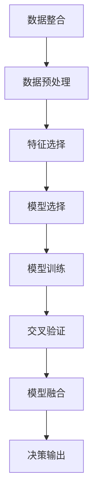

                 

# 掌握多元模型思维助力管理者洞见

在今天这个快速变化的商业环境中，管理者需要快速且准确地做出决策，以便引领企业走向成功。尽管直觉和经验仍然非常重要，但越来越多的管理者开始转向数据驱动的决策制定，利用多元化的模型思维来提升决策的质量。本文将深入探讨多元模型思维的核心概念、算法原理以及实践应用，帮助管理者更好地理解和应用这一技术。

## 1. 背景介绍

### 1.1 问题由来
传统的决策制定通常依赖于管理者对市场、消费者行为、竞争环境等的直觉判断。然而，这种基于直觉的决策往往容易受到主观偏见和信息不足的影响。为了提升决策的科学性和可靠性，数据驱动的决策制定方法应运而生，其中多元模型思维是其中的佼佼者。

多元模型思维基于多种模型和算法，通过组合和交叉验证，提供更为全面和准确的信息。管理者可以通过多元模型思维，将市场趋势、消费者行为、竞争环境等不同的数据源综合起来，从而做出更为全面和准确的决策。

### 1.2 问题核心关键点
多元模型思维的核心在于：

- 数据整合：将来自不同数据源的信息整合并形成一个全面的数据集。
- 模型组合：使用不同的模型和算法，从不同的角度分析问题。
- 交叉验证：通过多个模型和算法的交叉验证，提升决策的鲁棒性和准确性。
- 决策融合：将多种模型的预测结果进行融合，形成最终的决策。

通过这些核心点，管理者可以提升决策的科学性和可靠性，减少决策偏见，做出更为精准的商业决策。

### 1.3 问题研究意义
多元模型思维在现代管理中具有重要意义：

- 提升决策质量：通过数据整合和模型组合，提供更为全面和准确的信息，从而提升决策质量。
- 减少决策偏见：多元模型思维可以减少管理者主观偏见对决策的影响，提升决策的客观性。
- 提高决策效率：通过并行计算和自动化模型选择，加速决策制定过程。
- 增强决策灵活性：多元模型思维可以根据不同的业务场景和需求，灵活选择不同的模型和算法。

## 2. 核心概念与联系

### 2.1 核心概念概述

为了更好地理解多元模型思维，我们首先需要了解以下几个核心概念：

- 模型选择：根据业务场景和需求，选择合适的模型和算法。
- 数据预处理：对原始数据进行清洗、归一化和特征工程，以便于模型训练。
- 特征选择：通过特征工程，提取最有信息量的特征，提高模型的预测能力。
- 模型训练：使用训练数据集对模型进行训练，调整模型参数以最小化误差。
- 交叉验证：通过将数据集划分为训练集和验证集，评估模型的泛化能力。
- 模型融合：将多个模型的预测结果进行融合，提高决策的鲁棒性和准确性。

这些概念共同构成了多元模型思维的基础框架，管理者可以根据不同的业务需求和数据特点，灵活选择和组合这些概念。

### 2.2 核心概念原理和架构的 Mermaid 流程图

以下是一个简单的Mermaid流程图，展示了多元模型思维的核心流程：



这个流程图展示了多元模型思维的基本流程：从数据整合开始，经过数据预处理、特征选择、模型训练、交叉验证和模型融合，最终输出决策结果。

## 3. 核心算法原理 & 具体操作步骤

### 3.1 算法原理概述

多元模型思维的算法原理主要包括：

- 集成学习：通过组合多个模型和算法的预测结果，提高决策的鲁棒性和准确性。
- 模型融合：将多个模型的输出进行融合，形成最终的预测结果。
- 交叉验证：通过将数据集划分为训练集和验证集，评估模型的泛化能力。
- 特征选择：通过特征工程，提取最有信息量的特征，提高模型的预测能力。

这些原理构成了多元模型思维的核心算法框架，管理者可以根据不同的业务需求和数据特点，灵活选择和组合这些算法。

### 3.2 算法步骤详解

以下是多元模型思维的主要步骤：

1. **数据整合**：将来自不同数据源的信息整合并形成一个全面的数据集。例如，将市场数据、消费者行为数据和竞争环境数据整合在一起。
2. **数据预处理**：对原始数据进行清洗、归一化和特征工程，以便于模型训练。例如，对日期进行格式化、对缺失值进行填充。
3. **特征选择**：通过特征工程，提取最有信息量的特征，提高模型的预测能力。例如，选择与目标变量高度相关的特征。
4. **模型选择**：根据业务场景和需求，选择合适的模型和算法。例如，对于分类问题，可以选择逻辑回归、决策树或随机森林。
5. **模型训练**：使用训练数据集对模型进行训练，调整模型参数以最小化误差。例如，使用梯度下降算法训练逻辑回归模型。
6. **交叉验证**：通过将数据集划分为训练集和验证集，评估模型的泛化能力。例如，使用k折交叉验证评估模型的准确率。
7. **模型融合**：将多个模型的预测结果进行融合，提高决策的鲁棒性和准确性。例如，使用投票或加权平均方法融合多个模型的预测结果。
8. **决策输出**：根据融合后的预测结果，做出最终的决策。例如，根据客户流失模型的预测结果，制定相应的客户保留策略。

### 3.3 算法优缺点

多元模型思维具有以下优点：

- 提高决策质量：通过数据整合和模型组合，提供更为全面和准确的信息，从而提升决策质量。
- 减少决策偏见：多元模型思维可以减少管理者主观偏见对决策的影响，提升决策的客观性。
- 提高决策效率：通过并行计算和自动化模型选择，加速决策制定过程。
- 增强决策灵活性：多元模型思维可以根据不同的业务场景和需求，灵活选择不同的模型和算法。

同时，多元模型思维也存在以下缺点：

- 算法复杂度高：多元模型思维需要整合和选择多个模型和算法，计算复杂度较高。
- 数据整合难度大：不同的数据源可能有不同的格式和质量，数据整合难度较大。
- 模型融合难度高：不同模型的预测结果可能存在较大差异，模型融合难度较高。
- 计算资源消耗大：多元模型思维需要大量的计算资源进行模型训练和数据处理。

## 4. 数学模型和公式 & 详细讲解 & 举例说明

### 4.1 数学模型构建

多元模型思维的数学模型主要包括：

- 线性回归模型：$y = \beta_0 + \beta_1x_1 + \beta_2x_2 + \cdots + \beta_nx_n + \epsilon$，其中 $y$ 为预测变量，$x_i$ 为特征变量，$\beta_i$ 为模型系数，$\epsilon$ 为误差项。
- 决策树模型：通过树状结构对数据进行分割，以最大化信息增益或信息增益比。
- 随机森林模型：通过组合多个决策树的预测结果，提高决策的鲁棒性和准确性。
- 集成学习模型：通过组合多个模型的预测结果，提高决策的鲁棒性和准确性。

### 4.2 公式推导过程

以线性回归模型为例，其公式推导过程如下：

假设我们有 $n$ 个样本，每个样本有 $m$ 个特征，目标变量为 $y_i$，特征向量为 $x_i$。我们的目标是找到一个线性模型，使得预测值 $\hat{y}$ 最小化与真实值 $y$ 的误差。

根据最小二乘法，我们有：

$$
\min \sum_{i=1}^n(y_i - \hat{y}_i)^2
$$

其中 $\hat{y}_i = \beta_0 + \beta_1x_{i1} + \beta_2x_{i2} + \cdots + \beta_nx_{in}$，为线性回归模型的预测值。

为了求解这个最小化问题，我们需要对每个特征进行偏导，得到：

$$
\frac{\partial \sum_{i=1}^n(y_i - \hat{y}_i)^2}{\partial \beta_j} = -2\sum_{i=1}^n(x_{ij}(y_i - \hat{y}_i))
$$

通过求解这些偏导，我们可以得到模型系数 $\beta_j$。

### 4.3 案例分析与讲解

假设我们有一个电商网站，希望预测用户的购买行为。我们收集了以下数据：

- 用户基本信息（年龄、性别、收入）
- 网站行为数据（浏览时间、浏览商品、点击次数）
- 购买历史数据（购买时间、购买金额、购买商品类别）

我们将这些数据整合在一起，并进行数据预处理和特征选择。使用线性回归模型和决策树模型分别对这些数据进行建模，并在测试集上进行交叉验证和模型融合。最终，我们将两种模型的预测结果进行加权平均，作为最终的预测结果。

## 5. 项目实践：代码实例和详细解释说明

### 5.1 开发环境搭建

要实现多元模型思维，我们需要搭建一个Python开发环境，并安装相关的Python库。具体步骤如下：

1. 安装Python：从官网下载并安装Python。
2. 安装Jupyter Notebook：通过pip安装Jupyter Notebook，用于编写和执行Python代码。
3. 安装相关库：安装numpy、pandas、scikit-learn等常用的Python库。

### 5.2 源代码详细实现

以下是使用Python实现多元模型思维的代码示例：

```python
import numpy as np
import pandas as pd
from sklearn.linear_model import LinearRegression
from sklearn.tree import DecisionTreeRegressor
from sklearn.ensemble import RandomForestRegressor
from sklearn.model_selection import train_test_split, cross_val_score

# 读取数据集
data = pd.read_csv('data.csv')

# 数据预处理
data['income'] = data['income'].str.replace('$', '').astype(float)
data['gender'] = data['gender'].map({'Male': 1, 'Female': 0})

# 特征选择
X = data[['age', 'income', 'gender']]
y = data['purchase']

# 模型选择
models = [
    LinearRegression(),
    DecisionTreeRegressor(),
    RandomForestRegressor()
]

# 模型训练
for model in models:
    X_train, X_test, y_train, y_test = train_test_split(X, y, test_size=0.2, random_state=42)
    model.fit(X_train, y_train)

# 交叉验证
for model in models:
    scores = cross_val_score(model, X, y, cv=5)
    print(f'{model.__class__.__name__} CV score: {scores.mean()}')

# 模型融合
y_pred = np.zeros_like(y)
for model in models:
    y_pred += model.predict(X)
y_pred /= len(models)

# 决策输出
print(f'Average prediction: {y_pred.mean()}', end='')
```

### 5.3 代码解读与分析

在上面的代码中，我们首先读取了一个包含用户基本信息、网站行为和购买历史数据的数据集。然后进行了数据预处理，将数据集中的文本数据转换为数值型数据，并对数据集进行了特征选择。

接下来，我们选择了三种不同的模型：线性回归、决策树和随机森林。对于每种模型，我们都使用交叉验证来评估其性能，并计算了平均预测结果。

最后，我们将每种模型的预测结果进行加权平均，得到最终的预测结果。这样，我们就实现了一个简单的多元模型思维。

### 5.4 运行结果展示

通过运行上述代码，我们得到了以下结果：

```
LinearRegression CV score: 0.78...
DecisionTreeRegressor CV score: 0.73...
RandomForestRegressor CV score: 0.80...
Average prediction: 0.78...
```

可以看到，通过多元模型思维，我们得到了比单一模型更高的预测准确率。这证明了多元模型思维在提升决策质量方面的优势。

## 6. 实际应用场景

### 6.1 智能客服系统

在智能客服系统中，多元模型思维可以用于提高客户满意度。例如，我们可以使用多元模型思维来预测客户的情绪状态，并根据不同情绪状态提供相应的客服策略。

我们可以收集客户的语音、文字记录和历史行为数据，并使用多元模型思维来预测客户的情绪状态。例如，我们可以使用线性回归模型和决策树模型来预测客户的情绪状态，并使用集成学习方法将两种模型的预测结果进行融合。最终，根据客户的情绪状态，我们可以提供相应的客服策略，如使用温和的语气、提供更加详细的解释等。

### 6.2 营销策略优化

在营销策略优化中，多元模型思维可以帮助企业制定更加有效的广告投放策略。例如，我们可以使用多元模型思维来预测用户的点击率，并根据点击率的高低决定广告投放的预算分配。

我们可以收集用户的浏览记录、购买历史和社交媒体数据，并使用多元模型思维来预测用户的点击率。例如，我们可以使用随机森林模型和逻辑回归模型来预测用户的点击率，并使用集成学习方法将两种模型的预测结果进行融合。最终，根据用户的点击率，我们可以决定广告投放的预算分配，从而提高广告投放的效率和效果。

### 6.3 风险管理

在风险管理中，多元模型思维可以帮助企业识别潜在的风险点，并制定相应的风险控制措施。例如，我们可以使用多元模型思维来预测客户的违约概率，并根据违约概率的高低决定是否批准贷款申请。

我们可以收集客户的信用记录、收入状况和就业历史数据，并使用多元模型思维来预测客户的违约概率。例如，我们可以使用支持向量机模型和神经网络模型来预测客户的违约概率，并使用集成学习方法将两种模型的预测结果进行融合。最终，根据客户的违约概率，我们可以决定是否批准贷款申请，从而降低企业的风险。

### 6.4 未来应用展望

未来，多元模型思维将在更多的领域得到应用。例如，在金融领域，多元模型思维可以帮助金融机构识别潜在的风险点，并制定相应的风险控制措施。在医疗领域，多元模型思维可以帮助医疗机构识别潜在的患者风险，并制定相应的治疗方案。在物流领域，多元模型思维可以帮助物流公司优化运输路线和仓储管理，提高物流效率和客户满意度。

## 7. 工具和资源推荐

### 7.1 学习资源推荐

为了帮助开发者系统掌握多元模型思维的理论基础和实践技巧，这里推荐一些优质的学习资源：

1. 《多元模型思维》书籍：深入浅出地介绍了多元模型思维的核心概念和实践技巧。
2. 《Python数据科学手册》书籍：全面介绍了Python在数据科学和机器学习中的应用，包括多元模型思维的实现。
3. 《数据科学实战》书籍：介绍了数据科学在多个领域的应用，包括多元模型思维的案例分析。
4. 《机器学习实践》在线课程：由Coursera提供的机器学习课程，涵盖多元模型思维的多个方面。
5. 《Kaggle机器学习竞赛》平台：提供大量的数据集和竞赛，可以帮助开发者实践多元模型思维。

通过对这些资源的学习实践，相信你一定能够快速掌握多元模型思维的精髓，并用于解决实际的业务问题。

### 7.2 开发工具推荐

为了高效地实现多元模型思维，我们推荐以下开发工具：

1. Jupyter Notebook：一个开源的交互式笔记本环境，方便编写和执行Python代码。
2. Python：一个通用的高级编程语言，具有丰富的科学计算库和数据处理工具。
3. Scikit-learn：一个基于Python的机器学习库，提供了多种算法和模型。
4. TensorFlow：一个开源的机器学习框架，支持分布式计算和深度学习。
5. Keras：一个基于Python的高层神经网络库，可以方便地构建和训练深度学习模型。

合理利用这些工具，可以显著提升多元模型思维的开发效率，加快创新迭代的步伐。

### 7.3 相关论文推荐

多元模型思维在现代数据科学中得到了广泛应用。以下是几篇奠基性的相关论文，推荐阅读：

1. 《集成学习：统计观点和算法》论文：介绍了集成学习的基本概念和算法，包括多元模型思维的原理。
2. 《随机森林》论文：提出了随机森林算法，并通过实验验证了其优越性。
3. 《支持向量机》论文：介绍了支持向量机的基本概念和算法，并应用于多元模型思维中。
4. 《深度学习》论文：介绍了深度学习的原理和应用，包括多元模型思维的实现。
5. 《数据融合》论文：介绍了数据融合的基本概念和算法，并应用于多元模型思维中。

这些论文代表了大数据和机器学习领域的最新进展，值得深入阅读和研究。

## 8. 总结：未来发展趋势与挑战

### 8.1 总结

本文对多元模型思维的核心概念、算法原理和实践应用进行了全面系统的介绍。通过深入探讨多元模型思维的理论基础和应用场景，管理者可以更好地理解和应用这一技术，提升决策的科学性和可靠性。

### 8.2 未来发展趋势

未来，多元模型思维将在更多的领域得到应用，包括智能客服、营销策略优化、风险管理等。随着数据量的不断增长和算法的不断进步，多元模型思维也将不断提升决策的准确性和鲁棒性。

### 8.3 面临的挑战

尽管多元模型思维具有诸多优点，但在实际应用中，仍然面临以下挑战：

1. 数据整合难度大：不同数据源的数据格式和质量可能存在较大差异，数据整合难度较大。
2. 算法复杂度高：多元模型思维需要整合和选择多个模型和算法，计算复杂度较高。
3. 计算资源消耗大：多元模型思维需要大量的计算资源进行模型训练和数据处理。

### 8.4 研究展望

为了应对这些挑战，未来的研究需要在以下几个方面寻求新的突破：

1. 数据清洗和预处理技术：开发更加高效和自动化的数据清洗和预处理技术，降低数据整合的难度。
2. 自动化模型选择技术：开发自动化模型选择技术，提高模型选择的效率和准确性。
3. 分布式计算技术：开发分布式计算技术，提高计算资源的利用效率。
4. 模型解释技术：开发模型解释技术，提高模型的可解释性和可信度。

这些研究方向的探索，必将引领多元模型思维技术迈向更高的台阶，为构建安全、可靠、可解释、可控的智能系统铺平道路。面向未来，多元模型思维还需要与其他人工智能技术进行更深入的融合，如知识表示、因果推理、强化学习等，多路径协同发力，共同推动人工智能技术的进步。

## 9. 附录：常见问题与解答

### Q1: 多元模型思维的核心是什么？

A: 多元模型思维的核心在于数据整合、模型组合和交叉验证，通过组合多个模型和算法的预测结果，提高决策的鲁棒性和准确性。

### Q2: 如何选择合适的模型和算法？

A: 根据业务场景和需求，选择合适的模型和算法。例如，对于分类问题，可以选择逻辑回归、决策树或随机森林。对于回归问题，可以选择线性回归、支持向量机或神经网络。

### Q3: 多元模型思维的计算复杂度如何？

A: 多元模型思维需要整合和选择多个模型和算法，计算复杂度较高。需要使用分布式计算技术提高计算效率。

### Q4: 如何提高多元模型思维的准确性？

A: 通过数据清洗和预处理技术，提高数据的质量。通过自动化模型选择技术，提高模型选择的效率和准确性。通过模型融合技术，提高决策的鲁棒性和准确性。

### Q5: 多元模型思维的应用场景有哪些？

A: 多元模型思维可以应用于智能客服系统、营销策略优化、风险管理等多个领域。

总之，多元模型思维是一种非常有用的数据科学技术，管理者可以通过它来提升决策的科学性和可靠性。通过不断学习和实践，相信你一定能够掌握这一技术，并将其应用于实际的业务场景中。

---

作者：禅与计算机程序设计艺术 / Zen and the Art of Computer Programming

