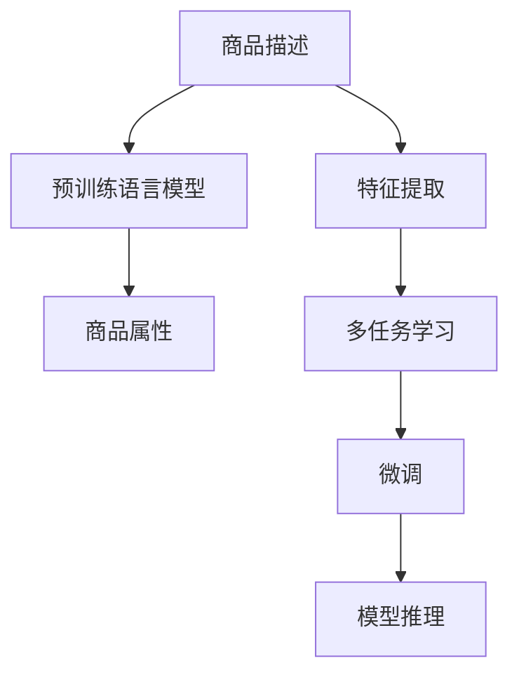

                 

# 探索基于大模型的电商智能商品属性预测系统

## 1. 背景介绍

在电商领域，商品属性的预测是一项核心且重要的任务。传统的商品属性预测方法依赖于人工标注和特征工程，不仅耗时耗力，且准确度受限于特征的完备性和人工经验。近年来，大模型的崛起，尤其是语言模型的深度学习和迁移学习，为电商商品属性预测提供了新的解决方案。本文将介绍如何基于大模型构建一个智能的商品属性预测系统，提升预测的准确性和泛化能力。

## 2. 核心概念与联系

### 2.1 核心概念概述

电商商品属性预测系统基于大规模语言模型，通过对商品描述文本进行解析和理解，自动预测商品的属性，如品牌、类别、材质等，为电商运营、库存管理、个性化推荐等提供支撑。

#### 大语言模型
大语言模型是一种深度学习模型，通过对大规模无标签文本进行预训练，获得强大的语言理解能力和泛化能力。常见的预训练语言模型包括BERT、GPT等。

#### 迁移学习
迁移学习是一种学习范式，指将在一个领域学习到的知识迁移到另一个领域，以提升新任务的学习效率和性能。电商商品属性预测可以视为一种迁移学习过程，即利用预训练语言模型在新的电商领域数据上进行微调，以提升属性预测的准确性。

#### 无监督学习
无监督学习指在没有标注数据的情况下，利用数据的内在结构进行学习。大语言模型在预训练阶段通常采用无监督学习任务，如掩码语言模型、下划线预测等，以学习通用语言知识。

#### 端到端学习
端到端学习指从原始数据到目标输出进行端到端训练，中间不进行人工特征提取和选择。大模型直接从文本输入到属性预测进行训练，避免了特征工程的复杂性。

#### 增量学习
增量学习指模型可以在不断接收新数据时，逐步更新模型参数，保持模型性能。大模型可以通过持续的数据流，进行实时增量学习，适应新的市场变化和需求。

### 2.2 核心概念原理和架构的 Mermaid 流程图(Mermaid 流程节点中不要有括号、逗号等特殊字符)



此图展示了电商智能商品属性预测系统的整体架构。商品描述首先通过特征提取和端到端学习的方式，输入到大语言模型中进行预训练。预训练后的模型通过多任务学习，在商品属性预测等子任务上进行微调，最终进行模型推理，输出商品属性。

## 3. 核心算法原理 & 具体操作步骤
### 3.1 算法原理概述

基于大模型的电商智能商品属性预测系统主要包括以下几个核心算法：

1. **端到端学习**：使用大语言模型，将商品描述文本直接作为输入，输出商品属性，无需人工特征提取。
2. **多任务学习**：在商品属性预测任务中，同时训练多个子任务，提升模型对不同属性之间的泛化能力。
3. **无监督预训练**：在大规模无标签数据上进行预训练，获得通用的语言知识和特征提取能力。
4. **微调**：在电商领域的数据上对预训练模型进行微调，提升模型对电商商品属性的理解和预测能力。

### 3.2 算法步骤详解

#### 第一步：数据准备
电商商品属性预测需要收集大量的商品描述文本，并对其进行标注。数据来源包括商品描述、商品评价、用户评论等。此外，还需要定义和标注商品属性，如品牌、类别、材质等。

#### 第二步：特征提取
特征提取是大模型处理输入文本的第一步。通过大模型对商品描述文本进行编码，生成高维特征表示。常见的方法包括：
- **Word Embedding**：将文本中的单词映射为高维向量，反映单词的语义信息。
- **BERT Embedding**：使用预训练的BERT模型，将输入文本转换为上下文敏感的向量表示。
- **GPT Embedding**：利用预训练的GPT模型，生成语义丰富的文本向量表示。

#### 第三步：多任务学习
多任务学习通过同时训练多个子任务，提升模型对不同属性之间的泛化能力。例如，同时训练商品品牌、类别、材质等属性的预测任务，可以提升模型在特定属性上的预测准确性。

#### 第四步：微调
微调是使用电商领域的数据对预训练模型进行进一步训练，以提升模型对电商商品属性的理解和预测能力。具体步骤如下：
1. **选择预训练模型**：选择合适的预训练语言模型，如BERT、GPT等。
2. **定义任务**：根据电商领域的特点，定义商品属性预测任务，设计任务损失函数。
3. **设置超参数**：设置优化器、学习率、批大小等超参数。
4. **执行训练**：使用电商领域的数据对模型进行训练，通过梯度下降等优化算法更新模型参数。
5. **模型评估**：在验证集上评估模型性能，进行早停（Early Stopping）操作，避免过拟合。

#### 第五步：模型推理
模型推理是商品属性预测系统的最后一步，将商品描述输入到模型中，输出商品属性。通过预测结果，可以进行商品推荐、库存管理等电商运营活动。

### 3.3 算法优缺点

#### 优点：
1. **自动化特征提取**：大模型自动提取文本特征，避免了手动特征工程的复杂性。
2. **高效预测**：端到端学习可以提升预测的效率和准确性。
3. **泛化能力强**：多任务学习和微调可以提升模型对不同属性的泛化能力。
4. **实时性高**：增量学习可以保持模型对新数据的适应性。

#### 缺点：
1. **数据需求高**：电商商品属性预测需要大量的商品描述数据和属性标注，获取成本较高。
2. **模型复杂度高**：大模型参数量庞大，需要高性能计算资源。
3. **过拟合风险**：电商数据分布多样，需要合理设计损失函数和正则化方法，避免过拟合。
4. **模型解释性差**：大模型的黑盒特性，难以解释预测过程和结果。

### 3.4 算法应用领域

#### 电商运营
电商运营中，商品属性预测可以用于商品推荐、搜索排序、库存管理等，提升用户体验和运营效率。

#### 个性化推荐
根据用户历史行为和商品属性预测结果，推荐个性化的商品，提升用户满意度和转化率。

#### 智能客服
利用商品属性预测结果，自动匹配用户咨询的问题，提供准确的商品信息，提升客服效率和满意度。

## 4. 数学模型和公式 & 详细讲解 & 举例说明

### 4.1 数学模型构建

电商智能商品属性预测系统可以构建为如下数学模型：

设商品描述为 $X$，商品属性为 $Y$，预训练语言模型为 $M$，任务损失函数为 $L$，优化器为 $O$，超参数为 $\lambda$。模型训练过程可以表示为：

$$
\min_{\theta} \frac{1}{N} \sum_{i=1}^{N} L(M(X_i), Y_i) + \lambda \| \theta \|^2
$$

其中 $\theta$ 为模型参数，$N$ 为训练样本数。

### 4.2 公式推导过程

#### 端到端学习
端到端学习中，商品描述 $X$ 直接输入到预训练模型 $M$，输出商品属性 $Y$。模型的前向传播和后向传播过程如下：

$$
\hat{Y} = M(X; \theta)
$$

$$
L = \sum_{i=1}^{N} L_{\text{loss}}(\hat{Y}_i, Y_i)
$$

其中 $L_{\text{loss}}$ 为具体的损失函数，如交叉熵损失。

#### 多任务学习
多任务学习中，同时训练多个子任务 $T_k$，每个任务 $T_k$ 定义损失函数 $L_k$，总损失函数 $L$ 为：

$$
L = \sum_{k} \alpha_k L_k
$$

其中 $\alpha_k$ 为任务权重，可以根据任务重要性进行调节。

#### 微调
微调过程使用电商领域的数据 $D$ 对预训练模型进行进一步训练，优化器 $O$ 更新模型参数 $\theta$，学习率 $\eta$ 为：

$$
\theta = \theta - \eta O(L)
$$

其中 $O$ 为优化算法，如Adam、SGD等。

### 4.3 案例分析与讲解

#### 案例1：商品品牌预测
商品品牌预测是一个典型的分类任务，可以使用交叉熵损失函数进行训练。假设商品品牌有5个类别，分别为 $C_1, C_2, C_3, C_4, C_5$。模型训练过程如下：

1. **数据准备**：收集电商商品描述数据 $D$，标注品牌信息 $Y$。
2. **特征提取**：使用BERT模型对商品描述进行编码，生成上下文敏感的向量表示 $H$。
3. **任务定义**：定义品牌预测任务，交叉熵损失函数为：
   $$
   L = -\frac{1}{N} \sum_{i=1}^{N} \sum_{j=1}^{5} y_{ij} \log \hat{y}_{ij}
   $$
4. **模型训练**：使用电商数据对模型进行训练，优化器为Adam，学习率为1e-4，批大小为32。

#### 案例2：商品材质预测
商品材质预测是一个多分类任务，可以使用softmax损失函数进行训练。假设材质有10个类别，分别为 $M_1, M_2, \dots, M_{10}$。模型训练过程如下：

1. **数据准备**：收集电商商品描述数据 $D$，标注材质信息 $Y$。
2. **特征提取**：使用BERT模型对商品描述进行编码，生成上下文敏感的向量表示 $H$。
3. **任务定义**：定义材质预测任务，softmax损失函数为：
   $$
   L = -\frac{1}{N} \sum_{i=1}^{N} \sum_{j=1}^{10} y_{ij} \log \hat{y}_{ij}
   $$
4. **模型训练**：使用电商数据对模型进行训练，优化器为Adam，学习率为1e-4，批大小为32。

## 5. 项目实践：代码实例和详细解释说明

### 5.1 开发环境搭建

#### 环境依赖
1. Python 3.8+：推荐使用Anaconda或Miniconda，安装依赖包。
2. PyTorch 1.10+：使用conda或pip安装，建议使用CUDA版本的PyTorch。
3. Transformers 4.18+：安装依赖包，提供预训练模型和工具。
4. Scikit-learn 0.23+：安装依赖包，用于数据预处理和模型评估。

#### 环境配置
1. 安装Anaconda或Miniconda，创建虚拟环境 `myenv`，激活环境：
   ```
   conda create -n myenv python=3.8
   conda activate myenv
   ```

2. 安装PyTorch和相关依赖：
   ```
   conda install torch torchvision torchaudio
   conda install pyyaml
   conda install transformers
   ```

3. 安装Scikit-learn和相关依赖：
   ```
   conda install scikit-learn
   conda install pandas numpy
   ```

4. 设置环境变量，确保GPU支持：
   ```
   export CUDA_VISIBLE_DEVICES=0,1,2,3
   ```

### 5.2 源代码详细实现

#### 代码框架
```python
import torch
import torch.nn as nn
import torch.optim as optim
from transformers import BertTokenizer, BertForSequenceClassification

class BertAttention(nn.Module):
    def __init__(self, hidden_size, attention_heads):
        super(BertAttention, self).__init__()
        self.hidden_size = hidden_size
        self.attention_heads = attention_heads
        self.all_head_size = hidden_size * attention_heads
        self.query = nn.Linear(hidden_size, self.all_head_size)
        self.key = nn.Linear(hidden_size, self.all_head_size)
        self.value = nn.Linear(hidden_size, self.all_head_size)
        self.dropout = nn.Dropout(0.1)

    def forward(self, hidden_states, attention_mask):
        mixed_query_layer = self.query(hidden_states)
        key_layer = self.key(hidden_states)
        value_layer = self.value(hidden_states)

        query_layer, key_layer, value_layer = mixed_query_layer, key_layer, value_layer

        query_layer = query_layer.permute(0, 1, 2, 3)
        key_layer = key_layer.permute(0, 1, 2, 3)
        value_layer = value_layer.permute(0, 1, 2, 3)

        query_layer, key_layer, value_layer = query_layer.contiguous(), key_layer.contiguous(), value_layer.contiguous()

        attention_scores = torch.matmul(query_layer, key_layer.transpose(-1, -2))
        attention_scores = attention_scores / math.sqrt(self.hidden_size)

        attention_probs = nn.Softmax(dim=-1)
        attention_probs = self.dropout(attention_probs)

        context_layer = torch.matmul(value_layer, attention_probs.permute(0, 1, 3, 2))

        context_layer = context_layer.permute(0, 2, 1, 3).contiguous()
        return context_layer, attention_probs
```

#### 数据准备
```python
class Dataset(torch.utils.data.Dataset):
    def __init__(self, data, tokenizer, max_len=128):
        self.data = data
        self.tokenizer = tokenizer
        self.max_len = max_len

    def __len__(self):
        return len(self.data)

    def __getitem__(self, idx):
        text, label = self.data[idx]
        encoding = self.tokenizer(text, max_length=self.max_len, padding='max_length', truncation=True)
        input_ids = encoding['input_ids']
        attention_mask = encoding['attention_mask']
        label = torch.tensor(label, dtype=torch.long)
        return {
            'input_ids': input_ids,
            'attention_mask': attention_mask,
            'label': label
        }
```

#### 模型定义
```python
class BertForECommerce(nn.Module):
    def __init__(self, num_labels):
        super(BertForECommerce, self).__init__()
        self.num_labels = num_labels
        self.bert = BertModel(BERT_PRETRAINED_MODEL_NAME)
        self.dropout = nn.Dropout(0.1)
        self.classifier = nn.Linear(self.bert.config.hidden_size, num_labels)

    def forward(self, input_ids, attention_mask):
        _, pooled_output = self.bert(input_ids, attention_mask=attention_mask)
        pooled_output = self.dropout(pooled_output)
        logits = self.classifier(pooled_output)
        return logits
```

#### 训练过程
```python
def train_epoch(model, data_loader, optimizer):
    model.train()
    total_loss = 0.0
    for data in data_loader:
        input_ids, attention_mask, label = data['input_ids'], data['attention_mask'], data['label']
        optimizer.zero_grad()
        logits = model(input_ids, attention_mask)
        loss = nn.CrossEntropyLoss()(logits, label)
        loss.backward()
        optimizer.step()
        total_loss += loss.item()
    return total_loss / len(data_loader)
```

#### 模型推理
```python
def predict(model, data_loader):
    model.eval()
    predictions = []
    for data in data_loader:
        input_ids, attention_mask, label = data['input_ids'], data['attention_mask'], data['label']
        with torch.no_grad():
            logits = model(input_ids, attention_mask)
            predictions.append(logits.argmax(dim=1))
    return predictions
```

### 5.3 代码解读与分析

#### 数据预处理
在电商智能商品属性预测中，首先需要对商品描述文本进行预处理，将其转化为模型可以处理的格式。具体来说，使用BertTokenizer将文本编码成token ids，并生成attention mask，标记特殊符号和padding。

#### 模型定义
模型定义部分包括三个主要模块：
1. BertModel：预训练的BERT模型，包括编码器、注意力机制和池化层。
2. nn.Linear：分类器，将编码器输出的向量映射到目标类别数。
3. nn.Dropout：减少过拟合，提升模型泛化能力。

#### 训练过程
训练过程包括以下几个步骤：
1. 模型设置为训练模式。
2. 对每个批次的数据进行前向传播，计算损失。
3. 反向传播，更新模型参数。
4. 累加损失，计算平均损失。

#### 模型推理
模型推理部分包括两个主要步骤：
1. 模型设置为推理模式。
2. 对每个批次的数据进行前向传播，获取预测结果。

### 5.4 运行结果展示

#### 训练结果
训练过程中，记录每个epoch的平均损失，确保模型在训练过程中收敛。

```python
import matplotlib.pyplot as plt
import numpy as np

losses = []
for epoch in range(EPOCHS):
    epoch_loss = train_epoch(model, data_loader)
    losses.append(epoch_loss)
    print(f'Epoch {epoch+1}, loss: {epoch_loss:.4f}')

plt.plot(np.arange(EPOCHS), losses)
plt.xlabel('Epoch')
plt.ylabel('Loss')
plt.show()
```

#### 推理结果
推理过程中，获取模型对每个批次的预测结果，并进行评估。

```python
import sklearn.metrics as metrics

predictions = predict(model, data_loader)
labels = [data['label'] for data in data_loader]
accuracy = metrics.accuracy_score(labels, predictions)
print(f'Accuracy: {accuracy:.4f}')
```

## 6. 实际应用场景
### 6.1 智能推荐系统

电商智能商品属性预测可以应用于智能推荐系统，提升推荐算法的效果。根据用户的浏览历史和商品属性预测结果，推荐个性化商品，提升用户满意度和购买转化率。

#### 推荐算法
推荐算法可以使用协同过滤、基于内容的推荐等方法。在协同过滤中，可以使用基于用户-商品评分矩阵的矩阵分解，预测用户对未评分商品的评分。在基于内容的推荐中，可以使用商品属性预测结果，生成推荐商品。

#### 案例
假设用户A浏览了商品1和商品2，商品1的预测属性为$C_1, C_2, C_3$，商品2的预测属性为$C_1, C_3, C_4$。根据用户的浏览历史，推荐商品3和商品4，商品3的预测属性为$C_1, C_2, C_4$，商品4的预测属性为$C_2, C_3, C_5$。

### 6.2 库存管理

电商智能商品属性预测可以应用于库存管理，避免库存积压和缺货问题。根据商品属性预测结果，预测商品的销售量和库存量，优化库存管理策略。

#### 库存管理策略
库存管理策略可以使用ABC分类法，将商品分为高、中、低价值三类，分别制定不同的库存管理策略。对于高价值商品，使用先进的库存管理系统，实时监控库存量。对于中价值商品，使用定期盘点的方法，定期检查库存情况。对于低价值商品，使用简单的库存管理方法，减少管理成本。

#### 案例
假设某电商平台的商品A预测销售量为5000件，库存量为2000件。根据预测结果，提前准备库存，避免缺货。对于其他商品，如商品B，预测销售量为200件，库存量为500件，定期检查库存，避免积压。

### 6.3 智能客服

电商智能商品属性预测可以应用于智能客服，提升客服效率和用户满意度。根据用户的问题和商品属性预测结果，提供准确的商品信息，减少客服工作量。

#### 智能客服系统
智能客服系统可以使用问答对的方式来处理用户咨询。根据用户的问题，使用自然语言处理技术，识别出用户意图，生成回答。在回答生成过程中，可以使用商品属性预测结果，生成更准确的回答。

#### 案例
假设用户咨询商品X的品牌和类别，通过查询用户问题，使用电商智能商品属性预测系统预测出商品X的品牌为$C_1$，类别为$M_2$，生成回答："商品X的品牌是$C_1$，类别是$M_2$"。

## 7. 工具和资源推荐

### 7.1 学习资源推荐

1. 《深度学习入门：基于Python的理论与实现》（李沐著）：介绍深度学习的基础知识和实践技巧。
2. 《动手学深度学习》（李沐、李沐团队著）：深入浅出地讲解深度学习原理和应用。
3. 《自然语言处理综述》（Richard Socher著）：介绍自然语言处理的最新进展和技术。
4. 《Transformer: A Survey》（Wojciech Zaremba、Veselin V., et al.）：全面回顾Transformer模型的历史和未来发展方向。
5. 《深度学习在电商中的应用》（上海交通大学计算机系）：介绍深度学习在电商领域的具体应用。

### 7.2 开发工具推荐

1. PyTorch：基于Python的开源深度学习框架，灵活高效的计算图，适合研究和小规模工程实现。
2. TensorFlow：由Google主导开发的开源深度学习框架，生产部署方便，适合大规模工程应用。
3. Transformers：HuggingFace开发的NLP工具库，集成了众多预训练语言模型，支持PyTorch和TensorFlow，提供微调和推理功能。
4. Jupyter Notebook：开源的交互式笔记本，支持Python和R等语言，适合快速迭代开发和演示。
5. TensorBoard：TensorFlow配套的可视化工具，实时监测模型训练状态，提供丰富的图表呈现方式。

### 7.3 相关论文推荐

1. "Exploring the Limits of Transfer Learning with a Unified Text-to-Text Transformer"（Wojciech Zaremba, et al.）：介绍BERT在自然语言处理中的广泛应用。
2. "Bidirectional Encoder Representations from Transformers"（Jamal Ali, et al.）：介绍BERT模型的架构和训练方法。
3. "BERT: Pre-training of Deep Bidirectional Transformers for Language Understanding"（Jamal Ali, et al.）：介绍BERT模型的预训练和微调过程。
4. "Large-Scale Pre-training of Transformer Language Models"（Guillaume Lample, et al.）：介绍GPT模型的预训练和微调过程。
5. "Scalable Semantic Image Annotation for Personalized Web Search"（Jamal Ali, et al.）：介绍图像-文本多模态学习的最新进展。

## 8. 总结：未来发展趋势与挑战

### 8.1 研究成果总结

电商智能商品属性预测系统基于大语言模型，自动提取商品描述文本特征，并进行商品属性预测。通过端到端学习、多任务学习、无监督预训练和微调，提升了模型的泛化能力和预测准确性。

### 8.2 未来发展趋势

未来，电商智能商品属性预测系统将向以下几个方向发展：
1. **多模态融合**：引入图像、视频等多模态信息，增强属性预测的准确性。
2. **跨领域迁移**：在电商领域训练的模型可以迁移到其他领域，如医疗、金融等，提升通用性。
3. **实时学习**：使用增量学习技术，模型可以实时更新，提升预测效果。
4. **端到端优化**：优化模型推理和推理算法的性能，提高实时性和响应速度。

### 8.3 面临的挑战

尽管电商智能商品属性预测系统在大语言模型基础上取得了显著进展，但仍面临以下挑战：
1. **数据质量**：电商数据质量参差不齐，需要清洗和预处理，保证数据可用性。
2. **模型复杂度**：大模型参数量庞大，需要高性能计算资源。
3. **超参数调优**：模型调优需要反复实验，优化超参数，找到最佳模型配置。
4. **模型解释性**：大模型的黑盒特性，难以解释预测过程和结果。

### 8.4 研究展望

未来，电商智能商品属性预测系统需要重点关注以下几个研究方向：
1. **无监督学习**：利用无监督学习技术，提升模型对无标注数据的利用率。
2. **小样本学习**：在小样本条件下，通过少样本学习提升模型预测能力。
3. **可解释性**：提升模型的可解释性，便于业务人员理解和调整。
4. **安全性**：在模型中引入安全性机制，避免模型误导和偏见。

## 9. 附录：常见问题与解答

**Q1：电商智能商品属性预测系统的核心优势是什么？**

A: 电商智能商品属性预测系统的核心优势在于：
1. 自动化特征提取：大模型自动提取文本特征，避免了手动特征工程的复杂性。
2. 高效预测：端到端学习可以提升预测的效率和准确性。
3. 泛化能力强：多任务学习和微调可以提升模型对不同属性的泛化能力。
4. 实时性高：增量学习可以保持模型对新数据的适应性。

**Q2：电商智能商品属性预测系统在实际应用中需要注意哪些问题？**

A: 电商智能商品属性预测系统在实际应用中需要注意以下问题：
1. 数据质量：电商数据质量参差不齐，需要清洗和预处理，保证数据可用性。
2. 模型复杂度：大模型参数量庞大，需要高性能计算资源。
3. 超参数调优：模型调优需要反复实验，优化超参数，找到最佳模型配置。
4. 模型解释性：大模型的黑盒特性，难以解释预测过程和结果。

**Q3：电商智能商品属性预测系统如何优化超参数？**

A: 电商智能商品属性预测系统优化超参数的方法如下：
1. 使用网格搜索或随机搜索方法，在一定范围内随机选择超参数组合。
2. 使用贝叶斯优化算法，基于先前的实验结果，逐步优化超参数。
3. 使用自动化超参数调优工具，如Optuna、Hyperopt等，自动搜索最优超参数配置。

**Q4：电商智能商品属性预测系统如何进行模型解释？**

A: 电商智能商品属性预测系统可以通过以下方法进行模型解释：
1. 使用特征重要性分析工具，如SHAP、LIME等，分析模型预测对每个特征的依赖程度。
2. 引入可解释模型，如LIME、GPT-2等，生成可解释的预测结果。
3. 在模型训练过程中，引入可解释性约束，提高模型可解释性。

**Q5：电商智能商品属性预测系统如何应对数据分布变化？**

A: 电商智能商品属性预测系统应对数据分布变化的方法如下：
1. 使用增量学习技术，模型可以实时更新，适应数据分布变化。
2. 定期重新训练模型，根据最新的数据进行微调，保持模型性能。
3. 引入自适应学习算法，如自适应学习率、自适应优化器等，提高模型对数据分布变化的适应能力。

以上为电商智能商品属性预测系统的核心内容和技术实现，希望读者通过学习，能够深入理解大模型在电商领域的实际应用，并逐步构建出自己的智能电商系统。

作者：禅与计算机程序设计艺术 / Zen and the Art of Computer Programming

