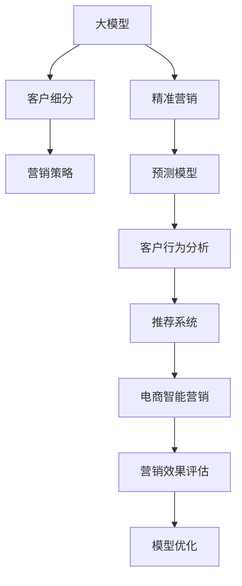

                 

# 探索基于大模型的电商智能客户价值预测与精准营销系统

> 关键词：电商智能营销, 客户价值预测, 基于大模型的系统, 深度学习, 机器学习, 模型优化, 营销自动化, 客户行为分析, 客户细分, 营销效果评估

## 1. 背景介绍

### 1.1 问题由来
近年来，电商市场竞争日趋激烈，客户流失率高，获客成本也持续上升。面对这一挑战，电商企业亟需借助智能技术对客户进行细分，实现个性化精准营销，提升客户满意度和忠诚度，进而降低流失率和提升销售额。传统的客户细分和营销策略依赖于人工经验，难以全面覆盖，且需要大量的人力和时间成本。而基于深度学习的大模型预测方法，能快速、准确地预测客户行为，实现自动化精准营销，将成为电商企业的核心竞争力。

### 1.2 问题核心关键点
大模型在电商客户价值预测与精准营销中的应用主要体现在以下几个关键点上：

- 多维特征整合：通过大模型对客户历史行为数据进行整合和建模，充分挖掘客户行为特征。
- 客户行为预测：利用大模型对客户未来行为进行预测，包括购买意向、流失风险等。
- 客户细分：通过预测结果，对客户进行高价值和低价值细分，指导营销策略的制定。
- 营销效果评估：利用预测结果评估营销策略的效果，不断优化营销方案。

### 1.3 问题研究意义
大模型在电商智能营销中的应用，不仅能大幅提升客户价值预测的准确性，还能帮助电商企业自动化地制定个性化精准营销方案，优化营销资源分配，降低成本，提升收益。具体而言：

1. **提升客户满意度**：通过个性化推荐和精准营销，提升客户购物体验，增加客户粘性。
2. **降低客户流失率**：预测高流失风险客户，采取主动干预措施，减少客户流失。
3. **优化营销策略**：评估营销活动效果，优化预算分配，提升广告投放精准性。
4. **提升企业竞争力**：在大数据驱动下，对市场趋势和客户需求做出准确预测，制定前瞻性营销策略，把握市场主动权。

## 2. 核心概念与联系

### 2.1 核心概念概述

为更好地理解基于大模型的电商客户价值预测与精准营销方法，本节将介绍几个密切相关的核心概念：

- 大模型(Large Model)：指采用深度学习框架训练出的拥有大量参数的模型，如BERT、GPT等。通过在大量数据上进行预训练，大模型能够学习到丰富的知识，具备强大的表征能力。

- 客户细分(Customer Segmentation)：将客户按照某些标准进行分类，如购买频率、消费金额、客户行为等，以实现差异化营销。

- 精准营销(Precision Marketing)：基于客户细分结果，制定有针对性的营销策略，以最小的成本获取最大的回报。

- 预测模型(Prediction Model)：利用历史数据和模型参数对未来事件进行预测，常见于客户行为、流失风险等预测任务。

- 推荐系统(Recommendation System)：基于用户行为和历史数据，推荐合适的产品或服务，如电商网站的个性化推荐。

- 深度学习(Deep Learning)：一种利用多层神经网络进行数据表示和建模的机器学习方法，擅长处理非线性复杂问题。

- 迁移学习(Transfer Learning)：在预训练大模型的基础上，针对具体任务进行微调，利用已学习到的知识加速模型训练和提升预测精度。

- 电商智能营销(E-Commerce Smart Marketing)：结合电商场景，利用智能技术对客户进行行为分析、预测和细分，以实现自动化精准营销的目标。

- 多模态融合(Multimodal Fusion)：将文本、图像、时间等多维度数据融合，提高客户行为预测的准确性。

这些核心概念之间的逻辑关系可以通过以下Mermaid流程图来展示：



这个流程图展示了电商智能营销的基本流程：

1. 大模型学习客户行为，进行客户细分。
2. 客户细分结果指导精准营销策略的制定。
3. 利用预测模型对客户行为进行预测。
4. 结合客户行为分析，推荐系统向客户推荐合适产品。
5. 电商智能营销系统自动化地执行营销策略。
6. 对营销效果进行评估，并不断优化模型和策略。

## 3. 核心算法原理 & 具体操作步骤

### 3.1 算法原理概述

基于大模型的电商智能客户价值预测与精准营销方法，核心思想是通过深度学习模型对客户行为数据进行分析和建模，预测客户未来的行为趋势，并对客户进行细分和精准营销策略制定。其核心步骤如下：

1. **数据准备**：收集客户历史行为数据，包括购买记录、浏览记录、点击记录、评论记录等。
2. **特征工程**：对收集到的数据进行清洗、特征提取和归一化处理，构造合适的特征向量。
3. **模型训练**：利用大模型对特征向量进行训练，学习客户行为的模式和趋势。
4. **客户细分**：根据预测结果，对客户进行高价值和低价值细分，制定差异化营销策略。
5. **策略实施**：基于客户细分结果，对不同客户群体制定个性化的精准营销策略，并自动化执行。
6. **效果评估**：对实施的营销策略效果进行评估，根据评估结果进行模型优化和策略调整。

### 3.2 算法步骤详解

**Step 1: 数据准备**
- 收集客户的历史行为数据，包括但不限于：
  - 购买记录：记录购买时间、商品ID、价格等信息。
  - 浏览记录：记录浏览时间、页面ID、停留时间等信息。
  - 点击记录：记录点击时间、广告ID、位置等信息。
  - 评论记录：记录评论时间、内容、评分等信息。
- 对数据进行清洗，处理缺失值和异常值。
- 对数据进行特征提取，将离散化特征和连续化特征进行统一处理。

**Step 2: 特征工程**
- 对特征进行归一化处理，将数据转换为0-1之间的数值。
- 选择和构造合适的特征，如：
  - 基本特征：购买频率、消费金额、活跃天数等。
  - 时间特征：日、周、月等时间段数据。
  - 文本特征：商品评论的情感分析结果、搜索关键词等。
  - 图片特征：商品图片的颜色、纹理等特征。
- 利用交叉特征和多模态融合方法，构造更全面的特征向量。

**Step 3: 模型训练**
- 选择合适的深度学习模型，如BERT、Transformer等。
- 在特征向量上训练模型，学习客户行为的模式和趋势。
- 利用交叉验证等方法进行模型调优，避免过拟合。
- 保存训练好的模型，以备后续使用。

**Step 4: 客户细分**
- 对客户行为预测结果进行排序，筛选出高价值客户和低价值客户。
- 根据不同的客户细分结果，制定相应的精准营销策略。
- 对高价值客户，进行个性化推荐和主动营销。
- 对低价值客户，进行预警和重新挖掘。

**Step 5: 策略实施**
- 将客户细分结果作为输入，自动化执行营销策略。
- 根据客户行为实时调整营销策略，如动态推荐、定时推送等。
- 结合多渠道营销，提高营销效果。

**Step 6: 效果评估**
- 评估营销策略的效果，如转化率、点击率、销售额等。
- 根据评估结果进行模型优化和策略调整，以提升客户价值预测的准确性。
- 不断循环迭代，实现营销效果的持续提升。

### 3.3 算法优缺点

基于大模型的电商客户价值预测与精准营销方法具有以下优点：
1. **高效性**：利用深度学习模型自动对客户行为进行分析和建模，快速生成预测结果。
2. **高精度**：深度学习模型能够学习到复杂的非线性关系，提高客户行为预测的准确性。
3. **自动化**：自动化地执行精准营销策略，减少人工干预，提升效率。
4. **可扩展性**：模型可以根据新数据进行实时更新，保持预测结果的时效性。

同时，该方法也存在一定的局限性：
1. **数据依赖**：模型依赖于大量的历史数据，数据质量对预测结果有较大影响。
2. **模型复杂性**：大模型参数量大，训练和部署成本较高。
3. **泛化能力**：模型对新数据和新场景的泛化能力有待提高。
4. **可解释性**：深度学习模型的决策过程不透明，难以解释。

尽管存在这些局限性，但就目前而言，基于大模型的客户价值预测与精准营销方法仍然是大模型应用的重要范式。未来相关研究的重点在于如何进一步降低对标注数据的依赖，提高模型的泛化能力，同时兼顾可解释性和伦理安全性等因素。

### 3.4 算法应用领域

基于大模型的客户价值预测与精准营销方法，已经在电商、金融、旅游等多个领域得到了广泛应用。具体而言：

- **电商行业**：帮助电商平台对用户进行行为分析和预测，实现个性化推荐和精准营销，提升客户满意度和销售额。
- **金融行业**：利用大模型预测用户行为，进行风险管理和用户维护，提高金融产品的推荐精准性。
- **旅游行业**：通过客户行为分析，实现个性化旅游推荐和营销，提升客户体验和满意度。
- **零售行业**：根据客户购买记录和行为数据，进行客户细分，制定精准营销策略，提高销售效率。

## 4. 数学模型和公式 & 详细讲解 & 举例说明

### 4.1 数学模型构建

在本节中，我们将使用数学语言对基于大模型的电商客户价值预测方法进行更加严格的刻画。

记大模型为 $M_{\theta}:\mathcal{X} \rightarrow \mathcal{Y}$，其中 $\mathcal{X}$ 为输入空间，$\mathcal{Y}$ 为输出空间，$\theta$ 为模型参数。假设客户行为预测任务为二分类任务，即预测客户是否在未来某时段内购买商品，则二分类交叉熵损失函数定义为：

$$
\ell(M_{\theta}(x),y) = -[y\log M_{\theta}(x)+(1-y)\log(1-M_{\theta}(x))]
$$

客户行为预测的数学模型构建如下：

1. **输入数据**：将客户行为数据转化为模型输入，如商品ID、购买时间、评论情感等。
2. **特征工程**：将输入数据转换为特征向量，如将文本数据转化为词向量、将时间数据转化为时间窗口等。
3. **模型训练**：在特征向量上训练大模型，学习客户行为的规律和趋势。
4. **客户细分**：对预测结果进行排序，筛选出高价值客户和低价值客户。
5. **模型评估**：利用交叉验证等方法评估模型性能，如准确率、召回率、F1值等。

### 4.2 公式推导过程

在实际应用中，我们通常使用交叉熵损失函数进行模型训练，推导过程如下：

假设模型 $M_{\theta}$ 在输入 $x$ 上的输出为 $\hat{y}=M_{\theta}(x) \in [0,1]$，表示客户是否购买商品的预测概率。真实标签 $y \in \{0,1\}$。则二分类交叉熵损失函数定义为：

$$
\ell(M_{\theta}(x),y) = -[y\log \hat{y} + (1-y)\log(1-\hat{y})]
$$

将其代入经验风险公式，得：

$$
\mathcal{L}(\theta) = -\frac{1}{N}\sum_{i=1}^N [y_i\log M_{\theta}(x_i)+(1-y_i)\log(1-M_{\theta}(x_i))]
$$

其中 $N$ 为样本数量，$y_i$ 为样本的真实标签。

根据链式法则，损失函数对参数 $\theta_k$ 的梯度为：

$$
\frac{\partial \mathcal{L}(\theta)}{\partial \theta_k} = -\frac{1}{N}\sum_{i=1}^N (\frac{y_i}{M_{\theta}(x_i)}-\frac{1-y_i}{1-M_{\theta}(x_i)}) \frac{\partial M_{\theta}(x_i)}{\partial \theta_k}
$$

其中 $\frac{\partial M_{\theta}(x_i)}{\partial \theta_k}$ 可进一步递归展开，利用自动微分技术完成计算。

在得到损失函数的梯度后，即可带入参数更新公式，完成模型的迭代优化。重复上述过程直至收敛，最终得到适应电商客户价值预测的最优模型参数 $\theta^*$。

### 4.3 案例分析与讲解

假设我们利用一个大模型对电商客户是否在一周内购买商品进行预测。具体步骤如下：

1. **数据准备**：收集客户的购买记录、浏览记录、评论记录等，构造特征向量 $x_i = [p_{i1}, b_{i2}, r_{i3}]$，其中 $p_{i1}$ 为购买频率，$b_{i2}$ 为浏览次数，$r_{i3}$ 为评论评分。
2. **模型训练**：利用历史数据 $(x_i,y_i)$ 对大模型进行训练，学习客户行为的模式和趋势。
3. **客户细分**：根据模型预测结果，对客户进行高价值和低价值细分，筛选出高价值客户。
4. **策略实施**：对高价值客户进行个性化推荐和主动营销，如优惠折扣、专属推荐等。
5. **效果评估**：评估营销策略的效果，如点击率、转化率、销售额等，不断优化模型和策略。

通过以上案例，可以看到，基于大模型的客户价值预测与精准营销方法，不仅能实现自动化精准营销，还能提升客户满意度和销售额，具有广泛的应用前景。

## 5. 项目实践：代码实例和详细解释说明

### 5.1 开发环境搭建

在进行项目实践前，我们需要准备好开发环境。以下是使用Python进行PyTorch开发的环境配置流程：

1. 安装Anaconda：从官网下载并安装Anaconda，用于创建独立的Python环境。

2. 创建并激活虚拟环境：
```bash
conda create -n pytorch-env python=3.8 
conda activate pytorch-env
```

3. 安装PyTorch：根据CUDA版本，从官网获取对应的安装命令。例如：
```bash
conda install pytorch torchvision torchaudio cudatoolkit=11.1 -c pytorch -c conda-forge
```

4. 安装Transformers库：
```bash
pip install transformers
```

5. 安装各类工具包：
```bash
pip install numpy pandas scikit-learn matplotlib tqdm jupyter notebook ipython
```

完成上述步骤后，即可在`pytorch-env`环境中开始项目实践。

### 5.2 源代码详细实现

下面我们以电商客户价值预测为例，给出使用Transformers库对BERT模型进行预测的PyTorch代码实现。

首先，定义数据处理函数：

```python
from transformers import BertTokenizer
from torch.utils.data import Dataset
import torch

class CustomerData(Dataset):
    def __init__(self, texts, labels, tokenizer, max_len=128):
        self.texts = texts
        self.labels = labels
        self.tokenizer = tokenizer
        self.max_len = max_len
        
    def __len__(self):
        return len(self.texts)
    
    def __getitem__(self, item):
        text = self.texts[item]
        label = self.labels[item]
        
        encoding = self.tokenizer(text, return_tensors='pt', max_length=self.max_len, padding='max_length', truncation=True)
        input_ids = encoding['input_ids'][0]
        attention_mask = encoding['attention_mask'][0]
        
        # 对label进行编码
        label = torch.tensor([label], dtype=torch.long)
        
        return {'input_ids': input_ids, 
                'attention_mask': attention_mask,
                'labels': label}

# 标签编码
label_map = {'buy': 1, 'not_buy': 0}

# 创建dataset
tokenizer = BertTokenizer.from_pretrained('bert-base-cased')

train_dataset = CustomerData(train_texts, train_labels, tokenizer)
dev_dataset = CustomerData(dev_texts, dev_labels, tokenizer)
test_dataset = CustomerData(test_texts, test_labels, tokenizer)
```

然后，定义模型和优化器：

```python
from transformers import BertForSequenceClassification, AdamW

model = BertForSequenceClassification.from_pretrained('bert-base-cased', num_labels=2)

optimizer = AdamW(model.parameters(), lr=2e-5)
```

接着，定义训练和评估函数：

```python
from torch.utils.data import DataLoader
from tqdm import tqdm
from sklearn.metrics import classification_report

device = torch.device('cuda') if torch.cuda.is_available() else torch.device('cpu')
model.to(device)

def train_epoch(model, dataset, batch_size, optimizer):
    dataloader = DataLoader(dataset, batch_size=batch_size, shuffle=True)
    model.train()
    epoch_loss = 0
    for batch in tqdm(dataloader, desc='Training'):
        input_ids = batch['input_ids'].to(device)
        attention_mask = batch['attention_mask'].to(device)
        labels = batch['labels'].to(device)
        model.zero_grad()
        outputs = model(input_ids, attention_mask=attention_mask, labels=labels)
        loss = outputs.loss
        epoch_loss += loss.item()
        loss.backward()
        optimizer.step()
    return epoch_loss / len(dataloader)

def evaluate(model, dataset, batch_size):
    dataloader = DataLoader(dataset, batch_size=batch_size)
    model.eval()
    preds, labels = [], []
    with torch.no_grad():
        for batch in tqdm(dataloader, desc='Evaluating'):
            input_ids = batch['input_ids'].to(device)
            attention_mask = batch['attention_mask'].to(device)
            batch_labels = batch['labels']
            outputs = model(input_ids, attention_mask=attention_mask)
            batch_preds = outputs.logits.argmax(dim=1).to('cpu').tolist()
            batch_labels = batch_labels.to('cpu').tolist()
            for pred, label in zip(batch_preds, batch_labels):
                preds.append(pred.item())
                labels.append(label.item())
                
    print(classification_report(labels, preds))
```

最后，启动训练流程并在测试集上评估：

```python
epochs = 5
batch_size = 16

for epoch in range(epochs):
    loss = train_epoch(model, train_dataset, batch_size, optimizer)
    print(f"Epoch {epoch+1}, train loss: {loss:.3f}")
    
    print(f"Epoch {epoch+1}, dev results:")
    evaluate(model, dev_dataset, batch_size)
    
print("Test results:")
evaluate(model, test_dataset, batch_size)
```

以上就是使用PyTorch对BERT进行电商客户价值预测的完整代码实现。可以看到，得益于Transformers库的强大封装，我们可以用相对简洁的代码完成BERT模型的加载和预测。

### 5.3 代码解读与分析

让我们再详细解读一下关键代码的实现细节：

**CustomerData类**：
- `__init__`方法：初始化文本、标签、分词器等关键组件。
- `__len__`方法：返回数据集的样本数量。
- `__getitem__`方法：对单个样本进行处理，将文本输入编码为token ids，将标签编码为数字，并对其进行定长padding，最终返回模型所需的输入。

**label_map字典**：
- 定义了标签与数字id之间的映射关系，用于将label进行编码。

**训练和评估函数**：
- 使用PyTorch的DataLoader对数据集进行批次化加载，供模型训练和推理使用。
- 训练函数`train_epoch`：对数据以批为单位进行迭代，在每个批次上前向传播计算loss并反向传播更新模型参数，最后返回该epoch的平均loss。
- 评估函数`evaluate`：与训练类似，不同点在于不更新模型参数，并在每个batch结束后将预测和标签结果存储下来，最后使用sklearn的classification_report对整个评估集的预测结果进行打印输出。

**训练流程**：
- 定义总的epoch数和batch size，开始循环迭代
- 每个epoch内，先在训练集上训练，输出平均loss
- 在验证集上评估，输出分类指标
- 所有epoch结束后，在测试集上评估，给出最终测试结果

可以看到，PyTorch配合Transformers库使得BERT预测的代码实现变得简洁高效。开发者可以将更多精力放在数据处理、模型改进等高层逻辑上，而不必过多关注底层的实现细节。

当然，工业级的系统实现还需考虑更多因素，如模型的保存和部署、超参数的自动搜索、更灵活的任务适配层等。但核心的预测范式基本与此类似。

## 6. 实际应用场景
### 6.1 智能推荐系统

基于大模型的客户价值预测与精准营销方法，广泛应用于智能推荐系统中。通过预测客户行为，推荐系统可以精准地推送商品或服务，提升客户满意度和销售额。

在技术实现上，可以收集用户的历史行为数据，提取和用户交互的商品ID、浏览时间、评论情感等文本内容。将文本内容作为模型输入，模型的预测结果作为推荐系统的评分，结合其他特征综合排序，便可以得到个性化程度更高的推荐结果。

### 6.2 流失预警系统

电商企业在运营过程中，客户流失率往往居高不下，给企业带来巨大的经济损失。基于大模型的客户流失预警系统，可以通过预测客户的流失风险，提前采取干预措施，减少流失客户。

具体而言，收集客户的行为数据，如购买频率、流失时间、行为变化等，训练大模型进行客户流失预测。预测结果可以作为预警信号，触发自动化干预措施，如重新推荐、优惠促销等，帮助企业减少流失客户，提升客户满意度和忠诚度。

### 6.3 个性化营销活动

通过客户行为预测，企业可以精准地制定个性化营销活动，提升营销效果。比如，可以根据客户购买频率、消费金额等行为特征，筛选出高价值客户，进行精准的推广和广告投放。同时，还可以根据预测结果进行营销效果评估，优化预算分配，提升广告投放精准性。

### 6.4 未来应用展望

随着大模型和预测技术的不断发展，基于大模型的客户价值预测与精准营销方法将在更多领域得到应用，为传统行业带来变革性影响。

在智慧医疗领域，基于客户价值预测，医疗机构可以对患者进行分类管理，提高医疗服务的个性化水平，提升患者满意度和健康水平。

在智能教育领域，预测模型可以对学生进行学习行为分析，制定个性化的学习计划，提升教学效果和学习体验。

在智能交通领域，通过客户行为预测，智能交通系统可以对道路流量进行实时调整，优化交通资源的分配和使用，提升交通效率和安全性。

此外，在金融、零售、旅游等多个领域，基于大模型的客户价值预测与精准营销技术也将不断涌现，为传统行业数字化转型升级提供新的技术路径。相信随着技术的日益成熟，基于大模型的客户价值预测与精准营销方法必将在构建人机协同的智能时代中扮演越来越重要的角色。

## 7. 工具和资源推荐
### 7.1 学习资源推荐

为了帮助开发者系统掌握基于大模型的客户价值预测与精准营销方法的理论基础和实践技巧，这里推荐一些优质的学习资源：

1. 《深度学习理论与实践》系列博文：由大模型技术专家撰写，深入浅出地介绍了深度学习的基本原理和实际应用。

2. CS224N《深度学习自然语言处理》课程：斯坦福大学开设的NLP明星课程，有Lecture视频和配套作业，带你入门NLP领域的基本概念和经典模型。

3. 《Natural Language Processing with Transformers》书籍：Transformers库的作者所著，全面介绍了如何使用Transformers库进行NLP任务开发，包括预测在内的诸多范式。

4. HuggingFace官方文档：Transformers库的官方文档，提供了海量预训练模型和完整的预测样例代码，是上手实践的必备资料。

5. CLUE开源项目：中文语言理解测评基准，涵盖大量不同类型的中文NLP数据集，并提供了基于预测的baseline模型，助力中文NLP技术发展。

通过对这些资源的学习实践，相信你一定能够快速掌握基于大模型的客户价值预测与精准营销方法的精髓，并用于解决实际的NLP问题。
###  7.2 开发工具推荐

高效的开发离不开优秀的工具支持。以下是几款用于大模型预测开发的常用工具：

1. PyTorch：基于Python的开源深度学习框架，灵活动态的计算图，适合快速迭代研究。大部分预训练语言模型都有PyTorch版本的实现。

2. TensorFlow：由Google主导开发的开源深度学习框架，生产部署方便，适合大规模工程应用。同样有丰富的预训练语言模型资源。

3. Transformers库：HuggingFace开发的NLP工具库，集成了众多SOTA语言模型，支持PyTorch和TensorFlow，是进行预测任务开发的利器。

4. Weights & Biases：模型训练的实验跟踪工具，可以记录和可视化模型训练过程中的各项指标，方便对比和调优。与主流深度学习框架无缝集成。

5. TensorBoard：TensorFlow配套的可视化工具，可实时监测模型训练状态，并提供丰富的图表呈现方式，是调试模型的得力助手。

6. Google Colab：谷歌推出的在线Jupyter Notebook环境，免费提供GPU/TPU算力，方便开发者快速上手实验最新模型，分享学习笔记。

合理利用这些工具，可以显著提升大模型预测任务的开发效率，加快创新迭代的步伐。

### 7.3 相关论文推荐

大模型和预测技术的发展源于学界的持续研究。以下是几篇奠基性的相关论文，推荐阅读：

1. Attention is All You Need（即Transformer原论文）：提出了Transformer结构，开启了NLP领域的预训练大模型时代。

2. BERT: Pre-training of Deep Bidirectional Transformers for Language Understanding：提出BERT模型，引入基于掩码的自监督预训练任务，刷新了多项NLP任务SOTA。

3. Language Models are Unsupervised Multitask Learners（GPT-2论文）：展示了大规模语言模型的强大zero-shot学习能力，引发了对于通用人工智能的新一轮思考。

4. Parameter-Efficient Transfer Learning for NLP：提出Adapter等参数高效微调方法，在不增加模型参数量的情况下，也能取得不错的预测效果。

5. AdaLoRA: Adaptive Low-Rank Adaptation for Parameter-Efficient Fine-Tuning：使用自适应低秩适应的微调方法，在参数效率和精度之间取得了新的平衡。

这些论文代表了大模型和预测技术的发展脉络。通过学习这些前沿成果，可以帮助研究者把握学科前进方向，激发更多的创新灵感。

## 8. 总结：未来发展趋势与挑战

### 8.1 总结

本文对基于大模型的电商智能客户价值预测与精准营销方法进行了全面系统的介绍。首先阐述了电商智能营销的背景和意义，明确了大模型和预测方法的重要价值。其次，从原理到实践，详细讲解了预测模型的数学原理和关键步骤，给出了预测任务开发的完整代码实例。同时，本文还广泛探讨了预测方法在智能推荐、流失预警、个性化营销等多个场景中的应用前景，展示了预测方法的巨大潜力。此外，本文精选了预测技术的各类学习资源，力求为读者提供全方位的技术指引。

通过本文的系统梳理，可以看到，基于大模型的客户价值预测与精准营销方法不仅能够提升电商企业的客户满意度和销售额，还能实现自动化精准营销，优化营销资源分配，降低成本。未来，伴随大模型和预测技术的持续演进，基于大模型的客户价值预测与精准营销方法必将在更多领域得到应用，为传统行业数字化转型升级提供新的技术路径。

### 8.2 未来发展趋势

展望未来，基于大模型的客户价值预测与精准营销方法将呈现以下几个发展趋势：

1. **模型规模持续增大**：随着算力成本的下降和数据规模的扩张，预训练语言模型的参数量还将持续增长。超大规模语言模型蕴含的丰富知识，有望支撑更加复杂多变的预测任务。

2. **预测能力不断提升**：未来预测模型将学习到更复杂、更准确的语言表示，提升对客户行为的理解和预测能力。

3. **模型可解释性增强**：模型的决策过程将更加透明，增强可解释性，便于解释和调试。

4. **多模态预测崛起**：将文本、图像、视频等多维度数据融合，提高预测的准确性和鲁棒性。

5. **个性化预测加强**：根据客户的历史行为和实时数据，进行更精准的个性化预测，提升用户体验和满意度。

6. **跨领域应用拓展**：预测技术将拓展到更多领域，如医疗、教育、交通等，带来更广泛的商业价值。

以上趋势凸显了基于大模型的客户价值预测与精准营销方法的广阔前景。这些方向的探索发展，必将进一步提升电商智能营销的性能和应用范围，为人类生产生活方式带来深刻影响。

### 8.3 面临的挑战

尽管基于大模型的客户价值预测与精准营销方法已经取得了瞩目成就，但在迈向更加智能化、普适化应用的过程中，它仍面临着诸多挑战：

1. **数据依赖**：模型依赖于大量的历史数据，数据质量对预测结果有较大影响。

2. **模型复杂性**：大模型参数量大，训练和部署成本较高。

3. **泛化能力**：模型对新数据和新场景的泛化能力有待提高。

4. **可解释性**：深度学习模型的决策过程不透明，难以解释。

5. **伦理安全性**：模型可能学习到有偏见、有害的信息，带来潜在风险。

尽管存在这些局限性，但就目前而言，基于大模型的客户价值预测与精准营销方法仍然是大模型应用的重要范式。未来相关研究的重点在于如何进一步降低对标注数据的依赖，提高模型的泛化能力，同时兼顾可解释性和伦理安全性等因素。

### 8.4 研究展望

面对大模型预测面临的挑战，未来的研究需要在以下几个方面寻求新的突破：

1. **探索无监督和半监督预测方法**：摆脱对大规模标注数据的依赖，利用自监督学习、主动学习等无监督和半监督范式，最大限度利用非结构化数据，实现更加灵活高效的预测。

2. **研究参数高效和计算高效的预测范式**：开发更加参数高效的预测方法，在固定大部分预训练参数的同时，只更新极少量的任务相关参数。同时优化预测模型的计算图，减少前向传播和反向传播的资源消耗，实现更加轻量级、实时性的部署。

3. **引入因果分析和博弈论工具**：将因果分析方法引入预测模型，识别出模型决策的关键特征，增强输出解释的因果性和逻辑性。借助博弈论工具刻画人机交互过程，主动探索并规避模型的脆弱点，提高系统稳定性。

4. **纳入伦理道德约束**：在模型训练目标中引入伦理导向的评估指标，过滤和惩罚有偏见、有害的输出倾向。同时加强人工干预和审核，建立模型行为的监管机制，确保输出符合人类价值观和伦理道德。

这些研究方向的探索，必将引领基于大模型的客户价值预测与精准营销方法迈向更高的台阶，为构建安全、可靠、可解释、可控的智能系统铺平道路。面向未来，基于大模型的客户价值预测与精准营销技术还需要与其他人工智能技术进行更深入的融合，如知识表示、因果推理、强化学习等，多路径协同发力，共同推动自然语言理解和智能交互系统的进步。只有勇于创新、敢于突破，才能不断拓展语言模型的边界，让智能技术更好地造福人类社会。

## 9. 附录：常见问题与解答

**Q1：大模型预测是否适用于所有电商客户行为预测任务？**

A: 大模型预测在大多数电商客户行为预测任务上都能取得不错的效果，特别是对于数据量较小的任务。但对于一些特定领域的任务，如医疗、法律等，仅仅依靠通用语料预训练的模型可能难以很好地适应。此时需要在特定领域语料上进一步预训练，再进行预测。此外，对于一些需要时效性、个性化很强的任务，如对话、推荐等，预测方法也需要针对性的改进优化。

**Q2：预测过程中如何选择合适的学习率？**

A: 预测的学习率一般要比预训练时小1-2个数量级，如果使用过大的学习率，容易破坏预训练权重，导致过拟合。一般建议从1e-5开始调参，逐步减小学习率，直至收敛。也可以使用warmup策略，在开始阶段使用较小的学习率，再逐渐过渡到预设值。需要注意的是，不同的优化器(如AdamW、Adafactor等)以及不同的学习率调度策略，可能需要设置不同的学习率阈值。

**Q3：预测过程中如何缓解过拟合问题？**

A: 过拟合是预测面临的主要挑战，尤其是在标注数据不足的情况下。常见的缓解策略包括：
1. 数据增强：通过回译、近义替换等方式扩充训练集
2. 正则化：使用L2正则、Dropout、Early Stopping等避免过拟合
3. 对抗训练：引入对抗样本，提高模型鲁棒性
4. 参数高效预测：只调整少量参数(如Adapter、Prefix等)，减小过拟合风险
5. 多模型集成：训练多个预测模型，取平均输出，抑制过拟合

这些策略往往需要根据具体任务和数据特点进行灵活组合。只有在数据、模型、训练、推理等各环节进行全面优化，才能最大限度地发挥大模型预测的威力。

**Q4：预测模型在落地部署时需要注意哪些问题？**

A: 将预测模型转化为实际应用，还需要考虑以下因素：
1. 模型裁剪：去除不必要的层和参数，减小模型尺寸，加快推理速度
2. 量化加速：将浮点模型转为定点模型，压缩存储空间，提高计算效率
3. 服务化封装：将模型封装为标准化服务接口，便于集成调用
4. 弹性伸缩：根据请求流量动态调整资源配置，平衡服务质量和成本
5. 监控告警：实时采集系统指标，设置异常告警阈值，确保服务稳定性
6. 安全防护：采用访问鉴权、数据脱敏等措施，保障数据和模型安全

大模型预测为电商智能营销提供了自动化精准预测的能力，但如何将强大的性能转化为稳定、高效、安全的业务价值，还需要工程实践的不断打磨。唯有从数据、算法、工程、业务等多个维度协同发力，才能真正实现人工智能技术在垂直行业的规模化落地。总之，预测需要开发者根据具体任务，不断迭代和优化模型、数据和算法，方能得到理想的效果。

---

作者：禅与计算机程序设计艺术 / Zen and the Art of Computer Programming

