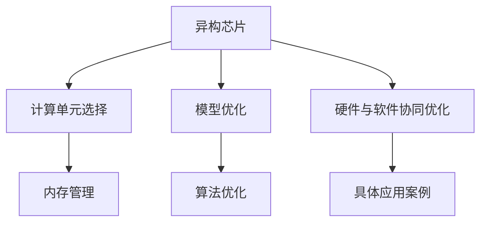
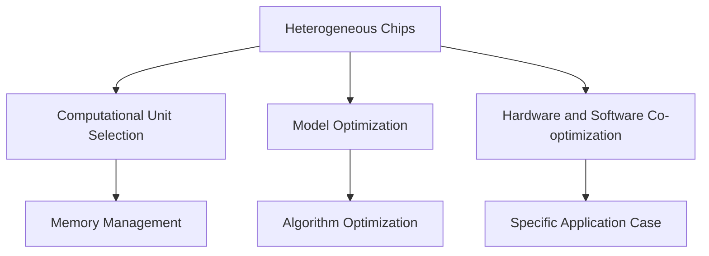

                 

### 文章标题

### Title: AI Acceleration's Optimistic Outlook: Jia Yangqing's Perspective on Heterogeneous Chip Architectures and Large Language Model Architectures

### 关键词：关键词：人工智能加速，异构芯片，贾扬清，大语言模型架构，神经网络，AI芯片设计，AI计算，机器学习

### Keywords: AI Acceleration, Heterogeneous Chip, Jia Yangqing, Large Language Model Architecture, Neural Networks, AI Chip Design, AI Computation, Machine Learning

### 摘要：本文深入探讨了人工智能加速领域的乐观展望，以著名人工智能专家贾扬清的观点为核心，重点分析了异构芯片在大语言模型架构中的应用。文章首先介绍了贾扬清对于AI加速的总体观点，随后详细解析了异构芯片的原理及其在AI计算中的重要性。接着，文章通过具体案例和数学模型，展示了大语言模型架构的设计方法和优化策略。最后，文章总结了未来AI加速领域的趋势与挑战，并提出了相应的解决方案。

### Abstract: This article delves into the optimistic outlook of AI acceleration, with a focus on the perspectives of renowned AI expert Jia Yangqing. It emphasizes the application of heterogeneous chip architectures in large language model architectures. The article first introduces Jia Yangqing's overall views on AI acceleration, followed by a detailed analysis of the principles of heterogeneous chips and their importance in AI computation. Then, through specific cases and mathematical models, the article demonstrates the design methods and optimization strategies of large language model architectures. Finally, the article summarizes the future trends and challenges in the field of AI acceleration and proposes corresponding solutions.

<|im_sep|>## 1. 背景介绍（Background Introduction）

### 1.1 人工智能加速的重要性

随着深度学习技术的快速发展，人工智能（AI）的应用场景日益广泛。然而，传统的中央处理器（CPU）在处理大量并行计算任务时，性能逐渐成为瓶颈。为了满足AI计算的巨大需求，人工智能加速技术应运而生。AI加速旨在通过优化计算硬件，提升AI算法的执行效率，从而实现更快的模型训练和推理速度。

### 1.2 异构计算与异构芯片

异构计算（Heterogeneous Computing）是指将不同类型的计算单元集成到同一系统中，通过合理分配计算任务，充分利用各类计算单元的特长，以实现更高的计算性能和能效。异构芯片（Heterogeneous Chip）则是实现异构计算的关键硬件基础。它们通常包含CPU、GPU、FPGA、ASIC等多种类型的计算单元，能够高效地处理复杂的多任务场景。

### 1.3 大语言模型架构

大语言模型（Large Language Model）是近年来AI领域的重要突破之一。这些模型具有数万亿参数，能够对自然语言进行深入理解和生成。为了实现高效的大语言模型训练和推理，需要设计专门的架构，包括硬件和软件层面的优化。大语言模型架构的核心在于如何合理组织和管理大量的计算资源，以实现高效的并行计算。

### 1.4 贾扬清的观点

贾扬清是一位著名的人工智能专家，在AI芯片设计和AI计算领域具有深厚的学术和实践经验。他对于人工智能加速、异构计算和大语言模型架构有着独特的见解。贾扬清认为，异构芯片是未来AI计算的重要方向，而大语言模型架构的设计则需要充分考虑硬件和软件的协同优化。

### 1.5 文章结构

本文将从以下五个部分对人工智能加速、异构芯片和大语言模型架构进行深入探讨：

1. **背景介绍**：介绍人工智能加速、异构计算和大语言模型架构的基本概念和重要性。
2. **核心概念与联系**：详细解析异构芯片和大语言模型架构的核心原理，并展示其相互关系。
3. **核心算法原理 & 具体操作步骤**：介绍大语言模型架构的设计方法和优化策略。
4. **数学模型和公式 & 详细讲解 & 举例说明**：使用数学模型和公式详细解释大语言模型架构的工作原理。
5. **项目实践：代码实例和详细解释说明**：通过具体案例展示大语言模型架构的实现过程。

### 1.6 核心概念与联系（中文）

#### 1.6.1 异构芯片的原理

异构芯片通过集成不同类型的计算单元，实现了计算资源的多样化。这些计算单元包括CPU、GPU、FPGA、ASIC等，各自具有不同的计算能力和特点。CPU擅长处理复杂的控制逻辑和通用计算任务，GPU则擅长大规模并行计算和图像处理，FPGA具有灵活的可编程性，而ASIC则针对特定应用场景进行优化。

#### 1.6.2 大语言模型架构的设计

大语言模型架构的设计旨在充分利用异构芯片的计算资源，实现高效并行计算。其核心思想是分解大规模的计算任务，将其分配到不同的计算单元上执行，同时优化数据流和通信，以减少计算延迟和带宽瓶颈。

#### 1.6.3 异构芯片与大型语言模型架构的联系

异构芯片为大型语言模型架构提供了强大的计算支持，使得大规模并行计算成为可能。同时，大型语言模型架构的设计也推动了异构芯片技术的发展，对硬件性能和能效提出了更高的要求。

### 1.7 Core Concepts and Connections (English)

#### 1.7.1 The Principles of Heterogeneous Chips

Heterogeneous chips integrate different types of computational units, achieving a diversified range of computational resources. These units include CPUs, GPUs, FPGAs, and ASICs, each with its own computational capabilities and characteristics. CPUs are good at handling complex control logic and general computing tasks, GPUs excel in large-scale parallel computing and image processing, FPGAs have flexible programmability, and ASICs are optimized for specific application scenarios.

#### 1.7.2 The Design of Large Language Model Architectures

The design of large language model architectures aims to fully utilize the computational resources of heterogeneous chips to achieve efficient parallel computing. Its core idea is to decompose large-scale computational tasks, distribute them to different computational units for execution, and optimize data flow and communication to reduce computational latency and bandwidth bottlenecks.

#### 1.7.3 The Connection between Heterogeneous Chips and Large Language Model Architectures

Heterogeneous chips provide powerful computational support for large language model architectures, making large-scale parallel computing possible. At the same time, the design of large language model architectures has also driven the development of heterogeneous chip technology, posing higher requirements for hardware performance and energy efficiency.

<|im_sep|>## 2. 核心概念与联系（Core Concepts and Connections）

在本章节中，我们将深入探讨异构芯片和大语言模型架构的核心概念及其相互关系。

### 2.1 异构芯片的原理

#### 2.1.1 异构计算的定义

异构计算是一种将不同类型的计算资源集成到同一系统中，以实现更高的计算性能和能效的技术。传统的计算机系统通常采用同构计算，即所有计算单元具有相同的计算能力和架构。然而，随着计算需求的日益增长，同构计算逐渐暴露出其局限性。异构计算通过引入多种类型的计算单元，可以更有效地处理复杂的计算任务。

#### 2.1.2 异构芯片的组成

异构芯片通常包含多种计算单元，包括CPU、GPU、FPGA、ASIC等。这些单元各自具有不同的计算能力和特点：

- **CPU（Central Processing Unit）**：中央处理器，擅长处理复杂的控制逻辑和通用计算任务。
- **GPU（Graphics Processing Unit）**：图形处理器，擅长大规模并行计算和图像处理。
- **FPGA（Field-Programmable Gate Array）**：现场可编程门阵列，具有高度灵活的可编程性，适用于特定的计算任务。
- **ASIC（Application-Specific Integrated Circuit）**：应用专用集成电路，针对特定应用场景进行优化，具有高效的计算性能。

#### 2.1.3 异构芯片的优势

异构芯片通过整合不同类型的计算单元，可以实现以下优势：

- **高效能**：利用不同计算单元的特长，实现任务的最优分配，提高整体计算性能。
- **低能耗**：通过合理分配计算任务，降低高能耗计算单元的负载，实现能效优化。
- **灵活性**：可针对不同应用场景进行定制化设计，提高系统的适应性和灵活性。

### 2.2 大语言模型架构的设计

#### 2.2.1 大语言模型的基本原理

大语言模型是一种基于神经网络的语言处理模型，通过学习大量文本数据，实现对自然语言的深入理解和生成。大语言模型的核心是大规模的参数矩阵，这些参数矩阵用于表示语言的特征和规则。常见的神经网络结构包括循环神经网络（RNN）、长短时记忆网络（LSTM）和变换器（Transformer）等。

#### 2.2.2 大语言模型架构的设计原则

大语言模型架构的设计原则主要包括以下几点：

- **并行计算**：利用异构芯片的多计算单元，实现大规模的并行计算，提高模型的训练和推理速度。
- **数据流优化**：优化数据传输和计算单元之间的通信，减少数据访问延迟和带宽瓶颈。
- **参数优化**：通过优化参数存储和计算方式，减少内存占用和计算资源消耗。
- **可扩展性**：设计灵活的架构，支持不同规模和类型的模型，以适应不断增长的计算需求。

#### 2.2.3 大语言模型架构的关键组件

大语言模型架构通常包含以下关键组件：

- **输入层**：负责接收和处理输入文本数据，将其转换为模型可处理的格式。
- **编码器**：将输入文本编码为高维向量，用于表示文本的特征和上下文信息。
- **解码器**：根据编码器的输出，生成预测的文本序列，实现语言生成功能。
- **参数矩阵**：存储模型的参数，用于表示语言的特征和规则。

### 2.3 异构芯片与大型语言模型架构的联系

#### 2.3.1 硬件与软件的协同优化

异构芯片和大语言模型架构的协同优化是实现高效AI计算的关键。硬件层面的优化包括：

- **计算单元选择**：根据任务特点和计算需求，选择合适的计算单元，实现任务的最优分配。
- **内存管理**：优化内存访问和存储策略，减少内存占用和访问延迟。

软件层面的优化包括：

- **模型优化**：通过模型剪枝、量化等技术，减少模型的复杂度和计算量。
- **算法优化**：设计高效的算法和数据结构，提高模型的训练和推理速度。

#### 2.3.2 具体应用案例

以下是一个具体的应用案例，展示了异构芯片在大语言模型架构中的应用：

- **任务分解**：将大规模的语言模型训练任务分解为多个子任务，分别分配给CPU、GPU和FPGA等计算单元。
- **数据流优化**：优化数据传输路径，实现数据的快速传递和并行处理。
- **参数优化**：通过模型剪枝和量化技术，减少模型参数的数量和计算量，降低计算资源的消耗。

### 2.4 Mermaid 流程图

以下是一个用于展示异构芯片和大语言模型架构相互关系的 Mermaid 流程图：



### 2.5 Core Concepts and Connections (English)

#### 2.5.1 The Principles of Heterogeneous Chips

Heterogeneous computing is a technology that integrates different types of computational resources into a single system to achieve higher computational performance and energy efficiency. Traditional computer systems typically use homogeneous computing, where all computational units have the same computational capabilities and architectures. However, with the increasing demand for computation, homogeneous computing has shown its limitations. Heterogeneous computing introduces various types of computational units to efficiently handle complex computational tasks.

#### 2.5.2 The Composition of Heterogeneous Chips

Heterogeneous chips usually consist of multiple computational units, including CPUs, GPUs, FPGAs, and ASICs. These units have different computational capabilities and characteristics:

- **CPU (Central Processing Unit)**: Central processing units are good at handling complex control logic and general computing tasks.
- **GPU (Graphics Processing Unit)**: Graphics processing units excel in large-scale parallel computing and image processing.
- **FPGA (Field-Programmable Gate Array)**: Field-programmable gate arrays have high flexibility and are suitable for specific computational tasks.
- **ASIC (Application-Specific Integrated Circuit)**: Application-specific integrated circuits are optimized for specific application scenarios and have high computational performance.

#### 2.5.3 Advantages of Heterogeneous Chips

Heterogeneous chips can achieve the following advantages by integrating different types of computational units:

- **High Performance**: By utilizing the strengths of different computational units, tasks can be optimally allocated to achieve higher overall computational performance.
- **Low Energy Consumption**: By reasonably allocating computational tasks, the load on high-energy-consuming computational units can be reduced, achieving energy efficiency optimization.
- **Flexibility**: The system can be customized for different application scenarios, improving adaptability and flexibility.

#### 2.5.4 The Design of Large Language Model Architectures

Large language models are neural network-based language processing models that learn from large amounts of text data to achieve deep understanding and generation of natural language. The core of large language models is the massive parameter matrix, which represents the features and rules of language.

#### 2.5.5 Design Principles of Large Language Model Architectures

The design principles of large language model architectures include the following:

- **Parallel Computing**: Utilize the multiple computational units of heterogeneous chips to achieve large-scale parallel computing, improving the speed of model training and inference.
- **Data Flow Optimization**: Optimize data transmission and communication between computational units to reduce data access latency and bandwidth bottlenecks.
- **Parameter Optimization**: Optimize parameter storage and computation methods to reduce memory usage and computational resource consumption.
- **Scalability**: Design flexible architectures to support different sizes and types of models to adapt to the continuously increasing computational demand.

#### 2.5.6 Key Components of Large Language Model Architectures

Large language model architectures typically consist of the following key components:

- **Input Layer**: Responsible for receiving and processing input text data and converting it into a format that the model can handle.
- **Encoder**: Encodes input text into high-dimensional vectors to represent the features and contextual information of the text.
- **Decoder**: Generates predicted text sequences based on the output of the encoder, realizing language generation functions.
- **Parameter Matrix**: Stores the model's parameters, representing the features and rules of language.

#### 2.5.7 The Connection between Heterogeneous Chips and Large Language Model Architectures

The collaboration between heterogeneous chips and large language model architectures is crucial for efficient AI computation.

#### 2.5.8 Hardware and Software Co-optimization

Hardware-level optimization includes:

- **Computational Unit Selection**: Select appropriate computational units based on task characteristics and computational demands to achieve optimal task allocation.
- **Memory Management**: Optimize memory access and storage strategies to reduce memory usage and access latency.

Software-level optimization includes:

- **Model Optimization**: Reduce the complexity and computational effort of the model through techniques such as pruning and quantization.
- **Algorithm Optimization**: Design efficient algorithms and data structures to improve the speed of model training and inference.

#### 2.5.9 Specific Application Case

Here is a specific application case demonstrating the use of heterogeneous chips in large language model architectures:

- **Task Decomposition**: Decompose the large-scale language model training task into multiple subtasks, allocating them to computational units such as CPUs, GPUs, and FPGAs.
- **Data Flow Optimization**: Optimize data transmission paths to achieve fast data transfer and parallel processing.
- **Parameter Optimization**: Reduce the number and computational effort of model parameters through techniques such as pruning and quantization to reduce computational resource consumption.

#### 2.5.10 Mermaid Flowchart

Here is a Mermaid flowchart to illustrate the relationship between heterogeneous chips and large language model architectures:



<|im_sep|>## 3. 核心算法原理 & 具体操作步骤（Core Algorithm Principles and Specific Operational Steps）

### 3.1 大语言模型架构的核心算法原理

大语言模型架构的核心算法是基于神经网络的语言处理算法。这些算法通过学习大量文本数据，实现对自然语言的深入理解和生成。以下是几种常见的大语言模型算法及其原理：

#### 3.1.1 循环神经网络（RNN）

循环神经网络（RNN）是一种能够处理序列数据的神经网络。其核心思想是将当前输入与历史输入状态进行结合，从而捕捉序列中的时间依赖关系。RNN 的基本结构包括输入层、隐藏层和输出层。输入层接收输入文本数据，隐藏层存储历史状态信息，输出层生成预测的文本序列。

#### 3.1.2 长短时记忆网络（LSTM）

长短时记忆网络（LSTM）是 RNN 的一种改进模型，旨在解决 RNN 在处理长序列数据时存在的梯度消失和梯度爆炸问题。LSTM 通过引入门控机制，实现了对信息流的控制，能够更好地捕捉长期依赖关系。

#### 3.1.3 变换器（Transformer）

变换器（Transformer）是一种全新的神经网络架构，首次在论文《Attention Is All You Need》中提出。Transformer 使用自注意力机制（Self-Attention）和多头注意力机制（Multi-Head Attention），实现了对输入文本序列的并行处理，显著提高了计算效率和模型性能。

### 3.2 大语言模型架构的具体操作步骤

大语言模型架构的具体操作步骤可以分为以下几部分：

#### 3.2.1 数据预处理

数据预处理是模型训练的第一步，主要包括以下步骤：

- **文本清洗**：去除文本中的标点符号、特殊字符和停用词。
- **分词**：将文本划分为词语或字符序列。
- **编码**：将分词后的文本序列转换为模型可处理的数字编码。

#### 3.2.2 模型初始化

模型初始化是模型训练的准备工作，主要包括以下步骤：

- **权重初始化**：初始化模型参数的权重，常用的方法有高斯分布初始化和 Xavier 初始化。
- **激活函数选择**：选择合适的激活函数，如 Sigmoid、ReLU 等。

#### 3.2.3 模型训练

模型训练是通过不断迭代优化模型参数，使模型在训练数据上达到最佳性能。具体步骤如下：

- **前向传播**：将输入文本数据传递给模型，计算模型的预测输出。
- **损失函数计算**：计算预测输出与真实输出之间的差异，使用损失函数（如交叉熵损失函数）衡量模型性能。
- **反向传播**：根据损失函数，计算模型参数的梯度，并更新模型参数。
- **优化算法选择**：选择合适的优化算法（如梯度下降、Adam 等），调整学习率等参数。

#### 3.2.4 模型评估

模型评估是在测试集上评估模型的性能，主要包括以下步骤：

- **预测输出计算**：将测试集输入模型，计算预测输出。
- **性能指标计算**：计算模型的准确率、召回率、F1 值等性能指标。
- **结果分析**：分析模型在不同数据集上的性能表现，找出模型的优点和不足。

### 3.3 大语言模型架构的具体操作步骤示例

以下是一个简单的大语言模型架构的具体操作步骤示例：

1. **数据预处理**：

   ```python
   import jieba
   
   # 加载训练数据
   sentences = load_data('train_data.txt')
   
   # 文本清洗
   cleaned_sentences = [remove_punctuation(sentence) for sentence in sentences]
   
   # 分词
   tokenized_sentences = [jieba.cut(sentence) for sentence in cleaned_sentences]
   
   # 编码
   encoded_sentences = encode_sentences(tokenized_sentences)
   ```

2. **模型初始化**：

   ```python
   import tensorflow as tf
   
   # 初始化权重
   weights = tf.random_normal(shape=[VOCAB_SIZE, HIDDEN_SIZE], mean=0, stddev=0.01)
   
   # 选择激活函数
   activation = tf.nn.relu
   ```

3. **模型训练**：

   ```python
   import tensorflow as tf
   
   # 定义损失函数
   loss_function = tf.keras.losses.SparseCategoricalCrossentropy(from_logits=True)
   
   # 定义优化器
   optimizer = tf.keras.optimizers.Adam(learning_rate=0.001)
   
   # 定义训练过程
   train_process = tf.keras.metrics.Mean('train_loss', dtype=tf.float32)
   
   for epoch in range(EPOCHS):
       for sentence, label in train_dataset:
           with tf.GradientTape() as tape:
               predictions = model(sentence, training=True)
               loss = loss_function(labels, predictions)
       
           gradients = tape.gradient(loss, model.trainable_variables)
           optimizer.apply_gradients(zip(gradients, model.trainable_variables))
       
       train_process.update_state(loss)
       
       print(f'Epoch {epoch+1}, Loss: {train_process.result().numpy()}')
   ```

4. **模型评估**：

   ```python
   import tensorflow as tf
   
   # 加载测试数据
   test_sentences, test_labels = load_data('test_data.txt')
   
   # 预测输出
   test_predictions = model(test_sentences, training=False)
   
   # 计算性能指标
   accuracy = tf.keras.metrics.SparseCategoricalAccuracy()
   accuracy.update_state(test_labels, test_predictions)
   
   print(f'Accuracy: {accuracy.result().numpy()}')
   ```

### 3.4 Core Algorithm Principles and Specific Operational Steps (English)

#### 3.4.1 Core Algorithms of Large Language Model Architectures

The core algorithms of large language model architectures are based on neural network-based language processing algorithms. These algorithms learn from large amounts of text data to achieve deep understanding and generation of natural language. Here are some common large language model algorithms and their principles:

#### 3.4.2 Recurrent Neural Networks (RNN)

Recurrent Neural Networks (RNN) are neural networks designed to handle sequence data. The core idea of RNN is to combine the current input with the historical input state to capture the temporal dependencies in sequences. The basic structure of RNN includes an input layer, a hidden layer, and an output layer. The input layer receives input text data, the hidden layer stores historical state information, and the output layer generates predicted text sequences.

#### 3.4.3 Long Short-Term Memory Networks (LSTM)

Long Short-Term Memory Networks (LSTM) are an improvement of RNN to solve the problems of vanishing and exploding gradients when handling long sequences. LSTM introduces gate mechanisms to control the information flow, enabling better capture of long-term dependencies.

#### 3.4.4 Transformers

Transformers are a novel neural network architecture first proposed in the paper "Attention Is All You Need." Transformers use self-attention mechanisms and multi-head attention mechanisms to process input text sequences in parallel, significantly improving computational efficiency and model performance.

#### 3.4.5 Specific Operational Steps of Large Language Model Architectures

The specific operational steps of large language model architectures can be divided into several parts:

#### 3.4.6 Data Preprocessing

Data preprocessing is the first step in model training and includes the following steps:

- **Text Cleaning**: Remove punctuation, special characters, and stop words from text.
- **Tokenization**: Divide text into words or character sequences.
- **Encoding**: Convert tokenized text sequences into a format that the model can handle.

#### 3.4.7 Model Initialization

Model initialization is the preparatory work for model training and includes the following steps:

- **Weight Initialization**: Initialize the weights of model parameters, with common methods including Gaussian distribution initialization and Xavier initialization.
- **Activation Function Selection**: Select an appropriate activation function, such as Sigmoid, ReLU, etc.

#### 3.4.8 Model Training

Model training involves continuously iterating to optimize model parameters to achieve the best performance on the training data. The specific steps are as follows:

- **Forward Propagation**: Pass the input text data through the model to calculate the predicted output.
- **Loss Function Calculation**: Calculate the difference between the predicted output and the true output, using a loss function (such as the cross-entropy loss function) to measure model performance.
- **Backpropagation**: Based on the loss function, calculate the gradients of model parameters and update the model parameters.
- **Optimizer Selection**: Select an appropriate optimizer (such as gradient descent, Adam) and adjust parameters such as learning rate.

#### 3.4.9 Model Evaluation

Model evaluation involves assessing the performance of the model on a test set, including the following steps:

- **Predicted Output Calculation**: Pass the test set input through the model to calculate the predicted output.
- **Performance Metric Calculation**: Calculate performance metrics such as accuracy, recall, and F1 score.
- **Result Analysis**: Analyze the model's performance on different datasets, identifying the model's strengths and weaknesses.

#### 3.4.10 Example of Specific Operational Steps for a Large Language Model Architecture

Here is an example of specific operational steps for a simple large language model architecture:

1. **Data Preprocessing**:

   ```python
   import jieba
   
   # Load training data
   sentences = load_data('train_data.txt')
   
   # Text cleaning
   cleaned_sentences = [remove_punctuation(sentence) for sentence in sentences]
   
   # Tokenization
   tokenized_sentences = [jieba.cut(sentence) for sentence in cleaned_sentences]
   
   # Encoding
   encoded_sentences = encode_sentences(tokenized_sentences)
   ```

2. **Model Initialization**:

   ```python
   import tensorflow as tf
   
   # Initialize weights
   weights = tf.random_normal(shape=[VOCAB_SIZE, HIDDEN_SIZE], mean=0, stddev=0.01)
   
   # Activation function selection
   activation = tf.nn.relu
   ```

3. **Model Training**:

   ```python
   import tensorflow as tf
   
   # Define loss function
   loss_function = tf.keras.losses.SparseCategoricalCrossentropy(from_logits=True)
   
   # Define optimizer
   optimizer = tf.keras.optimizers.Adam(learning_rate=0.001)
   
   # Define training process
   train_process = tf.keras.metrics.Mean('train_loss', dtype=tf.float32)
   
   for epoch in range(EPOCHS):
       for sentence, label in train_dataset:
           with tf.GradientTape() as tape:
               predictions = model(sentence, training=True)
               loss = loss_function(labels, predictions)
       
           gradients = tape.gradient(loss, model.trainable_variables)
           optimizer.apply_gradients(zip(gradients, model.trainable_variables))
       
       train_process.update_state(loss)
       
       print(f'Epoch {epoch+1}, Loss: {train_process.result().numpy()}')
   ```

4. **Model Evaluation**:

   ```python
   import tensorflow as tf
   
   # Load test data
   test_sentences, test_labels = load_data('test_data.txt')
   
   # Predicted output
   test_predictions = model(test_sentences, training=False)
   
   # Calculate performance metrics
   accuracy = tf.keras.metrics.SparseCategoricalAccuracy()
   accuracy.update_state(test_labels, test_predictions)
   
   print(f'Accuracy: {accuracy.result().numpy()}')
   ```

<|im_sep|>## 4. 数学模型和公式 & 详细讲解 & 举例说明（Mathematical Models and Formulas & Detailed Explanation & Examples）

在本章节中，我们将详细介绍大语言模型架构中涉及的数学模型和公式，并通过具体例子进行说明。

### 4.1 神经网络基本公式

神经网络（Neural Networks）是构建大语言模型的基础。以下是一些神经网络的基本公式：

#### 4.1.1 前向传播

神经网络的前向传播是指将输入数据传递到网络中，计算每一层的输出。具体公式如下：

$$
Z^{[l]} = \sigma(W^{[l]} \cdot A^{[l-1]} + b^{[l]})
$$

其中，$Z^{[l]}$ 表示第$l$层的输出，$\sigma$ 表示激活函数，$W^{[l]}$ 和 $b^{[l]}$ 分别表示第$l$层的权重和偏置。

#### 4.1.2 反向传播

神经网络的反向传播是指计算损失函数关于网络参数的梯度，并通过梯度下降更新网络参数。具体公式如下：

$$
\frac{\partial J}{\partial W^{[l]}} = \frac{\partial L}{\partial Z^{[l]}} \cdot \frac{\partial Z^{[l]}}{\partial A^{[l-1]}} \cdot \frac{\partial A^{[l-1]}}{\partial Z^{[l-1]}} \cdot \frac{\partial Z^{[l-1]}}{\partial W^{[l-1]}}
$$

$$
\frac{\partial J}{\partial b^{[l]}} = \frac{\partial L}{\partial Z^{[l]}} \cdot \frac{\partial Z^{[l]}}{\partial A^{[l-1]}} \cdot \frac{\partial A^{[l-1]}}{\partial Z^{[l-1]}} \cdot \frac{\partial Z^{[l-1]}}{\partial b^{[l-1]}
```
其中，$J$ 表示损失函数，$L$ 表示第$l$层的损失函数，$A^{[l-1]}$ 表示第$l-1$层的输出，$Z^{[l]}$ 表示第$l$层的输出，$W^{[l]}$ 和 $b^{[l]}$ 分别表示第$l$层的权重和偏置。

#### 4.1.3 激活函数

激活函数是神经网络中的一个关键组件，用于引入非线性特性。以下是一些常用的激活函数及其公式：

1. **Sigmoid 函数**：

$$
\sigma(x) = \frac{1}{1 + e^{-x}}
$$

2. **ReLU 函数**：

$$
\sigma(x) = \max(0, x)
$$

3. **Tanh 函数**：

$$
\sigma(x) = \frac{e^x - e^{-x}}{e^x + e^{-x}}
$$

### 4.2 大语言模型中的数学模型

大语言模型中，常用的数学模型包括损失函数、优化器和正则化方法等。

#### 4.2.1 损失函数

在训练大语言模型时，常用的损失函数是交叉熵损失函数（Cross-Entropy Loss）：

$$
L(y, \hat{y}) = -\sum_{i=1}^{n} y_i \cdot \log(\hat{y}_i)
$$

其中，$y$ 表示真实标签，$\hat{y}$ 表示模型的预测概率分布。

#### 4.2.2 优化器

常用的优化器包括梯度下降（Gradient Descent）和 Adam 优化器。以下分别介绍它们的公式：

1. **梯度下降**：

$$
\theta_{t+1} = \theta_t - \alpha \cdot \nabla_\theta J(\theta_t)
$$

其中，$\theta$ 表示模型参数，$\alpha$ 表示学习率，$\nabla_\theta J(\theta_t)$ 表示损失函数关于参数的梯度。

2. **Adam 优化器**：

$$
m_t = \beta_1 m_{t-1} + (1 - \beta_1) \nabla_\theta J(\theta_t)
$$

$$
v_t = \beta_2 v_{t-1} + (1 - \beta_2) (\nabla_\theta J(\theta_t))^2
$$

$$
\theta_{t+1} = \theta_t - \alpha \cdot \frac{m_t}{\sqrt{v_t} + \epsilon}
$$

其中，$m_t$ 和 $v_t$ 分别表示一阶和二阶矩估计，$\beta_1$ 和 $\beta_2$ 分别为动量因子，$\epsilon$ 为一个小常数。

#### 4.2.3 正则化方法

为了防止过拟合，大语言模型中常使用正则化方法，如 L1 正则化和 L2 正则化：

1. **L1 正则化**：

$$
\Omega_{L1} = \sum_{i=1}^{n} |\theta_i|
$$

2. **L2 正则化**：

$$
\Omega_{L2} = \sum_{i=1}^{n} \theta_i^2
$$

其中，$\theta_i$ 表示模型参数。

### 4.3 举例说明

以下通过一个简单的例子，展示如何使用上述公式和模型训练大语言模型：

假设我们有一个二分类问题，数据集包含100个样本，每个样本的特征向量为 $x \in \mathbb{R}^{10}$，标签为 $y \in \{0, 1\}$。我们使用一个单层神经网络进行模型训练，激活函数为 ReLU，优化器为 Adam，学习率为 0.01。

1. **数据预处理**：

   - 将数据集划分为训练集和测试集，分别为 $(X_train, y_train)$ 和 $(X_test, y_test)$。
   - 对数据进行归一化处理，使其在 $[0, 1]$ 范围内。

2. **模型初始化**：

   - 初始化权重和偏置为随机值。
   - 设置激活函数为 ReLU。

3. **模型训练**：

   - 使用训练集进行前向传播，计算预测概率 $\hat{y}$。
   - 计算交叉熵损失函数 $L(y, \hat{y})$。
   - 使用 Adam 优化器计算梯度并更新模型参数。
   - 重复以上步骤，直到满足停止条件（如达到指定迭代次数或模型性能不再提升）。

4. **模型评估**：

   - 使用测试集进行模型评估，计算准确率、召回率、F1 值等指标。

通过上述步骤，我们使用神经网络训练了一个简单的二分类模型。实际应用中，我们可以根据具体任务和数据集，调整模型结构、参数和正则化方法，以获得更好的性能。

### 4.4 Mathematical Models and Formulas & Detailed Explanation & Examples (English)

#### 4.4.1 Basic Formulas of Neural Networks

Neural Networks are the foundation for constructing large language models. Here are some basic formulas related to neural networks:

#### 4.4.2 Forward Propagation

Forward propagation in neural networks refers to passing input data through the network to compute the output of each layer. The formula is as follows:

$$
Z^{[l]} = \sigma(W^{[l]} \cdot A^{[l-1]} + b^{[l]})
$$

Where $Z^{[l]}$ represents the output of layer $l$, $\sigma$ is the activation function, $W^{[l]}$ and $b^{[l]}$ are the weights and biases of layer $l$ respectively.

#### 4.4.3 Backpropagation

Backpropagation refers to calculating the gradients of the loss function with respect to the network parameters and updating the parameters using gradient descent. The formula is as follows:

$$
\frac{\partial J}{\partial W^{[l]}} = \frac{\partial L}{\partial Z^{[l]}} \cdot \frac{\partial Z^{[l]}}{\partial A^{[l-1]}} \cdot \frac{\partial A^{[l-1]}}{\partial Z^{[l-1]}} \cdot \frac{\partial Z^{[l-1]}}{\partial W^{[l-1]}}
$$

$$
\frac{\partial J}{\partial b^{[l]}} = \frac{\partial L}{\partial Z^{[l]}} \cdot \frac{\partial Z^{[l]}}{\partial A^{[l-1]}} \cdot \frac{\partial A^{[l-1]}}{\partial Z^{[l-1]}} \cdot \frac{\partial Z^{[l-1]}}{\partial b^{[l-1]}
$$

Where $J$ is the loss function, $L$ is the loss function of layer $l$, $A^{[l-1]}$ is the output of layer $l-1$, $Z^{[l]}$ is the output of layer $l$, $W^{[l]}$ and $b^{[l]}$ are the weights and biases of layer $l$ respectively.

#### 4.4.4 Activation Functions

Activation functions are a key component of neural networks, introducing non-linear properties. Here are some common activation functions and their formulas:

1. **Sigmoid Function**:

$$
\sigma(x) = \frac{1}{1 + e^{-x}}
$$

2. **ReLU Function**:

$$
\sigma(x) = \max(0, x)
$$

3. **Tanh Function**:

$$
\sigma(x) = \frac{e^x - e^{-x}}{e^x + e^{-x}}
$$

#### 4.4.5 Mathematical Models in Large Language Models

Common mathematical models in large language models include loss functions, optimizers, and regularization methods.

#### 4.4.6 Loss Functions

A commonly used loss function for training large language models is the cross-entropy loss function:

$$
L(y, \hat{y}) = -\sum_{i=1}^{n} y_i \cdot \log(\hat{y}_i)
$$

Where $y$ represents the true label and $\hat{y}$ represents the predicted probability distribution by the model.

#### 4.4.7 Optimizers

Common optimizers include gradient descent and Adam optimizer. Here are their formulas:

1. **Gradient Descent**:

$$
\theta_{t+1} = \theta_t - \alpha \cdot \nabla_\theta J(\theta_t)
$$

Where $\theta$ represents the model parameters, $\alpha$ is the learning rate, and $\nabla_\theta J(\theta_t)$ is the gradient of the loss function with respect to the parameters.

2. **Adam Optimizer**:

$$
m_t = \beta_1 m_{t-1} + (1 - \beta_1) \nabla_\theta J(\theta_t)
$$

$$
v_t = \beta_2 v_{t-1} + (1 - \beta_2) (\nabla_\theta J(\theta_t))^2
$$

$$
\theta_{t+1} = \theta_t - \alpha \cdot \frac{m_t}{\sqrt{v_t} + \epsilon}
$$

Where $m_t$ and $v_t$ are the first and second moment estimates respectively, $\beta_1$ and $\beta_2$ are momentum factors, and $\epsilon$ is a small constant.

#### 4.4.8 Regularization Methods

To prevent overfitting, regularization methods such as L1 regularization and L2 regularization are commonly used in large language models:

1. **L1 Regularization**:

$$
\Omega_{L1} = \sum_{i=1}^{n} |\theta_i|
$$

2. **L2 Regularization**:

$$
\Omega_{L2} = \sum_{i=1}^{n} \theta_i^2
$$

Where $\theta_i$ represents the model parameters.

### 4.4.9 Example

Here is an example to illustrate how to use the above formulas and models to train a large language model:

Assume we have a binary classification problem with a dataset of 100 samples. Each sample has a feature vector $x \in \mathbb{R}^{10}$ and a label $y \in \{0, 1\}$. We use a single-layer neural network for training, with an activation function of ReLU, and an Adam optimizer with a learning rate of 0.01.

1. **Data Preprocessing**:

   - Divide the dataset into training and testing sets, $(X_train, y_train)$ and $(X_test, y_test)$.
   - Normalize the data to be within the range $[0, 1]$.

2. **Model Initialization**:

   - Initialize the weights and biases to random values.
   - Set the activation function to ReLU.

3. **Model Training**:

   - Perform forward propagation using the training set to compute the predicted probabilities $\hat{y}$.
   - Compute the cross-entropy loss function $L(y, \hat{y})$.
   - Use the Adam optimizer to compute the gradients and update the model parameters.
   - Repeat the above steps until a stopping condition is met (e.g., a specified number of iterations or no further improvement in model performance).

4. **Model Evaluation**:

   - Evaluate the model on the testing set and compute metrics such as accuracy, recall, and F1 score.

By following these steps, we can train a simple binary classification model using a neural network. In practice, you can adjust the model structure, parameters, and regularization methods based on the specific task and dataset to achieve better performance.

