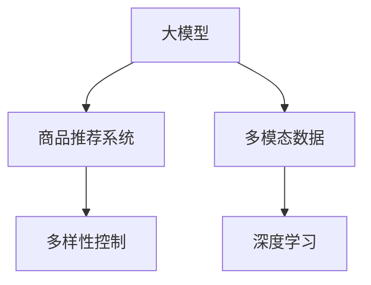

                 

# 探讨大模型在电商平台商品推荐多样性控制中的作用

## 1. 背景介绍

### 1.1 问题由来

电商平台为满足用户个性化购物需求，需要构建高效的商品推荐系统。在推荐算法中，多样性控制是提高用户体验和系统公平性的关键因素之一。传统的推荐算法（如协同过滤、基于内容的推荐）虽然取得了良好效果，但主要侧重于对用户历史行为的预测，忽视了物品多样性的重要性。而大模型通过预训练获得广泛的知识和泛化能力，能够在多模态数据上进行深度建模，有望为商品推荐系统的多样性控制提供新的思路。

### 1.2 问题核心关键点

大模型在推荐系统中的多样性控制，核心在于如何构建模型并使其能够同时考虑用户偏好和商品多样性。具体包括：
1. 如何利用大模型学习用户行为和物品特征，生成推荐列表。
2. 如何在推荐过程中融入多样性约束，避免过度个性化带来的负面影响。
3. 如何设计算法，在保证推荐效果的同时，提升推荐多样性。
4. 如何评估和优化推荐多样性，确保推荐结果的公平性和全面性。

### 1.3 问题研究意义

大模型在电商平台商品推荐中的多样性控制，对于提升用户体验、增强平台竞争力、实现社会公正具有重要意义：
1. 提升用户体验：通过引入多样性约束，推荐系统可以避免过度集中于少数热门商品，确保用户看到更多种类的商品。
2. 增强平台竞争力：多样性控制可以避免推荐的同质化，吸引更多新用户，提升平台流量和用户粘性。
3. 实现社会公正：多样性控制可以防止用户偏见和歧视，确保推荐结果对所有用户公平。

## 2. 核心概念与联系

### 2.1 核心概念概述

为更好地理解大模型在商品推荐多样性控制中的应用，本节将介绍几个关键概念：

- 大模型(Large Model)：以Transformer为代表的大规模预训练语言模型，如BERT、GPT等。通过在大规模数据上进行预训练，获得丰富的语言知识，具备强大的泛化能力和表示能力。
- 商品推荐系统(Recommendation System)：利用用户行为数据和商品属性数据，推荐用户可能感兴趣的商品的系统。目标是提高用户满意度，提升平台交易量。
- 多样性控制(Diversity Control)：在推荐过程中加入多样性约束，确保推荐结果中包含足够多样化的商品。有助于避免过度个性化带来的负面影响，提升推荐系统的公平性。
- 多模态数据(Multimodal Data)：除了传统的文本数据，商品推荐还涉及图片、视频、音频等多模态数据，需要通过大模型进行联合建模。
- 深度学习(Deep Learning)：利用神经网络结构，在大规模数据上进行深度学习训练，学习出复杂的特征表示和建模关系。

这些概念之间的关系可以通过以下Mermaid流程图来展示：



这个流程图展示了大模型在商品推荐系统中的核心作用：通过深度学习在大规模多模态数据上预训练，学习复杂的特征表示；然后在推荐系统中融合多样性约束，提升推荐结果的多样性和公平性。

## 3. 核心算法原理 & 具体操作步骤

### 3.1 算法原理概述

大模型在商品推荐系统中的多样性控制，本质上是一个在多模态数据上应用深度学习进行联合建模的过程。其核心思想是：利用大模型的广泛知识，学习用户行为和物品特征的复杂表示；在此基础上，引入多样性约束，优化推荐列表的生成过程，确保推荐结果的多样性。

具体来说，大模型将用户行为数据和商品属性数据映射到高维表示空间，通过自注意力机制学习用户兴趣和商品特征之间的关系。然后，在推荐过程中，通过引入多样性约束，调整推荐结果，使其包含更多种类的商品。

### 3.2 算法步骤详解

基于大模型的商品推荐系统，主要包括三个关键步骤：

**Step 1: 预训练大模型**
- 选择合适的预训练模型（如BERT、GPT等），在大规模多模态数据上进行预训练，学习出物品特征和用户兴趣的复杂表示。

**Step 2: 设计推荐模型**
- 在预训练模型的基础上，设计推荐模型，融合多模态数据，学习用户行为和物品特征之间的关系。
- 引入多样性约束，如item-level diversity、category-level diversity等，确保推荐结果的多样性。
- 设计损失函数，如交叉熵、BCE loss等，用于衡量推荐结果的准确性和多样性。

**Step 3: 模型优化与评估**
- 在训练集上进行模型训练，最小化损失函数，优化推荐模型参数。
- 在验证集上评估推荐结果的多样性和准确性，调整模型参数。
- 在测试集上评估推荐模型的性能，根据反馈进行迭代优化。

### 3.3 算法优缺点

基于大模型的商品推荐系统，具有以下优点：
1. 泛化能力强：大模型通过在大规模数据上进行预训练，学习到丰富的知识，具备强大的泛化能力。
2. 处理多模态数据：大模型可以处理图片、视频、音频等多模态数据，提升推荐的全面性和准确性。
3. 多样性控制有效：引入多样性约束，可以有效避免推荐的同质化，提升推荐系统的公平性和用户体验。
4. 可扩展性强：大模型具备高效的推理能力和计算图优化，可以轻松扩展到大规模推荐系统。

同时，该方法也存在以下局限性：
1. 训练成本高：大模型需要大量计算资源进行预训练，训练成本较高。
2. 模型复杂度高：大模型结构复杂，推理过程需要较高的计算资源。
3. 参数量大：大模型参数量巨大，需要占用大量内存和存储。
4. 推理效率低：大模型推理速度较慢，难以满足实时推荐的需求。

尽管存在这些局限性，但就目前而言，大模型在商品推荐中的应用已经展现出了强大的潜力。未来相关研究的重点在于如何降低大模型的训练成本，提升推理效率，同时兼顾泛化能力和多样性控制效果。

### 3.4 算法应用领域

基于大模型的商品推荐系统，在电子商务领域具有广泛的应用前景，具体包括：

- 个性化推荐：利用大模型学习用户行为和物品特征，生成个性化推荐列表。
- 购物篮推荐：将商品推荐系统与购物篮分析结合，推荐用户可能感兴趣的商品。
- 联合推荐：结合商品评分数据，进行联合推荐，提升推荐结果的准确性。
- 推荐列表多样化：引入多样性约束，确保推荐列表包含多种类型的商品。
- 广告推荐：利用大模型进行广告内容生成和推荐，提高广告投放的转化率。

除了上述这些典型应用外，大模型还可以应用于更多场景中，如视频推荐、音乐推荐、新闻推荐等，为电商平台的个性化服务和用户体验提供新的突破。

## 4. 数学模型和公式 & 详细讲解 & 举例说明

### 4.1 数学模型构建

本节将使用数学语言对基于大模型的商品推荐多样性控制方法进行更加严格的刻画。

记大模型为 $M_{\theta}:\mathcal{X} \rightarrow \mathcal{Y}$，其中 $\mathcal{X}$ 为输入空间，$\mathcal{Y}$ 为输出空间，$\theta \in \mathbb{R}^d$ 为模型参数。假设商品推荐系统需要推荐的商品集合为 $S$，用户历史行为数据为 $U$，则推荐模型 $M_{\theta}$ 的输入为 $(U, S)$，输出为推荐列表 $R$。

定义推荐模型 $M_{\theta}$ 在输入 $(U, S)$ 上的损失函数为 $\ell(M_{\theta}(U, S), R)$，用于衡量推荐结果的多样性和准确性。则在数据集 $D=\{(U_i, S_i, R_i)\}_{i=1}^N$ 上的经验风险为：

$$
\mathcal{L}(\theta) = \frac{1}{N} \sum_{i=1}^N \ell(M_{\theta}(U_i, S_i), R_i)
$$

在实际推荐过程中，多样性约束可以有多种形式，常见的包括：
1. 类别多样性约束：确保推荐列表包含多种商品类别。
2. 物品多样性约束：确保推荐列表中的不同商品数量达到预设目标。
3. 商品属性多样性约束：确保推荐列表中的商品属性分布均衡。

### 4.2 公式推导过程

以下是基于大模型的商品推荐系统多样性控制中常用的公式推导过程：

**类别多样性约束**：假设推荐系统中包含 $C$ 个类别，在用户 $u$ 的推荐列表 $R_u$ 中，每个类别的商品数量应满足一定的约束条件。如希望每个类别至少包含 $k$ 个商品，则类别多样性约束可以表示为：

$$
\sum_{c \in C} \mathbb{I}(r_c > k) \leq C
$$

其中 $\mathbb{I}(\cdot)$ 为示性函数，当条件成立时取1，否则取0。

**物品多样性约束**：假设推荐列表 $R_u$ 中应包含 $k$ 个不同商品，则物品多样性约束可以表示为：

$$
\sum_{i=1}^k \mathbb{I}(r_i \neq r_j, \forall j \neq i) \geq k
$$

其中 $\mathbb{I}(\cdot)$ 为示性函数，当条件成立时取1，否则取0。

**商品属性多样性约束**：假设推荐列表 $R_u$ 中每个商品应包含 $m$ 种不同的属性，则商品属性多样性约束可以表示为：

$$
\sum_{i=1}^n \sum_{j=1}^m \mathbb{I}(r_i \text{ 包含属性 } j) \geq n \times m
$$

其中 $\mathbb{I}(\cdot)$ 为示性函数，当条件成立时取1，否则取0。

通过引入以上多样性约束，可以在训练阶段对推荐模型进行优化，确保推荐结果的多样性。具体来说，可以通过以下优化问题求解最优推荐列表：

$$
\min_{R} \sum_{i=1}^N \ell(M_{\theta}(U_i, S_i), R_i) \text{ 满足多样性约束 }
$$

其中 $R=\{R_u\}_{u \in U}$ 为推荐结果集。

### 4.3 案例分析与讲解

假设电商平台上用户 $u$ 的历史行为数据为 $U$，推荐系统需要为用户推荐 5 种商品。根据类别多样性约束，推荐列表应包含至少 2 个不同的类别；根据物品多样性约束，推荐列表中的不同商品应达到 3 种；根据商品属性多样性约束，每种商品应包含至少 2 种不同的属性。

在训练阶段，推荐模型 $M_{\theta}$ 会计算每种商品作为推荐列表中的概率，同时引入约束函数 $f(R_u)$ 来衡量推荐列表的多样性。在测试阶段，推荐模型将计算用户 $u$ 的推荐列表 $R_u$，并满足约束函数 $f(R_u)$ 的要求。最终，通过最小化损失函数 $\mathcal{L}(\theta)$，优化模型参数 $\theta$，得到最优的推荐列表 $R_u$。

## 5. 项目实践：代码实例和详细解释说明

### 5.1 开发环境搭建

在进行商品推荐系统开发前，我们需要准备好开发环境。以下是使用Python进行TensorFlow开发的环境配置流程：

1. 安装Anaconda：从官网下载并安装Anaconda，用于创建独立的Python环境。

2. 创建并激活虚拟环境：
```bash
conda create -n tf-env python=3.8 
conda activate tf-env
```

3. 安装TensorFlow：根据CUDA版本，从官网获取对应的安装命令。例如：
```bash
conda install tensorflow -c tf -c conda-forge
```

4. 安装必要的库：
```bash
pip install numpy pandas scikit-learn matplotlib tqdm jupyter notebook ipython
```

完成上述步骤后，即可在`tf-env`环境中开始推荐系统开发。

### 5.2 源代码详细实现

下面我们以基于大模型的商品推荐系统为例，给出使用TensorFlow进行模型训练的PyTorch代码实现。

首先，定义数据处理函数：

```python
from tensorflow.keras.preprocessing.sequence import pad_sequences
from tensorflow.keras.utils import to_categorical
from tensorflow.keras.models import Sequential
from tensorflow.keras.layers import Embedding, LSTM, Dense

def preprocess_data(data, max_seq_len):
    sequences = []
    for u in data:
        sequences.append(u.split())
    sequences = pad_sequences(sequences, maxlen=max_seq_len, padding='post', truncating='post')
    labels = to_categorical(np.array([1 if 'item' in u else 0 for u in data]))
    return sequences, labels
```

然后，定义模型和损失函数：

```python
model = Sequential()
model.add(Embedding(vocab_size, embedding_dim, input_length=max_seq_len))
model.add(LSTM(128))
model.add(Dense(1, activation='sigmoid'))

loss_fn = 'binary_crossentropy'
```

接着，定义训练和评估函数：

```python
def train_epoch(model, data, batch_size, optimizer):
    data_seq, data_labels = preprocess_data(data, max_seq_len)
    for batch in range(0, len(data_seq), batch_size):
        X = data_seq[batch:batch+batch_size]
        y = data_labels[batch:batch+batch_size]
        model.train_on_batch(X, y)

def evaluate(model, data, batch_size):
    data_seq, data_labels = preprocess_data(data, max_seq_len)
    losses = []
    for batch in range(0, len(data_seq), batch_size):
        X = data_seq[batch:batch+batch_size]
        y = data_labels[batch:batch+batch_size]
        losses.append(model.evaluate(X, y))
    return np.mean(losses)
```

最后，启动训练流程并在测试集上评估：

```python
epochs = 10
batch_size = 16
max_seq_len = 100

for epoch in range(epochs):
    train_epoch(model, train_data, batch_size, optimizer)
    print(f"Epoch {epoch+1}, loss: {evaluate(train_data, batch_size)}")

print(f"Epoch {epoch+1}, test loss: {evaluate(test_data, batch_size)}")
```

以上就是使用TensorFlow对基于大模型的商品推荐系统进行训练的完整代码实现。可以看到，通过TensorFlow的高层API，代码实现非常简洁，可以快速迭代开发。

### 5.3 代码解读与分析

让我们再详细解读一下关键代码的实现细节：

**preprocess_data函数**：
- 将原始用户行为数据转换为序列化形式，并进行填充处理。
- 使用`to_categorical`函数将标签转换为独热编码。

**train_epoch函数**：
- 在每个epoch中，对训练数据进行批处理，调用`train_on_batch`函数进行模型训练。
- 循环训练，直至所有批次训练完毕。

**evaluate函数**：
- 对测试数据进行批处理，调用`evaluate`函数计算损失值。
- 循环评估，并返回测试数据的平均损失。

**训练流程**：
- 定义总的epoch数和batch size，开始循环迭代
- 每个epoch内，在训练数据上进行模型训练，输出平均损失
- 在测试数据上评估，输出测试数据平均损失

可以看到，TensorFlow提供了便捷的API接口，使得大模型在推荐系统中的应用开发变得非常便捷。通过不断迭代和优化模型、数据和算法，可以实现高效的推荐服务。

当然，工业级的系统实现还需考虑更多因素，如模型的保存和部署、超参数的自动搜索、更灵活的任务适配层等。但核心的微调范式基本与此类似。

## 6. 实际应用场景

### 6.1 电商平台个性化推荐

基于大模型的商品推荐系统，可以广泛应用于电商平台的个性化推荐场景。传统的推荐算法往往侧重于用户历史行为的预测，而大模型通过在大规模数据上进行预训练，学习到更丰富的知识，能够更好地理解用户的多样化需求。

具体来说，可以将用户行为数据和商品属性数据作为输入，通过预训练大模型学习出用户兴趣和商品特征的复杂表示。然后，在推荐过程中，通过引入多样性约束，调整推荐结果，确保推荐列表的多样性和公平性。如此构建的推荐系统，能够有效提升用户满意度，促进平台销售。

### 6.2 购物篮推荐

购物篮推荐是一种特殊的商品推荐场景，通过分析用户的购物篮行为，推荐用户可能感兴趣的其他商品。利用大模型，可以更好地理解用户行为和商品特征之间的关系，生成个性化的购物篮推荐列表。

具体来说，可以将用户的购物篮数据作为输入，通过预训练大模型学习出用户兴趣和商品特征的复杂表示。然后，在推荐过程中，通过引入多样性约束，调整推荐结果，确保推荐列表的多样性和全面性。如此构建的购物篮推荐系统，能够有效提升用户的购物体验，促进平台转化率。

### 6.3 广告推荐

广告推荐是电商平台中常见的应用场景，利用大模型可以进行高效的广告内容生成和推荐。广告推荐需要考虑广告的多样性和个性化，避免广告投放的同质化问题。

具体来说，可以将广告素材和用户行为数据作为输入，通过预训练大模型学习出广告特征和用户兴趣的复杂表示。然后，在推荐过程中，通过引入多样性约束，调整推荐结果，确保广告列表的多样性和覆盖率。如此构建的广告推荐系统，能够有效提升广告的点击率和转化率，促进平台的商业价值。

### 6.4 未来应用展望

随着大模型和推荐系统技术的不断发展，商品推荐系统的多样性控制将呈现以下几个发展趋势：

1. 实时推荐：通过流式数据处理和增量学习技术，实现实时推荐，提高推荐系统的响应速度和用户体验。
2. 多模态融合：利用多模态数据进行联合建模，提升推荐的全面性和准确性。
3. 跨域推荐：利用跨域推荐技术，推荐用户在不同平台和场景下的商品，提升推荐系统的覆盖率。
4. 个性化推荐：利用用户行为和商品特征的深度建模，实现更加个性化的推荐，提升用户的满意度。
5. 公平性优化：引入公平性约束，确保推荐结果对所有用户公平，避免推荐系统的偏见和歧视。

这些趋势将推动大模型在商品推荐系统中的广泛应用，为电商平台的个性化服务和用户体验提供新的突破。

## 7. 工具和资源推荐

### 7.1 学习资源推荐

为了帮助开发者系统掌握大模型在商品推荐中的多样性控制，这里推荐一些优质的学习资源：

1. 《深度学习理论与实践》系列博文：由大模型技术专家撰写，深入浅出地介绍了深度学习理论、实践和应用。

2. 《推荐系统实战》课程：清华大学开设的推荐系统课程，涵盖推荐系统设计、算法、评估等方面的知识，适合初学者和进阶者。

3. 《多模态学习：理论、算法与应用》书籍：介绍多模态学习的原理、算法和应用，是深度学习应用开发的重要参考资料。

4. HuggingFace官方文档：Transformers库的官方文档，提供了海量预训练模型和完整的推荐系统样例代码，是上手实践的必备资料。

5. Kaggle竞赛平台：参与推荐系统竞赛，实战锻炼推荐算法设计和优化能力，积累丰富的实践经验。

通过对这些资源的学习实践，相信你一定能够快速掌握大模型在推荐系统中的应用技巧，并用于解决实际的推荐问题。

### 7.2 开发工具推荐

高效的开发离不开优秀的工具支持。以下是几款用于推荐系统开发的常用工具：

1. TensorFlow：由Google主导开发的深度学习框架，生产部署方便，适合大规模工程应用。提供了便捷的API接口，可以快速迭代推荐算法。

2. PyTorch：基于Python的开源深度学习框架，灵活动态的计算图，适合快速迭代研究。大多数推荐系统任务都有PyTorch版本的实现。

3. Scikit-learn：Python机器学习库，提供了丰富的算法和工具，适合处理推荐系统中的特征工程和模型评估。

4. Pandas：数据处理和分析库，适合处理大规模用户行为数据和商品属性数据。

5. Jupyter Notebook：交互式编程环境，适合进行推荐算法的实验和调试。

合理利用这些工具，可以显著提升推荐系统开发的效率，加快创新迭代的步伐。

### 7.3 相关论文推荐

大模型在商品推荐系统中的应用和多样性控制，近年来得到了学界的广泛关注。以下是几篇奠基性的相关论文，推荐阅读：

1. Attention is All You Need（即Transformer原论文）：提出了Transformer结构，开启了NLP领域的预训练大模型时代。

2. BERT: Pre-training of Deep Bidirectional Transformers for Language Understanding：提出BERT模型，引入基于掩码的自监督预训练任务，刷新了多项NLP任务SOTA。

3. Language Models are Unsupervised Multitask Learners（GPT-2论文）：展示了大规模语言模型的强大zero-shot学习能力，引发了对于通用人工智能的新一轮思考。

4. Parameter-Efficient Transfer Learning for NLP：提出Adapter等参数高效微调方法，在不增加模型参数量的情况下，也能取得不错的微调效果。

5. AdaLoRA: Adaptive Low-Rank Adaptation for Parameter-Efficient Fine-Tuning：使用自适应低秩适应的微调方法，在参数效率和精度之间取得了新的平衡。

6. Sparsely-Regularized Models for Neural Semantic Control（NeSC）：提出稀疏正则化的模型结构，在保证性能的同时，大幅降低模型参数量，提升推理效率。

这些论文代表了大模型在推荐系统中的应用发展和多样性控制的最新进展。通过学习这些前沿成果，可以帮助研究者把握学科前进方向，激发更多的创新灵感。

## 8. 总结：未来发展趋势与挑战

### 8.1 总结

本文对大模型在电商平台商品推荐多样性控制中的应用进行了全面系统的介绍。首先阐述了大模型和推荐系统的研究背景和意义，明确了多样性控制在推荐系统中的重要性和实现方法。其次，从原理到实践，详细讲解了基于大模型的推荐系统设计的核心步骤，给出了推荐系统开发的完整代码实例。同时，本文还广泛探讨了大模型在推荐系统中的广泛应用场景，展示了多样性控制的强大潜力和未来发展趋势。

通过本文的系统梳理，可以看到，大模型在商品推荐系统中的应用将不断深化，为电商平台的个性化服务和用户体验提供新的突破。面向未来，大模型和推荐系统技术需要不断协同演化，结合跨域推荐、实时推荐、多模态融合等前沿技术，进一步提升推荐系统的性能和覆盖率，满足用户的个性化和多样性需求。

### 8.2 未来发展趋势

展望未来，大模型在推荐系统中的多样性控制将呈现以下几个发展趋势：

1. 实时推荐：通过流式数据处理和增量学习技术，实现实时推荐，提高推荐系统的响应速度和用户体验。
2. 多模态融合：利用多模态数据进行联合建模，提升推荐的全面性和准确性。
3. 跨域推荐：利用跨域推荐技术，推荐用户在不同平台和场景下的商品，提升推荐系统的覆盖率。
4. 个性化推荐：利用用户行为和商品特征的深度建模，实现更加个性化的推荐，提升用户的满意度。
5. 公平性优化：引入公平性约束，确保推荐结果对所有用户公平，避免推荐系统的偏见和歧视。

以上趋势凸显了大模型在推荐系统中的广阔前景。这些方向的探索发展，必将进一步提升推荐系统的性能和应用范围，为电商平台的个性化服务和用户体验提供新的突破。

### 8.3 面临的挑战

尽管大模型在推荐系统中的应用已经取得了显著成果，但在迈向更加智能化、普适化应用的过程中，它仍面临着诸多挑战：

1. 标注成本瓶颈。虽然大模型可以处理多模态数据，但在某些特定任务上仍需要大量的标注数据。如何降低标注成本，同时提高标注数据的泛化能力，将是一大难题。
2. 模型鲁棒性不足。大模型在面对噪声数据、极端值等情况时，容易产生过拟合或泛化能力下降。如何提高模型的鲁棒性和泛化能力，将是重要的研究方向。
3. 推理效率有待提高。大模型推理过程复杂，需要较高的计算资源和时间。如何优化推理过程，提高模型推理效率，将是重要的优化方向。
4. 可解释性亟需加强。大模型作为黑盒模型，缺乏可解释性和可控性。如何增强模型的可解释性和可控性，将是重要的研究方向。
5. 安全性有待保障。大模型可能学习到有害信息，传递到推荐系统中，产生负面影响。如何保证模型的安全性，将是重要的研究方向。

尽管存在这些挑战，但大模型在推荐系统中的应用仍具有广阔的前景。未来需要研究者不断探索新的算法和技术，克服这些挑战，推动大模型在推荐系统中的应用不断发展。

### 8.4 研究展望

面向未来，大模型在推荐系统中的应用研究需要从以下几个方面展开：

1. 探索新的推荐算法和技术：结合深度学习、强化学习、因果推理等前沿技术，开发新的推荐算法，提升推荐系统的性能和效果。
2. 引入多模态数据进行联合建模：利用多模态数据进行联合建模，提升推荐的全面性和准确性，增强推荐系统的多样性和个性化。
3. 优化模型结构，提升推理效率：研究高效的模型结构，优化模型推理过程，提升推荐系统的实时性和响应速度。
4. 引入公平性约束，增强推荐系统的公平性：通过引入公平性约束，确保推荐结果对所有用户公平，提升推荐系统的公正性和可信度。
5. 增强模型的可解释性和可控性：通过引入可解释性约束，增强模型的可解释性和可控性，提升推荐系统的透明度和可信度。

这些研究方向的探索，必将引领大模型在推荐系统中的应用进入新的阶段，为电商平台的个性化服务和用户体验提供更加精准、多样和公平的推荐。

## 9. 附录：常见问题与解答

**Q1：大模型在推荐系统中的应用是否适用于所有推荐任务？**

A: 大模型在推荐系统中的应用适用于大多数推荐任务，特别是对于需要处理多模态数据、需要引入多样性约束的场景。但对于一些特定领域的推荐任务，如医疗、金融等，仍需要结合领域知识进行优化。

**Q2：在推荐系统中如何引入多样性约束？**

A: 在推荐系统中引入多样性约束，可以通过多种方式实现，常见的包括：
1. 类别多样性约束：确保推荐列表包含多种商品类别。
2. 物品多样性约束：确保推荐列表中的不同商品数量达到预设目标。
3. 商品属性多样性约束：确保推荐列表中的商品属性分布均衡。

这些约束可以通过优化目标函数的方式引入，确保推荐结果的多样性。

**Q3：在推荐系统中如何平衡推荐效果和多样性？**

A: 在推荐系统中平衡推荐效果和多样性，可以通过以下方法实现：
1. 调整损失函数：引入多样性约束，调整损失函数，确保推荐效果和多样性同时优化。
2. 调整模型参数：通过调整模型参数，控制推荐列表的多样性和覆盖率。
3. 引入多模态数据：利用多模态数据进行联合建模，提升推荐的全面性和准确性，增强推荐列表的多样性。

这些方法可以灵活组合，根据具体任务需求进行调整。

**Q4：大模型在推荐系统中的训练成本如何降低？**

A: 降低大模型在推荐系统中的训练成本，可以通过以下方法实现：
1. 采用分布式训练：利用多台机器进行分布式训练，提高训练效率。
2. 采用增量学习：利用在线学习技术，逐步更新模型参数，降低训练成本。
3. 采用模型压缩技术：通过模型压缩技术，减少模型参数量，降低计算资源需求。

这些方法可以结合使用，有效降低大模型在推荐系统中的训练成本。

**Q5：大模型在推荐系统中的推理效率如何提升？**

A: 提升大模型在推荐系统中的推理效率，可以通过以下方法实现：
1. 采用模型剪枝技术：通过剪枝技术，去除冗余层和参数，降低模型复杂度。
2. 采用模型量化技术：通过量化技术，将浮点模型转为定点模型，降低计算资源需求。
3. 采用模型并行技术：利用模型并行技术，加速模型推理过程。

这些方法可以结合使用，有效提升大模型在推荐系统中的推理效率。

---

作者：禅与计算机程序设计艺术 / Zen and the Art of Computer Programming

