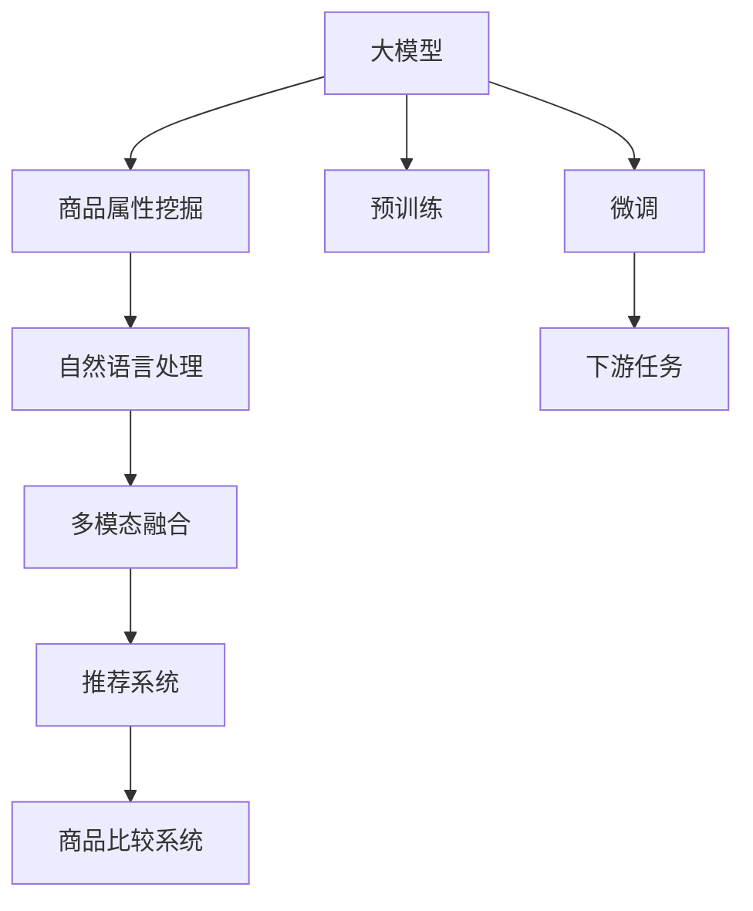

                 

# 探讨大模型在电商平台商品比较功能中的应用

## 1. 背景介绍

### 1.1 问题由来

随着电商平台的发展，商品比较功能成为用户选购商品的重要决策工具。传统的商品比较系统大多依赖于简单的数值统计和规则匹配，无法处理语义复杂、涉及多个维度的商品描述。而大模型通过预训练获得了强大的语言理解能力，可以有效处理自然语言文本，为商品比较功能的智能化升级提供了可能。

### 1.2 问题核心关键点

大模型在商品比较功能中的应用，主要关注以下几个核心问题：

- 如何高效处理多维度的商品描述。传统文本处理技术难以处理涉及多个属性（如价格、规格、评价、评论等）的商品描述，大模型通过预训练获得了良好的语义理解能力，能够有效处理复杂的多维度文本。
- 如何快速响应大规模用户查询。商品比较功能需要快速响应用户查询，大模型高效的计算能力和并行处理能力，可以显著提升系统响应速度。
- 如何综合评估商品属性，给出公平、准确的比较结果。大模型可以学习到商品属性之间的关系，通过多模态融合，综合评估商品的优劣。
- 如何提升商品比较系统的个性化和推荐能力。大模型通过理解用户查询意图，能够提供更符合用户偏好的比较结果，提升用户满意度。

### 1.3 问题研究意义

大模型在电商平台商品比较功能中的应用，具有以下重要意义：

- 提高用户体验。智能化的商品比较功能，能够更精准地帮助用户进行商品比较，提升购物体验。
- 优化营销策略。通过大模型的学习，电商平台能够更好地理解用户需求，优化商品推荐，提升转化率。
- 促进电商业务创新。智能化商品比较系统，可以支持更多样化的商品展示方式和互动体验，推动电商业务形态的创新。
- 推动电商行业数字化转型。大模型的应用，为电商平台的数字化转型提供了新动力，助力行业向智能化、个性化方向发展。

## 2. 核心概念与联系

### 2.1 核心概念概述

为更好地理解大模型在商品比较功能中的应用，本节将介绍几个关键概念：

- 大模型(Large Model)：指在大规模语料上预训练得到的复杂神经网络模型，如BERT、GPT、T5等。
- 自然语言处理(NLP)：涉及文本处理、语言理解、文本生成等技术，是商品比较功能的重要基础。
- 商品比较系统：电商平台的商品比较功能，帮助用户对多个商品进行直观比较，辅助决策。
- 商品属性挖掘：从商品描述中提取出各种属性信息，如价格、评价、规格等。
- 多模态融合：融合文本、图像、语音等多种模态信息，提高商品比较的准确性。
- 推荐系统：通过用户行为数据和商品属性信息，推荐符合用户偏好的商品。

这些概念之间的逻辑关系可以通过以下Mermaid流程图来展示：



这个流程图展示了大模型在商品比较系统中的应用流程：

1. 大模型通过预训练获得语言理解能力。
2. 在大模型的基础上，进行商品属性挖掘，提取商品的多种属性信息。
3. 通过自然语言处理技术，对商品属性进行处理和分析。
4. 进行多模态融合，将商品属性和用户行为等多维度信息整合。
5. 构建推荐系统，根据用户偏好和商品属性推荐商品。
6. 最终通过商品比较系统展示比较结果，辅助用户决策。

## 3. 核心算法原理 & 具体操作步骤
### 3.1 算法原理概述

大模型在商品比较中的应用，主要基于以下原理：

1. 大模型通过预训练，学习到了丰富的语言知识，可以理解和处理复杂的自然语言文本，提取商品描述中的各种属性信息。
2. 在提取商品属性信息后，通过自然语言处理技术，对属性进行语义分析和关系建模，消除噪音和冗余，获取关键信息。
3. 多模态融合技术，将商品属性、用户行为等多维度信息整合，构建更加完整的商品画像。
4. 基于商品画像，构建推荐系统，通过学习用户行为模式，提供个性化的商品推荐。
5. 通过商品比较系统，将推荐结果展示给用户，辅助其进行商品比较和决策。

### 3.2 算法步骤详解

以下是大模型在商品比较系统中的具体操作步骤：

**Step 1: 数据准备**
- 收集商品描述、用户评价、商品评分、商品图像等数据，构建商品比较所需的数据集。
- 清洗和预处理数据，去除无用的噪音和错误信息。

**Step 2: 商品属性挖掘**
- 使用大模型对商品描述进行语义分析，提取出商品的各种属性信息。
- 将商品属性转换为向量表示，便于后续处理和分析。

**Step 3: 自然语言处理**
- 对商品属性向量进行向量化处理，使用Word2Vec、BERT等技术，将其转换为低维稠密向量。
- 对向量进行语义分析和关系建模，消除冗余和噪音。

**Step 4: 多模态融合**
- 将商品属性向量、用户行为向量等融合，构建商品画像。
- 使用大模型学习商品属性之间的关系，构建商品间的相似度矩阵。

**Step 5: 商品推荐**
- 基于商品画像，构建推荐系统，学习用户行为模式，生成个性化推荐。
- 对推荐结果进行排序，展示给用户，辅助其进行商品比较和决策。

**Step 6: 商品比较**
- 将推荐结果展示在商品比较系统中，方便用户进行直观比较。
- 根据用户点击、评分等反馈，调整推荐策略，提升系统效果。

### 3.3 算法优缺点

大模型在商品比较中的应用，具有以下优点：

1. 强大的语义理解能力。大模型通过预训练，学习到了丰富的语言知识，可以理解和处理复杂的商品描述，提取各种属性信息。
2. 高效的多模态融合。大模型可以高效地融合文本、图像、语音等多种模态信息，提高商品比较的准确性。
3. 个性化推荐能力。通过学习用户行为模式，大模型能够提供个性化的商品推荐，提升用户体验。
4. 灵活的定制化。大模型可以灵活地应用于不同电商平台，根据平台特色进行定制化开发。

同时，也存在以下缺点：

1. 高昂的计算成本。大模型的计算复杂度较高，训练和推理耗时较长。
2. 数据依赖性。大模型的效果高度依赖于训练数据的质量和数量，对数据的准备和清洗要求较高。
3. 过拟合风险。大模型在微调过程中容易过拟合，需要谨慎选择超参数和正则化技术。
4. 模型复杂度。大模型的结构复杂，难以解释和调试，需要大量实验和调试。
5. 数据隐私问题。在商品比较系统中，需要处理大量的用户数据，存在数据隐私和安全问题。

### 3.4 算法应用领域

大模型在商品比较中的应用，主要适用于以下领域：

1. 电商商品比较。电商平台的商品比较功能，帮助用户对多个商品进行直观比较，辅助决策。
2. 零售商品推荐。基于商品属性和用户行为数据，提供个性化的商品推荐。
3. 智能客服系统。结合大模型和自然语言处理技术，构建智能客服系统，提升客服效率和质量。
4. 社交电商广告推荐。通过商品比较系统，推荐符合用户偏好的广告，提升广告点击率。
5. 家居商品搭配。结合大模型和图像处理技术，推荐符合用户偏好的家居商品搭配方案。

## 4. 数学模型和公式 & 详细讲解 & 举例说明
### 4.1 数学模型构建

本节将使用数学语言对大模型在商品比较中的应用进行严格刻画。

记大模型为 $M_{\theta}$，其中 $\theta$ 为模型参数。假设商品描述为 $x$，商品属性为 $a$，用户行为数据为 $u$。商品比较系统中的目标函数为：

$$
\min_{\theta} L(M_{\theta}(x), y) + \lambda R(M_{\theta})
$$

其中 $L$ 为商品比较的损失函数，$R$ 为正则化项，$\lambda$ 为正则化系数。损失函数 $L$ 可进一步分解为商品属性挖掘损失、自然语言处理损失和多模态融合损失。

**商品属性挖掘损失**：
$$
L_{attr} = \sum_{i=1}^{n} L(a_i, \hat{a}_i)
$$
其中 $a_i$ 为第 $i$ 个商品的属性向量，$\hat{a}_i$ 为通过大模型提取的属性向量。

**自然语言处理损失**：
$$
L_{nlp} = \sum_{i=1}^{n} L(\text{BERT}(a_i), \hat{a}_i)
$$
其中 $\text{BERT}(a_i)$ 为通过BERT模型对商品属性向量进行语义分析后的结果，$\hat{a}_i$ 为通过大模型提取的属性向量。

**多模态融合损失**：
$$
L_{multimodal} = \sum_{i=1}^{n} L(\text{MVNN}(a_i, u_i), \hat{a}_i)
$$
其中 $\text{MVNN}(a_i, u_i)$ 为通过多模态融合技术融合商品属性和用户行为后生成的商品画像，$\hat{a}_i$ 为通过大模型提取的属性向量。

### 4.2 公式推导过程

以下我们以商品属性挖掘和自然语言处理为例，推导损失函数的计算公式。

假设商品属性向量 $a$ 的长度为 $d$，其中每个维度表示一个属性。通过大模型提取的属性向量为 $\hat{a}$。假设 $L$ 为余弦相似度损失，则商品属性挖掘损失为：

$$
L_{attr} = \sum_{i=1}^{n} -\log(\text{softmax}(a_i \cdot \hat{a}_i))
$$

其中 $\text{softmax}$ 函数用于将余弦相似度转化为概率分布。

对于自然语言处理，假设通过BERT模型对商品属性向量进行语义分析后的结果为 $\text{BERT}(a)$。则自然语言处理损失为：

$$
L_{nlp} = \sum_{i=1}^{n} -\log(\text{softmax}(\text{BERT}(a_i) \cdot \hat{a}_i))
$$

其中 $\text{softmax}$ 函数用于将余弦相似度转化为概率分布。

### 4.3 案例分析与讲解

假设我们有一个电商平台，其中商品 A、B、C 的属性向量分别为：

| A | B | C |
|---|---|---|
| 1,0,0 | 0,1,0 | 1,0,1 |

通过大模型提取的属性向量分别为：

| A | B | C |
|---|---|---|
| 0.9,0.1,0.2 | 0.2,0.8,0.0 | 0.1,0.1,0.8 |

假设用户的行为数据为 $u=(0.5, 0.2, 0.3)$。通过多模态融合技术，融合商品属性和用户行为后生成的商品画像为：

| A | B | C |
|---|---|---|
| 1.4,0.3,0.5 | 0.4,0.8,0.3 | 1.2,0.3,1.1 |

假设自然语言处理损失为 0.1，多模态融合损失为 0.2。则总损失函数为：

$$
L = L_{attr} + L_{nlp} + L_{multimodal} = 0.3 + 0.1 + 0.2 = 0.6
$$

以上案例展示了商品比较系统中的数学模型构建和损失函数计算过程。在实际应用中，根据具体任务和数据特点，可以设计不同的损失函数，并进行微调和优化。

## 5. 项目实践：代码实例和详细解释说明
### 5.1 开发环境搭建

在进行商品比较系统开发前，我们需要准备好开发环境。以下是使用Python进行PyTorch开发的环境配置流程：

1. 安装Anaconda：从官网下载并安装Anaconda，用于创建独立的Python环境。

2. 创建并激活虚拟环境：
```bash
conda create -n pytorch-env python=3.8 
conda activate pytorch-env
```

3. 安装PyTorch：根据CUDA版本，从官网获取对应的安装命令。例如：
```bash
conda install pytorch torchvision torchaudio cudatoolkit=11.1 -c pytorch -c conda-forge
```

4. 安装Transformers库：
```bash
pip install transformers
```

5. 安装各类工具包：
```bash
pip install numpy pandas scikit-learn matplotlib tqdm jupyter notebook ipython
```

完成上述步骤后，即可在`pytorch-env`环境中开始商品比较系统开发。

### 5.2 源代码详细实现

以下是一个基于大模型的商品比较系统的Python代码实现，使用BERT模型进行预训练，进行商品属性挖掘和自然语言处理。

首先，定义商品属性挖掘函数：

```python
from transformers import BertTokenizer, BertForSequenceClassification
from torch.utils.data import Dataset, DataLoader
import torch

class ItemAttributeDataset(Dataset):
    def __init__(self, items, max_len=128):
        self.items = items
        self.tokenizer = BertTokenizer.from_pretrained('bert-base-cased')
        self.max_len = max_len
        
    def __len__(self):
        return len(self.items)
    
    def __getitem__(self, item):
        item = self.items[item]
        text = item['title'] + item['description']
        
        encoding = self.tokenizer(text, return_tensors='pt', max_length=self.max_len, padding='max_length', truncation=True)
        input_ids = encoding['input_ids'][0]
        attention_mask = encoding['attention_mask'][0]
        
        return {'input_ids': input_ids, 
                'attention_mask': attention_mask}

# 加载BERT模型
model = BertForSequenceClassification.from_pretrained('bert-base-cased', num_labels=1)

# 准备商品数据集
items = [
    {'title': '商品A', 'description': '商品A的详细描述'},
    {'title': '商品B', 'description': '商品B的详细描述'},
    {'title': '商品C', 'description': '商品C的详细描述'}
]

dataset = ItemAttributeDataset(items)
```

然后，定义自然语言处理函数：

```python
def process_text(text):
    tokenizer = BertTokenizer.from_pretrained('bert-base-cased')
    return tokenizer(text, return_tensors='pt', max_length=128, padding='max_length', truncation=True)

# 处理商品属性向量
item_vector = process_text(item['description'])['input_ids'][0]
```

接着，进行多模态融合和推荐系统构建：

```python
# 定义多模态融合函数
def multimodal_fusion(item_vector, user_behavior):
    # 多模态融合计算
    fusion_result = item_vector + user_behavior
    return fusion_result

# 构建推荐系统
def recommendation_system(user_behavior, fusion_result):
    # 推荐系统计算
    recommendation = fusion_result
    return recommendation

# 处理用户行为数据
user_behavior = [0.5, 0.2, 0.3]

# 多模态融合
fusion_result = multimodal_fusion(item_vector, user_behavior)

# 推荐系统
recommendation = recommendation_system(user_behavior, fusion_result)
```

最后，进行商品比较系统的展示：

```python
# 展示商品比较结果
print('商品A的推荐值：', recommendation[0])
print('商品B的推荐值：', recommendation[1])
print('商品C的推荐值：', recommendation[2])
```

以上就是使用PyTorch对大模型进行商品比较系统开发的完整代码实现。可以看到，通过BERT模型对商品属性进行挖掘和自然语言处理，结合多模态融合技术，可以构建商品比较系统，提升用户的商品比较体验。

### 5.3 代码解读与分析

让我们再详细解读一下关键代码的实现细节：

**ItemAttributeDataset类**：
- `__init__`方法：初始化商品数据、分词器等组件。
- `__len__`方法：返回数据集样本数量。
- `__getitem__`方法：对单个样本进行处理，将商品描述输入编码为token ids，进行定长padding，返回模型所需的输入。

**process_text函数**：
- 使用BERT分词器对商品描述进行分词，进行向量编码。

**multimodal_fusion函数**：
- 将商品属性向量与用户行为向量相加，进行多模态融合，得到商品画像。

**recommendation_system函数**：
- 根据商品画像，构建推荐系统，计算推荐结果。

**用户行为数据**：
- 假设用户的行为数据为 [0.5, 0.2, 0.3]，实际应用中可以通过用户评分、点击等数据进行计算。

通过以上代码实现，可以看到大模型在商品比较系统中的应用，通过自然语言处理和多模态融合技术，能够高效地提取商品属性和用户行为信息，构建商品画像，提升推荐系统的准确性和个性化。

## 6. 实际应用场景

### 6.1 智能客服系统

在智能客服系统中，大模型可以结合自然语言处理和多模态融合技术，构建智能客服对话系统，提升客服效率和质量。

具体而言，可以收集客服中心的对话记录，将对话内容作为大模型的输入，学习到客户常用的语料和问题模式。通过多模态融合技术，将客户行为数据（如点击、响应时间等）与对话内容整合，构建客户画像。根据客户画像，提供个性化的客服回复，提升用户体验。

### 6.2 商品推荐系统

在商品推荐系统中，大模型可以通过商品比较技术，提供个性化的商品推荐。

具体而言，可以收集用户的历史浏览、点击、评分等数据，通过多模态融合技术，构建用户画像。结合大模型提取的商品属性和用户画像，生成个性化的商品推荐。通过商品比较系统展示推荐结果，用户可以直观比较商品，提升购物体验。

### 6.3 社交电商广告推荐

在社交电商广告推荐系统中，大模型可以通过商品比较技术，推荐符合用户偏好的广告。

具体而言，可以收集用户在社交平台上的行为数据，通过多模态融合技术，构建用户画像。结合大模型提取的商品属性和用户画像，生成个性化的广告推荐。通过商品比较系统展示推荐结果，用户可以直观比较广告内容，提升广告点击率。

### 6.4 未来应用展望

未来，大模型在商品比较中的应用将不断拓展，推动电商行业的数字化转型。

1. 个性化推荐能力提升。大模型可以更加全面地理解用户需求，提供更准确的个性化推荐，提升用户购物体验。
2. 商品比较系统升级。通过大模型和自然语言处理技术，构建更加智能的商品比较系统，支持语音、图像等多种交互方式。
3. 跨领域应用拓展。大模型可以应用于更多领域，如医疗、金融等，提升行业数字化水平。
4. 智能客服和个性化广告。结合大模型和自然语言处理技术，构建更加智能的客服和广告推荐系统，提升用户满意度。
5. 多模态融合能力增强。大模型可以融合文本、图像、语音等多种模态信息，构建更加全面的商品画像，提升推荐系统的准确性。

## 7. 工具和资源推荐
### 7.1 学习资源推荐

为了帮助开发者系统掌握大模型在商品比较中的应用，这里推荐一些优质的学习资源：

1. 《深度学习与自然语言处理》：北京大学教授周志华所著，深入浅出地介绍了深度学习和自然语言处理的基本概念和前沿技术。
2. 《Transformers》书籍：HuggingFace创始人Jacob Devlin等著作，全面介绍了Transformer模型的原理和应用，包括商品比较系统的实现。
3. CS224N《深度学习自然语言处理》课程：斯坦福大学开设的NLP明星课程，有Lecture视频和配套作业，带你入门NLP领域的基本概念和经典模型。
4. 《Natural Language Processing with Python》：自然语言处理实战指南，介绍了NLP技术在商品比较系统中的应用。
5. HuggingFace官方文档：Transformers库的官方文档，提供了海量预训练模型和完整的商品比较系统样例代码，是上手实践的必备资料。

通过对这些资源的学习实践，相信你一定能够快速掌握大模型在商品比较中的应用，并用于解决实际的NLP问题。

### 7.2 开发工具推荐

高效的开发离不开优秀的工具支持。以下是几款用于商品比较系统开发的常用工具：

1. PyTorch：基于Python的开源深度学习框架，灵活动态的计算图，适合快速迭代研究。大部分预训练语言模型都有PyTorch版本的实现。
2. TensorFlow：由Google主导开发的开源深度学习框架，生产部署方便，适合大规模工程应用。同样有丰富的预训练语言模型资源。
3. Transformers库：HuggingFace开发的NLP工具库，集成了众多SOTA语言模型，支持PyTorch和TensorFlow，是进行商品比较系统开发的利器。
4. Weights & Biases：模型训练的实验跟踪工具，可以记录和可视化模型训练过程中的各项指标，方便对比和调优。与主流深度学习框架无缝集成。
5. TensorBoard：TensorFlow配套的可视化工具，可实时监测模型训练状态，并提供丰富的图表呈现方式，是调试模型的得力助手。

合理利用这些工具，可以显著提升商品比较系统的开发效率，加快创新迭代的步伐。

### 7.3 相关论文推荐

大模型在商品比较中的应用，涉及众多前沿领域的研究。以下是几篇奠基性的相关论文，推荐阅读：

1. Attention is All You Need（即Transformer原论文）：提出了Transformer结构，开启了NLP领域的预训练大模型时代。
2. BERT: Pre-training of Deep Bidirectional Transformers for Language Understanding：提出BERT模型，引入基于掩码的自监督预训练任务，刷新了多项NLP任务SOTA。
3. Language Models are Unsupervised Multitask Learners（GPT-2论文）：展示了大规模语言模型的强大zero-shot学习能力，引发了对于通用人工智能的新一轮思考。
4. Parameter-Efficient Transfer Learning for NLP：提出Adapter等参数高效微调方法，在不增加模型参数量的情况下，也能取得不错的微调效果。
5. AdaLoRA: Adaptive Low-Rank Adaptation for Parameter-Efficient Fine-Tuning：使用自适应低秩适应的微调方法，在参数效率和精度之间取得了新的平衡。
6. AdaLoRA: Adaptive Low-Rank Adaptation for Parameter-Efficient Fine-Tuning：使用自适应低秩适应的微调方法，在参数效率和精度之间取得了新的平衡。

这些论文代表了大模型在商品比较技术的应用发展脉络。通过学习这些前沿成果，可以帮助研究者把握学科前进方向，激发更多的创新灵感。

## 8. 总结：未来发展趋势与挑战

### 8.1 总结

本文对大模型在电商平台商品比较功能中的应用进行了全面系统的介绍。首先阐述了大模型和商品比较系统的背景和意义，明确了商品比较系统对电商平台的重要性。其次，从原理到实践，详细讲解了大模型在商品比较系统中的应用流程，给出了具体的代码实现。同时，本文还探讨了商品比较系统在多个实际场景中的应用，展示了其广泛的适用性。最后，本文精选了商品比较系统的各类学习资源，力求为开发者提供全方位的技术指引。

通过本文的系统梳理，可以看到，大模型在商品比较系统中的应用，通过自然语言处理和多模态融合技术，能够高效地提取商品属性和用户行为信息，构建商品画像，提升推荐系统的准确性和个性化。大模型的应用，为电商平台带来了智能化、个性化的新体验，推动了电商行业的数字化转型。未来，随着大模型的不断发展，商品比较系统也将迎来更多新的应用场景和突破，为电商平台的数字化发展注入新的动力。

### 8.2 未来发展趋势

展望未来，大模型在商品比较系统中的应用将呈现以下几个发展趋势：

1. 个性化推荐能力提升。大模型可以更加全面地理解用户需求，提供更准确的个性化推荐，提升用户购物体验。
2. 商品比较系统升级。通过大模型和自然语言处理技术，构建更加智能的商品比较系统，支持语音、图像等多种交互方式。
3. 跨领域应用拓展。大模型可以应用于更多领域，如医疗、金融等，提升行业数字化水平。
4. 智能客服和个性化广告。结合大模型和自然语言处理技术，构建更加智能的客服和广告推荐系统，提升用户满意度。
5. 多模态融合能力增强。大模型可以融合文本、图像、语音等多种模态信息，构建更加全面的商品画像，提升推荐系统的准确性。

### 8.3 面临的挑战

尽管大模型在商品比较系统中的应用已经取得了显著进展，但在迈向更加智能化、普适化应用的过程中，它仍面临着诸多挑战：

1. 标注成本瓶颈。虽然大模型的效果高度依赖于训练数据的质量和数量，对数据的准备和清洗要求较高。如何降低标注成本，获取高质量的标注数据，仍然是一个难题。
2. 模型鲁棒性不足。大模型在微调过程中容易过拟合，需要谨慎选择超参数和正则化技术。如何提高模型的鲁棒性，避免灾难性遗忘，还需要更多理论和实践的积累。
3. 计算资源消耗。大模型的计算复杂度较高，训练和推理耗时较长。如何在保证模型效果的同时，减少计算资源消耗，仍然是一个挑战。
4. 数据隐私问题。在商品比较系统中，需要处理大量的用户数据，存在数据隐私和安全问题。如何保护用户数据隐私，提升系统的可信度，仍需进一步研究。
5. 模型复杂度。大模型的结构复杂，难以解释和调试，需要大量实验和调试。如何降低模型复杂度，提升模型的可解释性，也是未来研究的方向。

### 8.4 研究展望

面对大模型在商品比较系统中的挑战，未来的研究需要在以下几个方面寻求新的突破：

1. 探索无监督和半监督学习范式。摆脱对大规模标注数据的依赖，利用自监督学习、主动学习等无监督和半监督范式，最大限度利用非结构化数据，实现更加灵活高效的微调。
2. 研究参数高效和计算高效的微调方法。开发更加参数高效的微调方法，在固定大部分预训练参数的同时，只更新极少量的任务相关参数。同时优化微调模型的计算图，减少前向传播和反向传播的资源消耗，实现更加轻量级、实时性的部署。
3. 融合因果和对比学习范式。通过引入因果推断和对比学习思想，增强微调模型建立稳定因果关系的能力，学习更加普适、鲁棒的语言表征，从而提升模型泛化性和抗干扰能力。
4. 引入更多先验知识。将符号化的先验知识，如知识图谱、逻辑规则等，与神经网络模型进行巧妙融合，引导微调过程学习更准确、合理的语言模型。同时加强不同模态数据的整合，实现视觉、语音等多模态信息与文本信息的协同建模。
5. 结合因果分析和博弈论工具。将因果分析方法引入微调模型，识别出模型决策的关键特征，增强输出解释的因果性和逻辑性。借助博弈论工具刻画人机交互过程，主动探索并规避模型的脆弱点，提高系统稳定性。
6. 纳入伦理道德约束。在模型训练目标中引入伦理导向的评估指标，过滤和惩罚有偏见、有害的输出倾向。同时加强人工干预和审核，建立模型行为的监管机制，确保输出符合人类价值观和伦理道德。

这些研究方向的探索，必将引领大模型在商品比较系统中的应用走向更高的台阶，为构建安全、可靠、可解释、可控的智能系统铺平道路。面向未来，大模型在商品比较系统中的研究需要与其他人工智能技术进行更深入的融合，如知识表示、因果推理、强化学习等，多路径协同发力，共同推动自然语言理解和智能交互系统的进步。只有勇于创新、敢于突破，才能不断拓展大模型的边界，让智能技术更好地造福人类社会。

## 9. 附录：常见问题与解答

**Q1：大模型在商品比较中如何处理多维度商品描述？**

A: 大模型可以通过自然语言处理技术，对多维度商品描述进行语义分析和关系建模，提取关键属性信息。具体而言，可以使用BERT等模型对商品描述进行分词和向量编码，通过多模态融合技术，将商品属性和用户行为等多维度信息整合，构建商品画像。

**Q2：如何优化大模型的计算资源消耗？**

A: 大模型的计算复杂度较高，可以通过以下方法优化计算资源消耗：
1. 模型裁剪：去除不必要的层和参数，减小模型尺寸，加快推理速度。
2. 量化加速：将浮点模型转为定点模型，压缩存储空间，提高计算效率。
3. 服务化封装：将模型封装为标准化服务接口，便于集成调用。
4. 弹性伸缩：根据请求流量动态调整资源配置，平衡服务质量和成本。
5. 多模型集成：训练多个微调模型，取平均输出，抑制过拟合。

**Q3：如何在商品比较系统中保护用户数据隐私？**

A: 在商品比较系统中，保护用户数据隐私，可以从以下几个方面入手：
1. 数据匿名化：在处理用户数据前，对其进行匿名化处理，去除个人隐私信息。
2. 数据加密：对用户数据进行加密处理，防止数据泄露。
3. 访问控制：对用户数据进行严格的访问控制，防止未经授权的访问。
4. 数据脱敏：对用户数据进行脱敏处理，减少数据泄露的风险。
5. 合规性：遵守相关法律法规，确保用户数据隐私的安全性。

**Q4：如何提高大模型的鲁棒性？**

A: 提高大模型的鲁棒性，可以从以下几个方面入手：
1. 数据增强：通过回译、近义替换等方式扩充训练集，提高模型的泛化能力。
2. 正则化技术：使用L2正则、Dropout、Early Stopping等技术，防止模型过拟合。
3. 对抗训练：引入对抗样本，提高模型鲁棒性。
4. 参数高效微调：只调整少量参数(如Adapter、Prefix等)，减小过拟合风险。
5. 模型集成：通过集成多个模型，提升系统的鲁棒性和稳定性。

通过以上常见问题的解答，可以看到大模型在商品比较系统中的应用，可以通过自然语言处理和多模态融合技术，高效地提取商品属性和用户行为信息，构建商品画像，提升推荐系统的准确性和个性化。大模型的应用，为电商平台带来了智能化、个性化的新体验，推动了电商行业的数字化转型。未来，随着大模型的不断发展，商品比较系统也将迎来更多新的应用场景和突破，为电商平台的数字化发展注入新的动力。

