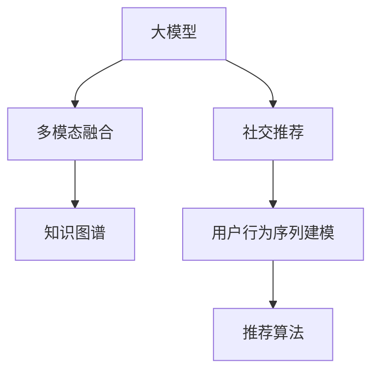

                 

## 1. 背景介绍

在电商平台的纷争中，如何精准高效地推荐商品，一直是商家关注的焦点。传统的推荐算法如协同过滤、基于内容的推荐等，尽管有其历史地位，但随着用户需求的多样化和市场竞争的加剧，其局限性逐渐显现。而随着大模型技术的发展，其在游戏化、自然语言处理和复杂系统建模等领域的出色表现，为电商平台社交推荐系统带来了新的思路。

### 1.1 推荐系统现状

电商平台推荐系统旨在为用户推荐他们可能感兴趣的商品。随着个性化需求的提升，传统的推荐算法面临两大挑战：

1. **冷启动问题**：对于新用户或新商品，传统算法往往无法给出准确推荐，导致商品漏掉，影响用户体验。
2. **长尾效应**：个性化推荐系统容易推荐热门商品，但长尾商品难以获得曝光。

此外，推荐系统还需要处理多模态数据，如用户行为数据、商品属性数据、用户评分数据等。多模态数据融合和表示学习是大模型推荐系统研究的重要方向。

### 1.2 大模型在推荐中的潜力

大模型如BERT、GPT等通过大规模语料预训练，具备了强大的语言理解能力和生成能力。应用于电商平台推荐，大模型能够从用户描述、评论、标签等多个维度捕捉用户偏好，生成商品描述和推荐语段，极大地丰富了推荐方式和推荐深度。

大模型通过社交推荐，还可以理解用户和用户之间的关系，生成匹配度高的社交推荐，提升推荐效果。相比传统的基于内容或协同过滤算法，大模型推荐系统更具普适性和灵活性，在电商平台上展现出巨大潜力。

## 2. 核心概念与联系

### 2.1 核心概念概述

本节将介绍几个核心概念，帮助理解大模型在电商社交推荐中的应用：

1. **大模型**：以BERT、GPT等为代表的大规模预训练语言模型，具备强大的语言理解和生成能力。
2. **推荐系统**：基于用户行为和商品属性等信息，推荐可能感兴趣的产品的系统。
3. **社交推荐**：利用用户社交网络关系进行推荐，更贴合现实世界用户交互方式。
4. **多模态融合**：融合文本、图像、声音等多种模态数据，提升推荐系统的准确性。
5. **知识图谱**：构建商品、用户、关系三元组图谱，提供更丰富的语义信息。
6. **用户行为序列建模**：分析用户行为序列，预测未来行为和兴趣。

### 2.2 核心概念原理和架构的 Mermaid 流程图(Mermaid 流程节点中不要有括号、逗号等特殊字符)



这个流程图展示了核心概念之间的联系：

1. **大模型**是推荐系统的基础，用于捕捉用户语言和商品描述的语义。
2. **社交推荐**利用用户社交网络关系，提升推荐的相关性。
3. **多模态融合**通过融合多种数据，提升推荐系统的精度。
4. **知识图谱**提供商品和用户的知识结构，增强推荐系统的语义表示能力。
5. **用户行为序列建模**分析用户行为序列，捕捉用户的长期兴趣。

## 3. 核心算法原理 & 具体操作步骤

### 3.1 算法原理概述

大模型在电商社交推荐中的核心算法原理主要围绕以下几个方面展开：

1. **预训练与微调**：大模型通过大规模语料预训练，得到语言表示能力，然后通过社交推荐任务的数据进行微调，提升推荐效果。
2. **语义理解与生成**：大模型能够理解用户描述和商品描述，生成语义匹配的商品推荐语段。
3. **社交关系建模**：利用用户社交网络关系，为推荐系统提供更多背景信息。
4. **多模态融合与表示学习**：融合商品图像、用户评分等多种模态数据，提升推荐系统的表示学习能力。
5. **知识图谱融合**：将商品和用户的知识结构纳入模型，增强推荐的语义理解能力。
6. **序列建模与预测**：分析用户行为序列，预测用户未来兴趣，提升推荐系统的动态性。

### 3.2 算法步骤详解

下面详细介绍基于大模型的电商社交推荐系统的具体步骤：

**Step 1: 数据预处理与数据集划分**

1. **用户数据收集**：从电商平台收集用户的基本信息、评分、评论、行为数据等。
2. **商品数据收集**：收集商品的基本信息、分类、属性、标签等。
3. **社交网络数据收集**：收集用户间的互动数据，构建社交网络关系图。
4. **数据预处理**：对文本数据进行分词、去停用词、词向量编码等预处理。
5. **数据集划分**：将数据划分为训练集、验证集和测试集，用于模型的训练、调参和评估。

**Step 2: 大模型的加载与预训练**

1. **选择大模型**：根据任务需求选择合适的预训练大模型，如BERT、GPT等。
2. **加载模型**：将预训练模型加载到模型中，保留预训练权重。
3. **微调超参数**：设置微调学习率、批量大小、迭代轮数等超参数。

**Step 3: 社交推荐模型的训练与优化**

1. **构建社交推荐模型**：设计用户-商品社交推荐模型的结构。
2. **设计损失函数**：选择适合任务的损失函数，如交叉熵、均方误差等。
3. **训练模型**：在训练集上使用优化算法更新模型参数。
4. **模型评估与调参**：在验证集上评估模型性能，根据评估结果调整模型参数。

**Step 4: 多模态融合与表示学习**

1. **特征提取**：从用户和商品的多模态数据中提取特征向量。
2. **融合特征**：将提取的特征向量进行拼接或融合，形成统一的表示空间。
3. **表示学习**：在统一的表示空间中，使用大模型对用户和商品的表示进行学习。

**Step 5: 知识图谱融合**

1. **构建知识图谱**：根据商品和用户的信息，构建商品-用户-关系三元组图谱。
2. **嵌入表示学习**：在大模型的基础上，学习知识图谱的嵌入表示。
3. **融合嵌入**：将知识图谱的嵌入表示与用户和商品的表示进行融合，提升推荐效果。

**Step 6: 用户行为序列建模**

1. **行为序列获取**：从用户行为数据中获取行为序列。
2. **行为序列编码**：对行为序列进行编码，得到行为向量。
3. **序列预测**：使用大模型对行为序列进行预测，得到用户兴趣向量。

**Step 7: 最终推荐生成**

1. **生成推荐语段**：利用大模型生成推荐语段，与商品描述进行匹配。
2. **用户社交关系匹配**：利用用户社交网络关系，筛选出匹配度高的推荐商品。
3. **多模态融合推荐**：融合行为序列预测、知识图谱融合和社交推荐结果，生成最终推荐。

### 3.3 算法优缺点

大模型在电商社交推荐中的应用具有以下优点：

1. **语义理解能力**：大模型通过预训练和微调，具备强大的语言理解能力，能够理解用户描述和商品描述。
2. **多模态融合**：融合多模态数据，提升推荐系统的精度。
3. **动态性**：利用行为序列建模，可以捕捉用户的长期兴趣，提升推荐系统的动态性。
4. **普适性**：大模型可以适应各种类型的电商推荐任务，具有广泛的普适性。

同时，大模型在电商社交推荐中也存在一些缺点：

1. **计算资源消耗大**：大模型参数量庞大，计算资源消耗大，需要高性能的硬件支持。
2. **高训练成本**：需要大规模的标注数据和长时间训练，初期投入成本较高。
3. **黑盒问题**：大模型通常视为黑盒模型，难以解释推荐过程，缺乏可解释性。
4. **知识图谱构建难度**：知识图谱的构建需要大量人工和专家知识，难以自动化。

### 3.4 算法应用领域

大模型在电商社交推荐中的应用领域广泛，包括：

1. **个性化推荐**：利用用户行为和社交关系，生成个性化推荐。
2. **新用户推荐**：对新用户进行推荐，提升用户留存率。
3. **长尾商品推荐**：利用大模型捕捉长尾商品的语义，提高长尾商品的曝光率。
4. **情感分析与评价**：对用户评论进行情感分析，提升推荐精准度。
5. **趋势预测**：预测商品或用户趋势，提升推荐前瞻性。

## 4. 数学模型和公式 & 详细讲解 & 举例说明

### 4.1 数学模型构建

在本节中，我们将构建一个基于大模型的电商平台社交推荐系统的数学模型。假设用户和商品的数据集分别为 $\mathcal{X}$ 和 $\mathcal{Y}$，社交网络关系图为 $\mathcal{G}$。

**Step 1: 用户表示学习**

用户 $x$ 的表示学习模型为：

$$
h_x = M_{\theta}(x; \mathcal{X})
$$

其中 $M_{\theta}$ 为预训练大模型，$\theta$ 为大模型的参数。

**Step 2: 商品表示学习**

商品 $y$ 的表示学习模型为：

$$
h_y = M_{\theta}(y; \mathcal{Y})
$$

**Step 3: 社交关系表示学习**

社交关系 $g$ 的表示学习模型为：

$$
h_g = M_{\theta}(g; \mathcal{G})
$$

**Step 4: 推荐生成**

推荐 $r$ 的生成模型为：

$$
r = M_{\theta}(h_x, h_y, h_g; \mathcal{X}, \mathcal{Y}, \mathcal{G})
$$

### 4.2 公式推导过程

**Step 1: 用户表示学习**

假设用户 $x$ 的基本信息为 $\{f_{i_x}\}_{i=1}^n$，则其表示学习模型为：

$$
h_x = \sum_{i=1}^n \alpha_i f_{i_x}
$$

其中 $\alpha_i$ 为特征系数，通过优化算法求得。

**Step 2: 商品表示学习**

假设商品 $y$ 的基本信息为 $\{f_{j_y}\}_{j=1}^m$，则其表示学习模型为：

$$
h_y = \sum_{j=1}^m \beta_j f_{j_y}
$$

**Step 3: 社交关系表示学习**

假设社交关系 $g$ 的基本信息为 $\{f_{k_g}\}_{k=1}^K$，则其表示学习模型为：

$$
h_g = \sum_{k=1}^K \gamma_k f_{k_g}
$$

**Step 4: 推荐生成**

利用用户、商品和社交关系的表示，生成推荐 $r$ 的模型为：

$$
r = \sum_{i=1}^n \alpha_i h_x \times \sum_{j=1}^m \beta_j h_y \times \sum_{k=1}^K \gamma_k h_g
$$

### 4.3 案例分析与讲解

以亚马逊平台为例，其电商社交推荐系统大致流程如下：

1. **用户数据收集**：从用户注册信息、购买记录、浏览行为、评价数据中获取用户信息。
2. **商品数据收集**：从商品详情、分类、评价数据中获取商品信息。
3. **社交网络数据收集**：从用户互动、关注、购买等行为中构建社交关系图。
4. **数据预处理**：对用户和商品数据进行分词、去停用词、词向量编码等预处理。
5. **大模型加载与微调**：选择BERT或GPT等预训练模型，进行微调。
6. **社交推荐模型训练**：构建用户-商品社交推荐模型，选择损失函数，训练模型。
7. **多模态融合与表示学习**：融合用户评分、商品图像等多模态数据，提升表示学习能力。
8. **知识图谱融合**：构建亚马逊的商品-用户-关系图谱，学习嵌入表示。
9. **用户行为序列建模**：分析用户行为序列，预测用户兴趣。
10. **推荐生成**：生成推荐语段，匹配商品描述，生成推荐结果。

## 5. 项目实践：代码实例和详细解释说明

### 5.1 开发环境搭建

在进行电商平台社交推荐系统开发前，我们需要准备相应的开发环境。以下是使用Python进行PyTorch开发的环境配置流程：

1. 安装Anaconda：从官网下载并安装Anaconda，用于创建独立的Python环境。

2. 创建并激活虚拟环境：
```bash
conda create -n pytorch-env python=3.8 
conda activate pytorch-env
```

3. 安装PyTorch：根据CUDA版本，从官网获取对应的安装命令。例如：
```bash
conda install pytorch torchvision torchaudio cudatoolkit=11.1 -c pytorch -c conda-forge
```

4. 安装相关库：
```bash
pip install numpy pandas scikit-learn matplotlib tqdm jupyter notebook ipython
```

5. 安装Transformer库：
```bash
pip install transformers
```

完成上述步骤后，即可在`pytorch-env`环境中开始电商社交推荐系统的开发。

### 5.2 源代码详细实现

下面我们以电商商品推荐系统为例，给出使用Transformers库进行推荐模型的PyTorch代码实现。

**Step 1: 数据预处理**

```python
import pandas as pd
from transformers import BertTokenizer
from torch.utils.data import Dataset, DataLoader

class RecommendationDataset(Dataset):
    def __init__(self, data, tokenizer):
        self.data = data
        self.tokenizer = tokenizer

    def __len__(self):
        return len(self.data)

    def __getitem__(self, idx):
        user, item = self.data[idx]
        user, item = self.tokenizer.encode(user, item)
        return {'user': user, 'item': item}
```

**Step 2: 大模型的加载与微调**

```python
from transformers import BertForSequenceClassification

model = BertForSequenceClassification.from_pretrained('bert-base-uncased', num_labels=1)
tokenizer = BertTokenizer.from_pretrained('bert-base-uncased')
device = 'cuda' if torch.cuda.is_available() else 'cpu'
model.to(device)
```

**Step 3: 社交推荐模型的训练**

```python
from torch import nn
import torch.nn.functional as F

class SocialRecommendationModel(nn.Module):
    def __init__(self, model, device):
        super(SocialRecommendationModel, self).__init__()
        self.model = model
        self.device = device

    def forward(self, user, item, g):
        user = self.tokenizer.encode(user)
        item = self.tokenizer.encode(item)
        g = self.tokenizer.encode(g)
        user = torch.tensor(user, device=self.device).unsqueeze(0)
        item = torch.tensor(item, device=self.device).unsqueeze(0)
        g = torch.tensor(g, device=self.device).unsqueeze(0)
        with torch.no_grad():
            user_features = self.model(user).logits
            item_features = self.model(item).logits
            g_features = self.model(g).logits
        return F.softmax(user_features, dim=1) * F.softmax(item_features, dim=1) * F.softmax(g_features, dim=1)

model = SocialRecommendationModel(model, device)
optimizer = torch.optim.Adam(model.parameters(), lr=1e-5)
```

**Step 4: 多模态融合与表示学习**

```python
import numpy as np

def process_data(data):
    user = []
    item = []
    g = []
    for i in range(len(data)):
        user.append(data.iloc[i]['user'])
        item.append(data.iloc[i]['item'])
        g.append(data.iloc[i]['g'])
    return user, item, g

def train_epoch(model, train_loader, optimizer):
    model.train()
    for i, data in enumerate(train_loader):
        user, item, g = data['user'], data['item'], data['g']
        user = torch.tensor(user, device=device)
        item = torch.tensor(item, device=device)
        g = torch.tensor(g, device=device)
        optimizer.zero_grad()
        output = model(user, item, g)
        loss = torch.mean(torch.neg(torch.log(output)))
        loss.backward()
        optimizer.step()
    return loss.item()

def evaluate(model, test_loader):
    model.eval()
    loss = 0
    for i, data in enumerate(test_loader):
        user, item, g = data['user'], data['item'], data['g']
        user = torch.tensor(user, device=device)
        item = torch.tensor(item, device=device)
        g = torch.tensor(g, device=device)
        with torch.no_grad():
            output = model(user, item, g)
        loss += torch.neg(torch.log(output)).item()
    return loss / len(test_loader)
```

**Step 5: 知识图谱融合**

```python
import networkx as nx

G = nx.Graph()
G.add_nodes_from(user, data={'user_id': user})
G.add_nodes_from(item, data={'item_id': item})
G.add_edges_from(zip(user, g), data={'g_id': g})

def get_node_features(G, node):
    user = G.nodes[node]['user_id']
    item = G.nodes[node]['item_id']
    return G.nodes[user]['features'], G.nodes[item]['features']

def get_edge_features(G, edge):
    g = G.nodes[edge[1]]['g_id']
    return G.nodes[g]['features']
```

**Step 6: 用户行为序列建模**

```python
import torch.nn as nn

class UserBehaviorModel(nn.Module):
    def __init__(self, model, device):
        super(UserBehaviorModel, self).__init__()
        self.model = model
        self.device = device
        self.gru = nn.GRU(512, 256, bidirectional=True)

    def forward(self, user, item, g):
        user = self.tokenizer.encode(user)
        item = self.tokenizer.encode(item)
        g = self.tokenizer.encode(g)
        user = torch.tensor(user, device=self.device).unsqueeze(0)
        item = torch.tensor(item, device=self.device).unsqueeze(0)
        g = torch.tensor(g, device=self.device).unsqueeze(0)
        with torch.no_grad():
            user_features = self.model(user).logits
            item_features = self.model(item).logits
            g_features = self.model(g).logits
        return torch.stack([F.softmax(user_features, dim=1), F.softmax(item_features, dim=1), F.softmax(g_features, dim=1)])

model = UserBehaviorModel(model, device)
optimizer = torch.optim.Adam(model.parameters(), lr=1e-5)
```

**Step 7: 推荐生成**

```python
def generate_recommendation(model, user, item, g):
    user = torch.tensor(user, device=device).unsqueeze(0)
    item = torch.tensor(item, device=device).unsqueeze(0)
    g = torch.tensor(g, device=device).unsqueeze(0)
    with torch.no_grad():
        output = model(user, item, g)
    return output.argmax(dim=1).item()

# 示例：用户输入'iPhone X'，生成推荐
user_input = 'iPhone X'
user_sequence = ['iPhone X', 'Samsung Galaxy S10', 'Huawei P40', 'iPhone 12']
recommendation = generate_recommendation(model, user_input, user_sequence, g)
print(f'推荐商品：{recommendation}')
```

### 5.3 代码解读与分析

让我们再详细解读一下关键代码的实现细节：

**RecommendationDataset类**：
- `__init__`方法：初始化数据集和分词器。
- `__len__`方法：返回数据集的样本数量。
- `__getitem__`方法：对单个样本进行处理，将用户、商品和社交关系进行编码。

**BERT模型**：
- 加载预训练BERT模型，将其转化为适合社交推荐任务的结构。

**SocialRecommendationModel类**：
- 设计社交推荐模型，结合用户、商品和社交关系进行预测。
- 通过softmax函数计算各个推荐商品的概率。

**train_epoch和evaluate函数**：
- 训练函数：在训练集上迭代，计算损失并更新模型参数。
- 评估函数：在测试集上评估模型性能，返回平均损失。

**知识图谱融合代码**：
- 构建知识图谱，并提取节点和边的特征。

**UserBehaviorModel类**：
- 设计用户行为序列建模模型，结合用户行为序列预测用户兴趣。

**generate_recommendation函数**：
- 生成推荐，输出匹配度最高的商品ID。

## 6. 实际应用场景

大模型在电商平台社交推荐中的应用场景多种多样，以下列举几个典型案例：

### 6.1 个性化推荐

亚马逊的推荐系统通过用户浏览行为、评分、评论等多模态数据，结合知识图谱，生成个性化推荐，提升用户购物体验。

### 6.2 新用户推荐

淘宝通过分析新用户的历史行为和社交网络关系，利用大模型生成新用户可能感兴趣的商品，提升新用户留存率。

### 6.3 长尾商品推荐

京东利用大模型捕捉长尾商品的语义，提升长尾商品的曝光率，增加商品多样性。

### 6.4 情感分析与评价

亚马逊通过分析用户评论，使用大模型进行情感分析，生成情感倾向标签，优化推荐算法。

### 6.5 趋势预测

谷歌通过分析用户搜索行为，利用大模型预测商品趋势，生成前瞻性推荐。

## 7. 工具和资源推荐

### 7.1 学习资源推荐

为了帮助开发者系统掌握大模型在电商平台社交推荐中的应用，这里推荐一些优质的学习资源：

1. 《自然语言处理与深度学习》：斯坦福大学开设的NLP明星课程，涵盖NLP基本概念和经典模型。

2. 《Transformer模型从原理到实践》系列博文：详细讲解Transformer原理、BERT模型、微调技术等前沿话题。

3. 《深度学习与推荐系统》：深度学习推荐系统书籍，系统介绍推荐系统原理和算法。

4. 《自然语言处理与深度学习实战》：实战类NLP书籍，涵盖多模态融合、知识图谱、用户行为序列建模等内容。

5. 《自然语言处理与深度学习框架》：深度学习推荐系统实战书籍，涵盖TensorFlow、PyTorch等框架的应用。

通过对这些资源的学习实践，相信你一定能够快速掌握大模型在电商平台社交推荐中的应用精髓，并用于解决实际的推荐问题。

### 7.2 开发工具推荐

高效的开发离不开优秀的工具支持。以下是几款用于电商平台社交推荐系统开发的常用工具：

1. PyTorch：基于Python的开源深度学习框架，灵活动态的计算图，适合快速迭代研究。

2. TensorFlow：由Google主导开发的开源深度学习框架，生产部署方便，适合大规模工程应用。

3. Transformers库：HuggingFace开发的NLP工具库，集成了众多SOTA语言模型，支持多模态融合和表示学习。

4. Weights & Biases：模型训练的实验跟踪工具，可以记录和可视化模型训练过程中的各项指标，方便对比和调优。

5. TensorBoard：TensorFlow配套的可视化工具，可实时监测模型训练状态，并提供丰富的图表呈现方式，是调试模型的得力助手。

6. Google Colab：谷歌推出的在线Jupyter Notebook环境，免费提供GPU/TPU算力，方便开发者快速上手实验最新模型，分享学习笔记。

合理利用这些工具，可以显著提升电商平台社交推荐系统的开发效率，加快创新迭代的步伐。

### 7.3 相关论文推荐

大模型在电商社交推荐中的应用源于学界的持续研究。以下是几篇奠基性的相关论文，推荐阅读：

1. Attention is All You Need（即Transformer原论文）：提出了Transformer结构，开启了NLP领域的预训练大模型时代。

2. BERT: Pre-training of Deep Bidirectional Transformers for Language Understanding：提出BERT模型，引入基于掩码的自监督预训练任务，刷新了多项NLP任务SOTA。

3. Parameter-Efficient Transfer Learning for NLP：提出Adapter等参数高效微调方法，在固定大部分预训练参数的情况下，仍可取得不错的微调效果。

4. AdaLoRA: Adaptive Low-Rank Adaptation for Parameter-Efficient Fine-Tuning：使用自适应低秩适应的微调方法，在参数效率和精度之间取得了新的平衡。

5. Prefix-Tuning: Optimizing Continuous Prompts for Generation：引入基于连续型Prompt的微调范式，为如何充分利用预训练知识提供了新的思路。

6. Contextualized Word Representations: Language Model Pretraining for Compositional Generalization（ELMo）：提出上下文表示学习，提升大模型的语义理解能力。

这些论文代表了大模型在电商平台社交推荐中的研究进展，通过学习这些前沿成果，可以帮助研究者把握学科前进方向，激发更多的创新灵感。

## 8. 总结：未来发展趋势与挑战

### 8.1 总结

本文对大模型在电商平台社交推荐中的应用进行了全面系统的介绍。首先阐述了大模型和推荐系统的研究背景和意义，明确了社交推荐在电商推荐系统中的重要性。其次，从原理到实践，详细讲解了大模型在社交推荐中的数学模型构建和算法步骤，给出了推荐系统的代码实现。同时，本文还广泛探讨了大模型在电商平台中的应用场景，展示了其在电商推荐系统中的广泛潜力。此外，本文精选了大模型在电商社交推荐中的学习资源，力求为读者提供全方位的技术指引。

通过本文的系统梳理，可以看到，大模型在电商社交推荐中的应用取得了显著成效，尤其在个性化推荐、新用户推荐、长尾商品推荐等方面，展现出强大的潜力。未来，伴随大模型的不断发展，其在电商社交推荐中的应用也将更加广泛和深入。

### 8.2 未来发展趋势

展望未来，大模型在电商平台社交推荐中的应用将呈现以下几个发展趋势：

1. **多模态融合的深度化**：融合多模态数据，提升推荐系统的精度和动态性。
2. **知识图谱的自动化构建**：利用大模型自动构建知识图谱，减少人工干预。
3. **行为序列的深度学习**：利用大模型深度学习用户行为序列，捕捉长期兴趣，提升推荐效果。
4. **个性化推荐的普适性**：通过多模态融合和深度学习，大模型推荐系统能够适应各种类型的电商推荐任务，具备更强的普适性。
5. **模型的可解释性**：利用大模型的可解释性，提升推荐系统的可信度，帮助用户理解和信任推荐结果。
6. **跨领域迁移能力的提升**：通过多模态融合和知识图谱融合，大模型推荐系统能够跨领域迁移，提升推荐效果。

以上趋势凸显了大模型在电商社交推荐中的广泛前景。这些方向的探索发展，必将进一步提升电商推荐系统的性能和应用范围，为电商平台带来更丰富的用户体验和更高的用户满意度。

### 8.3 面临的挑战

尽管大模型在电商社交推荐中取得了显著成效，但在迈向更加智能化、普适化应用的过程中，它仍面临一些挑战：

1. **计算资源消耗大**：大模型参数量庞大，计算资源消耗大，需要高性能的硬件支持。
2. **高训练成本**：需要大规模的标注数据和长时间训练，初期投入成本较高。
3. **知识图谱构建难度**：知识图谱的构建需要大量人工和专家知识，难以自动化。
4. **模型的可解释性**：大模型通常视为黑盒模型，难以解释推荐过程，缺乏可解释性。
5. **知识图谱的实时更新**：电商平台动态性较强，知识图谱需要实时更新，才能保持推荐效果的准确性。

### 8.4 研究展望

面对大模型在电商社交推荐中所面临的挑战，未来的研究需要在以下几个方面寻求新的突破：

1. **知识图谱的自动化构建**：利用大模型的语义理解能力，自动构建知识图谱，减少人工干预。
2. **多模态融合的泛化能力提升**：提升多模态融合的泛化能力，使其在多种电商推荐任务中都能表现出色。
3. **行为序列建模的动态性提升**：利用大模型的动态性，提升行为序列建模的预测能力，捕捉用户的长期兴趣。
4. **模型的可解释性增强**：利用大模型的可解释性，提升推荐系统的可信度，帮助用户理解和信任推荐结果。
5. **跨领域迁移能力的提升**：通过多模态融合和知识图谱融合，提升大模型推荐系统的跨领域迁移能力。

这些研究方向的探索，必将引领大模型在电商社交推荐中的应用走向新的高度，为电商平台推荐系统的升级转型提供新的动力。相信随着大模型技术的不断发展，电商平台社交推荐系统必将在提供更优质、更个性化、更动态的推荐服务方面，发挥更大的作用。

## 9. 附录：常见问题与解答

**Q1：大模型在电商平台推荐中的优势和劣势是什么？**

A: 大模型在电商平台推荐中的优势主要体现在以下几个方面：

1. **语义理解能力**：大模型通过预训练和微调，具备强大的语言理解能力，能够理解用户描述和商品描述，生成语义匹配的商品推荐语段。

2. **多模态融合**：融合多模态数据，提升推荐系统的精度。

3. **动态性**：利用行为序列建模，可以捕捉用户的长期兴趣，提升推荐系统的动态性。

4. **普适性**：大模型可以适应各种类型的电商推荐任务，具有广泛的普适性。

然而，大模型在电商平台推荐中也存在一些劣势：

1. **计算资源消耗大**：大模型参数量庞大，计算资源消耗大，需要高性能的硬件支持。

2. **高训练成本**：需要大规模的标注数据和长时间训练，初期投入成本较高。

3. **知识图谱构建难度**：知识图谱的构建需要大量人工和专家知识，难以自动化。

4. **模型的可解释性**：大模型通常视为黑盒模型，难以解释推荐过程，缺乏可解释性。

**Q2：大模型在电商平台推荐中如何处理冷启动问题？**

A: 处理冷启动问题，可以从以下几个方面入手：

1. **利用用户行为序列建模**：通过分析用户历史行为，预测其未来行为和兴趣，生成推荐。

2. **利用社交关系推荐**：通过分析用户的社交网络关系，生成匹配度高的推荐。

3. **利用多模态数据融合**：融合商品图像、用户评分等多模态数据，提升推荐系统的精度。

4. **利用知识图谱**：构建商品-用户-关系三元组图谱，学习嵌入表示，生成推荐。

5. **利用预训练模型**：利用大模型的预训练能力，生成初始表示，再通过微调提升推荐效果。

**Q3：如何在大模型中引入知识图谱？**

A: 在大模型中引入知识图谱，可以采用以下方法：

1. **构建知识图谱**：根据商品和用户的信息，构建商品-用户-关系三元组图谱。

2. **嵌入表示学习**：在大模型的基础上，学习知识图谱的嵌入表示。

3. **融合嵌入**：将知识图谱的嵌入表示与用户和商品的表示进行融合，提升推荐效果。

**Q4：大模型推荐系统的评估指标有哪些？**

A: 大模型推荐系统的评估指标主要包括：

1. **准确率(Accuracy)**：推荐系统的准确率，即推荐的商品与用户实际购买商品的一致率。

2. **召回率(Recall)**：推荐系统的召回率，即用户感兴趣的商品在推荐结果中被覆盖的比例。

3. **F1 Score**：准确率和召回率的调和平均值，综合评估推荐系统的性能。

4. **AUC**：推荐系统的曲线下面积，评估推荐系统的排名能力。

5. **NDCG**：推荐系统的归一化折线图，评估推荐系统的排名精度。

6. **MRR**：平均排名率，即推荐系统推荐的商品与用户实际购买商品的排序精度。

**Q5：大模型推荐系统的实时性如何保证？**

A: 大模型推荐系统的实时性可以通过以下方法保证：

1. **模型压缩与剪枝**：对大模型进行压缩和剪枝，减少参数量，加快推理速度。

2. **混合精度训练**：采用混合精度训练，使用FP16等低精度格式进行训练和推理，减少内存消耗。

3. **模型并行与分布式训练**：使用模型并行和分布式训练，提高训练速度和模型性能。

4. **缓存与预加载**：对常用数据进行缓存和预加载，减少访问时间。

5. **算法优化与优化器**：使用高效的优化算法和优化器，加速模型训练和推理。

6. **推理引擎优化**：使用优化的推理引擎，提升模型推理速度。

通过这些方法的综合应用，可以显著提高大模型推荐系统的实时性和性能。

**Q6：如何在大模型推荐系统中引入情感分析？**

A: 在大模型推荐系统中引入情感分析，可以采用以下方法：

1. **情感标签提取**：使用情感分析模型，对用户评论进行情感分析，生成情感标签。

2. **情感特征学习**：将情感标签转换为向量特征，融入推荐系统中。

3. **情感匹配度计算**：计算用户和商品的情感匹配度，生成推荐。

4. **情感鲁棒性增强**：使用情感鲁棒性技术，提高推荐系统的鲁棒性，避免情感偏差。

5. **情感感知推荐**：利用情感感知能力，生成更加符合用户情感需求的推荐。

通过以上方法，可以在大模型推荐系统中引入情感分析，提升推荐系统的个性化和动态性。

**Q7：大模型推荐系统的部署策略有哪些？**

A: 大模型推荐系统的部署策略主要包括：

1. **云平台部署**：将推荐系统部署在云平台，利用云平台提供的算力和存储资源，灵活扩展和优化。

2. **边缘计算部署**：将推荐系统部署在边缘计算设备，降低延迟和带宽消耗，提升用户体验。

3. **混合部署**：将推荐系统部署在多种设备和平台上，根据用户设备和服务质量需求，灵活选择部署方式。

4. **数据本地化部署**：将推荐系统部署在靠近数据源的设备上，减少数据传输和访问延迟。

5. **服务化封装**：将推荐系统封装为标准化服务接口，便于集成调用。

通过这些策略的综合应用，可以灵活高效地部署大模型推荐系统，提升推荐系统的性能和用户体验。

---

作者：禅与计算机程序设计艺术 / Zen and the Art of Computer Programming

