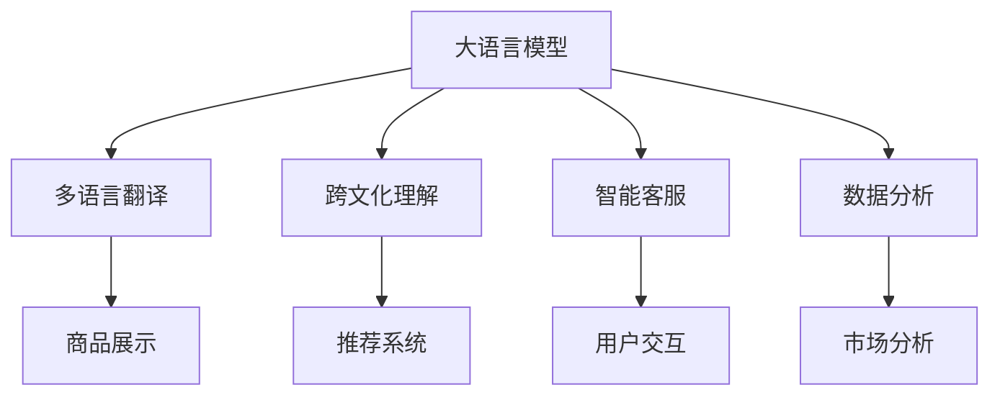

                 

# 探讨大模型在跨境电商中的语言障碍解决方案

## 1. 背景介绍

### 1.1 问题由来

跨境电商，作为一种新兴的全球化商业模式，迅速改变了全球消费者的购物习惯和商家的经营模式。然而，语言障碍依然是全球跨境电商发展中面临的一大挑战。许多企业在国际市场上拓展时，由于语言不通，导致用户体验差、退货率高、沟通成本高，严重影响了企业的销售和客户满意度。

语言障碍主要体现在以下几个方面：
1. **语言多样性**：全球市场有成千上万种语言，不同语言的用户对同一件商品的理解和使用习惯不同。
2. **多语种支持困难**：多语种商品展示和描述的设计、翻译、管理和更新维护复杂且成本高。
3. **交流障碍**：客户咨询、售后服务、订单处理等环节因语言不通，增加了沟通难度，降低了用户满意度。
4. **文化和习俗差异**：不同语言文化背景下的产品需求差异大，需要定制化产品和服务。

为应对这一挑战，跨境电商企业正在寻求更智能、更高效的解决方案。大模型（Large Language Models, LLMs），即预训练语言模型，因其强大的自然语言理解和生成能力，成为解决跨境电商语言障碍的有力工具。

### 1.2 问题核心关键点

大语言模型在跨境电商中的应用，主要体现在以下几个方面：
1. **多语言翻译**：自动翻译和本地化商品描述、页面、服务条款等，提升用户体验。
2. **跨文化理解**：理解不同文化背景下的产品需求和消费习惯，进行定制化推荐。
3. **智能客服**：实现多语言实时客服，降低沟通成本。
4. **数据分析**：通过自然语言处理技术，分析用户反馈和市场趋势，优化产品和服务。

本文将重点探讨如何利用大语言模型解决跨境电商中的语言障碍问题，详细介绍大模型在多语言翻译、跨文化理解、智能客服和数据分析中的应用，并分析其优缺点和未来发展趋势。

## 2. 核心概念与联系

### 2.1 核心概念概述

为更好地理解大模型在跨境电商中的应用，我们先定义几个核心概念：

- **大语言模型（Large Language Models, LLMs）**：如GPT-3、BERT等，经过大规模无标签文本数据预训练，具备丰富的语言知识，能理解和生成自然语言。
- **多语言翻译（Machine Translation, MT）**：自动将一种语言翻译成另一种语言，通过大模型实现多语言商品展示和页面翻译。
- **跨文化理解（Cultural Understanding）**：理解不同文化背景下用户的消费需求和行为习惯，提升定制化推荐效果。
- **智能客服（Chatbots）**：利用大模型实现多语言实时客服，提升用户体验。
- **数据分析（Data Analysis）**：使用大模型进行文本挖掘、情感分析、用户画像构建等，分析市场趋势和用户需求。

这些概念通过大模型框架联系在一起，形成了解决跨境电商语言障碍的技术体系。

### 2.2 核心概念原理和架构的 Mermaid 流程图



该流程图展示了大语言模型如何通过多语言翻译、跨文化理解、智能客服和数据分析，解决跨境电商中的语言障碍。

## 3. 核心算法原理 & 具体操作步骤

### 3.1 算法原理概述

大语言模型在跨境电商中的应用，核心在于其强大的自然语言处理能力。大模型通常通过大规模无标签文本数据的自监督预训练，学习到通用的语言表示，能够处理各种语言任务。其核心算法包括：

1. **自监督预训练**：在大规模无标签文本数据上，通过掩码语言模型（Masked Language Modeling, MLM）等自监督任务，学习语言结构。
2. **多任务微调**：在特定任务上，通过微调大模型，学习任务特定的语言知识和语境。
3. **跨领域迁移**：通过迁移学习，在大模型预训练的基础上，学习不同领域或任务的语言表示。
4. **提示学习**：通过精心设计的提示模板，引导大模型进行特定任务推理和生成，无需额外训练。

### 3.2 算法步骤详解

以多语言翻译为例，详细介绍大模型的具体操作步骤：

**Step 1: 数据准备**
1. 收集源语言和目标语言的文本数据，例如商品描述、页面内容、服务条款等。
2. 清洗和标准化数据，去除噪音和格式不一致问题。
3. 划分训练集、验证集和测试集，确保数据分布合理。

**Step 2: 选择和加载模型**
1. 选择合适的预训练大语言模型，如GPT-3、BERT等。
2. 使用PyTorch或TensorFlow等框架，加载模型到计算设备（如GPU）。

**Step 3: 定义翻译任务**
1. 确定翻译任务的类型，如句子翻译、段落翻译、网页翻译等。
2. 设计合适的损失函数，如BLEU、ROUGE等。

**Step 4: 训练和微调**
1. 使用翻译数据集进行模型训练，最小化损失函数。
2. 通过微调优化模型，提升翻译效果。

**Step 5: 评估和部署**
1. 在验证集上评估翻译模型效果。
2. 部署翻译模型到实际应用中，如网站、APP等。

### 3.3 算法优缺点

大模型在跨境电商中的应用，具有以下优点：
1. **高效快速**：自动翻译和本地化，节省了大量人工翻译和翻译校对成本。
2. **多语言支持**：能够处理多种语言，提升国际化水平。
3. **实时响应**：实时翻译和本地化更新，提高用户体验。
4. **定制化推荐**：基于跨文化理解，提升个性化推荐效果。

同时，也存在以下缺点：
1. **成本高**：大模型的训练和部署需要高性能计算资源，成本较高。
2. **数据质量依赖**：翻译质量受源语言数据和目标语言数据的准确性影响较大。
3. **文化差异处理**：不同文化背景下，翻译的表达方式和语境差异较大，需进一步优化。
4. **隐私和伦理问题**：处理用户隐私和数据安全，需特别注意。

### 3.4 算法应用领域

大语言模型在跨境电商中的应用，主要包括以下几个方面：

- **多语言翻译**：商品描述、页面、客服、订单等文本的自动翻译。
- **跨文化理解**：分析用户行为，定制化推荐产品和服务。
- **智能客服**：多语言实时客服，提升用户体验。
- **数据分析**：用户反馈、市场趋势、社交媒体情绪分析等。

这些应用场景需要结合具体的业务需求和技术实现细节，进行细致设计和优化。

## 4. 数学模型和公式 & 详细讲解 & 举例说明

### 4.1 数学模型构建

假设大语言模型为$f(x;\theta)$，其中$x$为输入文本，$\theta$为模型参数。设源语言为$s$，目标语言为$t$。多语言翻译任务可以形式化为$f_s(x;\theta_s)$将源语言文本$x$翻译为目标语言文本$y_t$。

多任务微调的目标为最小化损失函数$L(\theta)$：

$$
L(\theta) = \frac{1}{N} \sum_{i=1}^N \ell(y_t, f_s(x;\theta_s))
$$

其中，$\ell$为翻译质量评估指标，如BLEU分数。

### 4.2 公式推导过程

以BLEU指标为例，推导多语言翻译的损失函数。BLEU指标衡量机器翻译结果与参考翻译之间的匹配程度，定义如下：

$$
BLEU = \max_{\alpha} \frac{exp(\alpha \log P_n)}{\sum_{k=1}^{N} \alpha_k} 
$$

其中，$P_n$为机器翻译结果与参考翻译之间的匹配长度比。$\alpha$为权值，$\alpha_k$为权值系数。

对于具体的机器翻译任务，BLEU的计算步骤如下：
1. 将机器翻译结果和参考翻译进行对齐，计算匹配长度比$P_n$。
2. 对匹配长度比取对数，得到对数匹配长度比$\log P_n$。
3. 根据BLEU定义计算权重$\alpha$。
4. 对各权重求和，得到最终的BLEU分数。

### 4.3 案例分析与讲解

以商品翻译为例，假设原始商品描述为英文，需要翻译成中文。选择GPT-3作为翻译模型，使用BLEU评估翻译效果。具体步骤如下：
1. 将英文商品描述作为输入，输出翻译结果。
2. 将翻译结果与人工翻译的中文对照，计算BLEU分数。
3. 根据BLEU分数调整模型参数，进行微调。
4. 在测试集上评估模型性能，优化翻译质量。

## 5. 项目实践：代码实例和详细解释说明

### 5.1 开发环境搭建

为进行大模型在跨境电商中的应用，需要搭建相应的开发环境。以下是搭建环境的步骤：

1. 安装Anaconda：从官网下载并安装Anaconda，用于创建独立的Python环境。
2. 创建并激活虚拟环境：
```bash
conda create -n nlp-env python=3.8 
conda activate nlp-env
```
3. 安装PyTorch和TensorFlow：
```bash
pip install torch torchtext
pip install tensorflow
```
4. 安装相关库：
```bash
pip install pytorch-transformers sacremoses
```

### 5.2 源代码详细实现

以下是一个基于GPT-3的多语言翻译示例代码：

```python
from transformers import GPT3LMHeadModel, GPT3Tokenizer

tokenizer = GPT3Tokenizer.from_pretrained('gpt3')
model = GPT3LMHeadModel.from_pretrained('gpt3')

def translate(text, source_lang='en', target_lang='zh'):
    tokenizer.src_lang = source_lang
    tokenizer.src_lang = target_lang
    input_ids = tokenizer.encode(text, return_tensors='pt')
    outputs = model.generate(input_ids, max_length=50)
    translated_text = tokenizer.decode(outputs[0], skip_special_tokens=True)
    return translated_text

translated_text = translate("Hello, how are you?", source_lang='en', target_lang='zh')
print(translated_text)
```

**代码解读与分析**

1. **导入模块**：从`transformers`库导入`GPT3LMHeadModel`和`GPT3Tokenizer`，用于定义大模型和分词器。
2. **模型和分词器加载**：通过`from_pretrained`方法加载预训练的GPT-3模型和分词器。
3. **定义翻译函数**：根据源语言和目标语言，设置分词器的语言编码，使用模型生成翻译结果。
4. **代码示例**：将英文文本进行翻译，输出中文翻译结果。

### 5.3 运行结果展示

运行上述代码，将输出翻译后的中文文本。例如：

```
你好，你好吗？
```

## 6. 实际应用场景

### 6.1 多语言翻译

大模型在多语言翻译中的应用，可以极大提升跨境电商企业的国际化水平。例如，Etsy使用多语言翻译模型，实现了商品描述、页面翻译、客服支持等功能，显著提升了用户体验和销售转化率。

- **商品展示翻译**：自动将商品描述翻译成用户所在的语言，提升语言多样性。
- **页面翻译**：自动翻译网站页面和客服提示信息，提升跨语言用户体验。
- **客服支持**：自动翻译用户咨询，生成多语言客服回答，提高响应速度和准确性。

### 6.2 跨文化理解

通过大模型对用户行为数据的分析，跨境电商企业可以实现跨文化理解，进行个性化推荐。例如，Alibaba使用大模型分析用户搜索行为和社交媒体数据，进行精准推荐，提升用户满意度和转化率。

- **用户行为分析**：使用大模型分析用户搜索记录、浏览行为、评论等数据，构建用户画像。
- **推荐系统优化**：根据用户画像和行为特征，生成个性化推荐商品。
- **跨文化需求理解**：分析不同文化背景下的用户需求和消费习惯，调整推荐策略。

### 6.3 智能客服

大模型在智能客服中的应用，可以大幅提升跨境电商企业的客户服务水平。例如，Amazon使用多语言智能客服模型，提供了24/7的多语言支持，减少了人工客服的负担，提高了用户满意度。

- **实时客服**：自动处理用户咨询，生成多语言回复。
- **情感分析**：分析用户情绪，进行针对性的服务。
- **多语言支持**：支持多种语言，提供跨语言客户服务。

### 6.4 未来应用展望

未来，随着大模型的不断进步，其在跨境电商中的应用将更加广泛和深入。以下是对未来应用的一些展望：

1. **全语言模型**：构建支持所有主流语言的模型，提升全球覆盖率。
2. **多模态融合**：结合视觉、语音等模态数据，提升用户交互体验。
3. **实时个性化推荐**：基于实时数据分析，提供动态更新的个性化推荐。
4. **跨文化情感分析**：分析不同文化背景下的用户情感和需求，进行更精准的服务。
5. **智能营销**：使用大模型分析社交媒体数据，进行智能广告投放和营销策略优化。

## 7. 工具和资源推荐

### 7.1 学习资源推荐

为掌握大模型在跨境电商中的应用，以下是一些学习资源推荐：

1. 《自然语言处理入门》：一本系统介绍自然语言处理技术的书籍，适合入门学习。
2. 《深度学习与自然语言处理》：一本介绍深度学习和自然语言处理方法的课程，由Coursera提供。
3. 《自然语言处理技术与应用》：一本介绍自然语言处理技术应用的书籍，涵盖跨境电商等多个领域。
4. HuggingFace官方文档：提供大量预训练模型的介绍和使用方法，适合快速上手实践。
5. 《跨境电商大模型应用》：一本介绍大模型在跨境电商中应用的书籍，结合实际案例讲解。

### 7.2 开发工具推荐

以下是一些常用的开发工具，方便大模型的应用开发：

1. PyTorch：基于Python的开源深度学习框架，支持动态计算图，适合快速迭代研究。
2. TensorFlow：由Google主导的深度学习框架，生产部署方便，适合大规模工程应用。
3. HuggingFace Transformers库：提供了多种预训练语言模型的实现，支持多种自然语言处理任务。
4. Amazon SageMaker：亚马逊提供的机器学习平台，提供强大的模型训练和部署功能。
5. Google Cloud AI平台：提供多种深度学习工具和服务，支持多语言模型训练和部署。

### 7.3 相关论文推荐

以下是几篇与大模型在跨境电商应用相关的经典论文：

1. "Machine Translation with Attention"：介绍基于注意力机制的机器翻译模型，提高了翻译质量。
2. "Semi-supervised Sequence Learning"：介绍半监督学习在自然语言处理中的应用，提高了模型的泛化能力。
3. "Adversarial Examples in Deep Learning"：介绍对抗性样本在自然语言处理中的应用，提高了模型的鲁棒性。
4. "Towards a Knowledge-Base Augmented Pre-training Approach for Sequence Generation"：介绍知识图谱辅助的预训练方法，提高了模型的知识整合能力。

## 8. 总结：未来发展趋势与挑战

### 8.1 研究成果总结

本文系统介绍了大模型在跨境电商中的应用，包括多语言翻译、跨文化理解、智能客服和数据分析等。大模型通过自然语言处理技术，提升了跨境电商企业的国际化水平，提高了用户体验和服务效率。

### 8.2 未来发展趋势

大语言模型在跨境电商中的应用，将呈现以下几个发展趋势：

1. **全语言模型**：构建支持所有主流语言的模型，提升全球覆盖率。
2. **多模态融合**：结合视觉、语音等模态数据，提升用户交互体验。
3. **实时个性化推荐**：基于实时数据分析，提供动态更新的个性化推荐。
4. **跨文化情感分析**：分析不同文化背景下的用户情感和需求，进行更精准的服务。
5. **智能营销**：使用大模型分析社交媒体数据，进行智能广告投放和营销策略优化。

### 8.3 面临的挑战

尽管大模型在跨境电商中的应用已经取得了显著进展，但在迈向更加智能化、普适化应用的过程中，仍面临诸多挑战：

1. **数据质量瓶颈**：翻译质量和跨文化理解依赖于高质量的数据，获取和处理大量高质量数据成本较高。
2. **模型复杂度**：大模型参数量大，需要高性能计算资源，部署和维护复杂。
3. **跨文化理解差异**：不同文化背景下，语言表达方式和习惯差异较大，需进一步优化。
4. **隐私和伦理问题**：用户数据隐私和模型伦理问题需特别注意。
5. **用户体验优化**：多语言翻译和跨文化理解需关注用户体验，避免误导和歧义。

### 8.4 研究展望

未来，需要在以下几个方面进行深入研究：

1. **无监督和半监督学习**：探索无需大量标注数据的训练方法，提高数据利用率。
2. **模型压缩和优化**：提高模型计算效率，降低部署成本。
3. **跨文化差异处理**：进一步优化跨文化理解，提升跨文化服务效果。
4. **隐私保护和伦理保障**：制定和实施数据隐私保护和模型伦理规范。
5. **多模态融合**：结合视觉、语音等多模态数据，提升用户交互体验。

总之，大语言模型在跨境电商中的应用前景广阔，但也需要面对诸多挑战。通过不断探索和优化，相信大模型将为跨境电商带来新的变革和机遇。

## 9. 附录：常见问题与解答

**Q1：大模型在跨境电商中的应用是否仅限于多语言翻译？**

A: 大模型在跨境电商中的应用不限于多语言翻译。例如，可以使用大模型进行跨文化理解、智能客服、数据分析等，提升跨境电商企业的国际化水平和用户体验。

**Q2：多语言翻译的精度如何提升？**

A: 多语言翻译的精度提升需要从以下几个方面入手：
1. 数据质量：选择高质量、多语种的翻译数据，并进行数据清洗和标准化。
2. 模型选择：选择适合任务的预训练模型，并进行适当的微调。
3. 损失函数选择：选择合适的评估指标，如BLEU、ROUGE等，进行模型训练。
4. 正则化和对抗训练：使用正则化、对抗训练等技术，提高模型鲁棒性。
5. 模型融合：通过模型融合技术，提升翻译效果。

**Q3：如何处理跨文化理解中的文化差异？**

A: 处理跨文化理解中的文化差异需要考虑以下几个方面：
1. 文化背景理解：分析不同文化背景下的用户需求和行为习惯，进行定制化推荐。
2. 文化差异训练：在预训练和微调过程中，考虑文化差异因素，提升模型适应性。
3. 数据增强：通过数据增强技术，增加文化差异数据，提高模型泛化能力。
4. 多模型融合：结合多个文化模型，提升跨文化理解效果。

**Q4：智能客服中如何保证多语言支持？**

A: 智能客服中保证多语言支持需要考虑以下几个方面：
1. 多语言模型选择：选择多语言支持较好的智能客服模型。
2. 多语言数据集：使用多语言数据集进行模型训练和测试。
3. 多语言测试：使用多种语言进行模型测试，评估翻译和理解效果。
4. 多语言部署：将多语言模型部署到跨境电商平台的各个语言版本中，保证跨语言服务。

**Q5：如何保护用户数据隐私？**

A: 保护用户数据隐私需要考虑以下几个方面：
1. 数据匿名化：对用户数据进行匿名化处理，保护用户隐私。
2. 数据加密：对用户数据进行加密存储和传输，防止数据泄露。
3. 模型本地化：将模型部署在本地，避免数据传输风险。
4. 隐私保护技术：使用隐私保护技术，如差分隐私、联邦学习等，保护用户隐私。

通过这些措施，可以在跨境电商应用中更好地保护用户数据隐私，确保数据安全和用户权益。

---

作者：禅与计算机程序设计艺术 / Zen and the Art of Computer Programming

