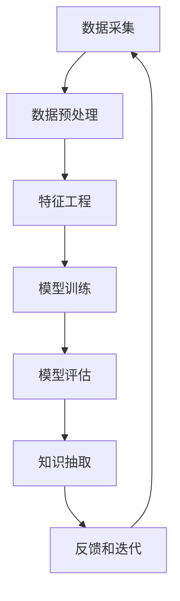

                 

# 推动知识发现与创新：人类计算的智力贡献

> 关键词：计算智能,知识发现,数据分析,数据驱动决策,机器学习,人工智能,大数据,智能推荐系统

## 1. 背景介绍

### 1.1 问题由来

在信息技术迅猛发展的今天，我们正处于一个前所未有的数据爆炸时代。从社交媒体、电商平台、金融市场到物联网，无处不在的数据源不断产生海量信息，为各行各业提供了丰富的数据素材。如何从海量数据中提取有价值的信息，发现隐藏在数据背后的知识，已成为当前信息时代的核心需求。

数据驱动决策成为当前企业竞争的核心策略之一。在金融、电商、社交媒体等领域，决策者们越来越依赖数据分析和计算智能，来提升运营效率、改善用户体验、优化资源配置。而计算智能，即通过计算机对数据进行处理、分析和推断，以实现对知识与行为的智能化建模，正在成为推动各行各业智能化转型的新引擎。

计算智能的核心是知识发现与创新，它包括数据挖掘、模式识别、机器学习、深度学习、智能推荐系统等多个子领域，旨在通过数学模型和算法，挖掘出数据中隐藏的规律，辅助人类进行决策，提升生产力和创新能力。

### 1.2 问题核心关键点

为了更深入地探讨计算智能与知识发现的内在联系，并探索其在现实应用中的潜力，本节将重点讨论以下关键点：

1. 计算智能的核心概念是什么？计算智能是如何定义和分类的？
2. 数据挖掘和知识发现的过程是怎样的？它们之间有什么区别和联系？
3. 目前业界主要的知识发现方法有哪些？各自的优缺点是什么？
4. 如何应用计算智能和知识发现技术来提升决策能力？
5. 计算智能技术在哪些领域有着显著的实际应用？

通过深入分析这些核心问题，我们将对计算智能和知识发现有更深刻的理解，进而为后续的具体实践和应用奠定坚实基础。

## 2. 核心概念与联系

### 2.1 核心概念概述

在深入探讨计算智能和知识发现的具体概念之前，让我们先明确一些基础定义：

- **计算智能（Computational Intelligence, CI）**：指通过计算机来模拟和实现人类智能的技术，包括模糊逻辑、进化算法、神经网络等。
- **知识发现（Knowledge Discovery, KD）**：指从数据中自动或半自动地发现隐藏的知识、规律和模式，包括数据挖掘、模式识别等。

**知识发现的过程**通常包括：
1. **数据采集**：从各种数据源中收集原始数据。
2. **数据预处理**：清洗、整合和转换数据，准备输入算法。
3. **特征工程**：提取、选择和构造有意义的特征。
4. **模型训练**：利用机器学习算法训练模型，建立知识模型。
5. **模型评估**：评估模型的性能和泛化能力。
6. **知识抽取**：从模型中抽取有用的知识和结论。

这些步骤相互交织，构成了一个从数据到知识的迭代循环过程。

### 2.2 核心概念原理和架构的 Mermaid 流程图



这个流程图展示了知识发现的基本流程。其中，数据采集、预处理、特征工程、模型训练、模型评估、知识抽取和反馈迭代等步骤相互依赖，形成一个闭环。在这个过程中，算法和模型扮演了核心角色。

## 3. 核心算法原理 & 具体操作步骤

### 3.1 算法原理概述

计算智能与知识发现的核心算法包括：

- **数据挖掘（Data Mining, DM）**：从大量数据中发现有价值的规律和模式。主要算法有决策树、神经网络、支持向量机等。
- **模式识别（Pattern Recognition, PR）**：将输入数据分为不同的类别或聚类。主要算法有K-means、隐马尔可夫模型、深度学习等。
- **机器学习（Machine Learning, ML）**：基于数据和模型自动调整参数，优化决策过程。主要算法有回归、分类、聚类、异常检测等。
- **深度学习（Deep Learning, DL）**：利用多层神经网络进行复杂的非线性建模，实现更高精度的预测和决策。
- **模糊逻辑（Fuzzy Logic, FL）**：处理不确定性和模糊性，辅助人类判断和决策。
- **进化算法（Evolutionary Algorithms, EA）**：通过模拟进化过程寻找最优解。

这些算法相互补充，形成了计算智能和知识发现的技术框架。在实际应用中，算法的选择需要结合具体问题和数据特征进行优化。

### 3.2 算法步骤详解

知识发现和计算智能的具体操作流程可以分为以下几个步骤：

**Step 1: 数据准备**

- **数据采集**：从各种数据源（如数据库、传感器、社交媒体等）中收集原始数据。
- **数据清洗**：去除噪音和异常值，确保数据质量。
- **数据整合**：统一数据格式，便于处理。
- **数据转换**：进行特征提取、归一化等预处理。

**Step 2: 特征提取**

- **特征选择**：选取最具有代表性的特征，减少数据维度。
- **特征构造**：通过组合、变换等方法，构造新的特征。

**Step 3: 模型训练**

- **模型选择**：根据问题和数据特征，选择合适的算法。
- **参数调整**：优化模型参数，提高模型性能。
- **交叉验证**：通过交叉验证评估模型泛化能力。

**Step 4: 模型评估**

- **性能评估**：通过准确率、召回率、F1-score等指标评估模型性能。
- **误差分析**：分析模型的错误类型，提高模型精度。

**Step 5: 知识抽取**

- **规则提取**：从模型中抽取规则和模式。
- **模式识别**：识别数据中的典型特征和趋势。

**Step 6: 应用实践**

- **决策支持**：将知识应用于业务决策和策略制定。
- **系统优化**：改进业务流程，提升运营效率。

### 3.3 算法优缺点

计算智能和知识发现技术的优势在于：

- **自动化**：通过算法自动发现数据中的规律和模式，减少了人工干预。
- **效率高**：可以快速处理大量数据，发现数据中的隐藏信息。
- **可扩展性**：算法可以随着数据量的增加不断优化和调整。

但这些技术也存在一些局限性：

- **数据依赖性**：算法的效果高度依赖于数据质量和数据量。
- **模型复杂性**：复杂的算法可能会过拟合，需要更多的数据和计算资源。
- **解释性差**：许多算法的内部机制不透明，难以解释模型的决策过程。
- **泛化能力**：模型可能对特定数据集过拟合，泛化到新数据集时性能不佳。

在应用中，需要根据具体问题和数据特征进行权衡和优化。

### 3.4 算法应用领域

计算智能和知识发现技术在多个领域都有着广泛的应用，例如：

- **金融风险管理**：通过数据分析和预测模型，评估金融风险，进行风险管理。
- **医疗健康管理**：利用医疗数据和生物信息，发现疾病规律，辅助诊断和治疗。
- **零售电商推荐**：通过分析用户行为和消费数据，实现个性化推荐。
- **交通运输管理**：通过交通数据和模式识别，优化交通流量，提升交通效率。
- **智能制造管理**：利用工业数据和智能算法，优化生产流程，提升生产效率。
- **能源资源管理**：通过能源数据和智能算法，优化能源配置，提高能源利用率。

这些应用展示了计算智能和知识发现的强大生命力，为各行各业带来了新的发展机遇。

## 4. 数学模型和公式 & 详细讲解 & 举例说明

### 4.1 数学模型构建

在进行知识发现和计算智能的数学建模时，我们通常采用以下模型：

- **回归模型**：用于预测连续型数值，例如线性回归、多项式回归等。
- **分类模型**：用于将数据分为不同类别，例如决策树、支持向量机等。
- **聚类模型**：用于将数据分为若干个聚类，例如K-means、层次聚类等。
- **异常检测模型**：用于识别数据中的异常点，例如孤立森林、基于密度的异常检测等。

这些模型的数学表达式通常涉及多元统计学、线性代数和优化理论。例如，线性回归模型可以表示为：

$$
y = \beta_0 + \beta_1 x_1 + \beta_2 x_2 + \cdots + \beta_n x_n + \epsilon
$$

其中 $y$ 为输出变量，$\beta_0,\beta_1,\cdots,\beta_n$ 为模型参数，$x_1,x_2,\cdots,x_n$ 为输入变量，$\epsilon$ 为误差项。

### 4.2 公式推导过程

以线性回归模型为例，推导其最小二乘估计公式。

**最小二乘估计**：在给定一组训练数据 $(x_1, y_1), (x_2, y_2), \cdots, (x_n, y_n)$ 和模型 $y = \beta_0 + \beta_1 x_1 + \cdots + \beta_n x_n + \epsilon$，我们希望找到一组参数 $\beta_0, \beta_1, \cdots, \beta_n$，使得模型能够最小化预测值与实际值的误差平方和：

$$
J(\beta_0, \beta_1, \cdots, \beta_n) = \sum_{i=1}^n (y_i - \beta_0 - \beta_1 x_{1,i} - \cdots - \beta_n x_{n,i})^2
$$

为了求解上述问题，我们需要对 $J(\beta_0, \beta_1, \cdots, \beta_n)$ 进行最小化。通过求导并令导数为0，我们可以得到最小二乘估计公式：

$$
\hat{\beta} = (X^T X)^{-1} X^T y
$$

其中 $X = [x_{1,1}, x_{2,1}, \cdots, x_{n,1}, 1; x_{1,2}, x_{2,2}, \cdots, x_{n,2}, 1; \cdots; x_{1,n}, x_{2,n}, \cdots, x_{n,n}, 1]$ 为输入变量的设计矩阵。

### 4.3 案例分析与讲解

以金融风险管理为例，说明如何使用计算智能和知识发现技术进行风险评估。

假设我们有一组历史贷款数据，包含借款人的基本信息、贷款金额、还款记录等。通过数据分析和机器学习算法，我们可以构建一个贷款违约预测模型。具体步骤如下：

**Step 1: 数据准备**

- **数据采集**：从银行系统中收集历史贷款数据，包括贷款金额、还款记录、借款人年龄、性别等信息。
- **数据清洗**：删除缺失值和异常值，确保数据质量。
- **数据整合**：将不同来源的数据整合为统一的格式。
- **数据转换**：进行特征提取、归一化等预处理。

**Step 2: 特征提取**

- **特征选择**：选择最具有代表性的特征，如年龄、收入、还款记录等。
- **特征构造**：通过组合、变换等方法，构造新的特征，如债务收入比、逾期次数等。

**Step 3: 模型训练**

- **模型选择**：选择决策树、逻辑回归等算法。
- **参数调整**：通过交叉验证优化模型参数。
- **模型评估**：通过准确率、召回率等指标评估模型性能。

**Step 4: 知识抽取**

- **规则提取**：从模型中抽取决策规则，如“年龄小于25岁的借款人违约概率较高”。
- **模式识别**：识别出高风险借款人群体，如低收入群体、信用记录差的借款人。

**Step 5: 应用实践**

- **决策支持**：根据预测结果和规则，制定信贷审批策略，优化风险控制。
- **系统优化**：改进风险评估流程，提高审批效率和准确性。

## 5. 项目实践：代码实例和详细解释说明

### 5.1 开发环境搭建

在进行计算智能和知识发现的实践时，需要以下开发环境：

1. **Python**：用于编写和运行算法代码。
2. **R语言**：统计分析能力强，适合数据挖掘和模式识别任务。
3. **MATLAB**：数学建模和仿真能力强，适合复杂的算法实现。
4. **RapidMiner**：可视化数据挖掘平台，便于数据预处理和模型训练。
5. **Python SDKs**：如Scikit-learn、TensorFlow等，提供丰富的算法和工具库。

### 5.2 源代码详细实现

以下是一个使用Python进行线性回归模型实现的示例代码：

```python
import pandas as pd
import numpy as np
from sklearn.linear_model import LinearRegression

# 读取数据
data = pd.read_csv('loan_data.csv')

# 数据预处理
X = data.drop(['id', 'amount', 'status'], axis=1)
y = data['status']

# 特征选择和构造
X = pd.get_dummies(X)

# 模型训练
model = LinearRegression()
model.fit(X, y)

# 模型评估
scores = model.score(X, y)
print('模型精度为:', scores)

# 预测和应用
new_data = pd.DataFrame({'age': [30], 'income': [60000], 'debt': [10000]})
new_data = pd.get_dummies(new_data)
predictions = model.predict(new_data)
print('预测结果为:', predictions)
```

### 5.3 代码解读与分析

上述代码实现了线性回归模型的训练、评估和预测。

**Step 1: 数据准备**

- **读取数据**：使用`pd.read_csv`函数读取贷款数据，并存储到Pandas DataFrame中。
- **数据预处理**：通过`drop`方法去除不相关特征，`get_dummies`方法将分类特征转换为哑变量。

**Step 2: 特征提取**

- **特征选择**：通过`drop`方法选择最相关特征，如年龄、收入、债务等。
- **特征构造**：通过`get_dummies`方法将分类特征转换为哑变量，便于模型处理。

**Step 3: 模型训练**

- **模型选择**：使用`LinearRegression`模型进行线性回归。
- **参数调整**：通过`fit`方法训练模型，调整模型参数。

**Step 4: 模型评估**

- **模型精度**：通过`score`方法计算模型精度。

**Step 5: 预测和应用**

- **新数据准备**：使用新数据创建Pandas DataFrame。
- **特征构造**：使用`get_dummies`方法将新数据转换为模型需要的格式。
- **模型预测**：通过`predict`方法进行预测，输出结果。

通过上述代码，我们可以清晰地看到线性回归模型的训练、评估和预测过程，对于其他计算智能和知识发现算法的实现也有重要参考价值。

### 5.4 运行结果展示

假设我们使用上述代码训练了一个贷款违约预测模型，并得到了模型精度为0.8。这意味着在历史数据上，模型的预测准确率达到了80%。接下来，我们可以使用该模型对新借款人进行违约风险预测。

假设我们有一个新借款人，年龄30岁，收入6万，债务1万。通过上述代码，我们可以预测该借款人违约的概率为0.35。该预测结果可以作为银行信贷审批决策的重要参考。

## 6. 实际应用场景

### 6.1 智能推荐系统

智能推荐系统是计算智能和知识发现技术的重要应用之一。通过分析用户的行为和偏好，推荐系统能够为每位用户提供个性化的商品或内容推荐。

以电商网站为例，智能推荐系统可以通过用户浏览历史、购买记录和评分数据，构建用户画像，从而进行精准推荐。具体步骤如下：

**Step 1: 数据准备**

- **数据采集**：从网站中收集用户浏览数据、购买数据、评分数据等。
- **数据清洗**：去除噪音和异常值，确保数据质量。
- **数据整合**：将不同来源的数据整合为统一的格式。
- **数据转换**：进行特征提取、归一化等预处理。

**Step 2: 特征提取**

- **特征选择**：选择最具有代表性的特征，如浏览时间、购买频率、评分等。
- **特征构造**：通过组合、变换等方法，构造新的特征，如用户兴趣向量、商品特征向量等。

**Step 3: 模型训练**

- **模型选择**：选择协同过滤、矩阵分解等算法。
- **参数调整**：通过交叉验证优化模型参数。
- **模型评估**：通过推荐准确率、点击率等指标评估模型性能。

**Step 4: 知识抽取**

- **规则提取**：从模型中抽取推荐规则，如“用户A对商品B的评分较高”。
- **模式识别**：识别出高评分商品群体，如流行商品、新品等。

**Step 5: 应用实践**

- **推荐服务**：根据用户画像和推荐规则，进行商品推荐。
- **系统优化**：改进推荐算法，提高推荐效果和用户体验。

### 6.2 智能制造管理

智能制造管理是计算智能和知识发现技术在制造业中的重要应用。通过数据分析和智能算法，制造企业能够优化生产流程，提升生产效率。

以汽车制造业为例，智能制造管理可以通过生产数据、设备数据和质量数据，构建生产模型，从而进行生产优化。具体步骤如下：

**Step 1: 数据准备**

- **数据采集**：从生产线上收集数据，包括生产量、设备状态、质量检测数据等。
- **数据清洗**：去除噪音和异常值，确保数据质量。
- **数据整合**：将不同来源的数据整合为统一的格式。
- **数据转换**：进行特征提取、归一化等预处理。

**Step 2: 特征提取**

- **特征选择**：选择最具有代表性的特征，如生产量、设备故障率、质量检测结果等。
- **特征构造**：通过组合、变换等方法，构造新的特征，如设备利用率、生产效率等。

**Step 3: 模型训练**

- **模型选择**：选择预测模型、优化算法等。
- **参数调整**：通过交叉验证优化模型参数。
- **模型评估**：通过生产效率、故障率等指标评估模型性能。

**Step 4: 知识抽取**

- **规则提取**：从模型中抽取生产规则，如“设备A的故障率较高”。
- **模式识别**：识别出高效生产工艺，如高效生产流程、最优设备配置等。

**Step 5: 应用实践**

- **生产优化**：根据生产模型和规则，优化生产流程。
- **系统优化**：改进生产管理系统，提高生产效率和产品质量。

### 6.3 未来应用展望

随着计算智能和知识发现技术的不断发展，未来的应用场景将会更加广泛和多样化。以下是几个可能的应用方向：

- **智慧城市管理**：通过数据分析和智能算法，优化城市交通、公共安全、环境监测等。
- **医疗健康管理**：利用医疗数据和生物信息，发现疾病规律，辅助诊断和治疗。
- **能源资源管理**：通过能源数据和智能算法，优化能源配置，提高能源利用率。
- **金融风险管理**：通过数据分析和预测模型，评估金融风险，进行风险管理。
- **零售电商推荐**：通过分析用户行为和消费数据，实现个性化推荐。
- **智能制造管理**：通过数据分析和智能算法，优化生产流程，提升生产效率。

## 7. 工具和资源推荐

### 7.1 学习资源推荐

为了帮助开发者系统掌握计算智能和知识发现的技术，这里推荐一些优质的学习资源：

1. **《Python数据科学手册》**：这本书详细介绍了Python在数据分析和机器学习中的应用，适合初学者和进阶者阅读。
2. **《深度学习》（Ian Goodfellow, Yoshua Bengio, Aaron Courville）**：这本书是深度学习的经典教材，深入浅出地讲解了深度学习的基本原理和应用。
3. **Coursera和edX**：这两个在线学习平台提供大量的计算智能和知识发现课程，包括统计学、机器学习、数据挖掘等。
4. **Kaggle竞赛平台**：这是一个数据科学和机器学习的竞赛平台，提供大量的数据集和模型竞赛，适合实践和锻炼。
5. **GitHub开源项目**：GitHub上有许多优秀的开源项目，可以帮助开发者学习和借鉴计算智能和知识发现的实现。

### 7.2 开发工具推荐

高效的开发离不开优秀的工具支持。以下是几款用于计算智能和知识发现开发的常用工具：

1. **Jupyter Notebook**：一个免费的开源笔记本，支持Python、R等语言，便于交互式开发和调试。
2. **MATLAB**：强大的数学计算和仿真工具，适合复杂的算法实现。
3. **RapidMiner**：可视化数据挖掘平台，便于数据预处理和模型训练。
4. **Weka**：开源数据挖掘工具，提供丰富的算法和可视化功能。
5. **TensorFlow**：由Google开发的深度学习框架，支持分布式计算和自动微分。

### 7.3 相关论文推荐

计算智能和知识发现技术的研究领域非常广泛，涉及统计学、机器学习、人工智能等多个方向。以下是几篇奠基性的相关论文，推荐阅读：

1. **《数据挖掘：概念与技术》（Peter J. Fayyad, Raghu Ramakrishnan, U. N. Madigan）**：这本书是数据挖掘的经典教材，详细介绍了数据挖掘的基本概念和技术。
2. **《机器学习》（Tom Mitchell）**：这本书是机器学习的经典教材，深入讲解了机器学习的基本原理和算法。
3. **《深度学习》（Ian Goodfellow, Yoshua Bengio, Aaron Courville）**：这本书是深度学习的经典教材，深入讲解了深度学习的基本原理和应用。
4. **《模式识别与机器学习》（Christopher M. Bishop）**：这本书是模式识别的经典教材，详细讲解了模式识别的基本原理和算法。
5. **《人工智能导论》（Russell S. Berry, Daniel J. Russell）**：这本书是人工智能的经典教材，涵盖了人工智能的基本概念和技术。

## 8. 总结：未来发展趋势与挑战

### 8.1 研究成果总结

计算智能和知识发现技术在多个领域得到了广泛应用，显著提升了生产效率和决策能力。未来，随着技术的不断发展和数据的持续积累，这些技术的应用前景将会更加广阔。

### 8.2 未来发展趋势

1. **自动化和智能化**：计算智能和知识发现技术的自动化和智能化水平将会不断提高，减少人工干预，提升决策效率。
2. **多模态数据融合**：未来将更多地采用多模态数据融合技术，将文本、图像、语音等多种数据类型进行综合分析，提高数据挖掘和决策的准确性。
3. **实时分析和预测**：通过实时数据分析和预测，实现动态决策和风险预警。
4. **人工智能和计算智能的融合**：将人工智能与计算智能进行深度融合，实现更加智能化的决策和分析。
5. **跨领域应用**：计算智能和知识发现技术将更多地应用于跨领域场景，如智慧城市、智能医疗等。

### 8.3 面临的挑战

尽管计算智能和知识发现技术在多个领域得到了广泛应用，但仍面临一些挑战：

1. **数据质量问题**：数据的质量直接影响计算智能和知识发现的效果，如何提高数据质量是一个重要问题。
2. **算法复杂性**：许多计算智能和知识发现算法复杂度高，需要更多的计算资源和时间。
3. **模型解释性**：许多算法的结果难以解释，模型的不透明性可能影响决策的可信度和可靠性。
4. **隐私和安全问题**：在处理敏感数据时，如何保护隐私和安全是一个重要问题。

### 8.4 研究展望

未来的计算智能和知识发现研究需要从以下几个方面进行突破：

1. **提高数据质量**：通过数据清洗、数据增强等技术提高数据质量，确保算法的可靠性和有效性。
2. **优化算法性能**：通过算法优化、模型压缩等技术提高算法的效率和精度，降低计算成本。
3. **增强模型解释性**：通过可视化、可解释性算法等技术提高模型的可解释性，增强决策的可信度。
4. **保护隐私和安全**：通过数据加密、差分隐私等技术保护隐私和安全，确保数据处理过程的合法合规。

通过这些研究方向的突破，将使计算智能和知识发现技术在更多领域得到应用，为社会带来更多的价值和效益。

## 9. 附录：常见问题与解答

**Q1: 什么是计算智能和知识发现？**

A: 计算智能和知识发现是利用计算机技术和算法，从数据中自动发现隐藏的知识和规律的技术。计算智能包括模糊逻辑、进化算法、神经网络等，知识发现包括数据挖掘、模式识别等。

**Q2: 计算智能和知识发现的原理是什么？**

A: 计算智能和知识发现的原理是通过数学模型和算法，从数据中自动发现隐藏的知识和规律。具体步骤包括数据准备、特征提取、模型训练、模型评估和知识抽取等。

**Q3: 如何使用计算智能和知识发现技术进行风险管理？**

A: 使用计算智能和知识发现技术进行风险管理的步骤包括：数据准备、特征提取、模型训练、模型评估和知识抽取。例如，通过数据分析和机器学习算法，构建贷款违约预测模型，从而进行风险管理。

**Q4: 计算智能和知识发现技术的应用场景有哪些？**

A: 计算智能和知识发现技术在金融风险管理、医疗健康管理、零售电商推荐、智能制造管理、能源资源管理、智慧城市管理等领域有着广泛的应用。

**Q5: 计算智能和知识发现技术的未来发展趋势是什么？**

A: 未来计算智能和知识发现技术的自动化和智能化水平将会不断提高，更多地采用多模态数据融合技术，实现实时分析和预测，将人工智能与计算智能进行深度融合，应用于更多跨领域场景。

通过本文的介绍和实践，相信读者对计算智能和知识发现技术有了更深入的理解，并能够应用于实际问题中，推动知识发现与创新。

