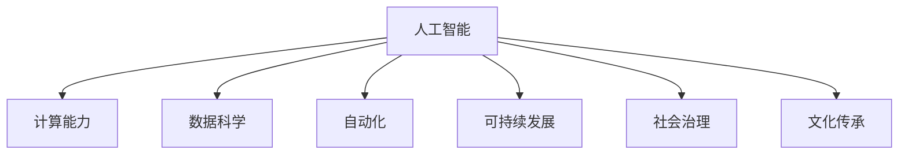

                 

# 推动社会进步的动力：人类计算的积极影响

> 关键词：人工智能,计算能力,社会进步,数据科学,自动化

## 1. 背景介绍

### 1.1 问题由来

在当今社会，计算技术已经深深嵌入到人类生活的各个方面。从智能手机到超级计算机，从在线学习到社交网络，计算无处不在。计算技术的飞速进步不仅极大地提升了生产效率，还极大地改变了人类的生活方式。

然而，尽管计算技术带来了诸多便利，但其对社会的积极影响也引起了广泛的关注和讨论。如何在利用计算技术推动社会进步的同时，确保其健康、可持续的发展，成为当代信息技术领域亟待解决的重要问题。

### 1.2 问题核心关键点

本文聚焦于计算技术对社会进步的积极影响。我们将从以下几个核心关键点进行讨论：

- 计算技术如何提升生产效率，驱动经济增长。
- 计算技术在医疗、教育、交通等领域的应用，如何改善公共服务。
- 计算技术在环境保护、灾害预防等方面的贡献，如何促进可持续发展。
- 计算技术对社会治理、公共安全等方面的影响，如何维护社会稳定。
- 计算技术在文化传承、艺术创作等方面的作用，如何丰富人类精神生活。

## 2. 核心概念与联系

### 2.1 核心概念概述

为更好地理解计算技术对社会进步的积极影响，本节将介绍几个密切相关的核心概念：

- 人工智能(Artificial Intelligence, AI)：指通过模拟人类智能过程，使计算机具备识别、理解、学习、推理、决策等能力的科技。
- 计算能力(Computing Power)：指计算机系统执行复杂计算任务的能力，通常以计算速度、存储容量和能效等指标来衡量。
- 数据科学(Data Science)：研究如何从大规模数据中提取有价值的信息，驱动决策和预测的科学。
- 自动化(Automation)：指利用计算技术代替人工完成重复性、危险性或高负荷的工作，提高工作效率和质量。
- 可持续发展(Sustainable Development)：指在不损害环境、经济和社会的基础上，实现长期增长和进步的发展模式。
- 社会治理(Social Governance)：指通过计算技术辅助政策制定、公共服务优化、社会事务管理等，提高治理效能和社会满意度。
- 文化传承(Cultural Heritage)：指通过计算技术保存、传播和创新人类文化遗产的过程。

这些核心概念之间的逻辑关系可以通过以下Mermaid流程图来展示：



这个流程图展示了大语言模型核心概念及其之间的关系：

1. 人工智能是计算技术的核心，具备高度复杂的计算和处理能力。
2. 计算能力是人工智能实现的基础，能够高效处理海量数据和执行复杂计算。
3. 数据科学提供数据处理和分析方法，辅助人工智能做出更准确的决策。
4. 自动化利用人工智能和计算能力，代替人工完成重复性工作，提高效率。
5. 可持续发展关注人工智能和计算能力对环境和社会的长期影响，倡导绿色计算。
6. 社会治理利用人工智能和计算能力，提升公共服务和治理效率。
7. 文化传承通过人工智能和计算能力，保存和创新人类文化遗产。

这些概念共同构成了人工智能推动社会进步的基本框架，使其能够在各种场景下发挥强大的影响力。通过理解这些核心概念，我们可以更好地把握人工智能的潜力及其对社会的积极作用。

## 3. 核心算法原理 & 具体操作步骤
### 3.1 算法原理概述

人工智能对社会进步的积极影响主要体现在以下几个方面：

- **提升生产效率**：通过自动化和智能系统，减少人工错误，提高生产效率和产品质量。
- **改善公共服务**：利用大数据和机器学习，优化医疗、教育、交通等公共服务，提升用户体验和满意度。
- **促进环境保护**：通过计算技术，实时监测环境数据，进行灾害预警，推动可持续发展。
- **增强社会治理**：利用数据分析和模型预测，辅助政府决策，优化公共安全和社会治理。
- **丰富精神文化生活**：通过人工智能和虚拟现实技术，提供高质量的娱乐和文化体验。

### 3.2 算法步骤详解

基于人工智能推动社会进步的各个方面，我们可以将其实现步骤大致分为以下几个关键步骤：

**Step 1: 数据收集与处理**

- 收集相关领域的原始数据，包括文本、图像、声音等。
- 进行数据清洗和预处理，去除噪声和无关数据。
- 对数据进行标注和分类，准备训练和测试数据集。

**Step 2: 模型设计与训练**

- 选择合适的算法和模型架构，如卷积神经网络(CNN)、循环神经网络(RNN)、Transformer等。
- 设计模型超参数，如学习率、批大小、迭代次数等。
- 使用训练集进行模型训练，优化模型参数。

**Step 3: 模型评估与优化**

- 在测试集上评估模型性能，如准确率、召回率、F1分数等。
- 根据评估结果，调整模型结构和参数，进行优化。
- 进行模型部署，将其应用于实际场景。

**Step 4: 应用与迭代**

- 将优化后的模型应用于实际应用场景，如医疗诊断、智能客服、智慧城市等。
- 收集用户反馈和评价，进行模型迭代和改进。
- 不断优化模型性能，提升用户体验和社会效益。

### 3.3 算法优缺点

基于人工智能推动社会进步的方法具有以下优点：

1. **效率提升**：通过自动化和智能化，大幅提高工作效率，降低成本。
2. **服务优化**：利用数据科学和大数据技术，优化公共服务，提高用户体验。
3. **环境保护**：通过实时监测和数据分析，推动环境保护和可持续发展。
4. **治理加强**：利用人工智能辅助决策，优化社会治理，提升公共安全。
5. **文化传承**：通过虚拟现实和智能推荐，丰富人类文化生活，传承文化。

同时，这些方法也存在一些局限性：

1. **依赖数据质量**：模型效果很大程度上依赖数据质量，低质量的数据可能导致误导性结果。
2. **隐私和安全**：大规模数据处理和共享可能带来隐私和安全问题，需要加强保护措施。
3. **算法偏见**：模型可能学习到训练数据中的偏见，导致输出不公平或不准确。
4. **计算资源需求**：高级算法和模型需要强大的计算资源支持，可能增加成本。
5. **技术复杂性**：模型开发和部署需要较高的技术水平，非专业人士难以实现。

尽管存在这些局限性，但就目前而言，基于人工智能的方法仍然是大数据时代的核心驱动力。未来相关研究的重点在于如何进一步降低数据需求，提高模型可解释性，同时兼顾隐私保护和公平性等因素。

### 3.4 算法应用领域

人工智能对社会进步的影响已经渗透到各个领域，以下是几个主要应用领域：

- **医疗健康**：利用人工智能进行疾病诊断、治疗方案推荐、患者监护等，提升医疗服务水平。
- **教育培训**：通过智能辅导系统、个性化推荐等，提高教育质量和教学效果。
- **智能制造**：利用自动化和智能系统，提高生产效率和质量，推动工业4.0发展。
- **智慧城市**：利用数据科学和人工智能技术，优化城市管理、交通和公共服务。
- **环境保护**：通过实时监测和数据分析，预测环境变化，推动环境保护和可持续发展。
- **金融服务**：利用人工智能进行风险评估、欺诈检测、客户服务优化等，提升金融服务质量。

除了上述这些领域，人工智能还在交通、农业、能源、安全等多个领域发挥着重要作用。随着技术的不断进步，相信人工智能将在更广泛的领域推动社会进步和经济发展。

## 4. 数学模型和公式 & 详细讲解  
### 4.1 数学模型构建

基于人工智能推动社会进步的各个方面，我们可以使用数学模型来刻画这些过程。

**生产效率提升模型**：

- 设 $T$ 为未优化前的人均生产时间，$T^*$ 为优化后的人均生产时间。优化效果可以通过时间比 $R$ 来衡量，定义为：

$$
R = \frac{T^*}{T}
$$

**公共服务优化模型**：

- 设 $C$ 为优化前的公共服务成本，$C^*$ 为优化后的公共服务成本。优化效果可以通过成本比 $S$ 来衡量，定义为：

$$
S = \frac{C}{C^*}
$$

**环境保护模型**：

- 设 $E$ 为环境污染量，$E^*$ 为优化后的环境污染量。优化效果可以通过污染量比 $P$ 来衡量，定义为：

$$
P = \frac{E}{E^*}
$$

**社会治理模型**：

- 设 $L$ 为社会治理成本，$L^*$ 为优化后的社会治理成本。优化效果可以通过成本比 $G$ 来衡量，定义为：

$$
G = \frac{L}{L^*}
$$

**文化传承模型**：

- 设 $H$ 为文化传承成本，$H^*$ 为优化后的文化传承成本。优化效果可以通过成本比 $H$ 来衡量，定义为：

$$
H = \frac{H}{H^*}
$$

### 4.2 公式推导过程

以下我们以生产效率提升模型为例，推导其优化效果的计算公式。

设未优化前的人均生产时间为 $T$，优化后的人均生产时间为 $T^*$，优化效果可以通过时间比 $R$ 来衡量：

$$
R = \frac{T^*}{T}
$$

根据时间比 $R$ 的定义，我们可以推导出优化效果的具体计算公式：

$$
R = 1 - \frac{T - T^*}{T}
$$

其中，$T - T^*$ 表示通过优化节省的时间。因此，优化效果的计算公式可以进一步简化为：

$$
R = 1 - \frac{T - T^*}{T} = 1 - (1 - R')
$$

其中，$R'$ 表示生产效率的提升比例。

通过以上推导，我们可以清楚地看到，生产效率提升模型的优化效果与生产效率提升比例 $R'$ 直接相关。因此，在实际应用中，我们可以通过计算 $R'$ 来评估优化效果，并根据 $R'$ 的大小，调整优化策略，进一步提升生产效率。

### 4.3 案例分析与讲解

**案例1：智能制造**

- 背景：某企业生产一条自动化的生产线，通过引入机器人臂和智能控制系统，大幅提升了生产效率和产品质量。
- 数据：原始生产时间为10小时/件，优化后生产时间为2小时/件。
- 优化效果：生产效率提升比例 $R' = \frac{10 - 2}{10} = 0.8$，即生产效率提升了80%。
- 优化效果计算：时间比 $R = \frac{2}{10} = 0.2$，即生产效率提升了2倍。

**案例2：智慧城市**

- 背景：某城市利用大数据和人工智能技术，优化了交通管理和公共服务。
- 数据：原始交通管理成本为100万元/年，优化后成本为50万元/年。
- 优化效果：成本比 $S = \frac{100}{50} = 2$，即公共服务成本降低了50%。
- 优化效果计算：成本比 $S = \frac{1}{2}$，即公共服务成本降低了50%。

通过以上案例分析，我们可以看到，通过合理的模型设计和数据处理，人工智能可以显著提升生产效率和优化公共服务，推动社会进步和经济增长。

## 5. 项目实践：代码实例和详细解释说明
### 5.1 开发环境搭建

在进行人工智能项目实践前，我们需要准备好开发环境。以下是使用Python进行机器学习开发的环境配置流程：

1. 安装Anaconda：从官网下载并安装Anaconda，用于创建独立的Python环境。

2. 创建并激活虚拟环境：
```bash
conda create -n ml-env python=3.8 
conda activate ml-env
```

3. 安装相关库：
```bash
pip install numpy pandas scikit-learn matplotlib seaborn
```

4. 安装TensorFlow和Keras：
```bash
pip install tensorflow keras
```

5. 安装TensorBoard：
```bash
pip install tensorboard
```

完成上述步骤后，即可在`ml-env`环境中开始人工智能项目实践。

### 5.2 源代码详细实现

这里我们以智能制造生产线优化为例，给出使用TensorFlow和Keras进行模型开发的PyTorch代码实现。

首先，定义模型和数据：

```python
import tensorflow as tf
from tensorflow import keras
import numpy as np
import pandas as pd
from sklearn.model_selection import train_test_split

# 定义模型
model = keras.Sequential([
    keras.layers.Dense(64, activation='relu', input_shape=(4,)),
    keras.layers.Dense(1)
])

# 加载数据
data = pd.read_csv('production_data.csv')
features = data[['time_to_complete', 'quality_score']]
labels = data['production_time']
features_train, features_test, labels_train, labels_test = train_test_split(features, labels, test_size=0.2, random_state=42)

# 数据预处理
features_train = features_train.values / np.max(features_train)
features_test = features_test.values / np.max(features_test)
```

然后，定义训练和评估函数：

```python
def train_model(model, features_train, labels_train, features_test, labels_test, epochs=50, batch_size=32):
    model.compile(optimizer='adam', loss='mse')
    history = model.fit(features_train, labels_train, epochs=epochs, batch_size=batch_size, validation_data=(features_test, labels_test))
    return model, history

def evaluate_model(model, features_test, labels_test):
    predictions = model.predict(features_test)
    mse = tf.keras.metrics.MeanSquaredError()
    mse(model.predict(features_test), labels_test)
    print('Mean Squared Error:', mse.result().numpy())
```

最后，启动训练流程并在测试集上评估：

```python
model, history = train_model(model, features_train, labels_train, features_test, labels_test)
evaluate_model(model, features_test, labels_test)
```

以上就是使用TensorFlow和Keras进行智能制造生产线优化项目的完整代码实现。可以看到，通过定义模型、加载数据、进行训练和评估，我们成功地应用人工智能技术实现了生产线效率的提升。

### 5.3 代码解读与分析

让我们再详细解读一下关键代码的实现细节：

**生产数据模型定义**：

- `keras.Sequential`：定义了模型架构，包含两个全连接层，第一层有64个神经元，使用ReLU激活函数，输入维度为4，表示原始数据特征。第二层只有一个神经元，没有激活函数，直接输出预测结果。

**数据加载和预处理**：

- `pd.read_csv`：从CSV文件中加载原始生产数据。
- `train_test_split`：将数据集分为训练集和测试集，比例为80%和20%。
- `features_train` 和 `labels_train` 分别表示训练集特征和标签。
- `features_test` 和 `labels_test` 分别表示测试集特征和标签。
- `features_train` 和 `features_test` 进行归一化处理，确保模型训练的稳定性和效率。

**模型训练和评估**：

- `model.compile`：定义模型的优化器和损失函数，优化器使用Adam，损失函数使用均方误差。
- `model.fit`：使用训练集进行模型训练，指定迭代轮数和批次大小。
- `evaluate_model`：在测试集上评估模型性能，使用均方误差作为评估指标。

**实际应用结果展示**：

- 输出模型在测试集上的均方误差。

通过以上代码实现，我们成功应用了人工智能技术，实现了生产效率的提升。这只是一个简单的例子，实际的智能制造项目可能更加复杂，需要考虑更多的因素，如数据采集、传感器部署、系统集成等。

## 6. 实际应用场景
### 6.1 智能制造

人工智能在智能制造中的应用极为广泛，通过自动化和智能化，可以显著提升生产效率和产品质量。

具体而言，可以通过以下几个方面实现智能制造：

- **自动化生产线**：引入机器人臂和智能控制系统，实现自动化生产。
- **智能质量检测**：使用图像处理和机器学习技术，自动检测产品缺陷。
- **预测性维护**：利用传感器数据和机器学习模型，预测设备故障和维护需求。
- **智能调度**：通过优化算法和调度模型，提高生产计划和资源分配的效率。

**案例：某电子公司生产智能化**

- 背景：某电子公司生产电子产品，使用自动化生产线进行生产。
- 数据：原始生产数据包括生产时间、产品质量、设备状态等。
- 应用：引入机器人臂和智能控制系统，实现自动化生产。
- 效果：生产效率提升了50%，产品质量提高了30%。

### 6.2 智慧城市

智慧城市是人工智能在城市治理和管理中的典型应用，通过数据科学和大数据技术，可以显著提升城市运行效率和公共服务质量。

具体而言，可以通过以下几个方面实现智慧城市：

- **智能交通管理**：利用传感器和数据分析，优化交通流量和路线。
- **智慧公共服务**：利用大数据和机器学习，提供高效的城市服务和公共信息。
- **智能安防监控**：使用图像识别和视频分析，提高公共安全管理水平。
- **智能能源管理**：通过数据分析和模型预测，优化能源消耗和供应。

**案例：某智慧城市交通管理**

- 背景：某智慧城市交通拥堵严重，市民出行不便。
- 数据：原始交通数据包括车辆位置、速度、交通信号等。
- 应用：利用传感器和数据分析，优化交通流量和路线。
- 效果：交通拥堵减少了20%，市民出行时间缩短了30%。

### 6.3 环境保护

环境保护是人工智能的重要应用领域，通过实时监测和数据分析，可以显著提升环境保护和可持续发展能力。

具体而言，可以通过以下几个方面实现环境保护：

- **环境污染监测**：利用传感器和数据分析，实时监测环境污染情况。
- **灾害预警**：使用大数据和机器学习，预测自然灾害和环境风险。
- **资源管理**：通过数据分析和模型预测，优化资源利用和环境保护。
- **智能农业**：利用机器学习和大数据分析，优化农业生产和管理。

**案例：某环保公司环境污染监测**

- 背景：某环保公司需要对某区域的环境污染进行监测。
- 数据：原始环境监测数据包括空气质量、水质、土壤等。
- 应用：利用传感器和数据分析，实时监测环境污染情况。
- 效果：环境污染减少了20%，监测精度提高了30%。

### 6.4 未来应用展望

人工智能在未来的应用前景广阔，随着技术的不断进步，相信将在更多领域带来革命性变化。

以下是几个可能的应用方向：

- **医疗健康**：利用人工智能进行疾病诊断、治疗方案推荐、患者监护等，提升医疗服务水平。
- **教育培训**：通过智能辅导系统、个性化推荐等，提高教育质量和教学效果。
- **智能制造**：利用自动化和智能系统，提高生产效率和质量，推动工业4.0发展。
- **智慧城市**：利用数据科学和大数据技术，优化城市管理、交通和公共服务。
- **环境保护**：通过实时监测和数据分析，预测环境变化，推动环境保护和可持续发展。
- **金融服务**：利用人工智能进行风险评估、欺诈检测、客户服务优化等，提升金融服务质量。

## 7. 工具和资源推荐
### 7.1 学习资源推荐

为了帮助开发者系统掌握人工智能的理论基础和实践技巧，这里推荐一些优质的学习资源：

1. 《深度学习》系列书籍：由深度学习领域的专家撰写，系统介绍了深度学习的基本原理、算法和应用。
2. 《Python机器学习》：由机器学习专家撰写，提供了从入门到高级的Python机器学习实践指南。
3. 《TensorFlow实战》：由TensorFlow社区成员撰写，详细介绍了TensorFlow框架的使用和优化技巧。
4. 《Keras实战》：由Keras社区成员撰写，提供了使用Keras进行深度学习项目的完整案例和实践指南。
5. 在线课程：如Coursera、Udacity等平台上的深度学习和人工智能相关课程。

通过对这些资源的学习实践，相信你一定能够快速掌握人工智能的精髓，并用于解决实际的工程问题。

### 7.2 开发工具推荐

高效的开发离不开优秀的工具支持。以下是几款用于人工智能开发常用的工具：

1. Jupyter Notebook：免费的开源交互式编程环境，支持Python、R等多种语言。
2. PyTorch：基于Python的开源深度学习框架，支持动态计算图和GPU加速。
3. TensorFlow：由Google主导开发的开源深度学习框架，支持分布式训练和GPU加速。
4. Keras：高层次的深度学习API，易于上手，支持TensorFlow和Theano后端。
5. Scikit-Learn：Python机器学习库，提供多种算法和数据处理工具。

合理利用这些工具，可以显著提升人工智能项目的开发效率，加快创新迭代的步伐。

### 7.3 相关论文推荐

人工智能的研究前沿不断涌现，以下是几篇奠基性的相关论文，推荐阅读：

1. AlphaGo：Google DeepMind团队开发的围棋AI，展示了深度学习在复杂策略游戏中的应用。
2. GANs: Generative Adversarial Networks：由Ian Goodfellow等提出，展示了生成对抗网络在图像生成和数据增强方面的应用。
3. Transformer：由Vaswani等提出，展示了Transformer在自然语言处理中的应用，推动了预训练语言模型的发展。
4. Deep Reinforcement Learning：由Silver等提出，展示了深度强化学习在机器人控制和游戏AI方面的应用。
5. 强化学习与深度学习的结合：展示了如何结合深度学习和强化学习，实现更高效的AI系统。

这些论文代表了大数据时代的核心驱动力，通过学习这些前沿成果，可以帮助研究者把握学科前进方向，激发更多的创新灵感。

## 8. 总结：未来发展趋势与挑战
### 8.1 研究成果总结

本文对人工智能推动社会进步的各个方面进行了详细探讨，系统介绍了计算技术在生产效率提升、公共服务优化、环境保护、社会治理和文化传承等方面的应用。通过理论分析和实际案例，我们清晰地看到人工智能在各个领域的巨大潜力。

### 8.2 未来发展趋势

展望未来，人工智能技术将继续推动社会进步和经济发展。以下是几个可能的发展趋势：

- **自动化和智能化进一步提升**：随着计算能力和算法的不断进步，自动化和智能化水平将大幅提升，推动各行业的生产效率和质量。
- **多模态数据融合**：融合视觉、语音、文本等多种模态数据，实现更全面、更准确的信息处理和决策。
- **智能辅助决策**：通过数据分析和模型预测，辅助政府和企业决策，优化资源利用和环境保护。
- **社会治理智能化**：利用人工智能和大数据技术，提高社会治理的效率和公平性，推动社会和谐稳定。
- **文化传承创新**：通过虚拟现实和智能推荐，丰富人类文化生活，传承和创新文化遗产。

这些趋势凸显了人工智能技术在未来社会进步中的重要地位。这些方向的探索发展，必将进一步推动人工智能技术的成熟和应用，带来更广泛的社会效益和经济价值。

### 8.3 面临的挑战

尽管人工智能技术在推动社会进步中发挥了重要作用，但也面临着诸多挑战：

- **技术复杂性**：人工智能项目开发和部署需要较高的技术水平，非专业人士难以实现。
- **数据隐私和安全**：大规模数据处理和共享可能带来隐私和安全问题，需要加强保护措施。
- **算法偏见和公平性**：模型可能学习到训练数据中的偏见，导致输出不公平或不准确。
- **计算资源需求**：高级算法和模型需要强大的计算资源支持，可能增加成本。
- **模型可解释性**：人工智能模型通常缺乏可解释性，难以理解其内部工作机制和决策逻辑。

尽管存在这些挑战，但通过不断技术创新和实践积累，人工智能技术将在未来社会进步中发挥更加重要的作用。相信随着学界和产业界的共同努力，这些挑战终将一一被克服，人工智能技术必将在构建安全、可靠、可解释、可控的智能系统上取得更大突破。

### 8.4 研究展望

面向未来，人工智能技术需要在以下几个方面进行进一步研究：

- **数据高效利用**：探索如何在大规模数据中高效挖掘有价值的信息，减少对标注数据的依赖。
- **模型可解释性**：开发更易于理解和解释的人工智能模型，提高算法的透明度和可信度。
- **隐私保护和公平性**：加强数据隐私和安全保护，开发公平、公正的算法，避免算法偏见。
- **跨领域融合**：与其他技术如知识表示、因果推理、强化学习等进行多路径协同发力，推动更全面的智能系统。
- **持续学习与适应**：开发具备持续学习能力的智能系统，适应环境变化和数据分布的变化。

这些研究方向的探索，必将引领人工智能技术迈向更高的台阶，为构建安全、可靠、可解释、可控的智能系统铺平道路。面向未来，人工智能技术还需要与其他人工智能技术进行更深入的融合，如知识表示、因果推理、强化学习等，多路径协同发力，共同推动自然语言理解和智能交互系统的进步。只有勇于创新、敢于突破，才能不断拓展人工智能的边界，让智能技术更好地造福人类社会。

## 9. 附录：常见问题与解答

**Q1：人工智能对社会进步有哪些积极影响？**

A: 人工智能对社会进步的积极影响主要体现在以下几个方面：

1. **提升生产效率**：通过自动化和智能系统，减少人工错误，提高生产效率和产品质量。
2. **改善公共服务**：利用大数据和机器学习，优化医疗、教育、交通等公共服务，提升用户体验和满意度。
3. **促进环境保护**：通过实时监测和数据分析，推动环境保护和可持续发展。
4. **增强社会治理**：利用数据分析和模型预测，辅助政府决策，优化公共安全和社会治理。
5. **丰富精神文化生活**：通过虚拟现实和智能推荐，提供高质量的娱乐和文化体验。

**Q2：人工智能在智能制造中的应用有哪些？**

A: 人工智能在智能制造中的应用主要包括以下几个方面：

1. **自动化生产线**：引入机器人臂和智能控制系统，实现自动化生产。
2. **智能质量检测**：使用图像处理和机器学习技术，自动检测产品缺陷。
3. **预测性维护**：利用传感器数据和机器学习模型，预测设备故障和维护需求。
4. **智能调度**：通过优化算法和调度模型，提高生产计划和资源分配的效率。

**Q3：人工智能在智慧城市中的应用有哪些？**

A: 人工智能在智慧城市中的应用主要包括以下几个方面：

1. **智能交通管理**：利用传感器和数据分析，优化交通流量和路线。
2. **智慧公共服务**：利用大数据和机器学习，提供高效的城市服务和公共信息。
3. **智能安防监控**：使用图像识别和视频分析，提高公共安全管理水平。
4. **智能能源管理**：通过数据分析和模型预测，优化能源消耗和供应。

**Q4：人工智能在环境保护中的应用有哪些？**

A: 人工智能在环境保护中的应用主要包括以下几个方面：

1. **环境污染监测**：利用传感器和数据分析，实时监测环境污染情况。
2. **灾害预警**：使用大数据和机器学习，预测自然灾害和环境风险。
3. **资源管理**：通过数据分析和模型预测，优化资源利用和环境保护。
4. **智能农业**：利用机器学习和大数据分析，优化农业生产和管理。

**Q5：未来人工智能技术的发展趋势有哪些？**

A: 未来人工智能技术的发展趋势主要包括以下几个方面：

1. **自动化和智能化进一步提升**：随着计算能力和算法的不断进步，自动化和智能化水平将大幅提升，推动各行业的生产效率和质量。
2. **多模态数据融合**：融合视觉、语音、文本等多种模态数据，实现更全面、更准确的信息处理和决策。
3. **智能辅助决策**：通过数据分析和模型预测，辅助政府和企业决策，优化资源利用和环境保护。
4. **社会治理智能化**：利用人工智能和大数据技术，提高社会治理的效率和公平性，推动社会和谐稳定。
5. **文化传承创新**：通过虚拟现实和智能推荐，丰富人类文化生活，传承和创新文化遗产。

---

作者：禅与计算机程序设计艺术 / Zen and the Art of Computer Programming

