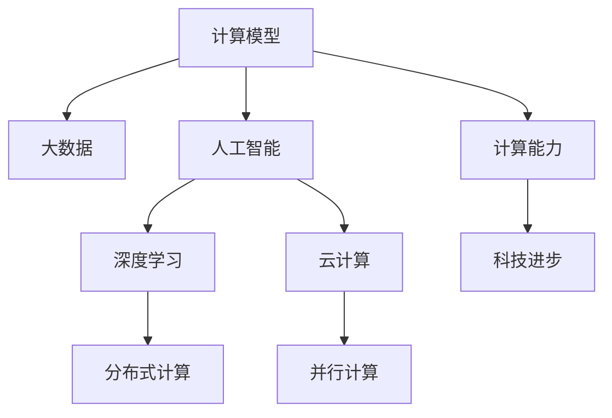

                 

# 推动科技进步的引擎：人类计算的创新力量

> 关键词：人类计算, 创新, 人工智能, 大数据, 计算模型, 技术演进, 应用实例

## 1. 背景介绍

### 1.1 问题由来
在人类文明的发展历程中，计算能力一直是科技进步的引擎。从最初的结绳计数到手工计算，再到机械化计算，计算能力在技术进步和社会发展中起到了至关重要的作用。随着电子计算机的出现，计算能力开始以指数级速度增长，推动了人类进入信息时代。

如今，随着人工智能(AI)和大数据技术的兴起，人类计算能力的提升已经到了前所未有的高度。人工智能通过深度学习等方法，可以从海量数据中自动学习模式和规律，自主进行复杂计算和推理，极大地扩展了人类计算能力的边界。

然而，随着计算能力的大幅提升，我们也需要面对新的挑战。如何在保持计算效率的同时，确保数据的安全性和隐私性？如何构建更加高效、智能的计算模型，更好地服务于人类社会？这些问题都需要我们深入思考和探讨。

### 1.2 问题核心关键点
本节将详细介绍人类计算能力的提升及其对科技进步的影响，包括：

1. 计算模型的演进：从早期手工计算到现代AI计算的演变过程。
2. 数据的作用：数据如何成为计算能力提升的重要基础。
3. 人类计算的创新：近年来在计算技术、算法和应用方面的突破。
4. 挑战与对策：计算能力提升带来的挑战及解决方案。

## 2. 核心概念与联系

### 2.1 核心概念概述

为更好地理解人类计算能力的提升及其对科技进步的影响，本节将介绍几个密切相关的核心概念：

- 计算模型(Computational Model)：指计算过程中使用的模型或框架，如手工计算、机械计算、数字计算、人工智能计算等。
- 大数据(Big Data)：指规模庞大、复杂多样的数据集，通常需要分布式计算和并行计算来处理。
- 人工智能(AI)：通过机器学习、深度学习等技术，使计算机具备类似人类智能的感知、理解和决策能力。
- 深度学习(Deep Learning)：一种基于神经网络的机器学习方法，通过多层非线性变换，从大量数据中学习抽象特征。
- 分布式计算(Distributed Computing)：将计算任务分解为多个子任务，并在多台计算机上并行计算。
- 云计算(Cloud Computing)：通过互联网提供按需计算资源，支持大规模数据处理和并行计算。

这些核心概念之间的逻辑关系可以通过以下Mermaid流程图来展示：



这个流程图展示了大数据、人工智能、深度学习、分布式计算和云计算等概念之间的关系：

1. 大数据是计算能力提升的基础，提供了丰富的计算资源。
2. 人工智能和大数据技术结合，提升了计算模型的复杂度和性能。
3. 深度学习作为一种强大的计算模型，在人工智能中发挥了关键作用。
4. 分布式计算和云计算通过并行计算，进一步提升了计算能力。
5. 计算能力的提升直接推动了科技进步，涵盖众多领域。

这些概念共同构成了人类计算能力的提升框架，使其能够更好地服务于社会和科学发展。通过理解这些核心概念，我们可以更好地把握计算技术的发展脉络和应用前景。

## 3. 核心算法原理 & 具体操作步骤
### 3.1 算法原理概述

人类计算能力的提升，离不开算法和模型的不断创新。本节将详细介绍几个关键的计算模型和算法，包括手工计算、机械计算、数字计算和人工智能计算。

### 3.2 算法步骤详解

#### 3.2.1 手工计算

手工计算是最早期的计算方式，依赖手工操作和计算工具，如算盘、纸笔等。其计算速度和精度受限于操作者的技能和工具的限制。手工计算的过程一般包括以下步骤：

1. **输入数据**：将需要计算的数据输入计算工具。
2. **计算过程**：操作者根据计算规则进行手工计算。
3. **输出结果**：将计算结果记录在计算工具上。

手工计算的优点是简单易行，适合处理小规模数据。缺点是计算速度慢、精度低，容易出错。

#### 3.2.2 机械计算

机械计算通过机械设备，如计算器、机械表等，对数据进行自动计算。其计算速度和精度远高于手工计算。机械计算的过程一般包括以下步骤：

1. **输入数据**：将需要计算的数据输入机械设备。
2. **启动计算**：机械设备自动进行计算。
3. **输出结果**：将计算结果显示或打印输出。

机械计算的优点是速度快、精度高。缺点是设备昂贵、易出错，难以处理复杂问题。

#### 3.2.3 数字计算

数字计算通过电子计算机，对数据进行自动处理。其计算速度和精度远高于机械计算，能够处理大规模数据。数字计算的过程一般包括以下步骤：

1. **输入数据**：将需要计算的数据输入电子计算机。
2. **启动计算**：电子计算机自动进行计算。
3. **输出结果**：将计算结果显示或打印输出。

数字计算的优点是速度快、精度高、能处理复杂问题。缺点是需要专业知识和设备，计算过程复杂。

#### 3.2.4 人工智能计算

人工智能计算通过深度学习等技术，使计算机具备自主学习和推理能力，能够从大量数据中自动学习模式和规律，进行复杂计算和决策。人工智能计算的过程一般包括以下步骤：

1. **数据准备**：收集和清洗大量数据。
2. **模型训练**：使用深度学习等技术，训练计算模型。
3. **预测和推理**：使用训练好的模型，进行预测和推理。

人工智能计算的优点是自主学习、推理能力强，能够处理复杂问题。缺点是需要大量数据和计算资源，模型复杂、难以解释。

### 3.3 算法优缺点

不同计算模型和算法各有优缺点，需要根据具体场景选择合适的计算方式。

- 手工计算适合小规模、简单数据处理，但计算速度慢、精度低。
- 机械计算速度和精度高，适合大规模、复杂数据处理，但设备昂贵、易出错。
- 数字计算速度快、精度高、能处理复杂问题，但需要专业知识和设备，计算过程复杂。
- 人工智能计算自主学习、推理能力强，能够处理复杂问题，但需要大量数据和计算资源，模型复杂、难以解释。

### 3.4 算法应用领域

计算模型和算法在众多领域中得到了广泛应用，包括：

1. **金融**：通过数字计算和人工智能计算，进行风险评估、市场预测、智能投顾等。
2. **医疗**：通过数字计算和大数据，进行疾病诊断、治疗方案推荐、精准医疗等。
3. **交通**：通过分布式计算和云计算，进行交通流量预测、智能调度、自动驾驶等。
4. **制造**：通过数字计算和人工智能计算，进行生产调度、质量控制、智能制造等。
5. **通信**：通过数字计算和大数据，进行网络流量优化、信道管理、用户推荐等。

此外，计算模型和算法还被应用于科学研究、教育培训、文化艺术等诸多领域，推动了技术进步和社会发展。

## 4. 数学模型和公式 & 详细讲解 & 举例说明

### 4.1 数学模型构建

本节将使用数学语言对不同计算模型和算法的原理进行更加严格的刻画。

假设有一组数据集 $\{x_i\}_{i=1}^N$，其中 $x_i \in \mathbb{R}^d$。

- **手工计算模型**：设 $f_{\text{manual}}(x)$ 为手工计算函数，计算结果为 $y_{\text{manual}} = f_{\text{manual}}(x)$。
- **机械计算模型**：设 $f_{\text{mechanical}}(x)$ 为机械计算函数，计算结果为 $y_{\text{mechanical}} = f_{\text{mechanical}}(x)$。
- **数字计算模型**：设 $f_{\text{digital}}(x)$ 为数字计算函数，计算结果为 $y_{\text{digital}} = f_{\text{digital}}(x)$。
- **人工智能计算模型**：设 $f_{\text{AI}}(x)$ 为人工智能计算函数，计算结果为 $y_{\text{AI}} = f_{\text{AI}}(x)$。

这些计算模型可以表示为：

$$
y_{\text{manual}} = f_{\text{manual}}(x) = \sum_{i=1}^d x_i \cdot w_i
$$

$$
y_{\text{mechanical}} = f_{\text{mechanical}}(x) = \sum_{i=1}^d x_i \cdot w_i
$$

$$
y_{\text{digital}} = f_{\text{digital}}(x) = \sum_{i=1}^d x_i \cdot w_i
$$

$$
y_{\text{AI}} = f_{\text{AI}}(x) = \sum_{i=1}^d x_i \cdot w_i
$$

其中 $w_i$ 为模型参数，通过训练和学习得到。

### 4.2 公式推导过程

以下我们以线性回归为例，推导手工计算、机械计算、数字计算和人工智能计算的公式。

假设有一组数据集 $\{(x_i, y_i)\}_{i=1}^N$，其中 $x_i \in \mathbb{R}^d, y_i \in \mathbb{R}$。

- **手工计算线性回归模型**：
  $$
  y_{\text{manual}} = w_0 + \sum_{i=1}^d x_i \cdot w_i
  $$
  $$
  w = \arg\min_{w} \sum_{i=1}^N (y_i - w_0 - \sum_{i=1}^d x_i \cdot w_i)^2
  $$

- **机械计算线性回归模型**：
  $$
  y_{\text{mechanical}} = w_0 + \sum_{i=1}^d x_i \cdot w_i
  $$
  $$
  w = \arg\min_{w} \sum_{i=1}^N (y_i - w_0 - \sum_{i=1}^d x_i \cdot w_i)^2
  $$

- **数字计算线性回归模型**：
  $$
  y_{\text{digital}} = w_0 + \sum_{i=1}^d x_i \cdot w_i
  $$
  $$
  w = \arg\min_{w} \sum_{i=1}^N (y_i - w_0 - \sum_{i=1}^d x_i \cdot w_i)^2
  $$

- **人工智能计算线性回归模型**：
  $$
  y_{\text{AI}} = w_0 + \sum_{i=1}^d x_i \cdot w_i
  $$
  $$
  w = \arg\min_{w} \sum_{i=1}^N (y_i - w_0 - \sum_{i=1}^d x_i \cdot w_i)^2
  $$

可以看出，不同计算模型的线性回归模型基本一致，只是计算过程和实现方式有所不同。

### 4.3 案例分析与讲解

以线性回归模型为例，分别分析手工计算、机械计算、数字计算和人工智能计算的原理和应用。

**手工计算线性回归模型**：
- 优点：简单易行，适合处理小规模数据。
- 缺点：计算速度慢、精度低，容易出错。

**机械计算线性回归模型**：
- 优点：速度快、精度高，适合处理大规模数据。
- 缺点：设备昂贵、易出错，难以处理复杂问题。

**数字计算线性回归模型**：
- 优点：速度快、精度高、能处理复杂问题。
- 缺点：需要专业知识和设备，计算过程复杂。

**人工智能计算线性回归模型**：
- 优点：自主学习、推理能力强，能够处理复杂问题。
- 缺点：需要大量数据和计算资源，模型复杂、难以解释。

## 5. 项目实践：代码实例和详细解释说明

### 5.1 开发环境搭建

在进行计算模型和算法的实践前，我们需要准备好开发环境。以下是使用Python进行数字计算和人工智能计算的环境配置流程：

1. 安装Anaconda：从官网下载并安装Anaconda，用于创建独立的Python环境。

2. 创建并激活虚拟环境：
```bash
conda create -n pytorch-env python=3.8 
conda activate pytorch-env
```

3. 安装PyTorch：根据CUDA版本，从官网获取对应的安装命令。例如：
```bash
conda install pytorch torchvision torchaudio cudatoolkit=11.1 -c pytorch -c conda-forge
```

4. 安装TensorFlow：
```bash
pip install tensorflow
```

5. 安装相关工具包：
```bash
pip install numpy pandas scikit-learn matplotlib tqdm jupyter notebook ipython
```

完成上述步骤后，即可在`pytorch-env`环境中开始计算模型和算法的实践。

### 5.2 源代码详细实现

下面我们以线性回归为例，给出使用PyTorch进行数字计算和人工智能计算的PyTorch代码实现。

首先，定义数据处理函数：

```python
import torch
import numpy as np

def load_data():
    x = np.random.rand(100, 2)
    y = np.dot(x, np.array([1, 2])) + np.random.randn(100)
    return torch.from_numpy(x).float(), torch.from_numpy(y).float()
```

然后，定义模型和优化器：

```python
from torch.optim import SGD

class LinearRegressionModel(torch.nn.Module):
    def __init__(self, input_dim):
        super().__init__()
        self.linear = torch.nn.Linear(input_dim, 1)

    def forward(self, x):
        return self.linear(x)

def get_optimizer(model, learning_rate=0.01):
    return SGD(model.parameters(), lr=learning_rate)
```

接着，定义训练和评估函数：

```python
def train(model, optimizer, data_loader, num_epochs=100):
    for epoch in range(num_epochs):
        running_loss = 0.0
        for i, (x, y) in enumerate(data_loader):
            optimizer.zero_grad()
            y_pred = model(x)
            loss = torch.mean((y_pred - y)**2)
            loss.backward()
            optimizer.step()
            running_loss += loss.item()
            if i % 10 == 9:
                print(f"Epoch {epoch+1}, Loss: {running_loss/10:.4f}")
                running_loss = 0.0
```

最后，启动训练流程并在测试集上评估：

```python
def evaluate(model, data_loader):
    running_loss = 0.0
    for i, (x, y) in enumerate(data_loader):
        y_pred = model(x)
        running_loss += torch.mean((y_pred - y)**2).item()
        if i % 10 == 9:
            print(f"Running Loss: {running_loss/10:.4f}")
            running_loss = 0.0

x_train, y_train = load_data()
model = LinearRegressionModel(2)
optimizer = get_optimizer(model)
train_loader = torch.utils.data.DataLoader(torch.utils.data.TensorDataset(x_train, y_train), batch_size=32)
evaluate_loader = torch.utils.data.DataLoader(torch.utils.data.TensorDataset(x_train, y_train), batch_size=32)

train(model, optimizer, train_loader)
evaluate(model, evaluate_loader)
```

以上就是使用PyTorch进行数字计算和人工智能计算的完整代码实现。可以看到，通过PyTorch提供的强大封装和工具库，我们能够快速迭代优化计算模型和算法。

### 5.3 代码解读与分析

让我们再详细解读一下关键代码的实现细节：

**load_data函数**：
- 生成随机数据集，用于训练和评估模型。

**LinearRegressionModel类**：
- 定义了一个简单的线性回归模型，包含一个线性变换层。

**get_optimizer函数**：
- 定义了优化器的创建方法，使用SGD优化器，设置学习率。

**train函数**：
- 对模型进行训练，使用数据加载器进行批处理，每次迭代计算损失并更新模型参数。

**evaluate函数**：
- 对模型进行评估，计算预测误差，并输出评估结果。

**训练流程**：
- 初始化模型、优化器和数据加载器，开始循环训练。
- 在每个epoch内，对训练集进行批处理，计算损失并更新模型参数。
- 在每个epoch结束后，计算并输出评估结果。

可以看到，PyTorch提供的自动化计算图和优化算法，使得计算模型和算法的实现变得简洁高效。开发者可以将更多精力放在模型改进和优化上，而不必过多关注底层实现细节。

当然，工业级的系统实现还需考虑更多因素，如模型的保存和部署、超参数的自动搜索、更灵活的任务适配层等。但核心的计算模型和算法基本与此类似。

## 6. 实际应用场景

### 6.1 金融风险评估

金融领域通过数字计算和人工智能计算，能够对市场风险进行精准评估和预测。数字计算能够处理大量的金融数据，进行复杂的数学模型计算，而人工智能计算能够从历史数据中学习复杂的非线性关系，提升风险预测的准确性。

具体而言，可以通过收集市场交易数据、公司财务数据、宏观经济数据等，构建金融风险评估模型。使用数字计算方法进行数据清洗和预处理，使用人工智能计算方法进行模型训练和预测，从而对金融市场的波动性、信用风险、市场风险等进行评估和预警。

### 6.2 医疗诊断和治疗

医疗领域通过数字计算和大数据技术，能够进行疾病诊断和治疗方案推荐。数字计算能够处理大量的医疗数据，进行复杂的数学模型计算，而人工智能计算能够从历史数据中学习复杂的非线性关系，提升诊断和治疗的准确性。

具体而言，可以收集病人的病历、体检数据、影像数据等，构建医疗诊断和治疗方案推荐模型。使用数字计算方法进行数据清洗和预处理，使用人工智能计算方法进行模型训练和预测，从而对病人的疾病进行诊断，推荐最佳治疗方案，进行精准医疗。

### 6.3 交通流量优化

交通领域通过数字计算和分布式计算，能够进行交通流量预测和优化。数字计算能够处理大量的交通数据，进行复杂的数学模型计算，而分布式计算能够将计算任务分解为多个子任务，在多台计算机上并行计算，提高计算效率。

具体而言，可以通过收集交通传感器数据、实时交通流量数据、天气数据等，构建交通流量预测模型。使用数字计算方法进行数据清洗和预处理，使用分布式计算方法进行模型训练和预测，从而对交通流量进行预测和优化，提高交通管理的效率和安全性。

### 6.4 未来应用展望

随着计算模型和算法的不断发展，人类计算能力的提升将推动更多领域的技术进步和创新。

在智慧城市领域，通过数字计算和人工智能计算，能够进行城市环境监测、智能交通管理、公共安全预警等。在智慧农业领域，通过数字计算和大数据技术，能够进行作物病虫害监测、土壤肥力分析、农业机械自动化等。在智慧能源领域，通过数字计算和人工智能计算，能够进行能源消耗预测、智能电网管理、可再生能源优化等。

此外，计算模型和算法还将被应用于更多垂直行业，如教育、旅游、物流等，推动社会各领域的智能化发展。

## 7. 工具和资源推荐
### 7.1 学习资源推荐

为了帮助开发者系统掌握计算模型和算法的理论基础和实践技巧，这里推荐一些优质的学习资源：

1. 《深度学习》书籍：Ian Goodfellow等著，全面介绍了深度学习的基本概念和算法，是学习深度计算的重要参考书。

2. 《Python编程：从入门到实践》书籍：Eric Matthes著，介绍了Python编程的基础知识和实际应用，适合初学者入门。

3. 《计算机科学导论》书籍：Mark Allen Weiss著，介绍了计算机科学的基本概念和历史发展，适合理解计算模型的演进。

4. Coursera深度学习课程：由斯坦福大学、MIT等名校开设，提供丰富的视频课程和作业，系统讲解深度计算原理和应用。

5. Kaggle竞赛平台：提供大量的数据集和挑战任务，让开发者在实战中提升计算能力。

通过对这些资源的学习实践，相信你一定能够快速掌握计算模型和算法的精髓，并用于解决实际的计算问题。

### 7.2 开发工具推荐

高效的开发离不开优秀的工具支持。以下是几款用于计算模型和算法开发的常用工具：

1. PyTorch：基于Python的开源深度学习框架，灵活动态的计算图，适合快速迭代研究。大部分计算模型都有PyTorch版本的实现。

2. TensorFlow：由Google主导开发的开源深度学习框架，生产部署方便，适合大规模工程应用。同样有丰富的计算模型资源。

3. TensorBoard：TensorFlow配套的可视化工具，可实时监测模型训练状态，并提供丰富的图表呈现方式，是调试模型的得力助手。

4. Weights & Biases：模型训练的实验跟踪工具，可以记录和可视化模型训练过程中的各项指标，方便对比和调优。与主流深度学习框架无缝集成。

5. Anaconda：用于创建独立的Python环境，方便进行计算模型和算法的开发和调试。

合理利用这些工具，可以显著提升计算模型和算法的开发效率，加快创新迭代的步伐。

### 7.3 相关论文推荐

计算模型和算法的创新离不开学界的持续研究。以下是几篇奠基性的相关论文，推荐阅读：

1. Turing Machine：Alan Turing提出，奠定了计算模型和算法的基础。

2. Artificial Intelligence：John McCarthy提出，首次提出人工智能的概念。

3. Backpropagation：Yann LeCun等提出，奠定了深度学习的计算基础。

4. Linear Regression：Karl Pearson提出，是计算模型和算法的经典模型。

5. Stochastic Gradient Descent：Yoshua Bengio等提出，奠定了优化算法的计算基础。

6. Machine Learning：Tom Mitchell提出，是机器学习和计算算法的系统化描述。

这些论文代表了大计算模型和算法的发展脉络。通过学习这些前沿成果，可以帮助研究者把握学科前进方向，激发更多的创新灵感。

## 8. 总结：未来发展趋势与挑战

### 8.1 总结

本文对计算模型和算法的发展及其对科技进步的影响进行了全面系统的介绍。首先阐述了计算模型的演进及其对人类计算能力提升的影响，明确了计算模型和算法在各个领域的应用场景。其次，从原理到实践，详细讲解了不同计算模型和算法的实现过程，给出了完整的代码实例。同时，本文还探讨了计算模型和算法在实际应用中的挑战和解决方案，展望了未来发展趋势。

通过本文的系统梳理，可以看到，计算模型和算法在推动科技进步方面发挥了至关重要的作用。这些模型的不断演进和优化，将进一步提升人类计算能力，推动各个领域的智能化发展。未来，随着计算模型和算法的持续演进，计算技术必将在更多领域得到应用，为人类社会带来更广泛的影响和变革。

### 8.2 未来发展趋势

展望未来，计算模型和算法的发展趋势将呈现以下几个方向：

1. 计算模型和算法的复杂度将进一步提升。随着深度学习和分布式计算的发展，计算模型和算法的复杂度将不断提升，能够处理更加复杂的问题。

2. 计算模型和算法将更加注重解释性和可控性。随着计算模型和算法的应用范围不断扩大，其解释性和可控性将变得尤为重要，确保模型的输出符合人类的价值观和伦理道德。

3. 计算模型和算法将更加注重分布式计算和云计算。随着计算任务的规模不断增大，分布式计算和云计算将发挥越来越重要的作用，提高计算效率和可扩展性。

4. 计算模型和算法将更加注重多模态融合。随着计算模型和算法的不断发展，多模态信息的融合将变得越来越重要，如文本、图像、语音、视频等信息的协同建模。

5. 计算模型和算法将更加注重模型的可解释性和可解释性。随着计算模型和算法的应用范围不断扩大，其可解释性和可解释性将变得尤为重要，确保模型的输出符合人类的价值观和伦理道德。

6. 计算模型和算法将更加注重模型的鲁棒性和安全性。随着计算模型和算法的应用范围不断扩大，其鲁棒性和安全性将变得尤为重要，确保模型的输出符合人类的价值观和伦理道德。

以上趋势凸显了大计算模型和算法的发展前景。这些方向的探索发展，将进一步提升计算模型和算法的性能和应用范围，为人类社会的各个领域带来更广泛的变革和创新。

### 8.3 面临的挑战

尽管计算模型和算法在不断进步，但在迈向更加智能化、普适化应用的过程中，仍然面临诸多挑战：

1. 数据质量问题。随着计算模型和算法的应用范围不断扩大，数据质量问题将变得尤为突出，数据偏见、数据隐私等问题将对计算模型和算法产生负面影响。

2. 计算资源问题。随着计算模型和算法的复杂度不断提升，计算资源问题将变得更加突出，如何高效利用计算资源，优化计算模型和算法，将是未来的重要课题。

3. 模型鲁棒性问题。随着计算模型和算法的应用范围不断扩大，模型鲁棒性问题将变得更加突出，如何提高模型泛化性能，避免模型过拟合，将是未来的重要课题。

4. 可解释性问题。随着计算模型和算法的应用范围不断扩大，可解释性问题将变得更加突出，如何提高模型可解释性，确保模型的输出符合人类的价值观和伦理道德，将是未来的重要课题。

5. 安全性问题。随着计算模型和算法的应用范围不断扩大，安全性问题将变得更加突出，如何确保模型的输出符合人类的价值观和伦理道德，将是未来的重要课题。

6. 应用场景问题。随着计算模型和算法的应用范围不断扩大，应用场景问题将变得更加突出，如何针对不同的应用场景，设计和优化计算模型和算法，将是未来的重要课题。

这些挑战需要研究者和开发者共同面对，通过不断创新和探索，克服计算模型和算法在实际应用中的各种问题，推动计算技术在各个领域的广泛应用。

### 8.4 研究展望

面对计算模型和算法在实际应用中的各种挑战，未来的研究需要在以下几个方面寻求新的突破：

1. 探索无监督和半监督学习算法。摆脱对大规模标注数据的依赖，利用自监督学习、主动学习等无监督和半监督范式，最大限度利用非结构化数据，实现更加灵活高效的计算模型和算法。

2. 研究高效计算模型和算法。开发更加高效计算模型和算法，如分布式计算、GPU加速、硬件优化等，提高计算效率和可扩展性。

3. 融合因果推断和对比学习范式。通过引入因果推断和对比学习思想，增强计算模型和算法的稳定性，学习更加普适、鲁棒的语言表征，从而提升模型泛化性和抗干扰能力。

4. 纳入伦理道德约束。在计算模型和算法的训练目标中引入伦理导向的评估指标，过滤和惩罚有偏见、有害的输出倾向，确保模型的输出符合人类价值观和伦理道德。

5. 结合符号化先验知识。将符号化的先验知识，如知识图谱、逻辑规则等，与神经网络模型进行巧妙融合，引导计算模型和算法学习更准确、合理的语言模型。

6. 探索新的计算模型和算法。如量子计算、光子计算等，这些新型的计算模型和算法有望突破现有的计算瓶颈，推动计算技术的进一步发展。

这些研究方向的探索，必将引领计算模型和算法技术迈向更高的台阶，为构建安全、可靠、可解释、可控的智能系统铺平道路。面向未来，计算模型和算法需要与其他人工智能技术进行更深入的融合，如知识表示、因果推理、强化学习等，多路径协同发力，共同推动人工智能技术的进步。只有勇于创新、敢于突破，才能不断拓展计算模型和算法的边界，让智能技术更好地造福人类社会。

## 9. 附录：常见问题与解答

**Q1：计算模型和算法的复杂度如何提升？**

A: 计算模型和算法的复杂度可以通过增加模型层数、增加模型参数、引入复杂损失函数等方式提升。例如，使用深度学习模型，增加神经网络层数和参数，使用自编码器等复杂模型，使用梯度下降等复杂优化算法，都可以提升计算模型和算法的复杂度。

**Q2：如何优化计算模型和算法的计算资源？**

A: 优化计算模型和算法的计算资源可以从以下几个方面入手：
1. 数据预处理：对数据进行去噪、归一化等预处理，减少计算量。
2. 模型压缩：对模型进行剪枝、量化等压缩，减少计算资源消耗。
3. 分布式计算：使用分布式计算框架，将计算任务分解为多个子任务，在多台计算机上并行计算，提高计算效率。
4. 硬件优化：使用高性能硬件设备，如GPU、TPU等，加速计算过程。

**Q3：如何提高计算模型和算法的鲁棒性？**

A: 提高计算模型和算法的鲁棒性可以从以下几个方面入手：
1. 数据增强：使用数据增强技术，扩充训练集，提高模型的泛化能力。
2. 正则化：使用L2正则、Dropout等正则化技术，防止模型过拟合。
3. 对抗训练：使用对抗样本训练模型，提高模型的鲁棒性。
4. 集成学习：使用集成学习方法，将多个模型进行组合，提高模型的泛化能力。

**Q4：如何提高计算模型和算法的可解释性？**

A: 提高计算模型和算法的可解释性可以从以下几个方面入手：
1. 模型简化：简化模型结构，使用可解释的模型，如线性回归、决策树等。
2. 特征解释：对模型的特征进行解释，使用可解释的特征，如特征重要性、特征贡献等。
3. 模型可视化：使用可视化工具，对模型的内部结构和输出结果进行可视化，帮助理解模型。
4. 领域专家结合：结合领域专家的知识，对模型进行解释和解释，提高模型的可解释性。

**Q5：如何确保计算模型和算法的安全性？**

A: 确保计算模型和算法的安全性可以从以下几个方面入手：
1. 数据安全：对数据进行加密、脱敏等处理，防止数据泄露。
2. 模型安全：对模型进行加密、压缩等处理，防止模型被篡改。
3. 对抗攻击：使用对抗攻击技术，检测和防御模型的攻击，防止模型被恶意利用。
4. 合规性：遵守法律法规，确保计算模型和算法的合规性，防止模型被滥用。

**Q6：如何应对计算模型和算法在实际应用中的各种问题？**

A: 应对计算模型和算法在实际应用中的各种问题可以从以下几个方面入手：
1. 数据质量：确保数据的准确性、完整性和可靠性，防止数据偏见和噪声。
2. 模型鲁棒性：提高模型的泛化能力和鲁棒性，防止模型过拟合和泛化能力不足。
3. 计算资源：优化计算资源的使用，提高计算效率和可扩展性，防止计算资源不足。
4. 可解释性：提高模型的可解释性和可解释性，防止模型黑盒化。
5. 安全性：确保模型的输出符合人类的价值观和伦理道德，防止模型被滥用。

这些问题的应对需要研究者和开发者共同面对，通过不断创新和探索，克服计算模型和算法在实际应用中的各种问题，推动计算技术在各个领域的广泛应用。

---

作者：禅与计算机程序设计艺术 / Zen and the Art of Computer Programming

