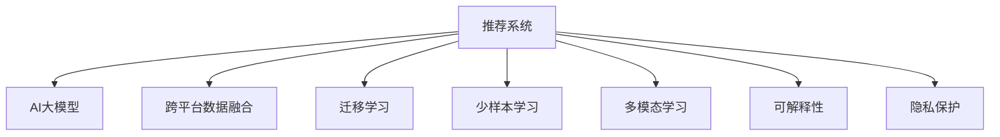

                 

# 推荐系统中AI大模型的跨平台数据融合

## 1. 背景介绍

### 1.1 问题由来

在当前数字经济时代，推荐系统已成为连接用户与内容的桥梁。无论是电商平台、视频网站还是社交平台，都通过推荐算法向用户推荐个性化内容。然而，推荐系统的核心挑战之一是如何高效、准确地整合海量用户行为数据和内容信息，构建精准、多样、多元的推荐结果。

传统推荐系统主要基于用户历史行为、物品属性、时间等因素构建推荐模型。但随着AI大模型的兴起，推荐系统开始引入更为智能化的方式，如深度学习、强化学习、多模态学习等。尤其是近年来，AI大模型如BERT、GPT等在NLP领域的突破性进展，为推荐系统注入了新的活力。

### 1.2 问题核心关键点

AI大模型在推荐系统中的应用，主要体现在以下几个方面：
1. **跨模态学习**：融合文本、图片、视频等多种模态数据，提升推荐结果的多样性。
2. **迁移学习**：利用预训练模型在多个任务上进行微调，获得通用知识表示，适应不同推荐任务。
3. **零样本学习和少样本学习**：通过精妙的Prompt设计，在少有标注数据的情况下生成推荐结果。
4. **可解释性**：通过模型解释技术，让用户理解推荐背后的逻辑和依据，增强信任感。
5. **隐私保护**：在用户隐私保护的前提下，实现个性化推荐，防止数据泄露。

这些关键点在实际推荐系统中，可以显著提高推荐结果的准确性和用户满意度，但也带来了新的挑战，如模型部署、数据隐私保护、解释性增强等。本文将重点探讨如何在大规模推荐系统中，有效融合不同平台的数据，利用AI大模型提升推荐效果。

## 2. 核心概念与联系

### 2.1 核心概念概述

为更好地理解跨平台数据融合在推荐系统中的应用，本节将介绍几个密切相关的核心概念：

- **推荐系统(Recommender System)**：根据用户兴趣和行为，推荐合适内容或商品的系统。推荐系统可以应用于各种数字媒体，如电商、视频、音乐、新闻等。

- **AI大模型(AI Large Model)**：指具有数十亿甚至数百亿参数的深度学习模型，如BERT、GPT、XLNet等。这些模型通过预训练获得了广泛的领域知识和常识，具备强大的学习能力和泛化能力。

- **跨平台数据融合(Cross-Platform Data Fusion)**：指在不同平台、不同来源的海量用户行为数据和内容信息中，提取有价值的信息，构建统一的数据视图，为推荐系统提供更丰富、更精准的输入。

- **迁移学习(Transfer Learning)**：指将一个领域学到的知识迁移到另一个相关领域，如在预训练模型上进行微调，以适应特定推荐任务。

- **少样本学习(Few-shot Learning)**：指在少量标注数据的情况下，模型能够快速适应新任务的学习方法。

- **多模态学习(Multimodal Learning)**：指融合不同模态的数据进行学习，如文本、图像、音频等，以获得更为全面的语义表示。

- **可解释性(Explainability)**：指模型能够解释其决策过程和结果，帮助用户理解推荐的依据和逻辑。

- **隐私保护(Privacy Protection)**：指在推荐系统中保护用户隐私，防止数据泄露和滥用。

这些核心概念之间的逻辑关系可以通过以下Mermaid流程图来展示：



这个流程图展示了大模型在推荐系统中的应用框架，及其与核心概念之间的关系：

1. 推荐系统通过跨平台数据融合获得丰富的输入。
2. 利用AI大模型在预训练和微调中获得通用和任务特定的知识表示。
3. 少样本学习和多模态学习使模型在数据稀缺和多种模态情况下表现良好。
4. 可解释性和隐私保护确保了系统的透明性和安全性。

这些概念共同构成了AI大模型在推荐系统中的主要应用路径，使得推荐系统能够不断提升性能，满足用户的多样化需求。

## 3. 核心算法原理 & 具体操作步骤
### 3.1 算法原理概述

在推荐系统中，AI大模型的跨平台数据融合和应用，本质上是利用模型在不同数据源上的表现，构建综合性的用户画像，进行精准推荐。其核心思想是：

1. **数据收集与清洗**：从不同平台收集用户行为数据和内容数据，进行去重、降噪等预处理操作。
2. **模型融合与训练**：在大模型上进行微调，通过跨平台数据融合获得更丰富的特征表示，适应推荐任务。
3. **推荐策略优化**：利用微调后的模型，结合推荐策略，进行个性化推荐。

### 3.2 算法步骤详解

下面详细介绍AI大模型在推荐系统中的跨平台数据融合和应用的具体操作步骤：

**Step 1: 数据收集与预处理**

1. **数据收集**：从电商平台、社交平台、视频网站等不同平台收集用户行为数据和内容数据。数据类型包括用户的浏览记录、点击记录、评分记录、评论记录等。
2. **数据清洗**：去除无效数据、异常数据，统一数据格式，进行特征提取和归一化处理。

**Step 2: 模型融合与训练**

1. **选择预训练模型**：选择适合推荐任务的预训练模型，如BERT、GPT等。
2. **微调模型**：在预训练模型上进行微调，适应推荐任务。微调过程包括定义任务目标、设置损失函数、优化器等。
3. **跨平台数据融合**：将不同平台的数据进行特征融合，如拼接、加权、拼接后拼接等方法，构建统一的输入。
4. **模型训练**：利用融合后的数据进行模型训练，调整模型参数，提升推荐效果。

**Step 3: 推荐策略优化**

1. **推荐算法设计**：根据推荐任务选择合适的推荐算法，如协同过滤、基于内容的推荐、深度推荐等。
2. **模型集成**：利用微调后的模型，结合推荐算法进行个性化推荐。
3. **评估与优化**：对推荐结果进行评估，根据效果调整模型参数和推荐策略，持续优化推荐系统。

### 3.3 算法优缺点

AI大模型在推荐系统中的跨平台数据融合和应用，具有以下优点：

1. **数据融合能力强**：利用大模型在多种数据源上的表现，构建综合性的用户画像，提升推荐准确性。
2. **通用性高**：预训练模型具备广泛的领域知识，适用于多种推荐任务，可以显著减少从头开发的工作量。
3. **推荐效果优秀**：大模型通过微调适应特定任务，在推荐效果上通常优于传统模型。
4. **可扩展性强**：大模型可以轻松扩展到不同的推荐场景，如电商推荐、视频推荐等。

同时，该方法也存在一些局限性：

1. **计算资源要求高**：预训练模型参数量大，计算和存储资源需求高。
2. **微调对标注数据依赖大**：微调过程需要大量标注数据，获取高质量标注数据的成本较高。
3. **泛化能力受限**：当不同平台数据分布差异较大时，微调模型的泛化性能可能受限。
4. **数据隐私问题**：跨平台数据融合可能涉及用户隐私，数据安全和隐私保护问题需要重视。
5. **可解释性不足**：大模型往往缺乏可解释性，难以理解其推荐逻辑和依据。

尽管存在这些局限性，但AI大模型在推荐系统中的应用仍然带来了显著的提升和改进，值得深入研究和应用。

### 3.4 算法应用领域

AI大模型在推荐系统中的应用领域非常广泛，涵盖了电商推荐、视频推荐、新闻推荐等多个场景。以下是几个典型的应用实例：

**电商推荐**：电商平台利用用户浏览、点击、购买等行为数据，通过大模型进行微调，构建用户画像，推荐相关商品。

**视频推荐**：视频平台根据用户观影历史、评分、点赞等数据，利用大模型进行微调，推荐个性化视频内容。

**新闻推荐**：新闻平台收集用户阅读行为数据，利用大模型进行微调，构建用户兴趣图谱，推荐相关新闻内容。

此外，AI大模型在推荐系统中的应用，还可以扩展到更多领域，如金融、社交、教育等，为不同行业的推荐需求提供高效、精准的解决方案。

## 4. 数学模型和公式 & 详细讲解 & 举例说明

### 4.1 数学模型构建

在推荐系统中，AI大模型的跨平台数据融合和应用，涉及多个数学模型和算法。本节将介绍几个关键数学模型的构建。

**推荐模型**：推荐系统常用的推荐模型包括协同过滤、基于内容的推荐、深度推荐等。其中深度推荐模型利用大模型进行特征提取和表示学习，具有较好的推荐效果。

**损失函数**：常用的损失函数包括均方误差(MSE)、交叉熵损失(Cross-Entropy Loss)等。

**优化器**：常用的优化器包括SGD、Adam、Adagrad等。

**数据融合方法**：常用的数据融合方法包括拼接、加权拼接、拼接后拼接等。

### 4.2 公式推导过程

以下是一些关键公式的推导：

**均方误差损失函数**：

$$
L(y, \hat{y}) = \frac{1}{N}\sum_{i=1}^N (y_i - \hat{y}_i)^2
$$

其中 $y$ 为真实标签，$\hat{y}$ 为模型预测值，$N$ 为样本数。

**交叉熵损失函数**：

$$
L(y, \hat{y}) = -\frac{1}{N}\sum_{i=1}^N y_i\log \hat{y}_i + (1-y_i)\log (1-\hat{y}_i)
$$

**微调优化过程**：

$$
\theta \leftarrow \theta - \eta \nabla_{\theta} L(\theta)
$$

其中 $\theta$ 为模型参数，$\eta$ 为学习率，$\nabla_{\theta} L(\theta)$ 为损失函数对参数的梯度。

**数据融合公式**：

$$
x_{fused} = \lambda_1 x_1 + \lambda_2 x_2
$$

其中 $x_1, x_2$ 为不同平台的数据，$\lambda_1, \lambda_2$ 为不同数据的权重。

### 4.3 案例分析与讲解

以下是一个具体案例的讲解：

**电商推荐系统**：
- **数据收集**：收集用户在电商平台上的浏览、点击、购买等行为数据，以及商品属性信息。
- **数据清洗**：去除无效数据、异常数据，统一数据格式，进行特征提取和归一化处理。
- **模型选择**：选择BERT模型作为预训练模型，利用电商数据进行微调。
- **数据融合**：将用户行为数据和商品属性信息拼接后拼接，构建统一的输入。
- **模型训练**：利用融合后的数据进行模型训练，调整模型参数，提升推荐效果。
- **推荐策略**：结合微调后的模型，进行协同过滤推荐。
- **评估与优化**：对推荐结果进行评估，根据效果调整模型参数和推荐策略，持续优化推荐系统。

## 5. 项目实践：代码实例和详细解释说明

### 5.1 开发环境搭建

在进行AI大模型在推荐系统中的应用实践前，我们需要准备好开发环境。以下是使用Python进行PyTorch开发的环境配置流程：

1. 安装Anaconda：从官网下载并安装Anaconda，用于创建独立的Python环境。

2. 创建并激活虚拟环境：
```bash
conda create -n pytorch-env python=3.8 
conda activate pytorch-env
```

3. 安装PyTorch：根据CUDA版本，从官网获取对应的安装命令。例如：
```bash
conda install pytorch torchvision torchaudio cudatoolkit=11.1 -c pytorch -c conda-forge
```

4. 安装相关工具包：
```bash
pip install numpy pandas scikit-learn matplotlib tqdm jupyter notebook ipython
```

完成上述步骤后，即可在`pytorch-env`环境中开始开发。

### 5.2 源代码详细实现

这里我们以电商推荐系统为例，给出使用PyTorch对BERT模型进行微调的PyTorch代码实现。

首先，定义电商推荐的数据处理函数：

```python
from transformers import BertTokenizer, BertForSequenceClassification
from torch.utils.data import Dataset, DataLoader
import torch

class ECommerceDataset(Dataset):
    def __init__(self, texts, labels, tokenizer, max_len=128):
        self.texts = texts
        self.labels = labels
        self.tokenizer = tokenizer
        self.max_len = max_len
        
    def __len__(self):
        return len(self.texts)
    
    def __getitem__(self, item):
        text = self.texts[item]
        label = self.labels[item]
        
        encoding = self.tokenizer(text, return_tensors='pt', max_length=self.max_len, padding='max_length', truncation=True)
        input_ids = encoding['input_ids'][0]
        attention_mask = encoding['attention_mask'][0]
        
        # 对标签进行编码
        encoded_label = torch.tensor(label, dtype=torch.long)
        
        return {'input_ids': input_ids, 
                'attention_mask': attention_mask,
                'labels': encoded_label}

# 定义标签与id的映射
label2id = {'buy': 0, 'look': 1, 'cart': 2}

# 创建dataset
tokenizer = BertTokenizer.from_pretrained('bert-base-uncased')

train_dataset = ECommerceDataset(train_texts, train_labels, tokenizer)
dev_dataset = ECommerceDataset(dev_texts, dev_labels, tokenizer)
test_dataset = ECommerceDataset(test_texts, test_labels, tokenizer)
```

然后，定义模型和优化器：

```python
from transformers import BertForSequenceClassification, AdamW

model = BertForSequenceClassification.from_pretrained('bert-base-uncased', num_labels=len(label2id))

optimizer = AdamW(model.parameters(), lr=2e-5)
```

接着，定义训练和评估函数：

```python
from torch.utils.data import DataLoader
from tqdm import tqdm
from sklearn.metrics import classification_report

device = torch.device('cuda') if torch.cuda.is_available() else torch.device('cpu')
model.to(device)

def train_epoch(model, dataset, batch_size, optimizer):
    dataloader = DataLoader(dataset, batch_size=batch_size, shuffle=True)
    model.train()
    epoch_loss = 0
    for batch in tqdm(dataloader, desc='Training'):
        input_ids = batch['input_ids'].to(device)
        attention_mask = batch['attention_mask'].to(device)
        labels = batch['labels'].to(device)
        model.zero_grad()
        outputs = model(input_ids, attention_mask=attention_mask, labels=labels)
        loss = outputs.loss
        epoch_loss += loss.item()
        loss.backward()
        optimizer.step()
    return epoch_loss / len(dataloader)

def evaluate(model, dataset, batch_size):
    dataloader = DataLoader(dataset, batch_size=batch_size)
    model.eval()
    preds, labels = [], []
    with torch.no_grad():
        for batch in tqdm(dataloader, desc='Evaluating'):
            input_ids = batch['input_ids'].to(device)
            attention_mask = batch['attention_mask'].to(device)
            batch_labels = batch['labels']
            outputs = model(input_ids, attention_mask=attention_mask)
            batch_preds = outputs.logits.argmax(dim=2).to('cpu').tolist()
            batch_labels = batch_labels.to('cpu').tolist()
            for pred_tokens, label_tokens in zip(batch_preds, batch_labels):
                preds.append(pred_tokens)
                labels.append(label_tokens)
                
    print(classification_report(labels, preds))
```

最后，启动训练流程并在测试集上评估：

```python
epochs = 5
batch_size = 16

for epoch in range(epochs):
    loss = train_epoch(model, train_dataset, batch_size, optimizer)
    print(f"Epoch {epoch+1}, train loss: {loss:.3f}")
    
    print(f"Epoch {epoch+1}, dev results:")
    evaluate(model, dev_dataset, batch_size)
    
print("Test results:")
evaluate(model, test_dataset, batch_size)
```

以上就是使用PyTorch对BERT进行电商推荐任务微调的完整代码实现。可以看到，得益于Transformers库的强大封装，我们可以用相对简洁的代码完成BERT模型的加载和微调。

### 5.3 代码解读与分析

让我们再详细解读一下关键代码的实现细节：

**ECommerceDataset类**：
- `__init__`方法：初始化文本、标签、分词器等关键组件。
- `__len__`方法：返回数据集的样本数量。
- `__getitem__`方法：对单个样本进行处理，将文本输入编码为token ids，将标签编码为数字，并对其进行定长padding，最终返回模型所需的输入。

**label2id字典**：
- 定义了标签与数字id之间的映射关系，用于将标签解码为数字，用于训练过程。

**训练和评估函数**：
- 使用PyTorch的DataLoader对数据集进行批次化加载，供模型训练和推理使用。
- 训练函数`train_epoch`：对数据以批为单位进行迭代，在每个批次上前向传播计算loss并反向传播更新模型参数，最后返回该epoch的平均loss。
- 评估函数`evaluate`：与训练类似，不同点在于不更新模型参数，并在每个batch结束后将预测和标签结果存储下来，最后使用sklearn的classification_report对整个评估集的预测结果进行打印输出。

**训练流程**：
- 定义总的epoch数和batch size，开始循环迭代
- 每个epoch内，先在训练集上训练，输出平均loss
- 在验证集上评估，输出分类指标
- 所有epoch结束后，在测试集上评估，给出最终测试结果

可以看到，PyTorch配合Transformers库使得BERT微调的代码实现变得简洁高效。开发者可以将更多精力放在数据处理、模型改进等高层逻辑上，而不必过多关注底层的实现细节。

当然，工业级的系统实现还需考虑更多因素，如模型的保存和部署、超参数的自动搜索、更灵活的任务适配层等。但核心的微调范式基本与此类似。

## 6. 实际应用场景

### 6.1 智能客服系统

基于AI大模型的推荐系统，可以广泛应用于智能客服系统的构建。传统客服往往需要配备大量人力，高峰期响应缓慢，且一致性和专业性难以保证。而使用微调后的推荐系统，可以7x24小时不间断服务，快速响应客户咨询，用自然流畅的语言解答各类常见问题。

在技术实现上，可以收集企业内部的历史客服对话记录，将问题和最佳答复构建成监督数据，在此基础上对预训练推荐模型进行微调。微调后的推荐模型能够自动理解用户意图，匹配最合适的答复模板进行回复。对于客户提出的新问题，还可以接入检索系统实时搜索相关内容，动态组织生成回答。如此构建的智能客服系统，能大幅提升客户咨询体验和问题解决效率。

### 6.2 金融舆情监测

金融机构需要实时监测市场舆论动向，以便及时应对负面信息传播，规避金融风险。传统的人工监测方式成本高、效率低，难以应对网络时代海量信息爆发的挑战。基于AI大模型的推荐系统，可以实现自动舆情监测和预警，提高金融机构的风险控制能力。

具体而言，可以收集金融领域相关的新闻、报道、评论等文本数据，并对其进行情感标注。在此基础上对预训练语言模型进行微调，使其能够自动判断文本的情感倾向，实时监测市场舆情。一旦发现负面信息激增等异常情况，系统便会自动预警，帮助金融机构快速应对潜在风险。

### 6.3 个性化推荐系统

当前的推荐系统往往只依赖用户的历史行为数据进行物品推荐，无法深入理解用户的真实兴趣偏好。基于AI大模型的推荐系统，可以更好地挖掘用户行为背后的语义信息，从而提供更精准、多样的推荐内容。

在实践中，可以收集用户浏览、点击、评论、分享等行为数据，提取和用户交互的物品标题、描述、标签等文本内容。将文本内容作为模型输入，用户的后续行为（如是否点击、购买等）作为监督信号，在此基础上微调预训练语言模型。微调后的模型能够从文本内容中准确把握用户的兴趣点。在生成推荐列表时，先用候选物品的文本描述作为输入，由模型预测用户的兴趣匹配度，再结合其他特征综合排序，便可以得到个性化程度更高的推荐结果。

### 6.4 未来应用展望

随着AI大模型的不断发展，基于推荐系统的跨平台数据融合技术将不断进步，带来更多创新应用。

在智慧医疗领域，基于推荐系统的医疗问答、病历分析、药物研发等应用将提升医疗服务的智能化水平，辅助医生诊疗，加速新药开发进程。

在智能教育领域，推荐系统可应用于作业批改、学情分析、知识推荐等方面，因材施教，促进教育公平，提高教学质量。

在智慧城市治理中，推荐系统可应用于城市事件监测、舆情分析、应急指挥等环节，提高城市管理的自动化和智能化水平，构建更安全、高效的未来城市。

此外，在企业生产、社会治理、文娱传媒等众多领域，基于推荐系统的AI大模型应用也将不断涌现，为经济社会发展注入新的动力。相信随着技术的日益成熟，跨平台数据融合技术必将引领推荐系统进入新的发展阶段，进一步提升推荐效果和用户体验。

## 7. 工具和资源推荐

### 7.1 学习资源推荐

为了帮助开发者系统掌握AI大模型在推荐系统中的应用，这里推荐一些优质的学习资源：

1. 《推荐系统实战》系列博文：由AI大模型专家撰写，深入浅出地介绍了推荐系统的工作原理、核心算法和实际应用。

2. 《深度学习推荐系统》课程：斯坦福大学开设的推荐系统课程，涵盖了推荐系统的基础、算法和实现。

3. 《Hands-On Recommendation Systems》书籍：详细介绍了推荐系统的算法和应用，包括基于内容的推荐、协同过滤、深度推荐等。

4. PyTorch官方文档：PyTorch的官方文档，提供了丰富的深度学习模型和推荐系统实现的样例代码。

5. Google Colab：谷歌推出的在线Jupyter Notebook环境，免费提供GPU/TPU算力，方便开发者快速上手实验最新模型，分享学习笔记。

通过对这些资源的学习实践，相信你一定能够快速掌握AI大模型在推荐系统中的应用，并用于解决实际的推荐问题。

### 7.2 开发工具推荐

高效的开发离不开优秀的工具支持。以下是几款用于AI大模型在推荐系统中的开发工具：

1. PyTorch：基于Python的开源深度学习框架，灵活动态的计算图，适合快速迭代研究。大部分预训练语言模型都有PyTorch版本的实现。

2. TensorFlow：由Google主导开发的开源深度学习框架，生产部署方便，适合大规模工程应用。同样有丰富的预训练语言模型资源。

3. Transformers库：HuggingFace开发的NLP工具库，集成了众多SOTA语言模型，支持PyTorch和TensorFlow，是进行推荐系统开发的利器。

4. Weights & Biases：模型训练的实验跟踪工具，可以记录和可视化模型训练过程中的各项指标，方便对比和调优。与主流深度学习框架无缝集成。

5. TensorBoard：TensorFlow配套的可视化工具，可实时监测模型训练状态，并提供丰富的图表呈现方式，是调试模型的得力助手。

6. Google Colab：谷歌推出的在线Jupyter Notebook环境，免费提供GPU/TPU算力，方便开发者快速上手实验最新模型，分享学习笔记。

合理利用这些工具，可以显著提升AI大模型在推荐系统中的应用效率，加快创新迭代的步伐。

### 7.3 相关论文推荐

AI大模型在推荐系统中的应用源于学界的持续研究。以下是几篇奠基性的相关论文，推荐阅读：

1. Deep Collaborative Filtering with Hierarchical Matrix Factorization：提出了基于层次矩阵分解的协同过滤算法，提高了推荐系统的精度和效率。

2. Beyond Matrix Factorization: A Canonical Tensor Factorization Framework for Recommendations：通过引入张量分解，提升了推荐系统的模型表达能力。

3. Attention Is All You Need：提出了Transformer结构，开启了深度学习在推荐系统中的应用。

4. Query2Vec：通过向量表示学习，将用户查询与商品特征进行匹配，提升了推荐系统的效果。

5. Cross-Attention Recommendation Models：通过引入跨注意力机制，提升了推荐系统的多样性和公平性。

这些论文代表了大模型在推荐系统中的应用研究，展示了从传统协同过滤到深度学习的推荐系统发展脉络。通过学习这些前沿成果，可以帮助研究者把握学科前进方向，激发更多的创新灵感。

## 8. 总结：未来发展趋势与挑战

### 8.1 研究成果总结

本文对AI大模型在推荐系统中的应用进行了全面系统的介绍。首先，阐述了推荐系统的背景和AI大模型的兴起。其次，从原理到实践，详细讲解了AI大模型的跨平台数据融合和应用。最后，展示了AI大模型在推荐系统中的实际应用场景，探讨了未来的发展趋势和面临的挑战。

通过本文的系统梳理，可以看到，AI大模型在推荐系统中的应用，通过跨平台数据融合和微调，显著提升了推荐系统的推荐效果和用户体验。未来的AI大模型推荐系统，将在更广泛的应用场景中发挥更大的作用，推动智能推荐技术的发展。

### 8.2 未来发展趋势

展望未来，AI大模型在推荐系统中的应用将呈现以下几个发展趋势：

1. **模型规模不断增大**：随着算力资源的提升，AI大模型的参数量将继续增长，具备更强大的特征提取和表示能力。

2. **多模态融合深化**：推荐系统将进一步融合文本、图片、视频等多种模态的数据，提升推荐结果的多样性和丰富度。

3. **跨领域迁移能力增强**：AI大模型在多个推荐任务上的迁移学习能力将不断增强，适应更多领域和场景。

4. **持续学习和增量学习**：推荐系统将具备持续学习的能力，能够不断吸收新数据，更新推荐结果。

5. **隐私保护和数据安全**：推荐系统将更加注重用户隐私保护，采用差分隐私等技术，保障数据安全和隐私。

6. **解释性增强**：推荐系统将引入可解释性技术，帮助用户理解推荐背后的逻辑和依据，增强系统的可信度。

以上趋势凸显了AI大模型在推荐系统中的应用前景，未来将带来更多创新应用和技术突破。

### 8.3 面临的挑战

尽管AI大模型在推荐系统中的应用带来了显著的提升，但也面临一些挑战：

1. **计算资源需求高**：预训练模型参数量大，对算力和存储资源要求高。

2. **数据隐私问题**：跨平台数据融合涉及用户隐私保护，需要采用差分隐私等技术保障数据安全。

3. **模型泛化能力受限**：当不同平台数据分布差异较大时，模型泛化性能可能受限。

4. **解释性不足**：AI大模型往往缺乏可解释性，难以理解其推荐逻辑和依据。

5. **性能优化困难**：AI大模型推理速度慢、内存占用大，优化难度较高。

尽管存在这些挑战，但AI大模型在推荐系统中的应用仍然带来了显著的提升和改进，值得深入研究和应用。

### 8.4 研究展望

面向未来，AI大模型在推荐系统中的应用需要进一步突破：

1. **参数高效微调**：开发更加参数高效的微调方法，在固定大部分预训练参数的情况下，只更新极少量的任务相关参数，提高微调效率。

2. **多任务学习和联合训练**：通过多任务学习和联合训练，在单一模型上进行多个任务的微调，提高模型利用率和泛化能力。

3. **混合模型和多模型融合**：引入混合模型和多模型融合技术，提升推荐系统的鲁棒性和性能。

4. **知识图谱与深度学习融合**：将知识图谱与深度学习技术结合，增强推荐系统的语义理解和推理能力。

5. **动态推荐与实时性优化**：研究动态推荐和实时性优化技术，提升推荐系统的响应速度和用户体验。

6. **模型压缩与加速**：采用模型压缩与加速技术，提升推荐系统的部署效率和用户体验。

7. **公平与多样性优化**：研究公平与多样性优化技术，提升推荐系统的多样性和公平性。

这些研究方向将进一步推动AI大模型在推荐系统中的应用，为推荐系统的智能化、普适化发展提供新的动力。相信在未来的研究中，AI大模型将不断突破，推动推荐系统迈向新的高度。

## 9. 附录：常见问题与解答

**Q1：AI大模型在推荐系统中如何处理用户隐私问题？**

A: 用户隐私保护是AI大模型在推荐系统应用中面临的重要问题。推荐系统可以采用以下方法：

1. **差分隐私**：通过在数据采集和处理过程中加入噪声，保护用户隐私。

2. **数据脱敏**：对敏感信息进行脱敏处理，如对姓名、地址等进行模糊处理。

3. **联邦学习**：在分布式环境下，对模型在各个节点上进行训练，避免数据集中存储。

4. **匿名化**：对用户数据进行匿名化处理，防止数据泄露。

5. **隐私保护模型**：采用隐私保护模型，如基于同态加密的模型，保护用户数据隐私。

通过这些方法，可以在保护用户隐私的前提下，构建高效的推荐系统，增强系统的可信度。

**Q2：AI大模型在推荐系统中如何进行跨平台数据融合？**

A: AI大模型在推荐系统中的跨平台数据融合主要包括以下几个步骤：

1. **数据收集**：从不同平台收集用户行为数据和内容数据。

2. **数据清洗**：去除无效数据、异常数据，统一数据格式，进行特征提取和归一化处理。

3. **模型选择**：选择适合推荐任务的预训练模型，如BERT、GPT等。

4. **微调模型**：在预训练模型上进行微调，适应推荐任务。微调过程包括定义任务目标、设置损失函数、优化器等。

5. **数据融合**：将不同平台的数据进行特征融合，如拼接、加权拼接、拼接后拼接等方法，构建统一的输入。

6. **模型训练**：利用融合后的数据进行模型训练，调整模型参数，提升推荐效果。

7. **推荐策略优化**：结合微调后的模型，进行个性化推荐。

8. **评估与优化**：对推荐结果进行评估，根据效果调整模型参数和推荐策略，持续优化推荐系统。

通过以上步骤，AI大模型可以高效地进行跨平台数据融合，提升推荐系统的性能和用户体验。

**Q3：AI大模型在推荐系统中的应用有哪些局限性？**

A: AI大模型在推荐系统中的应用，虽然带来了显著的提升，但也存在一些局限性：

1. **计算资源需求高**：预训练模型参数量大，对算力和存储资源要求高。

2. **数据隐私问题**：跨平台数据融合涉及用户隐私保护，需要采用差分隐私等技术保障数据安全。

3. **模型泛化能力受限**：当不同平台数据分布差异较大时，模型泛化性能可能受限。

4. **解释性不足**：AI大模型往往缺乏可解释性，难以理解其推荐逻辑和依据。

5. **性能优化困难**：AI大模型推理速度慢、内存占用大，优化难度较高。

尽管存在这些挑战，但AI大模型在推荐系统中的应用仍然带来了显著的提升和改进，值得深入研究和应用。

**Q4：AI大模型在推荐系统中的应用前景如何？**

A: AI大模型在推荐系统中的应用前景非常广阔，主要体现在以下几个方面：

1. **个性化推荐**：AI大模型能够根据用户历史行为、兴趣偏好等数据，提供个性化推荐，提升用户体验。

2. **多模态融合**：AI大模型可以融合文本、图片、视频等多种模态数据，提升推荐结果的多样性和丰富度。

3. **跨领域迁移**：AI大模型具备跨领域迁移能力，适应更多领域和场景，提升推荐系统的应用范围。

4. **实时推荐**：AI大模型可以实时处理新数据，动态调整推荐结果，提升推荐系统的响应速度和用户体验。

5. **公平与多样性**：AI大模型能够考虑多维度的用户需求，提升推荐系统的公平性和多样性。

综上所述，AI大模型在推荐系统中的应用前景广阔，将在更多领域带来新的突破和创新。

**Q5：AI大模型在推荐系统中的可解释性问题如何解决？**

A: 在推荐系统中，AI大模型的可解释性是一个重要问题。为了解决这一问题，可以采用以下方法：

1. **模型解释技术**：采用模型解释技术，如LIME、SHAP等，帮助用户理解推荐背后的逻辑和依据。

2. **可解释性模型**：选择可解释性强的模型，如规则驱动的推荐系统，增强系统的可信度。

3. **数据可视化**：利用数据可视化技术，展示推荐系统的决策过程和特征重要性。

4. **交互式推荐系统**：设计交互式推荐系统，让用户参与推荐过程，增强系统的可解释性。

5. **用户反馈机制**：引入用户反馈机制，根据用户反馈调整推荐策略，提升系统的可解释性。

通过这些方法，可以有效解决AI大模型在推荐系统中的可解释性问题，增强系统的透明度和可信度。

**Q6：AI大模型在推荐系统中的参数高效微调方法有哪些？**

A: AI大模型在推荐系统中的参数高效微调方法主要有以下几种：

1. **Adapter**：通过在预训练模型顶层添加可微调的Adapter层，只更新少量参数。

2. **剪枝**：通过剪枝技术，去除不必要的参数，提高模型效率。

3. **知识蒸馏**：通过知识蒸馏技术，利用预训练模型和微调模型进行知识转移，减少微调参数。

4. **迁移学习**：利用预训练模型在不同任务上的迁移学习能力，减少微调参数。

5. **多任务学习**：在单一模型上进行多个任务的微调，提高模型利用率和泛化能力。

这些方法可以在保持模型性能的前提下，显著降低微调参数量，提高模型效率和可扩展性。

通过上述问题的解答，相信你对AI大模型在推荐系统中的应用有了更深入的理解，也看到了其广阔的前景和挑战。希望这些内容能够为你提供帮助，进一步推动AI大模型在推荐系统中的研究和应用。

---

作者：禅与计算机程序设计艺术 / Zen and the Art of Computer Programming

