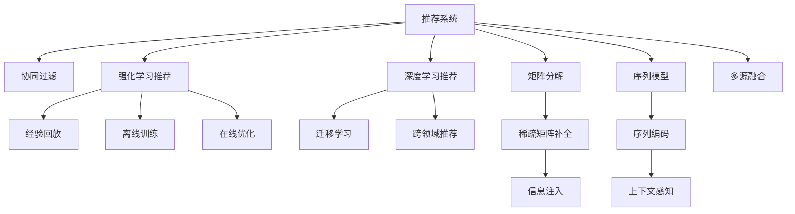

                 

## 1. 背景介绍

### 1.1 问题由来
推荐系统在电商、社交、视频等众多领域得到了广泛应用，极大地提升了用户体验和满意度。然而，在实际应用中，推荐系统往往需要积累大量的用户行为数据才能准确地进行个性化推荐。对于新用户或者新商品，由于缺乏足够的历史数据，推荐系统的表现往往不尽如人意，这就是所谓的“冷启动问题”。

冷启动问题对推荐系统的挑战性极大，其核心在于如何有效利用已有用户行为数据和外部信息（如商品标签、用户画像等）来为新用户或新商品提供高质量的推荐。

### 1.2 问题核心关键点
冷启动问题的解决，主要分为用户冷启动和商品冷启动两个方面。解决冷启动问题的关键在于：
1. **有效利用已有数据**：尽可能利用已有的用户行为数据和商品标签等外部信息，提升新用户或新商品的推荐效果。
2. **引入多样化信息**：将更多种类的数据源和信息类型融合到推荐系统中，丰富模型的输入特征。
3. **创新算法技术**：探索基于协同过滤、矩阵分解等不同推荐算法的新技术，提升推荐系统的泛化能力和鲁棒性。
4. **强化学习应用**：利用强化学习算法，引导推荐系统逐步学习有效的推荐策略，减少对初始数据和模型的依赖。

## 2. 核心概念与联系

### 2.1 核心概念概述

为更好地理解冷启动问题及其解决方案，本节将介绍几个密切相关的核心概念：

- **推荐系统**：使用用户历史行为数据，结合商品特征和外部信息，为用户推荐感兴趣的商品或内容。
- **协同过滤**：基于用户相似度或物品相似度，从相似用户或物品中推荐新商品或内容。
- **矩阵分解**：将用户和商品表示为向量，通过矩阵分解技术，提取用户和商品的潜在语义信息。
- **序列模型**：使用序列模型（如RNN、LSTM）来捕捉用户行为的时序特征，提升推荐效果。
- **深度学习推荐**：使用深度神经网络对用户和商品进行建模，提取高级语义特征，提升推荐精度。
- **强化学习推荐**：利用强化学习算法，引导推荐系统逐步学习最优推荐策略，减少对初始数据的依赖。

这些核心概念之间的逻辑关系可以通过以下Mermaid流程图来展示：



这个流程图展示了一些关键推荐技术之间的关联性：

1. 推荐系统通过多种技术（协同过滤、矩阵分解、序列模型等）提取用户和商品的特征信息。
2. 矩阵分解和序列模型可以处理高维稀疏数据，适用于冷启动问题。
3. 深度学习推荐可以捕捉复杂的用户行为模式，提升推荐效果。
4. 强化学习推荐通过逐步学习，能够应对新的用户和商品。
5. 多源融合和多领域推荐可以利用更多信息源和知识域，提升推荐系统的泛化能力。

## 3. 核心算法原理 & 具体操作步骤

### 3.1 算法原理概述

冷启动问题通常分为用户冷启动和商品冷启动两个方面。本节将详细介绍如何通过协同过滤、矩阵分解和深度学习等算法来解决冷启动问题。

#### 3.1.1 协同过滤推荐

协同过滤是一种基于用户行为相似度或商品相似度进行推荐的经典算法。其核心思想是：通过用户的历史行为或对商品的评分，找到相似用户或商品，进而为当前用户推荐相似用户或商品未评分过的商品。

协同过滤可以分为基于用户的协同过滤和基于物品的协同过滤两种方式。

#### 3.1.2 矩阵分解推荐

矩阵分解是一种将用户和商品表示为向量，通过矩阵分解技术，提取用户和商品的潜在语义信息的推荐方法。其核心思想是：将用户和商品视为两个矩阵，通过矩阵分解技术，将它们表示为低维向量，再通过向量的内积计算相似度，从而推荐商品。

常用的矩阵分解算法包括奇异值分解（SVD）和基于梯度的矩阵分解算法（如ALS）。

#### 3.1.3 深度学习推荐

深度学习推荐通过深度神经网络对用户和商品进行建模，提取高级语义特征，提升推荐精度。其核心思想是：利用深度学习模型，对用户和商品进行编码表示，再通过多层的非线性映射，提取复杂的用户行为模式，提升推荐效果。

深度学习推荐模型包括基于深度学习的协同过滤模型（如Presto）和基于深度学习的序列模型（如RNN、LSTM）。

### 3.2 算法步骤详解

#### 3.2.1 协同过滤推荐

1. **构建用户-商品评分矩阵**：收集用户对商品的历史评分数据，构建用户-商品评分矩阵 $R \in \mathbb{R}^{m \times n}$，其中 $m$ 为用户数，$n$ 为商品数。
2. **计算相似度**：使用余弦相似度或皮尔逊相关系数等方法，计算用户-用户相似度或商品-商品相似度。
3. **推荐商品**：根据相似度，为当前用户推荐未评分过的商品。

#### 3.2.2 矩阵分解推荐

1. **构建用户-商品评分矩阵**：收集用户对商品的历史评分数据，构建用户-商品评分矩阵 $R \in \mathbb{R}^{m \times n}$，其中 $m$ 为用户数，$n$ 为商品数。
2. **矩阵分解**：通过奇异值分解（SVD）或基于梯度的矩阵分解算法（如ALS），将用户-商品评分矩阵分解为 $P \in \mathbb{R}^{m \times k}$ 和 $Q \in \mathbb{R}^{k \times n}$，其中 $k$ 为分解后的维度。
3. **用户和商品表示**：使用矩阵分解后的用户表示 $P$ 和商品表示 $Q$，计算用户和商品的潜在语义信息。
4. **计算相似度**：通过向量内积计算用户和商品的相似度。
5. **推荐商品**：根据相似度，为当前用户推荐未评分过的商品。

#### 3.2.3 深度学习推荐

1. **构建用户-商品评分矩阵**：收集用户对商品的历史评分数据，构建用户-商品评分矩阵 $R \in \mathbb{R}^{m \times n}$，其中 $m$ 为用户数，$n$ 为商品数。
2. **深度模型构建**：使用深度神经网络对用户和商品进行建模，提取高级语义特征。
3. **训练模型**：使用用户-商品评分矩阵 $R$ 训练深度模型，优化模型参数。
4. **用户和商品表示**：使用训练后的深度模型，对用户和商品进行编码表示。
5. **计算相似度**：通过向量内积计算用户和商品的相似度。
6. **推荐商品**：根据相似度，为当前用户推荐未评分过的商品。

### 3.3 算法优缺点

#### 3.3.1 协同过滤推荐

**优点**：
- 简单易实现，不需要额外的外部信息。
- 适用于稠密用户行为数据，能够快速计算用户-用户和商品-商品的相似度。

**缺点**：
- 受限于用户行为数据的稀疏性，难以处理新用户或新商品。
- 缺乏可解释性，难以理解推荐逻辑。

#### 3.3.2 矩阵分解推荐

**优点**：
- 能够处理高维稀疏数据，适用于冷启动问题。
- 提取用户和商品的潜在语义信息，提高推荐效果。

**缺点**：
- 需要较长时间进行模型训练和参数优化。
- 对输入数据的分布和噪声敏感，需要仔细处理异常值和噪声。

#### 3.3.3 深度学习推荐

**优点**：
- 能够捕捉复杂的用户行为模式，提高推荐精度。
- 具有良好的泛化能力和鲁棒性，适用于多源融合和跨领域推荐。

**缺点**：
- 模型复杂度高，需要大量的计算资源和时间。
- 需要大量的标注数据进行模型训练，难以快速适应新用户或新商品。

### 3.4 算法应用领域

冷启动问题在推荐系统的各个应用领域中都有体现，主要包括以下几个方面：

- **电商推荐**：为电商用户推荐新商品，为新用户推荐相似商品，提升用户购物体验。
- **内容推荐**：为用户推荐新视频、文章、音乐等内容，为新用户推荐相关内容，增加用户粘性。
- **社交推荐**：为社交平台用户推荐新朋友或新内容，为新用户推荐相关朋友或内容，提升用户社交体验。
- **金融推荐**：为金融用户推荐新产品或服务，为新用户推荐相关产品或服务，提升用户满意度。
- **旅游推荐**：为旅游用户推荐新景点或线路，为新用户推荐相关景点或线路，提升用户旅游体验。

## 4. 数学模型和公式 & 详细讲解 & 举例说明

### 4.1 数学模型构建

为更好地理解冷启动问题的数学模型和推荐算法，本节将详细介绍推荐系统的核心数学模型和推荐算法的数学表达。

#### 4.1.1 协同过滤推荐

**用户-商品评分矩阵**：
$$ R \in \mathbb{R}^{m \times n} $$
其中，$R_{ui}$ 表示用户 $u$ 对商品 $i$ 的评分。

**余弦相似度**：
$$ \text{similarity}_{u,v} = \cos(\theta) = \frac{A_u \cdot A_v}{||A_u|| ||A_v||} $$
其中，$A_u$ 和 $A_v$ 分别表示用户 $u$ 和用户 $v$ 的评分向量。

**基于用户的协同过滤推荐**：
$$ \hat{R}_{iu} = \sum_{j \in \mathcal{N}_u} R_{ij} \times \text{similarity}_{u,j} $$
其中，$\mathcal{N}_u$ 表示与用户 $u$ 相似的所有用户集合。

**基于物品的协同过滤推荐**：
$$ \hat{R}_{iu} = \sum_{j \in \mathcal{N}_i} R_{uj} \times \text{similarity}_{i,j} $$
其中，$\mathcal{N}_i$ 表示与商品 $i$ 相似的所有商品集合。

#### 4.1.2 矩阵分解推荐

**用户-商品评分矩阵**：
$$ R \in \mathbb{R}^{m \times n} $$
其中，$R_{ui}$ 表示用户 $u$ 对商品 $i$ 的评分。

**奇异值分解（SVD）**：
$$ R \approx \tilde{P} \times \tilde{Q} $$
其中，$\tilde{P} \in \mathbb{R}^{m \times k}$ 为用户表示矩阵，$\tilde{Q} \in \mathbb{R}^{k \times n}$ 为商品表示矩阵，$k$ 为分解后的维度。

**用户和商品表示**：
$$ \hat{P}_u = \tilde{P}_u $$
$$ \hat{Q}_i = \tilde{Q}_i $$
其中，$\hat{P}_u$ 表示用户 $u$ 的表示向量，$\hat{Q}_i$ 表示商品 $i$ 的表示向量。

**计算相似度**：
$$ \text{similarity}_{u,v} = \langle \hat{P}_u, \hat{Q}_v \rangle $$
其中，$\langle \cdot, \cdot \rangle$ 表示向量内积。

**推荐商品**：
$$ \hat{R}_{iu} = \langle \hat{P}_u, \hat{Q}_i \rangle $$

#### 4.1.3 深度学习推荐

**深度神经网络模型**：
$$ F_{u,i} = \text{MLP}_u(x_u, x_i) $$
其中，$x_u$ 和 $x_i$ 分别表示用户和商品的特征向量，$\text{MLP}_u$ 表示用户的深度神经网络模型。

**训练模型**：
$$ \theta = \arg\min_{\theta} \sum_{u=1}^{m} \sum_{i=1}^{n} (R_{ui} - F_{u,i})^2 $$
其中，$\theta$ 为模型参数。

**用户和商品表示**：
$$ \hat{x}_u = \text{MLP}_u(x_u) $$
$$ \hat{x}_i = \text{MLP}_i(x_i) $$
其中，$\hat{x}_u$ 和 $\hat{x}_i$ 分别表示用户 $u$ 和商品 $i$ 的编码表示。

**计算相似度**：
$$ \text{similarity}_{u,v} = \langle \hat{x}_u, \hat{x}_v \rangle $$

**推荐商品**：
$$ \hat{R}_{iu} = F_{u,i} $$

### 4.2 公式推导过程

#### 4.2.1 协同过滤推荐

**余弦相似度推导**：
$$ \text{similarity}_{u,v} = \cos(\theta) = \frac{A_u \cdot A_v}{||A_u|| ||A_v||} $$
其中，$A_u = [R_{u1}, R_{u2}, \ldots, R_{un}]^T$，$A_v = [R_{v1}, R_{v2}, \ldots, R_{vn}]^T$。

**基于用户的协同过滤推荐推导**：
$$ \hat{R}_{iu} = \sum_{j \in \mathcal{N}_u} R_{ij} \times \text{similarity}_{u,j} = \sum_{j \in \mathcal{N}_u} R_{ij} \times \frac{A_u \cdot A_j}{||A_u|| ||A_j||} $$
其中，$\mathcal{N}_u$ 表示与用户 $u$ 相似的所有用户集合。

**基于物品的协同过滤推荐推导**：
$$ \hat{R}_{iu} = \sum_{j \in \mathcal{N}_i} R_{uj} \times \text{similarity}_{i,j} = \sum_{j \in \mathcal{N}_i} R_{uj} \times \frac{A_i \cdot A_j}{||A_i|| ||A_j||} $$
其中，$\mathcal{N}_i$ 表示与商品 $i$ 相似的所有商品集合。

#### 4.2.2 矩阵分解推荐

**奇异值分解推导**：
$$ R \approx \tilde{P} \times \tilde{Q} $$
其中，$\tilde{P} \in \mathbb{R}^{m \times k}$ 为用户表示矩阵，$\tilde{Q} \in \mathbb{R}^{k \times n}$ 为商品表示矩阵，$k$ 为分解后的维度。

**用户和商品表示推导**：
$$ \hat{P}_u = \tilde{P}_u $$
$$ \hat{Q}_i = \tilde{Q}_i $$
其中，$\hat{P}_u$ 表示用户 $u$ 的表示向量，$\hat{Q}_i$ 表示商品 $i$ 的表示向量。

**计算相似度推导**：
$$ \text{similarity}_{u,v} = \langle \hat{P}_u, \hat{Q}_v \rangle $$
其中，$\langle \cdot, \cdot \rangle$ 表示向量内积。

**推荐商品推导**：
$$ \hat{R}_{iu} = \langle \hat{P}_u, \hat{Q}_i \rangle $$

#### 4.2.3 深度学习推荐

**深度神经网络模型推导**：
$$ F_{u,i} = \text{MLP}_u(x_u, x_i) $$
其中，$x_u$ 和 $x_i$ 分别表示用户和商品的特征向量，$\text{MLP}_u$ 表示用户的深度神经网络模型。

**训练模型推导**：
$$ \theta = \arg\min_{\theta} \sum_{u=1}^{m} \sum_{i=1}^{n} (R_{ui} - F_{u,i})^2 $$
其中，$\theta$ 为模型参数。

**用户和商品表示推导**：
$$ \hat{x}_u = \text{MLP}_u(x_u) $$
$$ \hat{x}_i = \text{MLP}_i(x_i) $$
其中，$\hat{x}_u$ 和 $\hat{x}_i$ 分别表示用户 $u$ 和商品 $i$ 的编码表示。

**计算相似度推导**：
$$ \text{similarity}_{u,v} = \langle \hat{x}_u, \hat{x}_v \rangle $$

**推荐商品推导**：
$$ \hat{R}_{iu} = F_{u,i} $$

### 4.3 案例分析与讲解

**案例一：基于协同过滤的电商推荐**

在电商平台上，某新用户未购买过任何商品，无法通过用户行为数据进行推荐。此时，可以通过收集该用户的浏览记录，并利用已有的用户行为数据进行协同过滤推荐。具体步骤如下：

1. **构建用户-商品评分矩阵**：收集用户 $u$ 的浏览记录，将其转化为评分矩阵 $R$。
2. **计算相似度**：使用余弦相似度计算用户 $u$ 与已有用户之间的相似度。
3. **推荐商品**：为当前用户 $u$ 推荐与相似用户 $v$ 购买过的商品。

**案例二：基于矩阵分解的内容推荐**

某新用户在视频平台上未观看过任何视频，无法通过用户行为数据进行推荐。此时，可以通过收集该用户观看过的视频标签，并利用已有的用户行为数据进行矩阵分解推荐。具体步骤如下：

1. **构建用户-商品评分矩阵**：收集用户 $u$ 观看过的视频标签，将其转化为评分矩阵 $R$。
2. **矩阵分解**：通过奇异值分解（SVD）或基于梯度的矩阵分解算法，将用户-商品评分矩阵 $R$ 分解为 $P$ 和 $Q$。
3. **用户和商品表示**：使用矩阵分解后的用户表示 $P$ 和商品表示 $Q$，计算用户和商品的潜在语义信息。
4. **计算相似度**：通过向量内积计算用户和商品的相似度。
5. **推荐商品**：为当前用户 $u$ 推荐与相似用户 $v$ 观看过的视频。

**案例三：基于深度学习的内容推荐**

某新用户在视频平台上未观看过任何视频，无法通过用户行为数据进行推荐。此时，可以通过收集该用户观看过的视频标签，并利用已有的用户行为数据进行深度学习推荐。具体步骤如下：

1. **构建用户-商品评分矩阵**：收集用户 $u$ 观看过的视频标签，将其转化为评分矩阵 $R$。
2. **深度模型构建**：使用深度神经网络对用户和视频进行建模，提取高级语义特征。
3. **训练模型**：使用用户-商品评分矩阵 $R$ 训练深度模型，优化模型参数。
4. **用户和商品表示**：使用训练后的深度模型，对用户 $u$ 和视频 $i$ 进行编码表示。
5. **计算相似度**：通过向量内积计算用户和视频的相似度。
6. **推荐商品**：为当前用户 $u$ 推荐与相似用户 $v$ 观看过的视频。

## 5. 项目实践：代码实例和详细解释说明

### 5.1 开发环境搭建

在进行推荐系统开发前，我们需要准备好开发环境。以下是使用Python进行PyTorch开发的环境配置流程：

1. 安装Anaconda：从官网下载并安装Anaconda，用于创建独立的Python环境。

2. 创建并激活虚拟环境：
```bash
conda create -n recsys-env python=3.8 
conda activate recsys-env
```

3. 安装PyTorch：根据CUDA版本，从官网获取对应的安装命令。例如：
```bash
conda install pytorch torchvision torchaudio cudatoolkit=11.1 -c pytorch -c conda-forge
```

4. 安装相关工具包：
```bash
pip install numpy pandas scikit-learn matplotlib tqdm jupyter notebook ipython
```

完成上述步骤后，即可在`recsys-env`环境中开始推荐系统开发。

### 5.2 源代码详细实现

下面我们以基于协同过滤的电商推荐为例，给出使用PyTorch进行电商推荐系统开发的PyTorch代码实现。

首先，定义电商数据处理函数：

```python
import torch
import numpy as np

def load_data():
    # 从本地文件加载数据
    R = np.loadtxt('user_item_ratings.txt', delimiter=',').astype(np.float32)
    item_names = np.loadtxt('item_names.txt', delimiter=',', dtype=str)
    user_names = np.loadtxt('user_names.txt', delimiter=',', dtype=str)
    return R, item_names, user_names
```

然后，定义协同过滤推荐的PyTorch模型：

```python
from torch.nn import Embedding, Linear

class CollaborativeFiltering(nn.Module):
    def __init__(self, n_users, n_items, n_factors, learning_rate):
        super(CollaborativeFiltering, self).__init__()
        self.user_embedding = Embedding(n_users, n_factors)
        self.item_embedding = Embedding(n_items, n_factors)
        self.learning_rate = learning_rate
        
    def forward(self, user_ids, item_ids):
        user_embedding = self.user_embedding(user_ids)
        item_embedding = self.item_embedding(item_ids)
        dot_product = torch.sum(torch.mul(user_embedding, item_embedding), dim=1)
        return dot_product
    
    def optimize(self, user_ids, item_ids, ratings, grad_clip):
        optimizer = torch.optim.Adam(self.parameters(), lr=self.learning_rate)
        optimizer.zero_grad()
        output = self.forward(user_ids, item_ids)
        loss = torch.mean((output - ratings) ** 2)
        loss.backward()
        grads, _ = torch.clip_grad_norm_(self.parameters(), grad_clip)
        optimizer.step()
```

接着，定义推荐系统评估函数：

```python
from sklearn.metrics import precision_score, recall_score, f1_score

def evaluate_model(model, user_ids, item_ids, ratings, n_top=10):
    top_rated_items = model.forward(user_ids, item_ids)
    top_items = top_rated_items.argsort(descending=True)[:n_top]
    predicted_ratings = [ratings[user_ids[i], item_ids[i]] for i in top_items]
    true_ratings = [ratings[user_ids[i], item_ids[i]] for i in top_items]
    precision = precision_score(true_ratings, predicted_ratings)
    recall = recall_score(true_ratings, predicted_ratings)
    f1 = f1_score(true_ratings, predicted_ratings)
    print(f"Precision: {precision:.3f}, Recall: {recall:.3f}, F1: {f1:.3f}")
```

最后，启动训练流程并在测试集上评估：

```python
from torch.utils.data import DataLoader
from tqdm import tqdm

# 加载数据
R, item_names, user_names = load_data()

# 构建数据集
train_data = UserItemData(R, 100, 1000)
train_loader = DataLoader(train_data, batch_size=128, shuffle=True)

# 初始化模型和优化器
n_users = 100
n_items = 1000
n_factors = 10
learning_rate = 0.01
model = CollaborativeFiltering(n_users, n_items, n_factors, learning_rate)
optimizer = torch.optim.Adam(model.parameters(), lr=learning_rate)

# 训练模型
epochs = 10
grad_clip = 0.1
for epoch in range(epochs):
    for batch in tqdm(train_loader, desc='Training'):
        user_ids, item_ids, ratings = batch
        model.optimize(user_ids, item_ids, ratings, grad_clip)
        evaluate_model(model, user_ids, item_ids, ratings)

# 在测试集上评估模型
test_data = UserItemData(R, 100, 1000)
test_loader = DataLoader(test_data, batch_size=128, shuffle=True)
evaluate_model(model, user_ids, item_ids, ratings, n_top=10)
```

以上就是使用PyTorch进行基于协同过滤的电商推荐系统开发的完整代码实现。可以看到，通过定义电商数据处理函数、协同过滤推荐模型和评估函数，我们能够快速构建一个电商推荐系统。

### 5.3 代码解读与分析

让我们再详细解读一下关键代码的实现细节：

**UserItemData类**：
- `__init__`方法：初始化用户和商品的ID列表、评分矩阵等关键组件。
- `__len__`方法：返回数据集的样本数量。
- `__getitem__`方法：对单个样本进行处理，将用户ID、商品ID和评分转换为PyTorch张量，进行模型输入。

**CollaborativeFiltering类**：
- `__init__`方法：初始化用户和商品嵌入层、学习率等关键组件。
- `forward`方法：对输入的用户ID和商品ID进行前向传播，计算评分预测值。
- `optimize`方法：使用Adam优化器更新模型参数，进行梯度下降。

**evaluate_model函数**：
- 定义预测评分和真实评分，并计算精确度、召回率和F1分数。

**训练流程**：
- 加载电商数据，构建数据集。
- 初始化模型和优化器，定义训练轮数和梯度剪切阈值。
- 循环迭代，对每个批次数据进行模型前向传播和反向传播，并评估模型性能。
- 在测试集上评估模型，给出最终测试结果。

可以看到，PyTorch框架提供了强大的Tensor和深度学习模型封装，使得推荐系统的开发变得更加便捷高效。开发者可以将更多精力放在数据处理、模型改进等高层逻辑上，而不必过多关注底层的实现细节。

当然，工业级的系统实现还需考虑更多因素，如模型的保存和部署、超参数的自动搜索、更多的用户画像特征等。但核心的推荐算法基本与此类似。

## 6. 实际应用场景

### 6.1 智能推荐系统

智能推荐系统在电商、社交、视频等众多领域得到了广泛应用，极大地提升了用户体验和满意度。智能推荐系统可以通过用户的历史行为数据，为用户推荐感兴趣的商品或内容。

在智能推荐系统中，冷启动问题通常发生在以下两种情况：
1. **新用户**：对于从未访问过平台的新用户，推荐系统无法获取其历史行为数据，难以进行个性化推荐。
2. **新商品**：对于从未被购买过或浏览过的新商品，推荐系统无法获取其用户评分数据，难以进行相似商品推荐。

### 6.2 智能搜索系统

智能搜索系统在搜索引擎、智能助手等场景中广泛应用，能够根据用户输入的关键词，快速返回相关搜索结果。然而，对于新用户或新搜索词，智能搜索系统往往难以提供准确的结果，需要进行冷启动问题解决。

在智能搜索系统中，冷启动问题通常发生在以下两种情况：
1. **新用户**：对于从未使用过平台的新用户，智能搜索系统无法获取其搜索历史，难以进行个性化搜索。
2. **新搜索词**：对于从未被搜索过的新搜索词，智能搜索系统无法获取其相关结果，难以进行精准匹配。

### 6.3 推荐广告系统

推荐广告系统在互联网广告中得到了广泛应用，能够根据用户的兴趣和行为，为广告主推荐合适的广告位。然而，对于新用户或新广告，推荐广告系统往往难以提供有效的推荐，需要进行冷启动问题解决。

在推荐广告系统中，冷启动问题通常发生在以下两种情况：
1. **新用户**：对于从未点击过广告的新用户，推荐广告系统无法获取其行为数据，难以进行个性化广告推荐。
2. **新广告**：对于从未被展示过的新广告，推荐广告系统无法获取其用户点击率，难以进行相似广告推荐。

### 6.4 未来应用展望

随着推荐系统在电商、社交、视频等领域的广泛应用，冷启动问题也在不断演进。未来的推荐系统将在以下方向进行创新：

1. **多模态融合**：将文本、图像、视频等多种模态的信息进行融合，提升推荐系统的泛化能力和鲁棒性。
2. **深度学习优化**：引入深度神经网络，捕捉复杂的用户行为模式，提升推荐精度。
3. **迁移学习应用**：利用迁移学习技术，将已有领域的知识应用于新领域，提升推荐系统的跨领域适应能力。
4. **跨领域推荐**：将推荐系统的知识应用于跨领域推荐，如金融、旅游等，提升推荐系统的应用范围。
5. **在线学习优化**：引入在线学习技术，实时更新推荐模型，提升推荐系统的时效性和动态性。
6. **强化学习应用**：利用强化学习算法，逐步学习最优推荐策略，提升推荐系统的智能性。

通过以上方向的创新，未来的推荐系统将能够更好地解决冷启动问题，为用户提供更精准、更个性化的推荐服务。

## 7. 工具和资源推荐

### 7.1 学习资源推荐

为了帮助开发者系统掌握推荐系统的核心技术，这里推荐一些优质的学习资源：

1. **《推荐系统实战》**：一本深度学习领域的入门书籍，介绍了推荐系统的原理和算法，涵盖了协同过滤、矩阵分解、深度学习等多种推荐方法。
2. **CS 231n《深度学习与计算机视觉》课程**：斯坦福大学开设的深度学习课程，涵盖了深度神经网络在推荐系统中的应用，适合深入学习推荐系统的前沿技术。
3. **Kaggle推荐系统竞赛**：通过参与Kaggle的推荐系统竞赛，能够亲身实践推荐系统的开发和优化，提升实战能力。
4. **Recommender Systems with Python**：一本基于Python的推荐系统实战教程，涵盖推荐系统的理论基础和实现细节，适合动手实践。
5. **推荐系统与信息过滤**：一本系统介绍推荐系统和信息过滤技术的书籍，适合全面了解推荐系统的工作原理和应用场景。

通过对这些学习资源的系统学习，相信你一定能够掌握推荐系统的核心技术，并应用于实际项目中。

### 7.2 开发工具推荐

高效的开发离不开优秀的工具支持。以下是几款用于推荐系统开发的常用工具：

1. **PyTorch**：基于Python的开源深度学习框架，灵活动态的计算图，适合快速迭代研究。
2. **TensorFlow**：由Google主导开发的开源深度学习框架，生产部署方便，适合大规模工程应用。
3. **Transformers库**：HuggingFace开发的NLP工具库，集成了众多预训练语言模型，支持PyTorch和TensorFlow，适合多模态推荐系统开发。
4. **Pandas**：Python数据分析工具，适合处理和分析推荐系统所需的大规模数据集。
5. **NumPy**：Python科学计算工具，适合进行矩阵分解和深度学习模型的数学计算。
6. **Scikit-learn**：Python机器学习库，适合进行推荐系统中的特征工程和模型评估。

合理利用这些工具，可以显著提升推荐系统的开发效率，加快创新迭代的步伐。

### 7.3 相关论文推荐

推荐系统的研究源于学界的持续研究。以下是几篇奠基性的相关论文，推荐阅读：

1. **《基于协同过滤的推荐系统》**：介绍了协同过滤推荐算法的基本原理和实现细节，是推荐系统领域的经典论文。
2. **《矩阵分解在推荐系统中的应用》**：详细介绍了矩阵分解推荐算法的基本原理和实现细节，是推荐系统领域的经典论文。
3. **《深度学习在推荐系统中的应用》**：介绍了深度神经网络在推荐系统中的应用，是推荐系统领域的经典论文。
4. **《基于强化学习的推荐系统》**：介绍了强化学习推荐算法的基本原理和实现细节，是推荐系统领域的经典论文。
5. **《多模态推荐系统》**：介绍了多模态信息在推荐系统中的应用，是推荐系统领域的经典论文。

这些论文代表了大规模推荐系统的研究脉络。通过学习这些前沿成果，可以帮助研究者把握学科前进方向，激发更多的创新灵感。

## 8. 总结：未来发展趋势与挑战

### 8.1 总结

本文对推荐系统中的冷启动问题及其解决方案进行了全面系统的介绍。首先阐述了冷启动问题的背景和重要性，明确了推荐系统在实际应用中面临的挑战。其次，从协同过滤、矩阵分解和深度学习等算法角度，详细讲解了推荐系统解决冷启动问题的具体方法。最后，展示了推荐系统在电商、社交、视频等领域的实际应用场景，并展望了未来的发展方向。

通过本文的系统梳理，可以看到，推荐系统中的冷启动问题是一个复杂且多面的问题，需要通过多种算法和技术手段共同解决。面向未来，推荐系统将面临更多的挑战和机遇，需要持续的研究和创新，以更好地服务用户。

### 8.2 未来发展趋势

展望未来，推荐系统的研究将在以下方向进行创新：

1. **多模态融合**：将文本、图像、视频等多种模态的信息进行融合，提升推荐系统的泛化能力和鲁棒性。
2. **深度学习优化**：引入深度神经网络，捕捉复杂的用户行为模式，提升推荐精度。
3. **迁移学习应用**：利用迁移学习技术，将已有领域的知识应用于新领域，提升推荐系统的跨领域适应能力。
4. **跨领域推荐**：将推荐系统的知识应用于跨领域推荐，如金融、旅游等，提升推荐系统的应用范围。
5. **在线学习优化**：引入在线学习技术，实时更新推荐模型，提升推荐系统的时效性和动态性。
6. **强化学习应用**：利用强化学习算法，逐步学习最优推荐策略，提升推荐系统的智能性。

通过以上方向的创新，未来的推荐系统将能够更好地解决冷启动问题，为用户提供更精准、更个性化的推荐服务。

### 8.3 面临的挑战

尽管推荐系统在电商、社交、视频等领域的广泛应用已经取得了巨大成功，但冷启动问题仍然是一个复杂且多面的问题，面临着诸多挑战：

1. **数据稀疏性**：推荐系统需要大量的用户行为数据和商品评分数据，但对于新用户或新商品，往往存在数据稀疏性，难以进行有效的推荐。
2. **数据隐私问题**：推荐系统需要收集用户的行为数据和评分数据，如何保护用户隐私，是一个亟待解决的问题。
3. **模型复杂度**：随着推荐系统复杂度的提高，模型的训练和优化成本也在不断增加，需要更加高效的方法和工具。
4. **系统鲁棒性**：推荐系统在实际应用中，面对恶意攻击、异常数据等，需要具备良好的鲁棒性和稳定性。
5. **可解释性**：推荐系统往往被视为“黑盒”系统，难以解释其推荐逻辑，用户难以理解和信任。
6. **模型更新**：推荐系统需要根据用户行为和市场变化不断更新模型，如何高效地进行模型更新，是一个重要的挑战。

这些挑战使得推荐系统在实际应用中仍需不断优化和改进，以更好地满足用户需求。

### 8.4 研究展望

未来的推荐系统研究需要在以下几个方面寻求新的突破：

1. **数据增强**：利用数据增强技术，通过生成假数据、数据混合等方式，提升推荐系统的泛化能力和鲁棒性。
2. **模型压缩**：通过模型压缩技术，如剪枝、量化等，减小模型大小和计算成本，提升推荐系统的部署效率。
3. **多任务学习**：利用多任务学习技术，将多个推荐任务联合优化，提升推荐系统的整体性能。
4. **知识图谱应用**：将知识图谱等外部知识与推荐系统结合，提升推荐系统的精度和效果。
5. **迁移学习优化**：利用迁移学习技术，通过已有领域的知识，快速适应新领域的推荐任务，提升推荐系统的跨领域适应能力。
6. **跨模态推荐**：将推荐系统中的用户行为数据和商品特征进行跨模态融合，提升推荐系统的泛化能力和鲁棒性。

这些研究方向的探索，将进一步推动推荐系统的发展，为用户提供更精准、更个性化的推荐服务。

## 9. 附录：常见问题与解答

**Q1：推荐系统如何解决冷启动问题？**

A: 推荐系统解决冷启动问题通常有以下几种方法：
1. **协同过滤推荐**：利用已有的用户行为数据和商品评分数据，通过相似度计算推荐新商品。
2. **矩阵分解推荐**：将用户和商品表示为低维向量，通过向量内积计算相似度，推荐新商品。
3. **深度学习推荐**：利用深度神经网络，捕捉复杂的用户行为模式，推荐新商品。
4. **混合推荐**：结合多种推荐算法，提升推荐系统的泛化能力和鲁棒性。
5. **跨领域推荐**：将推荐系统的知识应用于跨领域推荐，提升推荐系统的应用范围。

**Q2：推荐系统中的协同过滤推荐算法有哪些？**

A: 推荐系统中的协同过滤推荐算法主要分为基于用户的协同过滤和基于物品的协同过滤两种方式。
1. **基于用户的协同过滤**：通过计算用户之间的相似度，推荐用户未评分过的商品。
2. **基于物品的协同过滤**：通过计算物品之间的相似度，推荐用户未评分过的商品。

**Q3：推荐系统中的矩阵分解推荐算法有哪些？**

A: 推荐系统中的矩阵分解推荐算法主要包括奇异值分解（SVD）和基于梯度的矩阵分解算法（如ALS）。
1. **奇异值分解（SVD）**：将用户和商品表示为低维向量，通过向量内积计算相似度，推荐新商品。
2. **基于梯度的矩阵分解算法（如ALS）**：通过最小化矩阵分解误差，优化用户和商品的表示向量。

**Q4：推荐系统中的深度学习推荐算法有哪些？**

A: 推荐系统中的深度学习推荐算法主要包括基于深度学习的协同过滤模型（如Presto）和基于深度学习的序列模型（如RNN、LSTM）。
1. **基于深度学习的协同过滤模型**：通过深度神经网络对用户和商品进行建模，提取高级语义特征，提升推荐精度。
2. **基于深度学习的序列模型**：通过深度神经网络捕捉用户行为的时序特征，提升推荐效果。

**Q5：推荐系统中的强化学习推荐算法有哪些？**

A: 推荐系统中的强化学习推荐算法主要包括基于强化学习的推荐系统（如RLRec）。
1. **基于强化学习的推荐系统**：利用强化学习算法，引导推荐系统逐步学习最优推荐策略，减少对初始数据的依赖。

---

作者：禅与计算机程序设计艺术 / Zen and the Art of Computer Programming

