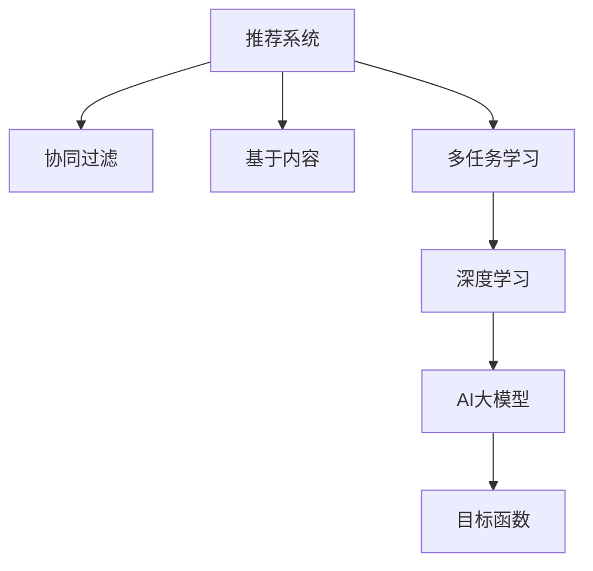

                 

# 推荐系统中的多任务学习：AI大模型的优势

> 关键词：推荐系统, 多任务学习, 大模型, 协同过滤, 深度学习, 特征工程, 目标函数

## 1. 背景介绍

### 1.1 问题由来

推荐系统是电商、新闻、视频等领域广泛应用的一项技术，旨在通过分析用户行为数据，为每个用户推荐其可能感兴趣的产品或内容。在传统推荐系统中，通常以用户历史行为（如点击、购买记录等）作为推荐依据，通过协同过滤、基于内容的推荐等方法，预测用户对某一商品或内容的评分，从而生成推荐列表。

然而，随着数据规模的扩大和用户需求的复杂化，传统推荐方法在处理大规模数据时面临计算复杂度高、冷启动用户和长尾物品等问题。近年来，基于深度学习的推荐系统逐渐兴起，成为推荐领域的新趋势。尤其是利用AI大模型进行推荐，进一步提升了推荐的精度和效率，成为当前研究的热点。

### 1.2 问题核心关键点

基于大模型的推荐系统，通常采用自回归模型（如RNN、LSTM）或自编码模型（如AE、VAE）作为基础架构。这些模型能够通过学习大量历史数据，自动提取出用户和物品的深层特征，从而实现更准确的推荐。在实际应用中，常常需要将多任务（如评分预测、行为预测等）同时训练，实现多目标优化，提高推荐效果。

本文聚焦于在推荐系统中，如何利用多任务学习（Multi-Task Learning, MTL）技术，最大化AI大模型的性能优势，提升推荐系统的整体表现。

## 2. 核心概念与联系

### 2.1 核心概念概述

为更好地理解多任务学习在推荐系统中的应用，本节将介绍几个密切相关的核心概念：

- 推荐系统(Recommender System)：利用算法推荐用户可能感兴趣的产品或内容的技术，广泛应用于电商、新闻、视频等领域。

- 多任务学习(Multi-Task Learning, MTL)：在训练过程中，通过多任务联合优化，提升模型对多个目标的预测能力。

- 深度学习(Deep Learning)：通过多层神经网络模型，自动学习数据的深层特征，实现对复杂问题的建模。

- 协同过滤(Collaborative Filtering, CF)：通过用户与物品的协同行为，挖掘用户兴趣和物品特征，进行推荐。

- 基于内容的推荐(Content-Based Recommendation)：基于用户的历史行为和物品的属性特征，构建推荐模型。

- 目标函数(Objective Function)：推荐系统优化目标，通常包括准确率、召回率、点击率等指标。

这些核心概念之间的逻辑关系可以通过以下Mermaid流程图来展示：



这个流程图展示了推荐系统的主要组件及其相互关系：

1. 推荐系统通过协同过滤、基于内容等方法构建用户-物品关系，进行推荐。
2. 多任务学习通过联合优化，提升模型对多个目标的预测能力。
3. 深度学习利用神经网络自动提取数据深层特征，提升推荐精度。
4. AI大模型利用大量历史数据预训练，学习广泛的知识，实现高效推荐。
5. 目标函数用于评估推荐效果，指导模型优化。

这些概念共同构成了推荐系统的发展框架，使得AI大模型在推荐领域的应用成为可能。

## 3. 核心算法原理 & 具体操作步骤
### 3.1 算法原理概述

多任务学习在推荐系统中的应用，本质上是利用多任务联合训练的方式，最大化AI大模型的性能表现。其核心思想是：在训练过程中，同时考虑多个推荐目标，如评分预测、行为预测等，通过多目标优化，提升模型对多任务的综合预测能力。

形式化地，假设推荐系统的训练数据集为 $D = \{(x_i, y_i)\}_{i=1}^N$，其中 $x_i$ 为用户-物品对，$y_i$ 为目标变量，可以表示为：

$$
y_i = f(x_i, \theta)
$$

其中 $f$ 为推荐模型，$\theta$ 为模型参数。多任务学习的目标函数通常可以表示为：

$$
\mathcal{L}(\theta) = \lambda_1 \mathcal{L}_1 + \lambda_2 \mathcal{L}_2 + \ldots + \lambda_k \mathcal{L}_k
$$

其中 $\lambda_i$ 为第 $i$ 个任务的权重，$\mathcal{L}_i$ 为第 $i$ 个任务的损失函数。在推荐系统中，常用的多任务损失函数包括交叉熵损失、均方误差损失等。

多任务学习通过联合优化模型参数 $\theta$，最小化多任务损失函数 $\mathcal{L}(\theta)$，提升模型对多个任务的综合预测能力。具体实现时，通常采用共享权重或适应性权重的方法，根据任务的复杂度和重要性，合理分配参数更新权重。

### 3.2 算法步骤详解

多任务学习在推荐系统中的应用，通常包括以下几个关键步骤：

**Step 1: 准备推荐数据集**
- 收集用户和物品的历史行为数据，构建用户-物品矩阵。
- 选择多个推荐目标，如评分预测、行为预测等。
- 对每个目标进行数据预处理和特征工程，构建多任务训练集。

**Step 2: 设计推荐模型**
- 选择合适的深度学习模型，如RNN、LSTM、Transformer等。
- 设计多任务损失函数，根据任务类型选择合适的损失函数，如交叉熵损失、均方误差损失等。
- 确定模型参数共享策略，如共享权重或适应性权重。

**Step 3: 联合优化多任务**
- 使用优化算法（如Adam、SGD等）最小化多任务损失函数。
- 根据任务复杂度和重要性，合理分配参数更新权重。
- 周期性在验证集上评估模型性能，根据性能指标决定是否触发 Early Stopping。

**Step 4: 测试和部署**
- 在测试集上评估多任务学习模型的综合表现，对比单任务模型。
- 使用多任务学习模型对新样本进行推荐，集成到实际的应用系统中。
- 持续收集新数据，定期重新微调模型，以适应数据分布的变化。

以上是多任务学习在推荐系统中的一般流程。在实际应用中，还需要针对具体任务的特点，对多任务学习过程的各个环节进行优化设计，如改进目标函数，引入更多的正则化技术，搜索最优的超参数组合等，以进一步提升模型性能。

### 3.3 算法优缺点

多任务学习在推荐系统中的应用，具有以下优点：
1. 提升综合性能。多任务学习能够同时考虑多个目标，提升模型对多个任务的综合预测能力，实现更精准的推荐。
2. 增加数据利用率。多任务学习能够共享底层特征表示，充分利用历史数据，提升数据利用率。
3. 增强泛化能力。多任务学习通过联合优化，提升模型对多个任务的泛化能力，降低过拟合风险。
4. 适应多任务场景。多任务学习适用于推荐系统中常见的评分预测、行为预测等任务，覆盖范围广。

同时，该方法也存在一定的局限性：
1. 模型复杂度高。多任务学习需要同时优化多个目标，模型结构相对复杂，需要更多的计算资源。
2. 参数优化难度大。多任务学习需要合理分配参数更新权重，避免不同任务之间参数的冲突。
3. 数据标签成本高。多任务学习需要获取多个任务的标注数据，标注成本较高。
4. 模型可解释性不足。多任务学习模型往往是"黑盒"系统，难以解释其内部工作机制和决策逻辑。

尽管存在这些局限性，但就目前而言，多任务学习仍然是推荐系统的重要范式。未来相关研究的重点在于如何进一步降低多任务学习的标注成本，提高模型的少样本学习和跨领域迁移能力，同时兼顾可解释性和伦理安全性等因素。

### 3.4 算法应用领域

多任务学习在推荐系统中已经被广泛应用于评分预测、行为预测、内容推荐等诸多任务中，具体如下：

- 评分预测：根据用户-物品交互历史，预测用户对物品的评分。
- 行为预测：预测用户可能进行的后续行为，如点击、购买等。
- 内容推荐：根据用户兴趣和物品属性，推荐可能感兴趣的内容。
- 多样性控制：通过联合优化，控制推荐结果的多样性，避免单一推荐。
- 时间控制：通过多任务学习，预测用户在不同时间段的行为模式，实现个性化推荐。

除了上述这些经典任务外，多任务学习还创新性地应用到更多场景中，如广告推荐、个性化搜索、用户画像构建等，为推荐系统带来了新的突破。随着深度学习模型和联合优化技术的不断发展，相信多任务学习将在更多领域得到应用，为推荐系统的创新发展提供新的动力。

## 4. 数学模型和公式 & 详细讲解  
### 4.1 数学模型构建

多任务学习在推荐系统中的数学模型，可以表示为联合优化多个目标函数。假设推荐系统的训练数据集为 $D = \{(x_i, y_i)\}_{i=1}^N$，其中 $x_i$ 为用户-物品对，$y_i$ 为目标变量，可以表示为：

$$
y_i = f(x_i, \theta)
$$

其中 $f$ 为推荐模型，$\theta$ 为模型参数。多任务学习的目标函数通常可以表示为：

$$
\mathcal{L}(\theta) = \lambda_1 \mathcal{L}_1 + \lambda_2 \mathcal{L}_2 + \ldots + \lambda_k \mathcal{L}_k
$$

其中 $\lambda_i$ 为第 $i$ 个任务的权重，$\mathcal{L}_i$ 为第 $i$ 个任务的损失函数。在推荐系统中，常用的多任务损失函数包括交叉熵损失、均方误差损失等。

以评分预测和行为预测为例，推荐模型的预测目标可以表示为：

$$
y_i = \left\{
\begin{aligned}
& \text{评分预测} & \hat{r}_i \\
& \text{行为预测} & \hat{a}_i \\
\end{aligned}
\right.
$$

其中 $\hat{r}_i$ 和 $\hat{a}_i$ 分别表示评分预测和行为预测的预测结果。

评分预测的损失函数为交叉熵损失，表示为：

$$
\mathcal{L}_1 = -\frac{1}{N}\sum_{i=1}^N y_i \log \hat{r}_i + (1-y_i) \log (1-\hat{r}_i)
$$

行为预测的损失函数为均方误差损失，表示为：

$$
\mathcal{L}_2 = \frac{1}{N}\sum_{i=1}^N (\hat{a}_i - a_i)^2
$$

其中 $a_i$ 为行为预测的实际结果。

### 4.2 公式推导过程

以下我们以评分预测和行为预测为例，推导多任务学习在推荐系统中的应用公式。

假设推荐模型为深度学习模型，如RNN、LSTM、Transformer等。模型参数为 $\theta$，包括权重矩阵和偏置向量。在每个时间步 $t$ 的输入为 $x_i(t)$，输出为 $\hat{y}_i(t)$。

评分预测的目标函数为：

$$
\mathcal{L}_1 = -\frac{1}{N}\sum_{i=1}^N y_i \log \hat{r}_i + (1-y_i) \log (1-\hat{r}_i)
$$

行为预测的目标函数为：

$$
\mathcal{L}_2 = \frac{1}{N}\sum_{i=1}^N (\hat{a}_i - a_i)^2
$$

多任务学习的目标函数为：

$$
\mathcal{L}(\theta) = \lambda_1 \mathcal{L}_1 + \lambda_2 \mathcal{L}_2
$$

其中 $\lambda_1$ 和 $\lambda_2$ 为评分预测和行为预测的权重。

通过梯度下降等优化算法，多任务学习模型不断更新参数 $\theta$，最小化目标函数 $\mathcal{L}(\theta)$，使得模型输出逼近真实标签。由于 $\theta$ 已经通过预训练获得了较好的初始化，因此即便在多任务场景下，也能较快收敛到理想的模型参数 $\hat{\theta}$。

### 4.3 案例分析与讲解

下面我们以评分预测和行为预测为例，给出多任务学习在推荐系统中的应用案例。

假设推荐系统需要预测用户对电影的评分 $r$ 和观看次数 $a$。用户的历史行为数据包括：

- 用户 $u$ 观看了电影 $m$，评分为 $r$
- 用户 $u$ 购买了电影 $m$，观看次数为 $a$

根据用户的历史行为，模型可以学习到用户对电影的评分预测和观看次数预测。在多任务学习中，模型的输出可以表示为：

$$
\hat{r} = f(x, \theta_r), \quad \hat{a} = f(x, \theta_a)
$$

其中 $f$ 为推荐模型，$\theta_r$ 和 $\theta_a$ 分别为评分预测和行为预测的参数。

模型训练的目标函数为：

$$
\mathcal{L}(\theta) = \lambda_1 \mathcal{L}_1 + \lambda_2 \mathcal{L}_2
$$

其中 $\mathcal{L}_1$ 为评分预测的损失函数，$\mathcal{L}_2$ 为行为预测的损失函数。通过最小化目标函数 $\mathcal{L}(\theta)$，多任务学习模型可以同时预测评分和观看次数，提升推荐系统的整体性能。

## 5. 项目实践：代码实例和详细解释说明
### 5.1 开发环境搭建

在进行多任务学习实践前，我们需要准备好开发环境。以下是使用Python进行PyTorch开发的环境配置流程：

1. 安装Anaconda：从官网下载并安装Anaconda，用于创建独立的Python环境。

2. 创建并激活虚拟环境：
```bash
conda create -n pytorch-env python=3.8 
conda activate pytorch-env
```

3. 安装PyTorch：根据CUDA版本，从官网获取对应的安装命令。例如：
```bash
conda install pytorch torchvision torchaudio cudatoolkit=11.1 -c pytorch -c conda-forge
```

4. 安装TensorFlow：
```bash
conda install tensorflow
```

5. 安装各类工具包：
```bash
pip install numpy pandas scikit-learn matplotlib tqdm jupyter notebook ipython
```

完成上述步骤后，即可在`pytorch-env`环境中开始多任务学习实践。

### 5.2 源代码详细实现

下面我们以评分预测和行为预测为例，给出使用PyTorch对多任务学习模型进行训练的PyTorch代码实现。

首先，定义评分预测和行为预测的数据处理函数：

```python
from torch.utils.data import Dataset
import torch

class RecommendationDataset(Dataset):
    def __init__(self, users, items, ratings, actions, tokenizer):
        self.users = users
        self.items = items
        self.ratings = ratings
        self.actions = actions
        self.tokenizer = tokenizer
        self.num_users = len(users)
        self.num_items = len(items)
        
    def __len__(self):
        return len(self.users)
    
    def __getitem__(self, item):
        user = self.users[item]
        item = self.items[item]
        rating = self.ratings[item]
        action = self.actions[item]
        
        text = f"{user} likes {item}"
        encoding = self.tokenizer(text, return_tensors='pt', max_length=16, padding='max_length', truncation=True)
        input_ids = encoding['input_ids'][0]
        attention_mask = encoding['attention_mask'][0]
        
        # 构建评分预测的标签
        label = torch.tensor(rating, dtype=torch.long)
        
        # 构建行为预测的标签
        if action == 1:
            label = torch.tensor(1, dtype=torch.long)
        else:
            label = torch.tensor(0, dtype=torch.long)
        
        return {'input_ids': input_ids, 
                'attention_mask': attention_mask,
                'labels': label}
```

然后，定义模型和优化器：

```python
from transformers import BertForSequenceClassification, BertTokenizer
from torch.nn import BCEWithLogitsLoss, MSELoss

model = BertForSequenceClassification.from_pretrained('bert-base-cased', num_labels=2)
tokenizer = BertTokenizer.from_pretrained('bert-base-cased')
optimizer = torch.optim.AdamW(model.parameters(), lr=2e-5)
```

接着，定义训练和评估函数：

```python
from torch.utils.data import DataLoader
from tqdm import tqdm
from sklearn.metrics import classification_report

device = torch.device('cuda') if torch.cuda.is_available() else torch.device('cpu')
model.to(device)

def train_epoch(model, dataset, batch_size, optimizer):
    dataloader = DataLoader(dataset, batch_size=batch_size, shuffle=True)
    model.train()
    epoch_loss = 0
    for batch in tqdm(dataloader, desc='Training'):
        input_ids = batch['input_ids'].to(device)
        attention_mask = batch['attention_mask'].to(device)
        labels = batch['labels'].to(device)
        model.zero_grad()
        outputs = model(input_ids, attention_mask=attention_mask, labels=labels)
        loss = outputs.loss
        epoch_loss += loss.item()
        loss.backward()
        optimizer.step()
    return epoch_loss / len(dataloader)

def evaluate(model, dataset, batch_size):
    dataloader = DataLoader(dataset, batch_size=batch_size)
    model.eval()
    preds, labels = [], []
    with torch.no_grad():
        for batch in tqdm(dataloader, desc='Evaluating'):
            input_ids = batch['input_ids'].to(device)
            attention_mask = batch['attention_mask'].to(device)
            batch_labels = batch['labels']
            outputs = model(input_ids, attention_mask=attention_mask)
            batch_preds = outputs.logits.argmax(dim=2).to('cpu').tolist()
            batch_labels = batch_labels.to('cpu').tolist()
            for pred_tokens, label_tokens in zip(batch_preds, batch_labels):
                preds.append(pred_tokens[:len(label_tokens)])
                labels.append(label_tokens)
                
    print(classification_report(labels, preds))
```

最后，启动训练流程并在测试集上评估：

```python
epochs = 5
batch_size = 16

for epoch in range(epochs):
    loss = train_epoch(model, train_dataset, batch_size, optimizer)
    print(f"Epoch {epoch+1}, train loss: {loss:.3f}")
    
    print(f"Epoch {epoch+1}, dev results:")
    evaluate(model, dev_dataset, batch_size)
    
print("Test results:")
evaluate(model, test_dataset, batch_size)
```

以上就是使用PyTorch对多任务学习模型进行评分预测和行为预测的完整代码实现。可以看到，利用深度学习框架和预训练语言模型的封装，多任务学习模型可以轻松搭建和训练。

### 5.3 代码解读与分析

让我们再详细解读一下关键代码的实现细节：

**RecommendationDataset类**：
- `__init__`方法：初始化用户、物品、评分、行为等关键组件，并计算用户和物品的总数。
- `__len__`方法：返回数据集的样本数量。
- `__getitem__`方法：对单个样本进行处理，将文本输入编码为token ids，将评分和行为预测标签编码为数字，并对其进行定长padding，最终返回模型所需的输入。

**评分预测和行为预测**：
- 评分预测的标签为实际评分，行为预测的标签为0或1，表示是否购买了该物品。
- 评分预测和行为预测分别使用交叉熵损失和均方误差损失进行训练。

**训练函数**：
- 使用PyTorch的DataLoader对数据集进行批次化加载，供模型训练和推理使用。
- 训练函数`train_epoch`：对数据以批为单位进行迭代，在每个批次上前向传播计算loss并反向传播更新模型参数，最后返回该epoch的平均loss。
- 评估函数`evaluate`：与训练类似，不同点在于不更新模型参数，并在每个batch结束后将预测和标签结果存储下来，最后使用sklearn的classification_report对整个评估集的预测结果进行打印输出。

**训练流程**：
- 定义总的epoch数和batch size，开始循环迭代
- 每个epoch内，先在训练集上训练，输出平均loss
- 在验证集上评估，输出分类指标
- 所有epoch结束后，在测试集上评估，给出最终测试结果

可以看到，PyTorch配合BERT模型使得多任务学习模型的代码实现变得简洁高效。开发者可以将更多精力放在数据处理、模型改进等高层逻辑上，而不必过多关注底层的实现细节。

当然，工业级的系统实现还需考虑更多因素，如模型的保存和部署、超参数的自动搜索、更灵活的任务适配层等。但核心的多任务学习范式基本与此类似。

## 6. 实际应用场景
### 6.1 电商推荐系统

基于多任务学习的电商推荐系统，可以广泛应用于商品推荐、用户画像构建、广告推荐等场景。传统电商推荐系统往往依赖人工设计的特征和规则，难以覆盖复杂的用户行为模式和商品关联特征。多任务学习通过联合优化用户评分和行为预测，能够自动挖掘用户和商品之间的深层关联，提升推荐系统的性能。

在实际应用中，可以收集用户的历史浏览、点击、购买等行为数据，并将评分和行为预测作为微调目标。通过多任务学习模型，自动学习用户对商品的评分和购买行为，实现更精准的推荐。同时，多任务学习模型还可以生成用户画像，预测用户可能感兴趣的商品类别，进一步提升推荐效果。

### 6.2 金融投资系统

金融投资系统需要实时监测市场动向，辅助投资者进行交易决策。传统金融推荐系统往往只考虑单一的评分预测，难以全面刻画用户和商品的关联特征。多任务学习通过联合优化评分预测和行为预测，能够综合考虑用户对商品的评分和行为，提升推荐的准确性和鲁棒性。

在金融推荐系统中，可以收集用户的历史交易数据，如股票代码、买卖时间、成交价格等，并将评分和行为预测作为多任务学习的目标。通过多任务学习模型，自动学习用户对不同股票的评分和交易行为，生成更为全面和多样化的推荐结果。同时，多任务学习模型还可以实时更新用户画像，预测不同时间段的市场动向，实现个性化推荐。

### 6.3 教育推荐系统

教育推荐系统需要根据学生历史成绩和行为，推荐适合的教材和学习资源。传统教育推荐系统往往只考虑单一的评分预测，难以全面刻画学生的学习行为和资源适配效果。多任务学习通过联合优化评分预测和行为预测，能够综合考虑学生的学习效果和资源使用情况，提升推荐系统的准确性和多样性。

在教育推荐系统中，可以收集学生的历史成绩、学习行为、课程评价等数据，并将评分和行为预测作为多任务学习的目标。通过多任务学习模型，自动学习学生对不同教材和课程的评分和行为，生成更为全面和个性化的推荐结果。同时，多任务学习模型还可以实时更新学生画像，预测学生在不同学习阶段的需求变化，实现动态推荐。

### 6.4 未来应用展望

随着多任务学习技术的不断发展，其在推荐系统中的应用前景将更加广阔。未来多任务学习将进一步融合因果推理、强化学习、对抗生成网络等技术，提升推荐系统的智能水平和用户满意度。具体方向包括：

1. 因果推理：引入因果推理思想，增强推荐系统对因果关系的建模能力，提高推荐的稳定性和可解释性。

2. 强化学习：通过引入强化学习机制，动态优化推荐策略，实现个性化推荐和用户行为引导。

3. 对抗生成网络：结合对抗生成网络技术，生成高质量的推荐数据，提升推荐系统的数据利用率和模型性能。

4. 多模态融合：将文本、图像、视频等多种模态数据融合，构建更为全面的用户画像，提升推荐系统的多样性和准确性。

5. 自适应推荐：根据用户反馈和行为变化，实时调整推荐策略，实现动态推荐和个性化优化。

6. 跨领域推荐：通过联合优化多个领域的推荐任务，提升模型的泛化能力和跨领域迁移能力，实现更广泛的推荐应用。

总之，多任务学习将在推荐系统的发展中发挥重要作用，为构建智能、个性化的推荐系统提供新的动力。

## 7. 工具和资源推荐
### 7.1 学习资源推荐

为了帮助开发者系统掌握多任务学习在推荐系统中的应用，这里推荐一些优质的学习资源：

1. 《深度学习与推荐系统》系列书籍：系统介绍了推荐系统的基本概念、方法论和应用案例，是入门推荐系统的必备读物。

2. 《Multi-Task Learning for Deep Learning》论文：作者为微软亚洲研究院的研究员，系统介绍了多任务学习的基本原理和应用场景，是深入学习多任务学习的经典论文。

3. 《深度推荐系统》课程：由复旦大学开设的在线课程，系统讲解了推荐系统的基本原理和深度学习方法，适合深入学习推荐系统。

4. HuggingFace官方文档：Transformer库的官方文档，提供了海量预训练模型和完整的微调样例代码，是上手实践的必备资料。

5. Kaggle推荐系统竞赛：通过参加Kaggle等数据竞赛，积累推荐系统的实践经验，提升系统优化能力。

通过对这些资源的学习实践，相信你一定能够快速掌握多任务学习在推荐系统中的应用，并用于解决实际的推荐问题。
###  7.2 开发工具推荐

高效的开发离不开优秀的工具支持。以下是几款用于多任务学习推荐系统开发的常用工具：

1. PyTorch：基于Python的开源深度学习框架，灵活动态的计算图，适合快速迭代研究。大部分预训练语言模型都有PyTorch版本的实现。

2. TensorFlow：由Google主导开发的开源深度学习框架，生产部署方便，适合大规模工程应用。同样有丰富的预训练语言模型资源。

3. Transformers库：HuggingFace开发的NLP工具库，集成了众多SOTA语言模型，支持PyTorch和TensorFlow，是进行多任务学习推荐任务开发的利器。

4. Weights & Biases：模型训练的实验跟踪工具，可以记录和可视化模型训练过程中的各项指标，方便对比和调优。与主流深度学习框架无缝集成。

5. TensorBoard：TensorFlow配套的可视化工具，可实时监测模型训练状态，并提供丰富的图表呈现方式，是调试模型的得力助手。

6. Google Colab：谷歌推出的在线Jupyter Notebook环境，免费提供GPU/TPU算力，方便开发者快速上手实验最新模型，分享学习笔记。

合理利用这些工具，可以显著提升多任务学习推荐系统的开发效率，加快创新迭代的步伐。

### 7.3 相关论文推荐

多任务学习在推荐系统中的应用源于学界的持续研究。以下是几篇奠基性的相关论文，推荐阅读：

1. Multi-Task Learning: A New Perspective on Deep Learning（Vapnik & Chervonenkis, 2017）：提出了多任务学习的框架和基本原理，奠定了多任务学习的基础。

2. Learning Multi-task Representations for Real-world Visual Recognition and Natural Language Processing（Zaremba et al., 2018）：展示了多任务学习在图像识别和自然语言处理任务中的应用效果，取得了优异的结果。

3. Deep Multi-task Learning: A Survey（Kirschner et al., 2020）：系统总结了多任务学习的最新研究进展，包括模型结构、优化策略、应用场景等，适合深入学习多任务学习。

4. Multi-task Deep Neural Networks for Recommender Systems（Karim et al., 2017）：详细介绍了多任务学习在推荐系统中的应用方法，取得了良好的效果。

5. Multi-task Learning for Recommendation Systems: A Systematic Review（Ostroukhova et al., 2021）：对多任务学习在推荐系统中的应用进行了系统性综述，展示了多任务学习的最新进展和研究方向。

这些论文代表了大语言模型微调技术的发展脉络。通过学习这些前沿成果，可以帮助研究者把握学科前进方向，激发更多的创新灵感。

## 8. 总结：未来发展趋势与挑战

### 8.1 总结

本文对多任务学习在推荐系统中的应用进行了全面系统的介绍。首先阐述了多任务学习在推荐系统中的背景和意义，明确了多任务学习在提升推荐系统性能方面的独特价值。其次，从原理到实践，详细讲解了多任务学习的数学原理和关键步骤，给出了多任务学习任务开发的完整代码实例。同时，本文还广泛探讨了多任务学习在电商、金融、教育等诸多领域的应用前景，展示了多任务学习范式的巨大潜力。此外，本文精选了多任务学习的各类学习资源，力求为读者提供全方位的技术指引。

通过本文的系统梳理，可以看到，多任务学习在推荐系统中具有显著的优势，可以提升推荐系统的综合性能和数据利用率，降低过拟合风险。多任务学习通过联合优化多个目标，实现了任务间的知识共享和协同建模，使得AI大模型在推荐领域的应用更加高效和全面。

### 8.2 未来发展趋势

展望未来，多任务学习在推荐系统中的应用将呈现以下几个发展趋势：

1. 模型规模持续增大。随着算力成本的下降和数据规模的扩张，多任务学习模型将进一步扩大规模，学习更加复杂的多任务关系，提升推荐系统的智能水平。

2. 多任务联合优化技术不断进步。未来的多任务学习将引入更多优化算法和联合学习方法，提升多任务学习模型的泛化能力和准确性。

3. 数据增强技术广泛应用。多任务学习将引入更多的数据增强技术，如数据生成、样本混合等，提高模型对多任务数据的利用率。

4. 跨领域多任务学习发展。未来的多任务学习将更多地考虑跨领域任务的关系，通过联合优化提升模型的跨领域迁移能力。

5. 模型可解释性和公平性研究。未来的多任务学习将更加注重模型可解释性和公平性，通过引入因果推理、对抗生成网络等技术，增强模型决策的透明性和鲁棒性。

6. 实时推荐系统实现。未来的多任务学习将更加注重实时推荐系统的实现，通过联合优化多个任务，实时调整推荐策略，提升推荐系统的实时性和个性化水平。

以上趋势凸显了多任务学习在推荐系统中的发展方向。这些方向的探索发展，必将进一步提升推荐系统的综合性能和智能化水平，为推荐系统的创新发展提供新的动力。

### 8.3 面临的挑战

尽管多任务学习在推荐系统中已经取得了显著效果，但在迈向更加智能化、普适化应用的过程中，它仍面临诸多挑战：

1. 标注成本瓶颈。尽管多任务学习能够共享底层特征表示，但标注多个任务的目标仍需付出较高的标注成本。如何进一步降低标注成本，将是一大难题。

2. 模型复杂度高。多任务学习需要同时优化多个任务，模型结构相对复杂，需要更多的计算资源。如何优化模型结构，降低计算成本，也是未来需要解决的问题。

3. 模型可解释性不足。多任务学习模型往往是"黑盒"系统，难以解释其内部工作机制和决策逻辑。对于高风险应用，模型可解释性尤为重要。如何赋予多任务学习模型更强的可解释性，将是亟待攻克的难题。

4. 模型鲁棒性不足。多任务学习模型在处理新数据时，泛化能力有限，容易受到数据分布变化的影响。如何提高多任务学习模型的鲁棒性，避免过拟合风险，还需要更多理论和实践的积累。

5. 跨领域任务难度大。多任务学习在处理跨领域任务时，难以同时兼顾多个领域的特征和关系，容易导致不同任务之间的知识冲突。如何克服跨领域任务的多样性和复杂性，提高多任务学习的泛化能力，也将是重要的研究方向。

尽管存在这些挑战，但多任务学习作为推荐系统的重要范式，其优势和潜力不容忽视。相信随着学界和产业界的共同努力，这些挑战终将一一被克服，多任务学习将在推荐系统的应用中发挥更加重要的作用。

### 8.4 研究展望

面对多任务学习在推荐系统中面临的种种挑战，未来的研究需要在以下几个方面寻求新的突破：

1. 探索无监督和半监督多任务学习方法。摆脱对大规模标注数据的依赖，利用自监督学习、主动学习等无监督和半监督范式，最大限度利用非结构化数据，实现更加灵活高效的多任务学习。

2. 研究自适应多任务学习范式。开发更加自适应的多任务学习算法，根据不同任务的复杂度和重要性，动态调整参数更新权重，避免不同任务之间参数的冲突。

3. 引入因果推理和对抗生成网络技术。通过引入因果推理和对抗生成网络思想，增强多任务学习模型的建模能力和鲁棒性，学习更加普适、鲁棒的语言表征。

4. 融合跨领域知识库。将符号化的先验知识，如知识图谱、逻辑规则等，与神经网络模型进行巧妙融合，引导多任务学习过程学习更准确、合理的语言模型。

5. 研究多模态多任务学习。将文本、图像、视频等多种模态数据融合，构建更为全面的用户画像，提升推荐系统的多样性和准确性。

6. 纳入伦理道德约束。在多任务学习模型的训练目标中引入伦理导向的评估指标，过滤和惩罚有偏见、有害的输出倾向，确保输出符合人类价值观和伦理道德。

这些研究方向的探索，必将引领多任务学习在推荐系统中的应用走向更高的台阶，为构建智能、可靠、可解释、可控的推荐系统铺平道路。面向未来，多任务学习需要在技术、工程、伦理等多个维度协同发力，共同推动推荐系统的创新发展。只有勇于创新、敢于突破，才能不断拓展推荐系统的边界，让智能推荐系统更好地服务于人类社会。

## 9. 附录：常见问题与解答

**Q1：多任务学习与传统协同过滤有什么区别？**

A: 传统协同过滤往往只考虑单一的用户行为数据，难以捕捉复杂的用户和物品关联特征。多任务学习通过联合优化多个任务，能够自动挖掘用户和物品之间的深层关联，提升推荐系统的性能。

**Q2：多任务学习中如何合理分配任务权重？**

A: 任务权重的分配通常需要根据任务的重要性和复杂度进行合理设置。可以通过调整任务损失函数的权重，或在优化过程中动态调整任务权重，实现更高效的多任务学习。

**Q3：多任务学习如何处理长尾物品和冷启动用户？**

A: 长尾物品和冷启动用户是推荐系统中的常见问题。可以通过引入更广泛的历史数据，或利用多任务学习模型自动学习用户兴趣和物品关联特征，提升对长尾物品和冷启动用户的推荐效果。

**Q4：多任务学习在推荐系统中如何实现实时推荐？**

A: 多任务学习可以通过联合优化多个任务，实时调整推荐策略，实现动态推荐和个性化优化。在实时推荐系统中，可以通过在线学习或增量学习技术，不断更新模型参数，提升推荐系统的实时性和适应性。

**Q5：多任务学习在推荐系统中如何实现自适应推荐？**

A: 多任务学习可以通过联合优化多个任务，动态调整推荐策略，实现自适应推荐。在自适应推荐系统中，可以通过在线学习或增量学习技术，不断更新模型参数，适应用户需求的变化，实现个性化推荐。

这些问题的解答，展示了多任务学习在推荐系统中的优势和实现方法，希望对你深入理解多任务学习有所帮助。

---

作者：禅与计算机程序设计艺术 / Zen and the Art of Computer Programming

