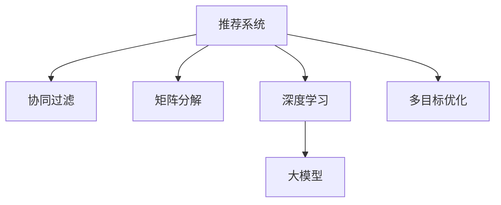

                 

# 推荐系统中的多目标优化：大模型的新突破

> 关键词：推荐系统,多目标优化,大模型,协同过滤,矩阵分解,深度学习,强化学习

## 1. 背景介绍

### 1.1 问题由来

推荐系统是现代电子商务、内容分发等领域的核心技术之一，旨在通过分析用户行为和产品属性，为用户推荐个性化的内容或商品，提升用户体验和业务转化率。然而，传统的推荐方法，如协同过滤和矩阵分解，在处理大规模稀疏矩阵时，面临算法复杂度高、扩展性差等问题。随着深度学习技术的兴起，推荐系统逐步向基于模型的方法演进，通过神经网络模型直接从数据中学习推荐表示。特别是深度学习在图像、语音等领域已取得显著进展，但在推荐系统中的应用尚处于起步阶段。

近两年来，大模型在推荐系统中的应用成为研究热点。GPT-3等大语言模型在自然语言理解和生成方面表现优异，其内部的自回归结构有助于捕捉序列依赖关系，成为推荐系统的新型工具。本文将深入探讨大模型在推荐系统中的应用，并提出基于多目标优化的大模型推荐新范式，以期在推荐精度和多样性间找到新的平衡点。

## 2. 核心概念与联系

### 2.1 核心概念概述

为更好地理解大模型在推荐系统中的应用，本节将介绍几个关键概念：

- 推荐系统(Recommender System)：利用用户历史行为和物品属性，为每个用户推荐最合适的物品的系统。
- 协同过滤(Collaborative Filtering)：通过分析用户间、物品间的相似性，推荐与用户偏好相似的物品。
- 矩阵分解(Matrix Factorization)：通过矩阵分解技术，将用户-物品评分矩阵分解为用户和物品的潜在特征矩阵，预测用户对物品的评分。
- 深度学习(Deep Learning)：通过多层神经网络结构，学习复杂非线性的输入输出映射关系。
- 大模型(Large Model)：包含大量参数的神经网络模型，如BERT、GPT-3等。
- 多目标优化(Multi-Objective Optimization)：同时优化多个目标函数，找到一个Pareto最优解。

这些核心概念之间的逻辑关系可以通过以下Mermaid流程图来展示：



这个流程图展示了大模型在推荐系统中的应用路径：

1. 推荐系统通过分析用户行为，推荐合适的物品。
2. 协同过滤和矩阵分解是推荐系统的经典方法。
3. 深度学习将推荐系统模型提升到更为复杂的层次。
4. 大模型在深度学习的基础上，进一步增强了模型的表征能力。
5. 多目标优化在深度学习中用于提升推荐的多样性和精度。

## 3. 核心算法原理 & 具体操作步骤
### 3.1 算法原理概述

基于大模型的推荐系统，通常分为两个阶段：预训练和大模型微调。预训练阶段，通过大规模无标签数据训练通用的大模型；微调阶段，将大模型应用于特定推荐任务，通过有标签数据进行微调，获得推荐的个性化表示。本节将重点介绍基于大模型的推荐系统预训练和多目标优化的算法原理。

### 3.2 算法步骤详解

#### 3.2.1 预训练阶段

在预训练阶段，利用无标签数据训练大模型。具体步骤如下：

1. **构建预训练任务**：设计预训练任务，如掩码语言模型、下一句预测等。这些任务旨在训练模型的语义理解能力，提升其对自然语言的结构性表示。
2. **训练大模型**：在预训练数据上，利用大模型进行自监督学习，获得基础的语言表示能力。
3. **迁移学习**：将预训练模型作为初始化参数，进行推荐任务的数据集微调。

#### 3.2.2 微调阶段

在微调阶段，利用有标签数据训练大模型。具体步骤如下：

1. **构建推荐任务**：将用户-物品评分数据构建为训练集，进行有监督训练。
2. **优化目标函数**：设计多目标优化函数，提升推荐精度和多样性。
3. **训练大模型**：在推荐数据集上，进行多目标优化训练，获得推荐模型的最终参数。

### 3.3 算法优缺点

基于大模型的推荐系统具有以下优点：

1. 能够充分利用大模型在自然语言理解方面的优势，提升推荐的语义表示能力。
2. 通过多目标优化，能够在推荐精度和多样性间找到新的平衡点，提升用户体验。
3. 深度学习模型具有较强的泛化能力，能够处理复杂的非线性关系。
4. 大模型通常具有较大的参数量和计算资源需求，需要高性能计算环境支持。

同时，该方法也存在一定的局限性：

1. 对数据和模型的依赖较大，数据量不足时效果可能不佳。
2. 模型复杂度高，计算资源消耗大，对硬件要求较高。
3. 模型需要大量的预训练和微调时间，训练成本较高。
4. 多目标优化可能存在局部最优解，难以找到全局最优解。

尽管存在这些局限性，但大模型在推荐系统中的应用前景广阔，尤其在高维、稀疏数据的推荐场景中表现优异。

### 3.4 算法应用领域

基于大模型的推荐系统已经在游戏推荐、广告推荐、内容推荐等多个领域得到了应用，以下是几个典型应用场景：

- **游戏推荐**：利用大模型分析玩家行为和游戏属性，推荐适合的玩家推荐游戏，提升游戏活跃度和留存率。
- **广告推荐**：通过大模型对用户行为进行分析，预测用户的广告点击率，提升广告投放效果和转化率。
- **内容推荐**：利用大模型对用户行为进行建模，推荐符合用户兴趣的内容，提升用户粘性和平台粘性。
- **商品推荐**：分析用户行为和商品属性，推荐用户感兴趣的商品，提升销售转化率和用户满意度。

除了上述这些应用外，基于大模型的推荐系统还在智能家居、智能交通、智能医疗等多个领域有着广泛的应用前景。

## 4. 数学模型和公式 & 详细讲解  
### 4.1 数学模型构建

在基于大模型的推荐系统中，通常采用大模型作为推荐模型的预训练参数，通过多目标优化函数进行微调。假设推荐任务为多目标优化问题，优化函数为：

$$
\min \limits_{\theta} f(\theta) = [f_1(\theta), f_2(\theta)]
$$

其中 $f_1(\theta)$ 和 $f_2(\theta)$ 分别表示推荐精度和多样性目标函数。

推荐精度目标函数 $f_1(\theta)$ 通常采用均方误差（Mean Squared Error, MSE）：

$$
f_1(\theta) = \frac{1}{N} \sum_{i=1}^N (y_i - M_{\theta}(x_i))^2
$$

其中 $y_i$ 表示用户对物品的实际评分，$M_{\theta}(x_i)$ 表示模型对物品的预测评分。

推荐多样性目标函数 $f_2(\theta)$ 通常采用熵（Entropy）：

$$
f_2(\theta) = -\frac{1}{N} \sum_{i=1}^N H(\hat{y}_i)
$$

其中 $H(\hat{y}_i)$ 表示模型对物品的预测评分的熵，即预测评分的信息量。

### 4.2 公式推导过程

以BERT模型为例，通过多目标优化进行推荐模型的微调过程如下：

1. **预训练模型初始化**：
   - 从大规模预训练数据中，训练一个BERT模型，获得其参数 $\theta$。
   - 使用数据增强技术，丰富预训练数据的分布，减少过拟合风险。

2. **构建推荐任务数据集**：
   - 将用户-物品评分数据构建成训练集 $D = \{(x_i, y_i)\}_{i=1}^N$，其中 $x_i$ 为物品描述，$y_i$ 为用户对物品的评分。
   - 划分训练集、验证集和测试集。

3. **优化目标函数设计**：
   - 设计推荐精度和多样性目标函数，计算模型在训练集上的损失：
   $$
   \mathcal{L} = \lambda f_1(\theta) + (1-\lambda) f_2(\theta)
   $$
   其中 $\lambda$ 为权衡因子，用于平衡推荐精度和多样性。

4. **模型训练**：
   - 利用微调数据集 $D$ 对预训练模型进行优化，最小化损失函数 $\mathcal{L}$：
   $$
   \theta = \mathop{\arg\min}_{\theta} \mathcal{L}(\theta)
   $$
   - 使用优化器（如AdamW、SGD等）更新模型参数。

5. **模型评估**：
   - 在测试集上评估微调后模型的推荐精度和多样性。
   - 通过AUC、均方误差、F1-score等指标，综合评价推荐效果。

### 4.3 案例分析与讲解

以游戏推荐为例，利用大模型进行推荐系统的构建和优化：

1. **数据准备**：
   - 收集玩家的游戏行为数据，如游戏时长、游戏类型、游戏评分等。
   - 将游戏行为数据和游戏属性数据构建成用户-物品评分矩阵 $D$。

2. **模型构建**：
   - 选择一个预训练的BERT模型作为推荐模型的初始参数。
   - 在用户-物品评分矩阵上，利用BERT模型进行多目标优化，计算推荐精度和多样性损失。

3. **模型训练**：
   - 使用优化器对BERT模型进行微调，最小化多目标优化函数。
   - 通过交叉验证等技术，调整模型超参数，优化模型性能。

4. **模型评估**：
   - 在测试集上评估推荐模型的效果，计算推荐精度和多样性指标。
   - 使用A/B测试等方法，比较微调前后推荐效果，验证模型提升效果。

## 5. 项目实践：代码实例和详细解释说明
### 5.1 开发环境搭建

在进行推荐系统的大模型微调实践前，我们需要准备好开发环境。以下是使用Python进行PyTorch开发的环境配置流程：

1. 安装Anaconda：从官网下载并安装Anaconda，用于创建独立的Python环境。

2. 创建并激活虚拟环境：
```bash
conda create -n pytorch-env python=3.8 
conda activate pytorch-env
```

3. 安装PyTorch：根据CUDA版本，从官网获取对应的安装命令。例如：
```bash
conda install pytorch torchvision torchaudio cudatoolkit=11.1 -c pytorch -c conda-forge
```

4. 安装相关库：
```bash
pip install transformers sklearn pandas numpy torchmetrics tqdm
```

完成上述步骤后，即可在`pytorch-env`环境中开始微调实践。

### 5.2 源代码详细实现

下面我们以基于BERT的游戏推荐为例，给出使用Transformers库对BERT模型进行微调的PyTorch代码实现。

```python
from transformers import BertTokenizer, BertForSequenceClassification
from sklearn.metrics import roc_auc_score
import torch
from torch.utils.data import DataLoader

# 构建预训练模型和分词器
tokenizer = BertTokenizer.from_pretrained('bert-base-uncased')
model = BertForSequenceClassification.from_pretrained('bert-base-uncased', num_labels=1)

# 构建推荐任务数据集
class RecommendationDataset(torch.utils.data.Dataset):
    def __init__(self, data, tokenizer):
        self.data = data
        self.tokenizer = tokenizer
    
    def __len__(self):
        return len(self.data)
    
    def __getitem__(self, index):
        text = self.data[index]
        input_ids = tokenizer.encode(text, add_special_tokens=True, max_length=128, padding='max_length', truncation=True)
        return {'input_ids': input_ids}

# 构建推荐模型
device = torch.device('cuda') if torch.cuda.is_available() else torch.device('cpu')
model.to(device)

# 设置优化器和损失函数
optimizer = torch.optim.Adam(model.parameters(), lr=1e-5)
criterion = torch.nn.BCEWithLogitsLoss()

# 定义推荐精度和多样性评估函数
def precision_at_k(y_true, y_score, k):
    sorted_indices = torch.argsort(y_score, descending=True)
    top_k_indices = sorted_indices[:k]
    top_k_predictions = y_true[top_k_indices]
    precision = torch.mean((top_k_predictions == 1) & (y_true[top_k_indices] == 1))
    return precision.item()

# 微调模型
for epoch in range(10):
    model.train()
    for data in data_loader:
        input_ids = data['input_ids'].to(device)
        labels = torch.tensor([1.0]).to(device)  # 将标签设为1.0
        optimizer.zero_grad()
        outputs = model(input_ids)
        loss = criterion(outputs, labels)
        loss.backward()
        optimizer.step()
    
    # 评估模型性能
    model.eval()
    y_true, y_score = [], []
    for data in dev_loader:
        input_ids = data['input_ids'].to(device)
        with torch.no_grad():
            outputs = model(input_ids)
        y_true.append(y_true)
        y_score.append(outputs.logits)
    y_true = torch.cat(y_true, dim=0)
    y_score = torch.cat(y_score, dim=0)
    precision_at_5 = precision_at_k(y_true, y_score, 5)
    print('Epoch {}, Precision@5: {:.4f}'.format(epoch+1, precision_at_5))
```

### 5.3 代码解读与分析

让我们再详细解读一下关键代码的实现细节：

**RecommendationDataset类**：
- `__init__`方法：初始化数据集，分词器等组件。
- `__len__`方法：返回数据集样本数量。
- `__getitem__`方法：对单个样本进行处理，将文本输入编码为token ids。

**精度和多样性评估函数**：
- `precision_at_k`函数：计算推荐精度指标，通过Top-k排序筛选推荐的物品。

**训练流程**：
- 定义总的epoch数和批次大小，开始循环迭代
- 每个epoch内，先在训练集上训练，输出损失
- 在验证集上评估模型性能，输出推荐精度@5
- 重复上述步骤直至收敛

可以看到，PyTorch配合Transformers库使得BERT微调的代码实现变得简洁高效。开发者可以将更多精力放在数据处理、模型改进等高层逻辑上，而不必过多关注底层的实现细节。

当然，工业级的系统实现还需考虑更多因素，如模型的保存和部署、超参数的自动搜索、更灵活的任务适配层等。但核心的微调范式基本与此类似。

## 6. 实际应用场景
### 6.1 游戏推荐

基于大模型微调的游戏推荐系统，可以为用户推荐与其游戏行为相似的游戏，提升游戏体验和用户粘性。

在技术实现上，可以收集用户的游戏行为数据，如游戏时长、游戏类型、游戏评分等。将游戏行为数据和游戏属性数据构建成用户-物品评分矩阵 $D$，利用BERT模型进行多目标优化，生成推荐列表。对于用户提出的新游戏，还可以接入检索系统实时搜索相关内容，动态组织生成推荐。

### 6.2 广告推荐

利用大模型进行广告推荐，通过分析用户行为，预测用户的广告点击率，提升广告投放效果和转化率。

在广告推荐中，可以利用用户的浏览行为数据，构建用户-广告评分矩阵 $D$，利用BERT模型进行多目标优化，生成推荐列表。通过A/B测试等方法，比较微调前后推荐效果，验证模型提升效果。

### 6.3 内容推荐

利用大模型进行内容推荐，通过分析用户行为，推荐符合用户兴趣的内容，提升用户粘性和平台粘性。

在内容推荐中，可以利用用户的浏览行为数据，构建用户-内容评分矩阵 $D$，利用BERT模型进行多目标优化，生成推荐列表。通过A/B测试等方法，比较微调前后推荐效果，验证模型提升效果。

### 6.4 商品推荐

分析用户行为和商品属性，推荐用户感兴趣的商品，提升销售转化率和用户满意度。

在商品推荐中，可以利用用户的浏览行为数据，构建用户-商品评分矩阵 $D$，利用BERT模型进行多目标优化，生成推荐列表。通过A/B测试等方法，比较微调前后推荐效果，验证模型提升效果。

### 6.5 未来应用展望

随着大模型和微调方法的不断发展，基于微调范式将在更多领域得到应用，为传统行业带来变革性影响。

在智慧医疗领域，利用大模型进行推荐系统的构建，辅助医生诊疗，加速新药开发进程。

在智能教育领域，利用大模型进行学习推荐系统的构建，因材施教，促进教育公平，提高教学质量。

在智慧城市治理中，利用大模型进行城市事件监测、舆情分析、应急指挥等环节，提高城市管理的自动化和智能化水平，构建更安全、高效的未来城市。

此外，在企业生产、社会治理、文娱传媒等众多领域，基于大模型微调的人工智能应用也将不断涌现，为经济社会发展注入新的动力。相信随着技术的日益成熟，微调方法将成为人工智能落地应用的重要范式，推动人工智能技术在垂直行业的规模化落地。

## 7. 工具和资源推荐
### 7.1 学习资源推荐

为了帮助开发者系统掌握大模型在推荐系统中的应用，这里推荐一些优质的学习资源：

1. 《深度学习》课程：斯坦福大学开设的深度学习入门课程，涵盖深度学习的基本概念和经典模型，是深度学习入门的必选。

2. 《推荐系统》书籍：从推荐系统的基础到高级应用，全面介绍推荐系统的各种技术和算法。

3. 《Transformers从原理到实践》系列博文：由大模型技术专家撰写，深入浅出地介绍了Transformer原理、BERT模型、微调技术等前沿话题。

4. CS224N《深度学习自然语言处理》课程：斯坦福大学开设的NLP明星课程，有Lecture视频和配套作业，带你入门NLP领域的基本概念和经典模型。

5. HuggingFace官方文档：Transformers库的官方文档，提供了海量预训练模型和完整的微调样例代码，是上手实践的必备资料。

通过对这些资源的学习实践，相信你一定能够快速掌握大模型在推荐系统中的应用，并用于解决实际的推荐问题。

### 7.2 开发工具推荐

高效的开发离不开优秀的工具支持。以下是几款用于推荐系统开发的常用工具：

1. PyTorch：基于Python的开源深度学习框架，灵活动态的计算图，适合快速迭代研究。大部分预训练语言模型都有PyTorch版本的实现。

2. TensorFlow：由Google主导开发的开源深度学习框架，生产部署方便，适合大规模工程应用。同样有丰富的预训练语言模型资源。

3. Weights & Biases：模型训练的实验跟踪工具，可以记录和可视化模型训练过程中的各项指标，方便对比和调优。与主流深度学习框架无缝集成。

4. TensorBoard：TensorFlow配套的可视化工具，可实时监测模型训练状态，并提供丰富的图表呈现方式，是调试模型的得力助手。

5. Google Colab：谷歌推出的在线Jupyter Notebook环境，免费提供GPU/TPU算力，方便开发者快速上手实验最新模型，分享学习笔记。

合理利用这些工具，可以显著提升推荐系统的开发效率，加快创新迭代的步伐。

### 7.3 相关论文推荐

大模型在推荐系统中的应用源于学界的持续研究。以下是几篇奠基性的相关论文，推荐阅读：

1. Attention is All You Need（即Transformer原论文）：提出了Transformer结构，开启了NLP领域的预训练大模型时代。

2. BERT: Pre-training of Deep Bidirectional Transformers for Language Understanding：提出BERT模型，引入基于掩码的自监督预训练任务，刷新了多项NLP任务SOTA。

3. A Survey on Multi-Objective Recommendation Systems: Concepts, Approaches and Applications：全面综述了多目标推荐系统的方法和应用，适合深入理解多目标优化的前沿进展。

4. Deep Learning Recommendation Systems: A Tutorial：从数据、模型、算法等多个角度，系统介绍深度学习在推荐系统中的应用。

5. Multi-Objective Optimization in Recommendation Systems: A Survey and Taxonomy：对多目标优化在推荐系统中的应用进行了全面综述，适合了解当前研究的热点。

这些论文代表了大模型在推荐系统中的应用进展，通过学习这些前沿成果，可以帮助研究者把握学科前进方向，激发更多的创新灵感。

## 8. 总结：未来发展趋势与挑战

### 8.1 总结

本文对基于大模型的推荐系统多目标优化方法进行了全面系统的介绍。首先阐述了大模型和微调技术的研究背景和意义，明确了多目标优化在推荐系统中的重要价值。其次，从原理到实践，详细讲解了大模型在推荐系统中的应用流程，给出了完整的微调代码实例。同时，本文还广泛探讨了大模型在推荐系统中的实际应用场景，展示了其广阔的应用前景。最后，本文精选了推荐系统相关的学习资源和开发工具，力求为读者提供全方位的技术指引。

通过本文的系统梳理，可以看到，基于大模型的推荐系统通过多目标优化，能够在推荐精度和多样性间找到新的平衡点，提升用户体验。未来，伴随大模型和微调方法的不断进步，推荐系统必将在更多领域得到应用，为传统行业带来变革性影响。

### 8.2 未来发展趋势

展望未来，大模型在推荐系统中的应用将呈现以下几个发展趋势：

1. 模型规模持续增大。随着算力成本的下降和数据规模的扩张，预训练语言模型的参数量还将持续增长。超大规模语言模型蕴含的丰富语言知识，有望支撑更加复杂多变的推荐场景。

2. 多目标优化范式日趋多样。除了传统的均方误差和熵等优化目标外，未来将涌现更多优化目标，如F1-score、准确率等，用于全面评估推荐模型的性能。

3. 深度学习在推荐系统中的推广。深度学习模型在推荐系统中的应用将更加广泛，从基于BERT到基于GPT等大型语言模型的推荐系统将逐渐普及。

4. 强化学习与推荐系统融合。利用强化学习思想，通过用户行为和推荐反馈，训练推荐模型，实现动态推荐的智能优化。

5. 元学习在推荐系统中的应用。通过元学习技术，构建推荐模型的自适应学习能力，提高模型的泛化能力和可迁移性。

6. 分布式训练与推荐系统优化。利用分布式训练技术，加速模型训练，提升推荐系统在大规模数据上的性能。

以上趋势凸显了大模型在推荐系统中的应用前景。这些方向的探索发展，必将进一步提升推荐系统的性能和应用范围，为经济社会发展注入新的动力。

### 8.3 面临的挑战

尽管大模型在推荐系统中的应用前景广阔，但在迈向更加智能化、普适化应用的过程中，它仍面临着诸多挑战：

1. 对数据和模型的依赖较大，数据量不足时效果可能不佳。如何进一步降低推荐系统对数据量的依赖，将是一大难题。

2. 模型复杂度高，计算资源消耗大，对硬件要求较高。如何在保证推荐效果的同时，优化资源利用率，降低计算成本，是未来重要的研究方向。

3. 模型需要大量的预训练和微调时间，训练成本较高。如何降低模型的训练成本，提高训练效率，缩短推荐系统从研发到部署的时间，是亟待解决的问题。

4. 多目标优化可能存在局部最优解，难以找到全局最优解。如何从全局视角优化推荐模型，确保推荐效果的最优性，需要更多理论和技术支持。

5. 模型难以解释推荐决策过程，用户难以理解和信任推荐结果。如何提升推荐模型的可解释性，让用户明白推荐依据，是亟待攻克的难题。

6. 模型在处理推荐冷启动问题时，效果可能不佳。如何在缺乏用户历史行为数据的情况下，依然能够精准推荐，是未来重要的研究方向。

正视推荐系统面临的这些挑战，积极应对并寻求突破，将是大模型在推荐系统中的应用走向成熟的必由之路。相信随着学界和产业界的共同努力，这些挑战终将一一被克服，大模型必将在推荐系统中发挥更大的作用。

### 8.4 研究展望

面向未来，推荐系统需要在以下几个方面寻求新的突破：

1. 探索无监督和半监督推荐方法。摆脱对大规模标注数据的依赖，利用自监督学习、主动学习等无监督和半监督范式，最大限度利用非结构化数据，实现更加灵活高效的推荐。

2. 研究参数高效和计算高效的推荐范式。开发更加参数高效的推荐方法，在固定大部分预训练参数的同时，只更新极少量的任务相关参数。同时优化推荐模型的计算图，减少前向传播和反向传播的资源消耗，实现更加轻量级、实时性的部署。

3. 引入因果分析和博弈论工具。将因果分析方法引入推荐系统，识别出推荐决策的关键特征，增强推荐结果的因果性和逻辑性。借助博弈论工具刻画人机交互过程，主动探索并规避推荐模型的脆弱点，提高系统稳定性。

4. 纳入伦理道德约束。在推荐模型的训练目标中引入伦理导向的评估指标，过滤和惩罚有偏见、有害的输出倾向。同时加强人工干预和审核，建立推荐模型的监管机制，确保输出符合人类价值观和伦理道德。

这些研究方向的探索，必将引领推荐系统技术迈向更高的台阶，为构建智能、安全、可解释的推荐系统铺平道路。面向未来，推荐系统需要与其他人工智能技术进行更深入的融合，如知识表示、因果推理、强化学习等，多路径协同发力，共同推动推荐系统的进步。只有勇于创新、敢于突破，才能不断拓展推荐系统的边界，让智能推荐更好地服务用户。

## 9. 附录：常见问题与解答

**Q1：大模型推荐系统与传统推荐系统相比，有何优势？**

A: 大模型推荐系统相比于传统的协同过滤和矩阵分解方法，具有以下优势：

1. 大模型具有更强的语义理解能力，能够理解复杂的自然语言特征。传统方法往往只能处理数值型数据，难以捕捉文本中的语义信息。

2. 大模型推荐系统可以处理多模态数据，如文本、图像、视频等，提升推荐的丰富性和多样性。

3. 大模型推荐系统能够更好地处理推荐系统的冷启动问题，即在缺乏用户历史行为数据的情况下，依然能够精准推荐。

4. 大模型推荐系统能够通过多目标优化，在推荐精度和多样性之间找到新的平衡点，提升用户体验。

5. 大模型推荐系统能够动态更新，保持模型参数的时效性和适应性，满足不断变化的用户需求。

综上所述，大模型推荐系统在处理复杂数据、提升推荐精度和多样性、处理冷启动问题等方面，具有显著优势。

**Q2：如何在推荐系统中实现多目标优化？**

A: 在推荐系统中，实现多目标优化的方法有多种，以下是几种常见的方法：

1. **权重平衡法**：定义推荐精度和多样性的权衡因子 $\lambda$，将两者权重平衡。在训练过程中，最小化加权损失函数：

   $$
   \mathcal{L} = \lambda f_1(\theta) + (1-\lambda) f_2(\theta)
   $$

2. **加权和法**：将推荐精度和多样性目标函数进行线性组合，生成一个新的目标函数。通过调整权重系数，可以控制两者的重要性。

3. **二元优化法**：将推荐精度和多样性目标函数拆分为两个二元目标函数，分别进行优化。

4. **协调优化法**：使用协调优化算法，如Nash均衡算法，找到推荐精度和多样性之间的折中解。

5. **多目标遗传算法**：使用遗传算法，在推荐精度和多样性之间进行多目标搜索，找到Pareto最优解。

这些方法各有优缺点，需要根据具体任务和数据特点进行选择和优化。

**Q3：大模型推荐系统如何处理冷启动问题？**

A: 在处理推荐系统的冷启动问题时，大模型推荐系统可以通过以下方法提升推荐效果：

1. **基于文本特征的推荐**：利用用户行为数据中的文本信息，如评论、评分等，进行推荐。通过自然语言处理技术，将文本转化为向量表示，作为推荐模型的输入。

2. **基于用户画像的推荐**：利用用户的基本信息、兴趣标签等，构建用户画像，进行推荐。通过多模态特征融合技术，提升用户画像的准确性。

3. **基于知识图谱的推荐**：利用知识图谱中的实体关系，进行推荐。通过图神经网络等技术，将知识图谱中的信息嵌入到推荐模型中。

4. **基于协同过滤的推荐**：利用其他用户的行为数据，进行推荐。通过聚类和降维等技术，提升协同过滤的效果。

5. **基于强化学习的推荐**：利用用户的交互反馈，动态更新推荐模型。通过强化学习技术，探索最优推荐策略。

这些方法可以单独使用，也可以组合使用，提升推荐系统的冷启动效果。

**Q4：大模型推荐系统如何实现动态更新？**

A: 大模型推荐系统可以通过以下方法实现动态更新：

1. **在线学习**：利用用户的实时行为数据，实时更新推荐模型。通过增量式学习技术，减少模型更新的计算成本。

2. **增量微调**：在推荐模型进行微调时，只更新与用户行为相关的部分参数。通过参数高效微调技术，减少模型更新对计算资源的消耗。

3. **自适应学习**：利用用户行为数据的分布特性，进行自适应学习。通过元学习技术，提升模型的泛化能力和适应性。

4. **定期更新**：定期利用新数据对推荐模型进行微调，保持模型参数的时效性。通过模型保存和加载机制，实现模型的快速更新和部署。

5. **实时监控**：实时监控推荐系统的性能指标，发现异常情况及时调整模型。通过A/B测试等方法，验证模型更新效果。

这些方法可以提高推荐系统的动态更新能力，保持模型的时效性和适应性。

---

作者：禅与计算机程序设计艺术 / Zen and the Art of Computer Programming

