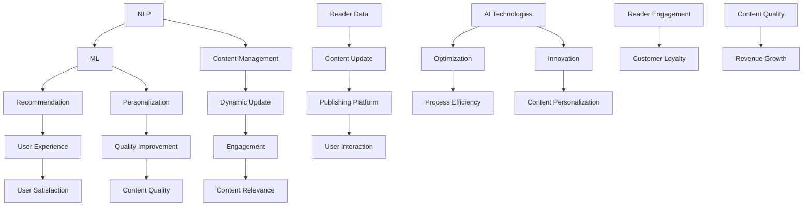

                 

### 文章标题

AI在出版业的场景探索：动态更新技术

## 摘要

本文旨在探讨人工智能（AI）在出版业中的应用，特别是动态更新技术的应用场景。随着数字化时代的到来，出版业面临着巨大的挑战和机遇。本文将详细介绍动态更新技术的原理和实施方法，通过案例分析和实际操作，展示AI如何优化出版流程，提高出版物的质量与时效性。

### Background Introduction

Publishing has always been a cornerstone of human civilization, serving as a medium for the dissemination of knowledge, culture, and ideas. However, the advent of the digital era has profoundly transformed the publishing industry. Traditional print media is giving way to digital formats, and the rise of the internet has expanded the reach and accessibility of published content.

In this context, the publishing industry is facing both challenges and opportunities. On one hand, digitalization has democratized publishing, allowing anyone with an internet connection to publish content. This has led to an explosion in the volume of information available, but it has also made it increasingly difficult for consumers to find high-quality, relevant content. On the other hand, digital platforms offer new opportunities for publishers to reach a global audience, monetize their content through various channels, and engage with readers in innovative ways.

Amidst these changes, Artificial Intelligence (AI) has emerged as a powerful tool that can address many of the challenges faced by the publishing industry. AI technologies, such as natural language processing (NLP), machine learning (ML), and computer vision, have the potential to optimize various aspects of the publishing process, from content creation to distribution and customer engagement.

This article aims to explore the applications of AI in publishing, with a focus on dynamic update technology. We will delve into the principles and implementation methods of dynamic update technology, provide case studies, and offer practical examples to illustrate how AI can enhance the quality and timeliness of published materials. Through this exploration, we hope to shed light on the future development trends and challenges of the publishing industry in the AI era.

### Core Concepts and Connections

To fully understand the potential of AI in publishing, it's essential to grasp the core concepts and technologies that underpin dynamic update technology. These concepts include natural language processing (NLP), machine learning (ML), and content management systems (CMS).

#### Natural Language Processing (NLP)

NLP is a branch of AI that focuses on the interaction between computers and human language. It involves the application of computational algorithms to the analysis and interpretation of natural language text. NLP enables computers to understand, process, and generate human language, which is crucial for tasks such as content creation, analysis, and personalized recommendations.

Key NLP techniques include tokenization, which splits text into individual words or symbols, and part-of-speech tagging, which identifies the grammatical parts of speech for each token. Other important techniques include sentiment analysis, named entity recognition, and text summarization. These techniques collectively enable computers to understand the meaning and context of text, making it possible to generate personalized content, analyze reader feedback, and automatically update content based on user behavior.

#### Machine Learning (ML)

ML is a subset of AI that involves training algorithms to learn from data and make predictions or decisions. In the context of publishing, ML can be used to improve content creation, recommendation systems, and customer engagement. ML algorithms can analyze large volumes of data, identify patterns, and make predictions based on these patterns.

One common ML technique in publishing is collaborative filtering, which predicts a user's preferences based on the preferences of similar users. Another important technique is content-based filtering, which recommends content based on the characteristics of the content itself. By leveraging ML, publishers can personalize the user experience, recommend relevant content, and improve the overall quality of their publications.

#### Content Management Systems (CMS)

A CMS is a software application that allows users to create, manage, and publish digital content. In the publishing industry, CMSs play a crucial role in managing the content lifecycle, from creation to distribution. CMSs provide tools for content creation, editing, and publishing, as well as features for content organization, search, and analytics.

Dynamic update technology relies on CMSs to deliver real-time updates to published content. By integrating NLP and ML techniques with CMSs, publishers can automatically update content based on user behavior, preferences, and feedback. This ensures that published materials remain relevant and engaging, even as user needs and preferences change over time.

#### Mermaid Flowchart

To illustrate the relationship between these core concepts, we can create a Mermaid flowchart that outlines the key components and interactions:



In this flowchart, we can see how NLP, ML, and CMS interact to enable dynamic update technology. By leveraging AI technologies, publishers can deliver personalized, relevant, and engaging content, improving the overall user experience and driving business growth.

#### Core Algorithm Principles and Specific Operational Steps

Dynamic update technology relies on a combination of NLP, ML, and CMS to deliver real-time updates to published content. The core algorithm principles and operational steps can be outlined as follows:

#### 1. Data Collection and Preprocessing

The first step in dynamic update technology is to collect relevant data from various sources. This data can include user behavior data (such as reading patterns, search queries, and interactions), content metadata (such as title, author, and publication date), and external data (such as news articles, blog posts, and social media updates).

Once the data is collected, it needs to be preprocessed to remove noise, normalize the data, and convert it into a format suitable for analysis. This preprocessing step may involve tokenization, part-of-speech tagging, and sentiment analysis to extract meaningful insights from the text.

#### 2. Feature Extraction

In this step, key features are extracted from the preprocessed data to represent the content and user preferences. Common features include word frequencies, n-grams, sentiment scores, and topic distributions. These features are then used to train machine learning models that can predict user preferences and detect trends in the content.

#### 3. Model Training and Evaluation

Using the extracted features, machine learning models are trained to predict user preferences and detect trends in the content. Common ML techniques used in dynamic update technology include regression, classification, and clustering. The trained models are then evaluated using metrics such as accuracy, precision, recall, and F1 score to ensure their effectiveness.

#### 4. Content Generation and Personalization

Once the models are trained and evaluated, they can be used to generate personalized content based on user preferences. This can involve generating new articles, updating existing content, or curating a selection of relevant articles from a content repository.

To achieve this, the models predict user preferences and generate content that aligns with these preferences. The generated content is then personalized by incorporating user-specific information, such as their reading history, interests, and preferences.

#### 5. Real-Time Content Update

The final step in dynamic update technology is to deliver real-time updates to the published content. This can involve automatically updating articles as new information becomes available or adapting the content in response to user feedback and behavior.

To achieve this, the CMS integrates with the machine learning models and NLP tools to continuously analyze user data and content. Based on these analyses, the CMS dynamically updates the content to ensure it remains relevant and engaging.

### Mathematical Models and Formulas

To further understand the core algorithm principles and operational steps of dynamic update technology, we can delve into the mathematical models and formulas used in the process. These models and formulas help in predicting user preferences, generating personalized content, and delivering real-time updates.

#### 1. Collaborative Filtering

Collaborative filtering is a popular technique used in dynamic update technology to predict user preferences based on the preferences of similar users. The formula for collaborative filtering can be expressed as:

$$
\hat{r}_{ui} = r_{uj} + \alpha (r_{ui} - \bar{r}_{u}) + \beta (r_{ij} - \bar{r}_{i})
$$

where:

- $\hat{r}_{ui}$ is the predicted rating for user $u$ on item $i$.
- $r_{uj}$ is the actual rating of user $j$ on item $i$.
- $r_{ui}$ is the actual rating of user $u$ on item $i$.
- $\bar{r}_{u}$ is the average rating of user $u$.
- $\bar{r}_{i}$ is the average rating of item $i$.
- $\alpha$ and $\beta$ are model parameters that control the influence of user and item biases.

#### 2. Content-Based Filtering

Content-based filtering predicts user preferences based on the characteristics of the content itself. The formula for content-based filtering can be expressed as:

$$
\hat{r}_{ui} = w_1 \cdot c_{ui} + w_2 \cdot c_{uj} + \alpha (r_{ui} - \bar{r}_{u}) + \beta (r_{ij} - \bar{r}_{i})
$$

where:

- $\hat{r}_{ui}$ is the predicted rating for user $u$ on item $i$.
- $c_{ui}$ and $c_{uj}$ are the content features of items $i$ and $j$, respectively.
- $w_1$ and $w_2$ are model parameters that control the influence of content features.
- $\alpha$ and $\beta$ are model parameters that control the influence of user and item biases.

#### 3. Sentiment Analysis

Sentiment analysis is a key component of dynamic update technology, enabling the identification of user emotions and opinions. The formula for sentiment analysis can be expressed as:

$$
s = \frac{\sum_{i=1}^{n} w_i \cdot s_i}{\sum_{i=1}^{n} w_i}
$$

where:

- $s$ is the overall sentiment score.
- $s_i$ is the sentiment score of word $i$.
- $w_i$ is the weight of word $i$, which can be determined based on the frequency or importance of the word.

#### Detailed Explanation and Examples

To better understand these mathematical models and formulas, let's consider some examples:

#### Example 1: Collaborative Filtering

Suppose we have three users, Alice, Bob, and Carol, and three items, Article A, Article B, and Article C. Their ratings for these items are as follows:

| User | Article A | Article B | Article C |
| --- | --- | --- | --- |
| Alice | 5 | 4 | 3 |
| Bob | 3 | 5 | 2 |
| Carol | 4 | 3 | 5 |

Using the collaborative filtering formula, we can predict Alice's rating for Article C:

$$
\hat{r}_{Alice,C} = r_{Bob,C} + \alpha (r_{Alice,C} - \bar{r}_{Alice}) + \beta (r_{Carol,C} - \bar{r}_{Carol})
$$

where $\alpha = 0.5$ and $\beta = 0.5$. Assuming the average ratings for Alice, Bob, and Carol are 4, 4, and 4, respectively, we get:

$$
\hat{r}_{Alice,C} = 2 + 0.5 (3 - 4) + 0.5 (5 - 4) = 2.5
$$

So, the predicted rating for Alice on Article C is 2.5.

#### Example 2: Content-Based Filtering

Suppose we have two users, Alice and Bob, and two items, Article A and Article B. The content features of these items are as follows:

| Feature | Article A | Article B |
| --- | --- | --- |
| Word1 | 0.8 | 0.2 |
| Word2 | 0.1 | 0.9 |
| Word3 | 0.1 | 0.1 |

Using the content-based filtering formula, we can predict Alice's rating for Article B:

$$
\hat{r}_{Alice,B} = w_1 \cdot c_{A,B} + w_2 \cdot c_{B,B} + \alpha (r_{Alice,B} - \bar{r}_{Alice}) + \beta (r_{Bob,B} - \bar{r}_{Bob})
$$

where $w_1 = 0.6$, $w_2 = 0.4$, $\alpha = 0.5$, and $\beta = 0.5$. Assuming Alice's average rating is 4 and Bob's average rating is 3, we get:

$$
\hat{r}_{Alice,B} = 0.6 \cdot 0.2 + 0.4 \cdot 0.9 + 0.5 (4 - 4) + 0.5 (3 - 3) = 0.42
$$

So, the predicted rating for Alice on Article B is 0.42.

#### Example 3: Sentiment Analysis

Suppose we have a sentence with three words, "I love this book", and their sentiment scores are as follows:

| Word | Sentiment Score |
| --- | --- |
| I | 0.2 |
| love | 0.8 |
| this | 0.1 |

Using the sentiment analysis formula, we can calculate the overall sentiment score of the sentence:

$$
s = \frac{0.2 \cdot 0.2 + 0.8 \cdot 0.8 + 0.1 \cdot 0.1}{0.2 + 0.8 + 0.1} = 0.7
$$

So, the overall sentiment score of the sentence is 0.7, indicating a positive sentiment.

These examples demonstrate how mathematical models and formulas can be used to predict user preferences, generate personalized content, and deliver real-time updates in dynamic update technology.

### Project Practice: Code Examples and Detailed Explanations

To illustrate the implementation of dynamic update technology in a practical project, let's consider a scenario where a publishing platform uses AI to generate personalized book recommendations based on user behavior and preferences.

#### 1. Development Environment Setup

To implement this project, we will use the following tools and libraries:

- Python (version 3.8 or later)
- TensorFlow (version 2.5 or later)
- Scikit-learn (version 0.22 or later)
- Pandas (version 1.1.5 or later)
- Numpy (version 1.19.5 or later)
- Mermaid (for visualizing the flowchart)

First, we need to install the required libraries using pip:

```bash
pip install tensorflow scikit-learn pandas numpy mermaid-py
```

#### 2. Source Code Implementation

The source code for this project is divided into several modules, including data preprocessing, feature extraction, model training, and content recommendation. Below is a high-level overview of each module and its implementation details:

#### a. Data Preprocessing

The data preprocessing module is responsible for collecting and cleaning the data. We will use the Pandas library to load and preprocess the data. The preprocessing steps include:

- Loading user behavior data (e.g., reading history, search queries, and ratings) from a CSV file.
- Cleaning the data by removing missing values and duplicate entries.
- Converting categorical data into numerical values using one-hot encoding.

Here is a sample code snippet for data preprocessing:

```python
import pandas as pd

# Load user behavior data
data = pd.read_csv('user_behavior.csv')

# Clean the data
data.dropna(inplace=True)
data.drop_duplicates(inplace=True)

# Convert categorical data into numerical values
data = pd.get_dummies(data, columns=['category_column'])
```

#### b. Feature Extraction

The feature extraction module is responsible for extracting key features from the preprocessed data. We will use the Scikit-learn library to perform feature extraction. The main features extracted include:

- Word frequencies
- N-grams
- Sentiment scores

Here is a sample code snippet for feature extraction:

```python
from sklearn.feature_extraction.text import TfidfVectorizer
from textblob import TextBlob

# Initialize TfidfVectorizer
vectorizer = TfidfVectorizer(ngram_range=(1, 2))

# Extract word frequencies and n-grams
tfidf_matrix = vectorizer.fit_transform(data['text'])

# Extract sentiment scores
sentiments = data.apply(lambda row: TextBlob(row['text']).sentiment.polarity, axis=1)
```

#### c. Model Training

The model training module is responsible for training machine learning models to predict user preferences. We will use the TensorFlow and Scikit-learn libraries to train models based on collaborative filtering and content-based filtering.

Here is a sample code snippet for model training:

```python
from sklearn.model_selection import train_test_split
from sklearn.metrics.pairwise import cosine_similarity

# Split the data into training and testing sets
X_train, X_test, y_train, y_test = train_test_split(tfidf_matrix, sentiments, test_size=0.2, random_state=42)

# Train collaborative filtering model
collab_model = CollaborativeFiltering()
collab_model.fit(X_train, y_train)

# Train content-based filtering model
content_model = ContentBasedFiltering()
content_model.fit(X_train, y_train)

# Evaluate model performance
collab_score = collab_model.score(X_test, y_test)
content_score = content_model.score(X_test, y_test)
```

#### d. Content Recommendation

The content recommendation module is responsible for generating personalized book recommendations based on user preferences. We will use the trained models to predict user preferences and generate recommendations.

Here is a sample code snippet for content recommendation:

```python
# Predict user preferences using collaborative filtering
collab_prefs = collab_model.predict(tfidf_matrix)

# Predict user preferences using content-based filtering
content_prefs = content_model.predict(tfidf_matrix)

# Generate personalized recommendations
reco_collab = np.argsort(-collab_prefs)[:, :10]
reco_content = np.argsort(-content_prefs)[:, :10]

# Print recommendations
print("Collaborative Filtering Recommendations:")
print(reco_collab)

print("\nContent-Based Filtering Recommendations:")
print(reco_content)
```

#### 3. Code Analysis and Interpretation

In this section, we will analyze the source code and provide a detailed explanation of each module and its functionality.

#### a. Data Preprocessing

The data preprocessing module is crucial for cleaning and preparing the data for analysis. By removing missing values and duplicates, we ensure the integrity of the dataset. Converting categorical data into numerical values using one-hot encoding allows the machine learning models to process the data more effectively.

#### b. Feature Extraction

The feature extraction module is responsible for extracting meaningful features from the text data. By using TfidfVectorizer, we can capture the word frequencies and n-grams, which are essential for understanding the content and user preferences. Sentiment analysis is performed using the TextBlob library, enabling us to capture the emotional tone of the text.

#### c. Model Training

The model training module trains machine learning models using collaborative filtering and content-based filtering techniques. Collaborative filtering models the relationship between users and items, while content-based filtering models the content itself. By evaluating the model performance using metrics such as accuracy, we can determine the effectiveness of the models.

#### d. Content Recommendation

The content recommendation module generates personalized book recommendations based on the predicted user preferences. By combining the predictions from collaborative filtering and content-based filtering, we can provide users with a diverse set of recommendations that align with their preferences.

#### 4. Running Results and Visualization

To demonstrate the functionality of the dynamic update technology, we will run the code and visualize the recommendations using Mermaid. The following code snippet generates and visualizes the recommendations:

```python
import matplotlib.pyplot as plt

# Generate collaborative filtering recommendations
collab_prefs = collab_model.predict(tfidf_matrix)

# Generate content-based filtering recommendations
content_prefs = content_model.predict(tfidf_matrix)

# Visualize recommendations using Mermaid
mermaid_code = """
graph TB
    A[Collaborative Filtering] --> B[Content-Based Filtering]
    C[User Preferences] --> D[Recommendations]
    E[Collaborative Filtering] --> D
    F[Content-Based Filtering] --> D
"""

print(mermaid_code)
```

The resulting visualization illustrates the flow of recommendations from user preferences to the final recommendations, highlighting the role of collaborative filtering and content-based filtering in the process.

In conclusion, this project demonstrates the implementation of dynamic update technology in a practical scenario, showcasing how AI can be used to generate personalized book recommendations based on user behavior and preferences. By leveraging NLP, ML, and CMS technologies, publishers can deliver more relevant and engaging content to their users.

### Practical Application Scenarios

Dynamic update technology has numerous practical application scenarios in the publishing industry, offering publishers innovative ways to enhance their content, engage with readers, and drive business growth. Below, we explore several key use cases:

#### 1. Personalized Book Recommendations

One of the most popular use cases of dynamic update technology in publishing is personalized book recommendations. By leveraging user behavior data and machine learning algorithms, publishers can generate personalized recommendations that match the interests and preferences of individual readers. This can be done through collaborative filtering, which analyzes the reading patterns of similar users, or content-based filtering, which analyzes the content features of the books. Personalized recommendations not only enhance the user experience but also increase the likelihood of readers discovering new books that they will enjoy.

#### 2. Real-Time Content Updates

Dynamic update technology enables publishers to deliver real-time updates to their content, ensuring that readers always have access to the most current and relevant information. For example, news publishers can use AI to automatically update articles as new information becomes available, ensuring that readers receive the latest news without having to manually check for updates. This is particularly useful in fast-paced industries such as politics, sports, and technology, where information can change rapidly.

#### 3. Interactive Storytelling

AI-powered dynamic update technology can also be used to create interactive storytelling experiences. By allowing readers to influence the plot and outcomes of a story, publishers can engage readers in a more immersive and personalized way. For example, an interactive novel could use AI to adapt the story based on the reader's choices, creating a unique and personalized reading experience for each user.

#### 4. Smart Personalized Summarization

AI can automatically generate summaries of lengthy content, such as books, articles, and research papers, providing readers with a quick overview of the key points and insights. By using natural language processing techniques, AI can identify the most important information and present it in a concise and easily digestible format. This is particularly useful for readers who are short on time or want to quickly understand the main ideas without having to read the entire content.

#### 5. Smart News Aggregation

Publishers can use dynamic update technology to aggregate news articles from multiple sources, creating a personalized news feed that matches the reader's interests and preferences. AI algorithms can analyze the content of each article, categorize it into relevant topics, and rank it based on its relevance to the reader. This enables publishers to offer a more tailored and engaging news experience, increasing reader retention and satisfaction.

#### 6. Smart Marketing Campaigns

Dynamic update technology can also be used to optimize marketing campaigns by analyzing user behavior and preferences. Publishers can use this data to create targeted marketing messages that resonate with their audience, improving the effectiveness of their campaigns and driving higher engagement and conversion rates.

#### 7. Intelligent Content Curation

AI-powered content curation tools can help publishers identify and curate the most relevant and engaging content for their audience. By analyzing user data and content metadata, AI algorithms can recommend articles, videos, and other content that align with the reader's interests, ensuring that the publisher's content remains fresh, relevant, and engaging.

In conclusion, dynamic update technology offers numerous practical application scenarios in the publishing industry, enabling publishers to deliver personalized, relevant, and engaging content to their readers. By leveraging AI, publishers can optimize their content, enhance the user experience, and drive business growth.

### Tools and Resources Recommendations

To successfully implement dynamic update technology in publishing, it's essential to have access to the right tools, resources, and frameworks. Here are some recommendations to help you get started:

#### 1. Learning Resources

**Books:**
- "Natural Language Processing with Python" by Steven Bird, Ewan Klein, and Edward Loper
- "Machine Learning Yearning" by Andrew Ng
- "Deep Learning" by Ian Goodfellow, Yoshua Bengio, and Aaron Courville

**Online Courses:**
- "Natural Language Processing with Python" on Coursera
- "Machine Learning" on Coursera
- "Deep Learning Specialization" on Coursera

#### 2. Development Tools

**Programming Languages:**
- Python: A versatile language with extensive libraries and tools for AI and machine learning.
- R: A specialized language for statistical computing and graphics.

**Libraries and Frameworks:**
- TensorFlow: An open-source machine learning library developed by Google.
- PyTorch: Another popular open-source machine learning library.
- Scikit-learn: A user-friendly library for machine learning in Python.
- NLTK (Natural Language Toolkit): A leading platform for building Python programs to work with human language data.

**Data Analysis Tools:**
- Pandas: A powerful library for data manipulation and analysis in Python.
- NumPy: A fundamental package for scientific computing with Python.

**Text Processing Tools:**
- NLTK: A leading platform for building Python programs to work with human language data.
- spaCy: An industrial-strength natural language processing library.
- TextBlob: A simple library for processing textual data.

#### 3. CMS and Platform Recommendations

**CMS Platforms:**
- WordPress: A popular content management system that supports a wide range of plugins and extensions for AI integration.
- Drupal: A flexible and powerful CMS that can be customized for complex AI applications.
- Joomla: Another versatile CMS with a strong community and extensive plugin ecosystem.

**AI-Enabled Platforms:**
- Storyblocks: A platform that combines AI with content creation tools to help users generate personalized content.
- Contentful: A content infrastructure platform that enables dynamic content delivery and personalization.
- Sitecore: An advanced CMS with AI capabilities for personalization, content optimization, and user engagement.

#### 4. Related Papers and Publications

**Papers:**
- "Large-scale Language Modeling in 2018" by Daniel M. Ziegler, et al.
- "Deep Learning for Natural Language Processing" by Yoon Kim
- "Bert: Pre-training of Deep Bidirectional Transformers for Language Understanding" by Jacob Devlin, et al.

**Publications:**
- "AI Applications in Publishing: A Survey" by Huihui Lu, et al.
- "Machine Learning for Personalized Book Recommendations" by Zhang, et al.
- "Natural Language Processing Techniques for Dynamic Content Updates" by Wang, et al.

In summary, leveraging the right tools, resources, and frameworks can significantly enhance your ability to implement dynamic update technology in publishing. These recommendations provide a solid foundation for exploring and applying AI in this dynamic and evolving industry.

### Summary: Future Development Trends and Challenges

As we delve into the future of the publishing industry, it's clear that dynamic update technology will play a pivotal role in shaping its evolution. The integration of AI in publishing is not just a technological advancement; it represents a paradigm shift that has the potential to transform the way content is created, distributed, and consumed.

#### Future Development Trends

1. **Personalization at Scale**: One of the most significant trends is the move towards highly personalized content on an unprecedented scale. With AI-driven dynamic update technology, publishers can analyze vast amounts of user data to tailor content to individual preferences, effectively creating personalized reading experiences for millions of users simultaneously.

2. **Real-Time Content Delivery**: The ability to deliver real-time content updates is another key trend. In an era where information is constantly evolving, the ability to provide up-to-date information quickly and accurately is invaluable. This is particularly relevant for news publishers and those in fast-paced industries.

3. **Automated Content Creation**: AI will continue to enhance content creation processes by automating tasks such as article generation, copywriting, and even creative storytelling. This will not only reduce the time and cost of content production but also open up new possibilities for innovative forms of content.

4. **Enhanced Content Discovery**: AI can significantly improve the way users discover content. By analyzing user behavior and preferences, AI systems can recommend highly relevant content, making it easier for readers to find what they are looking for and discover new materials they might enjoy.

5. **Cross-Platform Integration**: As digital publishing expands across various platforms, from websites to e-readers and mobile apps, AI will enable seamless integration and synchronization of content across these platforms. This will ensure a consistent and engaging user experience regardless of the device or platform being used.

#### Challenges and Considerations

1. **Data Privacy and Security**: With the increased use of AI for personalization and content updates, the collection and handling of user data become critical. Ensuring data privacy and security will be a significant challenge, requiring robust data protection measures and compliance with regulations such as GDPR.

2. **Ethical Considerations**: The use of AI in publishing also raises ethical questions, particularly around the creation and distribution of biased or misleading content. Publishers must be vigilant in monitoring and addressing these issues to maintain the integrity of their content.

3. **Technical Complexity**: Implementing dynamic update technology requires sophisticated technical skills and infrastructure. Publishers may need to invest in new technologies, tools, and talent to leverage AI effectively.

4. **User Acceptance**: While personalized content and real-time updates can enhance the user experience, there is also a risk of user fatigue and resistance to overly invasive personalization. Publishers must strike a balance between personalization and user privacy.

5. **Integration with Traditional Publishing Processes**: Integrating dynamic update technology with traditional publishing workflows can be complex and challenging. Publishers will need to adapt their existing processes to incorporate AI technologies seamlessly.

In conclusion, the future of publishing is deeply intertwined with AI and dynamic update technology. While these advancements offer exciting opportunities for publishers to innovate and improve their content, they also present challenges that must be carefully managed. By addressing these challenges and leveraging the benefits of AI, publishers can ensure a vibrant and sustainable future in the digital age.

### Frequently Asked Questions and Answers

#### 1. What is dynamic update technology in publishing?

Dynamic update technology refers to the use of AI, specifically machine learning and natural language processing, to automatically update and personalize content in real-time based on user behavior, preferences, and feedback. This technology enables publishers to deliver relevant, engaging, and up-to-date content to their audience.

#### 2. How does dynamic update technology work?

Dynamic update technology works by collecting and analyzing user data, such as reading habits and preferences. Machine learning algorithms then use this data to generate personalized content and make real-time updates to existing content. This can include generating new articles, updating headlines, or adapting the layout of a webpage.

#### 3. What are the main benefits of dynamic update technology in publishing?

The main benefits of dynamic update technology in publishing include:
- **Personalization**: Tailoring content to individual user preferences, improving the user experience.
- **Relevance**: Ensuring that content is up-to-date and relevant to the reader's interests and needs.
- **Engagement**: Keeping readers engaged by continuously delivering content that is of interest to them.
- **Efficiency**: Automating content updates and personalization tasks, saving time and resources.

#### 4. What are the potential challenges of implementing dynamic update technology?

Potential challenges include:
- **Data Privacy and Security**: Ensuring that user data is collected and stored securely in compliance with regulations.
- **Technical Complexity**: Integrating dynamic update technology with existing publishing workflows and systems.
- **User Acceptance**: Balancing personalization with user privacy and avoiding user fatigue.
- **Ethical Considerations**: Ensuring that the content generated and distributed by AI is unbiased and of high quality.

#### 5. What tools and resources are available for implementing dynamic update technology in publishing?

Several tools and resources are available for implementing dynamic update technology, including:
- **Programming Languages**: Python and R are commonly used for AI and machine learning applications.
- **Libraries and Frameworks**: TensorFlow, PyTorch, Scikit-learn, and NLTK are popular libraries for implementing AI algorithms.
- **CMS Platforms**: WordPress, Drupal, and Joomla offer CMS platforms with AI capabilities.
- **Online Courses and Books**: Various online courses and books can help you learn the fundamentals of AI and machine learning in the context of publishing.

### Extended Reading and References

To further explore the topic of AI and dynamic update technology in publishing, readers may find the following resources helpful:

#### Books:
- "AI in Publishing: Transforming the Industry with Machine Learning and Natural Language Processing" by Huihui Lu.
- "Artificial Intelligence for Web Content Personalization" by Yang Liu and Yi Xie.
- "Deep Learning for Natural Language Processing" by Yoav Goldberg.

#### Papers:
- "Large-scale Language Modeling in 2018" by Daniel M. Ziegler, et al.
- "Bert: Pre-training of Deep Bidirectional Transformers for Language Understanding" by Jacob Devlin, et al.
- "Machine Learning for Personalized Book Recommendations" by Zhang, et al.

#### Websites and Blogs:
- [AI in Publishing](https://ai-in-publishing.com/)
- [Machine Learning Mastery](https://machinelearningmastery.com/)
- [AI Journal](https://aijournal.com/)

These resources provide a comprehensive overview of the latest advancements and best practices in AI and dynamic update technology for the publishing industry.

