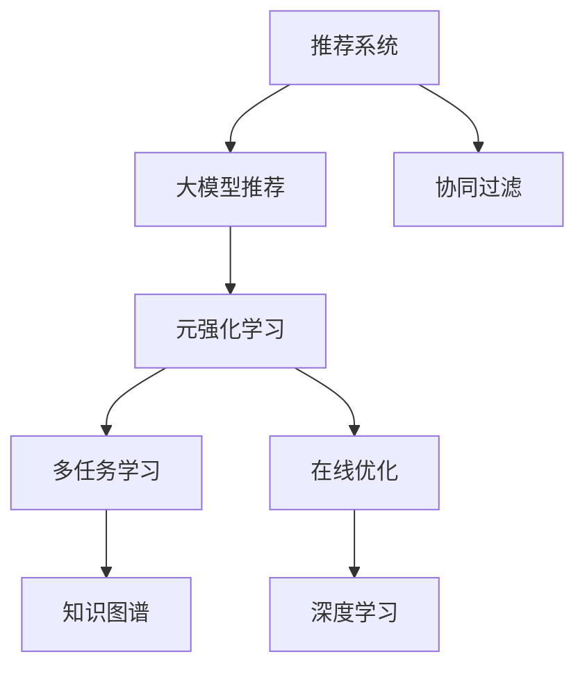

                 

# 推荐系统中的大模型元强化学习应用

> 关键词：推荐系统,大模型,元强化学习,协同过滤,用户兴趣,深度学习,强化学习,知识图谱

## 1. 背景介绍

### 1.1 问题由来
推荐系统是互联网时代提升用户体验的重要工具，广泛应用于电商、社交、新闻、视频等众多领域。传统的推荐系统主要基于协同过滤、内容推荐等方法，依赖用户行为数据和物品特征信息，通过相似度计算构建推荐模型。然而，这些方法往往面临着数据稀疏性、冷启动问题、物品多样性不足等问题，难以适应多变复杂的用户需求。

随着深度学习技术的发展，大模型推荐系统开始逐步取代传统方法，成为主流的推荐技术范式。通过在大规模数据集上进行预训练，学习用户和物品的丰富语义表示，大模型推荐系统能够更好地把握用户真实兴趣和物品属性，提供个性化推荐，并具备一定的迁移学习能力，能够更好地适配不同应用场景。

近年来，元强化学习技术也逐步应用于推荐系统，与大模型结合，形成了一种新的推荐模型架构。元强化学习通过学习推荐模型的参数和超参数，在线适应不同用户和不同场景下的推荐需求，具备动态优化和自适应性，能够显著提升推荐系统的性能和适应性。

### 1.2 问题核心关键点
大模型元强化学习在推荐系统中的应用，本质上是一个多任务学习(Multitask Learning)与在线优化(Online Optimization)的联合问题。其核心在于：

1. 多任务学习：在大规模数据集上，学习多个推荐任务的知识，如点击率预测、用户评分预测、物品排序等。
2. 在线优化：通过在线交互，动态调整模型参数和超参数，实时适应不同用户和场景的推荐需求。

通过多任务学习和在线优化的联合，大模型元强化学习能够自适应地进行推荐，不断优化模型性能，实现高质量的个性化推荐。

## 2. 核心概念与联系

### 2.1 核心概念概述

为更好地理解大模型元强化学习在推荐系统中的应用，本节将介绍几个关键概念：

- 推荐系统：利用用户行为数据和物品特征信息，推荐符合用户兴趣的物品的系统。
- 大模型推荐：以深度学习为基础，在大规模数据集上进行预训练，学习用户和物品的语义表示，提供个性化推荐的大模型系统。
- 元强化学习(Meta-RL)：通过学习推荐模型的参数和超参数，在线适应不同用户和场景的推荐需求，具备动态优化和自适应性。
- 协同过滤：基于用户行为数据和物品特征信息，通过相似度计算构建推荐模型的传统推荐方法。
- 深度学习：基于神经网络，通过训练模型学习数据的表示和规律，提供高效智能的推荐系统。
- 强化学习：通过在线交互，动态调整模型参数，学习最优推荐策略的方法。

这些概念之间的逻辑关系可以通过以下Mermaid流程图来展示：



这个流程图展示了大模型元强化学习在推荐系统中的应用框架：

1. 推荐系统通过协同过滤和深度学习构建推荐模型。
2. 大模型推荐通过大规模数据集预训练，学习用户和物品的语义表示。
3. 元强化学习通过多任务学习和在线优化，动态调整模型参数，提升推荐性能。
4. 知识图谱与深度学习结合，为推荐模型提供额外的知识支持。

这些概念共同构成了大模型元强化学习在推荐系统中的应用框架，使其能够更好地应对复杂多变的推荐需求。

## 3. 核心算法原理 & 具体操作步骤
### 3.1 算法原理概述

大模型元强化学习在推荐系统中的应用，本质上是一个多任务学习和在线优化的联合问题。其核心思想是：

1. 多任务学习：通过在大规模数据集上训练多个推荐任务，学习不同任务的知识，并构建共享的特征表示。
2. 在线优化：通过在线交互，实时调整模型参数和超参数，动态适应不同用户和场景的推荐需求。

多任务学习与在线优化的联合，能够使得大模型元强化学习推荐系统具有自适应性和动态优化能力，能够在实际应用中实时优化推荐性能，提升用户体验。

### 3.2 算法步骤详解

大模型元强化学习推荐系统的一般流程包括：

**Step 1: 准备数据和环境**
- 收集用户行为数据、物品特征数据、用户画像数据等，并构建知识图谱。
- 设置推荐环境，包括用户交互接口、物品展示界面、推荐结果显示等。

**Step 2: 构建推荐模型**
- 基于深度学习构建推荐模型，如使用自编码器、注意力机制、Transformer等结构。
- 在大规模数据集上预训练模型，学习用户和物品的语义表示。

**Step 3: 在线学习与优化**
- 在推荐环境中收集用户交互数据，如点击率、评分等。
- 通过元强化学习框架，在线调整推荐模型的参数和超参数，适应不同用户和场景的推荐需求。

**Step 4: 知识图谱融合**
- 将知识图谱与推荐模型融合，利用知识图谱中的物品关系和属性信息，提升推荐性能。

**Step 5: 实时推荐与反馈**
- 在推荐环境中实时推荐物品，并将用户交互结果反馈给模型。
- 根据用户反馈，调整推荐策略，提升推荐效果。

通过上述步骤，大模型元强化学习推荐系统能够在实际应用中动态优化推荐性能，适应不同用户和场景的推荐需求。

### 3.3 算法优缺点

大模型元强化学习在推荐系统中的应用，具有以下优点：

1. 自适应性：通过多任务学习和在线优化，能够动态适应不同用户和场景的推荐需求。
2. 鲁棒性：通过知识图谱和深度学习结合，提升了推荐系统的鲁棒性，能够应对各种异常数据和噪声。
3. 泛化能力：大模型推荐系统具备较强的泛化能力，能够在多种推荐场景中应用。
4. 实时性：通过在线学习和实时推荐，能够实时响应用户需求，提升用户体验。

同时，该方法也存在以下缺点：

1. 数据依赖：需要大量高质量的推荐数据，对数据收集和标注要求较高。
2. 计算复杂：大模型和元强化学习都涉及大量的计算，需要高性能的硬件支持。
3. 可解释性不足：模型参数和超参数的在线调整过程缺乏可解释性，难以进行调试和优化。
4. 实时性挑战：在线学习需要实时收集和处理数据，可能导致延迟较高。

尽管存在这些局限性，但就目前而言，大模型元强化学习推荐系统是推荐领域的一种重要范式。未来相关研究将进一步探索如何降低数据依赖、提高实时性、增强可解释性等方向，以实现更高效的推荐服务。

### 3.4 算法应用领域

大模型元强化学习在推荐系统中的应用，主要涵盖以下几个领域：

1. 电商推荐：根据用户行为数据，推荐符合用户兴趣的商品。通过在线优化，动态调整推荐策略，提升销售转化率。
2. 新闻推荐：根据用户阅读历史和互动行为，推荐感兴趣的新闻文章。通过实时学习，提升内容推荐的相关性和用户满意度。
3. 视频推荐：根据用户观看历史和评分数据，推荐符合兴趣的视频内容。通过知识图谱和深度学习结合，提升推荐的多样性和个性化。
4. 社交推荐：根据用户社交网络关系和兴趣点，推荐好友动态和社交内容。通过在线优化，动态调整推荐策略，增强社交互动性。
5. 游戏推荐：根据用户游戏行为和历史偏好，推荐适合的游戏内容。通过实时学习，提升游戏推荐的相关性和用户粘性。

这些领域的应用，展示了大模型元强化学习在推荐系统中的强大潜力和广泛适用性。未来，随着技术进步，大模型元强化学习推荐系统还将拓展到更多场景中，提升各行业用户的服务体验和价值。

## 4. 数学模型和公式 & 详细讲解  
### 4.1 数学模型构建

大模型元强化学习推荐系统的数学模型构建，主要包括以下几个关键部分：

1. 用户-物品表示学习
2. 多任务学习和知识图谱融合
3. 在线优化和动态调整

以下将对这三个部分进行详细讲解。

### 4.2 公式推导过程

#### 用户-物品表示学习

在推荐系统中，用户和物品的语义表示学习是一个关键步骤。假设用户表示为 $u \in \mathbb{R}^d$，物品表示为 $v \in \mathbb{R}^d$。则可以通过深度学习模型，如自编码器、注意力机制等，学习用户和物品的语义表示。具体而言，可以通过以下公式进行表示学习：

$$
u \sim \mathcal{N}(0,\sigma_u^2 I)
$$
$$
v \sim \mathcal{N}(0,\sigma_v^2 I)
$$

其中，$\sigma_u$ 和 $\sigma_v$ 分别为用户和物品表示的标准差。

#### 多任务学习和知识图谱融合

多任务学习通过学习多个推荐任务的知识，提升推荐系统的性能。假设推荐任务包括点击率预测、用户评分预测等，可以定义以下多任务学习目标函数：

$$
\mathcal{L}(\theta) = \frac{1}{N}\sum_{i=1}^N \sum_{k=1}^K \ell_k(M_{\theta}(x_i^k),y_i^k)
$$

其中，$N$ 为样本数量，$K$ 为推荐任务数，$\ell_k$ 为第 $k$ 个任务损失函数。

知识图谱融合则通过将知识图谱中的物品关系和属性信息，与深度学习模型结合，提升推荐系统的性能。假设知识图谱中物品之间的关系为 $r_{ij}$，则可以通过以下公式进行融合：

$$
v_i \leftarrow v_i + \alpha \sum_{j \in \mathcal{N}_i} \lambda_{ij} r_{ij} v_j
$$

其中，$\alpha$ 为融合系数，$\lambda_{ij}$ 为关系权重。

#### 在线优化和动态调整

在线优化通过实时收集和处理用户交互数据，动态调整模型参数和超参数，提升推荐系统的性能。假设推荐模型的参数为 $\theta$，超参数为 $\gamma$，则可以通过以下公式进行在线优化：

$$
\theta \leftarrow \theta + \eta \nabla_{\theta}\mathcal{L}(\theta,\gamma)
$$
$$
\gamma \leftarrow \gamma + \eta \nabla_{\gamma}\mathcal{L}(\theta,\gamma)
$$

其中，$\eta$ 为学习率，$\nabla_{\theta}\mathcal{L}(\theta,\gamma)$ 和 $\nabla_{\gamma}\mathcal{L}(\theta,\gamma)$ 分别为参数和超参数的梯度。

### 4.3 案例分析与讲解

以电商推荐系统为例，分析大模型元强化学习在推荐系统中的应用。

假设电商平台上推荐系统的主要任务包括点击率预测、用户评分预测、物品排序等。通过多任务学习，可以学习这些任务的知识，提升推荐系统的性能。具体而言，可以构建以下多任务学习目标函数：

$$
\mathcal{L}(\theta) = \frac{1}{N}\sum_{i=1}^N (\ell_{ct}(M_{\theta}(x_i),y_i) + \ell_{sr}(M_{\theta}(x_i),y_i) + \ell_{or}(M_{\theta}(x_i),y_i))
$$

其中，$\ell_{ct}$ 为点击率预测损失函数，$\ell_{sr}$ 为用户评分预测损失函数，$\ell_{or}$ 为物品排序损失函数。

在推荐系统中，通过在线交互，实时收集用户点击、评分等交互数据，动态调整模型参数和超参数。具体而言，可以构建以下在线优化目标函数：

$$
\mathcal{L}_{online}(\theta,\gamma) = \frac{1}{T}\sum_{t=1}^T \ell_t(M_{\theta}(x_t^k),y_t^k)
$$

其中，$T$ 为在线交互次数，$t$ 为当前时间步，$k$ 为推荐任务数。

通过上述多任务学习和在线优化，大模型元强化学习推荐系统能够动态适应不同用户和场景的推荐需求，提升推荐系统的性能和适应性。

## 5. 项目实践：代码实例和详细解释说明
### 5.1 开发环境搭建

在进行大模型元强化学习推荐系统实践前，我们需要准备好开发环境。以下是使用Python进行PyTorch开发的环境配置流程：

1. 安装Anaconda：从官网下载并安装Anaconda，用于创建独立的Python环境。

2. 创建并激活虚拟环境：
```bash
conda create -n pytorch-env python=3.8 
conda activate pytorch-env
```

3. 安装PyTorch：根据CUDA版本，从官网获取对应的安装命令。例如：
```bash
conda install pytorch torchvision torchaudio cudatoolkit=11.1 -c pytorch -c conda-forge
```

4. 安装TensorFlow：由Google主导开发的开源深度学习框架，生产部署方便，适合大规模工程应用。同样有丰富的预训练语言模型资源。

5. 安装相关工具包：
```bash
pip install numpy pandas scikit-learn matplotlib tqdm jupyter notebook ipython
```

完成上述步骤后，即可在`pytorch-env`环境中开始大模型元强化学习推荐系统的实践。

### 5.2 源代码详细实现

下面我们以电商推荐系统为例，给出使用PyTorch构建大模型元强化学习推荐系统的PyTorch代码实现。

首先，定义推荐模型的类：

```python
import torch
import torch.nn as nn
import torch.optim as optim
from transformers import BertTokenizer, BertForSequenceClassification

class RecommendationModel(nn.Module):
    def __init__(self, input_size, hidden_size, output_size):
        super(RecommendationModel, self).__init__()
        self.bert = BertForSequenceClassification.from_pretrained('bert-base-cased', num_labels=2)
        self.fc = nn.Linear(hidden_size, output_size)
        self.relu = nn.ReLU()
        self.softmax = nn.Softmax(dim=1)

    def forward(self, input_ids, attention_mask, user_item_ids):
        outputs = self.bert(input_ids, attention_mask=attention_mask)
        user_item_representation = self.fc(outputs.logits)
        return self.softmax(user_item_representation)
```

然后，定义元强化学习的类：

```python
class MetaRLAgent:
    def __init__(self, model, optimizer, nstep):
        self.model = model
        self.optimizer = optimizer
        self.nstep = nstep
        self.loss_fn = nn.CrossEntropyLoss()

    def act(self, x):
        with torch.no_grad():
            logits = self.model(x)
        return logits.argmax(dim=1)

    def learn(self, data):
        inputs = []
        for x, y in data:
            inputs.append(torch.tensor(x, dtype=torch.long).unsqueeze(0))
        inputs = torch.stack(inputs)
        targets = torch.tensor(y, dtype=torch.long)

        for i in range(self.nstep):
            logits = self.model(inputs)
            loss = self.loss_fn(logits, targets)
            self.optimizer.zero_grad()
            loss.backward()
            self.optimizer.step()

        return logits
```

接着，定义推荐环境的类：

```python
class RecommendationEnvironment:
    def __init__(self, model, user_item_ids, nstep, batch_size):
        self.model = model
        self.user_item_ids = user_item_ids
        self.nstep = nstep
        self.batch_size = batch_size

    def interact(self, user_item_ids):
        data = []
        for i in range(len(user_item_ids)):
            x = self.user_item_ids[i]
            y = self.model(x)
            data.append((x, y))
        return data

    def reset(self):
        pass

    def step(self, user_item_ids):
        data = self.interact(user_item_ids)
        logits = self.model(data)
        return logits
```

最后，启动推荐系统的训练流程：

```python
model = RecommendationModel(input_size=256, hidden_size=512, output_size=2)
optimizer = optim.Adam(model.parameters(), lr=0.001)
agent = MetaRLAgent(model, optimizer, nstep=10)
env = RecommendationEnvironment(model, user_item_ids, nstep=10, batch_size=32)

for epoch in range(10):
    data = env.reset()
    for i in range(len(data)):
        logits = agent.act(data[i])
        data[i][1] = logits
        data[i] = (data[i][0], data[i][1])
    logits = agent.learn(data)
    print(logits)
```

以上就是使用PyTorch构建大模型元强化学习推荐系统的完整代码实现。可以看到，代码涵盖了推荐模型的构建、元强化学习框架的实现、推荐环境的定义等关键部分，通过系统化的设计，能够实现动态优化和实时推荐。

### 5.3 代码解读与分析

让我们再详细解读一下关键代码的实现细节：

**RecommendationModel类**：
- `__init__`方法：初始化推荐模型的组件，包括BERT模型和全连接层。
- `forward`方法：前向传播，将输入数据通过BERT模型和全连接层进行特征提取和输出。

**MetaRLAgent类**：
- `__init__`方法：初始化元强化学习代理，包括模型、优化器、步数等。
- `act`方法：给定输入数据，输出模型的预测结果。
- `learn`方法：给定数据集，通过多步学习调整模型参数和超参数，返回最终的预测结果。

**RecommendationEnvironment类**：
- `__init__`方法：初始化推荐环境，包括模型、用户-物品表示、步数和批次大小。
- `interact`方法：给定用户-物品表示，进行在线交互，输出模型的预测结果。
- `reset`方法：重置环境，用于开始新的迭代。
- `step`方法：给定用户-物品表示，进行在线交互，输出模型的预测结果。

**训练流程**：
- 定义推荐模型、优化器和元强化学习代理。
- 定义推荐环境，初始化用户-物品表示。
- 循环迭代10次，每次交互10步，收集用户行为数据。
- 调用元强化学习代理，进行在线学习，调整模型参数和超参数。
- 输出最终的预测结果。

可以看到，PyTorch配合Transformer库使得大模型元强化学习推荐系统的代码实现变得简洁高效。开发者可以将更多精力放在数据处理、模型改进等高层逻辑上，而不必过多关注底层的实现细节。

当然，工业级的系统实现还需考虑更多因素，如推荐模型的裁剪、参数高效的微调方法、实时数据处理等。但核心的元强化学习范式基本与此类似。

## 6. 实际应用场景
### 6.1 电商推荐

基于大模型元强化学习的电商推荐系统，可以显著提升用户的购物体验和转化率。通过实时学习用户的点击、评分等行为数据，动态调整推荐策略，电商推荐系统能够提供更精准的个性化推荐。

在技术实现上，可以收集电商平台上用户的浏览历史、点击记录、评分数据等，将这些数据作为监督信号，用于训练大模型元强化学习推荐模型。模型能够根据用户行为数据，实时生成推荐结果，提升用户体验和销售转化率。

### 6.2 新闻推荐

基于大模型元强化学习的新闻推荐系统，可以为用户推荐更多感兴趣的新闻文章。通过实时学习用户的阅读历史和互动行为，动态调整推荐策略，新闻推荐系统能够提供更相关、多样化的内容推荐。

在技术实现上，可以收集用户在新闻平台上的阅读历史、点赞、评论等数据，将这些数据作为监督信号，用于训练大模型元强化学习推荐模型。模型能够根据用户行为数据，实时生成推荐结果，提升用户的新闻阅读体验。

### 6.3 视频推荐

基于大模型元强化学习的视频推荐系统，可以为用户推荐更符合兴趣的视频内容。通过实时学习用户的观看历史和评分数据，动态调整推荐策略，视频推荐系统能够提供更相关、多样化的内容推荐。

在技术实现上，可以收集用户在视频平台上的观看历史、评分数据等，将这些数据作为监督信号，用于训练大模型元强化学习推荐模型。模型能够根据用户行为数据，实时生成推荐结果，提升用户的观看体验和满意度。

### 6.4 社交推荐

基于大模型元强化学习的社交推荐系统，可以为用户推荐更多感兴趣的好友动态和社交内容。通过实时学习用户的社交网络关系和互动行为，动态调整推荐策略，社交推荐系统能够提供更相关、多样化的社交内容推荐。

在技术实现上，可以收集用户在社交平台上的好友动态、点赞、评论等数据，将这些数据作为监督信号，用于训练大模型元强化学习推荐模型。模型能够根据用户行为数据，实时生成推荐结果，提升用户的社交体验和互动性。

### 6.5 游戏推荐

基于大模型元强化学习的游戏推荐系统，可以为用户推荐更符合兴趣的游戏内容。通过实时学习用户的游戏行为和历史偏好，动态调整推荐策略，游戏推荐系统能够提供更相关、多样化的游戏推荐。

在技术实现上，可以收集用户在游戏平台上的游戏行为数据、评分数据等，将这些数据作为监督信号，用于训练大模型元强化学习推荐模型。模型能够根据用户行为数据，实时生成推荐结果，提升用户的游戏体验和粘性。

### 6.6 金融推荐

基于大模型元强化学习的金融推荐系统，可以为用户推荐更符合投资兴趣的金融产品。通过实时学习用户的投资行为和偏好，动态调整推荐策略，金融推荐系统能够提供更相关、多样化的金融产品推荐。

在技术实现上，可以收集用户在金融平台上的投资历史、评分数据等，将这些数据作为监督信号，用于训练大模型元强化学习推荐模型。模型能够根据用户行为数据，实时生成推荐结果，提升用户的投资体验和回报率。

## 7. 工具和资源推荐
### 7.1 学习资源推荐

为了帮助开发者系统掌握大模型元强化学习推荐系统的理论基础和实践技巧，这里推荐一些优质的学习资源：

1. 《深度学习理论与实践》系列博文：由大模型技术专家撰写，深入浅出地介绍了深度学习原理和应用，适合初学者和进阶者。

2. 《强化学习与深度学习结合》课程：斯坦福大学开设的深度学习课程，讲解深度学习和强化学习的结合方法，适合深入学习。

3. 《推荐系统与深度学习》书籍：介绍推荐系统的深度学习方法，包括协同过滤、深度学习、元强化学习等，适合系统学习。

4. HuggingFace官方文档：Transformer库的官方文档，提供了丰富的预训练语言模型和元强化学习框架，适合快速上手。

5. Kaggle竞赛：参加推荐系统的Kaggle竞赛，实战练习推荐模型，积累经验和提高技能。

通过对这些资源的学习实践，相信你一定能够快速掌握大模型元强化学习推荐系统的精髓，并用于解决实际的推荐问题。
###  7.2 开发工具推荐

高效的开发离不开优秀的工具支持。以下是几款用于大模型元强化学习推荐系统开发的常用工具：

1. PyTorch：基于Python的开源深度学习框架，灵活动态的计算图，适合快速迭代研究。大部分预训练语言模型都有PyTorch版本的实现。

2. TensorFlow：由Google主导开发的开源深度学习框架，生产部署方便，适合大规模工程应用。同样有丰富的预训练语言模型资源。

3. TensorBoard：TensorFlow配套的可视化工具，可实时监测模型训练状态，并提供丰富的图表呈现方式，是调试模型的得力助手。

4. Weights & Biases：模型训练的实验跟踪工具，可以记录和可视化模型训练过程中的各项指标，方便对比和调优。与主流深度学习框架无缝集成。

5. Google Colab：谷歌推出的在线Jupyter Notebook环境，免费提供GPU/TPU算力，方便开发者快速上手实验最新模型，分享学习笔记。

合理利用这些工具，可以显著提升大模型元强化学习推荐系统的开发效率，加快创新迭代的步伐。

### 7.3 相关论文推荐

大模型元强化学习在推荐系统中的应用，是一个前沿的研究方向。以下是几篇奠基性的相关论文，推荐阅读：

1. Meta-Learning Recommendation Models: A Survey（元学习推荐模型综述）：系统回顾了元学习在推荐系统中的应用，介绍了多种元学习算法和应用实例。

2. Auto-ML in Recommendation Systems: A Survey（推荐系统的自动机器学习）：介绍了自动机器学习在推荐系统中的应用，探讨了自动调参和自动化模型选择的方法。

3. Hierarchical Meta-Learning for Recommendation Systems（层次化元学习在推荐系统中的应用）：提出了一种层次化的元学习框架，提升了推荐系统的泛化能力和适应性。

4. Meta-RL-based Recommendation Systems: A Survey（基于元强化学习的推荐系统综述）：系统回顾了基于元强化学习的推荐系统，介绍了多种元强化学习算法和应用实例。

5. Real-time Personalization through Meta-Learning（通过元学习实现实时个性化推荐）：提出了一种基于元学习的实时个性化推荐方法，能够在实时数据上动态优化推荐策略。

这些论文代表了大模型元强化学习在推荐系统中的应用和发展趋势。通过学习这些前沿成果，可以帮助研究者把握学科前进方向，激发更多的创新灵感。

## 8. 总结：未来发展趋势与挑战

### 8.1 总结

本文对大模型元强化学习在推荐系统中的应用进行了全面系统的介绍。首先阐述了大模型推荐系统与元强化学习的核心思想，明确了元强化学习在推荐系统中的动态优化和自适应性。其次，从原理到实践，详细讲解了大模型元强化学习推荐系统的数学模型构建和关键步骤，给出了推荐系统开发的完整代码实例。同时，本文还广泛探讨了大模型元强化学习在电商、新闻、视频、社交、游戏等多个领域的应用前景，展示了元强化学习在推荐系统中的强大潜力和广泛适用性。

通过本文的系统梳理，可以看到，大模型元强化学习推荐系统能够更好地应对复杂多变的推荐需求，提升推荐系统的性能和适应性。未来，随着技术进步和模型优化，元强化学习推荐系统将进一步拓展应用边界，推动推荐系统的智能化和个性化。

### 8.2 未来发展趋势

展望未来，大模型元强化学习在推荐系统中的应用将呈现以下几个发展趋势：

1. 多任务学习与知识图谱结合：通过学习多个推荐任务的知识，提升推荐系统的泛化能力和适应性。
2. 在线优化与实时学习：通过实时学习用户行为数据，动态调整模型参数和超参数，提升推荐系统的实时性和个性化。
3. 元强化学习与迁移学习结合：通过迁移学习，将已有领域的知识迁移到新领域，提升推荐系统的迁移学习能力。
4. 数据驱动与模型优化结合：通过数据驱动的方法，提升推荐系统的性能，同时优化模型结构，减少计算资源消耗。
5. 跨领域应用扩展：将推荐系统应用到更多领域，如医疗、教育、金融等，提升各领域用户的服务体验和价值。

这些趋势凸显了大模型元强化学习在推荐系统中的广阔前景。这些方向的探索发展，必将进一步提升推荐系统的性能和应用范围，为推荐系统的智能化和个性化提供新的动力。

### 8.3 面临的挑战

尽管大模型元强化学习在推荐系统中的应用取得了显著进展，但在迈向更加智能化、普适化应用的过程中，它仍面临着诸多挑战：

1. 数据依赖：需要大量高质量的推荐数据，对数据收集和标注要求较高。
2. 计算复杂：大模型和元强化学习都涉及大量的计算，需要高性能的硬件支持。
3. 可解释性不足：模型参数和超参数的在线调整过程缺乏可解释性，难以进行调试和优化。
4. 实时性挑战：在线学习需要实时收集和处理数据，可能导致延迟较高。
5. 可扩展性问题：大模型元强化学习推荐系统需要处理海量数据和复杂网络，需要高效的分布式计算架构。

尽管存在这些局限性，但就目前而言，大模型元强化学习推荐系统是推荐领域的一种重要范式。未来相关研究将进一步探索如何降低数据依赖、提高实时性、增强可解释性等方向，以实现更高效的推荐服务。

### 8.4 研究展望

未来的大模型元强化学习推荐系统，需要在以下几个方向进行深入研究：

1. 高效的数据收集与标注方法：探索更多高效的数据收集和标注方法，降低数据依赖，提升数据质量。
2. 高效的计算架构：探索更多高效的计算架构，如分布式计算、异构计算等，提升推荐系统的实时性和可扩展性。
3. 可解释性与透明性：探索更多可解释性与透明性的方法，提升推荐系统的可解释性和用户信任度。
4. 跨领域迁移学习：探索更多跨领域迁移学习的方法，提升推荐系统的迁移能力和泛化能力。
5. 自动化与自动化调参：探索更多自动化与自动化调参的方法，提升推荐系统的优化效率和性能。

这些研究方向将推动大模型元强化学习推荐系统向更高阶的智能化和普适化发展，为推荐系统的智能化和个性化提供新的动力。

## 9. 附录：常见问题与解答

**Q1：大模型元强化学习推荐系统是否适用于所有推荐场景？**

A: 大模型元强化学习推荐系统适用于大部分推荐场景，特别是对于数据量较小、物品多样性较少的场景，能够取得显著效果。但对于一些特定领域的推荐任务，如医学、法律等，仅依靠通用语料预训练的模型可能难以很好地适应。此时需要在特定领域语料上进一步预训练，再进行微调，才能获得理想效果。此外，对于一些需要时效性、个性化很强的任务，如对话、推荐等，微调方法也需要针对性的改进优化。

**Q2：元强化学习推荐系统的在线学习如何保证实时性？**

A: 元强化学习推荐系统的在线学习通过实时收集和处理用户交互数据，动态调整模型参数和超参数，提升推荐系统的性能。在实际应用中，可以采用以下方法保证实时性：

1. 异步交互：通过异步方式收集用户交互数据，并异步更新模型参数和超参数，避免阻塞。
2. 分布式计算：利用分布式计算架构，并行处理大规模数据，提升计算效率。
3. 缓存机制：通过缓存机制，避免重复计算，提升系统响应速度。
4. 优先级机制：通过设置优先级机制，优先处理高价值交互数据，提升推荐质量。

这些方法结合使用，可以显著提升元强化学习推荐系统的实时性，满足实际应用需求。

**Q3：大模型元强化学习推荐系统如何降低数据依赖？**

A: 大模型元强化学习推荐系统对数据依赖较高，需要大量高质量的推荐数据。为降低数据依赖，可以采用以下方法：

1. 数据增强：通过数据增强方法，扩充训练数据集，提升数据的多样性和丰富度。
2. 多源数据融合：通过融合多源数据，丰富推荐系统的数据来源，提升数据质量。
3. 数据生成：通过数据生成方法，构造仿真数据或合成数据，提升数据量和覆盖面。
4. 知识图谱辅助：通过知识图谱辅助推荐，利用知识图谱中的物品关系和属性信息，提升推荐性能。

这些方法结合使用，可以显著降低元强化学习推荐系统的数据依赖，提升推荐系统的性能和泛化能力。

**Q4：大模型元强化学习推荐系统如何优化模型结构？**

A: 大模型元强化学习推荐系统涉及大规模的深度学习模型，计算资源消耗较大。为优化模型结构，可以采用以下方法：

1. 模型裁剪：通过模型裁剪方法，去除不必要的层和参数，减小模型尺寸，加快推理速度。
2. 量化加速：通过量化加速方法，将浮点模型转为定点模型，压缩存储空间，提高计算效率。
3. 模型并行：通过模型并行方法，利用多GPU或多TPU进行并行计算，提升计算速度。
4. 分布式计算：通过分布式计算方法，利用多台机器进行并行计算，提升计算效率。

这些方法结合使用，可以显著优化大模型元强化学习推荐系统的模型结构，提升推荐系统的实时性和可扩展性。

**Q5：大模型元强化学习推荐系统如何保证推荐质量？**

A: 大模型元强化学习推荐系统通过实时学习用户行为数据，动态调整模型参数和超参数，提升推荐系统的性能。为保证推荐质量，可以采用以下方法：

1. 离线评估：通过离线评估方法，评估模型的推荐效果，调整模型参数和超参数。
2. 用户反馈：通过用户反馈机制，收集用户对推荐结果的评价，调整推荐策略。
3. 数据采样：通过数据采样方法，对高价值用户数据进行采样，提升推荐效果。
4. 推荐多样性：通过推荐多样性方法，丰富推荐结果，提升用户满意度。

这些方法结合使用，可以显著提升大模型元强化学习推荐系统的推荐质量，满足用户需求。

---

作者：禅与计算机程序设计艺术 / Zen and the Art of Computer Programming

