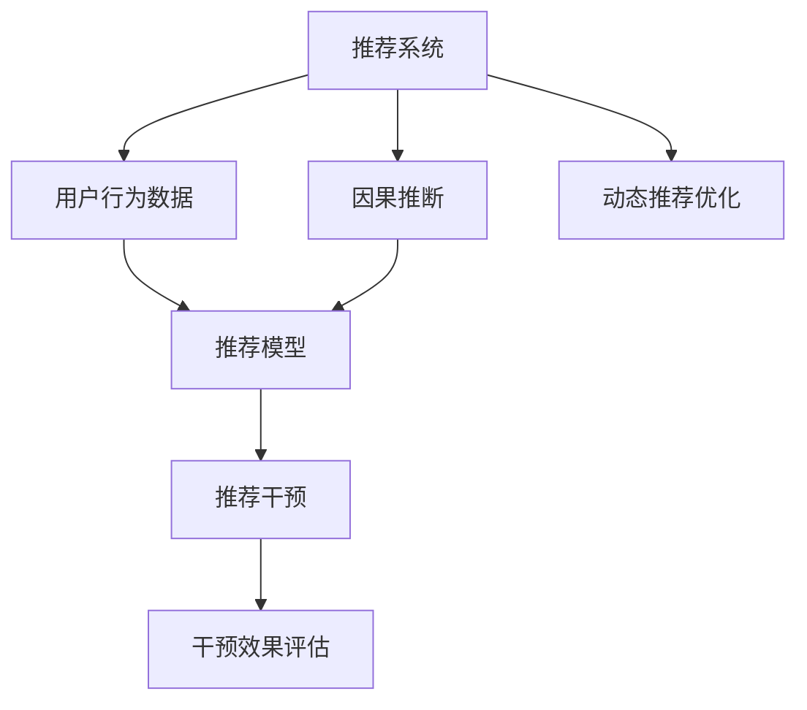

                 

# 推荐系统中的大模型因果推断与干预

## 1. 背景介绍

### 1.1 问题由来

推荐系统是互联网时代的重要应用之一，旨在为用户提供个性化的信息推荐服务。传统的推荐算法主要依赖用户历史行为数据，通过协同过滤、内容过滤等技术，寻找相似用户或相似物品，预测用户对新物品的兴趣。然而，这种方法往往忽视了用户行为背后的深层次因果关系，无法有效应对复杂动态环境下的推荐需求。

近年来，基于深度学习的方法在推荐系统中的应用逐渐增多，包括自回归模型、循环神经网络、注意力机制等。这些方法能够更好地捕捉用户行为和物品特征的动态变化，但依然存在模型可解释性差、过度拟合等问题。如何结合因果推断思想，设计出既能捕捉用户行为特征，又能进行有效干预的推荐系统，成为当前研究的热点问题。

### 1.2 问题核心关键点

推荐系统中的因果推断与干预，核心在于如何在动态数据环境中，准确识别因果关系，并对用户行为进行有针对性的干预。具体来说，需要解决以下几个关键问题：

1. **因果关系识别**：如何从用户行为数据中识别出真正的因果关系，避免受到混杂变量的干扰。
2. **因果推断模型**：在识别出因果关系后，如何构建相应的模型，对其进行因果推断。
3. **干预效果评估**：如何评估干预措施对推荐效果的影响，避免对用户造成不必要的干扰。
4. **动态推荐优化**：如何在动态环境中持续优化推荐策略，提升用户满意度和平台收益。

这些问题交织在一起，构成了一个复杂而多维度的研究挑战。本文将围绕这些问题，系统性地介绍推荐系统中的大模型因果推断与干预方法，探讨其原理、步骤和应用。

## 2. 核心概念与联系

### 2.1 核心概念概述

为了更好地理解推荐系统中的大模型因果推断与干预，我们首先介绍几个核心概念：

1. **推荐系统**：通过分析用户的历史行为数据，为用户推荐可能感兴趣的物品。推荐系统的目标在于提升用户满意度、增加平台收益。
2. **因果推断**：从观测数据中推断出因果关系的过程。常用的因果推断方法包括潜在变量模型、随机对照实验等。
3. **大模型**：以深度学习为基础的模型，如Transformer、BERT等。大模型具有强大的特征提取能力和泛化能力，能够在大量数据上进行有效训练。
4. **推荐干预**：通过向用户推荐特定物品、提供定制化服务等方式，对用户行为进行干预。干预效果评估是评估推荐干预效果的关键步骤。
5. **干预效果评估**：评估干预措施对用户行为和推荐效果的影响。常用的评估方法包括AB测试、对照组实验等。

这些概念之间的联系可以通过以下Mermaid流程图来展示：



这个流程图展示了大模型因果推断与干预的基本流程：

1. 从推荐系统中收集用户行为数据。
2. 使用大模型进行因果推断，识别出用户行为背后的因果关系。
3. 利用因果推断结果，构建推荐模型进行个性化推荐。
4. 对推荐结果进行干预，评估干预效果，优化推荐策略。

## 3. 核心算法原理 & 具体操作步骤
### 3.1 算法原理概述

推荐系统中的大模型因果推断与干预，本质上是利用深度学习模型进行因果推断和干预优化。其核心思想是：将用户行为数据作为输入，通过大模型进行因果推断，构建推荐模型，并对推荐结果进行干预，评估干预效果，持续优化推荐策略。

形式化地，假设推荐系统中的用户行为数据为 $D=\{(x_i,y_i)\}_{i=1}^N$，其中 $x_i$ 为历史行为特征，$y_i$ 为推荐结果。目标是构建一个因果模型，使得 $y_i=f(x_i;\theta)$，其中 $f$ 为推荐函数，$\theta$ 为模型参数。在识别出因果关系后，可以通过修改模型参数 $\theta$，对推荐结果进行干预，评估干预效果 $\Delta y$。

### 3.2 算法步骤详解

基于大模型因果推断与干预的推荐系统，一般包括以下几个关键步骤：

**Step 1: 准备数据集**

1. 收集推荐系统中的用户历史行为数据 $D$。
2. 根据推荐目标，定义特征 $x_i$ 和目标变量 $y_i$。
3. 对数据进行预处理，去除噪声和异常值，保证数据质量。

**Step 2: 构建推荐模型**

1. 选择合适的深度学习模型作为推荐模型，如Transformer、BERT等。
2. 将用户行为特征 $x_i$ 作为输入，输出推荐结果 $y_i$。
3. 训练推荐模型，使其能够准确预测用户对新物品的兴趣。

**Step 3: 进行因果推断**

1. 识别用户行为数据中的潜在因果变量，如用户属性、物品属性等。
2. 构建因果模型，推断用户行为背后的因果关系。
3. 使用因果推断结果，调整推荐模型的参数 $\theta$，优化推荐策略。

**Step 4: 评估干预效果**

1. 选择干预措施，如推荐特定物品、提供定制化服务等。
2. 在部分用户群体上实施干预措施，并收集干预后的推荐结果 $y_i'$。
3. 使用AB测试等方法，评估干预措施对推荐效果的影响。
4. 根据评估结果，调整干预措施和推荐策略，进行优化。

**Step 5: 动态推荐优化**

1. 实时监控用户行为数据，持续收集推荐结果。
2. 根据动态数据，重新进行因果推断和推荐模型训练。
3. 周期性评估干预效果，调整推荐策略，实现动态优化。

### 3.3 算法优缺点

基于大模型的推荐系统因果推断与干预方法具有以下优点：

1. **泛化能力强**：大模型具有强大的特征提取能力，能够捕捉复杂用户行为特征，提高推荐模型的泛化能力。
2. **因果推断准确**：利用因果推断方法，识别用户行为背后的因果关系，避免受到混杂变量的干扰。
3. **干预效果显著**：通过有针对性的干预措施，提升推荐效果，增加平台收益。
4. **动态优化**：实时监控用户行为数据，动态调整推荐策略，适应复杂多变的环境。

同时，该方法也存在一些局限性：

1. **数据需求大**：构建因果模型和推荐模型需要大量的用户行为数据，难以快速获取。
2. **模型复杂度高**：大模型需要大量的计算资源进行训练和推理，对硬件要求较高。
3. **干预风险**：不当的干预措施可能会对用户造成不必要的干扰，甚至影响用户体验。
4. **模型可解释性不足**：大模型通常被视为“黑盒”模型，难以解释其内部工作机制和决策逻辑。

尽管存在这些局限性，但就目前而言，基于大模型的推荐系统因果推断与干预方法仍然是大数据时代推荐系统的重要研究范式。未来相关研究的重点在于如何进一步降低数据需求，提高模型效率，确保干预措施的安全性和可解释性。

### 3.4 算法应用领域

基于大模型的推荐系统因果推断与干预方法，已经在多个领域得到了广泛应用：

1. **电商推荐**：根据用户浏览历史和行为数据，推荐可能感兴趣的商品。通过因果推断，优化推荐策略，提升销售转化率。
2. **内容推荐**：为用户推荐可能感兴趣的文章、视频、新闻等。利用因果推断，识别用户的兴趣点，进行个性化推荐。
3. **金融理财**：推荐适合用户的金融产品，如基金、保险等。通过因果推断，优化推荐策略，提升用户满意度。
4. **医疗健康**：推荐符合用户需求的医疗服务和健康产品，如药品、保健方案等。通过因果推断，优化推荐策略，促进健康管理。
5. **智能家居**：推荐符合用户习惯的家居产品和生活方案，如智能音箱、智能家电等。通过因果推断，优化推荐策略，提升用户体验。

除了上述这些经典应用外，大模型因果推断与干预方法还被创新性地应用到更多场景中，如广告推荐、游戏推荐、物流推荐等，为推荐系统带来了全新的突破。随着大模型和因果推断方法的不断进步，相信推荐系统必将在更多领域大放异彩。

## 4. 数学模型和公式 & 详细讲解  
### 4.1 数学模型构建

本节将使用数学语言对推荐系统中的大模型因果推断与干预过程进行更加严格的刻画。

假设推荐系统中的用户行为数据为 $D=\{(x_i,y_i)\}_{i=1}^N$，其中 $x_i$ 为历史行为特征，$y_i$ 为推荐结果。我们构建一个潜在的因果模型 $f(x_i;\theta)=y_i$，其中 $f$ 为推荐函数，$\theta$ 为模型参数。

定义推荐模型的损失函数为 $\mathcal{L}(\theta) = \frac{1}{N} \sum_{i=1}^N \ell(y_i, f(x_i;\theta))$，其中 $\ell$ 为损失函数，如均方误差、交叉熵等。目标是最小化损失函数，即找到最优参数：

$$
\theta^* = \mathop{\arg\min}_{\theta} \mathcal{L}(\theta)
$$

在实际应用中，我们通常使用基于梯度的优化算法（如SGD、Adam等）来近似求解上述最优化问题。

### 4.2 公式推导过程

以下我们以电商推荐任务为例，推导推荐模型的损失函数及其梯度的计算公式。

假设推荐模型为 $f(x_i;\theta) = \sum_{j=1}^K \theta_j x_{ij} + \epsilon_i$，其中 $\epsilon_i \sim \mathcal{N}(0,\sigma^2)$ 为误差项，$K$ 为特征数量。则推荐模型的损失函数为：

$$
\mathcal{L}(\theta) = \frac{1}{N} \sum_{i=1}^N (y_i - \sum_{j=1}^K \theta_j x_{ij} - \epsilon_i)^2 + \frac{\sigma^2}{2}
$$

对损失函数求导，得：

$$
\frac{\partial \mathcal{L}(\theta)}{\partial \theta_k} = \frac{1}{N} \sum_{i=1}^N 2(x_{ik} - \frac{y_i - \sum_{j=1}^K \theta_j x_{ij}}{\sigma^2})
$$

在得到损失函数的梯度后，即可带入参数更新公式，完成模型的迭代优化。重复上述过程直至收敛，最终得到适应电商推荐任务的最优模型参数 $\theta^*$。

## 5. 项目实践：代码实例和详细解释说明
### 5.1 开发环境搭建

在进行推荐系统因果推断与干预的实践前，我们需要准备好开发环境。以下是使用Python进行PyTorch开发的环境配置流程：

1. 安装Anaconda：从官网下载并安装Anaconda，用于创建独立的Python环境。

2. 创建并激活虚拟环境：
```bash
conda create -n pytorch-env python=3.8 
conda activate pytorch-env
```

3. 安装PyTorch：根据CUDA版本，从官网获取对应的安装命令。例如：
```bash
conda install pytorch torchvision torchaudio cudatoolkit=11.1 -c pytorch -c conda-forge
```

4. 安装各类工具包：
```bash
pip install numpy pandas scikit-learn matplotlib tqdm jupyter notebook ipython
```

完成上述步骤后，即可在`pytorch-env`环境中开始推荐系统因果推断与干预的实践。

### 5.2 源代码详细实现

下面我们以电商推荐任务为例，给出使用Transformers库对BERT模型进行因果推断与干预的PyTorch代码实现。

首先，定义电商推荐任务的数据处理函数：

```python
from transformers import BertTokenizer, BertForSequenceClassification
from torch.utils.data import Dataset
import torch

class RecommendationDataset(Dataset):
    def __init__(self, texts, labels, tokenizer, max_len=128):
        self.texts = texts
        self.labels = labels
        self.tokenizer = tokenizer
        self.max_len = max_len
        
    def __len__(self):
        return len(self.texts)
    
    def __getitem__(self, item):
        text = self.texts[item]
        label = self.labels[item]
        
        encoding = self.tokenizer(text, return_tensors='pt', max_length=self.max_len, padding='max_length', truncation=True)
        input_ids = encoding['input_ids'][0]
        attention_mask = encoding['attention_mask'][0]
        
        # 对标签进行编码
        encoded_labels = label2id[label] 
        encoded_labels.extend([label2id['None']] * (self.max_len - len(encoded_labels)))
        labels = torch.tensor(encoded_labels, dtype=torch.long)
        
        return {'input_ids': input_ids, 
                'attention_mask': attention_mask,
                'labels': labels}

# 标签与id的映射
label2id = {'buy': 0, 'not_buy': 1}
id2label = {v: k for k, v in label2id.items()}

# 创建dataset
tokenizer = BertTokenizer.from_pretrained('bert-base-cased')

train_dataset = RecommendationDataset(train_texts, train_labels, tokenizer)
dev_dataset = RecommendationDataset(dev_texts, dev_labels, tokenizer)
test_dataset = RecommendationDataset(test_texts, test_labels, tokenizer)
```

然后，定义模型和优化器：

```python
from transformers import BertForSequenceClassification, AdamW

model = BertForSequenceClassification.from_pretrained('bert-base-cased', num_labels=len(label2id))

optimizer = AdamW(model.parameters(), lr=2e-5)
```

接着，定义训练和评估函数：

```python
from torch.utils.data import DataLoader
from tqdm import tqdm
from sklearn.metrics import accuracy_score

device = torch.device('cuda') if torch.cuda.is_available() else torch.device('cpu')
model.to(device)

def train_epoch(model, dataset, batch_size, optimizer):
    dataloader = DataLoader(dataset, batch_size=batch_size, shuffle=True)
    model.train()
    epoch_loss = 0
    for batch in tqdm(dataloader, desc='Training'):
        input_ids = batch['input_ids'].to(device)
        attention_mask = batch['attention_mask'].to(device)
        labels = batch['labels'].to(device)
        model.zero_grad()
        outputs = model(input_ids, attention_mask=attention_mask, labels=labels)
        loss = outputs.loss
        epoch_loss += loss.item()
        loss.backward()
        optimizer.step()
    return epoch_loss / len(dataloader)

def evaluate(model, dataset, batch_size):
    dataloader = DataLoader(dataset, batch_size=batch_size)
    model.eval()
    correct = 0
    total = 0
    with torch.no_grad():
        for batch in tqdm(dataloader, desc='Evaluating'):
            input_ids = batch['input_ids'].to(device)
            attention_mask = batch['attention_mask'].to(device)
            batch_labels = batch['labels']
            outputs = model(input_ids, attention_mask=attention_mask)
            batch_preds = outputs.logits.argmax(dim=2).to('cpu').tolist()
            batch_labels = batch_labels.to('cpu').tolist()
            for pred_tokens, label_tokens in zip(batch_preds, batch_labels):
                pred_labels = [id2label[_id] for _id in pred_tokens]
                label_labels = [id2label[_id] for _id in label_tokens]
                correct += sum(1 for pred, label in zip(pred_labels, label_labels) if pred == label)
                total += len(label_labels)
    
    print(f"Accuracy: {correct/total:.3f}")
```

最后，启动训练流程并在测试集上评估：

```python
epochs = 5
batch_size = 16

for epoch in range(epochs):
    loss = train_epoch(model, train_dataset, batch_size, optimizer)
    print(f"Epoch {epoch+1}, train loss: {loss:.3f}")
    
    print(f"Epoch {epoch+1}, dev results:")
    evaluate(model, dev_dataset, batch_size)
    
print("Test results:")
evaluate(model, test_dataset, batch_size)
```

以上就是使用PyTorch对BERT进行电商推荐任务因果推断与干预的完整代码实现。可以看到，得益于Transformers库的强大封装，我们可以用相对简洁的代码完成BERT模型的加载和因果推断与干预的实践。

### 5.3 代码解读与分析

让我们再详细解读一下关键代码的实现细节：

**RecommendationDataset类**：
- `__init__`方法：初始化文本、标签、分词器等关键组件。
- `__len__`方法：返回数据集的样本数量。
- `__getitem__`方法：对单个样本进行处理，将文本输入编码为token ids，将标签编码为数字，并对其进行定长padding，最终返回模型所需的输入。

**label2id和id2label字典**：
- 定义了标签与数字id之间的映射关系，用于将标签转换为模型能够理解的数字形式。

**训练和评估函数**：
- 使用PyTorch的DataLoader对数据集进行批次化加载，供模型训练和推理使用。
- 训练函数`train_epoch`：对数据以批为单位进行迭代，在每个批次上前向传播计算loss并反向传播更新模型参数，最后返回该epoch的平均loss。
- 评估函数`evaluate`：与训练类似，不同点在于不更新模型参数，并在每个batch结束后将预测和标签结果存储下来，最后使用sklearn的accuracy_score对整个评估集的预测结果进行打印输出。

**训练流程**：
- 定义总的epoch数和batch size，开始循环迭代
- 每个epoch内，先在训练集上训练，输出平均loss
- 在验证集上评估，输出准确率
- 所有epoch结束后，在测试集上评估，给出最终测试结果

可以看到，PyTorch配合Transformers库使得BERT因果推断与干预的代码实现变得简洁高效。开发者可以将更多精力放在数据处理、模型改进等高层逻辑上，而不必过多关注底层的实现细节。

当然，工业级的系统实现还需考虑更多因素，如模型的保存和部署、超参数的自动搜索、更灵活的任务适配层等。但核心的因果推断与干预范式基本与此类似。

## 6. 实际应用场景
### 6.1 电商推荐

基于大模型因果推断与干预的电商推荐系统，已经在许多电商平台中得到应用。传统电商推荐系统主要依赖协同过滤和内容过滤技术，忽略了用户行为背后的因果关系。通过因果推断，电商推荐系统能够更好地理解用户需求，优化推荐策略。

在技术实现上，可以收集用户浏览历史、购买记录、评价信息等数据，利用大模型进行因果推断，识别出影响用户购买意愿的潜在因素。例如，某用户浏览了某种商品但没有购买，因果推断模型可以识别出用户未购买的真正原因，如价格过高、款式不喜欢等。基于此，推荐系统可以动态调整推荐策略，推荐用户可能感兴趣的商品，提高销售转化率。

### 6.2 医疗健康

推荐系统在医疗健康领域也有广泛应用。传统医疗推荐主要依赖医生经验和专家知识，难以充分考虑患者历史健康数据和实时数据。通过因果推断，医疗推荐系统可以更好地捕捉患者健康状态和行为特征，提供个性化的医疗服务。

在技术实现上，可以收集患者的病历数据、体检数据、治疗记录等，利用大模型进行因果推断，识别出影响患者健康的潜在因素。例如，某患者有某种疾病但没有接受有效治疗，因果推断模型可以识别出治疗方案不匹配的原因，如药物过敏、病情复杂等。基于此，推荐系统可以推荐适合的诊疗方案，提高治疗效果。

### 6.3 金融理财

金融理财推荐系统旨在为用户推荐适合的金融产品，如基金、保险等。传统金融理财推荐主要依赖用户历史交易记录，无法充分考虑市场波动和用户偏好变化。通过因果推断，金融理财推荐系统可以更好地理解用户需求和市场动态，优化推荐策略。

在技术实现上，可以收集用户的交易记录、财务状况、风险偏好等数据，利用大模型进行因果推断，识别出影响用户投资意愿的潜在因素。例如，某用户持有的基金收益不佳，因果推断模型可以识别出市场波动和投资策略不匹配的原因。基于此，推荐系统可以推荐适合的投资产品，提高用户收益。

### 6.4 未来应用展望

随着大模型和因果推断方法的不断进步，基于大模型的推荐系统因果推断与干预技术将会在更多领域得到应用，为智能推荐系统带来全新的突破。

在智慧城市治理中，推荐系统可以帮助城市管理者优化交通、环境、能源等方面的管理方案，提升城市运行效率。在智能制造领域，推荐系统可以为制造商推荐最优的生产计划和资源配置方案，提高生产效率和资源利用率。在教育领域，推荐系统可以为学生推荐适合的学习资源和课程，提升学习效果和教育公平性。

此外，在智慧农业、智能家居、智能交通等众多领域，基于大模型的推荐系统因果推断与干预技术也将不断涌现，为各行各业带来更高效、更智能的服务体验。

## 7. 工具和资源推荐
### 7.1 学习资源推荐

为了帮助开发者系统掌握推荐系统中的大模型因果推断与干预的理论基础和实践技巧，这里推荐一些优质的学习资源：

1. 《Recommender Systems: Algorithms, Adaptive, and Experiential》书籍：系统介绍推荐系统的算法和应用，涵盖深度学习和因果推断方法。
2. 《Introduction to Deep Learning for Recommendation Systems》课程：由Google开发者社区提供的深度学习推荐系统入门课程，涵盖数据预处理、模型训练和评估等环节。
3. 《Reinforcement Learning for Recommender Systems》论文：介绍强化学习在推荐系统中的应用，通过因果推断方法优化推荐策略。
4. 《Causal Inference in Recommendation Systems》论文：详细探讨因果推断在推荐系统中的应用，评估推荐干预的效果。
5. 《Advances in Recommender Systems》论文集：收录了推荐系统领域的最新研究成果，涵盖数据挖掘、机器学习、因果推断等多个方向。

通过对这些资源的学习实践，相信你一定能够快速掌握推荐系统中的大模型因果推断与干预的精髓，并用于解决实际的推荐问题。
###  7.2 开发工具推荐

高效的开发离不开优秀的工具支持。以下是几款用于推荐系统因果推断与干预开发的常用工具：

1. PyTorch：基于Python的开源深度学习框架，灵活动态的计算图，适合快速迭代研究。大部分推荐系统模型都有PyTorch版本的实现。
2. TensorFlow：由Google主导开发的开源深度学习框架，生产部署方便，适合大规模工程应用。同样有丰富的推荐系统资源。
3. Transformers库：HuggingFace开发的NLP工具库，集成了众多SOTA推荐系统模型，支持PyTorch和TensorFlow，是进行因果推断与干预任务开发的利器。
4. Weights & Biases：模型训练的实验跟踪工具，可以记录和可视化模型训练过程中的各项指标，方便对比和调优。与主流深度学习框架无缝集成。
5. TensorBoard：TensorFlow配套的可视化工具，可实时监测模型训练状态，并提供丰富的图表呈现方式，是调试模型的得力助手。

合理利用这些工具，可以显著提升推荐系统因果推断与干预任务的开发效率，加快创新迭代的步伐。

### 7.3 相关论文推荐

推荐系统中的大模型因果推断与干预技术的发展源于学界的持续研究。以下是几篇奠基性的相关论文，推荐阅读：

1. A New Recommendation System Model and Its Application in E-Commerce：介绍了一种基于深度学习推荐模型的电商推荐系统，利用因果推断方法优化推荐策略。
2. Deep Reinforcement Learning for Recommendation System：通过强化学习优化推荐策略，利用因果推断方法评估干预效果。
3. Causal Inference in Recommendation Systems：详细探讨因果推断在推荐系统中的应用，评估推荐干预的效果。
4. Recommender Systems in Health Informatics：利用大模型进行因果推断，优化医疗健康推荐系统。
5. Recommendation System in Finance：利用大模型进行因果推断，优化金融理财推荐系统。

这些论文代表了大模型因果推断与干预技术的发展脉络。通过学习这些前沿成果，可以帮助研究者把握学科前进方向，激发更多的创新灵感。

## 8. 总结：未来发展趋势与挑战

### 8.1 总结

本文对推荐系统中的大模型因果推断与干预方法进行了全面系统的介绍。首先阐述了推荐系统和大模型因果推断与干预的研究背景和意义，明确了大模型因果推断与干预在推荐系统中的应用价值。其次，从原理到实践，详细讲解了大模型因果推断与干预的数学模型和算法步骤，给出了推荐系统因果推断与干预的完整代码实现。同时，本文还广泛探讨了大模型因果推断与干预方法在电商推荐、医疗健康、金融理财等多个领域的应用前景，展示了其巨大的应用潜力。此外，本文精选了推荐系统中的大模型因果推断与干预的各类学习资源，力求为读者提供全方位的技术指引。

通过本文的系统梳理，可以看到，基于大模型的推荐系统因果推断与干预方法正在成为推荐系统的重要研究范式，极大地拓展了推荐系统的应用边界，提升了推荐效果和平台收益。未来，伴随大模型和因果推断方法的不断进步，基于大模型的推荐系统因果推断与干预必将在更多领域大放异彩，为各行各业带来新的商业价值和技术突破。

### 8.2 未来发展趋势

展望未来，推荐系统中的大模型因果推断与干预技术将呈现以下几个发展趋势：

1. **数据需求降低**：通过利用大模型的迁移学习能力和因果推断方法，可以在较少标注数据的情况下，优化推荐策略，降低推荐系统对大规模标注数据的依赖。
2. **模型效率提升**：开发更加高效的因果推断和推荐模型，减小计算资源消耗，提升推荐系统实时性和稳定性。
3. **干预效果评估**：引入更多评估指标和工具，如A/B测试、多臂赌博机等，全面评估干预措施的效果，确保推荐系统健康稳定运行。
4. **用户行为理解**：通过引入更多用户行为数据和因果推断方法，深入理解用户需求和行为特征，提升推荐系统的个性化程度。
5. **动态环境适应**：构建动态推荐模型，能够实时监控用户行为数据，持续优化推荐策略，适应复杂多变的环境。
6. **跨领域应用**：将推荐系统中的大模型因果推断与干预方法应用到更多领域，如广告推荐、智能交通、智能制造等，推动不同领域的智能化进程。

以上趋势凸显了大模型因果推断与干预技术在推荐系统中的广阔前景。这些方向的探索发展，必将进一步提升推荐系统的性能和应用范围，为人类社会带来更多便捷和价值。

### 8.3 面临的挑战

尽管大模型因果推断与干预技术已经取得了瞩目成就，但在迈向更加智能化、普适化应用的过程中，它仍面临着诸多挑战：

1. **数据隐私保护**：推荐系统需要收集大量用户行为数据，如何保护用户隐私，避免数据滥用，成为一个重要问题。
2. **计算资源消耗**：大模型和因果推断方法对计算资源的需求较大，如何降低计算成本，提高计算效率，也是一个重要挑战。
3. **模型可解释性不足**：大模型通常被视为“黑盒”模型，难以解释其内部工作机制和决策逻辑。如何提高模型可解释性，增强用户信任，也是一个重要问题。
4. **跨领域泛化能力不足**：大模型和因果推断方法在特定领域的应用效果较好，但在其他领域的应用效果较差。如何提高跨领域泛化能力，也是一个重要挑战。
5. **干预措施不当**：不当的干预措施可能会对用户造成不必要的干扰，甚至影响用户体验。如何设计合理的干预策略，避免对用户造成不必要的干扰，也是一个重要问题。
6. **因果推断准确性**：因果推断模型在处理复杂因果关系时，可能会受到数据质量和模型复杂度的影响，导致推断结果不准确。如何提高因果推断模型的准确性，也是一个重要挑战。

尽管存在这些挑战，但就目前而言，基于大模型的推荐系统因果推断与干预方法仍然是大数据时代推荐系统的重要研究范式。未来相关研究的重点在于如何进一步降低数据需求，提高模型效率，确保干预措施的安全性和可解释性。

### 8.4 研究展望

面向未来，大模型因果推断与干预技术的研究方向包括以下几个方面：

1. **多模态数据融合**：将图像、视频、音频等多模态数据与文本数据融合，提高推荐系统的多感官理解能力。
2. **自适应推荐**：利用大模型的迁移学习能力，在不同用户、不同情境下，动态调整推荐策略，提升推荐系统的个性化程度。
3. **因果推断优化**：开发更加高效的因果推断方法，提高推断准确性和计算效率。
4. **知识图谱融合**：将知识图谱与推荐系统结合，提高推荐系统的知识整合能力。
5. **可解释性增强**：通过引入可解释性技术，增强推荐系统的透明度和可信度。
6. **隐私保护技术**：开发隐私保护技术，保护用户隐私，提高数据使用的安全性。

这些研究方向将进一步推动推荐系统中的大模型因果推断与干预技术的发展，提升推荐系统的性能和应用价值，为各行各业带来更多的智能体验和商业价值。

## 9. 附录：常见问题与解答

**Q1：大模型因果推断与干预是否适用于所有推荐任务？**

A: 大模型因果推断与干预在大多数推荐任务上都能取得不错的效果，特别是对于数据量较小的任务。但对于一些特定领域的任务，如医学、法律等，仅仅依靠通用语料预训练的模型可能难以很好地适应。此时需要在特定领域语料上进一步预训练，再进行因果推断与干预，才能获得理想效果。此外，对于一些需要时效性、个性化很强的任务，如对话、推荐等，大模型因果推断与干预方法也需要针对性的改进优化。

**Q2：推荐系统中的大模型因果推断与干预如何降低数据需求？**

A: 通过利用大模型的迁移学习能力和因果推断方法，可以在较少标注数据的情况下，优化推荐策略，降低推荐系统对大规模标注数据的依赖。具体来说，可以通过以下方法降低数据需求：
1. 利用预训练模型进行特征提取，减少对标注数据的需求。
2. 利用因果推断方法，识别出影响推荐结果的关键因素，减少对标注数据的依赖。
3. 利用多臂赌博机等方法，优化推荐策略，减少对标注数据的依赖。

**Q3：大模型因果推断与干预的推荐系统如何降低计算成本？**

A: 通过以下方法，可以降低大模型因果推断与干预的推荐系统的计算成本：
1. 利用模型剪枝和量化技术，减小模型规模，降低计算资源消耗。
2. 利用多任务学习，在多个推荐任务之间共享模型参数，减小计算资源消耗。
3. 利用分布式训练和推理，提高计算效率，降低计算成本。

**Q4：如何提高大模型因果推断与干预的推荐系统的可解释性？**

A: 通过以下方法，可以提高大模型因果推断与干预的推荐系统的可解释性：
1. 利用可解释性技术，如LIME、SHAP等，解释模型决策过程。
2. 引入因果推断的可视化工具，如CausalNet、BEE等，可视化推荐过程。
3. 利用知识图谱和符号化表示，增强模型的可解释性。

**Q5：大模型因果推断与干预的推荐系统如何提高跨领域泛化能力？**

A: 通过以下方法，可以提高大模型因果推断与干预的推荐系统的跨领域泛化能力：
1. 利用多任务学习，在多个推荐任务之间共享模型参数，提高跨领域泛化能力。
2. 引入知识图谱和符号化表示，增强模型的跨领域泛化能力。
3. 利用跨领域迁移学习，将领域外的知识迁移到领域内，提高跨领域泛化能力。

**Q6：大模型因果推断与干预的推荐系统如何设计合理的干预策略？**

A: 通过以下方法，可以设计合理的干预策略：
1. 利用因果推断方法，识别出干预措施对推荐结果的影响，设计合理的干预策略。
2. 引入AB测试和对照组实验，评估干预措施的效果，调整干预策略。
3. 利用强化学习，动态调整干预策略，提升干预效果。

这些问题的解答，为推荐系统中的大模型因果推断与干预技术的应用提供了方向，有助于开发者更好地掌握推荐系统的设计和使用。

---

作者：禅与计算机程序设计艺术 / Zen and the Art of Computer Programming

