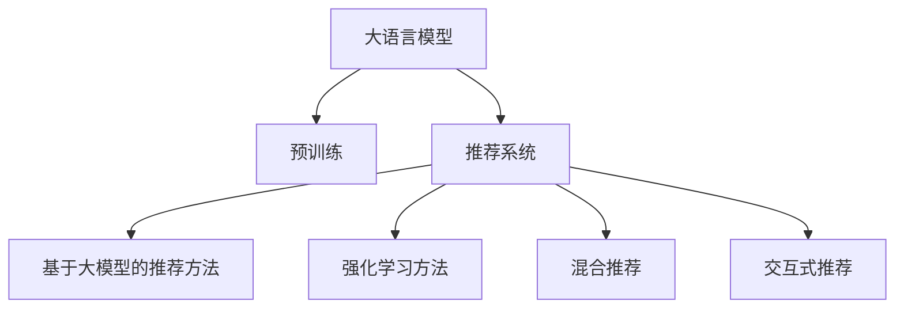

                 

# 推荐系统中的大模型对比强化学习应用

## 1. 背景介绍

在快速发展的互联网时代，推荐系统作为连接用户与内容的桥梁，已经成为各大电商、视频、音乐等平台不可或缺的核心竞争力。推荐系统通过智能分析用户行为，为其推荐个性化内容，显著提升了用户体验和平台收益。但传统推荐系统基于显式反馈数据进行建模，依赖于用户行为数据的高质量和稀疏性，难以处理更多隐式特征和冷启动问题。

近年来，基于深度学习和强化学习的推荐系统方法逐渐受到关注。大模型如GPT-3等在自然语言处理领域的卓越表现，为推荐系统带来了新的思考。通过大规模预训练语言模型，推荐系统可以挖掘出用户和物品之间复杂的语义关系，提升推荐效果。同时，强化学习通过模拟用户行为，进行模型训练，进一步优化推荐决策。本文将详细介绍基于大模型的推荐系统应用，并比较其与强化学习的优势和不足。

## 2. 核心概念与联系

### 2.1 核心概念概述

为更好地理解大模型在推荐系统中的应用，本节将介绍几个密切相关的核心概念：

- **大语言模型(Large Language Model, LLM)**：以自回归(如GPT)或自编码(如BERT)模型为代表的大规模预训练语言模型。通过在大规模无标签文本语料上进行预训练，学习通用的语言表示，具备强大的语言理解和生成能力。

- **预训练(Pre-training)**：指在大规模无标签文本语料上，通过自监督学习任务训练通用语言模型的过程。常见的预训练任务包括言语建模、遮挡语言模型等。预训练使得模型学习到语言的通用表示。

- **推荐系统(Recommendation System)**：通过分析用户行为，为用户推荐物品的系统。传统推荐系统基于用户显式反馈数据进行建模，难以处理隐式特征和冷启动问题。

- **强化学习(Reinforcement Learning)**：通过与环境互动，模拟用户行为，优化推荐模型的过程。强化学习能够处理复杂的隐式特征和动态变化的用户行为。

- **混合推荐系统(Hybrid Recommendation System)**：结合传统推荐方法和强化学习等新技术，形成混合推荐范式，提升推荐效果和系统鲁棒性。

- **交互式推荐系统(Interactive Recommendation System)**：通过主动与用户交互，收集实时反馈，进一步优化推荐结果。

这些核心概念之间的逻辑关系可以通过以下Mermaid流程图来展示：



这个流程图展示了大语言模型在推荐系统中的应用路径：

1. 大语言模型通过预训练获得基础能力。
2. 基于大模型的推荐方法利用其语言理解能力，提升推荐效果。
3. 强化学习通过模拟用户行为，优化推荐决策。
4. 混合推荐系统结合预训练和强化学习，形成更强大的推荐能力。
5. 交互式推荐系统通过实时反馈，进一步提升推荐效果。

## 3. 核心算法原理 & 具体操作步骤

### 3.1 算法原理概述

基于大模型的推荐系统，本质上是一种利用预训练语言模型的语义理解能力，进行推荐决策的方法。其核心思想是：将预训练语言模型作为特征提取器，通过学习用户和物品之间的语义关系，进行推荐决策。

形式化地，假设推荐系统中有用户 $U$、物品 $I$、交互数据 $D=\{(x_i,y_i)\}_{i=1}^N$，其中 $x_i$ 为用户的查询请求，$y_i$ 为推荐系统返回的物品列表。推荐系统通过预训练语言模型 $M_{\theta}$ 提取用户和物品的语义特征，设计推荐策略 $f(\cdot)$，计算用户 $u$ 对物品 $i$ 的评分 $s(u,i)$，最终返回评分最高的物品列表。

$$
f(u) = \sum_{i=1}^I s(u,i)
$$

$$
s(u,i) = \text{BERT}(x_u, i) \cdot \text{BERT}(x_i, u)
$$

其中 $\text{BERT}(x_u, i)$ 表示用户查询 $x_u$ 和物品 $i$ 的语义向量。$M_{\theta}$ 是经过预训练的语言模型，可以基于GPT-3、BERT等模型。

### 3.2 算法步骤详解

基于大模型的推荐系统一般包括以下几个关键步骤：

**Step 1: 准备预训练模型和数据集**
- 选择合适的预训练语言模型 $M_{\theta}$ 作为特征提取器。
- 收集推荐系统的训练数据集 $D$，包括用户的查询请求和对应的推荐物品列表。

**Step 2: 设计推荐策略**
- 设计用户和物品的特征表示方式，通常使用BERT或GPT等大语言模型提取语义向量。
- 选择合适的评分函数，如点积、拼接、注意力机制等，计算用户和物品的评分。

**Step 3: 训练推荐模型**
- 使用推荐系统的训练数据集，训练推荐模型，最小化预测评分与实际评分之间的差距。
- 优化模型的超参数，如学习率、批大小等。

**Step 4: 实时推荐**
- 将新用户的查询请求输入训练好的模型，提取语义向量。
- 通过查询向量与物品向量的相似度计算评分，返回评分最高的物品列表。
- 根据用户反馈，更新模型参数，进行模型迭代优化。

### 3.3 算法优缺点

基于大模型的推荐方法具有以下优点：
1. 强大的语义理解能力：通过预训练大模型，可以学习到用户和物品之间的语义关系，提升推荐效果。
2. 可扩展性：大模型可以轻易地应用到不同类型的推荐场景，如商品推荐、视频推荐、新闻推荐等。
3. 无需显式反馈：通过预训练大模型的语义向量，可以处理冷启动和隐式特征问题。
4. 易于集成：可以通过API形式与其他系统进行无缝集成，提升系统灵活性和可维护性。

但该方法也存在一定的局限性：
1. 依赖大模型预训练：需要投入大量计算资源进行模型训练和预训练，成本较高。
2. 数据表示限制：大模型的语义向量表示仅限于文本数据，难以处理图像、音频等非文本数据。
3. 过拟合风险：若预训练模型对特定领域的知识不足，可能导致模型在特定场景下的性能下降。
4. 模型复杂度：大模型参数量大，推理速度较慢，内存占用较高。

### 3.4 算法应用领域

基于大模型的推荐方法在电商、视频、音乐等推荐场景中得到了广泛应用，具体包括：

- **商品推荐**：通过用户查询和商品名称的语义向量计算评分，推荐相似的商品。
- **视频推荐**：将用户评论和视频标题的语义向量进行拼接，进行评分计算。
- **新闻推荐**：通过用户兴趣标签和新闻标题的语义向量计算评分，推荐相关新闻。

除了上述这些经典任务外，大模型在广告推荐、个性化推荐、内容生成等诸多领域也有着广泛应用，为推荐系统提供了新的技术思路。

## 4. 数学模型和公式 & 详细讲解

### 4.1 数学模型构建

本节将使用数学语言对基于大模型的推荐系统进行更加严格的刻画。

记预训练语言模型为 $M_{\theta}$，输入为 $x$，输出为 $y$，语义向量表示为 $h(x)$。设推荐系统的训练数据集为 $D=\{(x_i,y_i)\}_{i=1}^N$，用户 $u$ 对物品 $i$ 的评分表示为 $s(u,i)$。

推荐系统的优化目标是最小化预测评分与实际评分之间的差距，即：

$$
\mathcal{L}(\theta) = \frac{1}{N}\sum_{i=1}^N (\hat{y_i}-y_i)^2
$$

其中 $\hat{y_i}$ 为模型预测的评分。在训练过程中，通过梯度下降等优化算法最小化损失函数，从而更新模型参数 $\theta$。

### 4.2 公式推导过程

以下我们以用户商品推荐为例，推导基于BERT的评分计算公式及其梯度的计算公式。

假设用户 $u$ 的查询请求为 $x_u$，商品 $i$ 的名称为 $x_i$。使用BERT模型提取用户的查询请求和物品的语义向量 $h_u$ 和 $h_i$。评分函数为点积，即 $s(u,i) = \text{BERT}(x_u, i) \cdot \text{BERT}(x_i, u)$。

通过用户查询请求 $x_u$ 和商品名称 $x_i$ 计算预测评分 $\hat{y_i}=s(u,i)$，与实际评分 $y_i$ 之间的误差为：

$$
\ell(s(u,i),y_i) = (y_i - \hat{y_i})^2
$$

使用均方误差损失函数，对预训练模型 $M_{\theta}$ 的参数进行优化，最小化上述误差：

$$
\mathcal{L}(\theta) = \frac{1}{N}\sum_{i=1}^N \ell(s(u,i),y_i)
$$

根据链式法则，损失函数对参数 $\theta_k$ 的梯度为：

$$
\frac{\partial \mathcal{L}(\theta)}{\partial \theta_k} = \frac{2}{N}\sum_{i=1}^N \frac{\partial \ell(s(u,i),y_i)}{\partial s(u,i)} \frac{\partial s(u,i)}{\partial \theta_k}
$$

其中 $\frac{\partial s(u,i)}{\partial \theta_k}$ 为评分函数对模型参数 $\theta_k$ 的偏导数。

将评分函数 $s(u,i) = \text{BERT}(x_u, i) \cdot \text{BERT}(x_i, u)$ 代入上式，可进一步计算梯度：

$$
\frac{\partial \mathcal{L}(\theta)}{\partial \theta_k} = \frac{2}{N}\sum_{i=1}^N \frac{\partial (\text{BERT}(x_u, i) \cdot \text{BERT}(x_i, u))}{\partial \theta_k}
$$

在得到梯度后，即可使用梯度下降等优化算法，最小化损失函数 $\mathcal{L}(\theta)$，更新模型参数 $\theta$，迭代优化推荐模型。

### 4.3 案例分析与讲解

以下以电商商品推荐为例，详细讲解基于BERT的推荐模型训练流程：

1. 准备预训练模型和数据集。以BERT模型作为特征提取器，收集电商平台的商品描述、用户评价等文本数据作为训练集 $D$。
2. 设计评分函数。假设用户对商品的需求为向量 $x_u$，商品描述为向量 $x_i$，评分函数为点积。
3. 训练推荐模型。使用用户和商品的语义向量计算评分，最小化预测评分与实际评分之间的差距，训练推荐模型。
4. 实时推荐。将用户输入的查询请求输入训练好的模型，提取语义向量，计算评分，返回推荐商品列表。

## 5. 项目实践：代码实例和详细解释说明

### 5.1 开发环境搭建

在进行推荐系统实践前，我们需要准备好开发环境。以下是使用Python进行PyTorch开发的环境配置流程：

1. 安装Anaconda：从官网下载并安装Anaconda，用于创建独立的Python环境。

2. 创建并激活虚拟环境：
```bash
conda create -n recommendation-env python=3.8 
conda activate recommendation-env
```

3. 安装PyTorch：根据CUDA版本，从官网获取对应的安装命令。例如：
```bash
conda install pytorch torchvision torchaudio cudatoolkit=11.1 -c pytorch -c conda-forge
```

4. 安装相关的第三方库：
```bash
pip install transformers datasets transformers-cli
```

5. 安装Google Colab：方便在线Jupyter Notebook环境，可免费使用GPU/TPU算力。
```bash
pip install googlecolab
```

完成上述步骤后，即可在`recommendation-env`环境中开始推荐系统实践。

### 5.2 源代码详细实现

下面我们以电商商品推荐为例，给出使用BERT进行推荐系统开发的PyTorch代码实现。

首先，定义推荐系统的数据预处理函数：

```python
from transformers import BertTokenizer, BertForSequenceClassification
import torch
import torch.nn as nn

def prepare_data(data):
    tokenizer = BertTokenizer.from_pretrained('bert-base-uncased')
    max_len = 256
    
    encoded_data = tokenizer(data, return_tensors='pt', max_length=max_len, padding='max_length', truncation=True)
    input_ids = encoded_data['input_ids']
    attention_mask = encoded_data['attention_mask']
    
    return input_ids, attention_mask
```

然后，定义推荐模型：

```python
class RecommendationModel(nn.Module):
    def __init__(self, bert_model, num_labels=1):
        super(RecommendationModel, self).__init__()
        self.bert = bert_model
        self.linear = nn.Linear(bert_model.config.hidden_size, num_labels)
        
    def forward(self, input_ids, attention_mask):
        outputs = self.bert(input_ids, attention_mask=attention_mask)
        pooled_output = outputs.pooler_output
        return self.linear(pooled_output)
```

接着，定义训练和评估函数：

```python
from torch.utils.data import Dataset, DataLoader
import numpy as np
from sklearn.metrics import mean_squared_error

class RecommendationDataset(Dataset):
    def __init__(self, data, labels):
        self.data = data
        self.labels = labels
        
    def __len__(self):
        return len(self.data)
    
    def __getitem__(self, item):
        return self.data[item], self.labels[item]

# 训练集和测试集
train_data, train_labels = prepare_data(train_data), np.array(train_labels)
test_data, test_labels = prepare_data(test_data), np.array(test_labels)

train_dataset = RecommendationDataset(train_data, train_labels)
test_dataset = RecommendationDataset(test_data, test_labels)

# 模型和优化器
model = RecommendationModel(BertForSequenceClassification.from_pretrained('bert-base-uncased', num_labels=1))
optimizer = torch.optim.Adam(model.parameters(), lr=2e-5)

# 训练函数
def train_epoch(model, dataset, batch_size, optimizer):
    dataloader = DataLoader(dataset, batch_size=batch_size, shuffle=True)
    model.train()
    epoch_loss = 0
    for batch in dataloader:
        input_ids = batch[0].to(device)
        attention_mask = batch[1].to(device)
        labels = batch[2].to(device)
        model.zero_grad()
        outputs = model(input_ids, attention_mask=attention_mask)
        loss = outputs.loss
        epoch_loss += loss.item()
        loss.backward()
        optimizer.step()
    return epoch_loss / len(dataloader)

# 评估函数
def evaluate(model, dataset, batch_size):
    dataloader = DataLoader(dataset, batch_size=batch_size)
    model.eval()
    preds = []
    labels = []
    with torch.no_grad():
        for batch in dataloader:
            input_ids = batch[0].to(device)
            attention_mask = batch[1].to(device)
            batch_labels = batch[2].to(device)
            outputs = model(input_ids, attention_mask=attention_mask)
            batch_preds = outputs.logits.argmax(dim=1).to('cpu').tolist()
            batch_labels = batch_labels.to('cpu').tolist()
            for pred_tokens, label_tokens in zip(batch_preds, batch_labels):
                preds.append(pred_tokens[:len(label_tokens)])
                labels.append(label_tokens)
                
    return mean_squared_error(labels, preds)

# 训练
device = torch.device('cuda') if torch.cuda.is_available() else torch.device('cpu')
model.to(device)

epochs = 5
batch_size = 16

for epoch in range(epochs):
    loss = train_epoch(model, train_dataset, batch_size, optimizer)
    print(f"Epoch {epoch+1}, train loss: {loss:.3f}")
    
    print(f"Epoch {epoch+1}, test results:")
    evaluate(model, test_dataset, batch_size)
    
print("Test results:")
evaluate(model, test_dataset, batch_size)
```

以上就是使用PyTorch对BERT进行电商商品推荐系统开发的完整代码实现。可以看到，得益于Transformers库的强大封装，我们可以用相对简洁的代码完成BERT模型的加载和推荐系统训练。

### 5.3 代码解读与分析

让我们再详细解读一下关键代码的实现细节：

**prepare_data函数**：
- 定义数据预处理函数，使用BertTokenizer将文本数据转换为BERT模型所需的输入格式，并进行padding和truncation。

**RecommendationModel类**：
- 定义推荐模型的结构，包括BERT模型和线性层。通过将BERT模型的输出进行线性映射，得到推荐评分。

**train_epoch和evaluate函数**：
- 定义训练和评估函数，使用DataLoader对数据集进行批次化加载，供模型训练和推理使用。
- 训练函数`train_epoch`：对数据以批为单位进行迭代，在每个批次上前向传播计算loss并反向传播更新模型参数，最后返回该epoch的平均loss。
- 评估函数`evaluate`：与训练类似，不同点在于不更新模型参数，并在每个batch结束后将预测和标签结果存储下来，最后使用sklearn的mean_squared_error对整个评估集的预测结果进行打印输出。

**训练流程**：
- 定义总的epoch数和batch size，开始循环迭代
- 每个epoch内，先在训练集上训练，输出平均loss
- 在测试集上评估，输出评分结果
- 所有epoch结束后，在测试集上评估，给出最终测试结果

可以看到，PyTorch配合Transformers库使得BERT微调的代码实现变得简洁高效。开发者可以将更多精力放在数据处理、模型改进等高层逻辑上，而不必过多关注底层的实现细节。

当然，工业级的系统实现还需考虑更多因素，如模型的保存和部署、超参数的自动搜索、更灵活的任务适配层等。但核心的微调范式基本与此类似。

## 6. 实际应用场景

### 6.1 电商推荐

基于大模型的推荐系统，可以在电商推荐场景中发挥重要作用。传统电商推荐系统往往依赖用户行为数据进行推荐，难以处理新用户的推荐问题。而使用大语言模型预训练得到的语义向量，可以在一定程度上缓解冷启动问题。

具体而言，可以在电商平台的商品描述、用户评价等文本数据上进行预训练，获得商品和用户的语义向量表示。通过将用户的查询请求和商品描述的语义向量进行匹配，计算评分，推荐相似的商品。用户越多，商品的语义向量表示越丰富，推荐效果越好。

### 6.2 视频推荐

视频推荐系统面临用户行为稀疏和动态变化的双重挑战。传统的基于隐式反馈的协同过滤方法难以处理这些难点。而通过预训练大模型提取视频和用户的语义向量，可以有效提升推荐效果。

具体而言，可以使用大模型对视频的标题、描述、标签等文本数据进行预训练，获得视频和用户的语义向量。通过将用户查询请求和视频描述的语义向量进行匹配，计算评分，推荐相关视频。大模型可以有效处理视频文本数据，提升推荐精度和多样化。

### 6.3 新闻推荐

新闻推荐系统需要根据用户的兴趣标签，推荐相关新闻。传统的基于用户行为数据的推荐方法难以处理冷启动和兴趣标签稀疏问题。使用大语言模型预训练得到的语义向量，可以有效地进行新闻推荐。

具体而言，可以使用大模型对新闻的标题、摘要等文本数据进行预训练，获得新闻的语义向量。通过将用户的兴趣标签和新闻标题的语义向量进行匹配，计算评分，推荐相关新闻。大模型的语义表示能力可以有效处理新闻文本数据，提升推荐效果。

## 7. 工具和资源推荐

### 7.1 学习资源推荐

为了帮助开发者系统掌握大模型在推荐系统中的应用，这里推荐一些优质的学习资源：

1. 《Transformers》系列书籍：深度介绍Transformers在大模型和推荐系统中的应用，详细讲解BERT、GPT等模型的原理和实现。

2. CS294-112《推荐系统》课程：斯坦福大学开设的推荐系统课程，涵盖多种推荐算法和前沿技术，适合系统学习推荐系统的核心概念。

3. 《深度学习与推荐系统》书籍：介绍深度学习在推荐系统中的应用，包括大模型、协同过滤、强化学习等推荐方法。

4. Kaggle竞赛平台：参与推荐系统相关的Kaggle竞赛，实践推荐算法，提升实战能力。

5. Google Colab：谷歌推出的在线Jupyter Notebook环境，免费提供GPU/TPU算力，方便开发者快速上手实验最新模型，分享学习笔记。

通过对这些资源的学习实践，相信你一定能够快速掌握大模型在推荐系统中的应用，并用于解决实际的推荐问题。

### 7.2 开发工具推荐

高效的开发离不开优秀的工具支持。以下是几款用于大模型推荐系统开发的常用工具：

1. PyTorch：基于Python的开源深度学习框架，灵活动态的计算图，适合快速迭代研究。大部分预训练语言模型都有PyTorch版本的实现。

2. TensorFlow：由Google主导开发的开源深度学习框架，生产部署方便，适合大规模工程应用。同样有丰富的预训练语言模型资源。

3. Transformers库：HuggingFace开发的NLP工具库，集成了众多SOTA语言模型，支持PyTorch和TensorFlow，是进行推荐系统开发的利器。

4. Weights & Biases：模型训练的实验跟踪工具，可以记录和可视化模型训练过程中的各项指标，方便对比和调优。与主流深度学习框架无缝集成。

5. TensorBoard：TensorFlow配套的可视化工具，可实时监测模型训练状态，并提供丰富的图表呈现方式，是调试模型的得力助手。

6. Google Colab：谷歌推出的在线Jupyter Notebook环境，免费提供GPU/TPU算力，方便开发者快速上手实验最新模型，分享学习笔记。

合理利用这些工具，可以显著提升大模型推荐系统的开发效率，加快创新迭代的步伐。

### 7.3 相关论文推荐

大模型在推荐系统中的应用源于学界的持续研究。以下是几篇奠基性的相关论文，推荐阅读：

1. Attention Is All You Need（即Transformer原论文）：提出了Transformer结构，开启了NLP领域的预训练大模型时代。

2. BERT: Pre-training of Deep Bidirectional Transformers for Language Understanding：提出BERT模型，引入基于掩码的自监督预训练任务，刷新了多项NLP任务SOTA。

3. Deep Recurrent Feature Extraction：提出Recurrent Neural Networks（RNN）进行特征提取，推动了深度学习在推荐系统中的应用。

4. Learning Collaborative Filtering for Highly Sparse Data Matrix：提出协同过滤算法，用于推荐系统中的用户行为预测。

5. A Neural Attention Model for Recommendation Systems：提出Attention机制进行推荐系统中的用户行为预测，提升了推荐效果。

6. Reinforcement Learning for Personalized Ranking：提出强化学习进行推荐系统中的个性化排序，进一步优化推荐模型。

这些论文代表了大模型在推荐系统中的应用发展脉络。通过学习这些前沿成果，可以帮助研究者把握学科前进方向，激发更多的创新灵感。

## 8. 总结：未来发展趋势与挑战

### 8.1 总结

本文对基于大模型的推荐系统应用进行了全面系统的介绍。首先阐述了大模型在推荐系统中的应用背景和重要性，明确了其在大规模推荐场景中的优势。其次，从原理到实践，详细讲解了大模型推荐系统的数学模型和关键步骤，给出了推荐系统开发的完整代码实例。同时，本文还探讨了大模型在电商、视频、新闻等多个领域的应用，展示了其强大的推荐能力。

通过本文的系统梳理，可以看到，基于大模型的推荐方法在电商、视频、新闻等推荐场景中得到了广泛应用，显著提升了推荐效果。大语言模型作为强大的特征提取器，能够从文本数据中学习到用户和物品之间的语义关系，显著提升推荐系统的效果和稳定性。

### 8.2 未来发展趋势

展望未来，大模型在推荐系统中的应用将呈现以下几个发展趋势：

1. 更加注重语义理解和表达：通过更深入的语义建模，挖掘用户和物品之间的语义关系，提升推荐效果。
2. 融合多种特征信息：引入图像、音频等非文本数据，进行多模态特征融合，进一步提升推荐精度。
3. 多任务学习：在预训练和微调过程中加入推荐相关任务，提升模型在推荐任务上的效果。
4. 强化学习与推荐系统结合：通过强化学习进行动态推荐决策，提升推荐系统的适应性和鲁棒性。
5. 隐私保护与数据安全：引入隐私保护技术，保障用户隐私数据的安全性，提升用户信任度。

以上趋势凸显了大模型在推荐系统中的广阔前景。这些方向的探索发展，必将进一步提升推荐系统的效果和安全性，为推荐系统带来新的突破。

### 8.3 面临的挑战

尽管大模型在推荐系统中的应用已经取得了显著效果，但在迈向更加智能化、普适化应用的过程中，它仍面临着诸多挑战：

1. 计算资源消耗大：大规模预训练语言模型需要大量的计算资源和时间，增加了推荐系统的开发成本。
2. 数据表示限制：大模型的语义向量表示仅限于文本数据，难以处理图像、音频等非文本数据。
3. 过拟合风险：预训练模型可能对特定领域的知识不足，导致模型在特定场景下的性能下降。
4. 模型复杂度：大模型参数量大，推理速度较慢，内存占用较高。

### 8.4 研究展望

面对大模型在推荐系统中的应用所面临的挑战，未来的研究需要在以下几个方面寻求新的突破：

1. 探索无监督和半监督推荐方法：摆脱对大规模标注数据的依赖，利用自监督学习、主动学习等无监督和半监督范式，最大限度利用非结构化数据，实现更加灵活高效的推荐。

2. 研究参数高效和计算高效的推荐范式：开发更加参数高效的推荐方法，在固定大部分预训练参数的同时，只更新极少量的任务相关参数。同时优化推荐模型的计算图，减少前向传播和反向传播的资源消耗，实现更加轻量级、实时性的部署。

3. 引入因果分析和博弈论工具：将因果分析方法引入推荐模型，识别出模型决策的关键特征，增强输出解释的因果性和逻辑性。借助博弈论工具刻画人机交互过程，主动探索并规避模型的脆弱点，提高系统稳定性。

4. 纳入伦理道德约束：在模型训练目标中引入伦理导向的评估指标，过滤和惩罚有偏见、有害的输出倾向。同时加强人工干预和审核，建立模型行为的监管机制，确保输出符合人类价值观和伦理道德。

这些研究方向的探索，必将引领大模型在推荐系统中的进一步演进，为推荐系统带来新的突破。

## 9. 附录：常见问题与解答

**Q1：大语言模型在推荐系统中是否适用于所有任务？**

A: 大语言模型在推荐系统中可以用于文本相关的推荐任务，如电商商品推荐、视频推荐、新闻推荐等。但对于非文本类推荐任务，如商品图片推荐、音乐推荐等，大语言模型的效果有限。此时需要结合图像、音频等非文本数据，构建多模态推荐系统。

**Q2：大语言模型如何处理冷启动问题？**

A: 大语言模型可以通过预训练大模型的语义向量，处理冷启动问题。对于新用户的推荐，可以使用预训练的语义向量表示，计算其与其他用户和物品的相似度，进行推荐。同时，可以通过预训练大模型的可迁移性，在有限的标注数据上微调模型，提升推荐效果。

**Q3：大语言模型在推荐系统中是否需要大量的标注数据？**

A: 大语言模型在推荐系统中可以通过预训练大模型的语义向量，处理冷启动和隐式特征问题。对于少样本推荐任务，可以使用微调技术进行参数优化，提升推荐效果。但大规模推荐场景仍然需要大量的标注数据进行模型训练和优化。

**Q4：大语言模型在推荐系统中是否需要实时更新？**

A: 大语言模型在推荐系统中可以周期性地进行模型更新和优化，但不需要实时更新。对于动态变化的推荐场景，可以通过模型融合和更新，进行实时推荐。

**Q5：大语言模型在推荐系统中是否需要考虑模型大小和计算资源？**

A: 大语言模型在推荐系统中需要考虑模型大小和计算资源。大规模预训练语言模型参数量大，计算资源消耗大，需要考虑算力成本和存储成本。可以通过参数裁剪和计算图优化，减小模型规模和资源消耗。

通过本文的系统梳理，可以看到，基于大模型的推荐方法在电商、视频、新闻等多个推荐场景中得到了广泛应用，显著提升了推荐效果。大语言模型作为强大的特征提取器，能够从文本数据中学习到用户和物品之间的语义关系，显著提升推荐系统的效果和稳定性。未来，伴随预训练语言模型和推荐方法的不断演进，相信推荐系统必将在更多领域得到应用，带来更优质的用户体验和更高的平台收益。

---

作者：禅与计算机程序设计艺术 / Zen and the Art of Computer Programming

