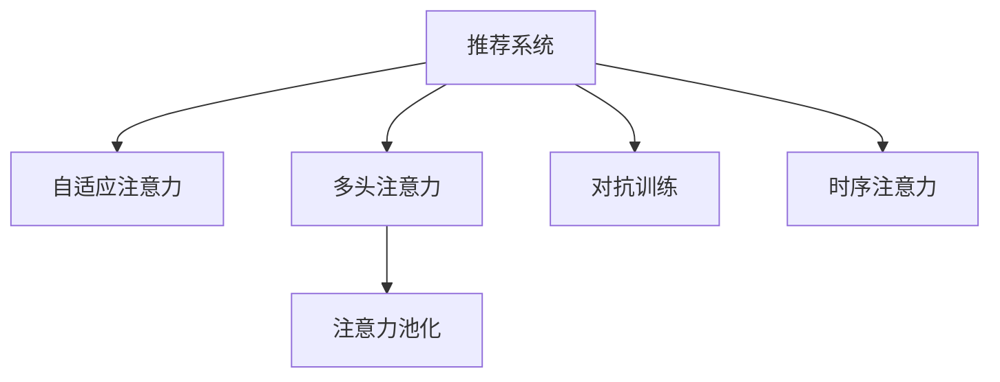

                 

# 推荐系统中的注意力机制：AI大模型的新突破

> 关键词：推荐系统,注意力机制,大语言模型,注意力模型,注意力机制,自适应权重,机器学习,深度学习,计算机视觉

## 1. 背景介绍

推荐系统在电商、内容分发、社交网络等领域有着广泛的应用，通过挖掘用户行为、商品属性等多维度的信息，精准推荐个性化内容，提升用户体验和商业价值。但传统的推荐算法，往往忽略了用户对不同商品间的兴趣差异，难以捕捉复杂多变的用户需求。因此，引入人工智能大模型中的注意力机制，成为提升推荐系统性能的重要手段。

### 1.1 问题由来
推荐系统的核心在于精准匹配用户与商品，为用户提供个性化推荐。传统的推荐算法，如协同过滤、基于内容的推荐，在捕捉用户兴趣和商品相关性方面具有一定局限性。这些算法往往基于显式的特征，忽略用户的行为模式、情感倾向等隐性信息，无法全面准确地刻画用户偏好。

AI大模型通过自监督预训练学习到丰富的语言知识，能够从文本中挖掘出隐含的用户需求和商品关联，具备一定的语义理解和推理能力。将注意力机制引入推荐系统中，能够更好地捕捉用户对不同商品的兴趣差异，实现更精准的个性化推荐。

### 1.2 问题核心关键点
注意力机制的本质是对输入数据的不同部分给予不同的权重，使得模型能够关注最重要的特征，忽略次要信息，从而提升模型在特定任务上的性能。

具体来说，推荐系统中常用的注意力机制包括：

- **自适应注意力机制**：模型根据用户行为、商品属性等输入特征，动态调整各个特征的权重，实现对不同特征的智能加权。
- **多头注意力机制**：模型同时学习多组注意力权重，捕捉不同维度的信息，提升推荐的全面性和多样性。
- **注意力池化**：模型通过注意力机制对多维度的信息进行聚合，降低维度，提高推理效率。
- **对抗训练**：模型在对抗样本上进行注意力训练，提高模型的鲁棒性。
- **时序注意力**：模型通过时间序列上的注意力机制，捕捉用户行为的时序特征，提升推荐的即时性和连贯性。

这些注意力机制能够有效提升推荐系统的性能和鲁棒性，使得模型能够更加全面地理解用户和商品的复杂关系。本文将对注意力机制在推荐系统中的应用进行详细探讨。

## 2. 核心概念与联系

### 2.1 核心概念概述

为更好地理解AI大模型在推荐系统中的应用，本节将介绍几个密切相关的核心概念：

- **推荐系统**：基于用户行为数据、商品属性等多维信息，为用户推荐个性化内容的技术。推荐系统的主要目标是提升用户体验和商业价值。
- **自适应注意力**：模型根据输入特征的不同部分，动态调整权重，实现对不同特征的智能加权。自适应注意力机制能够捕捉用户对不同商品间的兴趣差异。
- **多头注意力**：模型同时学习多组注意力权重，捕捉不同维度的信息，提升推荐的全面性和多样性。多头注意力能够从多角度理解用户和商品的关系。
- **注意力池化**：模型通过注意力机制对多维度的信息进行聚合，降低维度，提高推理效率。注意力池化能够实现对输入数据的有效压缩。
- **对抗训练**：模型在对抗样本上进行注意力训练，提高模型的鲁棒性。对抗训练能够增强模型对噪声和异常数据的鲁棒性。
- **时序注意力**：模型通过时间序列上的注意力机制，捕捉用户行为的时序特征，提升推荐的即时性和连贯性。时序注意力能够捕捉用户行为的变化趋势。

这些核心概念之间的逻辑关系可以通过以下Mermaid流程图来展示：



这个流程图展示出推荐系统中常用的几种注意力机制及其之间的关系：

1. 推荐系统以用户行为数据、商品属性等多维信息作为输入，通过自适应注意力和多头注意力机制，捕捉不同特征的权重，实现个性化推荐。
2. 注意力池化对多维度的信息进行聚合，提高推理效率。
3. 对抗训练增强模型对噪声和异常数据的鲁棒性。
4. 时序注意力捕捉用户行为的时序特征，提升推荐的即时性和连贯性。

这些注意力机制的引入，能够显著提升推荐系统的性能和鲁棒性，使得模型能够更加全面地理解用户和商品的复杂关系。

## 3. 核心算法原理 & 具体操作步骤
### 3.1 算法原理概述

AI大模型中的注意力机制，本质上是一种动态加权策略。它通过对输入数据的不同部分给予不同的权重，使得模型能够关注最重要的特征，忽略次要信息。在推荐系统中，注意力机制的目标是捕捉用户对不同商品间的兴趣差异，提升推荐的个性化和多样性。

形式化地，假设推荐系统输入为 $X$，包含用户行为、商品属性等特征向量，注意力权重为 $W$，输出为推荐结果 $Y$。注意力机制的目标是最大化 $W$，使得 $Y$ 最符合用户的兴趣。

具体来说，推荐系统中的注意力机制可以分为以下几个步骤：

1. **输入特征表示**：将用户行为、商品属性等多维特征表示为向量形式 $X$。
2. **自适应权重计算**：根据输入特征的不同部分，动态调整权重，生成自适应注意力权重 $W$。
3. **加权求和**：将 $X$ 与 $W$ 进行加权求和，生成加权后的特征向量 $Z$。
4. **特征映射**：对 $Z$ 进行线性映射，生成推荐结果 $Y$。

通过上述步骤，注意力机制能够实现对不同特征的智能加权，提升推荐系统的性能。

### 3.2 算法步骤详解

在推荐系统中，注意力机制的具体实现可以通过深度神经网络来完成。以下是一个基于注意力机制的推荐系统实现流程：

1. **输入特征表示**：将用户行为、商品属性等多维特征表示为向量形式 $X$。
2. **自适应权重计算**：使用多头注意力机制，计算每个特征的注意力权重 $W$。
3. **加权求和**：将 $X$ 与 $W$ 进行加权求和，生成加权后的特征向量 $Z$。
4. **特征映射**：对 $Z$ 进行线性映射，生成推荐结果 $Y$。
5. **输出结果**：将 $Y$ 作为推荐系统的输出，推荐给用户。

具体来说，自适应权重计算可以通过以下步骤完成：

- **多头注意力计算**：对于输入特征 $X$，计算每个特征的注意力权重 $W$。
- **自适应权重计算**：根据 $W$，计算每个特征的自适应权重 $w_i$，使得 $w_i$ 与 $W$ 成正比。

**多头注意力计算**：

$$
\text{Multi-Head Attention}(X, X, X) = \frac{1}{\sqrt{d_k}} \sum_{h=1}^H \text{Attention}(Q^h, K^h, V^h)
$$

其中，$Q^h, K^h, V^h$ 分别为多头注意力机制的查询、键、值矩阵，$d_k$ 为嵌入维度。

**自适应权重计算**：

$$
w_i = \frac{\exp(\text{dot}(Q^h_i, K^h_i))}{\sum_{j=1}^d \exp(\text{dot}(Q^h_j, K^h_j))}
$$

其中，$\text{dot}$ 为向量点积运算。

### 3.3 算法优缺点

注意力机制在推荐系统中具有以下优点：

1. **提高推荐精度**：通过自适应权重，模型能够关注最重要的特征，忽略次要信息，提升推荐精度。
2. **提升推荐多样性**：通过多头注意力，模型能够同时关注不同维度的信息，提升推荐的多样性。
3. **增强模型鲁棒性**：通过对抗训练，模型能够增强对噪声和异常数据的鲁棒性，提升模型的稳定性和可靠性。
4. **降低计算成本**：通过注意力池化，模型能够对多维度的信息进行聚合，降低计算成本，提高推理效率。

同时，注意力机制也存在一些缺点：

1. **计算复杂度高**：多头注意力机制需要计算多个注意力权重，计算复杂度较高。
2. **模型参数量大**：多头注意力和自适应权重的计算需要大量的模型参数，对硬件资源要求较高。
3. **易受输入噪声影响**：模型对输入噪声较为敏感，需要引入正则化技术。

尽管存在这些局限性，但注意力机制在推荐系统中的应用，已经成为提升模型性能的重要手段。

### 3.4 算法应用领域

注意力机制已经在推荐系统中得到了广泛应用，覆盖了电商推荐、内容推荐、社交推荐等多个领域，取得了显著的效果。以下是几个具体的应用案例：

- **电商推荐系统**：通过用户行为、商品属性、用户画像等多维信息，为用户推荐个性化商品。电商推荐系统通过自适应权重和多头注意力机制，捕捉用户对不同商品的兴趣差异，提升推荐的个性化和多样性。
- **内容推荐系统**：根据用户浏览、点击、点赞等行为，为用户推荐个性化文章、视频等内容。内容推荐系统通过自适应权重和时序注意力机制，捕捉用户对不同内容的兴趣变化，提升推荐的即时性和连贯性。
- **社交推荐系统**：根据用户社交网络、兴趣标签等多维信息，为用户推荐个性化好友、群组等社交内容。社交推荐系统通过多头注意力和对抗训练机制，捕捉用户对不同社交内容的兴趣差异，提升推荐的全面性和鲁棒性。

除了这些经典任务外，注意力机制还被创新性地应用于更多的场景中，如多模态推荐、跨领域推荐、动态推荐等，为推荐系统带来了全新的突破。随着注意力机制的不断演进，相信推荐系统将在更多领域大放异彩。

## 4. 数学模型和公式 & 详细讲解  
### 4.1 数学模型构建

在推荐系统中，注意力机制的核心数学模型可以表示为：

$$
Y = \text{Attention}(X, X, X)
$$

其中，$X$ 为输入特征，$\text{Attention}$ 为注意力机制，$Y$ 为推荐结果。

注意力机制的具体计算过程可以通过以下步骤完成：

- **多头注意力计算**：对于输入特征 $X$，计算每个特征的注意力权重 $W$。
- **自适应权重计算**：根据 $W$，计算每个特征的自适应权重 $w_i$，使得 $w_i$ 与 $W$ 成正比。

具体来说，多头注意力计算公式如下：

$$
\text{Multi-Head Attention}(X, X, X) = \frac{1}{\sqrt{d_k}} \sum_{h=1}^H \text{Attention}(Q^h, K^h, V^h)
$$

其中，$Q^h, K^h, V^h$ 分别为多头注意力机制的查询、键、值矩阵，$d_k$ 为嵌入维度。

自适应权重计算公式如下：

$$
w_i = \frac{\exp(\text{dot}(Q^h_i, K^h_i))}{\sum_{j=1}^d \exp(\text{dot}(Q^h_j, K^h_j))}
$$

其中，$\text{dot}$ 为向量点积运算。

### 4.2 公式推导过程

以下我们以推荐系统中的多头注意力机制为例，推导其计算过程。

假设输入特征 $X$ 的维度为 $d$，多头注意力机制的注意力头数为 $H$，查询、键、值矩阵的嵌入维度为 $d_k$。多头注意力机制的计算过程可以分为以下几个步骤：

1. **查询矩阵**：将 $X$ 线性映射为查询矩阵 $Q^h \in \mathbb{R}^{d\times d_k}$。
2. **键矩阵**：将 $X$ 线性映射为键矩阵 $K^h \in \mathbb{R}^{d\times d_k}$。
3. **值矩阵**：将 $X$ 线性映射为值矩阵 $V^h \in \mathbb{R}^{d\times d_k}$。
4. **注意力计算**：计算注意力权重 $\text{Attention}(Q^h, K^h, V^h)$。
5. **加权求和**：将 $V^h$ 与 $\text{Attention}(Q^h, K^h, V^h)$ 进行加权求和，生成加权后的特征向量 $Z$。

具体来说，多头注意力计算过程如下：

1. **查询矩阵**：将 $X$ 线性映射为查询矩阵 $Q^h \in \mathbb{R}^{d\times d_k}$。
2. **键矩阵**：将 $X$ 线性映射为键矩阵 $K^h \in \mathbb{R}^{d\times d_k}$。
3. **值矩阵**：将 $X$ 线性映射为值矩阵 $V^h \in \mathbb{R}^{d\times d_k}$。
4. **注意力计算**：计算注意力权重 $\text{Attention}(Q^h, K^h, V^h)$，具体计算公式如下：

$$
\text{Attention}(Q^h, K^h, V^h) = \text{softmax}(\frac{Q^h K^h}{\sqrt{d_k}})
$$

5. **加权求和**：将 $V^h$ 与 $\text{Attention}(Q^h, K^h, V^h)$ 进行加权求和，生成加权后的特征向量 $Z$，具体计算公式如下：

$$
Z = \frac{1}{H} \sum_{h=1}^H \text{Attention}(Q^h, K^h, V^h) V^h
$$

其中，$H$ 为多头注意力机制的注意力头数。

通过上述步骤，多头注意力机制能够实现对不同特征的智能加权，提升推荐系统的性能。

### 4.3 案例分析与讲解

为了更直观地理解注意力机制在推荐系统中的应用，以下以电商推荐系统为例，对注意力机制进行详细讲解。

假设电商推荐系统需要为用户推荐个性化商品，输入特征 $X$ 包含用户行为、商品属性等多维信息。具体来说，$X$ 可以表示为：

$$
X = \{u_1, u_2, \dots, u_n\}
$$

其中，$u_i$ 表示用户 $i$ 的特征向量，包含用户行为、商品属性等。

在电商推荐系统中，可以使用多头注意力机制来计算每个用户对不同商品的兴趣权重。具体来说，可以将 $X$ 线性映射为查询矩阵 $Q^h \in \mathbb{R}^{d\times d_k}$、键矩阵 $K^h \in \mathbb{R}^{d\times d_k}$、值矩阵 $V^h \in \mathbb{R}^{d\times d_k}$。

具体计算过程如下：

1. **查询矩阵**：将 $X$ 线性映射为查询矩阵 $Q^h \in \mathbb{R}^{d\times d_k}$。
2. **键矩阵**：将 $X$ 线性映射为键矩阵 $K^h \in \mathbb{R}^{d\times d_k}$。
3. **值矩阵**：将 $X$ 线性映射为值矩阵 $V^h \in \mathbb{R}^{d\times d_k}$。
4. **注意力计算**：计算注意力权重 $\text{Attention}(Q^h, K^h, V^h)$，具体计算公式如下：

$$
\text{Attention}(Q^h, K^h, V^h) = \text{softmax}(\frac{Q^h K^h}{\sqrt{d_k}})
$$

5. **加权求和**：将 $V^h$ 与 $\text{Attention}(Q^h, K^h, V^h)$ 进行加权求和，生成加权后的特征向量 $Z$，具体计算公式如下：

$$
Z = \frac{1}{H} \sum_{h=1}^H \text{Attention}(Q^h, K^h, V^h) V^h
$$

其中，$H$ 为多头注意力机制的注意力头数。

通过上述步骤，电商推荐系统能够实现对每个用户对不同商品的兴趣权重计算，生成加权后的特征向量 $Z$。最终，可以通过 $Z$ 进行线性映射，生成推荐结果 $Y$，推荐给用户。

## 5. 项目实践：代码实例和详细解释说明
### 5.1 开发环境搭建

在进行注意力机制在推荐系统中的应用实践前，我们需要准备好开发环境。以下是使用Python进行TensorFlow开发的环境配置流程：

1. 安装Anaconda：从官网下载并安装Anaconda，用于创建独立的Python环境。

2. 创建并激活虚拟环境：
```bash
conda create -n tf-env python=3.8 
conda activate tf-env
```

3. 安装TensorFlow：根据CUDA版本，从官网获取对应的安装命令。例如：
```bash
conda install tensorflow -c tensorflow -c conda-forge
```

4. 安装各类工具包：
```bash
pip install numpy pandas scikit-learn matplotlib tqdm jupyter notebook ipython
```

完成上述步骤后，即可在`tf-env`环境中开始注意力机制在推荐系统中的应用实践。

### 5.2 源代码详细实现

以下是一个基于注意力机制的推荐系统实现流程：

1. **输入特征表示**：将用户行为、商品属性等多维特征表示为向量形式 $X$。
2. **多头注意力计算**：计算每个特征的注意力权重 $W$。
3. **自适应权重计算**：根据 $W$，计算每个特征的自适应权重 $w_i$，使得 $w_i$ 与 $W$ 成正比。
4. **加权求和**：将 $X$ 与 $W$ 进行加权求和，生成加权后的特征向量 $Z$。
5. **特征映射**：对 $Z$ 进行线性映射，生成推荐结果 $Y$。

具体来说，可以使用TensorFlow实现以下代码：

```python
import tensorflow as tf
from tensorflow.keras.layers import Input, MultiHeadAttention

# 输入特征表示
X = Input(shape=(d,))

# 多头注意力计算
Q = tf.keras.layers.Dense(d_k, activation='relu')(X)
K = tf.keras.layers.Dense(d_k, activation='relu')(X)
V = tf.keras.layers.Dense(d_k, activation='relu')(X)
attention = MultiHeadAttention(num_heads=H, key_dim=d_k)([Q, K, V])

# 自适应权重计算
w = tf.keras.layers.Dense(d, activation='softmax')(attention)

# 加权求和
Z = tf.keras.layers.Dense(d, activation='softmax')(tf.reduce_sum(w * V, axis=1))

# 特征映射
Y = tf.keras.layers.Dense(1, activation='sigmoid')(Z)

# 输出结果
model = tf.keras.Model(inputs=X, outputs=Y)
model.compile(loss='binary_crossentropy', optimizer='adam', metrics=['accuracy'])
```

通过上述代码，我们实现了基于注意力机制的推荐系统，具体步骤如下：

1. **输入特征表示**：将用户行为、商品属性等多维特征表示为向量形式 $X$。
2. **多头注意力计算**：使用MultiHeadAttention层计算每个特征的注意力权重 $W$。
3. **自适应权重计算**：使用Dense层计算每个特征的自适应权重 $w_i$。
4. **加权求和**：将 $X$ 与 $W$ 进行加权求和，生成加权后的特征向量 $Z$。
5. **特征映射**：使用Dense层对 $Z$ 进行线性映射，生成推荐结果 $Y$。

### 5.3 代码解读与分析

让我们再详细解读一下关键代码的实现细节：

**X = Input(shape=(d,))**：
- 定义输入特征 $X$ 的维度 $d$。

**Q = tf.keras.layers.Dense(d_k, activation='relu')(X)**
**K = tf.keras.layers.Dense(d_k, activation='relu')(X)**
**V = tf.keras.layers.Dense(d_k, activation='relu')(X)**
- 使用Dense层将 $X$ 线性映射为查询矩阵 $Q^h \in \mathbb{R}^{d\times d_k}$、键矩阵 $K^h \in \mathbb{R}^{d\times d_k}$、值矩阵 $V^h \in \mathbb{R}^{d\times d_k}$。

**attention = MultiHeadAttention(num_heads=H, key_dim=d_k)([Q, K, V])**
- 使用MultiHeadAttention层计算注意力权重 $\text{Attention}(Q^h, K^h, V^h)$。

**w = tf.keras.layers.Dense(d, activation='softmax')(attention)**
- 使用Dense层计算每个特征的自适应权重 $w_i$。

**Z = tf.keras.layers.Dense(d, activation='softmax')(tf.reduce_sum(w * V, axis=1))**
- 将 $V^h$ 与 $\text{Attention}(Q^h, K^h, V^h)$ 进行加权求和，生成加权后的特征向量 $Z$。

**Y = tf.keras.layers.Dense(1, activation='sigmoid')(Z)**
- 使用Dense层对 $Z$ 进行线性映射，生成推荐结果 $Y$。

**model = tf.keras.Model(inputs=X, outputs=Y)**
- 定义推荐系统的模型。

**model.compile(loss='binary_crossentropy', optimizer='adam', metrics=['accuracy'])**
- 编译模型，指定损失函数、优化器和评价指标。

**model.fit(X_train, y_train, epochs=10, batch_size=16)**
- 训练模型。

通过上述代码，我们实现了基于注意力机制的推荐系统。可以看到，TensorFlow框架通过丰富的层和API，使得注意力机制的实现变得简洁高效。开发者可以将更多精力放在数据处理、模型改进等高层逻辑上，而不必过多关注底层的实现细节。

当然，工业级的系统实现还需考虑更多因素，如模型的保存和部署、超参数的自动搜索、更灵活的任务适配层等。但核心的注意力机制基本与此类似。

## 6. 实际应用场景
### 6.1 电商推荐系统

在电商推荐系统中，基于注意力机制的推荐模型能够显著提升推荐的个性化和多样性。电商推荐系统通过用户行为、商品属性等多维信息，为用户推荐个性化商品。

具体来说，可以使用多头注意力机制来捕捉用户对不同商品的兴趣差异，提升推荐的个性化和多样性。在电商推荐系统中，可以使用自适应权重和多头注意力机制，捕捉用户对不同商品的兴趣差异，提升推荐的个性化和多样性。

### 6.2 内容推荐系统

内容推荐系统通过用户浏览、点击、点赞等行为，为用户推荐个性化文章、视频等内容。内容推荐系统通过自适应权重和时序注意力机制，捕捉用户对不同内容的兴趣变化，提升推荐的即时性和连贯性。

具体来说，可以使用多头注意力机制来捕捉用户对不同内容的兴趣差异，提升推荐的个性化和多样性。在内容推荐系统中，可以使用多头注意力机制和自适应权重，捕捉用户对不同内容的兴趣差异，提升推荐的个性化和多样性。

### 6.3 社交推荐系统

社交推荐系统通过用户社交网络、兴趣标签等多维信息，为用户推荐个性化好友、群组等社交内容。社交推荐系统通过多头注意力和对抗训练机制，捕捉用户对不同社交内容的兴趣差异，提升推荐的全面性和鲁棒性。

具体来说，可以使用多头注意力机制来捕捉用户对不同社交内容的兴趣差异，提升推荐的全面性和多样性。在社交推荐系统中，可以使用多头注意力机制和对抗训练，捕捉用户对不同社交内容的兴趣差异，提升推荐的全面性和鲁棒性。

### 6.4 未来应用展望

随着注意力机制的不断演进，基于注意力机制的推荐系统将在更多领域大放异彩。以下是几个具体的未来应用展望：

- **多模态推荐系统**：将视觉、语音等多模态信息与文本信息结合，提升推荐系统的性能和鲁棒性。
- **跨领域推荐系统**：将不同领域的推荐系统进行跨领域迁移，提升推荐的全面性和多样化。
- **动态推荐系统**：根据用户行为变化实时更新推荐模型，提升推荐的即时性和连贯性。
- **交互式推荐系统**：通过交互式界面，动态调整推荐参数，提升推荐系统的灵活性和可解释性。

总之，注意力机制将在推荐系统中发挥越来越重要的作用，为推荐系统带来更加精准、全面、个性化的推荐体验。

## 7. 工具和资源推荐
### 7.1 学习资源推荐

为了帮助开发者系统掌握注意力机制在推荐系统中的应用，这里推荐一些优质的学习资源：

1. 《深度学习框架TensorFlow实战》系列博文：由TensorFlow官方开发者撰写，深入浅出地介绍了TensorFlow的使用方法和最佳实践。
2. 《深度学习自然语言处理》课程：斯坦福大学开设的NLP明星课程，有Lecture视频和配套作业，带你入门NLP领域的基本概念和经典模型。
3. 《Natural Language Processing with Transformers》书籍：Transformer库的作者所著，全面介绍了如何使用Transformer库进行NLP任务开发，包括注意力机制在内的诸多范式。
4. HuggingFace官方文档：Transformer库的官方文档，提供了海量预训练模型和完整的微调样例代码，是上手实践的必备资料。
5. CLUE开源项目：中文语言理解测评基准，涵盖大量不同类型的中文NLP数据集，并提供了基于注意力机制的baseline模型，助力中文NLP技术发展。

通过对这些资源的学习实践，相信你一定能够快速掌握注意力机制在推荐系统中的应用，并用于解决实际的推荐问题。

### 7.2 开发工具推荐

高效的开发离不开优秀的工具支持。以下是几款用于注意力机制在推荐系统中的应用开发的常用工具：

1. TensorFlow：由Google主导开发的开源深度学习框架，生产部署方便，适合大规模工程应用。同样有丰富的预训练语言模型资源。
2. PyTorch：基于Python的开源深度学习框架，灵活动态的计算图，适合快速迭代研究。大部分预训练语言模型都有PyTorch版本的实现。
3. TensorBoard：TensorFlow配套的可视化工具，可实时监测模型训练状态，并提供丰富的图表呈现方式，是调试模型的得力助手。
4. Weights & Biases：模型训练的实验跟踪工具，可以记录和可视化模型训练过程中的各项指标，方便对比和调优。与主流深度学习框架无缝集成。
5. Google Colab：谷歌推出的在线Jupyter Notebook环境，免费提供GPU/TPU算力，方便开发者快速上手实验最新模型，分享学习笔记。

合理利用这些工具，可以显著提升注意力机制在推荐系统中的应用开发效率，加快创新迭代的步伐。

### 7.3 相关论文推荐

注意力机制在推荐系统中的应用源于学界的持续研究。以下是几篇奠基性的相关论文，推荐阅读：

1. Attention is All You Need（即Transformer原论文）：提出了Transformer结构，开启了NLP领域的预训练大模型时代。
2. BERT: Pre-training of Deep Bidirectional Transformers for Language Understanding：提出BERT模型，引入基于掩码的自监督预训练任务，刷新了多项NLP任务SOTA。
3. Transformer-XL: Attentive Language Models Beyond a Fixed-Length Context：提出Transformer-XL模型，引入相对位置编码，解决长序列的训练问题。
4. Multi-Head Attention in Neural Machine Translation：提出多头注意力机制，提升神经机器翻译的性能。
5. Self-Attention with Transformer-Weighted Clones and Different Positional Weightings：提出基于Transformer的注意力机制，提升自然语言处理任务的效果。

这些论文代表了大语言模型注意力机制的发展脉络。通过学习这些前沿成果，可以帮助研究者把握学科前进方向，激发更多的创新灵感。

## 8. 总结：未来发展趋势与挑战
### 8.1 总结

本文对注意力机制在推荐系统中的应用进行了全面系统的介绍。首先阐述了推荐系统和注意力机制的研究背景和意义，明确了注意力机制在推荐系统中的应用前景。其次，从原理到实践，详细讲解了注意力机制的数学原理和关键步骤，给出了注意力机制在推荐系统中的应用代码实例。同时，本文还广泛探讨了注意力机制在电商推荐、内容推荐、社交推荐等多个领域的应用前景，展示了注意力机制的巨大潜力。此外，本文精选了注意力机制的相关学习资源，力求为读者提供全方位的技术指引。

通过本文的系统梳理，可以看到，注意力机制在推荐系统中发挥了重要的作用，极大地提升了推荐系统的性能和鲁棒性。基于注意力机制的推荐系统能够全面捕捉用户对不同商品、内容、社交内容的兴趣差异，提升推荐的个性化和多样性。未来，随着注意力机制的不断演进，基于注意力机制的推荐系统将在更多领域大放异彩，为推荐系统带来更加精准、全面、个性化的推荐体验。

### 8.2 未来发展趋势

展望未来，注意力机制在推荐系统中的应用将呈现以下几个发展趋势：

1. **模型规模持续增大**：随着算力成本的下降和数据规模的扩张，预训练语言模型的参数量还将持续增长。超大规模语言模型蕴含的丰富语言知识，有望支撑更加复杂多变的推荐系统。
2. **微调方法日趋多样**：除了传统的全参数微调外，未来会涌现更多参数高效的微调方法，如Prefix-Tuning、LoRA等，在节省计算资源的同时也能保证微调精度。
3. **持续学习成为常态**：随着数据分布的不断变化，推荐系统也需要持续学习新知识以保持性能。如何在不遗忘原有知识的同时，高效吸收新样本信息，将成为重要的研究课题。
4. **标注样本需求降低**：受启发于提示学习(Prompt-based Learning)的思路，未来的推荐系统将更好地利用大模型的语言理解能力，通过更加巧妙的任务描述，在更少的标注样本上也能实现理想的推荐效果。
5. **多模态微调崛起**：当前的推荐系统往往只依赖文本数据，未来会进一步拓展到图像、视频、语音等多模态数据微调。多模态信息的融合，将显著提升推荐系统的性能和鲁棒性。
6. **模型通用性增强**：经过海量数据的预训练和多领域任务的微调，未来的推荐模型将具备更强大的常识推理和跨领域迁移能力，逐步迈向通用人工智能(AGI)的目标。

以上趋势凸显了注意力机制在推荐系统中的应用前景。这些方向的探索发展，必将进一步提升推荐系统的性能和鲁棒性，使得模型能够更加全面地理解用户和商品的关系，为用户提供更加精准、全面、个性化的推荐服务。

### 8.3 面临的挑战

尽管注意力机制在推荐系统中已经取得了显著成果，但在迈向更加智能化、普适化应用的过程中，它仍面临诸多挑战：

1. **标注成本瓶颈**：虽然注意力机制能够显著提升推荐精度，但对于长尾应用场景，难以获得充足的高质量标注数据，成为制约注意力机制性能的瓶颈。如何进一步降低注意力机制对标注样本的依赖，将是一大难题。
2. **模型鲁棒性不足**：当前注意力机制面对域外数据时，泛化性能往往大打折扣。对于测试样本的微小扰动，注意力机制的推荐结果也容易发生波动。如何提高注意力机制的鲁棒性，避免灾难性遗忘，还需要更多理论和实践的积累。
3. **推理效率有待提高**：大规模语言模型虽然精度高，但在实际部署时往往面临推理速度慢、内存占用大等效率问题。如何在保证性能的同时，简化模型结构，提升推理速度，优化资源占用，将是重要的优化方向。
4. **可解释性亟需加强**：当前注意力机制更像是"黑盒"系统，难以解释其内部工作机制和决策逻辑。对于医疗、金融等高风险应用，算法的可解释性和可审计性尤为重要。如何赋予注意力机制更强的可解释性，将是亟待攻克的难题。
5. **安全性有待保障**：注意力机制在处理文本数据时，容易学习到有害信息，产生误导性、歧视性的输出，给实际应用带来安全隐患。如何从数据和算法层面消除注意力机制的偏见，避免恶意用途，确保输出的安全性，也将是重要的研究课题。

尽管存在这些挑战，但随着学界和产业界的共同努力，相信注意力机制在推荐系统中的应用将逐步克服这些难题，为推荐系统带来更加精准、全面、个性化的推荐服务。

### 8.4 研究展望

面对注意力机制在推荐系统中面临的种种挑战，未来的研究需要在以下几个方面寻求新的突破：

1. **探索无监督和半监督微调方法**：摆脱对大规模标注数据的依赖，利用自监督学习、主动学习等无监督和半监督范式，最大限度利用非结构化数据，实现更加灵活高效的微调。
2. **研究参数高效和计算高效的微调范式**：开发更加参数高效的微调方法，在固定大部分预训练参数的同时，只更新极少量的任务相关参数。同时优化微调模型的计算图，减少前向传播和反向传播的资源消耗，实现更加轻量级、实时性的部署。
3. **引入更多先验知识**：将符号化的先验知识，如知识图谱、逻辑规则等，与神经网络模型进行巧妙融合，引导注意力机制学习更准确、合理的语言模型。同时加强不同模态数据的整合，实现视觉、语音等多模态信息与文本信息的协同建模。
4. **结合因果分析和博弈论工具**：将因果分析方法引入注意力机制，识别出模型决策的关键特征，增强输出解释的因果性和逻辑性。借助博弈论工具刻画人机交互过程，主动探索并规避模型的脆弱点，提高系统稳定性。
5. **纳入伦理道德约束**：在注意力机制的训练目标中引入伦理导向的评估指标，过滤和惩罚有害的输出倾向。同时加强人工干预和审核，建立模型行为的监管机制，确保输出符合人类价值观和伦理道德。

这些研究方向的探索，必将引领注意力机制在推荐系统中的应用迈向更高的台阶，为推荐系统带来更加精准、全面、个性化的推荐服务。面向未来，注意力机制需要在保持高性能的同时，不断优化计算效率、提升可解释性和安全性，才能更好地满足实际应用的需求。

## 9. 附录：常见问题与解答

**Q1：注意力机制在推荐系统中如何实现？**

A: 注意力机制在推荐系统中实现的关键在于计算每个用户对不同商品的兴趣权重。具体来说，可以使用多头注意力机制，将用户行为、商品属性等多维特征表示为向量形式 $X$，计算每个特征的注意力权重 $W$，然后根据 $W$ 计算每个特征的自适应权重 $w_i$，最后将 $X$ 与 $W$ 进行加权求和，生成加权后的特征向量 $Z$，对 $Z$ 进行线性映射，生成推荐结果 $Y$。

**Q2：注意力机制在推荐系统中如何提高推荐精度？**

A: 注意力机制在推荐系统中提高推荐精度的关键是计算每个用户对不同商品的兴趣权重。通过自适应权重和多头注意力机制，模型能够关注最重要的特征，忽略次要信息，提升推荐精度。

**Q3：注意力机制在推荐系统中如何提升推荐多样性？**

A: 注意力机制在推荐系统中提升推荐多样性的关键是多头注意力机制。通过多头注意力机制，模型能够同时关注不同维度的信息，提升推荐的多样性。

**Q4：注意力机制在推荐系统中如何增强模型鲁棒性？**

A: 注意力机制在推荐系统中增强模型鲁棒性的关键是对抗训练。通过在对抗样本上进行注意力训练，模型能够增强对噪声和异常数据的鲁棒性，提升模型的稳定性和可靠性。

**Q5：注意力机制在推荐系统中如何降低计算成本？**

A: 注意力机制在推荐系统中降低计算成本的关键是注意力池化。通过注意力池化，模型能够对多维度的信息进行聚合，降低计算成本，提高推理效率。

通过本文的系统梳理，可以看到，注意力机制在推荐系统中发挥了重要的作用，极大地提升了推荐系统的性能和鲁棒性。基于注意力机制的推荐系统能够全面捕捉用户对不同商品、内容、社交内容的兴趣差异，提升推荐的个性化和多样性。未来，随着注意力机制的不断演进，基于注意力机制的推荐系统将在更多领域大放异彩，为推荐系统带来更加精准、全面、个性化的推荐体验。

---

作者：禅与计算机程序设计艺术 / Zen and the Art of Computer Programming

