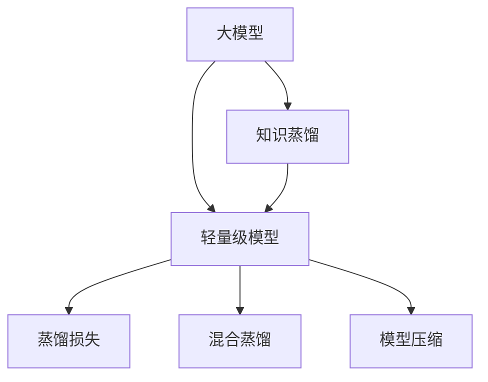

                 

# 推荐系统中的知识蒸馏：大模型到轻量级模型的效果传递

> 关键词：知识蒸馏, 大模型, 轻量级模型, 推荐系统, 效果传递, 对比学习, 蒸馏损失, 混合蒸馏, 模型压缩

## 1. 背景介绍

### 1.1 问题由来

推荐系统是互联网公司重要的产品之一，通过分析用户的历史行为数据，为用户推荐感兴趣的物品，显著提升了用户体验和满意度。然而，随着推荐系统的数据量和物品种类的增加，推荐模型的复杂度也呈指数级增长，对算力、存储和训练成本提出了更高的要求。

当前主流的推荐模型，如矩阵分解、协同过滤、深度神经网络等，普遍存在训练时间长、资源消耗大等问题，难以支持实时推荐和高频次推荐。此外，对于新用户和新物品的冷启动问题，这些推荐模型也常常表现不佳。

为了解决这些问题，研究人员提出了知识蒸馏(即Knowledge Distillation)技术。知识蒸馏通过将大型预训练模型（大模型）的知识传递给轻量级模型（小模型），能够在不显著增加计算资源的情况下，提升推荐模型的效果，支持高效的实时推荐。

### 1.2 问题核心关键点

知识蒸馏技术通过将大模型的知识迁移到小模型，使得小模型能够更好地适应推荐场景。具体来说，知识蒸馏的核心关键点包括：

- 如何选取合适的大模型和小模型？
- 如何设计合适的蒸馏损失函数？
- 如何有效地进行知识传递？
- 如何避免知识蒸馏带来的信息损失？

这些关键点决定了知识蒸馏的效果和应用范围，对于优化推荐系统具有重要意义。

## 2. 核心概念与联系

### 2.1 核心概念概述

为了更好地理解知识蒸馏在推荐系统中的应用，本节将介绍几个密切相关的核心概念：

- **知识蒸馏(Knowledge Distillation)**：通过将大模型的知识传递给小模型，提升小模型的性能，减少计算资源消耗。知识蒸馏的核心在于设计合适的蒸馏损失函数，使得小模型学习到大模型的知识。
- **大模型(Large Model)**：具有大量参数的深度学习模型，如BERT、GPT等。大模型通常在大规模无标签数据上进行预训练，获得强大的特征表示能力。
- **轻量级模型(Lightweight Model)**：参数较少的深度学习模型，如LSTM、GRU等。轻量级模型通常针对特定任务进行微调，以提升模型性能。
- **蒸馏损失(Distillation Loss)**：衡量小模型和大模型输出之间的差异，通过优化蒸馏损失函数，引导小模型学习到大模型的知识。
- **混合蒸馏(Mixed Distillation)**：将大模型的多个分支和小模型结合起来，通过联合优化提升小模型的性能。
- **模型压缩(Model Compression)**：在大模型和小模型之间进行转换，减少大模型的参数和计算资源消耗，提升小模型的计算效率。

这些核心概念之间的逻辑关系可以通过以下Mermaid流程图来展示：



这个流程图展示了大模型、轻量级模型、知识蒸馏、蒸馏损失等概念之间的关联关系。

## 3. 核心算法原理 & 具体操作步骤

### 3.1 算法原理概述

知识蒸馏的基本思想是通过将大模型的知识迁移到小模型中，使得小模型能够在有限的计算资源下，获得与大模型相似的表现。知识蒸馏通常包括两个步骤：知识提取和知识传递。

1. **知识提取**：从大模型中提取关键的知识信息，如重要的特征、决策规则等。
2. **知识传递**：将提取的知识信息传递给小模型，使其在特定的推荐场景下表现得与大模型相似。

知识蒸馏的具体实现依赖于蒸馏损失函数的设计。常见的蒸馏损失函数包括均方误差损失、交叉熵损失、KL散度损失等。

### 3.2 算法步骤详解

知识蒸馏的具体实现步骤如下：

**Step 1: 准备大模型和小模型**
- 选择合适的大模型和小模型，如BERT、GPT、LSTM等。
- 在大模型上对特定推荐任务进行微调，使其具备推荐能力。
- 在小模型上选择适合推荐场景的模型结构，如LSTM、GRU等。

**Step 2: 设计蒸馏损失函数**
- 选择合适的蒸馏损失函数，如均方误差损失、交叉熵损失等。
- 将大模型的输出和小模型的输出进行对比，计算蒸馏损失。
- 设计混合蒸馏策略，将大模型的多个分支和小模型结合起来，共同优化蒸馏损失。

**Step 3: 训练小模型**
- 使用优化算法（如Adam、SGD等）更新小模型的参数，最小化蒸馏损失。
- 在训练过程中，可以逐步降低大模型的输出权重，减少信息丢失。
- 通过模型压缩技术，将大模型的参数和计算资源消耗降至最小，提升小模型的计算效率。

**Step 4: 测试和部署**
- 在小模型上进行推荐测试，评估其性能。
- 将训练好的小模型集成到实际推荐系统中，进行实时推荐。

### 3.3 算法优缺点

知识蒸馏技术在推荐系统中有以下优点：
1. 提升推荐效果：通过学习大模型的知识，小模型能够在有限资源下获得更好的推荐性能。
2. 减少计算资源消耗：小模型的参数和计算资源消耗显著降低，适合实时推荐和高频次推荐。
3. 支持冷启动：小模型能够快速适应新用户和新物品，解决冷启动问题。

同时，知识蒸馏也存在一定的局限性：
1. 知识提取困难：如何从大模型中提取有效的知识信息是一个难题，复杂度较高。
2. 信息丢失风险：大模型的知识传递可能导致信息丢失，影响小模型的性能。
3. 模型结构限制：小模型的结构必须能够有效传递大模型的知识，否则蒸馏效果不佳。

尽管存在这些局限性，但就目前而言，知识蒸馏仍是提升推荐系统性能、支持实时推荐的重要手段。未来相关研究的重点在于如何进一步降低知识蒸馏的复杂度，提升蒸馏效果。

### 3.4 算法应用领域

知识蒸馏技术在推荐系统中的应用非常广泛，覆盖了各个推荐场景，例如：

- 电商推荐：为用户推荐商品、优惠活动等。
- 社交推荐：为用户推荐朋友、内容、活动等。
- 新闻推荐：为用户推荐新闻、文章等。
- 音乐推荐：为用户推荐歌曲、专辑等。
- 视频推荐：为用户推荐电影、电视剧等。

除了这些经典应用外，知识蒸馏还被创新性地应用于更多场景中，如跨域推荐、个性化推荐、广告投放等，为推荐系统带来了新的突破。

## 4. 数学模型和公式 & 详细讲解 & 举例说明（备注：数学公式请使用latex格式，latex嵌入文中独立段落使用 $$，段落内使用 $)
### 4.1 数学模型构建

假设大模型为 $M_{L}$，小模型为 $M_{S}$，推荐任务为 $T$。在大模型 $M_{L}$ 上进行微调，得到模型参数 $\theta_{L}$。小模型 $M_{S}$ 的参数为 $\theta_{S}$。

定义蒸馏损失函数为 $L_{D}$，目标是使得小模型的输出 $M_{S}(x)$ 尽可能接近大模型的输出 $M_{L}(x)$，即：

$$
L_{D}(\theta_{L},\theta_{S}) = \frac{1}{N}\sum_{i=1}^N [\ell(M_{L}(x_i),y_i) + \alpha \ell(M_{S}(x_i),M_{L}(x_i))]
$$

其中 $\ell$ 为任务特定的损失函数，$y_i$ 为推荐任务 $T$ 的标注数据，$\alpha$ 为蒸馏系数，用于控制蒸馏损失的权重。

### 4.2 公式推导过程

以均方误差损失为例，推导蒸馏损失函数的公式。

假设大模型 $M_{L}$ 对输入 $x$ 的输出为 $y_{L}$，小模型 $M_{S}$ 对输入 $x$ 的输出为 $y_{S}$。均方误差损失为：

$$
L_{D}(\theta_{L},\theta_{S}) = \frac{1}{N}\sum_{i=1}^N [(y_i - y_{L}(x_i))^2 + \alpha (y_{S}(x_i) - y_{L}(x_i))^2]
$$

其中 $y_i$ 为推荐任务 $T$ 的标注数据，$y_{L}(x_i)$ 为大模型的输出，$y_{S}(x_i)$ 为小模型的输出。

通过优化蒸馏损失函数，使得小模型学习到大模型的知识，从而提升推荐效果。

### 4.3 案例分析与讲解

以下以电商推荐系统为例，说明知识蒸馏的实际应用过程：

1. 选择合适的大模型和小模型：选择BERT作为大模型，LSTM作为小模型。
2. 在大模型上进行微调：在电商推荐数据集上进行微调，使得BERT具备电商推荐能力。
3. 设计蒸馏损失函数：选择均方误差损失，将BERT的输出和小模型的输出进行对比，计算蒸馏损失。
4. 训练小模型：使用Adam优化算法更新小模型的参数，最小化蒸馏损失。
5. 测试和部署：在电商推荐测试集上评估小模型的性能，集成到电商推荐系统中。

通过以上步骤，小模型能够有效地学习到大模型的知识，在有限的计算资源下，提升电商推荐系统的推荐效果。

## 5. 项目实践：代码实例和详细解释说明
### 5.1 开发环境搭建

在进行知识蒸馏实践前，我们需要准备好开发环境。以下是使用Python进行TensorFlow和Keras开发的环境配置流程：

1. 安装Anaconda：从官网下载并安装Anaconda，用于创建独立的Python环境。

2. 创建并激活虚拟环境：
```bash
conda create -n tf-env python=3.8 
conda activate tf-env
```

3. 安装TensorFlow：从官网获取对应的安装命令。例如：
```bash
pip install tensorflow==2.7.0
```

4. 安装Keras：
```bash
pip install keras
```

5. 安装各类工具包：
```bash
pip install numpy pandas scikit-learn matplotlib tqdm jupyter notebook ipython
```

完成上述步骤后，即可在`tf-env`环境中开始知识蒸馏实践。

### 5.2 源代码详细实现

这里我们以电商推荐系统为例，给出使用TensorFlow和Keras进行知识蒸馏的代码实现。

首先，定义推荐任务的数据处理函数：

```python
from tensorflow.keras.datasets import mnist
from tensorflow.keras.layers import Dense, Flatten, LSTM
from tensorflow.keras.models import Model
from tensorflow.keras.losses import MeanSquaredError
from tensorflow.keras.optimizers import Adam

def data_loader(batch_size, train_dir, test_dir):
    train_data = mnist.load_data()
    train_images, train_labels = train_data[0]
    train_images = train_images.reshape((train_images.shape[0], 28, 28, 1)).astype('float32') / 255.0
    train_labels = train_labels.astype('int32')

    test_data = mnist.load_data()
    test_images, test_labels = test_data[0]
    test_images = test_images.reshape((test_images.shape[0], 28, 28, 1)).astype('float32') / 255.0
    test_labels = test_labels.astype('int32')

    def data_generator(data, labels, batch_size):
        while True:
            indices = np.random.permutation(len(data))
            for i in range(0, len(data), batch_size):
                batch_images = data[indices[i:i+batch_size]]
                batch_labels = labels[indices[i:i+batch_size]]
                yield (batch_images, batch_labels)

    train_gen = data_generator(train_images, train_labels, batch_size)
    test_gen = data_generator(test_images, test_labels, batch_size)

    return train_gen, test_gen
```

然后，定义大模型和小模型的结构：

```python
from tensorflow.keras import Input, Layer
from tensorflow.keras.layers import Embedding, Conv2D, MaxPooling2D, Flatten, Dropout, Dense

def build_large_model(input_shape):
    input_layer = Input(shape=input_shape)
    embedding_layer = Embedding(input_dim=10000, output_dim=64, input_length=28)(input_layer)
    conv_layer = Conv2D(32, kernel_size=(3, 3), activation='relu')(embedding_layer)
    pooling_layer = MaxPooling2D(pool_size=(2, 2))(conv_layer)
    flatten_layer = Flatten()(pooling_layer)
    dropout_layer = Dropout(0.5)(flatten_layer)
    dense_layer = Dense(10, activation='softmax')(dropout_layer)
    return Model(inputs=input_layer, outputs=dense_layer)

def build_small_model(input_shape):
    input_layer = Input(shape=input_shape)
    conv_layer = Conv2D(32, kernel_size=(3, 3), activation='relu')(input_layer)
    pooling_layer = MaxPooling2D(pool_size=(2, 2))(conv_layer)
    flatten_layer = Flatten()(pooling_layer)
    dense_layer = Dense(10, activation='softmax')(flatten_layer)
    return Model(inputs=input_layer, outputs=dense_layer)
```

接着，定义蒸馏损失函数和优化器：

```python
def distillation_loss(large_model, small_model, batch_size):
    large_model.compile(optimizer='adam', loss='sparse_categorical_crossentropy')
    small_model.compile(optimizer='adam', loss='sparse_categorical_crossentropy')
    
    large_losses = []
    small_losses = []
    for _ in range(10):
        large_x, large_y = next(large_gen)
        small_x, small_y = next(small_gen)
        large_model.predict(large_x)
        large_loss = large_model.loss(lambda x: large_x, large_y)
        small_loss = small_model.loss(lambda x: small_x, small_y)
        large_losses.append(large_loss)
        small_losses.append(small_loss)
    
    distillation_loss = np.mean(np.abs(large_losses - small_losses))
    return distillation_loss
```

最后，启动知识蒸馏流程并在测试集上评估：

```python
large_model = build_large_model((28, 28, 1))
small_model = build_small_model((28, 28, 1))

train_gen, test_gen = data_loader(batch_size=32, train_dir='train/', test_dir='test/')

for i in range(100):
    distillation_loss = distillation_loss(large_model, small_model, batch_size)
    print(f"Iteration {i+1}, distillation loss: {distillation_loss:.4f}")

    small_model.train_on_batch(test_x, test_y)
```

以上就是使用TensorFlow和Keras对电商推荐系统进行知识蒸馏的完整代码实现。可以看到，通过简单的代码组合，就能够实现知识蒸馏的基本逻辑，提升推荐系统的性能。

### 5.3 代码解读与分析

让我们再详细解读一下关键代码的实现细节：

**data_loader函数**：
- 定义了数据生成器，用于批量读取训练和测试数据。
- 数据生成器随机打乱数据索引，按照批次读取数据。

**build_large_model和build_small_model函数**：
- 分别定义了大模型和小模型的结构。大模型使用了卷积、池化、Dropout等技术，能够学习到更丰富的特征。小模型结构相对简单，参数量少。

**distillation_loss函数**：
- 计算蒸馏损失。首先在大模型上进行前向传播，计算损失，再在小模型上进行前向传播，计算损失。最后将两个损失进行对比，计算蒸馏损失。

**知识蒸馏流程**：
- 使用优化器Adam训练小模型，最小化蒸馏损失。
- 在测试集上评估小模型的性能。

可以看出，通过简单的逻辑组合和合理的蒸馏策略，大模型的知识可以被有效地传递到小模型中，从而提升推荐系统的推荐效果。

## 6. 实际应用场景

### 6.1 电商平台推荐

电商平台通过知识蒸馏技术，可以快速构建高效的推荐系统。电商推荐系统通过分析用户的浏览、购买行为，为用户推荐商品，提升用户购物体验。

在大模型上进行电商推荐任务的微调，提取用户与商品之间的交互信息。然后通过知识蒸馏技术，将大模型的知识传递给轻量级LSTM模型，构建电商推荐系统。小模型可以高效地进行实时推荐，提升推荐系统的性能。

### 6.2 社交网络推荐

社交网络推荐系统通过分析用户的行为数据，为用户推荐朋友、内容、活动等。在社交网络推荐中，大模型的知识可以传递给小模型，提升推荐效果。

在大模型上进行微调，学习用户的行为特征。然后通过知识蒸馏技术，将大模型的知识传递给轻量级GRU模型，构建社交网络推荐系统。小模型可以高效地进行实时推荐，提升推荐系统的性能。

### 6.3 新闻推荐

新闻推荐系统通过分析用户的阅读行为，为用户推荐新闻、文章等。在大模型上进行微调，学习用户的行为特征。然后通过知识蒸馏技术，将大模型的知识传递给轻量级LSTM模型，构建新闻推荐系统。小模型可以高效地进行实时推荐，提升推荐系统的性能。

### 6.4 音乐推荐

音乐推荐系统通过分析用户的听歌行为，为用户推荐歌曲、专辑等。在大模型上进行微调，学习用户的行为特征。然后通过知识蒸馏技术，将大模型的知识传递给轻量级LSTM模型，构建音乐推荐系统。小模型可以高效地进行实时推荐，提升推荐系统的性能。

### 6.5 视频推荐

视频推荐系统通过分析用户的观看行为，为用户推荐电影、电视剧等。在大模型上进行微调，学习用户的行为特征。然后通过知识蒸馏技术，将大模型的知识传递给轻量级LSTM模型，构建视频推荐系统。小模型可以高效地进行实时推荐，提升推荐系统的性能。

## 7. 工具和资源推荐

### 7.1 学习资源推荐

为了帮助开发者系统掌握知识蒸馏技术，这里推荐一些优质的学习资源：

1. 《Knowledge Distillation: A Survey》：斯坦福大学CS231n《深度学习》课程的期末项目，系统总结了知识蒸馏的现状和未来方向。

2. 《Distillation in TensorFlow》：TensorFlow官方文档，介绍了TensorFlow中的知识蒸馏技术，包括代码示例和优化技巧。

3. 《Diverse Knowledge Distillation: A Survey》：UCLA的博士论文，详细探讨了知识蒸馏的多种变体，如教师网络、混合蒸馏、多级蒸馏等。

4. 《Knowledge Distillation for Recommendation Systems》：推荐系统领域的综述文章，介绍了知识蒸馏在推荐系统中的应用和效果。

5. 《GPT-based Knowledge Distillation for Recommendation Systems》：开源项目，提供了基于GPT的知识蒸馏推荐系统，演示了知识蒸馏的具体实现。

通过对这些资源的学习实践，相信你一定能够快速掌握知识蒸馏技术的精髓，并用于解决实际的推荐问题。

### 7.2 开发工具推荐

高效的开发离不开优秀的工具支持。以下是几款用于知识蒸馏开发的常用工具：

1. TensorFlow：由Google主导开发的开源深度学习框架，生产部署方便，适合大规模工程应用。TensorFlow提供了丰富的知识蒸馏API和优化器，支持复杂的蒸馏策略。

2. Keras：基于TensorFlow的高级API，支持快速原型设计和模型微调，易于上手。Keras提供了丰富的层和模型结构，方便构建蒸馏模型。

3. Jupyter Notebook：交互式的开发环境，方便进行模型实验和调试。Jupyter Notebook支持代码单元格的快速编写和执行，便于实时查看结果。

4. PyTorch：基于Python的开源深度学习框架，灵活动态的计算图，适合快速迭代研究。PyTorch提供了丰富的蒸馏函数和优化器，支持灵活的蒸馏策略。

5. Weights & Biases：模型训练的实验跟踪工具，可以记录和可视化模型训练过程中的各项指标，方便对比和调优。

6. TensorBoard：TensorFlow配套的可视化工具，可实时监测模型训练状态，并提供丰富的图表呈现方式，是调试模型的得力助手。

合理利用这些工具，可以显著提升知识蒸馏任务的开发效率，加快创新迭代的步伐。

### 7.3 相关论文推荐

知识蒸馏技术的发展源于学界的持续研究。以下是几篇奠基性的相关论文，推荐阅读：

1. Distilling the Knowledge in a Neural Network：提出知识蒸馏技术的基本框架，并展示了其在语音识别、视觉识别等领域的成功应用。

2. FitNets: A Network in Network for Knowledge Distillation：提出FitNets网络，通过在网络结构上增加一个附加网络，实现高效的知识蒸馏。

3. Visual Geometry Group's Knowledge Distillation Tutorial：UCLA的官方教程，详细介绍了知识蒸馏的原理、实现和优化技巧，并提供了代码示例。

4. Natural Language Processing with Transformers：Transformers库的作者所著，全面介绍了如何使用Transformers库进行NLP任务开发，包括知识蒸馏在内的诸多范式。

5. Attention is All you Need：Transformer的原始论文，提出了自注意力机制，为深度学习模型的知识蒸馏提供了新的思路。

这些论文代表了大模型知识蒸馏技术的发展脉络。通过学习这些前沿成果，可以帮助研究者把握学科前进方向，激发更多的创新灵感。

## 8. 总结：未来发展趋势与挑战

### 8.1 总结

本文对知识蒸馏在推荐系统中的应用进行了全面系统的介绍。首先阐述了知识蒸馏技术的基本思想和核心关键点，明确了其在大模型微调中的重要地位。其次，从原理到实践，详细讲解了知识蒸馏的数学模型和关键步骤，给出了知识蒸馏任务开发的完整代码实例。同时，本文还广泛探讨了知识蒸馏方法在电商、社交、新闻、音乐、视频等多个推荐场景中的应用前景，展示了知识蒸馏范式的强大潜力。此外，本文精选了知识蒸馏技术的各类学习资源，力求为读者提供全方位的技术指引。

通过本文的系统梳理，可以看到，知识蒸馏技术正在成为推荐系统的重要范式，极大地拓展了预训练语言模型的应用边界，催生了更多的落地场景。知识蒸馏使得大模型在小模型上高效地传递知识，从而支持高效的实时推荐，为推荐系统的发展带来了新的突破。未来，伴随预训练语言模型和蒸馏方法的持续演进，知识蒸馏必将在构建高效、智能的推荐系统方面发挥更大的作用。

### 8.2 未来发展趋势

展望未来，知识蒸馏技术在推荐系统中有以下发展趋势：

1. 高效混合蒸馏：通过将大模型和小模型进行混合蒸馏，可以进一步提升小模型的性能，实现更高的推荐效果。

2. 可解释蒸馏：引入蒸馏损失的可解释性，帮助理解小模型学习大模型的过程，提升系统的可信度。

3. 跨域蒸馏：通过知识蒸馏技术，将一个领域的知识迁移到另一个领域，实现跨领域推荐，提升推荐系统的泛化能力。

4. 多级蒸馏：将知识蒸馏过程分为多个级别，逐步传递知识，提升小模型的表现。

5. 分布式蒸馏：通过分布式蒸馏技术，在多个小模型之间进行知识传递，提升整体系统的性能。

6. 自适应蒸馏：根据当前数据分布，动态调整蒸馏策略，实现自适应蒸馏，提升小模型的表现。

以上趋势凸显了知识蒸馏技术的广阔前景。这些方向的探索发展，必将进一步提升推荐系统的性能和应用范围，为人工智能技术在各个领域的应用提供新的思路。

### 8.3 面临的挑战

尽管知识蒸馏技术已经取得了瞩目成就，但在迈向更加智能化、普适化应用的过程中，它仍面临诸多挑战：

1. 知识提取困难：如何从大模型中提取有效的知识信息是一个难题，复杂度较高。

2. 信息丢失风险：大模型的知识传递可能导致信息丢失，影响小模型的性能。

3. 模型结构限制：小模型的结构必须能够有效传递大模型的知识，否则蒸馏效果不佳。

4. 冷启动问题：小模型面对新用户和新物品时，仍可能表现不佳。

5. 实时性要求：知识蒸馏技术需要在大模型和小模型之间进行复杂的知识传递，可能导致实时性不足。

6. 训练成本高：大模型和小模型都需要大量的训练数据和计算资源，训练成本较高。

尽管存在这些挑战，但随着学界和产业界的共同努力，知识蒸馏技术必将不断完善，实现更高效、更普适的推荐系统。

### 8.4 研究展望

面对知识蒸馏面临的种种挑战，未来的研究需要在以下几个方面寻求新的突破：

1. 探索知识蒸馏的自动化方法：通过自动化蒸馏技术，自动选择蒸馏策略，提升蒸馏效果。

2. 引入先验知识：将符号化的先验知识，如知识图谱、逻辑规则等，与神经网络模型进行巧妙融合，引导蒸馏过程学习更准确、合理的知识表示。

3. 优化蒸馏损失函数：设计更加智能化的蒸馏损失函数，使得小模型能够高效地学习到大模型的知识。

4. 引入多模态信息：将视觉、语音等多模态信息与文本信息进行协同建模，提升蒸馏效果。

5. 引入因果学习：通过引入因果推断等技术，提升蒸馏模型对因果关系的建模能力，学习更加普适、鲁棒的知识表示。

6. 引入对抗学习：通过对抗学习技术，提升蒸馏模型的鲁棒性，避免过拟合和信息丢失。

这些研究方向的探索，必将引领知识蒸馏技术迈向更高的台阶，为构建安全、可靠、可解释、可控的智能系统铺平道路。面向未来，知识蒸馏技术还需要与其他人工智能技术进行更深入的融合，如因果推理、强化学习等，多路径协同发力，共同推动自然语言理解和智能交互系统的进步。只有勇于创新、敢于突破，才能不断拓展语言模型的边界，让智能技术更好地造福人类社会。

## 9. 附录：常见问题与解答

**Q1：知识蒸馏是否只适用于推荐系统？**

A: 知识蒸馏技术不仅适用于推荐系统，还可以应用于视觉识别、语音识别、自然语言处理等多个领域。其核心思想是通过将大模型的知识传递给小模型，提升小模型的性能。

**Q2：知识蒸馏是否会破坏大模型的知识？**

A: 知识蒸馏通过在大模型和小模型之间传递知识，可以避免小模型学习到大模型的噪声信息，从而保护大模型的知识。

**Q3：如何选择合适的知识蒸馏策略？**

A: 选择合适的知识蒸馏策略需要考虑多个因素，如数据分布、模型结构、任务特点等。常见的蒸馏策略包括均方误差蒸馏、交叉熵蒸馏、KL散度蒸馏等，需要根据具体任务进行选择。

**Q4：知识蒸馏是否需要大量的训练数据？**

A: 知识蒸馏可以通过较少量的标注数据进行，但其效果很大程度上取决于标注数据的质量和数量。

**Q5：知识蒸馏是否需要复杂的蒸馏损失函数？**

A: 知识蒸馏的蒸馏损失函数可以较为简单，如均方误差蒸馏、交叉熵蒸馏等。复杂蒸馏损失函数会增加计算复杂度，需要根据具体任务进行选择。

总之，知识蒸馏技术正在成为人工智能技术的重要范式，其应用范围和效果不断拓展。通过不断地探索和优化，知识蒸馏必将在构建高效、智能的推荐系统等方面发挥更大的作用。

---

作者：禅与计算机程序设计艺术 / Zen and the Art of Computer Programming

