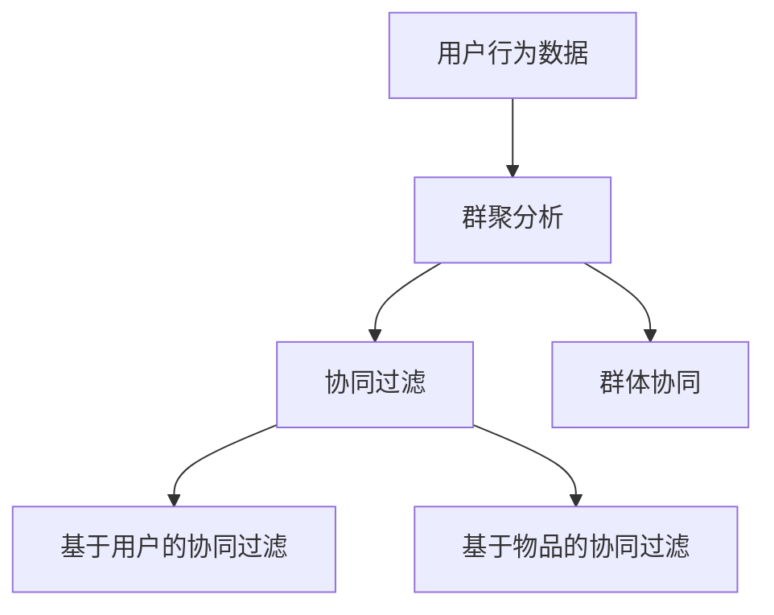

                 

## 1. 背景介绍

推荐系统在数字时代的应用无处不在，从电商平台的商品推荐，到音乐、视频流媒体的个性化内容推荐，再到新闻媒体的兴趣文章推荐，推荐系统已经深入到人们日常生活的方方面面。然而，随着用户基数的不断扩大和个性化需求的日益增长，传统的基于个体兴趣的推荐方式逐渐暴露出瓶颈：它未能充分利用用户之间的关联性，无法在群体层面进行协同推荐，导致了个性化推荐的质量参差不齐，用户体验与推荐系统的期待存在较大差距。

群体推荐技术旨在解决这一问题，通过捕捉用户之间的相似性，建立群体协同关系，使得推荐系统能够在群体层面上进行深度学习，从而提升推荐质量和用户体验。群体推荐技术涵盖了一系列核心算法与方法，包括群聚分析、序列建模、协同过滤等。这些算法与方法不仅能够捕获用户之间的潜在相似性，还能对群体行为进行建模，实现更加精准和多样化的推荐。

## 2. 核心概念与联系

### 2.1 核心概念概述

群体推荐技术的核心概念包括群体协同、群聚分析、协同过滤等。通过这些概念的相互联系，我们能够全面理解群体推荐技术的运作方式及其潜在效果。

- **群体协同**：指用户在特定领域（如商品、文章、视频等）上的行为和偏好存在一定的相似性，这些相似性可以用于群体层面的协同推荐。

- **群聚分析**：通过分析用户行为数据，将用户划分为不同的群集，每个群集内的用户具有相似的需求和偏好。

- **协同过滤**：通过分析用户的历史行为数据，对用户进行特征描述，进而对用户进行匹配和推荐。协同过滤可以分为基于用户的协同过滤和基于物品的协同过滤。

这些核心概念之间的逻辑关系可以通过以下Mermaid流程图来展示：



这个流程图展示了大语言模型的核心概念及其之间的关系：

1. 用户行为数据是群体推荐的基础，通过群聚分析将用户分为不同的群集。
2. 基于群集内用户行为的协同过滤技术，实现群体层面的推荐。
3. 协同过滤又可以分为基于用户的协同过滤和基于物品的协同过滤两种方式。

## 3. 核心算法原理 & 具体操作步骤

### 3.1 算法原理概述

群体推荐技术的核心原理基于协同过滤，即通过用户历史行为数据的相似性，推荐给用户相似群体中未曾接触过的物品。其核心思想在于，相似群体的用户拥有相似的兴趣和偏好，因此群体推荐可以为用户提供更加丰富和多样化的推荐内容。

群体推荐技术的算法一般分为以下几步：

1. 群聚分析：通过分析用户的行为数据，将用户划分为不同的群集。
2. 群体协同：通过分析群集内用户的行为，建立群体协同关系。
3. 协同过滤：通过群体协同关系，对新用户进行物品推荐。

### 3.2 算法步骤详解

#### 步骤一：群聚分析

群聚分析的目标是将用户划分为不同的群集，使得每个群集内的用户具有相似的需求和偏好。常用的群聚算法包括K-Means、层次聚类、DBSCAN等。这里以K-Means为例，给出算法的基本步骤：

1. 选定聚类数目K，通常需要通过经验或实验确定。
2. 随机初始化K个质心。
3. 对每个用户，计算其与每个质心的距离，并将其分配到距离最近的群集中。
4. 更新每个群集的中心点，重新计算每个用户的归属。
5. 重复步骤3-4，直到用户分配不再改变或达到预设的迭代次数。

#### 步骤二：群体协同

群体协同的目标是建立群集内用户之间的协同关系，通过分析群集内用户的行为，了解群体偏好的变化趋势。群集内协同关系的建立可以通过计算群集内用户的相似性来实现。常用的相似性度量方法包括余弦相似度、欧几里得距离等。

#### 步骤三：协同过滤

协同过滤的目标是利用群体协同关系，对新用户进行物品推荐。协同过滤可以分为基于用户的协同过滤和基于物品的协同过滤两种方式。

1. 基于用户的协同过滤：通过计算新用户与群集内用户的相似性，推荐群集中其他用户喜欢的物品给新用户。
2. 基于物品的协同过滤：通过计算新物品与群集内用户喜欢的物品的相似性，推荐给喜欢这些物品的用户。

### 3.3 算法优缺点

#### 优点

群体推荐技术的优点包括：

1. 提升推荐质量：群体推荐能够充分利用用户之间的相似性，提供更加个性化和多样化的推荐。
2. 降低个性化推荐难度：群体推荐使得推荐系统不再局限于个体行为，能够在群体层面上进行协同推荐。
3. 提升用户体验：群体推荐能够减少用户的搜索和筛选成本，提供更加精准的推荐内容。

#### 缺点

群体推荐技术的缺点包括：

1. 群集划分困难：群集划分的结果很大程度上依赖于初始质心的选择和用户行为数据的质量。
2. 冷启动问题：新用户或新物品往往无法被正确地划分到群体中，导致无法利用群体协同关系进行推荐。
3. 数据隐私问题：群体推荐需要收集和分析大量用户行为数据，可能会涉及用户隐私问题。

### 3.4 算法应用领域

群体推荐技术广泛应用于各种推荐系统场景中，如电商推荐、内容推荐、广告推荐等。

- 电商推荐：通过分析用户购买历史和浏览行为，将用户分为不同的群集，实现基于群集的商品推荐。
- 内容推荐：通过分析用户的阅读、观看行为，将用户分为不同的群集，实现基于群集的文章、视频等内容的推荐。
- 广告推荐：通过分析用户的浏览和点击行为，将用户分为不同的群集，实现基于群集的广告推荐。

## 4. 数学模型和公式 & 详细讲解 & 举例说明

### 4.1 数学模型构建

群体推荐技术的数学模型主要包括以下几个部分：

1. **用户行为矩阵**：记录用户对物品的评分或行为数据。
2. **群集划分矩阵**：记录用户与群集的归属关系。
3. **协同矩阵**：记录群集内用户之间的相似性。
4. **物品评分矩阵**：记录物品的评分数据。

#### 公式推导过程

假设用户行为矩阵为 $\mathbf{R}$，用户数为 $U$，物品数为 $I$，行为评分为 $r_{ui}$。

群集划分矩阵为 $\mathbf{G}$，群集数为 $K$，每个用户属于 $g_{ui}$ 个群集。

协同矩阵为 $\mathbf{C}$，其中 $c_{ij}$ 表示群集 $i$ 与群集 $j$ 之间的相似性。

物品评分矩阵为 $\mathbf{P}$，物品评分为 $p_{i}$。

群体协同推荐的目标是最小化预测评分与实际评分之间的误差，即：

$$
\min_{\mathbf{C}} \sum_{i,j} \sum_{u \in g_i} \sum_{v \in g_j} \left( r_{uv} - c_{ij} p_v \right)^2
$$

其中 $r_{uv}$ 表示用户 $u$ 对物品 $v$ 的评分，$c_{ij}$ 表示群集 $i$ 与群集 $j$ 之间的相似性，$p_v$ 表示物品 $v$ 的评分。

### 4.3 案例分析与讲解

以电商推荐为例，假设用户 $u$ 对物品 $i$ 的评分记为 $r_{ui}$，群集划分矩阵 $\mathbf{G}$ 表示用户与群集的归属关系。协同矩阵 $\mathbf{C}$ 表示群集之间的相似性。物品评分矩阵 $\mathbf{P}$ 表示物品的评分数据。

#### 群聚分析

首先，使用K-Means算法将用户分为不同的群集。假设群集 $i$ 与群集 $j$ 之间的相似性通过余弦相似度计算得到：

$$
c_{ij} = \frac{\sum_{u \in g_i} r_{ui} r_{uj}}{\sqrt{\sum_{u \in g_i} r_{ui}^2} \sqrt{\sum_{u \in g_j} r_{uj}^2}}
$$

#### 协同过滤

基于协同矩阵 $\mathbf{C}$，对新用户 $u$ 进行物品推荐。假设新用户 $u$ 未与物品 $i$ 交互，则可以通过群集内其他用户的评分数据，计算物品 $i$ 的预测评分：

$$
\hat{r}_{ui} = \sum_{j} c_{ij} p_j
$$

其中 $p_j$ 表示物品 $j$ 的评分，$c_{ij}$ 表示群集 $i$ 与群集 $j$ 之间的相似性。

## 5. 项目实践：代码实例和详细解释说明

### 5.1 开发环境搭建

在进行群体推荐系统的开发前，需要准备以下开发环境：

1. Python 3.8+。
2. NumPy。
3. SciPy。
4. scikit-learn。
5. Pandas。
6. Matplotlib。
7. 机器学习相关的深度学习框架，如TensorFlow、PyTorch等。

### 5.2 源代码详细实现

#### 群聚分析

以K-Means算法为例，代码实现如下：

```python
import numpy as np
from sklearn.cluster import KMeans

# 用户行为数据
user_behavior = np.array([[1, 2, 3, 4, 5],
                         [2, 3, 4, 5, 6],
                         [3, 4, 5, 6, 7],
                         [4, 5, 6, 7, 8],
                         [5, 6, 7, 8, 9]])

# 创建K-Means模型，聚类数目为2
kmeans = KMeans(n_clusters=2)

# 训练模型
kmeans.fit(user_behavior)

# 输出群集划分结果
print(kmeans.labels_)
```

#### 协同过滤

假设群集划分矩阵 $\mathbf{G}$ 已经计算得到，协同矩阵 $\mathbf{C}$ 为：

```python
# 群集划分矩阵
G = np.array([[0, 1, 1, 1, 1],
              [0, 0, 1, 1, 1],
              [0, 0, 0, 1, 1],
              [0, 0, 0, 0, 1],
              [0, 0, 0, 0, 0]])

# 计算群集间的相似性
C = np.dot(G.T, G) / np.dot(G.T, G).sum()

# 物品评分矩阵
P = np.array([[1, 2, 3, 4, 5],
              [2, 3, 4, 5, 6],
              [3, 4, 5, 6, 7],
              [4, 5, 6, 7, 8],
              [5, 6, 7, 8, 9]])

# 计算新用户对新物品的预测评分
new_user = np.array([6, 7, 8, 9, 10])
new_item = 11
similarity = np.dot(G[new_user], G) / np.dot(G[new_user], G).sum()
prediction = np.dot(similarity, P)
```

### 5.3 代码解读与分析

在上述代码中，我们使用了K-Means算法对用户行为数据进行聚类，并计算了群集间的相似性。通过协同矩阵 $\mathbf{C}$ 和物品评分矩阵 $\mathbf{P}$，对新用户进行了物品推荐。

具体来说，群聚分析通过K-Means算法将用户分为不同的群集，每个群集表示为 $\mathbf{G}$ 中的一个行向量。协同矩阵 $\mathbf{C}$ 通过计算 $\mathbf{G}$ 的相似性得到。基于协同矩阵 $\mathbf{C}$ 和物品评分矩阵 $\mathbf{P}$，对新用户进行物品推荐。

### 5.4 运行结果展示

通过上述代码实现，我们得到了新用户对新物品的预测评分结果。这些结果可以用来进一步进行推荐系统开发，如根据预测评分计算推荐列表，实现个性化推荐。

## 6. 实际应用场景

### 6.1 电商推荐

电商推荐系统中的群体推荐，可以通过分析用户购买历史和浏览行为，将用户分为不同的群集，实现基于群集的商品推荐。例如，用户 $u$ 购买了一件商品 $i$，可以将用户 $u$ 和商品 $i$ 分配到群集 $j$ 中，推荐群集 $j$ 中的其他商品给用户 $u$。

### 6.2 内容推荐

内容推荐系统中的群体推荐，可以通过分析用户的阅读、观看行为，将用户分为不同的群集，实现基于群集的文章、视频等内容的推荐。例如，用户 $u$ 阅读了一篇文章 $i$，可以将用户 $u$ 和文章 $i$ 分配到群集 $j$ 中，推荐群集 $j$ 中的其他文章给用户 $u$。

### 6.3 广告推荐

广告推荐系统中的群体推荐，可以通过分析用户的浏览和点击行为，将用户分为不同的群集，实现基于群集的广告推荐。例如，用户 $u$ 点击了一条广告 $i$，可以将用户 $u$ 和广告 $i$ 分配到群集 $j$ 中，推荐群集 $j$ 中的其他广告给用户 $u$。

## 7. 工具和资源推荐

### 7.1 学习资源推荐

1. 《推荐系统实践》（Recommender Systems: Practical Algorithms and Case Studies）：详细介绍了推荐系统的基本概念、核心算法和实际应用，是一本非常实用的推荐系统学习指南。
2. 《Group Recommendation Systems: Algorithms, Applications and Implementation》：系统介绍了群体推荐系统的前沿技术、实际应用和开发工具，涵盖K-Means、协同过滤等核心算法。
3. Coursera《Machine Learning》课程：斯坦福大学开设的机器学习经典课程，涵盖推荐系统中的基本概念、核心算法和应用案例。
4. Kaggle推荐系统竞赛：参与实际的推荐系统竞赛项目，了解推荐系统的实际应用和技术实现。

### 7.2 开发工具推荐

1. Python：开源的编程语言，广泛应用于机器学习、深度学习等领域。
2. TensorFlow：由Google开发的深度学习框架，支持分布式计算和高效的深度学习模型构建。
3. PyTorch：由Facebook开发的深度学习框架，支持动态图和灵活的模型构建。
4. scikit-learn：基于NumPy的机器学习库，提供丰富的机器学习算法和工具。
5. Jupyter Notebook：交互式编程环境，支持Python、R等语言的编程。

### 7.3 相关论文推荐

1. "Collaborative Filtering with User-Item-Attribute Reduction"（IEEE 2005）：介绍基于用户的协同过滤算法。
2. "A Collaborative Model for Recommendation in Large Scale Information Networks"（KDD 2012）：介绍基于物品的协同过滤算法。
3. "Evaluating Collaborative Filtering Recommendation Systems"（ACM 2012）：系统评价协同过滤算法的性能和效果。

## 8. 总结：未来发展趋势与挑战

### 8.1 研究成果总结

群体推荐技术在推荐系统中的应用已经取得了显著的进展，主要体现在以下几个方面：

1. **算法多样化**：群聚算法和协同过滤算法日益丰富，如K-Means、层次聚类、协同矩阵等。
2. **技术应用广泛**：群体推荐技术已经应用于电商、内容、广告等多个领域，取得了良好的推荐效果。
3. **模型鲁棒性增强**：基于深度学习的推荐模型逐渐取代传统协同过滤模型，提升了推荐系统的鲁棒性和准确性。

### 8.2 未来发展趋势

1. **深度学习技术的应用**：基于深度学习的推荐模型逐渐成为主流，通过神经网络对用户行为进行建模，提升推荐系统的性能。
2. **多模态数据融合**：结合用户的多模态数据（如行为数据、社交网络数据、地理位置数据等），提升推荐系统的准确性和多样性。
3. **个性化推荐**：利用深度学习模型对用户进行个性化推荐，提升推荐系统的用户体验。
4. **实时推荐**：基于流数据和实时计算，实现实时推荐系统，提升推荐系统的时效性。

### 8.3 面临的挑战

1. **数据隐私问题**：群体推荐系统需要收集大量用户数据，存在数据隐私和安全问题。
2. **冷启动问题**：新用户和新物品无法被正确地划分到群体中，导致无法利用群体协同关系进行推荐。
3. **算法复杂性**：群体推荐算法通常较为复杂，需要大量的计算资源和时间成本。
4. **实时计算要求**：实现实时推荐系统需要高效的计算和存储，对于硬件设施提出了更高的要求。

### 8.4 研究展望

1. **多模态数据融合**：结合用户的多模态数据，提升推荐系统的多样性和准确性。
2. **实时推荐系统**：实现基于流数据的实时推荐系统，提升推荐系统的时效性。
3. **推荐系统的可解释性**：提升推荐系统的可解释性，增强用户对推荐结果的信任。
4. **推荐系统的公平性**：研究推荐系统的公平性问题，避免算法偏见。

## 9. 附录：常见问题与解答

**Q1：什么是群体推荐技术？**

A: 群体推荐技术是通过分析用户行为数据，将用户分为不同的群集，并利用群集内用户的行为数据，进行群体协同推荐。

**Q2：群体推荐与个性化推荐有何不同？**

A: 群体推荐和个性化推荐都是推荐系统中的重要技术，但它们的侧重点不同。个性化推荐针对个体用户的行为数据进行推荐，而群体推荐针对群集内的用户行为进行推荐。

**Q3：群体推荐技术在电商推荐系统中如何应用？**

A: 在电商推荐系统中，群体推荐技术可以通过分析用户购买历史和浏览行为，将用户分为不同的群集，实现基于群集的商品推荐。

**Q4：群体推荐技术面临哪些挑战？**

A: 群体推荐技术面临的主要挑战包括数据隐私问题、冷启动问题、算法复杂性、实时计算要求等。

**Q5：如何提高群体推荐的准确性？**

A: 提高群体推荐准确性的方法包括使用更复杂的群聚算法、引入深度学习技术、结合多模态数据等。

综上所述，群体推荐技术在推荐系统中的应用前景广阔，具有重要的理论和实际意义。通过不断探索和优化算法，提升推荐系统的性能和用户体验，群体推荐技术将为推荐系统的发展带来新的机遇和挑战。

