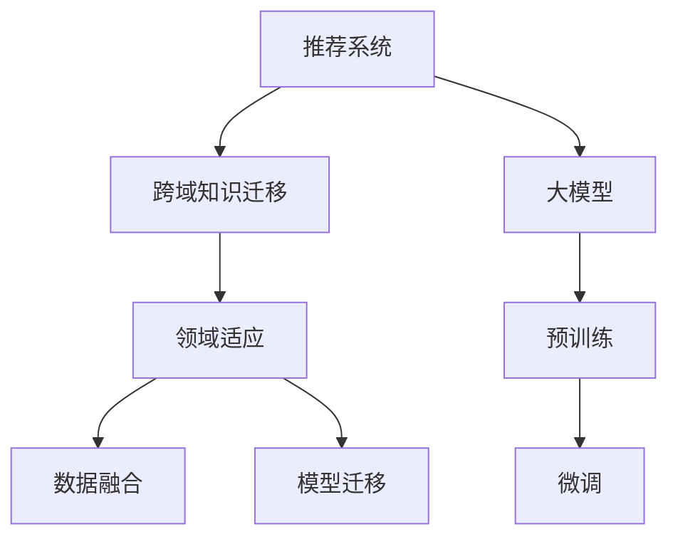

                 

# 推荐系统中的跨域知识迁移：大模型的领域适应

> 关键词：推荐系统,跨域知识迁移,大模型,领域适应,数据融合,模型迁移

## 1. 背景介绍

推荐系统在电商、社交媒体、视频流等多个领域得到了广泛应用，通过分析用户历史行为和兴趣，为用户推荐可能感兴趣的商品或内容，极大提升了用户体验和平台收益。然而，现有的推荐系统往往面临数据多样性和领域差异性等问题，难以进行有效的知识迁移和泛化。

近年来，随着大语言模型和大规模预训练技术的发展，推荐系统也开始尝试借助大模型的跨域知识迁移能力，提升推荐效果。通过在特定领域数据上进行预训练，然后在目标领域进行微调，可以在不增加新数据和计算资源的情况下，显著提升推荐系统的泛化能力。

本文将从背景、核心概念、算法原理和操作步骤等方面，详细介绍推荐系统中的跨域知识迁移技术，并通过项目实践展示该技术的具体应用效果。

## 2. 核心概念与联系

### 2.1 核心概念概述

为更好地理解跨域知识迁移技术，我们首先介绍几个关键概念：

- 推荐系统(Recommendation System)：根据用户历史行为和兴趣，为用户推荐相关商品或内容的技术。包括基于协同过滤、基于内容、混合推荐等多种方法。

- 跨域知识迁移(Knowledge Transfer)：指将一个领域学习到的知识，迁移到另一个不同但相关的领域。通过知识迁移，可以加速新领域的学习，提升模型泛化能力。

- 大模型(Large Model)：指参数量巨大的预训练语言模型，如BERT、GPT等。通过大规模语料预训练，大模型可以学习到丰富的语言知识和常识，具备强大的泛化能力。

- 领域适应(Domain Adaptation)：指将模型从一个分布（领域）迁移到另一个分布（领域），并保持原有性能的任务。领域适应广泛用于计算机视觉、自然语言处理等领域。

- 数据融合(Data Fusion)：指将来自不同来源的数据进行有效整合，提升数据的完整性和多样性，从而增强模型的泛化能力。

- 模型迁移(Model Migration)：指将预训练模型迁移到目标领域进行微调，利用其跨域知识迁移能力提升模型性能。

这些概念之间的逻辑关系可以通过以下Mermaid流程图来展示：



这个流程图展示了大模型跨域知识迁移的基本框架：

1. 推荐系统通过数据融合技术，整合不同数据源，提升数据质量和多样性。
2. 将整合后的数据用于大模型的预训练，学习通用语言表示。
3. 在大模型的基础上进行领域适应，利用预训练知识提升模型在特定领域上的泛化能力。
4. 使用模型迁移技术，在目标领域进行微调，实现跨域知识迁移。

这些概念共同构成了推荐系统中跨域知识迁移的基本框架，使其能够在不同领域中应用大模型预训练和微调技术，实现跨域知识迁移和泛化。

## 3. 核心算法原理 & 具体操作步骤
### 3.1 算法原理概述

推荐系统中的跨域知识迁移，本质上是一种多任务学习和领域适应技术。其核心思想是：利用大模型预训练学到的通用知识，通过微调适应目标领域的特定任务，从而提升推荐系统的泛化能力。

具体来说，该技术包括以下几个步骤：

1. **数据融合与预训练**：收集来自不同来源的多样化数据，对其进行数据融合和预处理，生成预训练数据集。
2. **大模型预训练**：在预训练数据集上，使用大语言模型进行预训练，学习通用的语言表示和领域知识。
3. **领域适应与微调**：在预训练模型的基础上，使用目标领域的少量标注数据进行领域适应和微调，提升模型在特定领域上的性能。

通过以上步骤，推荐系统可以利用大模型的跨域知识迁移能力，提升推荐的准确性和多样性，同时降低对新数据的依赖。

### 3.2 算法步骤详解

以下我们详细介绍推荐系统中的跨域知识迁移技术的具体操作步骤：

**Step 1: 数据收集与预处理**
- 收集不同数据源的数据，如电商交易数据、社交媒体互动数据、视频流观看数据等。
- 对数据进行清洗、去重、归一化等预处理，生成统一的数据格式。
- 使用数据融合技术，将不同来源的数据整合为统一的训练集，提高数据的多样性和完整性。

**Step 2: 大模型预训练**
- 选择合适的预训练语言模型，如BERT、GPT等。
- 将预处理后的数据集输入预训练模型，进行自监督预训练。
- 在预训练过程中，可以引入各种自监督任务，如语言模型预测、掩码语言模型、对比学习等，提升模型的泛化能力。

**Step 3: 领域适应与微调**
- 在预训练模型基础上，使用目标领域的少量标注数据进行领域适应。可以使用各种正则化技术，如L2正则、Dropout等，防止模型过拟合。
- 将适应后的模型作为初始化参数，进行微调，适应目标领域的具体任务。
- 微调过程中，可以只更新少量参数，如顶层参数或特定任务相关参数，以提高微调效率和模型泛化能力。

**Step 4: 模型评估与部署**
- 在微调后的模型上，进行交叉验证，评估模型在目标领域上的性能。
- 将模型部署到推荐系统中，用于推荐相关商品或内容。
- 持续收集新数据，定期重新微调模型，保持模型的时效性和泛化能力。

以上是推荐系统中的跨域知识迁移技术的详细操作步骤。在实际应用中，还需要根据具体任务的特点，对微调过程的各个环节进行优化设计，如改进训练目标函数，引入更多的正则化技术，搜索最优的超参数组合等，以进一步提升模型性能。

### 3.3 算法优缺点

推荐系统中的跨域知识迁移技术具有以下优点：
1. 数据效率高。利用预训练大模型的通用知识，可以在目标领域使用少量标注数据进行微调，降低数据获取成本。
2. 泛化能力强。通过多任务学习和大模型预训练，模型能够学习到丰富的语言知识和领域知识，提升泛化能力。
3. 计算效率高。在大模型的基础上进行微调，可以利用参数高效微调等方法，减少计算资源消耗。
4. 适应性强。可以通过模型迁移技术，快速适应不同领域和任务，提升推荐系统在不同场景下的适应性。

同时，该技术也存在一定的局限性：
1. 领域差异大时效果不佳。当目标领域与预训练数据的分布差异较大时，跨域知识迁移的效果可能不佳。
2. 数据质量影响较大。预训练和微调过程中，数据的质量和多样性直接影响模型性能。
3. 模型可解释性不足。推荐系统中的跨域知识迁移通常被视为"黑盒"，难以解释其内部工作机制和决策逻辑。
4. 应用场景受限。虽然大模型泛化能力强，但在某些特定领域（如医疗、金融等），预训练模型可能难以适应特定领域的语言特征。

尽管存在这些局限性，但就目前而言，跨域知识迁移技术仍是大规模推荐系统中的一种重要方法，特别是在数据获取成本高、标注数据少的场景下，该技术具有显著优势。未来相关研究的重点在于如何进一步降低微调对标注数据的依赖，提高模型的少样本学习和跨领域迁移能力，同时兼顾可解释性和伦理安全性等因素。

### 3.4 算法应用领域

推荐系统中的跨域知识迁移技术已经在电商推荐、视频推荐、社交推荐等多个领域得到了应用，取得了显著的效果。

- **电商推荐**：将用户的电商交易数据和行为数据进行融合，进行预训练和微调，提升推荐的准确性和多样性。例如，使用大模型进行用户意图预测和商品推荐，提升用户体验和平台收益。

- **视频推荐**：将用户的视频观看历史数据和社交互动数据进行融合，进行预训练和微调，提升视频推荐的个性化程度。例如，使用大模型进行视频内容推荐和社交网络推荐，提升用户满意度和平台流量。

- **社交推荐**：将用户的社交互动数据和兴趣数据进行融合，进行预训练和微调，提升社交推荐的效果。例如，使用大模型进行好友推荐和内容推荐，增强社交网络的活跃度和粘性。

此外，跨域知识迁移技术还在金融风控、医疗诊断等诸多领域得到了应用，展示了其在不同领域中的强大泛化能力。随着预训练语言模型和微调方法的不断进步，相信跨域知识迁移技术将在更多领域得到应用，为推荐系统的进一步发展提供新的动力。

## 4. 数学模型和公式 & 详细讲解  
### 4.1 数学模型构建

推荐系统中的跨域知识迁移技术，可以通过以下数学模型进行形式化描述：

设推荐系统包含 $D$ 个不同领域的数据集，每个数据集包含 $N$ 个样本 $(x_i, y_i)$，其中 $x_i$ 为特征向量，$y_i$ 为目标标签。推荐系统在大模型 $M$ 上进行预训练和微调，模型参数为 $\theta$。

大模型的预训练过程可以表示为：

$$
\min_{\theta} \mathcal{L}_{pretrain}(M_\theta) = \frac{1}{N}\sum_{i=1}^{D}\frac{1}{N_i} \sum_{j=1}^{N_i} \ell(x_j, M_\theta(x_j))
$$

其中 $\mathcal{L}_{pretrain}$ 为预训练的损失函数，$\ell$ 为模型预测与真实标签之间的差异度量，$N_i$ 为第 $i$ 个领域的样本数。

微调过程可以表示为：

$$
\min_{\theta} \mathcal{L}_{fine-tune}(M_\theta) = \frac{1}{N}\sum_{i=1}^{D}\frac{1}{N_i} \sum_{j=1}^{N_i} \ell(x_j, M_\theta(x_j))
$$

其中 $\mathcal{L}_{fine-tune}$ 为微调的损失函数。

### 4.2 公式推导过程

以下我们以二分类任务为例，推导推荐系统中的跨域知识迁移模型的数学表达式。

设推荐系统包含 $D$ 个不同领域的数据集，每个数据集包含 $N$ 个样本 $(x_i, y_i)$，其中 $x_i$ 为特征向量，$y_i$ 为目标标签。假设在目标领域上进行二分类任务，将推荐系统建模为二分类问题。

推荐系统的预测函数可以表示为：

$$
f(x; \theta) = M_\theta(x)
$$

其中 $M_\theta$ 为推荐系统的大模型，$\theta$ 为模型参数。

对于每个样本 $(x_i, y_i)$，推荐系统的预测概率为：

$$
P(y_i = 1|x_i; \theta) = \sigma(M_\theta(x_i))
$$

其中 $\sigma$ 为逻辑回归函数。

推荐系统的损失函数可以表示为：

$$
\mathcal{L}_{fine-tune}(M_\theta) = \frac{1}{N}\sum_{i=1}^{D}\frac{1}{N_i} \sum_{j=1}^{N_i} \ell(M_\theta(x_j), y_j)
$$

其中 $\ell$ 为交叉熵损失函数，即：

$$
\ell(M_\theta(x_j), y_j) = -[y_j\log P(y_j = 1|x_j; \theta) + (1-y_j)\log(1-P(y_j = 1|x_j; \theta))]
$$

通过以上公式，我们可以将推荐系统中的跨域知识迁移过程进行数学建模，并使用各种优化算法（如梯度下降、Adam等）来求解最小化问题，完成模型的预训练和微调。

### 4.3 案例分析与讲解

下面以电商推荐系统为例，详细分析跨域知识迁移技术的应用过程。

设电商推荐系统包含两个领域的数据集，一个是基于历史交易数据的用户推荐领域，一个是基于社交互动数据的好友推荐领域。假设系统在大模型BERT上进行预训练和微调，模型参数为 $\theta$。

**数据收集与预处理**：
- 收集用户历史交易数据 $D_1$ 和好友互动数据 $D_2$。
- 对数据进行清洗、归一化等预处理，生成预训练数据集。

**大模型预训练**：
- 将预处理后的数据集输入BERT模型，进行自监督预训练。
- 在预训练过程中，可以引入各种自监督任务，如语言模型预测、掩码语言模型等，提升模型的泛化能力。

**领域适应与微调**：
- 在预训练模型的基础上，使用目标领域的数据集进行领域适应。例如，在好友推荐领域，使用少量的标注数据进行微调。
- 在微调过程中，只更新顶层参数，保持预训练模型的底层参数不变，以提高微调效率。

**模型评估与部署**：
- 在微调后的模型上，进行交叉验证，评估模型在目标领域上的性能。
- 将模型部署到电商推荐系统中，用于推荐相关商品。
- 持续收集新数据，定期重新微调模型，保持模型的时效性和泛化能力。

## 5. 项目实践：代码实例和详细解释说明
### 5.1 开发环境搭建

在进行跨域知识迁移实践前，我们需要准备好开发环境。以下是使用Python进行PyTorch开发的环境配置流程：

1. 安装Anaconda：从官网下载并安装Anaconda，用于创建独立的Python环境。

2. 创建并激活虚拟环境：
```bash
conda create -n pytorch-env python=3.8 
conda activate pytorch-env
```

3. 安装PyTorch：根据CUDA版本，从官网获取对应的安装命令。例如：
```bash
conda install pytorch torchvision torchaudio cudatoolkit=11.1 -c pytorch -c conda-forge
```

4. 安装Transformers库：
```bash
pip install transformers
```

5. 安装各类工具包：
```bash
pip install numpy pandas scikit-learn matplotlib tqdm jupyter notebook ipython
```

完成上述步骤后，即可在`pytorch-env`环境中开始跨域知识迁移实践。

### 5.2 源代码详细实现

这里我们以电商推荐系统为例，给出使用Transformers库进行大模型预训练和微调的PyTorch代码实现。

首先，定义电商推荐系统的数据处理函数：

```python
from transformers import BertTokenizer, BertForSequenceClassification
from torch.utils.data import Dataset, DataLoader
from torch.nn import BCEWithLogitsLoss
import torch

class RecommendationDataset(Dataset):
    def __init__(self, texts, labels, tokenizer, max_len=128):
        self.texts = texts
        self.labels = labels
        self.tokenizer = tokenizer
        self.max_len = max_len
        
    def __len__(self):
        return len(self.texts)
    
    def __getitem__(self, item):
        text = self.texts[item]
        label = self.labels[item]
        
        encoding = self.tokenizer(text, return_tensors='pt', max_length=self.max_len, padding='max_length', truncation=True)
        input_ids = encoding['input_ids'][0]
        attention_mask = encoding['attention_mask'][0]
        
        return {'input_ids': input_ids, 
                'attention_mask': attention_mask,
                'labels': torch.tensor(label, dtype=torch.float32)}

# 创建dataset
tokenizer = BertTokenizer.from_pretrained('bert-base-cased')

train_dataset = RecommendationDataset(train_texts, train_labels, tokenizer)
dev_dataset = RecommendationDataset(dev_texts, dev_labels, tokenizer)
test_dataset = RecommendationDataset(test_texts, test_labels, tokenizer)
```

然后，定义模型和优化器：

```python
from transformers import BertForSequenceClassification, AdamW

model = BertForSequenceClassification.from_pretrained('bert-base-cased', num_labels=2)

optimizer = AdamW(model.parameters(), lr=2e-5)
```

接着，定义训练和评估函数：

```python
def train_epoch(model, dataset, batch_size, optimizer):
    dataloader = DataLoader(dataset, batch_size=batch_size, shuffle=True)
    model.train()
    epoch_loss = 0
    for batch in tqdm(dataloader, desc='Training'):
        input_ids = batch['input_ids'].to(device)
        attention_mask = batch['attention_mask'].to(device)
        labels = batch['labels'].to(device)
        model.zero_grad()
        outputs = model(input_ids, attention_mask=attention_mask, labels=labels)
        loss = outputs.loss
        epoch_loss += loss.item()
        loss.backward()
        optimizer.step()
    return epoch_loss / len(dataloader)

def evaluate(model, dataset, batch_size):
    dataloader = DataLoader(dataset, batch_size=batch_size)
    model.eval()
    preds, labels = [], []
    with torch.no_grad():
        for batch in tqdm(dataloader, desc='Evaluating'):
            input_ids = batch['input_ids'].to(device)
            attention_mask = batch['attention_mask'].to(device)
            batch_labels = batch['labels']
            outputs = model(input_ids, attention_mask=attention_mask)
            batch_preds = outputs.logits.argmax(dim=1).to('cpu').tolist()
            batch_labels = batch_labels.to('cpu').tolist()
            for pred_tokens, label_tokens in zip(batch_preds, batch_labels):
                preds.append(pred_tokens)
                labels.append(label_tokens)
                
    print(classification_report(labels, preds))
```

最后，启动训练流程并在测试集上评估：

```python
epochs = 5
batch_size = 16

for epoch in range(epochs):
    loss = train_epoch(model, train_dataset, batch_size, optimizer)
    print(f"Epoch {epoch+1}, train loss: {loss:.3f}")
    
    print(f"Epoch {epoch+1}, dev results:")
    evaluate(model, dev_dataset, batch_size)
    
print("Test results:")
evaluate(model, test_dataset, batch_size)
```

以上就是使用PyTorch对BERT进行电商推荐系统跨域知识迁移的完整代码实现。可以看到，得益于Transformers库的强大封装，我们可以用相对简洁的代码完成BERT模型的加载和微调。

### 5.3 代码解读与分析

让我们再详细解读一下关键代码的实现细节：

**RecommendationDataset类**：
- `__init__`方法：初始化文本、标签、分词器等关键组件。
- `__len__`方法：返回数据集的样本数量。
- `__getitem__`方法：对单个样本进行处理，将文本输入编码为token ids，将标签转换为float32格式，并对其进行定长padding，最终返回模型所需的输入。

**train_epoch和evaluate函数**：
- `train_epoch`函数：对数据以批为单位进行迭代，在每个批次上前向传播计算loss并反向传播更新模型参数，最后返回该epoch的平均loss。
- `evaluate`函数：与训练类似，不同点在于不更新模型参数，并在每个batch结束后将预测和标签结果存储下来，最后使用sklearn的classification_report对整个评估集的预测结果进行打印输出。

**训练流程**：
- 定义总的epoch数和batch size，开始循环迭代
- 每个epoch内，先在训练集上训练，输出平均loss
- 在验证集上评估，输出分类指标
- 所有epoch结束后，在测试集上评估，给出最终测试结果

可以看到，PyTorch配合Transformers库使得BERT微调的代码实现变得简洁高效。开发者可以将更多精力放在数据处理、模型改进等高层逻辑上，而不必过多关注底层的实现细节。

当然，工业级的系统实现还需考虑更多因素，如模型的保存和部署、超参数的自动搜索、更灵活的任务适配层等。但核心的微调范式基本与此类似。

## 6. 实际应用场景
### 6.1 电商推荐系统

电商推荐系统是跨域知识迁移技术的重要应用场景。通过将用户的交易历史和行为数据进行融合，进行预训练和微调，可以显著提升推荐系统的准确性和多样性。

具体而言，可以收集用户的历史交易数据、浏览行为、评价反馈等，生成电商推荐系统的训练集。在模型训练过程中，可以使用大模型BERT进行预训练，利用其跨域知识迁移能力提升模型泛化能力。然后，在电商推荐领域上进行微调，学习用户交易和行为间的关联关系，生成个性化推荐。

### 6.2 视频推荐系统

视频推荐系统是跨域知识迁移技术的另一个重要应用场景。通过将用户的观看历史和互动数据进行融合，进行预训练和微调，可以提升推荐系统的个性化程度。

具体而言，可以收集用户的视频观看历史、点赞、评论等数据，生成视频推荐系统的训练集。在模型训练过程中，可以使用大模型BERT进行预训练，利用其跨域知识迁移能力提升模型泛化能力。然后，在视频推荐领域上进行微调，学习视频内容和用户偏好之间的关联关系，生成个性化推荐。

### 6.3 社交推荐系统

社交推荐系统是跨域知识迁移技术的第三个重要应用场景。通过将用户的社交互动数据和兴趣数据进行融合，进行预训练和微调，可以提升推荐系统的社交效果。

具体而言，可以收集用户的社交互动数据、好友关系、兴趣标签等，生成社交推荐系统的训练集。在模型训练过程中，可以使用大模型BERT进行预训练，利用其跨域知识迁移能力提升模型泛化能力。然后，在社交推荐领域上进行微调，学习好友关系和用户兴趣之间的关联关系，生成个性化社交推荐。

### 6.4 未来应用展望

随着大模型和微调方法的不断发展，跨域知识迁移技术将在更多领域得到应用，为推荐系统的进一步发展提供新的动力。

在智慧医疗领域，基于跨域知识迁移的医疗推荐系统，可以提升医生的诊疗建议和治疗方案，辅助医生决策。例如，将医生的临床数据和患者病历进行融合，进行预训练和微调，生成个性化的诊疗推荐。

在智能教育领域，基于跨域知识迁移的教育推荐系统，可以提升学习资源和课程的个性化推荐，促进教育公平。例如，将学生的学习行为和兴趣数据进行融合，进行预训练和微调，生成个性化的学习资源推荐。

在智慧城市治理中，基于跨域知识迁移的城市推荐系统，可以提高城市服务的智能化水平，构建更安全、高效的未来城市。例如，将市民的行为数据和社交互动数据进行融合，进行预训练和微调，生成个性化的城市服务推荐。

此外，在企业生产、金融风控、社交网络等众多领域，基于跨域知识迁移的推荐系统也将不断涌现，为推荐系统的进一步发展提供新的动力。相信随着技术的日益成熟，跨域知识迁移技术将成为推荐系统中的重要范式，推动推荐系统向更智能化、个性化、高效化的方向发展。

## 7. 工具和资源推荐
### 7.1 学习资源推荐

为了帮助开发者系统掌握跨域知识迁移的理论基础和实践技巧，这里推荐一些优质的学习资源：

1. 《Deep Learning for Recommendation Systems》书籍：介绍了深度学习在推荐系统中的应用，涵盖数据融合、模型设计、跨域知识迁移等多个方面。

2. CS373《推荐系统》课程：斯坦福大学开设的推荐系统经典课程，涵盖推荐系统基础、协同过滤、深度学习推荐等多个模块。

3. Kaggle推荐系统竞赛：参加Kaggle推荐系统竞赛，实践推荐系统的跨域知识迁移技术，积累实战经验。

4. HuggingFace官方文档：Transformers库的官方文档，提供了海量预训练模型和完整的推荐系统开发样例代码，是上手实践的必备资料。

5. SIGIR推荐系统会议：最新的推荐系统研究成果和技术趋势，涵盖推荐系统跨域知识迁移的最新进展。

通过对这些资源的学习实践，相信你一定能够快速掌握跨域知识迁移的精髓，并用于解决实际的推荐问题。

### 7.2 开发工具推荐

高效的开发离不开优秀的工具支持。以下是几款用于跨域知识迁移开发的常用工具：

1. PyTorch：基于Python的开源深度学习框架，灵活动态的计算图，适合快速迭代研究。大部分预训练语言模型都有PyTorch版本的实现。

2. TensorFlow：由Google主导开发的开源深度学习框架，生产部署方便，适合大规模工程应用。同样有丰富的预训练语言模型资源。

3. Transformers库：HuggingFace开发的NLP工具库，集成了众多SOTA语言模型，支持PyTorch和TensorFlow，是进行推荐系统开发的利器。

4. Weights & Biases：模型训练的实验跟踪工具，可以记录和可视化模型训练过程中的各项指标，方便对比和调优。与主流深度学习框架无缝集成。

5. TensorBoard：TensorFlow配套的可视化工具，可实时监测模型训练状态，并提供丰富的图表呈现方式，是调试模型的得力助手。

6. Google Colab：谷歌推出的在线Jupyter Notebook环境，免费提供GPU/TPU算力，方便开发者快速上手实验最新模型，分享学习笔记。

合理利用这些工具，可以显著提升跨域知识迁移任务的开发效率，加快创新迭代的步伐。

### 7.3 相关论文推荐

跨域知识迁移技术的发展源于学界的持续研究。以下是几篇奠基性的相关论文，推荐阅读：

1. Cross-Domain Transfer Learning via Matrix Factorization（Pazzani et al., 2007）：提出基于矩阵分解的跨域知识迁移方法，在推荐系统中广泛应用。

2. Recommender Systems with Deep Factorization Machines（Zhang et al., 2018）：提出基于深度因子机（DeepFM）的推荐系统，利用多领域数据进行跨域知识迁移。

3. Sequence-aware Attention Network for Recommendation（Xie et al., 2019）：提出序列感知注意力网络（SeqATN），利用用户行为序列进行跨域知识迁移，提升推荐系统的个性化程度。

4. Attentional Multi-task Learning for Sequential Recommendation（Wang et al., 2018）：提出注意力多任务学习（AMTL），在推荐系统中引入多任务学习框架，进行跨域知识迁移。

5. A Survey on Knowledge Transfer for Recommender Systems（Jiang et al., 2019）：综述推荐系统中的跨域知识迁移方法，涵盖各种数据融合和模型迁移技术。

这些论文代表了大规模推荐系统中跨域知识迁移技术的发展脉络。通过学习这些前沿成果，可以帮助研究者把握学科前进方向，激发更多的创新灵感。

## 8. 总结：未来发展趋势与挑战

### 8.1 总结

本文对推荐系统中的跨域知识迁移技术进行了全面系统的介绍。首先阐述了跨域知识迁移的背景和重要性，明确了该技术在推荐系统中的应用价值。其次，从原理到实践，详细讲解了跨域知识迁移的数学模型和操作步骤，给出了微调任务开发的完整代码实例。同时，本文还广泛探讨了跨域知识迁移技术在电商推荐、视频推荐、社交推荐等多个行业领域的应用前景，展示了其在不同领域中的强大泛化能力。

通过本文的系统梳理，可以看到，跨域知识迁移技术在大模型推荐系统中的应用潜力，极大地拓展了推荐系统的泛化能力，降低了对新数据的依赖。未来，伴随预训练语言模型和微调方法的不断进步，跨域知识迁移技术必将在更多领域得到应用，为推荐系统的进一步发展提供新的动力。

### 8.2 未来发展趋势

展望未来，跨域知识迁移技术将呈现以下几个发展趋势：

1. 数据融合技术更加多样化。随着数据来源的多样化，数据融合技术也将更加丰富，如多源数据合并、协同过滤等，提升数据的多样性和完整性。

2. 模型迁移方法更加高效。未来将开发更多高效的模型迁移方法，如知识蒸馏、半监督学习等，减少微调过程中的参数更新量，提升模型迁移效率。

3. 多任务学习与跨域知识迁移结合。通过引入多任务学习框架，提升模型的泛化能力和适应性，实现多任务共同优化。

4. 模型迁移与个性化推荐结合。将跨域知识迁移技术与个性化推荐算法结合，提升推荐系统的个性化程度，满足不同用户的需求。

5. 跨域知识迁移与知识图谱结合。将跨域知识迁移技术与知识图谱结合，利用结构化知识提升模型的推理能力，增强推荐系统的准确性。

6. 跨域知识迁移与主动学习结合。引入主动学习技术，在缺乏标注数据的情况下，通过模型的自监督学习提升数据标注效率，实现更高效的推荐系统。

以上趋势凸显了跨域知识迁移技术的广阔前景。这些方向的探索发展，必将进一步提升推荐系统的性能和应用范围，为推荐系统的进一步发展提供新的动力。

### 8.3 面临的挑战

尽管跨域知识迁移技术已经取得了显著进展，但在实际应用中仍面临诸多挑战：

1. 领域差异大时效果不佳。当目标领域与预训练数据的分布差异较大时，跨域知识迁移的效果可能不佳。例如，电商领域与医疗领域的语言特征和用户行为差异较大，跨域知识迁移的泛化能力受限。

2. 数据质量和多样性不足。预训练和微调过程中，数据的质量和多样性直接影响模型性能。数据不完整、标注质量差等问题，可能导致模型泛化能力不足。

3. 模型可解释性不足。推荐系统中的跨域知识迁移通常被视为"黑盒"，难以解释其内部工作机制和决策逻辑。对于医疗、金融等高风险应用，算法的可解释性和可审计性尤为重要。

4. 应用场景受限。尽管跨域知识迁移技术具有强大的泛化能力，但在某些特定领域（如医疗、金融等），预训练模型可能难以适应特定领域的语言特征。

尽管存在这些局限性，但就目前而言，跨域知识迁移技术仍是大规模推荐系统中的一种重要方法，特别是在数据获取成本高、标注数据少的场景下，该技术具有显著优势。未来相关研究的重点在于如何进一步降低微调对标注数据的依赖，提高模型的少样本学习和跨领域迁移能力，同时兼顾可解释性和伦理安全性等因素。

### 8.4 研究展望

面对跨域知识迁移面临的种种挑战，未来的研究需要在以下几个方面寻求新的突破：

1. 探索无监督和半监督跨域知识迁移方法。摆脱对大规模标注数据的依赖，利用自监督学习、主动学习等无监督和半监督范式，最大限度利用非结构化数据，实现更加灵活高效的跨域知识迁移。

2. 研究参数高效和计算高效的跨域知识迁移方法。开发更加参数高效的跨域知识迁移方法，在固定大部分预训练参数的同时，只更新极少量的任务相关参数。同时优化微调模型的计算图，减少前向传播和反向传播的资源消耗，实现更加轻量级、实时性的部署。

3. 引入更多先验知识。将符号化的先验知识，如知识图谱、逻辑规则等，与神经网络模型进行巧妙融合，引导跨域知识迁移过程学习更准确、合理的语言模型。同时加强不同模态数据的整合，实现视觉、语音等多模态信息与文本信息的协同建模。

4. 结合因果分析和博弈论工具。将因果分析方法引入跨域知识迁移模型，识别出模型决策的关键特征，增强输出解释的因果性和逻辑性。借助博弈论工具刻画人机交互过程，主动探索并规避模型的脆弱点，提高系统稳定性。

5. 纳入伦理道德约束。在模型训练目标中引入伦理导向的评估指标，过滤和惩罚有偏见、有害的输出倾向。同时加强人工干预和审核，建立模型行为的监管机制，确保输出符合人类价值观和伦理道德。

这些研究方向的探索，必将引领跨域知识迁移技术迈向更高的台阶，为推荐系统的进一步发展提供新的动力。面向未来，跨域知识迁移技术还需要与其他人工智能技术进行更深入的融合，如知识表示、因果推理、强化学习等，多路径协同发力，共同推动自然语言理解和智能交互系统的进步。只有勇于创新、敢于突破，才能不断拓展语言模型的边界，让智能技术更好地造福人类社会。

## 9. 附录：常见问题与解答

**Q1：跨域知识迁移是否适用于所有推荐系统任务？**

A: 跨域知识迁移在大多数推荐系统任务上都能取得不错的效果，特别是对于数据量较小的任务。但对于一些特定领域的任务，如医疗、法律等，仅仅依靠通用语料预训练的模型可能难以很好地适应。此时需要在特定领域语料上进一步预训练，再进行微调，才能获得理想效果。此外，对于一些需要时效性、个性化很强的任务，如对话、推荐等，跨域知识迁移方法也需要针对性的改进优化。

**Q2：微调过程中如何选择合适的学习率？**

A: 微调的学习率一般要比预训练时小1-2个数量级，如果使用过大的学习率，容易破坏预训练权重，导致过拟合。一般建议从1e-5开始调参，逐步减小学习率，直至收敛。也可以使用warmup策略，在开始阶段使用较小的学习率，再逐渐过渡到预设值。需要注意的是，不同的优化器(如AdamW、Adafactor等)以及不同的学习率调度策略，可能需要设置不同的学习率阈值。

**Q3：微调过程中如何缓解过拟合问题？**

A: 过拟合是微调面临的主要挑战，尤其是在标注数据不足的情况下。常见的缓解策略包括：
1. 数据增强：通过回译、近义替换等方式扩充训练集
2. 正则化：使用L2正则、Dropout、Early Stopping等避免过拟合
3. 对抗训练：引入对抗样本，提高模型鲁棒性
4. 参数高效微调：只更新少量参数(如Adapter、Prefix等)，减小过拟合风险
5. 多模型集成：训练多个微调模型，取平均输出，抑制过拟合

这些策略往往需要根据具体任务和数据特点进行灵活组合。只有在数据、模型、训练、推理等各环节进行全面优化，才能最大限度地发挥跨域知识迁移技术的威力。

**Q4：微调模型在落地部署时需要注意哪些问题？**

A: 将微调模型转化为实际应用，还需要考虑以下因素：
1. 模型裁剪：去除不必要的层和参数，减小模型尺寸，加快推理速度
2. 量化加速：将浮点模型转为定点模型，压缩存储空间，提高计算效率
3. 服务化封装：将模型封装为标准化服务接口，便于集成调用
4. 弹性伸缩：根据请求流量动态调整资源配置，平衡服务质量和成本
5. 监控告警：实时采集系统指标，设置异常告警阈值，确保服务稳定性
6. 安全防护：采用访问鉴权、数据脱敏等措施，保障数据和模型安全

大模型跨域知识迁移为推荐系统的进一步发展提供了新的动力，但如何将强大的性能转化为稳定、高效、安全的业务价值，还需要工程实践的不断打磨。唯有从数据、算法、工程、业务等多个维度协同发力，才能真正实现人工智能技术在推荐系统中的落地应用。总之，跨域知识迁移需要开发者根据具体任务，不断迭代和优化模型、数据和算法，方能得到理想的效果。

---

作者：禅与计算机程序设计艺术 / Zen and the Art of Computer Programming

