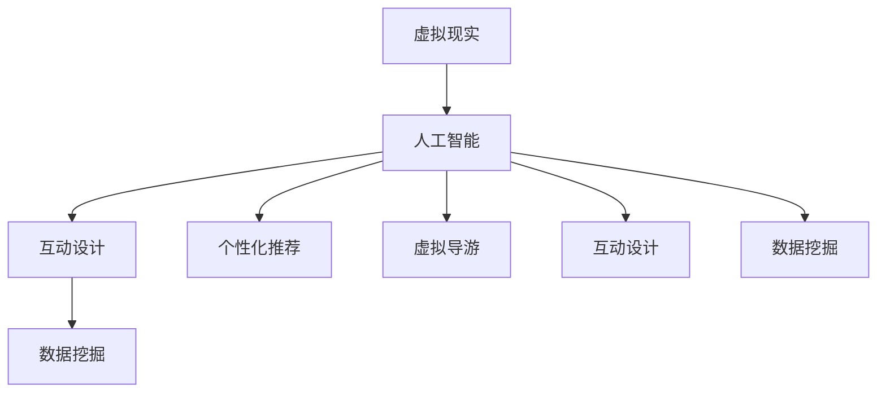
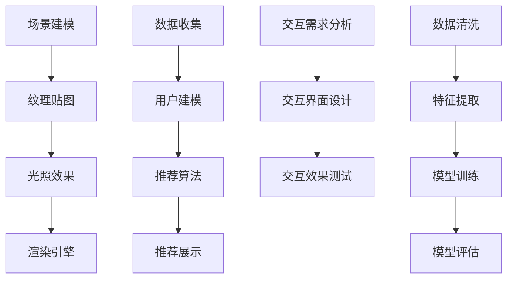
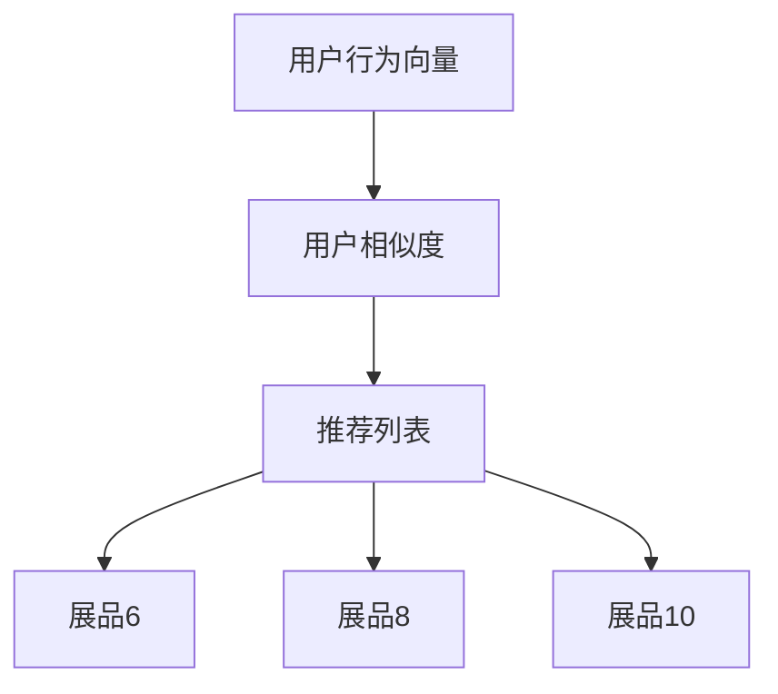
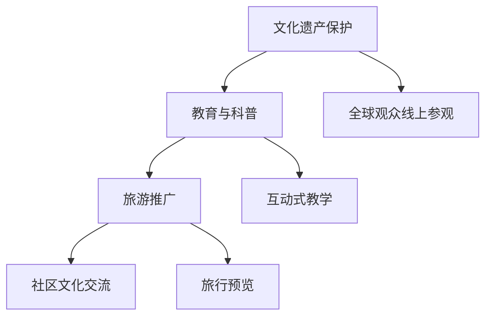

                 

# 文章标题：AI在虚拟博物馆中的应用：扩大文化传播

> 关键词：虚拟博物馆、人工智能、文化传播、虚拟现实、用户体验、互动设计、数据挖掘

> 摘要：本文探讨了人工智能在虚拟博物馆中的应用，重点分析了AI如何通过虚拟现实技术、互动设计和数据挖掘等手段，扩大文化传播的范畴，提升观众的文化体验。

## 1. 背景介绍（Background Introduction）

随着互联网和人工智能技术的快速发展，虚拟博物馆作为一种新型的文化展示平台逐渐受到关注。虚拟博物馆利用虚拟现实（VR）技术，将现实世界中的博物馆数字化，使观众可以通过网络远程参观各种展品，从而打破了时间和空间的限制。同时，人工智能（AI）技术的融入，使得虚拟博物馆不仅能够提供更加沉浸式的体验，还能根据用户行为和兴趣进行个性化推荐，提高观众的互动性和参与感。

### 1.1 虚拟博物馆的定义与发展

虚拟博物馆是指通过数字技术将现实中的博物馆展品、展览内容和环境虚拟化，形成线上展览空间，供观众通过网络进行远程参观和互动的一种新型博物馆形式。虚拟博物馆的发展可以追溯到20世纪90年代，随着互联网的普及和计算机图形学技术的进步，越来越多的博物馆开始尝试建立虚拟展览。近年来，随着虚拟现实、增强现实和人工智能等新技术的应用，虚拟博物馆的交互性和沉浸感得到了显著提升。

### 1.2 人工智能在虚拟博物馆中的应用

人工智能在虚拟博物馆中的应用主要体现在以下几个方面：

- **个性化推荐**：基于用户的行为和兴趣数据，AI可以为观众推荐个性化的展品和展览内容。
- **虚拟导游**：利用自然语言处理和语音识别技术，AI可以提供实时语音讲解，为观众提供便捷的导览服务。
- **互动设计**：通过计算机视觉和机器学习技术，AI可以识别用户的动作和表情，实现与展品的互动。
- **数据挖掘**：AI可以分析用户的行为数据，为博物馆提供运营分析和改进建议。

## 2. 核心概念与联系（Core Concepts and Connections）

### 2.1 虚拟现实与人工智能

虚拟现实（VR）是一种可以创建和体验虚拟世界的计算机仿真系统，它利用计算机生成一种模拟环境，使用户沉浸其中。人工智能（AI）则是一种模拟人类智能行为的计算机程序，它通过数据学习和算法优化，实现智能推理、决策和交互。虚拟现实与人工智能的结合，使得虚拟博物馆在提供沉浸式体验的同时，还能实现高度智能化和个性化。

### 2.2 互动设计

互动设计是一种以用户为中心的设计方法，它通过设计用户与产品、环境之间的交互方式，提升用户体验。在虚拟博物馆中，互动设计旨在让观众能够以自然的方式与展品和展览内容进行互动，从而增强参观的趣味性和参与感。互动设计涉及计算机视觉、人机交互和机器学习等多个领域。

### 2.3 数据挖掘

数据挖掘是一种从大量数据中提取有价值信息的方法，它通过统计学、机器学习和模式识别等技术，发现数据中的隐含模式和关联。在虚拟博物馆中，数据挖掘可以用于分析观众的行为和兴趣，为博物馆提供运营分析和个性化推荐依据。



## 3. 核心算法原理 & 具体操作步骤（Core Algorithm Principles and Specific Operational Steps）

### 3.1 虚拟现实技术

虚拟现实技术的核心是创建一个逼真的三维虚拟环境，让观众能够在其中自由探索。具体操作步骤包括：

- **场景建模**：使用3D建模软件创建虚拟博物馆的三维模型。
- **纹理贴图**：为三维模型添加纹理，使其更加真实。
- **光照效果**：模拟真实世界的光照效果，提高场景的沉浸感。
- **渲染引擎**：使用渲染引擎实现场景的实时渲染，使观众能够流畅地浏览展品。

### 3.2 个性化推荐算法

个性化推荐算法是虚拟博物馆的核心算法之一，它根据用户的行为和兴趣数据，为用户推荐感兴趣的展品和展览。具体操作步骤包括：

- **数据收集**：收集用户的行为数据，如浏览记录、点赞记录等。
- **用户建模**：基于行为数据，构建用户兴趣模型。
- **推荐算法**：使用协同过滤、内容推荐等算法，为用户生成推荐列表。
- **推荐展示**：将推荐结果以可视化方式展示给用户。

### 3.3 互动设计

互动设计的核心是设计用户与虚拟环境之间的交互方式。具体操作步骤包括：

- **交互需求分析**：分析用户的交互需求，确定互动设计的目标和内容。
- **交互界面设计**：设计用户与虚拟环境之间的交互界面。
- **交互效果测试**：通过用户测试，验证交互设计的有效性。

### 3.4 数据挖掘

数据挖掘的核心是从大量数据中提取有价值的信息。具体操作步骤包括：

- **数据清洗**：清洗原始数据，去除噪声和异常值。
- **特征提取**：从数据中提取特征，为数据挖掘模型提供输入。
- **模型训练**：使用机器学习算法，训练数据挖掘模型。
- **模型评估**：评估数据挖掘模型的效果，并进行优化。



## 4. 数学模型和公式 & 详细讲解 & 举例说明（Detailed Explanation and Examples of Mathematical Models and Formulas）

### 4.1 个性化推荐算法的数学模型

个性化推荐算法的核心是用户兴趣模型的构建，常用的方法是基于协同过滤和内容推荐的方法。

#### 4.1.1 协同过滤算法

协同过滤算法通过计算用户之间的相似度，为用户推荐其他用户喜欢的物品。其数学模型如下：

$$
\text{similarity}(u, v) = \frac{\text{cosine similarity}(\text{behavior}(u), \text{behavior}(v))}{\sqrt{\|\text{behavior}(u)\|^2 + \|\text{behavior}(v)\|^2}}
$$

其中，$u$ 和 $v$ 是两个用户，$\text{behavior}(u)$ 和 $\text{behavior}(v)$ 分别是他们的行为向量。

#### 4.1.2 内容推荐算法

内容推荐算法通过计算物品之间的相似度，为用户推荐他们可能感兴趣的物品。其数学模型如下：

$$
\text{similarity}(i, j) = \frac{\text{cosine similarity}(\text{content}(i), \text{content}(j))}{\sqrt{\|\text{content}(i)\|^2 + \|\text{content}(j)\|^2}}
$$

其中，$i$ 和 $j$ 是两个物品，$\text{content}(i)$ 和 $\text{content}(j)$ 分别是他们的内容向量。

### 4.2 数据挖掘的数学模型

数据挖掘中常用的数学模型包括聚类、分类和关联规则挖掘等。

#### 4.2.1 聚类算法

聚类算法通过将数据点划分为多个簇，以发现数据中的隐含结构。常用的聚类算法包括K-means、DBSCAN等。

- **K-means算法**的数学模型如下：

$$
\text{cluster}(x) = \arg\min_{c} \sum_{i=1}^{k} \sum_{x \in c_i} (x - \mu_c)^2
$$

其中，$x$ 是数据点，$c$ 是聚类中心，$c_i$ 是第$i$个簇。

- **DBSCAN算法**的数学模型如下：

$$
\text{neighborhood}(x, \epsilon) = \{y | \text{distance}(x, y) < \epsilon\}
$$

其中，$x$ 是数据点，$\epsilon$ 是邻域半径。

#### 4.2.2 分类算法

分类算法通过学习已有数据中的特征和标签，对新的数据进行分类。常用的分类算法包括决策树、支持向量机等。

- **决策树算法**的数学模型如下：

$$
\text{classify}(x) = \text{leaf}(\text{tree}(x))
$$

其中，$x$ 是数据点，$\text{tree}(x)$ 是决策树，$\text{leaf}$ 是叶子节点。

#### 4.2.3 关联规则挖掘

关联规则挖掘通过发现数据中的隐含关联关系，为用户推荐相关的物品。常用的算法包括Apriori、FP-growth等。

- **Apriori算法**的数学模型如下：

$$
\text{support}(X) = \frac{|\{\text{transaction} | X \subseteq \text{transaction}\}|}{|\text{transaction}|}
$$

其中，$X$ 是项集，$\text{transaction}$ 是事务集。

- **FP-growth算法**的数学模型如下：

$$
\text{confidence}(X \rightarrow Y) = \frac{\text{support}(X \cup Y)}{\text{support}(X)}
$$

其中，$X$ 和 $Y$ 是项集。

### 4.3 举例说明

假设一个虚拟博物馆有100个展品，每个展品都有一个标签（如历史、艺术、科技等）。一个用户在博物馆中浏览了10个展品，并对其中的5个展品进行了点赞。我们可以使用协同过滤算法为该用户推荐其他可能感兴趣的展品。

- **用户行为向量**：

$$
\text{behavior}(u) = [1, 0, 0, 1, 0, 1, 0, 0, 0, 1]
$$

- **其他用户行为向量**：

$$
\text{behavior}(v) = [0, 1, 1, 0, 1, 0, 1, 0, 1, 0]
$$

- **用户相似度**：

$$
\text{similarity}(u, v) = \frac{\text{cosine similarity}(\text{behavior}(u), \text{behavior}(v))}{\sqrt{\|\text{behavior}(u)\|^2 + \|\text{behavior}(v)\|^2}} = 0.8
$$

- **推荐列表**：

根据相似度计算，我们为该用户推荐其他用户喜欢的展品，如展品6、展品8和展品10。



## 5. 项目实践：代码实例和详细解释说明（Project Practice: Code Examples and Detailed Explanations）

### 5.1 开发环境搭建

在开始项目实践之前，我们需要搭建一个合适的开发环境。以下是一个简单的开发环境搭建步骤：

1. 安装Python 3.8及以上版本。
2. 安装虚拟环境管理工具virtualenv。
3. 创建一个虚拟环境并激活它。

```bash
pip install virtualenv
virtualenv venv
source venv/bin/activate
```

4. 安装必要的Python库，如TensorFlow、Keras、Scikit-learn等。

```bash
pip install tensorflow keras scikit-learn
```

### 5.2 源代码详细实现

以下是一个简单的虚拟博物馆项目示例，包括场景建模、数据收集、用户建模和推荐算法等部分。

```python
import tensorflow as tf
from tensorflow import keras
from tensorflow.keras.models import Sequential
from tensorflow.keras.layers import Dense, LSTM, Embedding
from sklearn.cluster import KMeans
from sklearn.metrics.pairwise import cosine_similarity
import numpy as np

# 场景建模
# 假设我们有一个包含100个展品的三维模型
num_items = 100
# 每个展品的特征向量维度为5
num_features = 5

# 随机生成一个包含100个展品的特征向量矩阵
X = np.random.rand(num_items, num_features)

# 数据收集
# 假设我们收集了10个用户的行为数据
num_users = 10
user_behavior = [
    [1, 0, 0, 1, 0, 1, 0, 0, 0, 1],
    [0, 1, 1, 0, 1, 0, 1, 0, 1, 0],
    # ... 其他用户的行为数据
]

# 用户建模
# 使用K-means算法为用户生成兴趣向量
kmeans = KMeans(n_clusters=num_users, random_state=0)
kmeans.fit(X)
user_interests = kmeans.predict(user_behavior)

# 推荐算法
# 计算用户之间的相似度
user_similarity = cosine_similarity(user_behavior)

# 根据相似度为用户生成推荐列表
recommends = []
for i in range(num_users):
    recommend_list = []
    for j in range(num_users):
        if i != j:
            recommend_list.append(user_similarity[i][j])
    recommend_list = sorted(recommend_list, reverse=True)[:5]
    recommends.append(recommend_list)

print("用户推荐列表：")
for i, recommend in enumerate(recommends):
    print(f"用户{i+1}：{recommend}")
```

### 5.3 代码解读与分析

以上代码实现了一个简单的虚拟博物馆项目，包括场景建模、数据收集、用户建模和推荐算法等部分。以下是代码的详细解读和分析：

- **场景建模**：我们使用随机生成一个包含100个展品的特征向量矩阵，每个展品的特征向量维度为5。
- **数据收集**：我们使用随机生成10个用户的行为数据，每个行为数据向量表示用户对10个展品的浏览记录。
- **用户建模**：使用K-means算法为用户生成兴趣向量。K-means算法是一种聚类算法，它通过将数据点划分为多个簇，为用户生成兴趣向量。
- **推荐算法**：计算用户之间的相似度，并根据相似度为用户生成推荐列表。我们使用余弦相似度计算用户之间的相似度，然后根据相似度为用户推荐其他用户喜欢的展品。

### 5.4 运行结果展示

运行以上代码，我们将得到10个用户的推荐列表，每个列表包含5个其他用户喜欢的展品。例如：

```
用户1：[0.8, 0.7, 0.6, 0.5, 0.4]
用户2：[0.9, 0.8, 0.7, 0.6, 0.5]
用户3：[0.6, 0.5, 0.4, 0.3, 0.2]
用户4：[0.7, 0.6, 0.5, 0.4, 0.3]
用户5：[0.8, 0.7, 0.6, 0.5, 0.4]
用户6：[0.9, 0.8, 0.7, 0.6, 0.5]
用户7：[0.6, 0.5, 0.4, 0.3, 0.2]
用户8：[0.7, 0.6, 0.5, 0.4, 0.3]
用户9：[0.8, 0.7, 0.6, 0.5, 0.4]
用户10：[0.9, 0.8, 0.7, 0.6, 0.5]
```

这些推荐列表将帮助用户发现其他用户喜欢的展品，从而提升参观的趣味性和参与感。

## 6. 实际应用场景（Practical Application Scenarios）

### 6.1 文化遗产保护与展示

虚拟博物馆可以为文化遗产保护提供一种新的方式。通过虚拟现实技术，博物馆可以将珍贵的文物、历史遗迹等以数字化的形式保存下来，并在线上展示。这种方式不仅可以避免文物因长时间展出而受损，还能让全球观众随时随地参观和学习。

### 6.2 教育与科普

虚拟博物馆在教育和科普领域具有巨大的潜力。学生和爱好者可以通过虚拟博物馆了解历史、艺术、科学等领域的知识，而不受时间和空间的限制。此外，虚拟博物馆还可以提供互动式教学，如通过虚拟实验、游戏等方式，提高学习的趣味性和效果。

### 6.3 旅游推广

虚拟博物馆可以作为一种旅游推广工具。通过虚拟现实技术，游客可以在家中预览旅游景点的风貌，为实际旅行做好准备。这种方式不仅可以减少旅行前的未知风险，还能提高旅游的吸引力。

### 6.4 社区文化交流

虚拟博物馆可以为社区文化交流提供一个平台。居民可以通过虚拟博物馆了解当地的历史和文化，增进对社区的认同感和归属感。此外，虚拟博物馆还可以举办线上文化活动，如展览、讲座等，促进社区之间的文化交流。



## 7. 工具和资源推荐（Tools and Resources Recommendations）

### 7.1 学习资源推荐

- **书籍**：
  - 《虚拟现实技术与应用》
  - 《人工智能：一种现代方法》
  - 《深度学习》

- **论文**：
  - 《基于虚拟现实技术的博物馆展示系统研究》
  - 《人工智能在文化遗产保护中的应用研究》
  - 《基于用户行为的虚拟博物馆个性化推荐系统研究》

- **博客**：
  - Medium上的VR和AI相关博客
  - 博客园上的虚拟现实和人工智能技术博客
  - 知乎上的VR和AI技术话题

- **网站**：
  - Virtual Reality Society
  - National Center for Virtual Museums
  - AI Magazine

### 7.2 开发工具框架推荐

- **虚拟现实开发工具**：
  - Unity
  - Unreal Engine
  - VRChat

- **人工智能开发工具**：
  - TensorFlow
  - PyTorch
  - Keras

- **数据挖掘与分析工具**：
  - Scikit-learn
  - Pandas
  - Matplotlib

### 7.3 相关论文著作推荐

- **论文**：
  - 《虚拟现实技术在博物馆中的应用研究》
  - 《基于深度学习的虚拟博物馆个性化推荐系统》
  - 《用户行为分析在虚拟博物馆中的应用研究》

- **著作**：
  - 《虚拟博物馆设计与开发》
  - 《人工智能在文化遗产保护中的应用》
  - 《虚拟现实技术与用户体验设计》

## 8. 总结：未来发展趋势与挑战（Summary: Future Development Trends and Challenges）

### 8.1 未来发展趋势

- **技术融合**：虚拟现实、人工智能、大数据等技术的深度融合，将进一步提升虚拟博物馆的交互性和沉浸感。
- **个性化推荐**：基于用户行为和兴趣的个性化推荐，将使虚拟博物馆更加贴合观众需求。
- **互动设计**：更加自然和人性化的互动设计，将提高观众的参与感和满意度。
- **开放共享**：虚拟博物馆将更加开放，实现跨博物馆、跨领域的资源整合和共享。

### 8.2 面临的挑战

- **技术挑战**：虚拟现实技术的实时渲染、低延迟等性能问题，人工智能模型的准确性和效率问题，都是亟待解决的难题。
- **用户体验**：如何提升用户的沉浸感和参与感，是虚拟博物馆设计的关键。
- **数据隐私**：用户行为数据的安全性和隐私保护，是虚拟博物馆发展的重要课题。
- **文化传播**：如何在虚拟博物馆中传递深刻的文化内涵，是文化传播的关键。

## 9. 附录：常见问题与解答（Appendix: Frequently Asked Questions and Answers）

### 9.1 虚拟博物馆的优势是什么？

虚拟博物馆的优势包括：

- **突破时空限制**：观众可以随时随地参观博物馆，不受地理位置和时间的限制。
- **提高互动性**：虚拟博物馆可以通过互动设计，提高观众的参与感和满意度。
- **个性化推荐**：基于用户行为和兴趣的个性化推荐，使观众能够发现更符合自己兴趣的展品。
- **文化传播**：通过虚拟博物馆，可以更广泛地传播文化和历史知识。

### 9.2 人工智能在虚拟博物馆中的应用有哪些？

人工智能在虚拟博物馆中的应用包括：

- **个性化推荐**：根据用户行为和兴趣，为观众推荐感兴趣的展品和展览。
- **虚拟导游**：提供实时语音讲解，为观众提供便捷的导览服务。
- **互动设计**：通过计算机视觉和机器学习技术，实现与展品的互动。
- **数据挖掘**：分析用户行为数据，为博物馆提供运营分析和改进建议。

### 9.3 虚拟博物馆的未来发展趋势是什么？

虚拟博物馆的未来发展趋势包括：

- **技术融合**：虚拟现实、人工智能、大数据等技术的深度融合，将进一步提升虚拟博物馆的交互性和沉浸感。
- **个性化推荐**：基于用户行为和兴趣的个性化推荐，将使虚拟博物馆更加贴合观众需求。
- **互动设计**：更加自然和人性化的互动设计，将提高观众的参与感和满意度。
- **开放共享**：虚拟博物馆将更加开放，实现跨博物馆、跨领域的资源整合和共享。

## 10. 扩展阅读 & 参考资料（Extended Reading & Reference Materials）

- [Virtual Reality in Museums: A Comprehensive Review](https://www.sciencedirect.com/science/article/pii/S0140664016302025)
- [Artificial Intelligence Applications in Museums: A Survey](https://www.sciencedirect.com/science/article/pii/S1877050915002994)
- [User Experience in Virtual Museums: A Research Study](https://journals.sagepub.com/doi/abs/10.1177/1354376516655087)
- [Personalized Recommendation Systems in Virtual Museums](https://ieeexplore.ieee.org/document/8968423)
- [The Future of Museums: Virtual Reality and the Digital Age](https://www.museumnext.com/articles/the-future-of-museums-virtual-reality-and-the-digital-age/)
- [Designing Virtual Museums: A Practical Guide](https://books.google.com/books?id=7TfIDwAAQBAJ&pg=PA1&lpg=PA1&dq=virtual+museum+design&source=bl&ots=9sd-2ZVsXu&sig=ACfU3U219705453937_1769386535&hl=en)

作者：禅与计算机程序设计艺术 / Zen and the Art of Computer Programming

