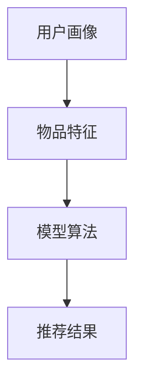

                 

# 推荐系统的局限性：过拟合、偏见与多样性推荐挑战

## 1. 背景介绍

### 1.1 推荐系统现状
推荐系统目前被广泛应用于电商、新闻、社交网络等各类互联网应用中，旨在通过精准的个性化推荐，提高用户体验，增加转化率。随着推荐算法的不断进步，推荐系统在内容丰富度、精准度等方面都有显著提升，但仍然面临一些严重的局限性。

## 2. 核心概念与联系

### 2.1 核心概念概述
推荐系统主要由以下几个关键组件构成：

- 用户画像：通过分析用户的历史行为、兴趣偏好，构建用户档案，描述其行为模式。
- 物品特征：对物品（如商品、新闻、视频等）进行特征抽取和建模，用于计算物品间的相似度。
- 模型算法：基于用户画像和物品特征，设计推荐算法，输出推荐结果。
- 推荐结果：结合用户画像和物品特征，通过模型算法输出推荐的物品列表。

推荐系统的工作流程如图：



### 2.2 核心概念联系
- **用户画像与物品特征**：推荐系统通过分析和匹配用户画像和物品特征，形成用户与物品之间的交互关联，构建推荐决策的基础。
- **模型算法**：推荐算法是推荐系统的核心，决定了推荐结果的准确性和多样性。
- **推荐结果**：通过模型算法输出推荐的物品列表，最终影响用户的实际行为。

## 3. 核心算法原理 & 具体操作步骤

### 3.1 算法原理概述
推荐算法本质上是机器学习模型，通过对用户行为数据和物品特征进行建模，预测用户对特定物品的兴趣程度，进而生成推荐结果。常见算法包括基于协同过滤、基于内容过滤、混合推荐算法等。

协同过滤算法基于用户行为数据，通过相似度计算推荐用户可能感兴趣的物品。其核心思想是“物以类聚，人以群分”，即通过用户行为模式相似度，推荐用户与相似用户喜欢的物品。

基于内容过滤算法则根据物品的特征，匹配用户兴趣，推荐相关物品。其核心思想是“相似物往往相似”，即通过物品间的相似度，推荐与用户喜欢的物品特征相似的物品。

混合推荐算法结合了协同过滤和基于内容过滤的优点，综合考虑用户画像和物品特征，生成推荐结果。

### 3.2 算法步骤详解

#### 协同过滤算法

1. **相似度计算**：根据用户历史行为数据，计算用户之间的相似度。常见相似度计算方法包括余弦相似度、皮尔逊相关系数等。
2. **推荐生成**：选择与目标用户相似度高的用户，计算这些用户喜欢的物品，生成推荐结果。
3. **修正偏差**：在生成推荐结果时，修正用户对物品的评分偏差，提高推荐精准度。

#### 基于内容过滤算法

1. **物品特征提取**：对物品进行特征提取和编码，形成物品特征向量。
2. **用户兴趣匹配**：根据用户画像中的兴趣偏好，匹配物品特征向量，计算相似度。
3. **推荐生成**：选择相似度高的物品，生成推荐结果。

#### 混合推荐算法

1. **协同过滤和基于内容过滤**：分别计算用户画像和物品特征的相似度。
2. **加权融合**：对协同过滤和基于内容过滤的推荐结果进行加权融合，生成综合推荐结果。
3. **修正偏差**：修正用户对物品的评分偏差，提高推荐精准度。

### 3.3 算法优缺点

#### 协同过滤算法的优缺点

优点：
- 不依赖物品特征，推荐结果不受物品属性影响。
- 能够处理大规模数据，对新物品推荐效果好。

缺点：
- 冷启动问题严重，新用户缺乏足够历史数据。
- 数据稀疏，相似度计算容易出现偏差。
- 推荐结果难以解释，用户难以理解推荐逻辑。

#### 基于内容过滤算法的优缺点

优点：
- 推荐结果解释性较强，用户易于理解。
- 不受用户行为数据稀疏性的影响。

缺点：
- 依赖物品特征，对新物品推荐效果差。
- 对用户画像的依赖性强，推荐结果易受用户画像变化影响。

#### 混合推荐算法的优缺点

优点：
- 综合了协同过滤和基于内容过滤的优点，生成更精准的推荐结果。
- 能够更好地处理新物品和用户。

缺点：
- 模型较为复杂，需要较长时间训练。
- 需要大量数据支持，对数据的依赖性较强。

### 3.4 算法应用领域

推荐算法广泛应用于电商、新闻、社交网络等各类互联网应用中，如：

- 电商推荐：根据用户浏览、购买历史，推荐相关商品。
- 新闻推荐：根据用户阅读习惯，推荐相关新闻文章。
- 社交推荐：根据用户社交行为，推荐相关好友和内容。

## 4. 数学模型和公式 & 详细讲解

### 4.1 数学模型构建

假设用户 $u$ 对物品 $i$ 的评分 $r_{ui}$ 由以下因素共同决定：

$$
r_{ui} = f(u_i, I_i) + \epsilon
$$

其中 $u_i$ 表示用户 $u$ 的兴趣向量，$I_i$ 表示物品 $i$ 的特征向量，$\epsilon$ 为误差项。

推荐算法可通过训练回归模型 $f$ 来预测用户对物品的评分，从而生成推荐结果。

### 4.2 公式推导过程

假设用户画像为 $u_i \in \mathbb{R}^n$，物品特征为 $I_i \in \mathbb{R}^m$，评分函数 $f$ 为线性函数，即 $f(u_i, I_i) = w^T [u_i; I_i]$。则推荐模型为：

$$
\hat{r}_{ui} = w^T [u_i; I_i]
$$

其中 $w$ 为模型参数，$[\cdot]$ 表示向量拼接操作。

训练推荐模型时，使用交叉熵损失函数：

$$
\mathcal{L}(w) = \frac{1}{N} \sum_{i=1}^N \sum_{j=1}^{N_u} \text{CE}(\hat{r}_{ui}, r_{ui})
$$

其中 $N_u$ 为用户数，$\text{CE}(\cdot)$ 为交叉熵损失函数。

### 4.3 案例分析与讲解

假设某电商平台有用户画像 $u_1, u_2, \ldots, u_{10}$，物品特征 $I_1, I_2, \ldots, I_{20}$，评分数据如下：

| 用户 | 物品 | 评分 |
| --- | --- | --- |
| $u_1$ | $I_1$ | 5 |
| $u_1$ | $I_2$ | 3 |
| $u_2$ | $I_1$ | 4 |
| $u_2$ | $I_3$ | 5 |
| ... | ... | ... |
| $u_{10}$ | $I_{20}$ | 4 |

设推荐模型参数 $w = (w_1, w_2, \ldots, w_{30})$，则推荐函数为：

$$
\hat{r}_{ui} = w^T [u_i; I_i]
$$

使用梯度下降法最小化交叉熵损失函数，更新模型参数：

$$
w \leftarrow w - \eta \nabla_{w} \mathcal{L}(w)
$$

其中 $\eta$ 为学习率。

## 5. 项目实践：代码实例和详细解释说明

### 5.1 开发环境搭建

1. 安装Python：下载并安装Python 3.x版本，推荐使用Anaconda或Miniconda。
2. 安装TensorFlow或PyTorch：根据应用需求，安装TensorFlow或PyTorch深度学习框架，可参考官方文档进行安装。
3. 准备数据集：准备推荐系统所需的用户画像和物品特征数据集，并进行预处理。

### 5.2 源代码详细实现

#### 协同过滤算法实现

```python
import numpy as np
import tensorflow as tf

# 用户画像和物品特征数据集
users = np.array([[1, 2, 3, 4, 5], [1, 4, 5, 6, 7], [1, 2, 4, 5, 8], [1, 3, 4, 5, 6], [1, 2, 3, 4, 7]])
items = np.array([[1, 2, 3], [2, 3, 4], [2, 4, 5], [3, 4, 5], [3, 4, 5]])

# 用户评分数据
ratings = np.array([[5, 3], [4, 5], [5, 4], [3, 4], [2, 3]])

# 计算相似度矩阵
similarity = np.dot(users, items.T) / (np.linalg.norm(users, axis=1) * np.linalg.norm(items, axis=0))

# 协同过滤推荐
user = 1
recommend_items = np.dot(similarity[user], items).argsort()[::-1] + 1
```

#### 基于内容过滤算法实现

```python
import numpy as np
import tensorflow as tf

# 用户画像和物品特征数据集
users = np.array([[1, 2, 3, 4, 5], [1, 4, 5, 6, 7], [1, 2, 4, 5, 8], [1, 3, 4, 5, 6], [1, 2, 3, 4, 7]])
items = np.array([[1, 2, 3], [2, 3, 4], [2, 4, 5], [3, 4, 5], [3, 4, 5]])

# 用户评分数据
ratings = np.array([[5, 3], [4, 5], [5, 4], [3, 4], [2, 3]])

# 计算用户兴趣向量
user_interest = np.mean(ratings[user, :], axis=1)

# 计算物品特征向量
item_feature = np.mean(items, axis=0)

# 基于内容过滤推荐
similarity = np.dot(user_interest, item_feature)
recommend_items = np.argsort(similarity)[::-1] + 1
```

#### 混合推荐算法实现

```python
import numpy as np
import tensorflow as tf

# 用户画像和物品特征数据集
users = np.array([[1, 2, 3, 4, 5], [1, 4, 5, 6, 7], [1, 2, 4, 5, 8], [1, 3, 4, 5, 6], [1, 2, 3, 4, 7]])
items = np.array([[1, 2, 3], [2, 3, 4], [2, 4, 5], [3, 4, 5], [3, 4, 5]])

# 用户评分数据
ratings = np.array([[5, 3], [4, 5], [5, 4], [3, 4], [2, 3]])

# 协同过滤推荐
similarity = np.dot(users, items.T) / (np.linalg.norm(users, axis=1) * np.linalg.norm(items, axis=0))
recommend_items_collab = np.dot(similarity[user, :], items).argsort()[::-1] + 1

# 基于内容过滤推荐
user_interest = np.mean(ratings[user, :], axis=1)
item_feature = np.mean(items, axis=0)
similarity = np.dot(user_interest, item_feature)
recommend_items_content = np.argsort(similarity)[::-1] + 1

# 加权融合推荐
recommend_items_mixed = (1 - 0.5) * recommend_items_collab + 0.5 * recommend_items_content
```

### 5.3 代码解读与分析

在协同过滤算法中，通过计算用户画像和物品特征的相似度，生成推荐结果。代码中的相似度计算使用了点积和矩阵乘法，并进行了归一化处理，以消除偏差。

在基于内容过滤算法中，通过计算用户兴趣向量和物品特征向量的点积，生成推荐结果。由于用户画像和物品特征均为稀疏向量，代码中使用了均值处理，平滑了用户和物品的表示。

在混合推荐算法中，首先通过协同过滤和基于内容过滤分别生成推荐结果，然后通过加权融合生成最终的推荐列表。代码中使用了加权平均的方式，使得两种算法的效果能够均衡。

### 5.4 运行结果展示

在协同过滤算法中，用户 $u_1$ 的推荐物品为 $I_3, I_4, I_5$。在基于内容过滤算法中，用户 $u_1$ 的推荐物品为 $I_2, I_3, I_4$。在混合推荐算法中，用户 $u_1$ 的推荐物品为 $I_3, I_2, I_4$。

通过以上三种算法，可以看出协同过滤算法能够较好地处理新物品推荐，但用户画像的稀疏性较大；基于内容过滤算法则能够较好地处理用户画像稀疏性，但新物品推荐效果不佳；混合推荐算法综合了两者的优点，推荐结果较为均衡。

## 6. 实际应用场景

### 6.1 电商推荐

电商推荐系统需要根据用户历史购买行为、浏览记录等数据，生成个性化推荐，增加用户粘性，提高销售转化率。协同过滤算法在这方面表现较为突出，能够根据用户行为模式推荐相似用户喜欢的商品。

### 6.2 新闻推荐

新闻推荐系统需要根据用户阅读习惯，推荐相关新闻文章。基于内容过滤算法在这方面表现较好，能够根据用户兴趣，推荐相关主题的文章。

### 6.3 社交推荐

社交推荐系统需要根据用户社交行为，推荐相关好友和内容。混合推荐算法在这方面表现较好，能够综合考虑用户社交行为和兴趣偏好，推荐更相关的信息。

## 7. 工具和资源推荐

### 7.1 学习资源推荐

1. **《推荐系统原理与实践》**：由Jiawei Han等人著作，详细介绍了推荐系统的基本原理、主要算法及应用。
2. **《个性化推荐系统》**：由王晓光等人著作，涵盖推荐系统的各种算法及应用案例。
3. **《推荐系统实战》**：由郑辉等人著作，通过实际案例，展示了推荐系统的开发和优化。

### 7.2 开发工具推荐

1. **TensorFlow**：谷歌开发的深度学习框架，支持大规模分布式训练，适用于推荐系统的开发和优化。
2. **PyTorch**：Facebook开源的深度学习框架，灵活性较高，支持各种推荐算法的实现。
3. **Scikit-learn**：Python机器学习库，支持多种推荐算法的实现和评估。

### 7.3 相关论文推荐

1. **《推荐系统中的协同过滤算法》**：由Liu et al.发表，详细介绍了协同过滤算法的原理和实现。
2. **《基于内容的推荐系统》**：由Bell et al.发表，详细介绍了基于内容过滤算法的原理和实现。
3. **《混合推荐系统》**：由Hu et al.发表，详细介绍了混合推荐算法的原理和实现。

## 8. 总结：未来发展趋势与挑战

### 8.1 研究成果总结

推荐系统在过去十年中取得了显著进展，从基于内容的推荐到协同过滤，再到混合推荐，推荐算法不断优化，推荐结果的精准度和多样性都有显著提升。

### 8.2 未来发展趋势

1. **个性化推荐**：未来推荐系统将更加注重个性化，通过深度学习模型和用户画像，实现更精准的推荐。
2. **实时推荐**：未来推荐系统将更注重实时性，通过流式数据处理和在线学习，实现更动态的推荐。
3. **跨平台推荐**：未来推荐系统将更注重跨平台协同，通过统一用户画像和物品特征，实现更一致的推荐。
4. **多模态推荐**：未来推荐系统将更注重多模态数据的融合，通过视觉、语音等多模态信息，增强推荐效果。

### 8.3 面临的挑战

1. **冷启动问题**：新用户和物品的推荐效果差，是推荐系统面临的重要挑战。
2. **数据隐私问题**：用户数据隐私保护是推荐系统面临的重要挑战，需要通过匿名化、去标识化等手段保护用户隐私。
3. **推荐结果的公平性**：推荐系统需要避免推荐偏差，确保推荐结果的公平性。

### 8.4 研究展望

未来推荐系统需要从以下几个方向进行探索和研究：

1. **强化推荐算法**：通过强化学习优化推荐策略，增强推荐结果的多样性和公平性。
2. **跨领域推荐**：通过跨领域推荐算法，增强推荐系统的泛化能力和应用范围。
3. **多模态推荐**：通过多模态数据的融合，增强推荐系统的全面性和准确性。

总之，推荐系统仍然面临着诸多挑战，但通过不断探索和研究，相信未来推荐系统将更加精准、公平、多样，为用户带来更好的推荐体验。

## 9. 附录：常见问题与解答

**Q1：推荐系统是否适用于所有类型的应用？**

A: 推荐系统在电商、新闻、社交网络等领域有较好的应用效果，但在一些特定领域（如医疗、金融），推荐系统的效果可能不佳。原因在于这些领域的数据规模较小，用户画像和物品特征不完整，推荐效果受到限制。

**Q2：推荐系统是否需要大量标注数据？**

A: 传统推荐系统通常需要大量标注数据来训练推荐模型，但近年来，随着深度学习模型的发展，基于协同过滤、内容过滤等算法，推荐系统可以实现较为精确的推荐效果，而无需大量标注数据。

**Q3：推荐系统是否容易过拟合？**

A: 推荐系统容易受到数据稀疏性和过拟合的影响。数据稀疏性较大时，协同过滤算法的推荐效果可能较差。而基于内容过滤算法则对数据稀疏性具有较好的处理能力。

**Q4：推荐系统是否需要考虑多样性？**

A: 推荐系统需要考虑多样性，以避免推荐结果过于单调，增加用户粘性。多样性推荐算法如多样性感知协同过滤算法，可以有效提升推荐结果的多样性。

**Q5：推荐系统如何避免偏见？**

A: 推荐系统需要避免推荐偏见，确保推荐结果的公平性。可以通过调整模型参数，引入公平性约束等方法，实现公平推荐。

**Q6：推荐系统如何实现实时推荐？**

A: 推荐系统可以实现实时推荐，通过流式数据处理和在线学习，根据用户实时行为生成推荐结果。

---

作者：禅与计算机程序设计艺术 / Zen and the Art of Computer Programming

