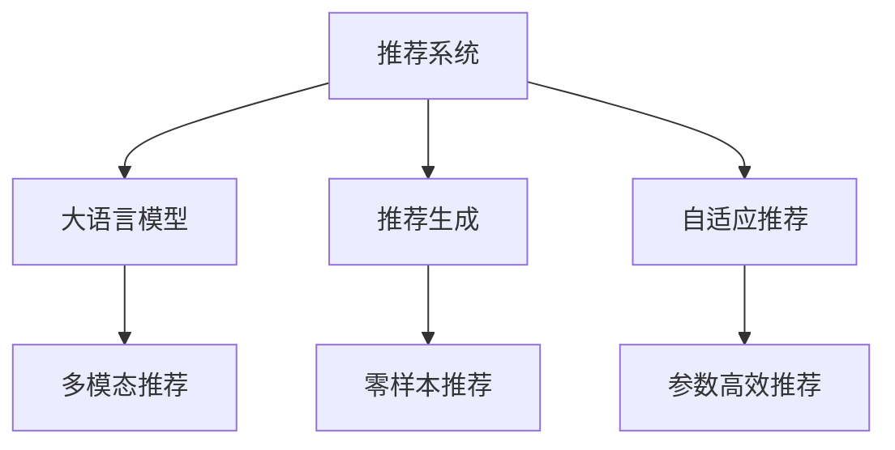

                 

# 推荐系统的未来发展趋势：大模型的主导作用

## 1. 背景介绍

### 1.1 问题由来

推荐系统（Recommendation System）作为互联网时代的核心技术之一，已经成为各大电商、视频、音乐、新闻等平台提升用户体验、驱动增长、获取收益的重要引擎。传统推荐系统基于协同过滤、内容过滤等机制，通过分析用户行为数据，挖掘用户兴趣，推荐个性化的物品。随着数据的爆炸性增长和算法的不断进步，推荐系统的效果显著提升，但面临的挑战也日益增多。

随着深度学习在NLP、计算机视觉等领域的成功应用，推荐系统的技术范式也正发生深刻变革。大语言模型（Large Language Model, LLM）作为一种强大的预训练技术，正在引领推荐系统的下一轮革新。本文将系统介绍大模型在推荐系统中的应用，并对未来发展趋势进行展望。

## 2. 核心概念与联系

### 2.1 核心概念概述

为更好地理解大语言模型在推荐系统中的应用，本节将介绍几个关键概念：

- 推荐系统（Recommendation System）：通过分析用户的历史行为数据，推荐用户可能感兴趣的物品的系统。常用的推荐算法包括协同过滤、内容过滤、混合推荐等。

- 大语言模型（Large Language Model）：以自回归（如GPT）或自编码（如BERT）模型为代表的大规模预训练语言模型。通过在海量无标签文本语料上进行预训练，学习到丰富的语言知识和常识，具备强大的语言理解和生成能力。

- 推荐生成（Recommendation Generation）：利用预训练大模型的语言生成能力，直接生成推荐结果的技术。通过训练模型，使其能理解推荐目标语义，生成自然、流畅、多样的推荐文本。

- 自适应推荐（Adaptive Recommendation）：根据用户输入的语言指令，动态调整推荐策略，提升推荐效果的技术。通过提示学习（Prompt-based Learning），引导模型生成符合用户期望的推荐结果。

- 零样本推荐（Zero-shot Recommendation）：仅通过任务描述，不依赖任何标注样本，直接生成推荐结果的技术。利用预训练大模型的广泛知识，实现高效、灵活的推荐。

- 参数高效推荐（Parameter-Efficient Recommendation）：仅更新模型中少量的参数，如基于 Adapter 的微调（Adapter-based Fine-Tuning），在不增加模型复杂度的情况下，提升推荐效果。

- 多模态推荐（Multi-modal Recommendation）：融合文本、图像、声音等多模态数据，提升推荐系统的泛化能力和用户体验。大模型具备处理多模态数据的能力，能更好地捕捉用户的全方位兴趣。

这些核心概念之间的逻辑关系可以通过以下Mermaid流程图来展示：



这个流程图展示了大语言模型在推荐系统中的核心概念及其之间的关系：

1. 推荐系统通过收集用户行为数据，利用大语言模型进行推荐生成。
2. 大模型具备自适应推荐能力，通过提示学习动态调整推荐策略。
3. 零样本推荐利用大模型的广泛知识，无需标注样本即可生成推荐。
4. 参数高效推荐通过微调模型，减少计算资源消耗。
5. 多模态推荐融合多源数据，提升推荐系统的能力。

这些概念共同构成了大语言模型在推荐系统中的应用框架，使其能够更好地理解和生成推荐结果。

## 3. 核心算法原理 & 具体操作步骤

### 3.1 算法原理概述

基于大语言模型的推荐系统，本质上是一种利用预训练语言模型的推荐生成方法。其核心思想是：将大语言模型作为推荐生成器，通过用户行为数据对其进行训练，使其能够理解推荐语义，生成符合用户期望的推荐结果。

形式化地，假设用户历史行为数据为 $D=\{(x_i, y_i)\}_{i=1}^N$，其中 $x_i$ 为用户行为序列，$y_i$ 为推荐结果。假设大语言模型为 $M_{\theta}$，则推荐系统的一般流程为：

1. 数据预处理：将用户行为序列转换为模型输入格式，如文本、序列等。
2. 模型训练：在用户行为数据上训练大语言模型，学习推荐语义。
3. 推荐生成：将用户输入作为语言模板，利用大模型生成推荐结果。
4. 反馈优化：根据用户反馈，进一步调整推荐模型，提升推荐效果。

### 3.2 算法步骤详解

基于大语言模型的推荐系统主要包括以下关键步骤：

**Step 1: 准备数据和模型**

- 收集用户历史行为数据 $D=\{(x_i, y_i)\}_{i=1}^N$，其中 $x_i$ 为行为序列，$y_i$ 为推荐结果。
- 选择预训练大语言模型 $M_{\theta}$，如GPT、BERT等。
- 准备数据预处理脚本，将用户行为序列转换为模型输入格式。

**Step 2: 训练推荐模型**

- 将用户行为数据 $D$ 划分为训练集、验证集和测试集。
- 设计推荐语义损失函数，如交叉熵损失、均方误差损失等。
- 使用推荐数据训练大语言模型，优化损失函数。
- 在验证集上评估模型效果，防止过拟合。

**Step 3: 生成推荐结果**

- 接收用户输入 $u$，将其作为推荐生成器的输入。
- 将用户输入和模型参数 $M_{\theta}$ 传递给推荐生成器，输出推荐结果。
- 根据推荐结果进行后续排序和展示。

**Step 4: 反馈优化**

- 收集用户对推荐结果的反馈 $f$。
- 将反馈 $f$ 作为新训练样本，重新训练推荐模型。
- 循环迭代，不断提升推荐效果。

以上是基于大语言模型的推荐系统的一般流程。在实际应用中，还需要针对具体任务的特点，对推荐过程的各个环节进行优化设计，如改进推荐语义损失函数，引入更多正则化技术，搜索最优的超参数组合等，以进一步提升模型性能。

### 3.3 算法优缺点

基于大语言模型的推荐系统具有以下优点：

1. 灵活高效。利用大语言模型的语言生成能力，可以直接生成推荐结果，无需额外训练推荐策略模型。
2. 泛化能力强。大模型的广泛知识背景，使其能够理解推荐语义，生成多样化的推荐内容。
3. 实时性强。利用大语言模型的实时生成能力，可以在用户输入后即时生成推荐，提升用户体验。
4. 效果显著。在学术界和工业界的诸多任务上，基于大语言模型的推荐系统已经刷新了最先进的性能指标。

同时，该方法也存在一定的局限性：

1. 数据需求高。推荐系统需要大量标注数据进行训练，大模型的训练成本较高。
2. 冷启动问题。新用户或新物品没有历史行为数据，难以进行推荐。
3. 语义理解的局限。大模型生成的推荐结果可能存在不符合用户期望的情况。
4. 推荐质量依赖于输入文本。输入文本格式不当可能导致推荐结果质量下降。
5. 计算资源消耗大。大模型的计算资源消耗较大，实时生成推荐可能需要高性能设备。

尽管存在这些局限性，但就目前而言，基于大语言模型的推荐系统仍是最主流范式。未来相关研究的重点在于如何进一步降低数据需求，提升模型的泛化能力，同时兼顾可解释性和鲁棒性等因素。

### 3.4 算法应用领域

基于大语言模型的推荐系统已经在多个领域得到了广泛的应用，例如：

- 电商推荐：根据用户浏览、点击、购买行为，推荐可能感兴趣的商品。
- 视频推荐：根据用户观看历史和评分，推荐相关视频内容。
- 音乐推荐：根据用户听歌历史和喜好，推荐音乐作品。
- 新闻推荐：根据用户阅读历史和互动行为，推荐新闻内容。

除了上述这些经典应用外，大语言模型推荐还广泛应用于智能家居、智能健康、智能客服等领域，为各行各业提供精准、高效的推荐服务。

## 4. 数学模型和公式 & 详细讲解 & 举例说明

### 4.1 数学模型构建

本节将使用数学语言对基于大语言模型的推荐系统进行更加严格的刻画。

记用户历史行为数据为 $D=\{(x_i, y_i)\}_{i=1}^N$，其中 $x_i \in \mathcal{X}$，$y_i \in \mathcal{Y}$。假设大语言模型为 $M_{\theta}:\mathcal{X} \rightarrow \mathcal{Y}$，其中 $\theta$ 为模型参数。

定义推荐语义损失函数为 $\ell(M_{\theta}(x_i),y_i)$，则在数据集 $D$ 上的经验风险为：

$$
\mathcal{L}(\theta) = \frac{1}{N} \sum_{i=1}^N \ell(M_{\theta}(x_i),y_i)
$$

推荐系统的优化目标是最小化经验风险，即找到最优参数：

$$
\theta^* = \mathop{\arg\min}_{\theta} \mathcal{L}(\theta)
$$

在实践中，我们通常使用基于梯度的优化算法（如SGD、Adam等）来近似求解上述最优化问题。设 $\eta$ 为学习率，$\lambda$ 为正则化系数，则参数的更新公式为：

$$
\theta \leftarrow \theta - \eta \nabla_{\theta}\mathcal{L}(\theta) - \eta\lambda\theta
$$

其中 $\nabla_{\theta}\mathcal{L}(\theta)$ 为损失函数对参数 $\theta$ 的梯度，可通过反向传播算法高效计算。

### 4.2 公式推导过程

以下我们以电商推荐为例，推导推荐语义损失函数及其梯度的计算公式。

假设用户历史行为数据 $D=\{(x_i, y_i)\}_{i=1}^N$，其中 $x_i$ 为用户行为序列，$y_i$ 为用户对物品的评分。大语言模型 $M_{\theta}$ 在行为序列 $x_i$ 上的输出为 $\hat{y}_i=M_{\theta}(x_i)$，表示模型预测的用户评分。真实标签 $y_i$ 为用户的实际评分。则推荐语义损失函数定义为：

$$
\ell(M_{\theta}(x_i),y_i) = (y_i-\hat{y}_i)^2
$$

将其代入经验风险公式，得：

$$
\mathcal{L}(\theta) = \frac{1}{N} \sum_{i=1}^N (y_i-\hat{y}_i)^2
$$

根据链式法则，损失函数对参数 $\theta_k$ 的梯度为：

$$
\frac{\partial \mathcal{L}(\theta)}{\partial \theta_k} = -2\sum_{i=1}^N \frac{\partial \hat{y}_i}{\partial \theta_k} (y_i-\hat{y}_i)
$$

其中 $\frac{\partial \hat{y}_i}{\partial \theta_k}$ 可进一步递归展开，利用自动微分技术完成计算。

在得到损失函数的梯度后，即可带入参数更新公式，完成模型的迭代优化。重复上述过程直至收敛，最终得到适应电商推荐任务的最优模型参数 $\theta^*$。

## 5. 项目实践：代码实例和详细解释说明

### 5.1 开发环境搭建

在进行推荐系统开发前，我们需要准备好开发环境。以下是使用Python进行PyTorch开发的环境配置流程：

1. 安装Anaconda：从官网下载并安装Anaconda，用于创建独立的Python环境。

2. 创建并激活虚拟环境：
```bash
conda create -n pytorch-env python=3.8 
conda activate pytorch-env
```

3. 安装PyTorch：根据CUDA版本，从官网获取对应的安装命令。例如：
```bash
conda install pytorch torchvision torchaudio cudatoolkit=11.1 -c pytorch -c conda-forge
```

4. 安装Transformers库：
```bash
pip install transformers
```

5. 安装各类工具包：
```bash
pip install numpy pandas scikit-learn matplotlib tqdm jupyter notebook ipython
```

完成上述步骤后，即可在`pytorch-env`环境中开始推荐系统实践。

### 5.2 源代码详细实现

下面我们以电商推荐任务为例，给出使用Transformers库对BERT模型进行推荐训练的PyTorch代码实现。

首先，定义电商推荐任务的数据处理函数：

```python
from transformers import BertTokenizer
from torch.utils.data import Dataset
import torch

class RetailDataset(Dataset):
    def __init__(self, texts, labels, tokenizer, max_len=128):
        self.texts = texts
        self.labels = labels
        self.tokenizer = tokenizer
        self.max_len = max_len
        
    def __len__(self):
        return len(self.texts)
    
    def __getitem__(self, item):
        text = self.texts[item]
        label = self.labels[item]
        
        encoding = self.tokenizer(text, return_tensors='pt', max_length=self.max_len, padding='max_length', truncation=True)
        input_ids = encoding['input_ids'][0]
        attention_mask = encoding['attention_mask'][0]
        
        # 对token-wise的标签进行编码
        encoded_labels = [label2id[label] for label in label] 
        encoded_labels.extend([label2id['O']] * (self.max_len - len(encoded_labels)))
        labels = torch.tensor(encoded_labels, dtype=torch.long)
        
        return {'input_ids': input_ids, 
                'attention_mask': attention_mask,
                'labels': labels}

# 标签与id的映射
label2id = {'O': 0, '5': 1, '4': 2, '3': 3, '2': 4, '1': 5}
id2label = {v: k for k, v in label2id.items()}

# 创建dataset
tokenizer = BertTokenizer.from_pretrained('bert-base-cased')

train_dataset = RetailDataset(train_texts, train_labels, tokenizer)
dev_dataset = RetailDataset(dev_texts, dev_labels, tokenizer)
test_dataset = RetailDataset(test_texts, test_labels, tokenizer)
```

然后，定义模型和优化器：

```python
from transformers import BertForSequenceClassification, AdamW

model = BertForSequenceClassification.from_pretrained('bert-base-cased', num_labels=len(label2id))

optimizer = AdamW(model.parameters(), lr=2e-5)
```

接着，定义训练和评估函数：

```python
from torch.utils.data import DataLoader
from tqdm import tqdm
from sklearn.metrics import accuracy_score

device = torch.device('cuda') if torch.cuda.is_available() else torch.device('cpu')
model.to(device)

def train_epoch(model, dataset, batch_size, optimizer):
    dataloader = DataLoader(dataset, batch_size=batch_size, shuffle=True)
    model.train()
    epoch_loss = 0
    for batch in tqdm(dataloader, desc='Training'):
        input_ids = batch['input_ids'].to(device)
        attention_mask = batch['attention_mask'].to(device)
        labels = batch['labels'].to(device)
        model.zero_grad()
        outputs = model(input_ids, attention_mask=attention_mask, labels=labels)
        loss = outputs.loss
        epoch_loss += loss.item()
        loss.backward()
        optimizer.step()
    return epoch_loss / len(dataloader)

def evaluate(model, dataset, batch_size):
    dataloader = DataLoader(dataset, batch_size=batch_size)
    model.eval()
    preds, labels = [], []
    with torch.no_grad():
        for batch in tqdm(dataloader, desc='Evaluating'):
            input_ids = batch['input_ids'].to(device)
            attention_mask = batch['attention_mask'].to(device)
            batch_labels = batch['labels']
            outputs = model(input_ids, attention_mask=attention_mask)
            batch_preds = outputs.logits.argmax(dim=2).to('cpu').tolist()
            batch_labels = batch_labels.to('cpu').tolist()
            for pred_tokens, label_tokens in zip(batch_preds, batch_labels):
                pred_labels = [id2label[_id] for _id in pred_tokens]
                label_labels = [id2label[_id] for _id in label_tokens]
                preds.append(pred_labels[:len(label_labels)])
                labels.append(label_labels)
                
    print(accuracy_score(labels, preds))
```

最后，启动训练流程并在测试集上评估：

```python
epochs = 5
batch_size = 16

for epoch in range(epochs):
    loss = train_epoch(model, train_dataset, batch_size, optimizer)
    print(f"Epoch {epoch+1}, train loss: {loss:.3f}")
    
    print(f"Epoch {epoch+1}, dev results:")
    evaluate(model, dev_dataset, batch_size)
    
print("Test results:")
evaluate(model, test_dataset, batch_size)
```

以上就是使用PyTorch对BERT进行电商推荐任务训练的完整代码实现。可以看到，得益于Transformers库的强大封装，我们可以用相对简洁的代码完成BERT模型的加载和微调。

### 5.3 代码解读与分析

让我们再详细解读一下关键代码的实现细节：

**RetailDataset类**：
- `__init__`方法：初始化文本、标签、分词器等关键组件。
- `__len__`方法：返回数据集的样本数量。
- `__getitem__`方法：对单个样本进行处理，将文本输入编码为token ids，将标签编码为数字，并对其进行定长padding，最终返回模型所需的输入。

**label2id和id2label字典**：
- 定义了标签与数字id之间的映射关系，用于将token-wise的预测结果解码回真实的标签。

**训练和评估函数**：
- 使用PyTorch的DataLoader对数据集进行批次化加载，供模型训练和推理使用。
- 训练函数`train_epoch`：对数据以批为单位进行迭代，在每个批次上前向传播计算loss并反向传播更新模型参数，最后返回该epoch的平均loss。
- 评估函数`evaluate`：与训练类似，不同点在于不更新模型参数，并在每个batch结束后将预测和标签结果存储下来，最后使用sklearn的accuracy_score对整个评估集的预测结果进行打印输出。

**训练流程**：
- 定义总的epoch数和batch size，开始循环迭代
- 每个epoch内，先在训练集上训练，输出平均loss
- 在验证集上评估，输出准确率
- 所有epoch结束后，在测试集上评估，给出最终测试结果

可以看到，PyTorch配合Transformers库使得BERT微调的代码实现变得简洁高效。开发者可以将更多精力放在数据处理、模型改进等高层逻辑上，而不必过多关注底层的实现细节。

当然，工业级的系统实现还需考虑更多因素，如模型的保存和部署、超参数的自动搜索、更灵活的任务适配层等。但核心的微调范式基本与此类似。

## 6. 实际应用场景

### 6.1 智能客服系统

基于大语言模型推荐系统的智能客服系统，可以显著提升客户服务效率和体验。传统的客服系统往往依赖人工，高峰期响应缓慢，且服务质量不稳定。而使用推荐系统，能够根据用户的历史交互记录，动态生成个性化的回复，提升系统智能性和响应速度。

在技术实现上，可以收集历史客服对话记录，将常见问题及回复构建成监督数据，在此基础上对预训练语言模型进行推荐生成训练。训练后的模型能够自动理解用户意图，匹配最合适的答案模板进行回复。对于用户提出的新问题，还可以接入检索系统实时搜索相关内容，动态组织生成回答。如此构建的智能客服系统，能大幅提升客户咨询体验和问题解决效率。

### 6.2 金融舆情监测

金融机构需要实时监测市场舆情动向，以便及时应对负面信息传播，规避金融风险。传统的人工监测方式成本高、效率低，难以应对网络时代海量信息爆发的挑战。基于大语言模型的推荐生成系统，能够自动化处理海量舆情文本，快速识别市场变化，降低人工成本，提高监测效率。

具体而言，可以收集金融领域相关的新闻、报道、评论等文本数据，并对其进行情感标注。在此基础上对预训练语言模型进行微调，使其能够自动判断文本的情感倾向，快速识别市场舆情的变化趋势，及时预警风险，帮助金融机构快速应对潜在风险。

### 6.3 个性化推荐系统

当前的推荐系统往往只依赖用户的历史行为数据进行物品推荐，无法深入理解用户的真实兴趣偏好。基于大语言模型推荐生成技术，推荐系统能够更好地挖掘用户行为背后的语义信息，从而提供更精准、多样的推荐内容。

在实践中，可以收集用户浏览、点击、评论、分享等行为数据，提取和用户交互的物品标题、描述、标签等文本内容。将文本内容作为模型输入，用户的后续行为（如是否点击、购买等）作为监督信号，在此基础上微调预训练语言模型。微调后的模型能够从文本内容中准确把握用户的兴趣点。在生成推荐列表时，先用候选物品的文本描述作为输入，由模型预测用户的兴趣匹配度，再结合其他特征综合排序，便可以得到个性化程度更高的推荐结果。

### 6.4 未来应用展望

随着大语言模型推荐生成技术的发展，基于微调范式将在更多领域得到应用，为传统行业带来变革性影响。

在智慧医疗领域，基于大语言模型推荐生成技术的医疗问答、病历分析、药物研发等应用将提升医疗服务的智能化水平，辅助医生诊疗，加速新药开发进程。

在智能教育领域，推荐生成技术可应用于作业批改、学情分析、知识推荐等方面，因材施教，促进教育公平，提高教学质量。

在智慧城市治理中，推荐生成系统可应用于城市事件监测、舆情分析、应急指挥等环节，提高城市管理的自动化和智能化水平，构建更安全、高效的未来城市。

此外，在企业生产、社会治理、文娱传媒等众多领域，基于大语言模型的推荐生成系统也将不断涌现，为经济社会发展注入新的动力。相信随着技术的日益成熟，推荐生成方法将成为人工智能落地应用的重要范式，推动人工智能技术在垂直行业的规模化落地。

## 7. 工具和资源推荐

### 7.1 学习资源推荐

为了帮助开发者系统掌握大语言模型推荐生成技术的理论基础和实践技巧，这里推荐一些优质的学习资源：

1. 《Transformer从原理到实践》系列博文：由大模型技术专家撰写，深入浅出地介绍了Transformer原理、BERT模型、推荐生成技术等前沿话题。

2. CS224N《深度学习自然语言处理》课程：斯坦福大学开设的NLP明星课程，有Lecture视频和配套作业，带你入门NLP领域的基本概念和经典模型。

3. 《Natural Language Processing with Transformers》书籍：Transformers库的作者所著，全面介绍了如何使用Transformers库进行NLP任务开发，包括推荐生成在内的诸多范式。

4. HuggingFace官方文档：Transformers库的官方文档，提供了海量预训练模型和完整的推荐生成样例代码，是上手实践的必备资料。

5. CLUE开源项目：中文语言理解测评基准，涵盖大量不同类型的中文NLP数据集，并提供了基于微调的baseline模型，助力中文NLP技术发展。

通过对这些资源的学习实践，相信你一定能够快速掌握大语言模型推荐生成的精髓，并用于解决实际的NLP问题。
###  7.2 开发工具推荐

高效的开发离不开优秀的工具支持。以下是几款用于大语言模型推荐生成开发的常用工具：

1. PyTorch：基于Python的开源深度学习框架，灵活动态的计算图，适合快速迭代研究。大部分预训练语言模型都有PyTorch版本的实现。

2. TensorFlow：由Google主导开发的开源深度学习框架，生产部署方便，适合大规模工程应用。同样有丰富的预训练语言模型资源。

3. Transformers库：HuggingFace开发的NLP工具库，集成了众多SOTA语言模型，支持PyTorch和TensorFlow，是进行推荐生成任务开发的利器。

4. Weights & Biases：模型训练的实验跟踪工具，可以记录和可视化模型训练过程中的各项指标，方便对比和调优。与主流深度学习框架无缝集成。

5. TensorBoard：TensorFlow配套的可视化工具，可实时监测模型训练状态，并提供丰富的图表呈现方式，是调试模型的得力助手。

6. Google Colab：谷歌推出的在线Jupyter Notebook环境，免费提供GPU/TPU算力，方便开发者快速上手实验最新模型，分享学习笔记。

合理利用这些工具，可以显著提升大语言模型推荐生成的开发效率，加快创新迭代的步伐。

### 7.3 相关论文推荐

大语言模型推荐生成技术的发展源于学界的持续研究。以下是几篇奠基性的相关论文，推荐阅读：

1. Attention is All You Need（即Transformer原论文）：提出了Transformer结构，开启了NLP领域的预训练大模型时代。

2. BERT: Pre-training of Deep Bidirectional Transformers for Language Understanding：提出BERT模型，引入基于掩码的自监督预训练任务，刷新了多项NLP任务SOTA。

3. Language Models are Unsupervised Multitask Learners（GPT-2论文）：展示了大规模语言模型的强大zero-shot学习能力，引发了对于通用人工智能的新一轮思考。

4. Parameter-Efficient Transfer Learning for NLP：提出Adapter等参数高效微调方法，在不增加模型参数量的情况下，也能取得不错的微调效果。

5. Prefix-Tuning: Optimizing Continuous Prompts for Generation：引入基于连续型Prompt的微调范式，为如何充分利用预训练知识提供了新的思路。

6. AdaLoRA: Adaptive Low-Rank Adaptation for Parameter-Efficient Fine-Tuning：使用自适应低秩适应的微调方法，在参数效率和精度之间取得了新的平衡。

这些论文代表了大语言模型推荐生成技术的发展脉络。通过学习这些前沿成果，可以帮助研究者把握学科前进方向，激发更多的创新灵感。

## 8. 总结：未来发展趋势与挑战

### 8.1 总结

本文对基于大语言模型的推荐生成方法进行了全面系统的介绍。首先阐述了大语言模型和推荐生成技术的研究背景和意义，明确了推荐生成在拓展预训练模型应用、提升推荐效果方面的独特价值。其次，从原理到实践，详细讲解了推荐生成数学原理和关键步骤，给出了推荐生成任务开发的完整代码实例。同时，本文还广泛探讨了推荐生成方法在智能客服、金融舆情、个性化推荐等多个领域的应用前景，展示了推荐生成范式的巨大潜力。此外，本文精选了推荐生成技术的各类学习资源，力求为读者提供全方位的技术指引。

通过本文的系统梳理，可以看到，基于大语言模型的推荐生成方法正在成为NLP领域的重要范式，极大地拓展了预训练语言模型的应用边界，催生了更多的落地场景。受益于大规模语料的预训练，推荐生成模型以更低的时间和标注成本，在小样本条件下也能取得不俗的效果，有力推动了NLP技术的产业化进程。未来，伴随预训练语言模型和推荐生成方法的持续演进，相信NLP技术将在更广阔的应用领域大放异彩，深刻影响人类的生产生活方式。

### 8.2 未来发展趋势

展望未来，大语言模型推荐生成技术将呈现以下几个发展趋势：

1. 模型规模持续增大。随着算力成本的下降和数据规模的扩张，预训练语言模型的参数量还将持续增长。超大规模语言模型蕴含的丰富语言知识，有望支撑更加复杂多变的推荐生成。

2. 推荐生成方法日趋多样。除了传统的推荐生成外，未来会涌现更多推荐生成方法，如基于Prompt的推荐生成、基于对抗训练的推荐生成等，在保持推荐效果的同时，减少计算资源消耗。

3. 持续学习成为常态。随着数据分布的不断变化，推荐生成模型也需要持续学习新知识以保持性能。如何在不遗忘原有知识的同时，高效吸收新样本信息，将成为重要的研究课题。

4. 标注样本需求降低。受启发于提示学习(Prompt-based Learning)的思路，未来的推荐生成方法将更好地利用大模型的语言理解能力，通过更加巧妙的任务描述，在更少的标注样本上也能实现理想的推荐生成。

5. 推荐质量依赖于输入文本。输入文本格式不当可能导致推荐结果质量下降。未来推荐生成技术将进一步优化输入文本处理方式，提升推荐效果。

6. 计算资源消耗大。大模型的计算资源消耗较大，实时生成推荐可能需要高性能设备。如何在保证性能的同时，简化模型结构，提升推理速度，优化资源占用，将是重要的优化方向。

尽管存在这些局限性，但就目前而言，基于大语言模型的推荐生成技术仍是最主流范式。未来相关研究的重点在于如何进一步降低数据需求，提升模型的泛化能力，同时兼顾可解释性和鲁棒性等因素。

### 8.3 面临的挑战

尽管大语言模型推荐生成技术已经取得了瞩目成就，但在迈向更加智能化、普适化应用的过程中，它仍面临着诸多挑战：

1. 标注成本瓶颈。虽然推荐生成算法减少了标注需求，但对于长尾应用场景，难以获得充足的高质量标注数据，成为制约推荐生成性能的瓶颈。如何进一步降低推荐生成对标注样本的依赖，将是一大难题。

2. 推荐质量不稳定。推荐生成模型的输出质量受输入文本的影响较大，输入不当可能导致推荐结果质量波动。如何优化输入文本处理方式，提升推荐质量，将是重要的研究方向。

3. 计算资源消耗高。大模型的计算资源消耗较大，实时生成推荐可能需要高性能设备。如何在保证性能的同时，简化模型结构，提升推理速度，优化资源占用，将是重要的优化方向。

4. 推荐生成过程复杂。推荐生成过程涉及多个模型模块的协同工作，可能存在兼容性和数据流动的问题。如何优化模型结构，提高推荐生成的稳定性和效率，将是重要的研究课题。

5. 推荐生成结果可解释性不足。推荐生成模型通常缺乏可解释性，难以对其推荐逻辑进行分析和调试。如何赋予推荐生成模型更强的可解释性，将是亟待攻克的难题。

6. 推荐系统偏见问题。推荐生成模型可能学习到有害的偏见和歧视信息，传递到用户，导致推荐结果不公正、不安全。如何从数据和算法层面消除模型偏见，避免恶意用途，确保推荐系统的公平性，也将是重要的研究课题。

正视推荐生成面临的这些挑战，积极应对并寻求突破，将是大语言模型推荐生成技术走向成熟的必由之路。相信随着学界和产业界的共同努力，这些挑战终将一一被克服，大语言模型推荐生成必将在构建人机协同的智能系统中扮演越来越重要的角色。

### 8.4 未来突破

面对大语言模型推荐生成所面临的种种挑战，未来的研究需要在以下几个方面寻求新的突破：

1. 探索无监督和半监督推荐生成方法。摆脱对大规模标注数据的依赖，利用自监督学习、主动学习等无监督和半监督范式，最大限度利用非结构化数据，实现更加灵活高效的推荐生成。

2. 研究参数高效和计算高效的推荐生成范式。开发更加参数高效的推荐生成方法，在固定大部分预训练参数的同时，只更新极少量的任务相关参数。同时优化推荐生成模型的计算图，减少前向传播和反向传播的资源消耗，实现更加轻量级、实时性的部署。

3. 融合因果和对比学习范式。通过引入因果推断和对比学习思想，增强推荐生成模型建立稳定因果关系的能力，学习更加普适、鲁棒的语言表征，从而提升推荐泛化性和抗干扰能力。

4. 引入更多先验知识。将符号化的先验知识，如知识图谱、逻辑规则等，与神经网络模型进行巧妙融合，引导推荐生成过程学习更准确、合理的语言模型。同时加强不同模态数据的整合，实现视觉、语音等多模态信息与文本信息的协同建模。

5. 结合因果分析和博弈论工具。将因果分析方法引入推荐生成模型，识别出模型决策的关键特征，增强推荐生成的因果性和逻辑性。借助博弈论工具刻画人机交互过程，主动探索并规避模型的脆弱点，提高系统稳定性。

6. 纳入伦理道德约束。在推荐生成目标中引入伦理导向的评估指标，过滤和惩罚有害的推荐结果。同时加强人工干预和审核，建立推荐系统的监管机制，确保推荐结果符合人类价值观和伦理道德。

这些研究方向的探索，必将引领大语言模型推荐生成技术迈向更高的台阶，为构建安全、可靠、可解释、可控的智能系统铺平道路。面向未来，大语言模型推荐生成技术还需要与其他人工智能技术进行更深入的融合，如知识表示、因果推理、强化学习等，多路径协同发力，共同推动自然语言理解和智能交互系统的进步。只有勇于创新、敢于突破，才能不断拓展语言模型的边界，让智能技术更好地造福人类社会。

## 9. 附录：常见问题与解答

**Q1：大语言模型推荐生成是否适用于所有NLP任务？**

A: 大语言模型推荐生成在大多数NLP任务上都能取得不错的效果，特别是对于数据量较小的任务。但对于一些特定领域的任务，如医学、法律等，仅仅依靠通用语料预训练的模型可能难以很好地适应。此时需要在特定领域语料上进一步预训练，再进行推荐生成。此外，对于一些需要时效性、个性化很强的任务，如对话、推荐等，推荐生成方法也需要针对性的改进优化。

**Q2：推荐生成过程中如何选择合适的损失函数？**

A: 推荐生成的损失函数一般选择交叉熵损失、均方误差损失等。不同的任务和目标可能适合不同的损失函数，需要根据具体任务选择。同时，也可以引入正则化项，如L2正则、Dropout等，防止模型过拟合。

**Q3：推荐生成过程中如何优化输入文本处理？**

A: 输入文本处理是推荐生成的重要环节。常见的优化方式包括：
1. 回译扩充：将输入文本进行回译，扩充训练样本，提升模型泛化能力。
2. 格式规范：使用统一的格式规范，提升模型对不同输入格式的鲁棒性。
3. 多义词消歧：利用上下文信息，解决多义词问题，提高推荐生成质量。
4. 字符嵌入：使用字符级别的嵌入技术，提升模型对输入文本的细节理解。

这些方法往往需要根据具体任务进行灵活组合，以优化推荐生成效果。

**Q4：推荐生成结果可解释性不足，如何改善？**

A: 推荐生成模型的可解释性不足是常见的挑战。为了改善这一问题，可以：
1. 引入可解释性模型，如LIME、SHAP等，解释推荐结果的生成过程。
2. 增加模型输出细节，如推荐理由、参考内容等，提升用户理解。
3. 设计可解释的推荐生成范式，如基于逻辑规则的推荐生成。
4. 采用可视化工具，如TensorBoard、Weights & Biases等，监控模型行为，优化推荐生成。

通过这些方法，可以增强推荐生成模型的可解释性，提升用户信任度。

**Q5：推荐生成系统的冷启动问题如何解决？**

A: 推荐生成系统的冷启动问题是指新用户或新物品没有历史行为数据，难以进行推荐。解决冷启动问题的方法包括：
1. 使用全模型推荐：利用大语言模型的多模态处理能力，对新物品进行基于内容的推荐。
2. 数据增强：通过数据扩充技术，生成虚拟推荐样本，提升模型的泛化能力。
3. 转移学习：利用其他领域的大模型进行迁移学习，提升模型的初始化水平。
4. 专家推荐：引入人工推荐，补充新物品的推荐结果。

这些方法需要根据具体任务和场景进行选择，以优化推荐生成系统的表现。

---

作者：禅与计算机程序设计艺术 / Zen and the Art of Computer Programming

