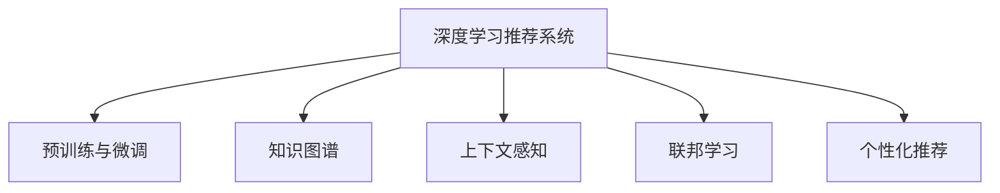

                 

# 推荐系统的未来：大模型的主导作用与创新

> 关键词：推荐系统,大模型,预训练,微调,强化学习,知识图谱,交互模型,上下文感知,联邦学习,个性化推荐

## 1. 背景介绍

推荐系统是互联网时代信息获取的重要工具，帮助用户在海量信息中发现感兴趣的内容，极大地提升了用户体验和数据利用效率。传统推荐系统依赖手工设计的特征工程、协同过滤等算法，在处理大规模、高维数据时，性能难以保证，计算复杂度高，且对特定数据域和业务场景的泛化能力有限。

近年来，随着深度学习技术的发展，尤其是大语言模型和深度神经网络在推荐领域的应用，推荐系统逐步从手工工程向自动化、智能化方向迈进。基于深度学习和大模型的推荐系统，不仅能够自动学习输入数据的高级表示，而且可以更高效地提取数据特征，捕捉数据间的关系，实现个性化推荐。

但面对数据量的爆炸性增长、用户行为的多样性和不确定性、用户偏好动态变化等挑战，传统深度学习模型难以充分挖掘用户背后的深层次意图和隐性偏好，难以建立稳定的、多维度动态关联，难以进行实时化、泛在化的智能推荐。为此，研究者提出了大模型、微调、强化学习、知识图谱等多维协同的智能化推荐技术，以期大幅提升推荐系统的效果。

## 2. 核心概念与联系

### 2.1 核心概念概述

为了更系统地理解深度学习和大模型在推荐系统中的应用，本节将介绍几个关键概念，包括深度学习推荐系统、预训练与微调、知识图谱等。

- 深度学习推荐系统：基于神经网络的推荐系统，使用自动学习的高维特征表示，从用户行为数据中学习用户-物品的交互关系，进行推荐预测。

- 预训练与微调：利用大规模无标签数据对深度学习模型进行预训练，然后利用有标签的推荐数据对模型进行微调，使其适应特定的推荐任务。

- 知识图谱：一种结构化的语义知识表示形式，描述实体之间的关系，用于构建多维度的信息关联网络。

- 上下文感知：推荐模型根据用户上下文信息（如位置、时间、情境等）来调整推荐策略，实现更具个性化、动态化的推荐。

- 联邦学习：一种分布式机器学习方法，参与方在本地模型更新后，将模型参数聚合到中央服务器，实现全局模型的更新，避免数据传输和隐私泄漏。

- 个性化推荐：根据用户历史行为、兴趣偏好和实时反馈，生成针对性强的推荐内容，提升用户满意度。

这些概念之间存在着紧密的联系，构成了推荐系统的核心框架：

1. 深度学习推荐系统使用预训练与微调技术，自动学习高维特征，捕捉用户与物品间的复杂关系。
2. 知识图谱为推荐模型提供多维度信息关联，增强了模型的上下文感知能力。
3. 上下文感知技术使得推荐模型能够根据实时数据动态调整推荐策略，提升推荐效果。
4. 联邦学习技术实现分布式协作训练，解决数据隐私和安全问题。
5. 个性化推荐技术根据用户个性化需求，生成更加精准的推荐结果。

下图展示了这些概念之间的联系：



## 3. 核心算法原理 & 具体操作步骤

### 3.1 算法原理概述

推荐系统的深度学习框架通常包括以下几个关键步骤：

1. **数据收集**：从用户行为记录、物品属性、用户画像等数据源中，收集训练推荐模型的数据。

2. **数据预处理**：对数据进行清洗、标准化、特征工程等处理，构建适合深度学习的训练集。

3. **模型构建**：选择合适的深度神经网络模型，如基于循环神经网络、卷积神经网络、注意力机制等模型。

4. **预训练**：在大规模无标签数据上进行预训练，自动学习高维特征表示，降低后续微调成本。

5. **微调**：在推荐数据上微调模型，调整权重，提升推荐效果。

6. **评价与优化**：在验证集和测试集上评估模型性能，根据评估结果调整超参数，进行模型优化。

7. **实时推荐**：将训练好的模型部署到线上，根据实时用户行为数据生成推荐结果。

### 3.2 算法步骤详解

以一种基于深度学习推荐系统的常用算法为例，详细说明其操作步骤：

**算法步骤1: 数据收集与预处理**

1. 数据源：从用户行为数据、物品属性、用户画像等多个数据源中收集数据。
2. 数据清洗：去除无效数据，处理缺失值。
3. 数据标准化：对数据进行归一化、离散化等处理。
4. 特征工程：设计合适的特征提取方法，构建输入特征向量。

**算法步骤2: 模型构建与预训练**

1. 模型选择：选择合适的深度神经网络模型，如协同过滤、序列模型、多层感知机等。
2. 模型初始化：使用随机初始化或预训练模型初始化，构建深度神经网络。
3. 预训练：在大规模无标签数据上，对模型进行预训练。例如，使用基于掩码的自监督预训练任务，学习高维特征表示。

**算法步骤3: 微调与优化**

1. 数据集划分：将数据划分为训练集、验证集和测试集。
2. 设置超参数：选择合适的优化器、学习率、批大小等超参数。
3. 微调过程：在训练集上迭代训练模型，调整权重，最小化损失函数。
4. 验证与测试：在验证集和测试集上评估模型性能，使用混淆矩阵、精确率、召回率等指标评估推荐效果。
5. 模型优化：根据评估结果，调整超参数，重新微调模型。

**算法步骤4: 实时推荐**

1. 部署模型：将训练好的模型部署到线上，实时接收用户行为数据。
2. 生成推荐：根据用户实时行为数据，生成个性化推荐结果。
3. 反馈收集：收集用户对推荐结果的反馈，进行模型更新。

### 3.3 算法优缺点

基于深度学习的推荐系统具有以下优点：

1. 自动化学习特征：能够自动学习用户与物品之间的复杂关系，降低手工特征工程的复杂度。
2. 泛化能力强：预训练-微调框架可以处理高维数据和复杂结构，对数据分布的变化具有良好的泛化能力。
3. 计算效率高：采用GPU等加速技术，可以高效处理大规模数据集。

同时，这些系统也存在以下缺点：

1. 数据依赖性大：推荐模型的性能很大程度上依赖于训练数据的质量和数量，获取高质量标注数据的成本较高。
2. 对抗样本敏感：推荐模型在面对对抗样本攻击时，可能输出不稳定的结果，影响推荐效果。
3. 可解释性差：深度学习模型通常是一个黑盒系统，难以解释其内部决策过程。
4. 用户隐私问题：推荐模型需要收集用户行为数据，可能涉及隐私泄露和数据安全问题。

### 3.4 算法应用领域

基于深度学习的推荐系统已经广泛应用于各种场景，例如：

1. 电商推荐：根据用户浏览记录、购买历史，推荐商品、折扣信息等。
2. 内容推荐：根据用户阅读历史、观看历史，推荐文章、视频、音乐等。
3. 视频推荐：根据用户观看行为，推荐视频内容。
4. 新闻推荐：根据用户阅读偏好，推荐相关新闻。
5. 社交网络推荐：根据用户互动行为，推荐好友、话题等。

除了这些经典应用外，推荐系统还被创新性地应用到更多场景中，如智能家居推荐、智能广告投放、智能客服推荐等，为各行各业提供了新的增长动力。

## 4. 数学模型和公式 & 详细讲解 & 举例说明

### 4.1 数学模型构建

推荐系统常用深度学习模型包括基于协同过滤的方法和基于矩阵分解的方法，如ALS（Alternating Least Squares）、SVD（Singular Value Decomposition）等。以基于协同过滤的方法为例，其数学模型为：

$$
P^TQ = A
$$

其中，$P$ 为用户-物品矩阵，$Q$ 为物品-用户矩阵，$A$ 为实际的用户-物品评分矩阵。通过求解上述方程，可以估计用户对物品的评分。

### 4.2 公式推导过程

以ALS模型为例，其推导过程如下：

1. 假设用户 $u$ 对物品 $i$ 的评分矩阵为 $A$。
2. 令用户 $u$ 对应的向量为 $P_u$，物品 $i$ 对应的向量为 $Q_i$。
3. 对用户 $u$ 的评分矩阵 $A_u$ 和物品 $i$ 的评分矩阵 $A_i$ 进行分解，即 $A_u = P_uP^T$ 和 $A_i = Q_iQ^T$。
4. 对用户 $u$ 和物品 $i$ 的评分 $a_{ui}$ 进行矩阵乘法，得到 $a_{ui} = P_{u,i}Q_{i,u}$。
5. 通过最小化用户-物品评分矩阵的误差，求解 $P$ 和 $Q$。

### 4.3 案例分析与讲解

以电商推荐为例，假设一个电商网站收集了用户浏览历史、购买记录和物品属性，可以使用协同过滤模型进行推荐。具体步骤如下：

1. 数据收集：收集用户的浏览历史、购买记录和物品的属性标签。
2. 数据预处理：对数据进行清洗、标准化，构建输入特征向量。
3. 模型构建：选择协同过滤模型，如ALS，构建深度神经网络。
4. 预训练：在大规模无标签数据上，对模型进行预训练，自动学习高维特征表示。
5. 微调：在推荐数据上微调模型，调整权重，提升推荐效果。
6. 实时推荐：将训练好的模型部署到线上，根据用户实时行为数据生成推荐结果。
7. 反馈收集：收集用户对推荐结果的反馈，进行模型更新。

## 5. 项目实践：代码实例和详细解释说明

### 5.1 开发环境搭建

在进行推荐系统开发前，需要准备好开发环境。以下是使用Python进行TensorFlow和Keras开发的环境配置流程：

1. 安装Anaconda：从官网下载并安装Anaconda，用于创建独立的Python环境。

2. 创建并激活虚拟环境：
```bash
conda create -n recommendation-env python=3.8 
conda activate recommendation-env
```

3. 安装TensorFlow和Keras：
```bash
conda install tensorflow==2.6.0 keras==2.7.0
```

4. 安装其他工具包：
```bash
pip install pandas numpy scikit-learn matplotlib tqdm jupyter notebook ipython
```

完成上述步骤后，即可在`recommendation-env`环境中开始推荐系统开发。

### 5.2 源代码详细实现

下面以电商推荐系统为例，给出使用TensorFlow和Keras实现协同过滤模型的代码实现。

首先，定义电商推荐任务的数据处理函数：

```python
import tensorflow as tf
import numpy as np
import pandas as pd

# 数据预处理
def preprocess_data(data):
    data['item'] = data['item'].fillna(data['item'].mode()[0])
    data['rating'] = data['rating'].fillna(data['rating'].median())
    return data

# 数据划分
def split_data(data, test_size=0.2, random_state=42):
    train_data = data.sample(frac=1-test_size, random_state=random_state)
    test_data = data.drop(train_data.index)
    return train_data, test_data

# 特征编码
def encode_features(data):
    # 用户ID
    data['user'] = data['user'].astype('category').cat.codes
    # 物品ID
    data['item'] = data['item'].astype('category').cat.codes
    # 评分
    data['rating'] = data['rating'].astype('float')
    return data

# 构建模型
def build_model():
    model = tf.keras.Sequential([
        tf.keras.layers.Dense(64, input_shape=(1, ), activation='relu'),
        tf.keras.layers.Dense(1)
    ])
    return model

# 模型训练
def train_model(model, train_data, test_data):
    model.compile(optimizer=tf.keras.optimizers.Adam(learning_rate=0.001), loss='mse')
    model.fit(train_data[['user', 'item', 'rating']], train_data['rating'], epochs=10, validation_data=(test_data[['user', 'item', 'rating']], test_data['rating']))
    return model

# 推荐结果
def recommend(model, user_id, num_recommendations=5):
    test_data = pd.DataFrame({ 'user': [user_id], 'item': [1, 2, 3, 4, 5] })
    predictions = model.predict(test_data)
    recommendations = test_data.iloc[test_data['user'] == user_id]['item'].tolist()
    return recommendations, predictions
```

然后，准备数据集并进行模型训练：

```python
# 加载数据集
data = pd.read_csv('recommendation_data.csv')

# 数据预处理
data = preprocess_data(data)

# 特征编码
data = encode_features(data)

# 数据划分
train_data, test_data = split_data(data)

# 构建模型
model = build_model()

# 模型训练
model = train_model(model, train_data, test_data)

# 推荐结果
recommendations, predictions = recommend(model, user_id=1)

print('推荐结果：', recommendations)
print('预测评分：', predictions)
```

以上就是使用TensorFlow和Keras进行电商推荐系统的完整代码实现。可以看到，借助TensorFlow和Keras，推荐模型的构建和训练变得简洁高效。

### 5.3 代码解读与分析

让我们再详细解读一下关键代码的实现细节：

**数据预处理函数preprocess_data**：
- 去除缺失值，使用模式值填充缺失用户ID。
- 去除缺失值，使用中位数填充缺失评分。

**数据划分函数split_data**：
- 使用训练集和测试集的划分比例。
- 使用随机状态保证结果的可复现性。

**特征编码函数encode_features**：
- 将用户ID和物品ID转换为独热编码。
- 将评分转换为浮点数。

**模型构建函数build_model**：
- 构建一个简单的线性模型，包含一个输入层和一个输出层。
- 使用ReLU激活函数。

**模型训练函数train_model**：
- 编译模型，使用Adam优化器，损失函数为均方误差。
- 使用训练集进行模型训练，并使用测试集进行验证。

**推荐结果函数recommend**：
- 对用户ID为1的物品ID进行预测。
- 返回推荐结果和预测评分。

在推荐系统开发中，合理使用TensorFlow和Keras可以显著提升模型构建和训练的效率，同时借助自动微分和优化器，使得模型优化过程也变得更加便捷和可靠。

## 6. 实际应用场景

### 6.1 智能家居推荐

智能家居推荐系统通过收集用户的浏览记录、交互行为等数据，利用深度学习模型生成个性化推荐结果，帮助用户发现感兴趣的家庭设备。例如，根据用户的观看历史，推荐电视节目和电影；根据用户的控制行为，推荐智能音箱和灯光设备。

### 6.2 智能广告投放

智能广告投放推荐系统根据用户的浏览行为、兴趣偏好等数据，利用深度学习模型生成个性化广告推荐结果，提高广告投放的精准度和转化率。例如，根据用户的搜索记录，推荐相关产品广告；根据用户的浏览轨迹，推荐品牌广告。

### 6.3 智能客服推荐

智能客服推荐系统通过收集用户的聊天记录、语音交互数据，利用深度学习模型生成个性化推荐结果，帮助用户快速解决问题。例如，根据用户的问题历史，推荐相关解决方案；根据用户对话语境，推荐相似案例和常见问题。

### 6.4 未来应用展望

随着深度学习和大模型的不断发展，推荐系统的应用将更加广泛和深入。未来推荐系统将朝以下几个方向发展：

1. **多模态融合**：推荐系统将整合视觉、语音、文本等多模态数据，提升对用户行为和偏好的理解能力。例如，结合视频内容信息和用户观看行为，生成更精准的视频推荐。

2. **上下文感知**：推荐系统将具备更高的上下文感知能力，根据用户的实时行为数据动态调整推荐策略，提升推荐效果。例如，根据用户的地理位置、天气信息等上下文信息，推荐相关的旅游目的地和商品。

3. **实时计算**：推荐系统将具备更强的实时计算能力，能够根据用户的即时行为数据进行实时推荐。例如，根据用户实时搜索记录，推荐相关商品和内容。

4. **联邦学习**：推荐系统将利用联邦学习技术，保护用户隐私，提升推荐模型的泛化能力。例如，多设备用户的数据在本地更新后，通过联邦学习模型参数聚合，实现全局模型的更新。

5. **个性化推荐**：推荐系统将更加注重个性化推荐，满足用户的多样化需求。例如，根据用户的兴趣偏好，生成更加精准和多样化的推荐内容。

## 7. 工具和资源推荐

### 7.1 学习资源推荐

为了帮助开发者系统掌握推荐系统的理论基础和实践技巧，这里推荐一些优质的学习资源：

1. **《推荐系统实战》系列博文**：由知名推荐系统专家撰写，深入浅出地介绍了推荐系统的原理、算法和实践技巧。

2. **《深度学习与推荐系统》课程**：斯坦福大学开设的推荐系统课程，有Lecture视频和配套作业，带你入门推荐系统领域的基本概念和经典算法。

3. **《推荐系统》书籍**：这是一本系统介绍推荐系统的经典书籍，涵盖推荐系统的理论基础、算法实现和应用实践。

4. **Kaggle推荐系统竞赛**：参加Kaggle推荐系统竞赛，积累实际推荐系统的开发经验，提升算法模型和数据处理能力。

5. **TensorFlow官方文档**：TensorFlow的官方文档，提供了大量推荐系统的实现代码和教程，是入门和进阶的重要参考。

通过对这些资源的学习实践，相信你一定能够快速掌握推荐系统的精髓，并用于解决实际的推荐问题。

### 7.2 开发工具推荐

高效的开发离不开优秀的工具支持。以下是几款用于推荐系统开发的常用工具：

1. **TensorFlow**：基于Python的开源深度学习框架，灵活动态的计算图，适合快速迭代研究。

2. **Keras**：在TensorFlow等深度学习框架上的高级API，支持快速搭建深度学习模型。

3. **PyTorch**：基于Python的开源深度学习框架，适合研究和原型开发。

4. **Pandas**：用于数据处理和分析的Python库，支持数据清洗、特征工程等。

5. **TensorBoard**：TensorFlow配套的可视化工具，可实时监测模型训练状态，并提供丰富的图表呈现方式。

6. **Jupyter Notebook**：用于编写和运行Python代码的Web平台，支持交互式编程和代码共享。

合理利用这些工具，可以显著提升推荐系统的开发效率，加快创新迭代的步伐。

### 7.3 相关论文推荐

推荐系统领域的研究已经取得诸多成果，以下是几篇奠基性的相关论文，推荐阅读：

1. **《矩阵分解技术及其应用》**：详细介绍了矩阵分解算法的基本原理和实际应用。

2. **《深度学习在推荐系统中的应用》**：综述了深度学习在推荐系统中的应用，包括协同过滤、序列模型等。

3. **《个性化推荐系统：方法、模型及应用》**：介绍了多种个性化推荐算法，并总结了其优缺点。

4. **《推荐系统中的上下文感知技术》**：介绍了上下文感知技术在推荐系统中的应用，包括上下文感知算法、上下文特征提取等。

5. **《联邦学习在推荐系统中的应用》**：介绍了联邦学习技术在推荐系统中的应用，包括联邦学习的基本原理和实现方法。

这些论文代表了大模型和推荐系统的发展脉络。通过学习这些前沿成果，可以帮助研究者把握学科前进方向，激发更多的创新灵感。

## 8. 总结：未来发展趋势与挑战

### 8.1 研究成果总结

本文对推荐系统中的深度学习和预训练技术进行了全面系统的介绍。首先阐述了推荐系统的背景和意义，明确了深度学习和大模型在推荐系统中的应用优势。其次，从原理到实践，详细讲解了推荐系统的数学模型和操作步骤，给出了推荐系统开发的完整代码实例。同时，本文还广泛探讨了推荐系统在智能家居、智能广告、智能客服等多个领域的应用前景，展示了推荐系统的发展潜力。此外，本文精选了推荐系统的各类学习资源，力求为读者提供全方位的技术指引。

通过本文的系统梳理，可以看到，基于深度学习的推荐系统已经取得了显著的成果，并具备广泛的实际应用场景。深度学习和大模型的引入，使得推荐系统从手工工程向自动化、智能化方向迈进，大大提升了推荐效果和用户满意度。未来，随着推荐系统与大数据、人工智能技术的进一步融合，推荐系统将迎来更广阔的发展空间。

### 8.2 未来发展趋势

展望未来，推荐系统将呈现以下几个发展趋势：

1. **多模态融合**：推荐系统将整合视觉、语音、文本等多模态数据，提升对用户行为和偏好的理解能力。

2. **上下文感知**：推荐系统将具备更高的上下文感知能力，根据用户的实时行为数据动态调整推荐策略，提升推荐效果。

3. **实时计算**：推荐系统将具备更强的实时计算能力，能够根据用户的即时行为数据进行实时推荐。

4. **联邦学习**：推荐系统将利用联邦学习技术，保护用户隐私，提升推荐模型的泛化能力。

5. **个性化推荐**：推荐系统将更加注重个性化推荐，满足用户的多样化需求。

这些趋势凸显了大模型在推荐系统中的重要作用，预示着推荐系统将迈向更加智能化、高效化的未来。

### 8.3 面临的挑战

尽管深度学习和大模型在推荐系统中已经取得了显著成果，但在迈向更加智能化、普适化应用的过程中，仍面临诸多挑战：

1. **数据依赖性**：推荐模型的性能很大程度上依赖于训练数据的质量和数量，获取高质量标注数据的成本较高。

2. **对抗样本攻击**：推荐模型在面对对抗样本攻击时，可能输出不稳定的结果，影响推荐效果。

3. **可解释性**：深度学习模型通常是一个黑盒系统，难以解释其内部决策过程。

4. **用户隐私**：推荐模型需要收集用户行为数据，可能涉及隐私泄露和数据安全问题。

5. **计算复杂度**：推荐模型需要处理大规模高维数据，计算复杂度高。

6. **模型泛化性**：推荐模型需要在不同的数据分布和业务场景下具备良好的泛化能力。

7. **模型鲁棒性**：推荐模型在面对异常数据和极端情况时，需要具备较高的鲁棒性。

这些挑战需要研究人员和开发者共同努力，寻求新的突破和解决方案。

### 8.4 研究展望

未来推荐系统需要在以下几个方面寻求新的突破：

1. **无监督和半监督学习**：摆脱对大规模标注数据的依赖，利用自监督学习、主动学习等方法，最大限度利用非结构化数据。

2. **参数高效微调**：开发更加参数高效的微调方法，在固定大部分预训练参数的同时，只更新极少量的任务相关参数。

3. **上下文感知技术**：引入更多的上下文感知技术，增强推荐模型的多维度动态关联能力。

4. **实时计算优化**：优化推荐系统的实时计算能力，降低计算复杂度，提高系统响应速度。

5. **联邦学习**：利用联邦学习技术，保护用户隐私，提升推荐模型的泛化能力。

6. **跨领域推荐**：将推荐系统应用于多个领域，如电商、娱乐、教育等，提升推荐模型的通用性。

7. **多模态融合**：整合视觉、语音、文本等多模态数据，提升推荐系统的智能化水平。

8. **个性化推荐**：更加注重个性化推荐，满足用户的多样化需求。

9. **模型鲁棒性**：提升推荐模型的鲁棒性，确保模型在面对异常数据和极端情况时仍能稳定输出。

10. **模型泛化性**：提升推荐模型在不同数据分布和业务场景下的泛化能力。

这些研究方向的探索，必将引领推荐系统技术迈向更高的台阶，为构建安全、可靠、可解释、可控的智能系统铺平道路。面向未来，推荐系统还需要与其他人工智能技术进行更深入的融合，如知识图谱、因果推理、强化学习等，多路径协同发力，共同推动推荐系统的进步。只有勇于创新、敢于突破，才能不断拓展推荐系统的边界，让智能推荐系统更好地服务于人类社会。

## 9. 附录：常见问题与解答

**Q1: 什么是推荐系统？**

A: 推荐系统是一种通过用户历史行为数据，自动生成推荐结果的系统。它利用深度学习等技术，自动学习用户与物品之间的复杂关系，生成个性化推荐结果，提升用户体验和数据利用效率。

**Q2: 推荐系统的主要技术有哪些？**

A: 推荐系统的主要技术包括协同过滤、矩阵分解、深度学习、上下文感知等。其中，深度学习和大模型技术正在逐步取代传统的协同过滤算法，成为推荐系统的主流技术。

**Q3: 推荐系统的主要应用场景有哪些？**

A: 推荐系统广泛应用于电商、内容、视频、新闻、社交等多个领域。例如，电商推荐系统根据用户浏览历史，推荐商品和折扣信息；内容推荐系统根据用户阅读历史，推荐文章、视频等。

**Q4: 推荐系统的计算复杂度如何？**

A: 推荐系统的计算复杂度取决于数据量、模型结构和优化算法等因素。深度学习模型通常计算复杂度较高，但借助GPU等加速技术，可以高效处理大规模数据集。

**Q5: 推荐系统的可解释性如何？**

A: 深度学习模型通常是一个黑盒系统，难以解释其内部决策过程。推荐系统的可解释性问题需要进一步研究，可以通过模型可视化、特征分析等方法，提升推荐系统的透明性和可信度。

---

作者：禅与计算机程序设计艺术 / Zen and the Art of Computer Programming

