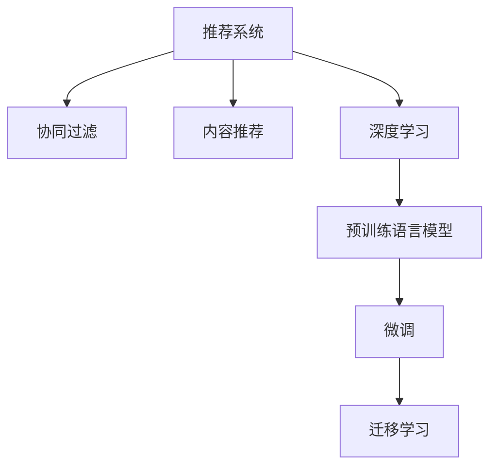

                 

# 推荐系统的未来：大模型的主导地位

## 1. 背景介绍

### 1.1 问题由来
推荐系统已经成为互联网时代不可或缺的一部分，无论是电商、新闻、视频还是社交媒体，都离不开推荐算法。传统的协同过滤、内容推荐、混合推荐等方法在用户多样性、数据稀疏性、动态变化性等方面仍面临诸多挑战。而随着预训练语言模型的兴起，推荐系统正在经历一场革命性的变化，大模型正逐步成为推荐系统的主导力量。

### 1.2 问题核心关键点
基于大模型的推荐系统主要利用预训练模型强大的语言理解和表示能力，通过微调或冻结预训练层的方式，针对推荐任务进行模型适配。这一方法相比传统推荐技术，具有以下几个核心优势：

1. 更强的语言理解和生成能力：大模型能够在自然语言语义层面上，理解用户行为和偏好，生成高质量的推荐结果。
2. 更丰富的知识表示：通过预训练获得的海量知识，大模型能够更全面地捕捉用户兴趣和商品属性。
3. 更高效的训练与推理：大模型的并行计算能力和分布式训练技术，大幅提升了模型训练和推理的效率。
4. 更好的迁移学习能力：大模型通过泛化学习和迁移学习，能够更好地适应不同的推荐场景。

### 1.3 问题研究意义
大模型在推荐系统中的应用，不仅能够提升推荐效果，还能推动推荐技术向更加智能化、个性化、精准化的方向发展。其研究意义在于：

1. 提升用户体验：个性化推荐能够提升用户满意度，提高用户粘性，增加用户留存率。
2. 提高业务效率：推荐系统的精准化，能够有效减少用户搜索时间，提高转化率，提升企业效益。
3. 驱动数据科学：推荐系统的大规模数据处理和高效训练，将推动数据科学方法的不断进步。
4. 促进技术创新：大模型推荐系统涉及多学科交叉，能够促进自然语言处理、机器学习、统计学等领域的发展。

## 2. 核心概念与联系

### 2.1 核心概念概述

为更好地理解基于大模型的推荐系统，本节将介绍几个密切相关的核心概念：

- 推荐系统(Recommender System)：通过分析用户历史行为和商品属性，为用户推荐合适商品的系统。推荐系统广泛应用于电商、新闻、视频等领域。
- 协同过滤(Collaborative Filtering)：基于用户行为和商品特征的推荐方法，是推荐系统的经典算法。
- 内容推荐(Content-Based Recommendation)：根据商品内容，分析用户偏好，推荐相似商品。
- 深度学习(Deep Learning)：一类基于神经网络的机器学习方法，通过训练模型来自动提取数据特征。
- 预训练语言模型(Pre-trained Language Model)：通过大规模无标签文本数据预训练得到的语言模型，具备强大的语言理解能力。
- 微调(Fine-tuning)：在预训练模型的基础上，通过下游任务的少量标注数据，优化模型在该任务上的性能。
- 迁移学习(Transfer Learning)：将一个领域学习到的知识，迁移到另一个相关领域的应用。

这些核心概念之间的逻辑关系可以通过以下Mermaid流程图来展示：



这个流程图展示了大模型推荐系统的核心概念及其之间的关系：

1. 推荐系统通过协同过滤、内容推荐、深度学习等方法，为用户推荐商品。
2. 深度学习中的预训练语言模型，提供强大的语言理解和生成能力。
3. 微调过程将预训练模型适配到推荐任务上，提升推荐精度。
4. 迁移学习使大模型能够从已有任务中学到的知识，迁移到新的推荐任务上。

这些概念共同构成了大模型推荐系统的学习框架，使其能够利用语言的高级语义能力，提升推荐效果。

## 3. 核心算法原理 & 具体操作步骤
### 3.1 算法原理概述

基于大模型的推荐系统，本质上是一种基于迁移学习的推荐方法。其核心思想是：利用预训练语言模型的强大语言理解能力，通过微调将其适配到推荐任务上，从而提升推荐精度。

形式化地，假设预训练模型为 $M_{\theta}$，其中 $\theta$ 为预训练得到的模型参数。给定推荐任务 $T$ 的标注数据集 $D=\{(x_i,y_i)\}_{i=1}^N$，其中 $x_i$ 为用户行为记录，$y_i$ 为推荐商品ID。微调的目标是找到新的模型参数 $\hat{\theta}$，使得模型在推荐任务上的性能最大化：

$$
\hat{\theta}=\mathop{\arg\min}_{\theta} \mathcal{L}(M_{\theta},D)
$$

其中 $\mathcal{L}$ 为针对任务 $T$ 设计的损失函数，用于衡量模型预测输出与真实标签之间的差异。常见的损失函数包括交叉熵损失、均方误差损失等。

通过梯度下降等优化算法，微调过程不断更新模型参数 $\theta$，最小化损失函数 $\mathcal{L}$，使得模型输出逼近真实标签。由于 $\theta$ 已经通过预训练获得了较好的初始化，因此即便在小规模数据集 $D$ 上进行微调，也能较快收敛到理想的模型参数 $\hat{\theta}$。

### 3.2 算法步骤详解

基于大模型的推荐系统一般包括以下几个关键步骤：

**Step 1: 准备预训练模型和数据集**
- 选择合适的预训练语言模型 $M_{\theta}$ 作为初始化参数，如 BERT、GPT等。
- 准备推荐任务 $T$ 的标注数据集 $D$，划分为训练集、验证集和测试集。一般要求标注数据与预训练数据的分布不要差异过大。

**Step 2: 添加任务适配层**
- 根据任务类型，在预训练模型顶层设计合适的输出层和损失函数。
- 对于推荐任务，通常在顶层添加线性分类器或深度神经网络，并使用交叉熵损失函数。

**Step 3: 设置微调超参数**
- 选择合适的优化算法及其参数，如 AdamW、SGD 等，设置学习率、批大小、迭代轮数等。
- 设置正则化技术及强度，包括权重衰减、Dropout、Early Stopping 等。
- 确定冻结预训练参数的策略，如仅微调顶层，或全部参数都参与微调。

**Step 4: 执行梯度训练**
- 将训练集数据分批次输入模型，前向传播计算损失函数。
- 反向传播计算参数梯度，根据设定的优化算法和学习率更新模型参数。
- 周期性在验证集上评估模型性能，根据性能指标决定是否触发 Early Stopping。
- 重复上述步骤直到满足预设的迭代轮数或 Early Stopping 条件。

**Step 5: 测试和部署**
- 在测试集上评估微调后模型 $M_{\hat{\theta}}$ 的性能，对比微调前后的精度提升。
- 使用微调后的模型对新样本进行推理预测，集成到实际的应用系统中。
- 持续收集新的数据，定期重新微调模型，以适应数据分布的变化。

以上是基于大模型的推荐系统的一般流程。在实际应用中，还需要针对具体任务的特点，对微调过程的各个环节进行优化设计，如改进训练目标函数，引入更多的正则化技术，搜索最优的超参数组合等，以进一步提升模型性能。

### 3.3 算法优缺点

基于大模型的推荐系统具有以下优点：
1. 更强的语言理解能力：大模型在语言语义层面上理解用户行为和偏好，生成更准确的推荐结果。
2. 更丰富的知识表示：预训练模型通过大规模文本数据获得丰富知识，有助于提升推荐多样性和精准性。
3. 更高效的训练与推理：大模型并行计算能力和分布式训练技术，大幅提升了模型训练和推理效率。
4. 更好的迁移学习能力：大模型具备泛化学习和迁移学习能力，能快速适应新的推荐场景。

同时，该方法也存在一定的局限性：
1. 对数据依赖较大：预训练模型需要大量数据，且微调过程中对标注数据的依赖较大。
2. 资源消耗较高：大模型参数量较大，训练和推理需要高性能硬件资源。
3. 模型复杂度较高：微调过程中需要调整大量模型参数，增加了系统复杂度。
4. 过拟合风险较高：模型复杂度高，容易导致过拟合，特别是在小数据集上。

尽管存在这些局限性，但就目前而言，基于大模型的推荐系统仍是最为主流的方法。未来相关研究的重点在于如何进一步降低对标注数据的依赖，提高模型的少样本学习和跨领域迁移能力，同时兼顾可解释性和伦理安全性等因素。

### 3.4 算法应用领域

基于大模型的推荐系统已经在电商、新闻、视频、社交媒体等多个领域得到了广泛应用，覆盖了广告推荐、内容推荐、个性化搜索、智能客服等多个推荐场景。以下是一些典型的应用案例：

1. 电商推荐：如亚马逊、京东、淘宝等电商平台，利用大模型推荐用户可能感兴趣的商品。通过用户点击、购买记录等行为数据，微调预训练模型，生成个性化推荐列表。
2. 视频推荐：如YouTube、Netflix、抖音等视频平台，通过分析用户观看历史和评分数据，推荐相关视频内容。大模型能够理解视频内容的语义信息，提升推荐精度。
3. 新闻推荐：如今日头条、腾讯新闻等新闻平台，通过分析用户阅读历史和点击数据，推荐相关新闻文章。大模型可以理解新闻内容的多维度特征，提升推荐效果。
4. 智能客服：如智能音箱、智能客服机器人等，利用大模型生成自然语言响应，提升用户体验和效率。通过微调模型，使得机器人能够理解和处理各种自然语言指令。
5. 个性化搜索：如搜索引擎的搜索结果排序，利用大模型理解查询意图，推荐相关网页。通过微调模型，使得搜索结果更符合用户期望。

除了上述这些经典应用外，大模型推荐系统还被创新性地应用到更多场景中，如多模态推荐、语音推荐、视觉推荐等，为推荐技术带来了全新的突破。随着预训练模型和微调方法的不断进步，相信推荐系统将能够更好地适配各种业务场景，提升用户满意度，增加企业效益。

## 4. 数学模型和公式 & 详细讲解  
### 4.1 数学模型构建

本节将使用数学语言对基于大模型的推荐系统进行更加严格的刻画。

记推荐任务的数据集为 $D=\{(x_i,y_i)\}_{i=1}^N$，其中 $x_i$ 为用户行为记录，$y_i$ 为推荐商品ID。假设预训练模型为 $M_{\theta}$，其中 $\theta$ 为预训练得到的模型参数。

定义模型 $M_{\theta}$ 在数据样本 $(x,y)$ 上的损失函数为 $\ell(M_{\theta}(x),y)$，则在数据集 $D$ 上的经验风险为：

$$
\mathcal{L}(\theta) = \frac{1}{N}\sum_{i=1}^N \ell(M_{\theta}(x_i),y_i)
$$

微调的优化目标是最小化经验风险，即找到最优参数：

$$
\theta^* = \mathop{\arg\min}_{\theta} \mathcal{L}(\theta)
$$

在实践中，我们通常使用基于梯度的优化算法（如SGD、Adam等）来近似求解上述最优化问题。设 $\eta$ 为学习率，$\lambda$ 为正则化系数，则参数的更新公式为：

$$
\theta \leftarrow \theta - \eta \nabla_{\theta}\mathcal{L}(\theta) - \eta\lambda\theta
$$

其中 $\nabla_{\theta}\mathcal{L}(\theta)$ 为损失函数对参数 $\theta$ 的梯度，可通过反向传播算法高效计算。

### 4.2 公式推导过程

以下我们以电商推荐任务为例，推导交叉熵损失函数及其梯度的计算公式。

假设模型 $M_{\theta}$ 在用户行为记录 $x_i$ 上的输出为 $\hat{y}=M_{\theta}(x_i) \in [0,1]$，表示用户点击商品 $y_i$ 的概率。真实标签 $y_i \in \{1,0\}$，即用户是否点击了商品 $y_i$。则交叉熵损失函数定义为：

$$
\ell(M_{\theta}(x_i),y_i) = -[y_i\log \hat{y} + (1-y_i)\log (1-\hat{y})]
$$

将其代入经验风险公式，得：

$$
\mathcal{L}(\theta) = -\frac{1}{N}\sum_{i=1}^N [y_i\log M_{\theta}(x_i)+(1-y_i)\log(1-M_{\theta}(x_i))]
$$

根据链式法则，损失函数对参数 $\theta_k$ 的梯度为：

$$
\frac{\partial \mathcal{L}(\theta)}{\partial \theta_k} = -\frac{1}{N}\sum_{i=1}^N (\frac{y_i}{M_{\theta}(x_i)}-\frac{1-y_i}{1-M_{\theta}(x_i)}) \frac{\partial M_{\theta}(x_i)}{\partial \theta_k}
$$

其中 $\frac{\partial M_{\theta}(x_i)}{\partial \theta_k}$ 可进一步递归展开，利用自动微分技术完成计算。

在得到损失函数的梯度后，即可带入参数更新公式，完成模型的迭代优化。重复上述过程直至收敛，最终得到适应电商推荐任务的最优模型参数 $\theta^*$。

## 5. 项目实践：代码实例和详细解释说明
### 5.1 开发环境搭建

在进行推荐系统实践前，我们需要准备好开发环境。以下是使用Python进行PyTorch开发的环境配置流程：

1. 安装Anaconda：从官网下载并安装Anaconda，用于创建独立的Python环境。

2. 创建并激活虚拟环境：
```bash
conda create -n pytorch-env python=3.8 
conda activate pytorch-env
```

3. 安装PyTorch：根据CUDA版本，从官网获取对应的安装命令。例如：
```bash
conda install pytorch torchvision torchaudio cudatoolkit=11.1 -c pytorch -c conda-forge
```

4. 安装Transformers库：
```bash
pip install transformers
```

5. 安装各类工具包：
```bash
pip install numpy pandas scikit-learn matplotlib tqdm jupyter notebook ipython
```

完成上述步骤后，即可在`pytorch-env`环境中开始推荐系统开发。

### 5.2 源代码详细实现

下面我们以电商推荐任务为例，给出使用Transformers库对BERT模型进行电商推荐微调的PyTorch代码实现。

首先，定义电商推荐任务的数据处理函数：

```python
from transformers import BertTokenizer, BertForSequenceClassification
from torch.utils.data import Dataset, DataLoader
import torch

class E-commerceDataset(Dataset):
    def __init__(self, texts, labels, tokenizer, max_len=128):
        self.texts = texts
        self.labels = labels
        self.tokenizer = tokenizer
        self.max_len = max_len
        
    def __len__(self):
        return len(self.texts)
    
    def __getitem__(self, item):
        text = self.texts[item]
        label = self.labels[item]
        
        encoding = self.tokenizer(text, return_tensors='pt', max_length=self.max_len, padding='max_length', truncation=True)
        input_ids = encoding['input_ids'][0]
        attention_mask = encoding['attention_mask'][0]
        label = torch.tensor(label, dtype=torch.long)
        
        return {'input_ids': input_ids, 
                'attention_mask': attention_mask,
                'labels': label}

# 加载标签和文本数据
tokenizer = BertTokenizer.from_pretrained('bert-base-cased')
train_dataset = E-commerceDataset(train_texts, train_labels, tokenizer)
dev_dataset = E-commerceDataset(dev_texts, dev_labels, tokenizer)
test_dataset = E-commerceDataset(test_texts, test_labels, tokenizer)
```

然后，定义模型和优化器：

```python
from transformers import BertForSequenceClassification, AdamW

model = BertForSequenceClassification.from_pretrained('bert-base-cased', num_labels=2)
optimizer = AdamW(model.parameters(), lr=2e-5)
```

接着，定义训练和评估函数：

```python
from tqdm import tqdm
from sklearn.metrics import classification_report

device = torch.device('cuda') if torch.cuda.is_available() else torch.device('cpu')
model.to(device)

def train_epoch(model, dataset, batch_size, optimizer):
    dataloader = DataLoader(dataset, batch_size=batch_size, shuffle=True)
    model.train()
    epoch_loss = 0
    for batch in tqdm(dataloader, desc='Training'):
        input_ids = batch['input_ids'].to(device)
        attention_mask = batch['attention_mask'].to(device)
        labels = batch['labels'].to(device)
        model.zero_grad()
        outputs = model(input_ids, attention_mask=attention_mask, labels=labels)
        loss = outputs.loss
        epoch_loss += loss.item()
        loss.backward()
        optimizer.step()
    return epoch_loss / len(dataloader)

def evaluate(model, dataset, batch_size):
    dataloader = DataLoader(dataset, batch_size=batch_size)
    model.eval()
    preds, labels = [], []
    with torch.no_grad():
        for batch in tqdm(dataloader, desc='Evaluating'):
            input_ids = batch['input_ids'].to(device)
            attention_mask = batch['attention_mask'].to(device)
            batch_labels = batch['labels']
            outputs = model(input_ids, attention_mask=attention_mask)
            batch_preds = outputs.logits.argmax(dim=2).to('cpu').tolist()
            batch_labels = batch_labels.to('cpu').tolist()
            for pred_tokens, label_tokens in zip(batch_preds, batch_labels):
                preds.append(pred_tokens[:len(label_tokens)])
                labels.append(label_tokens)
                
    print(classification_report(labels, preds))
```

最后，启动训练流程并在测试集上评估：

```python
epochs = 5
batch_size = 16

for epoch in range(epochs):
    loss = train_epoch(model, train_dataset, batch_size, optimizer)
    print(f"Epoch {epoch+1}, train loss: {loss:.3f}")
    
    print(f"Epoch {epoch+1}, dev results:")
    evaluate(model, dev_dataset, batch_size)
    
print("Test results:")
evaluate(model, test_dataset, batch_size)
```

以上就是使用PyTorch对BERT进行电商推荐任务微调的完整代码实现。可以看到，得益于Transformers库的强大封装，我们可以用相对简洁的代码完成BERT模型的加载和微调。

### 5.3 代码解读与分析

让我们再详细解读一下关键代码的实现细节：

**E-commerceDataset类**：
- `__init__`方法：初始化文本、标签、分词器等关键组件。
- `__len__`方法：返回数据集的样本数量。
- `__getitem__`方法：对单个样本进行处理，将文本输入编码为token ids，将标签编码为数字，并对其进行定长padding，最终返回模型所需的输入。

**标签与id的映射**
- 定义了标签与数字id之间的映射关系，用于将token-wise的预测结果解码回真实的标签。

**训练和评估函数**：
- 使用PyTorch的DataLoader对数据集进行批次化加载，供模型训练和推理使用。
- 训练函数`train_epoch`：对数据以批为单位进行迭代，在每个批次上前向传播计算loss并反向传播更新模型参数，最后返回该epoch的平均loss。
- 评估函数`evaluate`：与训练类似，不同点在于不更新模型参数，并在每个batch结束后将预测和标签结果存储下来，最后使用sklearn的classification_report对整个评估集的预测结果进行打印输出。

**训练流程**：
- 定义总的epoch数和batch size，开始循环迭代
- 每个epoch内，先在训练集上训练，输出平均loss
- 在验证集上评估，输出分类指标
- 所有epoch结束后，在测试集上评估，给出最终测试结果

可以看到，PyTorch配合Transformers库使得BERT微调的代码实现变得简洁高效。开发者可以将更多精力放在数据处理、模型改进等高层逻辑上，而不必过多关注底层的实现细节。

当然，工业级的系统实现还需考虑更多因素，如模型的保存和部署、超参数的自动搜索、更灵活的任务适配层等。但核心的微调范式基本与此类似。

## 6. 实际应用场景
### 6.1 智能推荐系统

基于大模型推荐系统已经在电商、新闻、视频、社交媒体等多个领域得到了广泛应用，覆盖了广告推荐、内容推荐、个性化搜索、智能客服等多个推荐场景。以下是一些典型的应用案例：

1. 电商推荐：如亚马逊、京东、淘宝等电商平台，利用大模型推荐用户可能感兴趣的商品。通过用户点击、购买记录等行为数据，微调预训练模型，生成个性化推荐列表。
2. 视频推荐：如YouTube、Netflix、抖音等视频平台，通过分析用户观看历史和评分数据，推荐相关视频内容。大模型能够理解视频内容的语义信息，提升推荐精度。
3. 新闻推荐：如今日头条、腾讯新闻等新闻平台，通过分析用户阅读历史和点击数据，推荐相关新闻文章。大模型可以理解新闻内容的多维度特征，提升推荐效果。
4. 智能客服：如智能音箱、智能客服机器人等，利用大模型生成自然语言响应，提升用户体验和效率。通过微调模型，使得机器人能够理解和处理各种自然语言指令。
5. 个性化搜索：如搜索引擎的搜索结果排序，利用大模型理解查询意图，推荐相关网页。通过微调模型，使得搜索结果更符合用户期望。

除了上述这些经典应用外，大模型推荐系统还被创新性地应用到更多场景中，如多模态推荐、语音推荐、视觉推荐等，为推荐技术带来了全新的突破。随着预训练模型和微调方法的不断进步，相信推荐系统将能够更好地适配各种业务场景，提升用户满意度，增加企业效益。

### 6.2 未来应用展望

随着大模型推荐系统的不断发展，其应用前景将更加广阔。以下是一些可能的未来应用场景：

1. 多模态推荐系统：通过融合视觉、语音、文本等多模态数据，提升推荐系统的全面性和精准性。例如，利用图像检索技术，将用户上传的图片与商品进行匹配，推荐相似商品。
2. 实时推荐系统：利用实时数据流，动态生成个性化推荐。例如，根据用户当前在线行为，实时更新推荐列表，提高用户点击率。
3. 跨领域推荐系统：通过迁移学习，将大模型应用于不同领域的数据集，提升推荐系统的泛化能力。例如，利用通用大模型，在不同领域的电商、新闻、视频等数据上进行微调，实现跨领域推荐。
4. 智能推荐助手：通过自然语言理解和生成技术，构建智能推荐助手，帮助用户获取个性化建议。例如，利用大模型对用户输入的自然语言问题进行理解，自动生成推荐列表。
5. 健康推荐系统：利用大模型对用户的健康数据进行分析和理解，推荐个性化的健康建议和生活方式。例如，分析用户的饮食、运动、睡眠等数据，生成健康推荐计划。

这些未来应用场景展示了大模型推荐系统在各行各业中的巨大潜力，为推荐技术的发展带来了新的方向和机遇。

## 7. 工具和资源推荐
### 7.1 学习资源推荐

为了帮助开发者系统掌握大模型推荐系统的理论基础和实践技巧，这里推荐一些优质的学习资源：

1. 《Recommender System for Smartphones》系列博文：由大模型技术专家撰写，深入浅出地介绍了基于大模型的推荐系统原理和实践技巧。

2. CS231n《深度学习与视觉识别》课程：斯坦福大学开设的视觉深度学习课程，涵盖多种视觉推荐技术，是学习多模态推荐的重要资源。

3. 《Personalization with AI》书籍：深度介绍基于大模型的推荐技术，涵盖协同过滤、深度学习、多模态推荐等多个主题。

4. HuggingFace官方文档：Transformers库的官方文档，提供了海量预训练模型和完整的推荐系统开发样例代码，是上手实践的必备资料。

5. arXiv上推荐系统的经典论文：如《Adversarial Examples for Generative Adversarial Networks》、《Imbalanced Transfer Learning》等，提供了推荐系统领域的最新研究方向。

通过对这些资源的学习实践，相信你一定能够快速掌握大模型推荐系统的精髓，并用于解决实际的推荐问题。
###  7.2 开发工具推荐

高效的开发离不开优秀的工具支持。以下是几款用于大模型推荐系统开发的常用工具：

1. PyTorch：基于Python的开源深度学习框架，灵活动态的计算图，适合快速迭代研究。大部分预训练语言模型都有PyTorch版本的实现。

2. TensorFlow：由Google主导开发的开源深度学习框架，生产部署方便，适合大规模工程应用。同样有丰富的预训练语言模型资源。

3. Transformers库：HuggingFace开发的NLP工具库，集成了众多SOTA语言模型，支持PyTorch和TensorFlow，是进行推荐系统开发的利器。

4. Weights & Biases：模型训练的实验跟踪工具，可以记录和可视化模型训练过程中的各项指标，方便对比和调优。与主流深度学习框架无缝集成。

5. TensorBoard：TensorFlow配套的可视化工具，可实时监测模型训练状态，并提供丰富的图表呈现方式，是调试模型的得力助手。

6. Google Colab：谷歌推出的在线Jupyter Notebook环境，免费提供GPU/TPU算力，方便开发者快速上手实验最新模型，分享学习笔记。

合理利用这些工具，可以显著提升大模型推荐系统的开发效率，加快创新迭代的步伐。

### 7.3 相关论文推荐

大模型推荐系统的发展源于学界的持续研究。以下是几篇奠基性的相关论文，推荐阅读：

1. Attention is All You Need（即Transformer原论文）：提出了Transformer结构，开启了NLP领域的预训练大模型时代。

2. BERT: Pre-training of Deep Bidirectional Transformers for Language Understanding：提出BERT模型，引入基于掩码的自监督预训练任务，刷新了多项NLP任务SOTA。

3. Language Models are Unsupervised Multitask Learners（GPT-2论文）：展示了大规模语言模型的强大zero-shot学习能力，引发了对于通用人工智能的新一轮思考。

4. Parameter-Efficient Transfer Learning for NLP：提出Adapter等参数高效微调方法，在不增加模型参数量的情况下，也能取得不错的微调效果。

5. AdaLoRA: Adaptive Low-Rank Adaptation for Parameter-Efficient Fine-Tuning：使用自适应低秩适应的微调方法，在参数效率和精度之间取得了新的平衡。

6. Revisiting Self-Supervised Feature Learning for Recommendation Systems：重新审视自监督特征学习方法，提出新的预训练技术，提升推荐系统效果。

这些论文代表了大模型推荐系统的发展脉络。通过学习这些前沿成果，可以帮助研究者把握学科前进方向，激发更多的创新灵感。

## 8. 总结：未来发展趋势与挑战

### 8.1 总结

本文对基于大模型的推荐系统进行了全面系统的介绍。首先阐述了大模型推荐系统的研究背景和意义，明确了大模型在推荐系统中的核心优势。其次，从原理到实践，详细讲解了大模型的推荐算法和微调过程，给出了推荐系统开发的完整代码实例。同时，本文还广泛探讨了大模型推荐系统在电商、新闻、视频、智能客服等多个领域的应用前景，展示了其巨大的潜力。此外，本文精选了大模型推荐系统的各类学习资源，力求为开发者提供全方位的技术指引。

通过本文的系统梳理，可以看到，基于大模型的推荐系统正在成为推荐系统的主流方法，极大地拓展了推荐技术的智能化水平和应用范围。大模型推荐系统不仅能够提升推荐效果，还能推动推荐技术向更加个性化、精准化的方向发展。未来，伴随大模型技术的不断进步，推荐系统必将在更广阔的领域得到应用，带来新的商业模式和技术变革。

### 8.2 未来发展趋势

展望未来，大模型推荐系统将呈现以下几个发展趋势：

1. 推荐模型规模持续增大。随着算力成本的下降和数据规模的扩张，大模型推荐模型的参数量还将持续增长。超大规模推荐模型能够提供更全面、更丰富的用户推荐内容。

2. 推荐系统智能化水平提升。随着深度学习技术的不断进步，推荐系统能够更全面地理解用户行为和商品属性，生成更精准的推荐结果。

3. 跨领域推荐系统崛起。大模型具备跨领域迁移学习能力，能够将在一个领域的知识迁移到另一个领域，提升推荐系统的泛化能力。

4. 实时推荐系统普及。随着实时数据流的处理技术进步，大模型推荐系统能够实现实时动态推荐，提高用户点击率和满意度。

5. 多模态推荐系统发展。通过融合视觉、语音、文本等多模态数据，大模型推荐系统能够提供更全面、更精准的推荐内容。

6. 个性化推荐助手出现。利用自然语言理解和生成技术，构建智能推荐助手，提升用户推荐体验。

这些趋势凸显了大模型推荐系统的广阔前景。这些方向的探索发展，必将进一步提升推荐系统的效果和应用范围，为推荐技术的发展带来新的动力。

### 8.3 面临的挑战

尽管大模型推荐系统已经取得了瞩目成就，但在迈向更加智能化、普适化应用的过程中，它仍面临着诸多挑战：

1. 数据隐私和安全：推荐系统需要处理大量用户数据，如何保护用户隐私，避免数据滥用，是亟待解决的问题。

2. 模型公平性：大模型可能存在偏见，导致不公平推荐，如何减少模型偏见，提升推荐公平性，需要更多的研究。

3. 资源消耗问题：大模型参数量较大，训练和推理需要高性能硬件资源，如何在保持效果的同时，降低资源消耗，需要更多的技术优化。

4. 用户个性化需求：用户个性化需求多样化，如何设计个性化推荐算法，满足不同用户的需求，是一个需要解决的重要问题。

5. 推荐系统稳定性：推荐系统需要持续迭代优化，如何提高系统稳定性，避免突然的系统崩溃或数据丢失，是一个需要重点关注的问题。

6. 多模态数据融合：多模态数据融合是推荐系统的重要研究方向，如何高效融合多模态数据，提升推荐效果，需要更多的技术突破。

这些挑战使得大模型推荐系统的应用仍需更多的技术突破和实践探索。相信通过学界和产业界的共同努力，这些问题终将逐一被克服，大模型推荐系统必将在构建智能推荐系统、提升用户体验、增加企业效益等方面发挥更大的作用。

### 8.4 研究展望

面对大模型推荐系统所面临的种种挑战，未来的研究需要在以下几个方面寻求新的突破：

1. 探索更高效的模型压缩技术。大模型参数量较大，如何在保证效果的同时，压缩模型规模，降低资源消耗，是一个重要的研究方向。

2. 研究更具泛化性的推荐算法。如何设计更具泛化性的推荐算法，提升推荐系统在不同领域、不同场景下的表现，是未来的一个重要方向。

3. 引入更多的先验知识。如何将外部知识与推荐系统结合，提升推荐系统的精度和效果，是一个值得探索的方向。

4. 发展更智能的推荐助手。利用大模型对用户输入进行自然语言理解，提升推荐助手的智能化水平，是未来推荐系统的一个重要方向。

5. 增强推荐系统的安全性。如何提高推荐系统的安全性，避免模型被恶意利用，是一个需要重点关注的问题。

这些研究方向的探索，必将引领大模型推荐系统迈向更高的台阶，为构建智能推荐系统、提升用户体验、增加企业效益等方面提供新的动力。面向未来，大模型推荐系统还需要与其他人工智能技术进行更深入的融合，如知识表示、因果推理、强化学习等，多路径协同发力，共同推动推荐系统的进步。

## 9. 附录：常见问题与解答

**Q1：大模型推荐系统是否适用于所有推荐场景？**

A: 大模型推荐系统适用于大多数推荐场景，特别是数据量较大的场景。但对于一些特殊场景，如低数据量推荐、实时推荐等，仍需结合具体需求进行优化。

**Q2：大模型推荐系统与传统协同过滤、内容推荐方法有何不同？**

A: 大模型推荐系统通过预训练语言模型的强大语义理解能力，能够更全面地理解用户行为和商品属性，生成更精准的推荐结果。相比传统方法，大模型推荐系统可以更好地处理语义丰富、结构复杂的数据，提升推荐效果。

**Q3：大模型推荐系统面临哪些资源消耗问题？**

A: 大模型推荐系统面临的主要资源消耗问题包括：
1. 数据存储和传输：大模型参数量较大，需要大量存储空间和带宽进行存储和传输。
2. 计算资源：大模型推荐系统需要高性能的计算资源进行训练和推理，特别是在大规模数据集上。

**Q4：如何缓解大模型推荐系统的过拟合问题？**

A: 缓解大模型推荐系统的过拟合问题，可以采用以下策略：
1. 数据增强：通过回译、近义替换等方式扩充训练集。
2. 正则化：使用L2正则、Dropout、Early Stopping等技术，防止模型过拟合。
3. 对抗训练：引入对抗样本，提高模型鲁棒性。
4. 参数高效微调：只更新少量模型参数，减少过拟合风险。

这些策略往往需要根据具体任务和数据特点进行灵活组合。只有在数据、模型、训练、推理等各环节进行全面优化，才能最大限度地发挥大模型推荐系统的潜力。

**Q5：大模型推荐系统的未来展望是什么？**

A: 大模型推荐系统的未来展望包括：
1. 推荐模型规模持续增大。
2. 推荐系统智能化水平提升。
3. 跨领域推荐系统崛起。
4. 实时推荐系统普及。
5. 多模态推荐系统发展。
6. 个性化推荐助手出现。

这些趋势凸显了大模型推荐系统的广阔前景。这些方向的探索发展，必将进一步提升推荐系统的效果和应用范围，为推荐技术的发展带来新的动力。

---

作者：禅与计算机程序设计艺术 / Zen and the Art of Computer Programming

