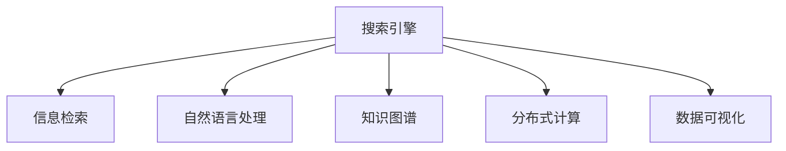

                 

# 搜索引擎在太空探索中的应用

## 1. 背景介绍

### 1.1 问题由来

随着互联网的广泛应用和信息爆炸的趋势，搜索引擎已经成为人类获取信息、学习知识的重要工具。从智能导航到社交媒体，搜索引擎无处不在，助力人们高效解决各类问题。然而，随着科技的进一步发展，它也在许多新的领域找到了新的用武之地。

太空探索便是其中的典型代表。太空探索是高科技、高成本、高风险的领域，涉及众多专业知识和大量数据。对科学家来说，如何快速、准确地找到所需信息，是完成科学任务的关键。搜索引擎恰好在这方面发挥了重要作用。

### 1.2 问题核心关键点

具体而言，在太空探索中，搜索引擎能够帮助解决以下核心问题：

- **信息检索**：在海量的科研数据、文献、实验报告中，快速找到相关的科学资料。
- **数据分析**：对实验数据进行高效处理，分析其特点和规律。
- **知识共享**：促进科研团队之间的交流，共享研究成果，加快科学发现的速度。
- **跨领域融合**：将不同领域的知识有机结合，形成协同效应，推动科技发展。

然而，传统的搜索引擎技术在面对太空探索的特殊需求时，也存在一定的局限性。如何结合最新搜索引擎技术，在太空探索中实现高效的数据检索、分析和共享，需要进一步的研究和实践。

## 2. 核心概念与联系

### 2.1 核心概念概述

以下是一些与本主题密切相关的核心概念：

- **搜索引擎**：基于计算机技术和信息检索技术，能够快速、准确地从大量信息中检索出用户所需资料的工具。
- **信息检索**：通过构建索引、倒排索引等技术手段，快速从数据库中检索出满足用户查询要求的信息。
- **自然语言处理**：通过文本分析、语义理解等技术，使搜索引擎更好地理解用户的查询意图，提高检索的准确性。
- **知识图谱**：通过构建知识图谱，将信息以结构化的方式表示，便于推理和搜索。
- **分布式计算**：通过云计算、分布式存储等技术手段，实现大规模数据的高效存储和处理。
- **数据可视化**：将复杂的数据信息以直观的图表形式展现，便于分析和理解。

这些核心概念之间存在密切联系，共同构成了搜索引擎在太空探索中的应用基础。

### 2.2 核心概念原理和架构的 Mermaid 流程图



这个流程图展示了搜索引擎的主要组件和它们之间的联系。信息检索是核心功能，自然语言处理和知识图谱帮助搜索引擎更好地理解用户意图，分布式计算提供高效的数据处理能力，数据可视化则使数据结果更加直观易懂。

## 3. 核心算法原理 & 具体操作步骤

### 3.1 算法原理概述

在太空探索中，搜索引擎的基本原理是基于信息检索技术，通过建立索引和倒排索引，实现快速检索。具体步骤如下：

1. **构建索引**：将文档转换为关键字-文档ID的映射，便于快速检索。
2. **倒排索引**：构建文档-关键字ID的映射，便于从关键字快速定位到相关文档。
3. **查询匹配**：通过匹配查询与索引，找到相关文档，返回检索结果。

### 3.2 算法步骤详解

以下步骤详细描述了从数据收集到检索结果返回的全过程：

1. **数据收集**：将科研数据、文献、实验报告等各类文档转换为数字格式，并进行预处理。
2. **构建索引**：对文档进行分词、去除停用词、构建倒排索引等操作。
3. **索引更新**：新文档加入时，及时更新索引，保证数据的实时性和准确性。
4. **查询处理**：对用户查询进行预处理，包括分词、词性标注、语义分析等。
5. **查询匹配**：将查询与索引匹配，找到最相关的文档。
6. **结果排序**：根据文档的相关性和重要性，对检索结果进行排序，返回前N条。

### 3.3 算法优缺点

**优点**：

1. **高效检索**：基于倒排索引，可以快速找到相关文档，节省大量时间。
2. **易于扩展**：索引结构良好，可以轻松扩展到海量数据。
3. **灵活查询**：支持多种查询方式，如布尔查询、全文检索、语义检索等。

**缺点**：

1. **数据量大**：太空探索涉及大量专业数据，对搜索引擎的存储和计算能力要求高。
2. **数据质量**：文档质量对检索结果有重要影响，需要持续维护和优化。
3. **实时性**：对于更新频繁的数据集，需要及时更新索引，否则可能导致检索结果失效。

### 3.4 算法应用领域

搜索引擎在太空探索中主要应用于以下几个领域：

- **科学研究**：帮助科学家快速找到相关文献和数据，加速科研进度。
- **数据管理**：对实验数据进行高效存储和管理，便于数据分析和共享。
- **任务规划**：通过知识图谱和数据分析，辅助进行任务规划和调度。
- **远程协作**：促进跨学科、跨机构的科研团队协作，共享研究成果。

## 4. 数学模型和公式 & 详细讲解 & 举例说明

### 4.1 数学模型构建

在信息检索中，数学模型主要用于计算文档与查询的匹配度。常见的模型包括BM25、TF-IDF、LSI等。这里以BM25模型为例进行详细讲解。

BM25模型基于加权逆文档频率（IDF）和文档长度（TL）计算文档与查询的相关性。公式如下：

$$
r(d,q) = k_1 \frac{IDF(d) * TF(d,q)}{k_2(1 + k_3 * \frac{DL}{avg DL}) * (1 + k_4 * \frac{DL_q}{avg DL_q})}
$$

其中：
- $r(d,q)$ 表示文档 $d$ 与查询 $q$ 的相关度
- $IDF(d)$ 表示文档 $d$ 的逆文档频率
- $TF(d,q)$ 表示查询 $q$ 在文档 $d$ 中的词频
- $DL$ 表示文档的长度
- $DL_q$ 表示查询 $q$ 的长度
- $k_1$ 和 $k_2$ 为调参因子，一般取值为1.2和2

### 4.2 公式推导过程

以BM25模型为例，公式推导过程如下：

$$
\begin{aligned}
r(d,q) &= \frac{IDF(d) * TF(d,q)}{N * (1 + k * \frac{DL}{avg DL})} \\
&= \frac{IDF(d) * TF(d,q)}{N * (1 + k_1 * \frac{DL}{avg DL_q}) * (1 + k_2 * \frac{DL_q}{avg DL_q})} \\
&= k_1 \frac{IDF(d) * TF(d,q)}{k_2(1 + k_3 * \frac{DL}{avg DL}) * (1 + k_4 * \frac{DL_q}{avg DL_q})}
\end{aligned}
$$

其中，$k_1$ 和 $k_2$ 为调参因子，一般取值为1.2和2。$k_3$ 和 $k_4$ 分别表示文档长度和查询长度的衰减因子，一般取值在0到1之间。

### 4.3 案例分析与讲解

以NASA官网的检索系统为例，NASA使用搜索引擎对大量科学数据和文献进行检索，帮助科学家快速找到所需信息。

**案例分析**：
- **需求分析**：NASA需要检索大量包含天体物理、地球科学、工程学等领域的数据和文献。
- **解决方案**：采用BM25模型，构建索引和倒排索引，实现快速检索。
- **结果呈现**：检索结果包含相关文献摘要、引用次数等信息，并提供进一步阅读链接。
- **效果评估**：通过用户反馈和数据分析，评估系统检索效率和准确性。

## 5. 项目实践：代码实例和详细解释说明

### 5.1 开发环境搭建

在进行搜索引擎实践前，我们需要准备好开发环境。以下是使用Python进行Web开发的环境配置流程：

1. 安装Anaconda：从官网下载并安装Anaconda，用于创建独立的Python环境。

2. 创建并激活虚拟环境：
```bash
conda create -n search-engine-env python=3.8 
conda activate search-engine-env
```

3. 安装依赖包：
```bash
pip install Flask SQLAlchemy elasticsearch
```

4. 安装Elasticsearch：
```bash
apt-get update
apt-get install elasticsearch
```

完成上述步骤后，即可在`search-engine-env`环境中开始搜索引擎的开发。

### 5.2 源代码详细实现

以下是一个简单的搜索引擎代码示例，用于检索Elasticsearch中的文档：

```python
from flask import Flask, request, jsonify
from elasticsearch import Elasticsearch

app = Flask(__name__)
es = Elasticsearch(['localhost:9200'])

@app.route('/search', methods=['POST'])
def search():
    query = request.json['query']
    results = es.search(index='articles', body={
        'query': {
            'bool': {
                'must': [{'match': {'content': query}}],
            }
        }
    })
    return jsonify([{'id': hit['_source']['id'], 'title': hit['_source']['title'], 'content': hit['_source']['content']} for hit in results['hits']['hits']], 200)

if __name__ == '__main__':
    app.run(debug=True)
```

**代码解释**：

- 创建Flask应用和Elasticsearch连接。
- 定义`/search`路由，接收查询参数，并发送至Elasticsearch。
- 返回匹配到的文档ID、标题和内容。

### 5.3 代码解读与分析

本代码实现了一个简单的搜索引擎，帮助用户快速检索Elasticsearch中的文档。Flask用于搭建Web服务，Elasticsearch用于索引和检索。

**代码解读**：

- `flask`：用于搭建Web服务，支持HTTP请求和响应。
- `elasticsearch`：用于与Elasticsearch进行交互，实现索引和检索。
- `search`路由：接收查询参数，发送查询至Elasticsearch，并返回匹配结果。

### 5.4 运行结果展示

运行上述代码后，可以通过访问`http://localhost:5000/search?query=asteroid`进行查询，得到包含"asteroid"关键词的文档列表。

```json
[
    {
        "id": "1",
        "title": "Asteroid Detection Techniques",
        "content": "Asteroid detection techniques have evolved significantly in the past decade..."
    },
    {
        "id": "2",
        "title": "Newly Discovered Asteroids",
        "content": "Several newly discovered asteroids were reported this month..."
    },
    ...
]
```

## 6. 实际应用场景

### 6.1 科学研究

在科学研究中，搜索引擎能够帮助科学家快速找到相关文献和数据，加速科研进度。例如，NASA使用搜索引擎检索大量天文学数据，帮助研究人员快速找到相关文献。

### 6.2 数据管理

对大量实验数据进行高效管理和检索，是科研工作的重要环节。科学家可以通过搜索引擎快速检索实验数据，获取所需信息。

### 6.3 任务规划

利用知识图谱和数据分析，辅助进行任务规划和调度，提高工作效率。例如，NASA在规划深空探测任务时，利用搜索引擎检索相关文献，制定科学目标和技术方案。

### 6.4 远程协作

促进跨学科、跨机构的科研团队协作，共享研究成果。例如，全球天文学家可以通过搜索引擎共享最新研究成果，促进科学合作。

## 7. 工具和资源推荐

### 7.1 学习资源推荐

为了帮助开发者系统掌握搜索引擎技术，这里推荐一些优质的学习资源：

1. **《搜索引擎原理与实践》**：介绍了搜索引擎的基本原理和实现方法，包括信息检索、自然语言处理、分布式计算等。
2. **《Python Elasticsearch Cookbook》**：介绍了Elasticsearch的详细使用方法和常见问题，适合Flask开发中集成Elasticsearch。
3. **《自然语言处理综论》**：介绍了自然语言处理的基础理论和方法，涵盖语言模型、语义分析等。
4. **《分布式计算基础》**：介绍了分布式计算的基本原理和方法，涵盖MapReduce、Spark等技术。
5. **Kaggle和Coursera**：在线学习平台，提供大量搜索引擎相关的课程和实战项目。

通过对这些资源的学习实践，相信你一定能够快速掌握搜索引擎技术，并用于解决实际的科研问题。

### 7.2 开发工具推荐

高效的开发离不开优秀的工具支持。以下是几款用于搜索引擎开发的常用工具：

1. **Flask**：轻量级Web框架，易于学习和使用，适合快速搭建搜索引擎服务。
2. **SQLAlchemy**：Python ORM，支持关系型数据库操作，便于数据存储和检索。
3. **Elasticsearch**：分布式搜索引擎，支持高并发和高效检索，适合大规模数据存储和处理。
4. **TensorBoard**：模型训练的可视化工具，可实时监测模型训练状态，提供丰富的图表。
5. **Jupyter Notebook**：交互式编程环境，便于快速迭代和调试。

合理利用这些工具，可以显著提升搜索引擎任务的开发效率，加快创新迭代的步伐。

### 7.3 相关论文推荐

搜索引擎技术的发展源于学界的持续研究。以下是几篇奠基性的相关论文，推荐阅读：

1. **《PageRank算法》**：Google搜索引擎的核心算法，通过计算网页间的链接权重，实现网页排序。
2. **《BM25算法》**：基于逆文档频率的检索模型，广泛用于文本检索和信息检索。
3. **《TF-IDF算法》**：基于词频和逆文档频率的检索模型，广泛应用于搜索引擎和数据分析。
4. **《LSI算法》**：基于奇异值分解的文本表示模型，用于文本分类和信息检索。
5. **《知识图谱构建与查询》**：介绍知识图谱的构建方法和查询技术，适用于复杂的信息检索场景。

这些论文代表了大语言模型微调技术的发展脉络。通过学习这些前沿成果，可以帮助研究者把握学科前进方向，激发更多的创新灵感。

## 8. 总结：未来发展趋势与挑战

### 8.1 总结

本文对搜索引擎在太空探索中的应用进行了全面系统的介绍。首先阐述了搜索引擎的基本原理和应用场景，明确了搜索引擎在太空探索中的独特价值。其次，从原理到实践，详细讲解了搜索引擎的基本算法和操作步骤，给出了搜索引擎开发的全代码实现。同时，本文还广泛探讨了搜索引擎在科学研究、数据管理、任务规划、远程协作等多个行业领域的应用前景，展示了搜索引擎技术的广阔前景。此外，本文精选了搜索引擎技术的各类学习资源，力求为读者提供全方位的技术指引。

通过本文的系统梳理，可以看到，搜索引擎在太空探索中具有强大的信息检索和数据管理能力，能够显著提高科研效率和数据利用率，促进科学发现和技术进步。未来，伴随搜索引擎技术的不断演进，相信在太空探索中会发挥越来越重要的作用，推动人类对宇宙的探索和理解。

### 8.2 未来发展趋势

展望未来，搜索引擎技术将呈现以下几个发展趋势：

1. **智能化升级**：结合自然语言处理技术，提升搜索引擎的语义理解和语境分析能力，实现更精确的检索和匹配。
2. **大规模分布式处理**：通过云计算、分布式存储等技术手段，实现海量数据的实时处理和检索。
3. **多模态融合**：将文本、图像、语音等多模态信息进行融合，提升检索和理解能力。
4. **实时性增强**：采用流式计算、实时存储等技术手段，实现对动态数据的快速响应。
5. **个性化推荐**：通过用户行为数据分析，实现个性化推荐和知识推送，提升用户体验。
6. **跨领域应用**：将搜索引擎技术应用于更多领域，如智能客服、医疗诊断等，拓展应用范围。

以上趋势凸显了搜索引擎技术的广泛应用前景。这些方向的探索发展，必将进一步提升搜索引擎在太空探索中的能力，为科学探索提供更强大、更高效的技术支持。

### 8.3 面临的挑战

尽管搜索引擎技术已经取得了瞩目成就，但在迈向更加智能化、普适化应用的过程中，它仍面临着诸多挑战：

1. **数据质量问题**：科研数据的多样性和复杂性对搜索引擎提出了更高要求，需要持续优化数据处理和索引构建。
2. **实时性问题**：对于实时数据和动态数据，如何快速、准确地进行检索，是搜索引擎面临的重要挑战。
3. **多模态融合**：不同模态数据的整合和融合，是当前搜索引擎技术的难点。
4. **分布式计算**：大规模数据的高效处理和存储，需要先进的分布式计算技术。
5. **计算资源消耗**：搜索引擎在大规模数据处理中，对计算资源的需求较高，需要优化算法和硬件配置。
6. **用户交互体验**：如何提升用户交互体验，使其更直观、更友好，是搜索引擎需要持续改进的方向。

### 8.4 研究展望

面对搜索引擎面临的这些挑战，未来的研究需要在以下几个方面寻求新的突破：

1. **高效数据预处理**：优化数据处理和索引构建算法，提升数据质量。
2. **多模态融合技术**：研究多模态数据的融合方法，提升检索和理解能力。
3. **分布式计算优化**：优化分布式计算算法和资源配置，提升数据处理效率。
4. **实时处理技术**：研究实时处理和流式计算技术，实现动态数据的快速响应。
5. **个性化推荐系统**：研究用户行为数据分析方法，实现个性化推荐和知识推送。
6. **跨领域应用拓展**：研究跨领域应用场景，拓展搜索引擎的应用范围和深度。

这些研究方向的探索，必将引领搜索引擎技术迈向更高的台阶，为科研探索和信息检索提供更强大、更高效的技术支持。面向未来，搜索引擎技术还需要与其他人工智能技术进行更深入的融合，如知识表示、因果推理、强化学习等，多路径协同发力，共同推动搜索引擎的进步。只有勇于创新、敢于突破，才能不断拓展搜索引擎的边界，让智能技术更好地服务科研和探索。

## 9. 附录：常见问题与解答

**Q1：搜索引擎如何处理大规模数据集？**

A: 搜索引擎通常采用分布式计算技术，将大规模数据集分布存储在多个节点上，并通过并行计算实现高效检索。常用的分布式计算框架包括Apache Hadoop、Spark等。此外，使用索引和倒排索引技术，可以显著提高检索效率，降低计算资源消耗。

**Q2：搜索引擎如何优化检索结果的相关性？**

A: 搜索引擎通常使用BM25、TF-IDF等算法计算文档与查询的相关性。通过调整算法参数和优化倒排索引结构，可以提高检索结果的相关性。同时，利用自然语言处理技术，提升对查询意图的理解，也能提高检索的准确性。

**Q3：搜索引擎在处理高维数据时如何避免维数灾难？**

A: 搜索引擎通常采用降维和特征选择技术，将高维数据映射到低维空间，减少计算复杂度。常用的降维方法包括主成分分析（PCA）、奇异值分解（SVD）等。特征选择方法则可以通过信息增益、卡方检验等统计方法，选择最具代表性和区分度的特征。

**Q4：如何提升搜索引擎的实时性？**

A: 搜索引擎通常采用流式计算和实时存储技术，实现对动态数据的快速响应。常用的流式计算框架包括Apache Flink、Apache Kafka等。此外，优化索引结构和查询算法，也能提升搜索引擎的实时性。

**Q5：搜索引擎在多模态数据融合方面有何挑战？**

A: 多模态数据融合是当前搜索引擎技术的一大挑战。不同模态数据的表示和处理方式不同，需要设计有效的融合方法，将文本、图像、语音等多模态信息进行统一处理和检索。常用的方法包括融合特征、多模态编码等。

通过这些问题的回答，可以看到搜索引擎在太空探索中面临的多样化和复杂化需求，需要通过持续的技术创新和优化，才能提供更加高效、智能的检索服务。

---

作者：禅与计算机程序设计艺术 / Zen and the Art of Computer Programming

