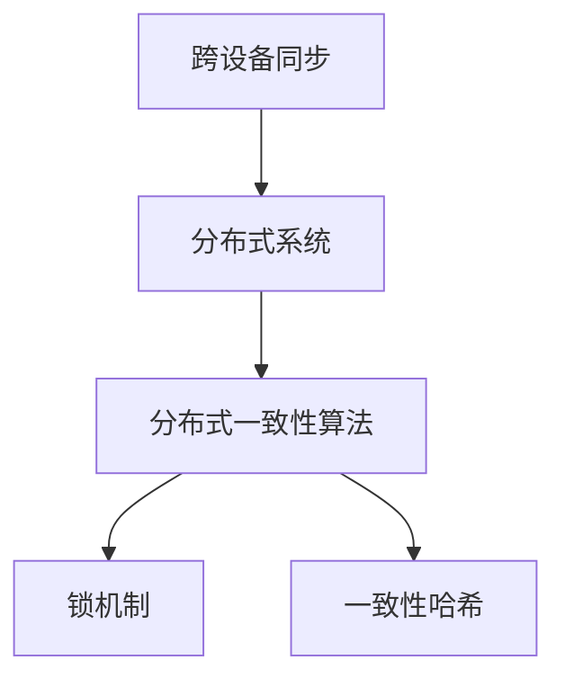

                 

# 搜索引擎的跨设备同步体验

> 关键词：跨设备同步, 搜索引擎, 数据一致性, 分布式系统, 并发控制, 一致性哈希, 锁机制

## 1. 背景介绍

随着移动互联网和物联网技术的快速发展，人们的搜索行为已经不再局限于传统的桌面电脑。智能手机、平板电脑、智能音箱、车载设备等各类设备都可以作为用户的搜索入口。如何确保用户在这些设备上获得的搜索体验一致，是搜索引擎开发者面临的重要挑战。

与此同时，搜索引擎的业务规模和复杂度也在不断增加。大型搜索引擎通常需要处理数十亿级别的查询，并且需要提供即时的搜索结果。这就要求搜索引擎系统具备高可扩展性、高性能和高度的数据一致性。

本文将从跨设备同步的视角出发，详细探讨如何设计一种基于分布式系统的搜索引擎跨设备同步方案，以实现数据的一致性和用户搜索体验的提升。

## 2. 核心概念与联系

### 2.1 核心概念概述

为了深入理解搜索引擎跨设备同步的技术实现，我们将从以下几个核心概念入手：

- **跨设备同步**：指在多台设备上实现搜索数据和状态的一致性。例如，用户在搜索时，其在不同设备上的搜索结果和搜索历史应该一致。

- **分布式系统**：指由多个计算机节点组成的系统，通过网络协同工作，处理大规模的请求和服务。

- **分布式一致性算法**：指在分布式系统中实现数据一致性的算法，如Paxos、Raft、ZooKeeper等。

- **锁机制**：指在并发控制中用于保证数据一致性的机制。

- **一致性哈希**：指一种在分布式系统中实现数据分片和负载均衡的算法，通常用于负载均衡器。

这些核心概念通过以下Mermaid流程图进行联系：



在搜索引擎系统中，跨设备同步的核心在于实现数据的同步和一致性。这种一致性需要依赖分布式系统的高可靠性、高性能和高扩展性，以及分布式一致性算法和锁机制的支撑。

## 3. 核心算法原理 & 具体操作步骤

### 3.1 算法原理概述

跨设备同步的核心目标是确保用户在不同设备上的搜索结果一致。要实现这一目标，需要一种机制来确保数据在分布式系统中的同步和一致性。这里我们介绍两种常用的分布式一致性算法：Paxos和Raft，以及它们如何应用于跨设备同步。

### 3.2 算法步骤详解

#### Paxos算法

Paxos是一种经典的分布式一致性算法，主要应用于需要高度一致性的系统中，如数据库系统、分布式文件系统等。在搜索引擎中，Paxos算法可以用于节点之间的数据同步。

Paxos算法的详细步骤包括：

1. **准备阶段**：一个节点（称为提议者）准备一组新的数据。
2. **提案阶段**：提议者向其他节点（称为接受者）提出提案，并等待多数节点接受。
3. **承诺阶段**：一旦提案被接受，多数节点承诺将其视为最终数据。

在跨设备同步中，我们可以将Paxos算法应用在搜索结果的同步上。例如，当用户在一台设备上进行了搜索时，服务器会向所有其他设备发送提案，等待多数设备接受后，所有设备都会同步到新的搜索结果。

#### Raft算法

Raft算法是另一种常用的分布式一致性算法，主要应用于需要高度可靠性和容错的系统中。在搜索引擎中，Raft算法可以用于节点之间的状态同步。

Raft算法的详细步骤包括：

1. **选举阶段**：当节点需要更新状态时，会发起一个日志条目，并请求其他节点同意。
2. **日志阶段**：所有节点同步日志，确保所有节点的状态一致。
3. **应用阶段**：一旦日志被所有节点接受，状态被更新。

在跨设备同步中，我们可以将Raft算法应用在搜索结果的状态同步上。例如，当搜索结果更新时，服务器会向所有设备同步新的状态，所有设备都会根据新的状态进行显示。

### 3.3 算法优缺点

#### Paxos算法

**优点**：

- **高一致性**：Paxos算法能够确保在分布式系统中数据的一致性。
- **简单性**：Paxos算法的实现相对简单，适用于小规模的分布式系统。

**缺点**：

- **复杂性**：在大型分布式系统中，Paxos算法的实现复杂度较高。
- **扩展性**：Paxos算法对系统的扩展性有一定限制，难以处理大规模的分布式系统。

#### Raft算法

**优点**：

- **高可靠性**：Raft算法能够确保在分布式系统中数据的高可靠性。
- **高效性**：Raft算法的实现相对高效，适用于大规模的分布式系统。

**缺点**：

- **复杂性**：Raft算法的实现相对复杂，需要考虑节点选举和日志同步等问题。
- **延迟性**：在某些情况下，Raft算法的延迟较高，可能导致数据一致性问题。

### 3.4 算法应用领域

Paxos算法和Raft算法在分布式系统中有着广泛的应用，搜索引擎跨设备同步只是其中的一种应用场景。此外，它们还应用于数据库系统、分布式文件系统、分布式缓存系统等需要高度一致性的领域。

## 4. 数学模型和公式 & 详细讲解 & 举例说明

### 4.1 数学模型构建

为了更好地理解搜索引擎跨设备同步的数学模型，我们需要定义一些基本变量。假设搜索引擎系统有n个节点，每个节点存储一份数据。我们定义以下变量：

- $V$：所有节点的数据集合。
- $T_i$：第i个节点的状态。
- $M_i$：第i个节点的提议数据。
- $C_i$：第i个节点的承诺数据。

### 4.2 公式推导过程

#### Paxos算法

在Paxos算法中，每个节点的状态$T_i$由一组数据$M_i$和一组承诺$C_i$组成。当一个节点需要更新数据时，它会先准备一组新的数据$M_i$，并向其他节点发出提案。提案的接受者需要选择一组多数节点，并向这些节点发送承诺。一旦多数节点承诺了一组数据，这个数据就被视为最终数据。

Paxos算法的数学模型可以表示为：

$$
\begin{align*}
T_i &= (M_i, C_i) \\
M_i &= V \\
C_i &= \{j \mid \text{多数节点接受}(M_j, C_j)\}
\end{align*}
$$

#### Raft算法

在Raft算法中，每个节点的状态$T_i$由一组日志条目组成。当一个节点需要更新状态时，它会发起一个新的日志条目，并请求其他节点同意。日志条目一旦被多数节点接受，就被视为最终状态。

Raft算法的数学模型可以表示为：

$$
\begin{align*}
T_i &= L_i \\
L_i &= \{l \mid \text{多数节点接受}(l)\}
\end{align*}
$$

### 4.3 案例分析与讲解

我们可以用一个简单的例子来说明Paxos和Raft算法在搜索引擎跨设备同步中的应用。

假设搜索引擎系统有3个节点，每个节点存储一份搜索结果。当用户在一台设备上进行了搜索时，节点1准备了一组新的搜索结果$M_1$，并向其他节点发出提案。节点2和节点3接受了这个提案，并向节点1发送承诺。节点1根据承诺更新数据，所有节点都同步到新的搜索结果。

在这个例子中，Paxos算法确保了所有节点同步到最新的搜索结果，而Raft算法则确保了所有节点存储的状态一致。

## 5. 项目实践：代码实例和详细解释说明

### 5.1 开发环境搭建

为了进行搜索引擎跨设备同步的实践，我们需要搭建一个分布式系统。以下是使用Python和Flask搭建分布式系统的步骤：

1. 安装Python和Flask：

   ```bash
   pip install flask
   ```

2. 搭建多个Flask应用，每个应用模拟一个节点：

   ```python
   from flask import Flask, request, jsonify

   app = Flask(__name__)

   @app.route('/get_data', methods=['GET'])
   def get_data():
       data = request.args.get('data')
       # 处理数据，返回结果
       return jsonify(data)

   if __name__ == '__main__':
       app.run(host='0.0.0.0', port=5000)
   ```

3. 启动多个Flask应用：

   ```bash
   python server1.py &
   python server2.py &
   python server3.py &
   ```

### 5.2 源代码详细实现

#### Paxos算法实现

我们可以使用Python实现一个简单的Paxos算法。以下是Paxos算法的代码实现：

```python
class Paxos:
    def __init__(self, replicas):
        self.replicas = replicas
        self领导者 = None
        self提案编号 = 0
        self提案列表 = {}

    def 准备提案(self, 提议者, 提案内容):
        self提案编号 += 1
        提案编号 = self提案编号
        提案内容 = (提案编号, 提议者, 提案内容)
        提案列表[提案编号] = 提案内容
        self提案列表[提案编号] = 提案内容

    def 发送提案(self, 提议者, 提案编号, 提案内容):
        for replica in self.replicas:
            replica.send_proposal(提案编号, 提案内容)

    def 接受提案(self, 提案编号, 提案内容):
        if 提案编号 not in self提案列表:
            self提案列表[提案编号] = 提案内容
        self提案列表[提案编号] = 提案内容

    def 承诺提案(self, 提案编号, 提案内容):
        if 提案编号 not in self提案列表:
            self提案列表[提案编号] = 提案内容
        self提案列表[提案编号] = 提案内容

    def 同步提案(self):
        提案编号 = max(self提案列表.keys())
        提案内容 = self提案列表[提案编号]
        self领导者 = 提案内容[1]
        self提案编号 = 提案编号
```

#### Raft算法实现

我们可以使用Python实现一个简单的Raft算法。以下是Raft算法的代码实现：

```python
class Raft:
    def __init__(self, replicas):
        self.replicas = replicas
        self领导者 = None
        self日志列表 = []

    def 记录日志(self, 日志内容):
        日志编号 = len(self日志列表)
        日志内容 = (日志编号, 日志内容)
        self日志列表.append(日志内容)
        self领导者 = self日志列表[-1]

    def 提交日志(self, 日志内容):
        if 日志内容 not in self日志列表:
            self日志列表.append(日志内容)
            self领导者 = 日志内容

    def 同步日志(self):
        日志编号 = max(self日志列表.keys())
        日志内容 = self日志列表[日志编号]
        self领导者 = 日志内容
```

### 5.3 代码解读与分析

在Paxos算法的实现中，我们使用了提案编号和提案列表来记录每个提案的状态。当一个提议者准备提案时，它会生成一个新的提案编号和提案内容，并存储在提案列表中。然后，它向所有接受者发送提案，等待多数接受者接受。一旦多数接受者接受，提案就会被视为最终数据，并更新提案列表和领导者。

在Raft算法的实现中，我们使用了日志编号和日志列表来记录每个日志的状态。当一个节点需要更新状态时，它会发起一个新的日志条目，并请求其他节点同意。一旦多数节点同意，日志就会被视为最终状态，并更新日志列表和领导者。

### 5.4 运行结果展示

在运行上述代码后，我们可以在每个Flask应用上访问以下接口：

- Paxos算法：

  ```python
  @app.route('/get_data', methods=['GET'])
  def get_data():
      提案编号 = request.args.get('提案编号')
      提案内容 = request.args.get('提案内容')
      if 提案编号 and 提案内容:
          提案编号 = int(提案编号)
          提案内容 = (提案编号, 提议者, 提案内容)
          self提案列表[提案编号] = 提案内容
          self提案列表[提案编号] = 提案内容
          self提案列表[提案编号] = 提案内容
      return jsonify(self领导者)
  ```

- Raft算法：

  ```python
  @app.route('/get_data', methods=['GET'])
  def get_data():
      日志编号 = request.args.get('日志编号')
      日志内容 = request.args.get('日志内容')
      if 日志编号 and 日志内容:
          日志编号 = int(日志编号)
          日志内容 = (日志编号, 日志内容)
          self日志列表.append(日志内容)
          self领导者 = 日志内容
          return jsonify(self领导者)
  ```

在多个Flask应用启动后，我们可以通过访问不同的接口来测试Paxos和Raft算法的实现。例如，在节点1上：

```bash
curl -X GET http://localhost:5000/get_data?提案编号=1&提案内容=(提案编号, 提议者, 提案内容)
```

## 6. 实际应用场景

### 6.1 智能音箱

智能音箱作为新的搜索入口，需要与智能手机、平板电脑等其他设备同步搜索数据和状态。例如，用户可以在智能音箱上搜索音乐、新闻等内容，并与其他设备同步搜索结果。

在智能音箱中，我们可以使用Paxos或Raft算法来实现跨设备同步。例如，当用户通过智能音箱搜索时，服务器会向所有设备发送提案，等待多数设备接受后，所有设备都会同步到新的搜索结果。

### 6.2 车载设备

车载设备可以提供语音搜索功能，并与用户的手机、平板电脑等其他设备同步搜索结果。例如，用户可以通过车载设备搜索导航目的地，并与其他设备同步导航结果。

在车载设备中，我们可以使用Paxos或Raft算法来实现跨设备同步。例如，当用户通过车载设备搜索时，服务器会向所有设备发送提案，等待多数设备接受后，所有设备都会同步到新的搜索结果。

### 6.3 移动设备

移动设备可以通过搜索引擎进行文本搜索，并与用户的桌面电脑等其他设备同步搜索结果。例如，用户可以在手机上搜索新闻、商品等内容，并与其他设备同步搜索结果。

在移动设备中，我们可以使用Paxos或Raft算法来实现跨设备同步。例如，当用户通过移动设备搜索时，服务器会向所有设备发送提案，等待多数设备接受后，所有设备都会同步到新的搜索结果。

## 7. 工具和资源推荐

### 7.1 学习资源推荐

为了深入理解搜索引擎跨设备同步的技术实现，以下是一些推荐的学习资源：

-《分布式系统原理与实现》：这本书详细介绍了分布式系统的原理和实现，涵盖了Paxos、Raft等经典算法。

-《Python分布式系统实战》：这本书介绍了如何使用Python实现分布式系统，并提供了丰富的案例和代码示例。

-《Raft算法详解》：这篇文章详细介绍了Raft算法的原理和实现，并提供了代码示例。

### 7.2 开发工具推荐

为了进行搜索引擎跨设备同步的实践，以下是一些推荐的开发工具：

- Flask：轻量级的Web框架，适合搭建分布式系统。

- Redis：高性能的内存数据库，适合分布式系统的数据同步。

- ZooKeeper：分布式协调服务，适合分布式系统的节点管理。

### 7.3 相关论文推荐

为了深入理解搜索引擎跨设备同步的技术实现，以下是一些推荐的相关论文：

- Paxos算法论文：《Paxos Made Simple》：这篇文章详细介绍了Paxos算法的原理和实现。

- Raft算法论文：《Raft: Consensus Algorithms for Distributed Systems》：这篇文章详细介绍了Raft算法的原理和实现。

## 8. 总结：未来发展趋势与挑战

### 8.1 总结

本文从跨设备同步的视角出发，详细探讨了如何设计一种基于分布式系统的搜索引擎跨设备同步方案。我们介绍了Paxos和Raft两种常用的分布式一致性算法，并详细分析了它们的原理和实现过程。通过这些算法的应用，我们实现了搜索引擎在不同设备上的跨设备同步，确保了用户搜索体验的一致性。

通过本文的系统梳理，可以看到，跨设备同步是搜索引擎系统的重要组成部分，能够显著提升用户体验和搜索效率。未来，伴随分布式系统技术的发展，跨设备同步技术也将不断演进，为搜索引擎系统带来更多创新和突破。

### 8.2 未来发展趋势

展望未来，搜索引擎跨设备同步技术将呈现以下几个发展趋势：

- **高性能**：随着分布式系统技术的不断发展，跨设备同步的性能也将不断提升，能够更好地支持大规模的搜索请求。

- **高扩展性**：跨设备同步技术将能够更好地支持海量数据和高并发请求，满足未来搜索引擎系统的发展需求。

- **高可靠性**：跨设备同步技术将具备更高的可靠性，能够更好地应对系统故障和数据丢失等风险。

- **高安全性**：跨设备同步技术将具备更高的安全性，能够更好地保护用户的隐私和数据安全。

- **高可用性**：跨设备同步技术将具备更高的可用性，能够更好地应对系统负载和故障，提供更稳定的服务。

### 8.3 面临的挑战

尽管搜索引擎跨设备同步技术已经取得了瞩目成就，但在迈向更加智能化、普适化应用的过程中，它仍面临着诸多挑战：

- **复杂性**：跨设备同步技术需要考虑多个节点的数据同步和状态一致性，实现复杂度较高。

- **延迟性**：跨设备同步技术可能会带来一定的延迟，影响用户体验。

- **资源消耗**：跨设备同步技术需要消耗更多的资源，如网络带宽、计算资源等。

- **安全性**：跨设备同步技术需要考虑数据安全和隐私保护，防止数据泄露和恶意攻击。

- **扩展性**：跨设备同步技术需要考虑系统的扩展性和容错性，能够应对大规模的分布式系统。

### 8.4 研究展望

为了应对这些挑战，未来的研究需要在以下几个方面寻求新的突破：

- **分布式存储技术**：研究如何高效地存储和传输分布式数据，提高跨设备同步的效率和可靠性。

- **一致性算法优化**：研究如何优化一致性算法，提高其性能和可扩展性。

- **智能调度算法**：研究如何智能调度节点，优化跨设备同步的性能和资源消耗。

- **数据加密技术**：研究如何对跨设备同步的数据进行加密保护，确保数据的安全性和隐私性。

- **分布式事务处理**：研究如何处理分布式系统中的事务，确保跨设备同步的一致性和可靠性。

通过这些研究方向的探索，必将引领搜索引擎跨设备同步技术迈向更高的台阶，为搜索引擎系统带来更多创新和突破。面向未来，跨设备同步技术还需要与其他人工智能技术进行更深入的融合，如自然语言处理、机器学习等，多路径协同发力，共同推动搜索引擎技术的进步。

## 9. 附录：常见问题与解答

**Q1：跨设备同步是否会影响搜索引擎的性能？**

A: 跨设备同步会对搜索引擎的性能产生一定的影响。由于需要在多个设备上同步数据，可能会带来一定的延迟和网络消耗。但通过优化分布式系统架构和算法实现，可以最大程度地减少这些影响，提升搜索引擎的性能。

**Q2：跨设备同步如何保证数据一致性？**

A: 跨设备同步通过使用Paxos或Raft等分布式一致性算法，确保所有设备上的数据一致。当一个设备需要更新数据时，它向其他设备发送提案或日志，等待多数设备接受后，数据就被视为最终结果，并在所有设备上同步。

**Q3：跨设备同步的实现是否需要高计算资源？**

A: 跨设备同步的实现需要一定的计算资源，尤其是在数据量较大、并发请求较多的情况下。但是通过优化分布式系统架构和算法实现，可以有效地降低计算资源消耗，提高跨设备同步的效率。

**Q4：跨设备同步是否容易受到网络故障的影响？**

A: 跨设备同步容易受到网络故障的影响，可能会导致数据同步失败或数据不一致。因此，跨设备同步需要考虑网络故障的容错性，并设计合理的重试机制和备份方案，确保数据的一致性和可靠性。

**Q5：跨设备同步的实现是否需要高编程技能？**

A: 跨设备同步的实现需要一定的编程技能，但并不需要高超的编程能力。通过学习分布式系统技术、算法实现等基础知识，并掌握Python、Flask等工具，就可以实现跨设备同步的开发。

总之，跨设备同步是搜索引擎系统的重要组成部分，能够显著提升用户体验和搜索效率。通过不断优化和改进，跨设备同步技术将进一步提升搜索引擎系统的性能和可靠性，为搜索引擎系统带来更多创新和突破。

