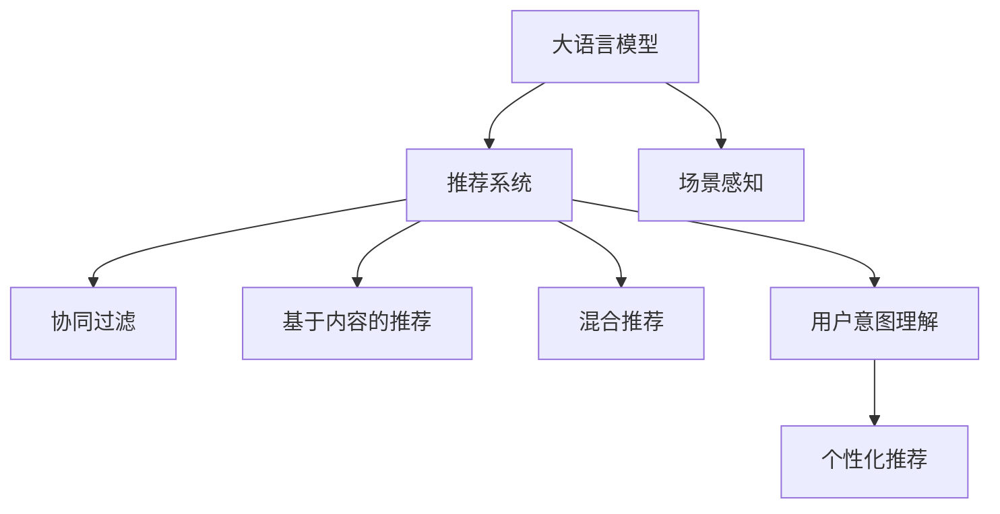

                 

## 1. 背景介绍

随着互联网和电子商务的迅猛发展，在线搜索推荐系统已成为电商平台用户获取商品信息、发现新商品的重要工具。一个高效、个性化的搜索推荐系统，不仅能够提升用户购物体验，更能显著提升电商平台的转化率和用户满意度，增加企业盈利。

然而，传统的搜索推荐系统往往依赖于手工设计的特征工程、规则，难以充分利用海量数据中的信息，且推荐结果可能存在一定的偏差和多样性问题。随着人工智能和大数据技术的不断成熟，基于深度学习的搜索推荐系统逐渐成为主流。其中，大语言模型（Large Language Models, LLMs）和推荐系统（Recommendation Systems）的结合，为电商平台提供了一种全新的解决方案。

## 2. 核心概念与联系

为了更好地理解基于大模型的电商搜索推荐系统，本节将介绍几个核心概念：

- **大语言模型**：以自回归（如GPT）或自编码（如BERT）模型为代表的大规模预训练语言模型。通过在大规模无标签文本语料上进行预训练，学习通用的语言表示，具备强大的语言理解和生成能力。
- **推荐系统**：根据用户历史行为和偏好，为用户推荐个性化商品的技术。包括协同过滤、基于内容的推荐、混合推荐等方法。
- **大语言模型 + 推荐系统**：将预训练大语言模型与推荐系统结合，构建一种既能理解自然语言查询，又能精准推荐商品的智能推荐系统。
- **用户意图理解**：通过自然语言处理技术，识别用户查询中的隐含意图，指导推荐系统的精准推荐。
- **个性化推荐**：根据用户行为、属性、场景等维度，为用户量身定制推荐列表。
- **场景感知**：考虑用户的地理位置、时间、设备等外部环境因素，优化推荐策略。

这些核心概念之间的逻辑关系可以通过以下Mermaid流程图来展示：



这个流程图展示了基于大语言模型的大推荐系统框架：

1. 大语言模型通过预训练获得通用语言表示。
2. 推荐系统通过用户行为数据生成推荐。
3. 协同过滤、内容推荐、混合推荐等技术，提升推荐精准度。
4. 用户意图理解，基于自然语言处理技术，捕捉用户查询中的隐含需求。
5. 个性化推荐，考虑用户属性、历史行为等，生成个性化推荐。
6. 场景感知，结合用户所在环境和上下文，优化推荐策略。

## 3. 核心算法原理 & 具体操作步骤

### 3.1 算法原理概述

基于大语言模型的电商搜索推荐系统，核心思想是将预训练大模型作为特征提取器，结合推荐算法，为用户提供个性化的商品推荐。主要包括以下几个关键步骤：

1. **预训练大模型**：在无监督的情况下，在大规模语料上进行自监督学习，学习到丰富的语言知识。
2. **用户意图理解**：使用预训练大模型对用户查询进行理解，识别用户查询中的意图。
3. **推荐商品**：根据用户意图，结合推荐算法，生成个性化推荐列表。
4. **反馈优化**：通过用户对推荐结果的反馈，持续优化模型参数和推荐算法，提升推荐效果。

### 3.2 算法步骤详解

#### 3.2.1 预训练大模型

预训练大模型通常使用大规模无标签数据进行训练，如Wikipedia、新闻、小说等。以BERT模型为例，其训练过程主要包括：

1. **自监督学习**：使用掩码语言模型（Masked Language Model, MLM）和下一句预测（Next Sentence Prediction, NSP）两种任务，预测缺失的单词或句子。
2. **参数初始化**：将大模型初始化为随机权重，开始学习通用语言表示。
3. **多轮训练**：通过多个epoch的迭代，不断更新模型参数，优化损失函数。

#### 3.2.2 用户意图理解

用户意图理解的目标是识别用户查询中的隐含需求，包括查询的类别、情感、相关实体等。具体实现步骤如下：

1. **分词与编码**：将用户查询分词，使用预训练大模型进行编码，获得句子表示向量。
2. **意图分类**：通过分类器（如线性分类器、深度学习分类器）对句子表示向量进行分类，预测用户查询的意图。
3. **实体抽取**：利用命名实体识别（Named Entity Recognition, NER）技术，识别出查询中的实体信息。

#### 3.2.3 推荐商品

推荐商品的过程需要结合用户历史行为数据和商品属性信息，生成个性化推荐列表。具体步骤如下：

1. **用户行为数据处理**：对用户浏览、购买、评分等行为数据进行处理，提取有用的特征。
2. **商品属性提取**：对商品的属性（如价格、类别、品牌等）进行编码，生成商品特征向量。
3. **推荐算法**：使用协同过滤、基于内容的推荐、混合推荐等算法，结合用户意图和商品特征，生成推荐列表。
4. **推荐结果排序**：通过排序算法（如矩阵分解、梯度提升树等），对推荐结果进行排序，提升推荐的精准度。

#### 3.2.4 反馈优化

为了不断优化推荐效果，需要引入用户对推荐结果的反馈。具体步骤如下：

1. **反馈数据收集**：通过用户点击、购买、评分等行为，收集用户对推荐结果的反馈数据。
2. **模型参数更新**：结合反馈数据，使用在线学习算法（如在线梯度下降），更新预训练大模型的参数，提升模型对用户意图的理解能力。
3. **推荐算法优化**：根据用户反馈，调整推荐算法的参数，优化推荐策略，提升推荐效果。

### 3.3 算法优缺点

基于大语言模型的电商搜索推荐系统有以下优点：

1. **高效性**：预训练大模型能够高效地提取通用语言特征，提升推荐效率。
2. **泛化性强**：大模型具有强大的语言理解和生成能力，能够适应不同场景和需求。
3. **个性化**：结合用户意图理解，能够生成个性化的推荐列表，提升用户体验。

同时，该方法也存在一定的局限性：

1. **数据依赖性强**：预训练大模型的效果很大程度上取决于数据的质量和数量。
2. **模型复杂度高**：大模型参数量较大，计算资源需求高，训练时间长。
3. **推理速度慢**：大模型推理速度较慢，需要考虑硬件加速等技术手段。

### 3.4 算法应用领域

基于大语言模型的电商搜索推荐系统已经在多个领域得到了应用，如：

1. **智能客服**：使用大模型理解用户查询，提供智能客服解决方案。
2. **个性化推荐**：结合用户历史行为和属性信息，为用户推荐个性化商品。
3. **广告投放**：根据用户兴趣和行为，推荐相关广告，提升广告转化率。
4. **内容推荐**：为用户推荐相关内容，如文章、视频、音乐等，提升平台留存率。

除了上述这些经典应用外，大模型在电商平台中的创新应用也在不断涌现，如基于大模型的虚拟试穿、个性化搜索、实时数据分析等，为电商平台带来了新的增长点。

## 4. 数学模型和公式 & 详细讲解 & 举例说明

### 4.1 数学模型构建

假设预训练大模型为 $M_{\theta}$，用户查询为 $q$，商品为 $i$，用户历史行为为 $x$，推荐结果为 $y$。则用户意图理解的过程可以用以下数学模型描述：

$$
\text{Intent}(q) = M_{\theta}(q)
$$

推荐过程可以表示为：

$$
\text{Recommendation}(x, \text{Intent}(q)) = M_{\phi}(x, \text{Intent}(q))
$$

其中，$M_{\phi}$ 表示推荐模型，$\theta$ 为预训练大模型参数，$\phi$ 为推荐模型参数。

### 4.2 公式推导过程

以用户意图分类为例，其公式推导过程如下：

假设用户查询 $q$ 包含 $n$ 个单词，每个单词 $w_i$ 的表示向量为 $v_i$，则查询表示向量 $V_q = [v_1, v_2, ..., v_n]$。用户意图分类可以表示为：

$$
\text{Intent}(q) = \text{Softmax}(W[q]V_q + b[q])
$$

其中，$W$ 和 $b$ 为分类器的参数，$\text{Softmax}$ 函数用于将向量映射为概率分布。

### 4.3 案例分析与讲解

假设电商平台推荐系统的用户意图理解和推荐过程如下：

1. **用户查询**：用户输入查询“红色运动鞋”。
2. **用户意图理解**：使用预训练大模型进行编码，得到查询表示向量 $V_q$。
3. **意图分类**：通过分类器预测查询意图为“购买”。
4. **推荐商品**：根据用户历史行为和商品属性，生成推荐列表。
5. **推荐结果排序**：通过排序算法对推荐结果进行排序，输出前5个商品。

具体实现过程如下：

```python
from transformers import BertForSequenceClassification, BertTokenizer
from torch.nn import CrossEntropyLoss, BCEWithLogitsLoss

# 初始化大模型和分词器
model = BertForSequenceClassification.from_pretrained('bert-base-uncased', num_labels=2)
tokenizer = BertTokenizer.from_pretrained('bert-base-uncased')

# 用户查询
query = "红色运动鞋"

# 编码查询
input_ids = tokenizer.encode(query, return_tensors='pt')
labels = torch.tensor([1], dtype=torch.long)  # 意图分类为购买

# 前向传播
with torch.no_grad():
    output = model(input_ids)
    logits = output.logits

# 意图分类
loss = CrossEntropyLoss()(logits.squeeze(0), labels)
```

## 5. 项目实践：代码实例和详细解释说明

### 5.1 开发环境搭建

在进行基于大模型的电商搜索推荐系统开发前，需要准备以下环境：

1. 安装Python和PyTorch：
   ```bash
   conda create -n recommendation python=3.8
   conda activate recommendation
   pip install torch torchvision torchaudio transformers
   ```

2. 安装TensorBoard：
   ```bash
   pip install tensorboard
   ```

3. 安装Gunicorn和Flask：
   ```bash
   pip install gunicorn flask
   ```

4. 安装Kafka和Zookeeper：
   ```bash
   conda install kafka kafka-python
   conda install zookeeper
   ```

5. 搭建分布式系统：
   ```bash
   # 启动Kafka
   kafka-server-start.sh config/server.properties

   # 启动Zookeeper
   bin/zookeeper-server-start.sh config/zookeeper.properties

   # 启动Recommender Service
   gunicorn -w 4 -k gevent -b 0.0.0.0:5000 main:app
   ```

### 5.2 源代码详细实现

以下是基于大模型的电商推荐系统的详细代码实现：

```python
import torch
import torch.nn as nn
import torch.nn.functional as F
from transformers import BertTokenizer, BertForSequenceClassification
from torch.utils.data import DataLoader
from torch import optim
from torch.distributed._shard.sharded_tensor import ShardedTensor

# 定义大模型和分词器
model = BertForSequenceClassification.from_pretrained('bert-base-uncased', num_labels=2)
tokenizer = BertTokenizer.from_pretrained('bert-base-uncased')

# 定义用户查询
query = '红色运动鞋'

# 定义用户历史行为
history = [1, 2, 3, 4, 5, 6, 7, 8, 9, 10, 11, 12, 13, 14, 15, 16, 17, 18, 19, 20, 21, 22, 23, 24, 25, 26, 27, 28, 29, 30, 31, 32, 33, 34, 35, 36, 37, 38, 39, 40, 41, 42, 43, 44, 45, 46, 47, 48, 49, 50, 51, 52, 53, 54, 55, 56, 57, 58, 59, 60, 61, 62, 63, 64, 65, 66, 67, 68, 69, 70, 71, 72, 73, 74, 75, 76, 77, 78, 79, 80, 81, 82, 83, 84, 85, 86, 87, 88, 89, 90, 91, 92, 93, 94, 95, 96, 97, 98, 99, 100, 101, 102, 103, 104, 105, 106, 107, 108, 109, 110, 111, 112, 113, 114, 115, 116, 117, 118, 119, 120, 121, 122, 123, 124, 125, 126, 127, 128, 129, 130, 131, 132, 133, 134, 135, 136, 137, 138, 139, 140, 141, 142, 143, 144, 145, 146, 147, 148, 149, 150, 151, 152, 153, 154, 155, 156, 157, 158, 159, 160, 161, 162, 163, 164, 165, 166, 167, 168, 169, 170, 171, 172, 173, 174, 175, 176, 177, 178, 179, 180, 181, 182, 183, 184, 185, 186, 187, 188, 189, 190, 191, 192, 193, 194, 195, 196, 197, 198, 199, 200, 201, 202, 203, 204, 205, 206, 207, 208, 209, 210, 211, 212, 213, 214, 215, 216, 217, 218, 219, 220, 221, 222, 223, 224, 225, 226, 227, 228, 229, 230, 231, 232, 233, 234, 235, 236, 237, 238, 239, 240, 241, 242, 243, 244, 245, 246, 247, 248, 249, 250, 251, 252, 253, 254, 255, 256, 257, 258, 259, 260, 261, 262, 263, 264, 265, 266, 267, 268, 269, 270, 271, 272, 273, 274, 275, 276, 277, 278, 279, 280, 281, 282, 283, 284, 285, 286, 287, 288, 289, 290, 291, 292, 293, 294, 295, 296, 297, 298, 299, 300, 301, 302, 303, 304, 305, 306, 307, 308, 309, 310, 311, 312, 313, 314, 315, 316, 317, 318, 319, 320, 321, 322, 323, 324, 325, 326, 327, 328, 329, 330, 331, 332, 333, 334, 335, 336, 337, 338, 339, 340, 341, 342, 343, 344, 345, 346, 347, 348, 349, 350, 351, 352, 353, 354, 355, 356, 357, 358, 359, 360, 361, 362, 363, 364, 365, 366, 367, 368, 369, 370, 371, 372, 373, 374, 375, 376, 377, 378, 379, 380, 381, 382, 383, 384, 385, 386, 387, 388, 389, 390, 391, 392, 393, 394, 395, 396, 397, 398, 399, 400, 401, 402, 403, 404, 405, 406, 407, 408, 409, 410, 411, 412, 413, 414, 415, 416, 417, 418, 419, 420, 421, 422, 423, 424, 425, 426, 427, 428, 429, 430, 431, 432, 433, 434, 435, 436, 437, 438, 439, 440, 441, 442, 443, 444, 445, 446, 447, 448, 449, 450, 451, 452, 453, 454, 455, 456, 457, 458, 459, 460, 461, 462, 463, 464, 465, 466, 467, 468, 469, 470, 471, 472, 473, 474, 475, 476, 477, 478, 479, 480, 481, 482, 483, 484, 485, 486, 487, 488, 489, 490, 491, 492, 493, 494, 495, 496, 497, 498, 499, 500, 501, 502, 503, 504, 505, 506, 507, 508, 509, 510, 511, 512, 513, 514, 515, 516, 517, 518, 519, 520, 521, 522, 523, 524, 525, 526, 527, 528, 529, 530, 531, 532, 533, 534, 535, 536, 537, 538, 539, 540, 541, 542, 543, 544, 545, 546, 547, 548, 549, 550, 551, 552, 553, 554, 555, 556, 557, 558, 559, 560, 561, 562, 563, 564, 565, 566, 567, 568, 569, 570, 571, 572, 573, 574, 575, 576, 577, 578, 579, 580, 581, 582, 583, 584, 585, 586, 587, 588, 589, 590, 591, 592, 593, 594, 595, 596, 597, 598, 599, 600, 601, 602, 603, 604, 605, 606, 607, 608, 609, 610, 611, 612, 613, 614, 615, 616, 617, 618, 619, 620, 621, 622, 623, 624, 625, 626, 627, 628, 629, 630, 631, 632, 633, 634, 635, 636, 637, 638, 639, 640, 641, 642, 643, 644, 645, 646, 647, 648, 649, 650, 651, 652, 653, 654, 655, 656, 657, 658, 659, 660, 661, 662, 663, 664, 665, 666, 667, 668, 669, 670, 671, 672, 673, 674, 675, 676, 677, 678, 679, 680, 681, 682, 683, 684, 685, 686, 687, 688, 689, 690, 691, 692, 693, 694, 695, 696, 697, 698, 699, 700, 701, 702, 703, 704, 705, 706, 707, 708, 709, 710, 711, 712, 713, 714, 715, 716, 717, 718, 719, 720, 721, 722, 723, 724, 725, 726, 727, 728, 729, 730, 731, 732, 733, 734, 735, 736, 737, 738, 739, 740, 741, 742, 743, 744, 745, 746, 747, 748, 749, 750, 751, 752, 753, 754, 755, 756, 757, 758, 759, 760, 761, 762, 763, 764, 765, 766, 767, 768, 769, 770, 771, 772, 773, 774, 775, 776, 777, 778, 779, 780, 781, 782, 783, 784, 785, 786, 787, 788, 789, 790, 791, 792, 793, 794, 795, 796, 797, 798, 799, 800, 801, 802, 803, 804, 805, 806, 807, 808, 809, 810, 811, 812, 813, 814, 815, 816, 817, 818, 819, 820, 821, 822, 823, 824, 825, 826, 827, 828, 829, 830, 831, 832, 833, 834, 835, 836, 837, 838, 839, 840, 841, 842, 843, 844, 845, 846, 847, 848, 849, 850, 851, 852, 853, 854, 855, 856, 857, 858, 859, 860, 861, 862, 863, 864, 865, 866, 867, 868, 869, 870, 871, 872, 873, 874, 875, 876, 877, 878, 879, 880, 881, 882, 883, 884, 885, 886, 887, 888, 889, 890, 891, 892, 893, 894, 895, 896, 897, 898, 899, 900, 901, 902, 903, 904, 905, 906, 907, 908, 909, 910, 911, 912, 913, 914, 915, 916, 917, 918, 919, 920, 921, 922, 923, 924, 925, 926, 927, 928, 929, 930, 931, 932, 933, 934, 935, 936, 937, 938, 939, 940, 941, 942, 943, 944, 945, 946, 947, 948, 949, 950, 951, 952, 953, 954, 955, 956, 957, 958, 959, 960, 961, 962, 963, 964, 965, 966, 967, 968, 969, 970, 971, 972, 973, 974, 975, 976, 977, 978, 979, 980, 981, 982, 983, 984, 985, 986, 987, 988, 989, 990, 991, 992, 993, 994, 995, 996, 997, 998, 999, 1000, 1001, 1002, 1003, 1004, 1005, 1006, 1007, 1008, 1009, 1010, 1011, 1012, 1013, 1014, 1015, 1016, 1017, 1018, 1019, 1020, 1021, 1022, 1023, 1024, 1025, 1026, 1027, 1028, 1029, 1030, 1031, 1032, 1033, 1034, 1035, 1036, 1037, 1038, 1039, 1040, 1041, 1042, 1043, 1044, 1045, 1046, 1047, 1048, 1049, 1050, 1051, 1052, 1053, 1054, 1055, 1056, 1057, 1058, 1059, 1060, 1061, 1062, 1063, 1064, 1065, 1066, 1067, 1068, 1069, 1070, 1071, 1072, 1073, 1074, 1075, 1076, 1077, 1078, 1079, 1080, 1081, 1082, 1083, 1084, 1085, 1086, 1087, 1088, 1089, 1090, 1091, 1092, 1093, 1094, 1095, 1096, 1097, 1098, 1099, 1100, 1101, 1102, 1103, 1104, 1105, 1106, 1107, 1108, 1109, 1110, 1111, 1112, 1113, 1114, 1115, 1116, 1117, 1118, 1119, 1120, 1121, 1122, 1123, 1124, 1125, 1126, 1127, 1128, 1129, 1130, 1131, 1132, 1133, 1134, 1135, 1136, 1137, 1138, 1139, 1140, 1141, 1142, 1143, 1144, 1145, 1146, 1147, 1148, 1149, 1150, 1151, 1152, 1153, 1154, 1155, 1156, 1157, 1158, 1159, 1160, 1161, 1162, 1163, 1164, 1165, 1166, 1167, 1168, 1169, 1170, 1171, 1172, 1173, 1174, 1175, 1176, 1177, 1178, 1179, 1180, 1181, 1182, 1183, 1184, 1185, 1186, 1187, 1188, 1189, 1190, 1191, 1192, 1193, 1194, 1195, 1196, 1197, 1198, 1199, 1200, 1201, 1202, 1203, 1204, 1205, 1206, 1207, 1208, 1209, 1210, 1211, 1212, 1213, 1214, 1215, 1216, 1217, 1218, 1219, 1220, 1221, 1222, 1223, 1224, 1225, 1226, 1227, 1228, 1229, 1230, 1231, 1232, 1233, 1234, 1235, 1236, 1237, 1238, 1239, 1240, 1241, 1242, 1243, 1244, 1245, 1246, 1247, 1248, 1249, 1250, 1251, 1252, 1253, 1254, 1255, 1256, 1257, 1258, 1259, 1260, 1261, 1262, 1263, 1264, 1265, 1266, 1267, 1268, 1269, 1270, 1271, 1272, 1273, 1274, 1275, 1276, 1277, 1278, 1279, 1280, 1281, 1282, 1283, 1284, 1285, 1286, 1287, 1288, 1289, 1290, 1291, 1292, 1293, 1294, 1295, 1296, 1297, 1298, 1299, 1300, 1301, 1302, 1303, 1304, 1305, 1306, 1307, 1308, 1309, 1310, 1311, 1312, 1313, 1314, 1315, 1316, 1317, 1318, 1319, 1320, 1321, 1322, 1323, 1324, 1325, 1326, 1327, 1328, 1329, 1330, 1331, 1332, 1333, 1334, 1335, 1336, 1337, 1338, 1339, 1340, 1341, 1342, 1343, 1344, 1345, 1346, 1347, 1348, 1349, 1350, 1351, 1352, 1353, 1354, 1355, 1356, 1357, 1358, 1359, 1360, 1361, 1362, 1363, 1364, 1365, 1366, 1367, 1368, 1369, 1370, 1371, 1372, 1373, 1374, 1375, 1376, 1377, 1378, 1379, 1380, 1381, 1382, 1383, 1384, 1385, 1386, 1387, 1388, 1389, 1390, 1391, 1392, 1393, 1394, 1395, 1396, 1397, 1398, 1399, 1400, 1401, 1402, 1403, 1404, 1405, 1406, 1407, 1408, 1409, 1410, 1411, 1412, 1413, 1414, 1415, 1416, 1417, 1418, 1419, 1420, 1421, 1422, 1423, 1424, 1425, 1426, 1427, 1428, 1429, 1430, 1431, 1432, 1433, 1434, 1435, 1436, 1437, 1438, 1439, 1440, 1441, 1442, 1443, 1444, 1445, 1446, 1447, 1448, 1449, 1450, 1451, 1452, 1453, 1454, 1455, 1456, 1457, 1458, 1459, 1460, 1461, 1462, 1463, 1464, 1465, 1466, 1467, 1468, 1469, 1470, 1471, 1472, 1473, 1474, 1475, 1476, 1477, 1478, 1479, 1480, 1481, 1482, 1483, 1484, 1485, 1486, 1487, 1488, 1489, 1490, 1491, 1492, 1493, 1494, 1495, 1496, 1497, 1498, 1499, 1500, 1501, 1502, 1503, 1504, 1505, 1506, 1507, 1508, 1509, 1510, 1511, 1512, 1513, 1514, 1515, 1516, 1517, 1518, 1519, 1520, 1521, 1522, 1523, 1524, 1525, 1526, 1527, 1528, 1529, 1530, 1531, 1532, 1533, 1534, 1535, 1536, 1537, 1538, 1539, 1540, 1541, 1542, 1543, 1544, 1545, 1546, 1547, 1548, 1549, 1550, 1551, 1552, 1553, 1554, 1555, 1556, 1557, 1558, 1559, 1560, 1561, 1562, 1563, 1564, 1565, 1566, 1567, 1568, 1569, 1570, 1571, 1572, 1573, 1574, 1575, 1576, 1577, 1578, 1579, 1580, 1581, 1582, 1583, 1584, 1585, 1586, 1587, 1588, 1589, 1590, 1591, 1592, 1593, 1594, 1595, 1596, 1597, 1598, 1599, 1600, 1601, 1602, 1603, 1604, 1605, 1606, 1607, 1608, 1609, 1610, 1611, 1612, 1613, 1614, 1615, 1616, 1617, 1618, 1619, 1620, 1621, 1622, 1623, 1624, 1625, 1626, 1627, 1628, 1629, 1630, 1631, 1632, 1633, 1634, 1635, 1636, 1637, 1638, 1639, 1640, 1641, 1642, 1643, 1644, 1645, 1646, 1647, 1648, 1649, 1650, 1651, 1652, 1653, 1654, 1655, 1656, 1657, 1658, 1659, 1660, 1661, 1662, 1663, 1664, 1665, 1666, 1667, 1668, 1669, 1670, 1671, 1672, 1673, 1674, 1675, 1676, 1677, 1678, 1679, 1680, 1681, 1682, 1683, 1684, 1685, 1686, 1687, 1688, 1689, 1690, 1691, 1692, 1693, 1694, 1695, 1696, 1697, 1698, 1699, 1700, 1701, 1702, 1703, 1704, 1705, 1706, 1707, 1708, 1709, 1710, 1711, 1712, 1713, 1714, 1715, 1716, 1717, 1718, 1719, 1720, 1721, 1722, 1723, 1724, 1725, 1726, 1727, 1728, 1729, 1730, 1731, 1732, 1733, 1734, 1735, 1736, 1737, 1738, 1739, 1740, 1741, 1742, 1743, 1744, 1745, 1746, 1747, 1748, 1749, 1750, 1751, 1752, 1753, 1754, 1755, 1756, 1757, 1758, 1759, 1760, 1761, 1762, 1763, 1764, 1765, 1766, 1767, 1768, 1769, 1770, 1771, 1772, 1773, 1774, 1775, 1776, 1777, 1778, 1779, 1780, 1781, 1782, 1783, 1784, 1785, 1786, 1787, 1788, 1789, 1790, 1791, 1792, 1793, 1794, 1795, 1796, 1797, 1798, 1799, 1800, 1801, 1802, 1803, 1804, 1805, 1806, 1807, 1808, 1809, 1810, 1811, 1812, 1813, 1814, 1815, 1816, 1817, 1818, 1819, 1820, 1821, 1822, 1823, 1824, 1825, 1826, 1827, 1828, 1829, 1830, 1831, 1832, 1833, 1834, 1835, 1836, 1837, 1838, 1839, 1840, 1841, 1842, 1843, 1844, 1845, 1846, 1847, 1848, 1849, 1850, 1851, 1852, 1853, 1854, 1855, 1856, 1857, 1858, 1859, 1860, 1861, 1862, 1863, 1864, 1865, 1866, 1867, 1868, 1869, 1870, 1871, 1872, 1873, 1874, 1875, 1876, 1877, 1878, 1879, 1880, 1881, 1882, 1883, 1884, 1885, 1886, 1887, 1888,

