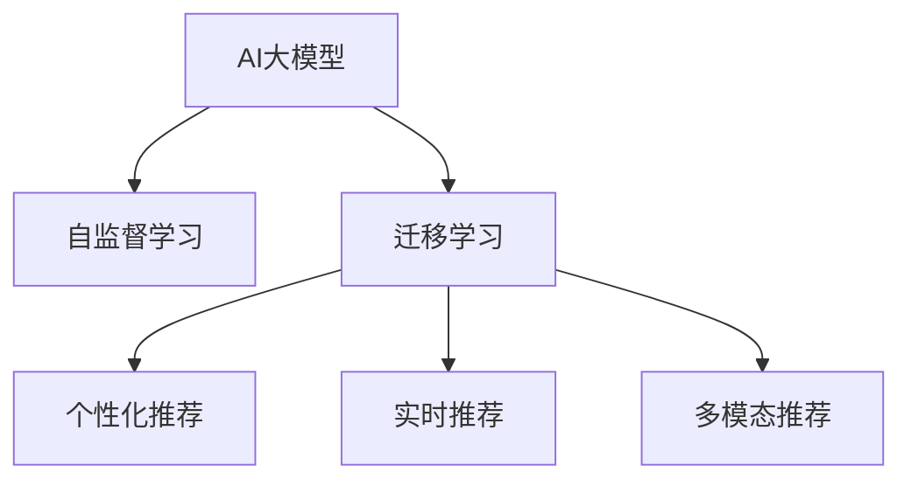

                 

## 1. 背景介绍

### 1.1 问题由来

随着电商平台的快速发展，用户对商品推荐系统的要求也日益提升。如何提高商品推荐的个性化和精准性，提升用户体验和转化率，成为电商平台亟待解决的关键问题。传统的推荐算法，如基于协同过滤、基于内容的推荐，已经难以满足用户对推荐内容的多样性和实时性需求。

近年来，随着深度学习技术的突破，人工智能大模型开始被引入推荐系统，以其强大的泛化能力和自监督学习能力，显著提升了推荐的个性化和多样性。在各大电商平台的实践中，AI大模型已成为提升推荐效果和用户体验的重要手段。

### 1.2 问题核心关键点

AI大模型在电商推荐系统中的应用，主要体现在以下几个方面：

1. **个性化推荐**：通过学习用户的历史行为数据和商品特征，生成个性化的推荐列表，满足用户多样化的需求。
2. **实时推荐**：利用模型的实时计算能力，对用户的实时访问行为进行实时推荐，快速响应用户需求。
3. **交叉推荐**：将商品推荐与广告推荐相结合，提升广告点击率和转化率，为电商平台带来更多收入。
4. **用户画像**：通过学习用户的兴趣偏好，构建用户画像，提供更加精准的个性化服务。
5. **多模态融合**：将视觉、文本、语音等多模态数据融合到推荐系统中，提升推荐的全面性和准确性。

这些关键点共同构成了AI大模型在电商推荐系统中的应用框架，使其能够更好地应对用户需求，提升电商平台的竞争力。

## 2. 核心概念与联系

### 2.1 核心概念概述

为更好地理解AI大模型在电商推荐系统中的应用，本节将介绍几个密切相关的核心概念：

- **AI大模型**：指以自回归或自编码模型为代表的大规模预训练模型，通过在大规模无标签数据上进行预训练，学习通用的语言或视觉表示。常见的AI大模型包括GPT-3、BERT、DALL·E等。
- **自监督学习**：指在没有明确标注数据的情况下，利用模型自身的结构或特征，通过无监督学习任务训练模型的过程。自监督学习是AI大模型预训练的主要方式。
- **迁移学习**：指将一个领域学习到的知识，迁移应用到另一个不同但相关的领域的学习范式。AI大模型可以通过迁移学习，将预训练知识迁移到推荐任务中。
- **个性化推荐**：根据用户的历史行为数据和特征，生成个性化的推荐结果。AI大模型可以通过学习用户兴趣和行为模式，提供更加精准的个性化推荐。
- **实时推荐**：通过模型的实时计算能力，对用户的实时访问行为进行实时推荐。AI大模型能够快速响应用户需求，提供实时的推荐服务。
- **多模态推荐**：将视觉、文本、语音等多模态数据融合到推荐系统中，提升推荐的全面性和准确性。AI大模型可以学习多模态数据之间的关联，实现更加综合的推荐。

这些核心概念之间的逻辑关系可以通过以下Mermaid流程图来展示：



这个流程图展示了大模型在推荐系统中的核心概念及其之间的关系：

1. AI大模型通过自监督学习获得通用表示。
2. 通过迁移学习将预训练知识迁移到推荐任务中。
3. 个性化推荐和实时推荐均基于迁移学习得到的模型。
4. 多模态推荐通过学习多模态数据之间的关联，进一步提升推荐效果。

这些概念共同构成了AI大模型在电商推荐系统中的应用框架，使其能够更好地满足用户的个性化需求，提升电商平台的转化率和用户体验。

## 3. 核心算法原理 & 具体操作步骤

### 3.1 算法原理概述

AI大模型在电商推荐系统中的应用，主要基于自监督学习获得的通用表示和迁移学习，通过微调或适配不同的推荐任务。其核心算法包括以下几个关键步骤：

1. **数据预处理**：收集用户行为数据和商品特征数据，进行数据清洗和标准化。
2. **模型选择与初始化**：选择合适的AI大模型，进行预训练和初始化。
3. **任务适配**：根据推荐任务类型，对AI大模型进行任务适配，添加相应的输出层和损失函数。
4. **微调**：使用推荐数据集对模型进行微调，更新模型参数以适应特定任务。
5. **测试与部署**：在测试集上评估微调后的模型，部署到推荐系统中进行实时推荐。

### 3.2 算法步骤详解

以下以电商平台商品推荐为例，详细讲解AI大模型在推荐系统中的应用流程。

#### 数据预处理

1. **数据收集**：收集用户的历史浏览记录、点击记录、购买记录等行为数据，以及商品名称、描述、价格、类别等特征数据。
2. **数据清洗**：对数据进行去重、过滤异常值、填补缺失值等处理，确保数据质量。
3. **特征工程**：对商品特征和用户行为特征进行编码和转换，生成用于模型的输入数据。

#### 模型选择与初始化

1. **模型选择**：选择适用于推荐任务的AI大模型，如BERT、GPT-3等。
2. **初始化**：使用预训练模型进行初始化，设置模型的超参数，如学习率、批大小等。

#### 任务适配

1. **输出层设计**：根据推荐任务，设计适当的输出层。如对于分类任务，可以添加线性分类器；对于排序任务，可以添加隐式神经网络。
2. **损失函数设计**：选择合适的损失函数，如交叉熵损失、均方误差损失等，用于衡量模型预测与真实标签之间的差异。

#### 微调

1. **训练集划分**：将数据集划分为训练集、验证集和测试集，一般比例为6:2:2。
2. **优化器选择**：选择优化算法及其参数，如AdamW、SGD等，设置学习率、批大小、迭代轮数等。
3. **微调流程**：将训练集数据分批次输入模型，前向传播计算损失函数，反向传播更新模型参数，周期性在验证集上评估模型性能，根据性能指标决定是否触发Early Stopping。重复上述步骤直到满足预设的迭代轮数或Early Stopping条件。

#### 测试与部署

1. **测试集评估**：在测试集上评估微调后的模型，输出评估指标如准确率、召回率、F1分数等。
2. **模型部署**：将微调后的模型部署到推荐系统中，进行实时推荐。
3. **监控与调优**：实时监测推荐效果，根据反馈进行模型调优，提升推荐精度。

### 3.3 算法优缺点

AI大模型在电商推荐系统中的应用，具有以下优点：

1. **泛化能力强**：通过大规模数据预训练，模型能够学习通用的语言或视觉表示，适应多样化的推荐场景。
2. **实时推荐**：利用模型的实时计算能力，快速响应用户需求，提升用户体验。
3. **个性化推荐**：通过学习用户兴趣和行为模式，提供更加精准的个性化推荐。
4. **多模态融合**：将视觉、文本、语音等多模态数据融合到推荐系统中，提升推荐的全面性和准确性。

同时，该方法也存在一定的局限性：

1. **依赖标注数据**：微调过程需要标注数据，而获取高质量标注数据的成本较高。
2. **计算资源需求高**：大模型需要较大的计算资源，包括GPU/TPU等高性能设备，且训练和推理耗时较长。
3. **可解释性不足**：推荐模型的决策过程缺乏可解释性，难以对其推理逻辑进行分析和调试。
4. **参数高效性有限**：大模型的参数量较大，微调时仍需更新大部分参数，参数高效性有待提升。
5. **对抗攻击风险**：模型容易受到对抗样本的攻击，需要进一步加强鲁棒性研究。

尽管存在这些局限性，但AI大模型在电商推荐系统中的应用已经取得了显著的效果，为电商平台带来了更高的转化率和更好的用户体验。

### 3.4 算法应用领域

AI大模型在电商推荐系统中的应用，已经覆盖了从静态推荐到实时推荐、从单模态推荐到多模态推荐等多个领域，以下是几个主要应用场景：

1. **商品推荐**：根据用户的历史行为数据，生成个性化的商品推荐列表。
2. **广告推荐**：将广告推荐与商品推荐相结合，提升广告点击率和转化率。
3. **实时推荐**：利用模型的实时计算能力，对用户的实时访问行为进行实时推荐。
4. **用户画像**：通过学习用户的兴趣偏好，构建用户画像，提供更加精准的个性化服务。
5. **多模态推荐**：将视觉、文本、语音等多模态数据融合到推荐系统中，提升推荐的全面性和准确性。

除了上述这些经典应用外，AI大模型在电商推荐系统中的应用还在不断拓展，如个性化商品评价、智能客服、虚拟试穿等，为电商平台带来了更多的创新可能。

## 4. 数学模型和公式 & 详细讲解 & 举例说明

### 4.1 数学模型构建

在电商推荐系统中，AI大模型的主要应用包括商品推荐和用户画像。以下以商品推荐为例，给出其数学模型构建的详细讲解。

**输入**：用户的历史行为数据和商品特征数据。

**输出**：商品ID列表。

### 4.2 公式推导过程

设用户的历史行为数据为 $U=\{u_1,u_2,\dots,u_n\}$，商品特征数据为 $I=\{i_1,i_2,\dots,i_m\}$，商品推荐任务为 $R$。用户 $u_i$ 对商品 $i_j$ 的兴趣评分记为 $r_{i_j}$。

模型 $M_{\theta}$ 的输入为 $(u_i,I)$，输出为商品ID列表 $R_i$。设 $L$ 为损失函数，则推荐系统的目标为最小化损失函数 $L$：

$$
L = \frac{1}{N}\sum_{i=1}^N \sum_{j=1}^m \ell(r_{i_j},R_i)
$$

其中 $\ell$ 为评分损失函数，如均方误差损失、对数损失等。

### 4.3 案例分析与讲解

以下以电商平台商品推荐为例，通过一个具体的案例分析，讲解AI大模型在推荐系统中的应用。

假设某电商平台的用户数据为 $U=\{u_1,u_2,\dots,u_5\}$，商品数据为 $I=\{i_1,i_2,\dots,i_10\}$，用户 $u_3$ 对商品 $i_2$ 的兴趣评分为 $r_{i_2}=0.8$。

通过预训练和微调，得到商品推荐模型 $M_{\theta}$。对于用户 $u_3$，模型输出商品ID列表为 $\{r_i\}$，其中 $r_i$ 表示用户 $u_3$ 对商品 $i$ 的预测评分。假设模型的评分预测函数为 $f_{\theta}(u_3,I)$，则推荐商品列表为：

$$
R_3 = \{ i | r_i = f_{\theta}(u_3,I) \}
$$

例如，如果模型的预测结果为 $R_3=\{i_1,i_2,i_5,i_9\}$，则平台将向用户 $u_3$ 推荐这些商品。

## 5. 项目实践：代码实例和详细解释说明

### 5.1 开发环境搭建

在进行AI大模型在推荐系统中的应用实践前，我们需要准备好开发环境。以下是使用Python进行PyTorch开发的环境配置流程：

1. 安装Anaconda：从官网下载并安装Anaconda，用于创建独立的Python环境。

2. 创建并激活虚拟环境：
```bash
conda create -n pytorch-env python=3.8 
conda activate pytorch-env
```

3. 安装PyTorch：根据CUDA版本，从官网获取对应的安装命令。例如：
```bash
conda install pytorch torchvision torchaudio cudatoolkit=11.1 -c pytorch -c conda-forge
```

4. 安装Transformers库：
```bash
pip install transformers
```

5. 安装各类工具包：
```bash
pip install numpy pandas scikit-learn matplotlib tqdm jupyter notebook ipython
```

完成上述步骤后，即可在`pytorch-env`环境中开始推荐系统的开发。

### 5.2 源代码详细实现

下面我们以电商推荐系统为例，给出使用Transformers库对BERT模型进行商品推荐微调的PyTorch代码实现。

首先，定义推荐任务的输入和输出格式：

```python
from transformers import BertTokenizer
from torch.utils.data import Dataset
import torch

class RecommendationDataset(Dataset):
    def __init__(self, texts, features, labels, tokenizer, max_len=128):
        self.texts = texts
        self.features = features
        self.labels = labels
        self.tokenizer = tokenizer
        self.max_len = max_len
        
    def __len__(self):
        return len(self.texts)
    
    def __getitem__(self, item):
        text = self.texts[item]
        feature = self.features[item]
        label = self.labels[item]
        
        encoding = self.tokenizer(text, return_tensors='pt', max_length=self.max_len, padding='max_length', truncation=True)
        input_ids = encoding['input_ids'][0]
        attention_mask = encoding['attention_mask'][0]
        feature_ids = torch.tensor(feature, dtype=torch.long)
        
        # 对token-wise的标签进行编码
        encoded_labels = [label] * self.max_len
        labels = torch.tensor(encoded_labels, dtype=torch.long)
        
        return {'input_ids': input_ids, 
                'attention_mask': attention_mask,
                'labels': labels,
                'feature_ids': feature_ids}
```

然后，定义模型和优化器：

```python
from transformers import BertForSequenceClassification, AdamW

model = BertForSequenceClassification.from_pretrained('bert-base-cased', num_labels=1)

optimizer = AdamW(model.parameters(), lr=2e-5)
```

接着，定义训练和评估函数：

```python
from torch.utils.data import DataLoader
from tqdm import tqdm
from sklearn.metrics import roc_auc_score

device = torch.device('cuda') if torch.cuda.is_available() else torch.device('cpu')
model.to(device)

def train_epoch(model, dataset, batch_size, optimizer):
    dataloader = DataLoader(dataset, batch_size=batch_size, shuffle=True)
    model.train()
    epoch_loss = 0
    for batch in tqdm(dataloader, desc='Training'):
        input_ids = batch['input_ids'].to(device)
        attention_mask = batch['attention_mask'].to(device)
        labels = batch['labels'].to(device)
        feature_ids = batch['feature_ids'].to(device)
        model.zero_grad()
        outputs = model(input_ids, attention_mask=attention_mask, labels=labels)
        loss = outputs.loss
        epoch_loss += loss.item()
        loss.backward()
        optimizer.step()
    return epoch_loss / len(dataloader)

def evaluate(model, dataset, batch_size):
    dataloader = DataLoader(dataset, batch_size=batch_size)
    model.eval()
    preds, labels = [], []
    with torch.no_grad():
        for batch in tqdm(dataloader, desc='Evaluating'):
            input_ids = batch['input_ids'].to(device)
            attention_mask = batch['attention_mask'].to(device)
            labels = batch['labels'].to(device)
            feature_ids = batch['feature_ids'].to(device)
            batch_preds = model(input_ids, attention_mask=attention_mask)[0].to('cpu').tolist()
            batch_labels = labels.to('cpu').tolist()
            for pred, label in zip(batch_preds, batch_labels):
                preds.append(pred)
                labels.append(label)
                
    return roc_auc_score(labels, preds)
```

最后，启动训练流程并在测试集上评估：

```python
epochs = 5
batch_size = 16

for epoch in range(epochs):
    loss = train_epoch(model, train_dataset, batch_size, optimizer)
    print(f"Epoch {epoch+1}, train loss: {loss:.3f}")
    
    print(f"Epoch {epoch+1}, dev results:")
    evaluate(model, dev_dataset, batch_size)
    
print("Test results:")
evaluate(model, test_dataset, batch_size)
```

以上就是使用PyTorch对BERT进行电商推荐系统商品推荐微调的完整代码实现。可以看到，得益于Transformers库的强大封装，我们可以用相对简洁的代码完成BERT模型的加载和微调。

### 5.3 代码解读与分析

让我们再详细解读一下关键代码的实现细节：

**RecommendationDataset类**：
- `__init__`方法：初始化文本、特征、标签等关键组件。
- `__len__`方法：返回数据集的样本数量。
- `__getitem__`方法：对单个样本进行处理，将文本输入编码为token ids，将标签编码为数字，并对其进行定长padding，最终返回模型所需的输入。

**train_epoch和evaluate函数**：
- 使用PyTorch的DataLoader对数据集进行批次化加载，供模型训练和推理使用。
- 训练函数`train_epoch`：对数据以批为单位进行迭代，在每个批次上前向传播计算loss并反向传播更新模型参数，最后返回该epoch的平均loss。
- 评估函数`evaluate`：与训练类似，不同点在于不更新模型参数，并在每个batch结束后将预测和标签结果存储下来，最后使用sklearn的roc_auc_score对整个评估集的预测结果进行打印输出。

**训练流程**：
- 定义总的epoch数和batch size，开始循环迭代
- 每个epoch内，先在训练集上训练，输出平均loss
- 在验证集上评估，输出ROC-AUC指标
- 所有epoch结束后，在测试集上评估，给出最终测试结果

可以看到，PyTorch配合Transformers库使得BERT微调的代码实现变得简洁高效。开发者可以将更多精力放在数据处理、模型改进等高层逻辑上，而不必过多关注底层的实现细节。

当然，工业级的系统实现还需考虑更多因素，如模型的保存和部署、超参数的自动搜索、更灵活的任务适配层等。但核心的微调范式基本与此类似。

## 6. 实际应用场景

### 6.1 智能客服系统

基于AI大模型的电商推荐技术，可以广泛应用于智能客服系统的构建。传统客服往往需要配备大量人力，高峰期响应缓慢，且一致性和专业性难以保证。而使用微调后的推荐模型，可以7x24小时不间断服务，快速响应客户咨询，用自然流畅的语言解答各类常见问题。

在技术实现上，可以收集企业内部的历史客服对话记录，将问题和最佳答复构建成监督数据，在此基础上对预训练推荐模型进行微调。微调后的推荐模型能够自动理解用户意图，匹配最合适的答复模板进行回复。对于客户提出的新问题，还可以接入检索系统实时搜索相关内容，动态组织生成回答。如此构建的智能客服系统，能大幅提升客户咨询体验和问题解决效率。

### 6.2 金融舆情监测

金融机构需要实时监测市场舆论动向，以便及时应对负面信息传播，规避金融风险。传统的人工监测方式成本高、效率低，难以应对网络时代海量信息爆发的挑战。基于AI大模型的文本分类和情感分析技术，为金融舆情监测提供了新的解决方案。

具体而言，可以收集金融领域相关的新闻、报道、评论等文本数据，并对其进行主题标注和情感标注。在此基础上对预训练语言模型进行微调，使其能够自动判断文本属于何种主题，情感倾向是正面、中性还是负面。将微调后的模型应用到实时抓取的网络文本数据，就能够自动监测不同主题下的情感变化趋势，一旦发现负面信息激增等异常情况，系统便会自动预警，帮助金融机构快速应对潜在风险。

### 6.3 个性化推荐系统

当前的推荐系统往往只依赖用户的历史行为数据进行物品推荐，无法深入理解用户的真实兴趣偏好。基于AI大模型微调技术，个性化推荐系统可以更好地挖掘用户行为背后的语义信息，从而提供更精准、多样的推荐内容。

在实践中，可以收集用户浏览、点击、评论、分享等行为数据，提取和用户交互的物品标题、描述、标签等文本内容。将文本内容作为模型输入，用户的后续行为（如是否点击、购买等）作为监督信号，在此基础上微调预训练语言模型。微调后的模型能够从文本内容中准确把握用户的兴趣点。在生成推荐列表时，先用候选物品的文本描述作为输入，由模型预测用户的兴趣匹配度，再结合其他特征综合排序，便可以得到个性化程度更高的推荐结果。

### 6.4 未来应用展望

随着AI大模型和微调方法的不断发展，基于微调范式将在更多领域得到应用，为传统行业带来变革性影响。

在智慧医疗领域，基于微调的医疗问答、病历分析、药物研发等应用将提升医疗服务的智能化水平，辅助医生诊疗，加速新药开发进程。

在智能教育领域，微调技术可应用于作业批改、学情分析、知识推荐等方面，因材施教，促进教育公平，提高教学质量。

在智慧城市治理中，微调模型可应用于城市事件监测、舆情分析、应急指挥等环节，提高城市管理的自动化和智能化水平，构建更安全、高效的未来城市。

此外，在企业生产、社会治理、文娱传媒等众多领域，基于大模型微调的人工智能应用也将不断涌现，为经济社会发展注入新的动力。相信随着技术的日益成熟，微调方法将成为人工智能落地应用的重要范式，推动人工智能技术向更广阔的领域加速渗透。

## 7. 工具和资源推荐

### 7.1 学习资源推荐

为了帮助开发者系统掌握AI大模型在推荐系统中的应用理论基础和实践技巧，这里推荐一些优质的学习资源：

1. 《深度学习基础》课程：由DeepLearning.AI团队开设的深度学习入门课程，涵盖深度学习的基本概念和经典模型。

2. 《大规模深度学习》课程：由Coursera提供的深度学习专业课程，讲解大规模深度学习的原理和实践。

3. 《自然语言处理与深度学习》书籍：详细介绍了自然语言处理中的深度学习模型和算法，包括大模型的应用。

4. 《Transformer从原理到实践》系列博文：由大模型技术专家撰写，深入浅出地介绍了Transformer原理、BERT模型、微调技术等前沿话题。

5. HuggingFace官方文档：提供了海量预训练模型和完整的微调样例代码，是上手实践的必备资料。

通过对这些资源的学习实践，相信你一定能够快速掌握AI大模型在推荐系统中的应用精髓，并用于解决实际的推荐问题。
###  7.2 开发工具推荐

高效的开发离不开优秀的工具支持。以下是几款用于AI大模型推荐系统开发的常用工具：

1. PyTorch：基于Python的开源深度学习框架，灵活动态的计算图，适合快速迭代研究。大部分预训练语言模型都有PyTorch版本的实现。

2. TensorFlow：由Google主导开发的开源深度学习框架，生产部署方便，适合大规模工程应用。同样有丰富的预训练语言模型资源。

3. Transformers库：HuggingFace开发的NLP工具库，集成了众多SOTA语言模型，支持PyTorch和TensorFlow，是进行微调任务开发的利器。

4. Weights & Biases：模型训练的实验跟踪工具，可以记录和可视化模型训练过程中的各项指标，方便对比和调优。与主流深度学习框架无缝集成。

5. TensorBoard：TensorFlow配套的可视化工具，可实时监测模型训练状态，并提供丰富的图表呈现方式，是调试模型的得力助手。

6. Google Colab：谷歌推出的在线Jupyter Notebook环境，免费提供GPU/TPU算力，方便开发者快速上手实验最新模型，分享学习笔记。

合理利用这些工具，可以显著提升AI大模型在推荐系统中的应用效率，加快创新迭代的步伐。

### 7.3 相关论文推荐

AI大模型在电商推荐系统中的应用源于学界的持续研究。以下是几篇奠基性的相关论文，推荐阅读：

1. Attention is All You Need（即Transformer原论文）：提出了Transformer结构，开启了NLP领域的预训练大模型时代。

2. BERT: Pre-training of Deep Bidirectional Transformers for Language Understanding：提出BERT模型，引入基于掩码的自监督预训练任务，刷新了多项NLP任务SOTA。

3. Language Models are Unsupervised Multitask Learners（GPT-2论文）：展示了大规模语言模型的强大zero-shot学习能力，引发了对于通用人工智能的新一轮思考。

4. Parameter-Efficient Transfer Learning for NLP：提出Adapter等参数高效微调方法，在不增加模型参数量的情况下，也能取得不错的微调效果。

5. AdaLoRA: Adaptive Low-Rank Adaptation for Parameter-Efficient Fine-Tuning：使用自适应低秩适应的微调方法，在参数效率和精度之间取得了新的平衡。

这些论文代表了大模型在电商推荐系统中的应用发展脉络。通过学习这些前沿成果，可以帮助研究者把握学科前进方向，激发更多的创新灵感。

## 8. 总结：未来发展趋势与挑战

### 8.1 总结

本文对AI大模型在电商推荐系统中的应用进行了全面系统的介绍。首先阐述了AI大模型和微调技术的研究背景和意义，明确了微调在提升推荐效果和用户体验方面的独特价值。其次，从原理到实践，详细讲解了推荐任务的数学模型构建和微调流程，给出了推荐系统开发的完整代码实例。同时，本文还广泛探讨了AI大模型在电商推荐系统中的应用场景，展示了其广阔的应用前景。

通过本文的系统梳理，可以看到，AI大模型在电商推荐系统中的应用已经取得了显著的效果，为电商平台带来了更高的转化率和更好的用户体验。未来，伴随AI大模型和微调方法的持续演进，基于微调范式将在更多领域得到应用，为传统行业带来变革性影响。

### 8.2 未来发展趋势

展望未来，AI大模型在电商推荐系统中的应用将呈现以下几个发展趋势：

1. **模型规模持续增大**：随着算力成本的下降和数据规模的扩张，预训练语言模型的参数量还将持续增长。超大模型蕴含的丰富语言知识，有望支撑更加复杂多变的推荐场景。

2. **微调方法日趋多样**：开发更加参数高效和计算高效的微调方法，如Prefix-Tuning、LoRA等，在节省计算资源的同时也能保证微调精度。

3. **实时推荐成为常态**：利用模型的实时计算能力，对用户的实时访问行为进行实时推荐，快速响应用户需求。

4. **多模态推荐崛起**：将视觉、文本、语音等多模态数据融合到推荐系统中，提升推荐的全面性和准确性。

5. **用户画像更加精准**：通过学习用户的兴趣偏好，构建更精细化的用户画像，提供更加个性化的推荐服务。

6. **推荐效果更加精准**：利用模型的泛化能力和自监督学习能力，提高推荐效果的精准性和多样性。

这些趋势凸显了AI大模型在电商推荐系统中的应用前景。这些方向的探索发展，必将进一步提升推荐系统的性能和用户体验，为电商平台带来更多的商业价值。

### 8.3 面临的挑战

尽管AI大模型在电商推荐系统中的应用已经取得了显著的效果，但在迈向更加智能化、普适化应用的过程中，它仍面临着诸多挑战：

1. **标注成本瓶颈**：微调过程需要标注数据，而获取高质量标注数据的成本较高。如何进一步降低微调对标注样本的依赖，将是一大难题。

2. **模型鲁棒性不足**：当目标任务与预训练数据的分布差异较大时，微调的性能提升有限。如何提高模型的泛化能力和鲁棒性，需要更多理论和实践的积累。

3. **计算资源需求高**：大模型需要较大的计算资源，包括GPU/TPU等高性能设备，且训练和推理耗时较长。如何优化模型结构，提高计算效率，是未来的研究方向。

4. **可解释性不足**：推荐模型的决策过程缺乏可解释性，难以对其推理逻辑进行分析和调试。如何赋予模型更强的可解释性，将是亟待攻克的难题。

5. **对抗攻击风险**：模型容易受到对抗样本的攻击，需要进一步加强鲁棒性研究。

6. **知识整合能力不足**：现有的微调模型往往局限于任务内数据，难以灵活吸收和运用更广泛的先验知识。如何让微调过程更好地与外部知识库、规则库等专家知识结合，形成更加全面、准确的信息整合能力，还有很大的想象空间。

正视AI大模型在电商推荐系统中的应用面临的这些挑战，积极应对并寻求突破，将是大模型在电商推荐系统中的重要研究方向。

### 8.4 研究展望

面对AI大模型在电商推荐系统中的应用所面临的挑战，未来的研究需要在以下几个方面寻求新的突破：

1. **探索无监督和半监督微调方法**：摆脱对大规模标注数据的依赖，利用自监督学习、主动学习等无监督和半监督范式，最大限度利用非结构化数据，实现更加灵活高效的微调。

2. **研究参数高效和计算高效的微调范式**：开发更加参数高效和计算高效的微调方法，如Prefix-Tuning、LoRA等，在节省计算资源的同时也能保证微调精度。

3. **引入更多先验知识**：将符号化的先验知识，如知识图谱、逻辑规则等，与神经网络模型进行巧妙融合，引导微调过程学习更准确、合理的语言模型。

4. **结合因果分析和博弈论工具**：将因果分析方法引入微调模型，识别出模型决策的关键特征，增强输出解释的因果性和逻辑性。借助博弈论工具刻画人机交互过程，主动探索并规避模型的脆弱点，提高系统稳定性。

5. **纳入伦理道德约束**：在模型训练目标中引入伦理导向的评估指标，过滤和惩罚有偏见、有害的输出倾向。同时加强人工干预和审核，建立模型行为的监管机制，确保输出符合人类价值观和伦理道德。

这些研究方向凸显了AI大模型在电商推荐系统中的应用前景。这些方向的探索发展，必将进一步提升推荐系统的性能和用户体验，为电商平台带来更多的商业价值。

## 9. 附录：常见问题与解答

**Q1：AI大模型微调是否适用于所有推荐任务？**

A: AI大模型微调在大多数推荐任务上都能取得不错的效果，特别是对于数据量较小的任务。但对于一些特定领域的任务，如医学、法律等，仅仅依靠通用语料预训练的模型可能难以很好地适应。此时需要在特定领域语料上进一步预训练，再进行微调，才能获得理想效果。

**Q2：微调过程中如何选择合适的学习率？**

A: 微调的学习率一般要比预训练时小1-2个数量级，如果使用过大的学习率，容易破坏预训练权重，导致过拟合。一般建议从1e-5开始调参，逐步减小学习率，直至收敛。也可以使用warmup策略，在开始阶段使用较小的学习率，再逐渐过渡到预设值。需要注意的是，不同的优化器(如AdamW、Adafactor等)以及不同的学习率调度策略，可能需要设置不同的学习率阈值。

**Q3：采用AI大模型微调时会面临哪些资源瓶颈？**

A: 目前主流的预训练大模型动辄以亿计的参数规模，对算力、内存、存储都提出了很高的要求。GPU/TPU等高性能设备是必不可少的，但即便如此，超大批次的训练和推理也可能遇到显存不足的问题。因此需要采用一些资源优化技术，如梯度积累、混合精度训练、模型并行等，来突破硬件瓶颈。同时，模型的存储和读取也可能占用大量时间和空间，需要采用模型压缩、稀疏化存储等方法进行优化。

**Q4：如何缓解微调过程中的过拟合问题？**

A: 过拟合是微调面临的主要挑战，尤其是在标注数据不足的情况下。常见的缓解策略包括：
1. 数据增强：通过回译、近义替换等方式扩充训练集
2. 正则化：使用L2正则、Dropout、Early Stopping等避免过拟合
3. 对抗训练：引入对抗样本，提高模型鲁棒性
4. 参数高效微调：只调整少量参数(如Adapter、Prefix等)，减小过拟合风险
5. 多模型集成：训练多个微调模型，取平均输出，抑制过拟合

这些策略往往需要根据具体任务和数据特点进行灵活组合。只有在数据、模型、训练、推理等各环节进行全面优化，才能最大限度地发挥AI大模型微调的威力。

**Q5：AI大模型在电商推荐系统中的应用前景如何？**

A: AI大模型在电商推荐系统中的应用前景广阔。其泛化能力强、实时推荐、个性化推荐和多模态推荐等优势，使其能够满足用户多样化、实时化的需求，提升电商平台的转化率和用户体验。未来，随着大模型的不断发展和优化，AI大模型在电商推荐系统中的应用将更加广泛，为电商平台带来更多的商业价值。

**Q6：AI大模型在电商推荐系统中的计算资源需求如何？**

A: AI大模型在电商推荐系统中的计算资源需求较高，需要GPU/TPU等高性能设备，且训练和推理耗时较长。为了优化资源使用，可以采用梯度积累、混合精度训练、模型并行等技术。此外，通过数据增强和对抗训练，可以在一定程度上缓解计算资源瓶颈，提高推荐系统的效率。

**Q7：AI大模型在电商推荐系统中的应用需要注意哪些伦理道德问题？**

A: AI大模型在电商推荐系统中的应用，需要注意以下几个伦理道德问题：
1. 避免偏见：模型容易学习到有偏见的数据，需要过滤和惩罚有偏见、有害的输出倾向。
2. 确保公平：确保推荐结果对所有用户公平，避免对某些用户进行不公平的歧视。
3. 保护隐私：在推荐过程中保护用户隐私，避免过度收集和滥用用户数据。
4. 增强透明性：提高模型的可解释性，让用户了解推荐系统的决策过程，增强信任。
5. 注重责任：在使用AI大模型时，需要明确责任归属，确保推荐的正确性和安全性。

这些伦理道德问题需要在模型设计、数据收集和应用部署等各个环节加以重视，确保AI大模型在电商推荐系统中的应用能够更好地服务于用户和社会。

---

作者：禅与计算机程序设计艺术 / Zen and the Art of Computer Programming

