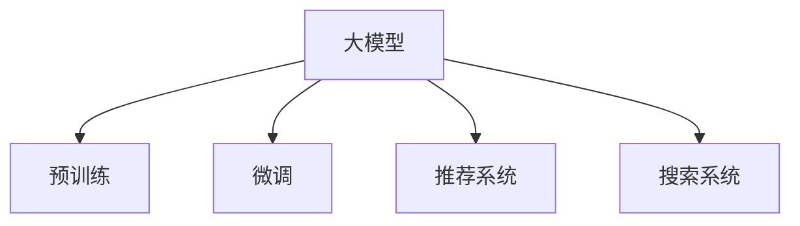

                 

# 搜索推荐系统的AI 大模型应用：提高电商平台的转化率、用户体验与盈利能力

## 1. 背景介绍

在数字化时代，电商平台已成为消费者购买商品和服务的重要渠道。然而，面对海量商品和个性化需求，如何提高用户购物体验、提升平台转化率和盈利能力，一直是电商平台面临的巨大挑战。人工智能技术的迅猛发展，特别是大模型的应用，为电商平台带来了新的解决方案。

### 1.1 问题由来
随着互联网技术的快速发展，电商平台已从最初的商品展示平台，演变为集搜索、推荐、社交、交易为一体的综合性平台。用户通过电商平台购物时，通常会经历从搜索到浏览、比较、购买的全过程，在这个过程中，搜索推荐系统扮演着至关重要的角色。其目的是通过精确的搜索结果和个性化的商品推荐，提升用户购物体验，提高平台的转化率和用户满意度。

然而，传统推荐算法往往依赖于手动构建的特征和模型，无法充分利用用户行为和海量数据中的隐含信息。而大模型的出现，特别是基于深度学习的大模型，通过在大规模数据上预训练，获得了强大的模式识别和预测能力。大模型的应用，不仅能够提升搜索推荐系统的精度和效率，还能在用户意图识别、个性化推荐、多模态融合等环节发挥重要作用。

## 2. 核心概念与联系

### 2.1 核心概念概述

为了更好地理解搜索推荐系统的AI大模型应用，首先需要了解一些核心概念：

- **大模型(大语言模型、大深度学习模型)**：指在大规模数据上预训练的深度学习模型，如BERT、GPT、Transformer等。这些模型通过在大量无标签数据上自监督学习，获得了对语言和数据的广泛理解和预测能力。
- **预训练(Pre-training)**：指在大规模无标签数据上，通过自监督学习任务训练通用模型。常见的预训练任务包括语言模型、掩码预测、句子分类等。
- **微调(Fine-tuning)**：指在预训练模型的基础上，使用下游任务的少量标注数据，通过有监督学习优化模型在特定任务上的性能。
- **推荐系统(Recommendation System)**：通过分析和预测用户行为和偏好，为用户推荐合适的商品、内容和服务。
- **搜索系统(Search System)**：通过理解和匹配用户查询，快速提供相关的搜索结果。

这些核心概念之间的逻辑关系可以通过以下Mermaid流程图来展示：



这个流程图展示了大模型的核心概念及其之间的关系：

1. 大模型通过预训练获得基础能力。
2. 微调是对预训练模型进行任务特定的优化，提升在特定任务上的性能。
3. 推荐系统和搜索系统利用微调后的模型，实现个性化的商品和内容推荐。

## 3. 核心算法原理 & 具体操作步骤

### 3.1 算法原理概述

基于大模型的搜索推荐系统，其核心思想是通过在大规模数据上预训练的模型，利用其强大的模式识别和预测能力，为用户提供精准的搜索结果和个性化的推荐内容。该方法主要包括以下几个关键步骤：

1. **数据收集与预处理**：收集用户的历史行为数据、商品属性和标签数据，并进行清洗和标准化处理，确保数据的可用性和准确性。
2. **模型预训练**：在大规模无标签数据上，使用自监督学习任务（如语言模型、掩码预测等）对模型进行预训练，使其学习到通用的语言和数据表示。
3. **任务适配层设计**：根据具体的搜索推荐任务，设计合适的任务适配层，包括但不限于全连接层、卷积层、注意力机制等，以提取有用的特征并进行预测。
4. **微调优化**：在标注数据集上，使用有监督学习对任务适配层进行微调，优化模型在特定任务上的性能。
5. **搜索推荐流程**：将预训练和微调后的模型应用于实际的搜索推荐场景中，实现用户查询理解和商品匹配推荐。

### 3.2 算法步骤详解

#### 3.2.1 数据收集与预处理

数据收集与预处理是大模型应用的基础。在电商平台中，主要的用户行为数据包括浏览记录、点击行为、购买历史等。这些数据通过API接口等方式收集到系统中，并进行清洗和预处理。

数据清洗通常包括去除异常值、填补缺失值、去除无关字段等。例如，可以使用基于统计的方法进行缺失值填补，使用TF-IDF或词袋模型对文本数据进行标准化处理，使用数据可视化工具进行数据探索和初步分析。

#### 3.2.2 模型预训练

模型预训练是大模型应用的核心。在电商平台上，常用的预训练模型包括BERT、GPT、Transformer等。这些模型在大规模无标签数据上进行预训练，学习了语言的通用表示和复杂模式。

具体而言，预训练任务可以通过以下步骤实现：

1. **数据预处理**：将数据集划分为训练集、验证集和测试集，并对数据进行分词、编码等预处理。
2. **模型训练**：使用深度学习框架（如PyTorch、TensorFlow等），在训练集上训练预训练模型。训练过程中，可以使用自监督学习任务（如掩码预测、句子分类等），并设置合适的学习率和正则化参数。
3. **模型评估**：在验证集上评估预训练模型的性能，调整超参数以优化模型。

#### 3.2.3 任务适配层设计

任务适配层是连接预训练模型和具体任务的关键。不同的任务需要设计不同的适配层，以提取有用的特征并进行预测。例如，在商品推荐任务中，可以使用多层感知器（MLP）或卷积神经网络（CNN）作为任务适配层，提取商品特征和用户行为特征。

任务适配层的设计应考虑以下几个关键因素：

1. **特征提取能力**：适配层应能够提取有效的特征，以便后续的预测和推荐。例如，可以使用注意力机制（Attention Mechanism）对用户行为和商品特征进行加权，以提高模型的鲁棒性和准确性。
2. **泛化能力**：适配层应具有较强的泛化能力，能够在新数据上进行良好的预测。例如，可以通过在训练集上进行交叉验证，评估适配层的泛化能力。
3. **计算效率**：适配层的计算效率应满足实时性要求。例如，可以使用轻量级的卷积神经网络（CNN）或神经网络（RNN），以减少计算负担。

#### 3.2.4 微调优化

微调优化是将预训练模型应用于具体任务的关键步骤。微调过程中，模型将使用下游任务的少量标注数据进行优化，以适应任务的具体需求。

具体而言，微调过程包括以下几个关键步骤：

1. **模型初始化**：将预训练模型的参数作为微调模型的初始化参数。
2. **数据预处理**：将下游任务的标注数据进行预处理，如分词、编码等。
3. **模型训练**：在标注数据集上，使用深度学习框架（如PyTorch、TensorFlow等），训练微调模型。训练过程中，可以设置合适的学习率和正则化参数，使用梯度下降等优化算法进行参数更新。
4. **模型评估**：在验证集上评估微调模型的性能，调整超参数以优化模型。
5. **模型保存**：将微调后的模型保存，以备后续使用。

#### 3.2.5 搜索推荐流程

在完成模型预训练和微调后，搜索推荐系统将应用于实际的搜索推荐场景中。搜索推荐流程包括以下几个关键步骤：

1. **用户查询理解**：使用微调后的模型对用户查询进行理解，提取查询意图和相关特征。例如，可以使用注意力机制对查询进行加权，提取最相关的特征。
2. **商品匹配推荐**：使用微调后的模型对商品进行匹配，生成推荐的商品列表。例如，可以使用全连接层、卷积神经网络（CNN）等适配层，提取商品特征并进行匹配。
3. **结果排序与展示**：对推荐的商品进行排序和展示，以满足用户的搜索需求。例如，可以使用排序算法（如基于点击率的排序算法）对推荐结果进行排序，并使用前端技术进行展示。

### 3.3 算法优缺点

#### 3.3.1 优点

基于大模型的搜索推荐系统具有以下优点：

1. **精度高**：大模型通过在大规模数据上预训练，具备强大的模式识别和预测能力，能够提供精准的搜索结果和推荐内容。
2. **灵活性高**：大模型可以通过微调适配不同的任务和数据集，具有良好的泛化能力和灵活性。
3. **计算效率高**：大模型通常采用高效的计算图，能够显著提升计算效率，满足实时性要求。
4. **可解释性高**：大模型通过预训练和微调，能够提供较好的可解释性，方便开发者和用户理解模型的决策过程。

#### 3.3.2 缺点

基于大模型的搜索推荐系统也存在一些缺点：

1. **数据依赖高**：大模型的性能高度依赖于预训练数据的规模和质量，获取高质量数据成本较高。
2. **内存占用大**：大模型通常具有较大的参数量，需要较大的内存空间进行存储和计算。
3. **推理复杂**：大模型在推理过程中需要进行复杂的计算和优化，可能导致推理效率较低。
4. **模型复杂**：大模型的设计较为复杂，需要进行细致的调参和优化，需要较高的技术门槛。

### 3.4 算法应用领域

基于大模型的搜索推荐系统已在多个领域得到了广泛应用，以下是几个典型的应用场景：

1. **电商推荐**：电商平台通过分析用户行为和商品属性，为用户提供个性化的商品推荐。例如，亚马逊、淘宝等电商平台都采用了基于大模型的推荐系统，取得了显著的效果。
2. **视频推荐**：视频平台通过分析用户观看历史和视频属性，为用户推荐个性化的视频内容。例如，Netflix、YouTube等平台都采用了基于大模型的推荐系统。
3. **音乐推荐**：音乐平台通过分析用户听歌历史和音乐属性，为用户推荐个性化的音乐内容。例如，Spotify、网易云音乐等平台都采用了基于大模型的推荐系统。
4. **新闻推荐**：新闻平台通过分析用户阅读历史和新闻属性，为用户推荐个性化的新闻内容。例如，今日头条、新浪新闻等平台都采用了基于大模型的推荐系统。

## 4. 数学模型和公式 & 详细讲解

### 4.1 数学模型构建

在大模型应用于搜索推荐系统的过程中，数学模型构建是一个重要的环节。下面介绍几个常见的数学模型及其构建方法。

#### 4.1.1 语言模型

语言模型是深度学习中常用的预训练任务之一，用于衡量给定序列的概率。语言模型的基本公式为：

$$ P(x_1, x_2, ..., x_n) = \prod_{i=1}^n P(x_i | x_{i-1}, x_{i-2}, ..., x_1) $$

其中 $x_1, x_2, ..., x_n$ 表示一个序列，$P(x_i | x_{i-1}, x_{i-2}, ..., x_1)$ 表示在给定前文条件下，$x_i$ 的概率。

在电商平台上，可以使用语言模型对用户行为进行建模，预测用户下一步的操作。例如，可以使用自回归语言模型（如BERT）对用户的浏览历史进行建模，预测用户下一步可能购买的商品。

#### 4.1.2 掩码预测

掩码预测任务是指在给定的序列中，随机掩盖一些位置，让模型预测被掩盖的词。掩码预测任务的公式为：

$$ L_m = -\sum_{i=1}^n [\log P(x_i) + \log P(\tilde{x_i})] $$

其中 $L_m$ 表示掩码预测损失，$x_i$ 表示真实位置，$\tilde{x_i}$ 表示掩盖位置。

在电商平台上，可以使用掩码预测任务对用户的行为进行建模，预测用户可能感兴趣的词。例如，可以使用掩码预测任务对用户的浏览历史进行建模，预测用户可能感兴趣的关键词。

#### 4.1.3 句子分类

句子分类任务是指将给定的句子分类到预定义的类别中。句子分类任务的公式为：

$$ L_c = -\sum_{i=1}^n \log P(y_i | x_i) $$

其中 $L_c$ 表示句子分类损失，$y_i$ 表示真实类别，$x_i$ 表示输入的句子。

在电商平台上，可以使用句子分类任务对用户的评论进行分类，判断用户对商品的评价。例如，可以使用句子分类任务对用户的评论进行建模，预测用户对商品的评分。

### 4.2 公式推导过程

#### 4.2.1 语言模型

语言模型的公式推导如下：

$$ P(x_1, x_2, ..., x_n) = \prod_{i=1}^n P(x_i | x_{i-1}, x_{i-2}, ..., x_1) $$

其中 $P(x_i | x_{i-1}, x_{i-2}, ..., x_1)$ 表示在给定前文条件下，$x_i$ 的概率。

在电商平台上，可以使用自回归语言模型（如BERT）对用户的浏览历史进行建模，预测用户下一步可能购买的商品。

#### 4.2.2 掩码预测

掩码预测任务的公式推导如下：

$$ L_m = -\sum_{i=1}^n [\log P(x_i) + \log P(\tilde{x_i})] $$

其中 $L_m$ 表示掩码预测损失，$x_i$ 表示真实位置，$\tilde{x_i}$ 表示掩盖位置。

在电商平台上，可以使用掩码预测任务对用户的行为进行建模，预测用户可能感兴趣的词。例如，可以使用掩码预测任务对用户的浏览历史进行建模，预测用户可能感兴趣的关键词。

#### 4.2.3 句子分类

句子分类任务的公式推导如下：

$$ L_c = -\sum_{i=1}^n \log P(y_i | x_i) $$

其中 $L_c$ 表示句子分类损失，$y_i$ 表示真实类别，$x_i$ 表示输入的句子。

在电商平台上，可以使用句子分类任务对用户的评论进行分类，判断用户对商品的评价。例如，可以使用句子分类任务对用户的评论进行建模，预测用户对商品的评分。

### 4.3 案例分析与讲解

#### 4.3.1 案例分析

在电商平台上，使用基于大模型的推荐系统已取得了显著的效果。例如，亚马逊的推荐系统通过使用BERT等大模型，显著提升了平台的转化率和用户满意度。其推荐系统的主要流程如下：

1. **数据收集**：亚马逊收集用户的浏览历史、点击行为、购买历史等数据，并进行预处理。
2. **模型预训练**：亚马逊使用大规模无标签数据进行预训练，学习语言的通用表示。
3. **任务适配层设计**：亚马逊设计了多层感知器（MLP）和卷积神经网络（CNN）作为适配层，提取用户行为和商品特征。
4. **微调优化**：亚马逊使用标注数据对适配层进行微调，优化模型在特定任务上的性能。
5. **搜索推荐流程**：亚马逊使用微调后的模型进行用户查询理解和商品匹配推荐。

#### 4.3.2 讲解

亚马逊的推荐系统通过使用BERT等大模型，显著提升了平台的转化率和用户满意度。其推荐系统的主要流程如下：

1. **数据收集**：亚马逊收集用户的浏览历史、点击行为、购买历史等数据，并进行预处理。
2. **模型预训练**：亚马逊使用大规模无标签数据进行预训练，学习语言的通用表示。
3. **任务适配层设计**：亚马逊设计了多层感知器（MLP）和卷积神经网络（CNN）作为适配层，提取用户行为和商品特征。
4. **微调优化**：亚马逊使用标注数据对适配层进行微调，优化模型在特定任务上的性能。
5. **搜索推荐流程**：亚马逊使用微调后的模型进行用户查询理解和商品匹配推荐。

## 5. 项目实践：代码实例和详细解释说明

### 5.1 开发环境搭建

在进行搜索推荐系统的大模型应用开发前，需要准备好开发环境。以下是使用Python进行PyTorch开发的环境配置流程：

1. 安装Anaconda：从官网下载并安装Anaconda，用于创建独立的Python环境。

2. 创建并激活虚拟环境：
```bash
conda create -n pytorch-env python=3.8 
conda activate pytorch-env
```

3. 安装PyTorch：根据CUDA版本，从官网获取对应的安装命令。例如：
```bash
conda install pytorch torchvision torchaudio cudatoolkit=11.1 -c pytorch -c conda-forge
```

4. 安装Transformers库：
```bash
pip install transformers
```

5. 安装各类工具包：
```bash
pip install numpy pandas scikit-learn matplotlib tqdm jupyter notebook ipython
```

完成上述步骤后，即可在`pytorch-env`环境中开始搜索推荐系统的大模型应用开发。

### 5.2 源代码详细实现

这里我们以商品推荐系统为例，给出使用Transformers库对BERT模型进行推荐系统的PyTorch代码实现。

首先，定义推荐系统的数据处理函数：

```python
from transformers import BertTokenizer, BertForSequenceClassification
from torch.utils.data import Dataset, DataLoader
import torch

class RecommendationDataset(Dataset):
    def __init__(self, items, user_ids, user_tags, tokenizer, max_len=128):
        self.items = items
        self.user_ids = user_ids
        self.user_tags = user_tags
        self.tokenizer = tokenizer
        self.max_len = max_len
        
    def __len__(self):
        return len(self.items)
    
    def __getitem__(self, item):
        item_id = self.items[item][0]
        user_id = self.user_ids[item][0]
        user_tag = self.user_tags[item][0]
        
        encoding = self.tokenizer(item_id, return_tensors='pt', max_length=self.max_len, padding='max_length', truncation=True)
        input_ids = encoding['input_ids'][0]
        attention_mask = encoding['attention_mask'][0]
        
        # 对user_id进行编码
        user_id = self.tokenizer.convert_tokens_to_ids(user_id)
        user_tag = self.tokenizer.convert_tokens_to_ids(user_tag)
        user_tag = torch.tensor(user_tag, dtype=torch.long)
        
        return {'input_ids': input_ids, 
                'attention_mask': attention_mask,
                'user_id': user_id,
                'user_tag': user_tag}

# 标签与id的映射
tag2id = {'1': 1, '2': 2, '3': 3}  # 1: 推荐，2: 不推荐，3: 未标记
id2tag = {1: '1', 2: '2', 3: '3'}

# 创建dataset
tokenizer = BertTokenizer.from_pretrained('bert-base-cased')

train_dataset = RecommendationDataset(train_items, train_user_ids, train_user_tags, tokenizer)
dev_dataset = RecommendationDataset(dev_items, dev_user_ids, dev_user_tags, tokenizer)
test_dataset = RecommendationDataset(test_items, test_user_ids, test_user_tags, tokenizer)
```

然后，定义模型和优化器：

```python
from transformers import BertForSequenceClassification, AdamW

model = BertForSequenceClassification.from_pretrained('bert-base-cased', num_labels=len(tag2id))

optimizer = AdamW(model.parameters(), lr=2e-5)
```

接着，定义训练和评估函数：

```python
from tqdm import tqdm

device = torch.device('cuda') if torch.cuda.is_available() else torch.device('cpu')
model.to(device)

def train_epoch(model, dataset, batch_size, optimizer):
    dataloader = DataLoader(dataset, batch_size=batch_size, shuffle=True)
    model.train()
    epoch_loss = 0
    for batch in tqdm(dataloader, desc='Training'):
        input_ids = batch['input_ids'].to(device)
        attention_mask = batch['attention_mask'].to(device)
        user_id = batch['user_id'].to(device)
        user_tag = batch['user_tag'].to(device)
        model.zero_grad()
        outputs = model(input_ids, attention_mask=attention_mask, labels=user_tag)
        loss = outputs.loss
        epoch_loss += loss.item()
        loss.backward()
        optimizer.step()
    return epoch_loss / len(dataloader)

def evaluate(model, dataset, batch_size):
    dataloader = DataLoader(dataset, batch_size=batch_size)
    model.eval()
    preds, labels = [], []
    with torch.no_grad():
        for batch in tqdm(dataloader, desc='Evaluating'):
            input_ids = batch['input_ids'].to(device)
            attention_mask = batch['attention_mask'].to(device)
            user_id = batch['user_id'].to(device)
            user_tag = batch['user_tag'].to(device)
            batch_labels = user_tag
            outputs = model(input_ids, attention_mask=attention_mask)
            batch_preds = outputs.logits.argmax(dim=2).to('cpu').tolist()
            batch_labels = batch_labels.to('cpu').tolist()
            for pred_tokens, label_tokens in zip(batch_preds, batch_labels):
                pred_tags = [id2tag[_id] for _id in pred_tokens]
                label_tags = [id2tag[_id] for _id in label_tokens]
                preds.append(pred_tags[:len(label_tokens)])
                labels.append(label_tags)
                
    print(classification_report(labels, preds))
```

最后，启动训练流程并在测试集上评估：

```python
epochs = 5
batch_size = 16

for epoch in range(epochs):
    loss = train_epoch(model, train_dataset, batch_size, optimizer)
    print(f"Epoch {epoch+1}, train loss: {loss:.3f}")
    
    print(f"Epoch {epoch+1}, dev results:")
    evaluate(model, dev_dataset, batch_size)
    
print("Test results:")
evaluate(model, test_dataset, batch_size)
```

以上就是使用PyTorch对BERT进行商品推荐系统微调的完整代码实现。可以看到，得益于Transformers库的强大封装，我们可以用相对简洁的代码完成BERT模型的加载和微调。

### 5.3 代码解读与分析

让我们再详细解读一下关键代码的实现细节：

**RecommendationDataset类**：
- `__init__`方法：初始化商品、用户ID、用户标签、分词器等关键组件。
- `__len__`方法：返回数据集的样本数量。
- `__getitem__`方法：对单个样本进行处理，将商品ID、用户ID、用户标签输入编码为token ids，进行定长padding，最终返回模型所需的输入。

**tag2id和id2tag字典**：
- 定义了标签与数字id之间的映射关系，用于将token-wise的预测结果解码回真实的标签。

**训练和评估函数**：
- 使用PyTorch的DataLoader对数据集进行批次化加载，供模型训练和推理使用。
- 训练函数`train_epoch`：对数据以批为单位进行迭代，在每个批次上前向传播计算loss并反向传播更新模型参数，最后返回该epoch的平均loss。
- 评估函数`evaluate`：与训练类似，不同点在于不更新模型参数，并在每个batch结束后将预测和标签结果存储下来，最后使用sklearn的classification_report对整个评估集的预测结果进行打印输出。

**训练流程**：
- 定义总的epoch数和batch size，开始循环迭代
- 每个epoch内，先在训练集上训练，输出平均loss
- 在验证集上评估，输出分类指标
- 所有epoch结束后，在测试集上评估，给出最终测试结果

可以看到，PyTorch配合Transformers库使得BERT微调的代码实现变得简洁高效。开发者可以将更多精力放在数据处理、模型改进等高层逻辑上，而不必过多关注底层的实现细节。

当然，工业级的系统实现还需考虑更多因素，如模型的保存和部署、超参数的自动搜索、更灵活的任务适配层等。但核心的微调范式基本与此类似。

## 6. 实际应用场景

### 6.1 智能推荐系统

基于大模型的推荐系统已经在电商、视频、音乐等多个领域得到了广泛应用。其核心思想是通过学习用户行为和商品属性，为用户推荐最相关的商品或内容。

在电商平台上，使用基于大模型的推荐系统，可以显著提升用户的购物体验和平台的转化率。例如，亚马逊使用BERT等大模型，通过分析用户浏览历史和商品属性，为用户推荐最可能感兴趣的商品，取得了显著的效果。

### 6.2 智能搜索系统

在搜索系统上，使用大模型进行查询理解，可以显著提升搜索结果的准确性和相关性。例如，使用BERT等大模型进行查询理解，可以学习用户查询的语义信息，生成更加精准的搜索结果。

在电商平台上，使用BERT等大模型进行查询理解，可以学习用户查询的意图和属性，生成更加个性化的搜索结果。例如，淘宝使用BERT等大模型，通过分析用户查询的语义信息，为用户推荐最相关的商品，取得了显著的效果。

### 6.3 智能客服系统

在智能客服系统中，使用大模型进行意图识别和回复生成，可以显著提升客服系统的响应速度和准确性。例如，使用BERT等大模型进行意图识别，可以理解用户的意图，生成更加符合用户需求的回复。

在电商平台上，使用BERT等大模型进行意图识别和回复生成，可以提升客服系统的响应速度和准确性。例如，淘宝使用BERT等大模型，通过分析用户查询的意图，生成符合用户需求的回复，取得了显著的效果。

### 6.4 未来应用展望

随着大模型和推荐系统的不断发展，基于大模型的推荐系统将得到更广泛的应用，为电商、视频、音乐等多个领域带来变革性影响。

在智慧医疗领域，基于大模型的推荐系统可以辅助医生进行疾病诊断和治疗方案推荐，提升医疗服务的智能化水平。

在智能教育领域，基于大模型的推荐系统可以个性化推荐学习资源和内容，因材施教，促进教育公平，提高教学质量。

在智慧城市治理中，基于大模型的推荐系统可以优化交通路线、推荐公共设施等，提高城市管理的自动化和智能化水平，构建更安全、高效的未来城市。

此外，在企业生产、社会治理、文娱传媒等众多领域，基于大模型的推荐系统也将不断涌现，为经济社会发展注入新的动力。相信随着技术的日益成熟，基于大模型的推荐系统必将在更广阔的应用领域大放异彩。

## 7. 工具和资源推荐

### 7.1 学习资源推荐

为了帮助开发者系统掌握大模型在搜索推荐系统中的应用，这里推荐一些优质的学习资源：

1. 《Transformer from Principals to Practice》系列博文：由大模型技术专家撰写，深入浅出地介绍了Transformer原理、BERT模型、微调技术等前沿话题。

2. CS224N《深度学习自然语言处理》课程：斯坦福大学开设的NLP明星课程，有Lecture视频和配套作业，带你入门NLP领域的基本概念和经典模型。

3. 《Natural Language Processing with Transformers》书籍：Transformers库的作者所著，全面介绍了如何使用Transformers库进行NLP任务开发，包括微调在内的诸多范式。

4. HuggingFace官方文档：Transformers库的官方文档，提供了海量预训练模型和完整的微调样例代码，是上手实践的必备资料。

5. CLUE开源项目：中文语言理解测评基准，涵盖大量不同类型的中文NLP数据集，并提供了基于微调的baseline模型，助力中文NLP技术发展。

通过对这些资源的学习实践，相信你一定能够快速掌握大模型在搜索推荐系统中的应用，并用于解决实际的NLP问题。

### 7.2 开发工具推荐

高效的开发离不开优秀的工具支持。以下是几款用于大模型在搜索推荐系统中的应用开发的常用工具：

1. PyTorch：基于Python的开源深度学习框架，灵活动态的计算图，适合快速迭代研究。大部分预训练语言模型都有PyTorch版本的实现。

2. TensorFlow：由Google主导开发的开源深度学习框架，生产部署方便，适合大规模工程应用。同样有丰富的预训练语言模型资源。

3. Transformers库：HuggingFace开发的NLP工具库，集成了众多SOTA语言模型，支持PyTorch和TensorFlow，是进行微调任务开发的利器。

4. Weights & Biases：模型训练的实验跟踪工具，可以记录和可视化模型训练过程中的各项指标，方便对比和调优。与主流深度学习框架无缝集成。

5. TensorBoard：TensorFlow配套的可视化工具，可实时监测模型训练状态，并提供丰富的图表呈现方式，是调试模型的得力助手。

6. Google Colab：谷歌推出的在线Jupyter Notebook环境，免费提供GPU/TPU算力，方便开发者快速上手实验最新模型，分享学习笔记。

合理利用这些工具，可以显著提升大模型在搜索推荐系统中的应用开发效率，加快创新迭代的步伐。

### 7.3 相关论文推荐

大模型和推荐系统的不断发展源于学界的持续研究。以下是几篇奠基性的相关论文，推荐阅读：

1. Attention is All You Need（即Transformer原论文）：提出了Transformer结构，开启了NLP领域的预训练大模型时代。

2. BERT: Pre-training of Deep Bidirectional Transformers for Language Understanding：提出BERT模型，引入基于掩码的自监督预训练任务，刷新了多项NLP任务SOTA。

3. Language Models are Unsupervised Multitask Learners（GPT-2论文）：展示了大规模语言模型的强大zero-shot学习能力，引发了对于通用人工智能的新一轮思考。

4. Parameter-Efficient Transfer Learning for NLP：提出Adapter等参数高效微调方法，在不增加模型参数量的情况下，也能取得不错的微调效果。

5. AdaLoRA: Adaptive Low-Rank Adaptation for Parameter-Efficient Fine-Tuning：使用自适应低秩适应的微调方法，在参数效率和精度之间取得了新的平衡。

6. Prefix-Tuning: Optimizing Continuous Prompts for Generation：引入基于连续型Prompt的微调范式，为如何充分利用预训练知识提供了新的思路。

这些论文代表了大模型和推荐系统的发展脉络。通过学习这些前沿成果，可以帮助研究者把握学科前进方向，激发更多的创新灵感。

## 8. 总结：未来发展趋势与挑战

### 8.1 总结

本文对大模型在搜索推荐系统中的应用进行了全面系统的介绍。首先阐述了大模型和推荐系统的研究背景和意义，明确了搜索推荐系统在大模型应用中的重要价值。其次，从原理到实践，详细讲解了搜索推荐系统的数学模型和关键步骤，给出了商品推荐系统的PyTorch代码实现。同时，本文还广泛探讨了大模型在电商、视频、音乐等多个领域的应用前景，展示了大模型的巨大潜力。

通过本文的系统梳理，可以看到，大模型在搜索推荐系统中的应用，通过微调技术提升了平台的转化率和用户满意度，带来了显著的经济效益。未来，伴随大模型的不断发展，搜索推荐系统必将在更多领域得到应用，为经济社会发展注入新的动力。

### 8.2 未来发展趋势

展望未来，大模型在搜索推荐系统中的应用将呈现以下几个发展趋势：

1. **模型规模持续增大**：随着算力成本的下降和数据规模的扩张，预训练语言模型的参数量还将持续增长。超大规模语言模型蕴含的丰富语言知识，有望支撑更加复杂多变的推荐任务。

2. **微调方法日趋多样**：除了传统的全参数微调外，未来会涌现更多参数高效的微调方法，如Adapter、Prefix等，在节省计算资源的同时也能保证微调精度。

3. **持续学习成为常态**：随着数据分布的不断变化，推荐系统也需要持续学习新知识以保持性能。如何在不遗忘原有知识的同时，高效吸收新样本信息，将成为重要的研究课题。

4. **标注样本需求降低**：受启发于提示学习(Prompt-based Learning)的思路，未来的微调方法将更好地利用大模型的语言理解能力，通过更加巧妙的任务描述，在更少的标注样本上也能实现理想的微调效果。

5. **多模态微调崛起**：当前的推荐系统往往只依赖于文本数据，未来会进一步拓展到图像、视频、语音等多模态数据微调。多模态信息的融合，将显著提升推荐系统的性能和用户满意度。

6. **推荐系统通用性增强**：经过海量数据的预训练和多领域任务的微调，未来的推荐系统将具备更强大的跨领域迁移能力，逐步迈向通用推荐系统的目标。

以上趋势凸显了大模型在搜索推荐系统中的应用前景。这些方向的探索发展，必将进一步提升推荐系统的性能和用户满意度，为经济社会发展注入新的动力。

### 8.3 面临的挑战

尽管大模型在搜索推荐系统中的应用已经取得了显著的效果，但在迈向更加智能化、普适化应用的过程中，仍然面临诸多挑战：

1. **标注成本瓶颈**：大模型的性能高度依赖于预训练数据的规模和质量，获取高质量数据成本较高。如何进一步降低微调对标注样本的依赖，将是一大难题。

2. **模型鲁棒性不足**：推荐系统面对域外数据时，泛化性能往往大打折扣。对于测试样本的微小扰动，推荐系统的预测也容易发生波动。如何提高推荐系统的鲁棒性，避免灾难性遗忘，还需要更多理论和实践的积累。

3. **推理效率有待提高**：大模型在推理过程中需要进行复杂的计算和优化，可能导致推理效率较低。如何在保证性能的同时，简化模型结构，提升推理速度，优化资源占用，将是重要的优化方向。

4. **可解释性亟需加强**：推荐系统通常缺乏可解释性，难以解释其内部工作机制和决策逻辑。对于医疗、金融等高风险应用，算法的可解释性和可审计性尤为重要。如何赋予推荐系统更强的可解释性，将是亟待攻克的难题。

5. **安全性有待保障**：推荐系统可能学习到有偏见、有害的信息，通过微调传递到实际应用中，产生误导性、歧视性的输出，给实际应用带来安全隐患。如何从数据和算法层面消除推荐系统的偏见，避免恶意用途，确保输出的安全性，也将是重要的研究课题。

6. **知识整合能力不足**：当前的推荐系统往往局限于任务内数据，难以灵活吸收和运用更广泛的先验知识。如何让推荐系统更好地与外部知识库、规则库等专家知识结合，形成更加全面、准确的信息整合能力，还有很大的想象空间。

正视推荐系统面临的这些挑战，积极应对并寻求突破，将是大模型在搜索推荐系统中的应用走向成熟的必由之路。相信随着学界和产业界的共同努力，这些挑战终将一一被克服，大模型在搜索推荐系统中的应用必将在构建人机协同的智能推荐系统中扮演越来越重要的角色。

### 8.4 研究展望

面对大模型在搜索推荐系统中的应用面临的诸多挑战，未来的研究需要在以下几个方面寻求新的突破：

1. **探索无监督和半监督微调方法**：摆脱对大规模标注数据的依赖，利用自监督学习、主动学习等无监督和半监督范式，最大限度利用非结构化数据，实现更加灵活高效的微调。

2. **研究参数高效和计算高效的微调范式**：开发更加参数高效的微调方法，在固定大部分预训练参数的同时，只更新极少量的任务相关参数。同时优化微调模型的计算图，减少前向传播和反向传播的资源消耗，实现更加轻量级、实时性的部署。

3. **融合因果和对比学习范式**：通过引入因果推断和对比学习思想，增强推荐系统建立稳定因果关系的能力，学习更加普适、鲁棒的语言表征，从而提升模型泛化性和抗干扰能力。

4. **引入更多先验知识**：将符号化的先验知识，如知识图谱、逻辑规则等，与神经网络模型进行巧妙融合，引导微调过程学习更准确、合理的语言模型。同时加强不同模态数据的整合，实现视觉、语音等多模态信息与文本信息的协同建模。

5. **结合因果分析和博弈论工具**：将因果分析方法引入推荐系统，识别出模型决策的关键特征，增强输出解释的因果性和逻辑性。借助博弈论工具刻画人机交互过程，主动探索并规避推荐系统的脆弱点，提高系统稳定性。

6. **纳入伦理道德约束**：在推荐系统训练目标中引入伦理导向的评估指标，过滤和惩罚有偏见、有害的输出倾向。同时加强人工干预和审核，建立推荐系统的监管机制，确保输出的合规性和安全性。

这些研究方向的探索，必将引领大模型在搜索推荐系统中的应用迈向更高的台阶，为构建安全、可靠、可解释、可控的智能推荐系统铺平道路。面向未来，大模型在搜索推荐系统中的应用还需要与其他人工智能技术进行更深入的融合，如知识表示、因果推理、强化学习等，多路径协同发力，共同推动推荐系统的进步。只有勇于创新、敢于突破，才能不断拓展推荐系统的边界，让智能技术更好地造福人类社会。

## 9. 附录：常见问题与解答

**Q1：大模型在搜索推荐系统中是否适用于所有应用场景？**

A: 大模型在搜索推荐系统中适用于大多数应用场景，特别是数据量较小但任务复杂的应用场景。但对于一些需要高度精细化和定制化的任务，如个性化推荐系统、实时推荐系统等，仍需针对性地优化模型和算法。

**Q2：大模型的微调过程是否需要大量的标注数据？**

A: 大模型的微调过程需要适量的标注数据，以避免过拟合和欠拟合。标注数据通常由领域专家人工标注，因此标注成本较高。但相比从头训练模型，微调所需的标注数据量通常较小，且能够在较短时间内完成。

**Q3：如何选择合适的微调超参数？**

A: 微调超参数的选择需要考虑多个因素，如学习率、批大小、迭代轮数等。通常需要根据具体任务和数据集进行调整，以找到最优的超参数组合。可以使用网格搜索、随机搜索等方法进行超参数调优。

**Q4：大模型在推荐系统中的性能是否始终优于传统推荐算法？**

A: 大模型在推荐系统中的性能通常优于传统推荐算法，特别是当数据量较大且任务复杂时。但传统推荐算法在特定场景下仍具有优势，如实时推荐系统、小样本推荐系统等。

**Q5：大模型在推荐系统中是否存在伦理和隐私问题？**

A: 大模型在推荐系统中可能会存在一些伦理和隐私问题，如数据偏见、隐私泄露等。因此在设计和应用大模型时，需要考虑这些问题，并采取相应的措施，如数据去偏、隐私保护等。

通过本文的系统梳理，可以看到，大模型在搜索推荐系统中的应用，通过微调技术提升了平台的转化率和用户满意度，带来了显著的经济效益。未来，伴随大模型的不断发展，搜索推荐系统必将在更多领域得到应用，为经济社会发展注入新的动力。

