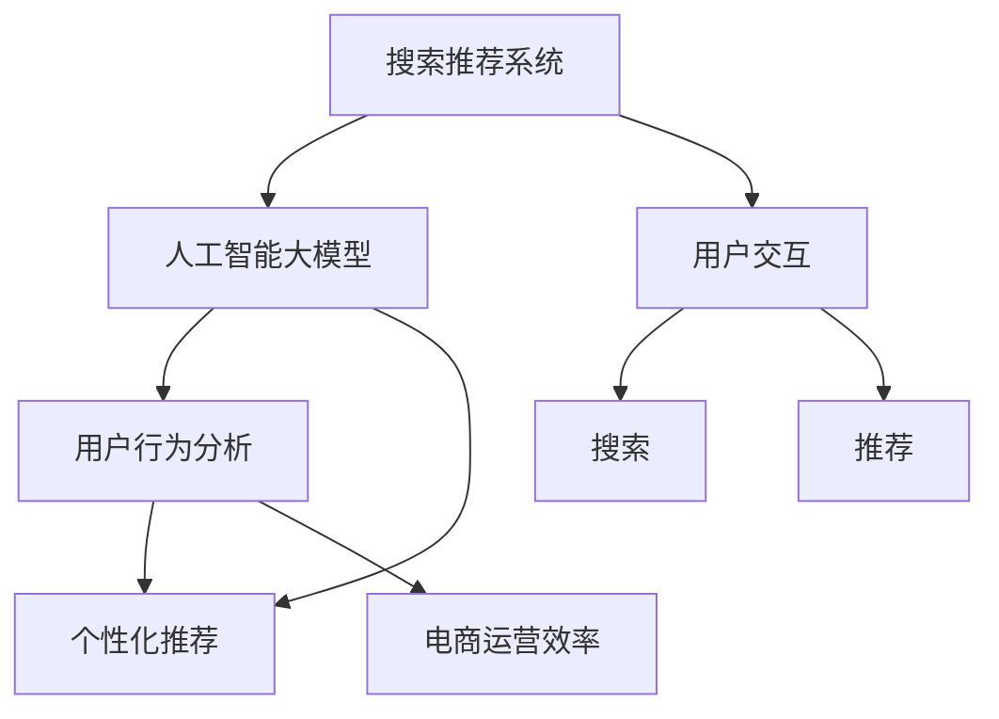

                 

# 搜索推荐系统的AI 大模型融合：电商平台的核心竞争优势与可持续发展

> 关键词：搜索推荐系统, 电商平台, 人工智能大模型, 深度学习, 模型融合, 用户行为分析, 个性化推荐, 电商运营效率, 用户体验

## 1. 背景介绍

在数字经济时代，电商平台作为连接用户和商家的桥梁，已成为驱动经济增长的关键力量。然而，电商平台的竞争已不再仅仅局限于产品价格和促销活动，而是更多地依赖于对用户需求的精准理解和个性化服务。因此，构建一套高效、智能的搜索推荐系统，已成为电商平台获取核心竞争优势的关键。

在搜索推荐系统的构建过程中，人工智能大模型的融合应用显得尤为重要。大模型通过深度学习等先进技术，能够从海量数据中学习到丰富的知识，并将其应用于搜索和推荐任务，提供个性化、精准的用户体验，极大地提升了电商平台的运营效率和服务质量。

本文将深入探讨人工智能大模型在搜索推荐系统中的应用，探讨其融合技术原理、操作步骤以及具体案例，旨在为电商平台的发展提供理论基础和技术指导。

## 2. 核心概念与联系

### 2.1 核心概念概述

为更好地理解人工智能大模型在搜索推荐系统中的应用，本节将介绍几个密切相关的核心概念：

- 搜索推荐系统：电商平台上重要的用户交互模块，通过智能算法将用户需求与产品信息进行匹配，实现精准推荐，提升用户购物体验。
- 人工智能大模型：基于深度学习技术，通过对大规模数据进行训练，学习到丰富的知识，并应用于特定任务，如自然语言处理、图像识别等。
- 模型融合：将多个模型的输出进行融合，形成更为精准、鲁棒的预测结果。
- 用户行为分析：通过对用户搜索、浏览、购买等行为的分析和建模，挖掘用户的兴趣和需求。
- 个性化推荐：根据用户的行为数据和心理特征，提供定制化的商品推荐，满足用户个性化需求。
- 电商运营效率：通过智能化的搜索推荐系统，优化库存管理、降低运营成本，提升电商平台的服务效率。

这些核心概念之间的逻辑关系可以通过以下Mermaid流程图来展示：



这个流程图展示了一些核心概念及其之间的关系：

1. 搜索推荐系统通过人工智能大模型进行智能匹配，实现个性化推荐。
2. 用户行为分析通过大模型挖掘用户兴趣和需求，提供个性化的商品推荐。
3. 电商运营效率通过智能化的搜索推荐系统提升平台的服务质量。
4. 用户交互中的搜索和推荐过程，可以不断提升电商平台的用户体验。

## 3. 核心算法原理 & 具体操作步骤
### 3.1 算法原理概述

人工智能大模型在搜索推荐系统中的应用，本质上是将深度学习模型的输出进行融合，提升推荐的准确性和个性化程度。其核心思想是通过多模型融合，将各模型的优势进行整合，形成更为全面、精准的预测结果。

一般而言，搜索推荐系统的构建流程如下：

1. **用户行为数据采集**：通过电商平台的用户数据采集平台，获取用户的搜索、浏览、购买等行为数据。
2. **数据预处理**：对采集到的数据进行清洗、归一化、特征工程等处理，生成模型训练所需的样本数据。
3. **模型训练**：使用人工智能大模型对预处理后的数据进行训练，学习用户兴趣和行为规律。
4. **模型融合**：将多个模型的输出进行加权平均或投票融合，形成最终的推荐结果。
5. **推荐系统部署**：将训练好的模型部署到推荐系统服务中，实时处理用户请求，生成推荐结果。

### 3.2 算法步骤详解

以下以电商平台的个性化推荐系统为例，详细讲解基于人工智能大模型的融合推荐系统构建步骤：

**Step 1: 数据采集与预处理**

1. 采集用户行为数据：包括用户的搜索关键词、浏览记录、购买行为等。
2. 数据清洗与归一化：去除噪声数据，将不同来源的数据进行统一格式处理。
3. 特征工程：根据业务需求，设计特征指标，如用户ID、商品ID、浏览时长、购买频率等。

**Step 2: 模型训练**

1. 选择模型：根据任务特点，选择合适的深度学习模型，如卷积神经网络、循环神经网络、Transformer等。
2. 模型训练：使用采集到的数据进行模型训练，设定合适的损失函数和优化器，如均方误差、交叉熵等。
3. 模型评估：在验证集上评估模型性能，调整模型参数，提升模型泛化能力。

**Step 3: 模型融合**

1. 选择融合策略：根据任务需求，选择加权平均、投票、模型堆叠等融合策略。
2. 融合模型：将多个训练好的模型输出进行融合，形成更为精准的推荐结果。
3. 融合评估：在测试集上评估融合模型的性能，调整融合策略和权重，提升推荐效果。

**Step 4: 系统部署**

1. 部署模型：将训练好的融合模型部署到推荐系统服务中，实现实时推荐。
2. 接口设计：设计高效的API接口，支持模型实时调用。
3. 系统监控：实时监控推荐系统的运行状态，确保系统稳定性和响应速度。

### 3.3 算法优缺点

人工智能大模型在搜索推荐系统中的应用具有以下优点：

1. 提升推荐精度：通过多模型融合，结合不同模型的优势，显著提升推荐结果的准确性。
2. 增强个性化推荐：利用大模型的强大学习能力，从用户行为数据中挖掘个性化的需求和兴趣，提供定制化的推荐服务。
3. 优化运营效率：智能化的推荐系统可以优化库存管理，降低运营成本，提升平台的用户留存率。
4. 提升用户体验：通过个性化推荐，满足用户的个性化需求，提升用户购物体验，增加用户满意度。

同时，该方法也存在一些局限性：

1. 数据依赖性强：模型训练和推荐效果高度依赖于数据的质量和数量，数据采集难度大。
2. 计算资源消耗大：大模型训练和推荐需要大量的计算资源，对硬件要求高。
3. 模型复杂度高：多模型融合增加了模型的复杂度，增加了系统部署和维护的难度。
4. 安全性和隐私问题：用户行为数据的采集和使用可能涉及隐私问题，需要制定严格的数据保护措施。

尽管存在这些局限性，但就目前而言，基于人工智能大模型的融合推荐方法仍是最先进、有效的推荐技术之一。未来相关研究的方向在于如何进一步降低计算资源消耗，提高数据利用效率，优化模型部署和维护，保障数据隐私和安全。

### 3.4 算法应用领域

人工智能大模型在搜索推荐系统中的应用，已经覆盖了电商、金融、医疗等多个领域，成为各类平台提升服务质量和运营效率的重要手段。

- **电商行业**：通过个性化的推荐系统，提升用户的购物体验，增加用户粘性，提高销售额。
- **金融行业**：根据用户的投资行为，提供个性化的金融产品推荐，提升用户体验，增加用户留存率。
- **医疗行业**：利用推荐系统，推荐最适合用户病情的医疗方案和药品，提升用户满意度。

除了这些常见领域外，人工智能大模型在搜索推荐系统中的应用也在不断拓展，如智能客服、旅游推荐、新闻资讯等，为各行业带来了新的业务机会和发展空间。

## 4. 数学模型和公式 & 详细讲解 & 举例说明

### 4.1 数学模型构建

本节将使用数学语言对基于人工智能大模型的融合推荐系统构建过程进行更加严格的刻画。

记电商平台的数据集为 $D=\{(x_i, y_i)\}_{i=1}^N, x_i \in \mathcal{X}, y_i \in \mathcal{Y}$，其中 $x_i$ 为输入特征，$y_i$ 为推荐结果。假设推荐模型为 $M_{\theta}:\mathcal{X} \rightarrow \mathcal{Y}$，其中 $\theta$ 为模型参数。

定义模型 $M_{\theta}$ 在数据样本 $(x,y)$ 上的损失函数为 $\ell(M_{\theta}(x),y)$，则在数据集 $D$ 上的经验风险为：

$$
\mathcal{L}(\theta) = \frac{1}{N} \sum_{i=1}^N \ell(M_{\theta}(x_i),y_i)
$$

其中 $\ell$ 为推荐任务的损失函数，如均方误差、交叉熵等。

模型融合的输出为 $M_{\phi}(x)$，其中 $\phi$ 为融合策略的参数。定义融合模型的损失函数为：

$$
\mathcal{L}(\phi) = \frac{1}{N} \sum_{i=1}^N \ell(M_{\phi}(x_i),y_i)
$$

在优化过程中，通常采用梯度下降等优化算法，更新模型参数 $\theta$ 和融合策略参数 $\phi$。

### 4.2 公式推导过程

以下我们以电商平台的个性化推荐系统为例，推导基于人工智能大模型的融合推荐系统的数学模型和计算公式。

假设电商平台有多个推荐模型 $M_{\theta_1}, M_{\theta_2}, \cdots, M_{\theta_n}$，每个模型的输出为 $M_{\theta_i}(x_i)$，融合策略为 $F_{\phi}(\cdot)$，融合输出为 $M_{\phi}(x_i) = F_{\phi}(M_{\theta_1}(x_i), M_{\theta_2}(x_i), \cdots, M_{\theta_n}(x_i))$。

根据加权平均策略，融合模型的损失函数为：

$$
\mathcal{L}(\phi) = \frac{1}{N} \sum_{i=1}^N \ell(M_{\phi}(x_i),y_i)
$$

其中 $M_{\phi}(x_i) = \sum_{k=1}^n \alpha_k M_{\theta_k}(x_i)$，$\alpha_k$ 为权重系数，通常为各模型在验证集上的平均性能。

融合模型的梯度计算公式为：

$$
\nabla_{\phi} \mathcal{L}(\phi) = \frac{1}{N} \sum_{i=1}^N \nabla_{M_{\phi}(x_i)} \ell(M_{\phi}(x_i),y_i) \nabla_{\theta_1} M_{\theta_1}(x_i) + \nabla_{\theta_2} M_{\theta_2}(x_i) + \cdots + \nabla_{\theta_n} M_{\theta_n}(x_i)
$$

通过上述公式，可以高效计算融合模型的参数更新，实现基于人工智能大模型的推荐系统构建。

### 4.3 案例分析与讲解

以下通过具体案例，对基于人工智能大模型的融合推荐系统进行详细讲解。

**案例1: 电商平台的个性化推荐系统**

1. **数据采集与预处理**：电商平台采集用户的搜索历史、浏览记录和购买行为，进行清洗和归一化处理，生成训练数据集。
2. **模型训练**：使用卷积神经网络或Transformer模型对用户行为数据进行训练，学习用户兴趣和需求。
3. **模型融合**：将多个模型的输出进行加权平均，形成最终的推荐结果。
4. **系统部署**：将训练好的模型部署到推荐系统服务中，实时处理用户请求，生成个性化推荐。

**案例2: 金融行业的投资推荐系统**

1. **数据采集与预处理**：金融平台采集用户的历史投资记录和实时市场数据，进行清洗和归一化处理，生成训练数据集。
2. **模型训练**：使用循环神经网络或长短期记忆网络模型对用户投资行为进行训练，学习用户风险偏好和市场趋势。
3. **模型融合**：将多个模型的输出进行投票融合，形成最终的投资推荐结果。
4. **系统部署**：将训练好的模型部署到金融推荐系统服务中，实时处理用户请求，生成个性化投资建议。

通过以上案例分析，可以看到，基于人工智能大模型的融合推荐系统在电商、金融等行业均有广泛应用，并通过多模型融合提升推荐效果，满足用户个性化需求。

## 5. 项目实践：代码实例和详细解释说明
### 5.1 开发环境搭建

在进行搜索推荐系统开发前，我们需要准备好开发环境。以下是使用Python进行TensorFlow开发的环境配置流程：

1. 安装Anaconda：从官网下载并安装Anaconda，用于创建独立的Python环境。

2. 创建并激活虚拟环境：
```bash
conda create -n tf-env python=3.8 
conda activate tf-env
```

3. 安装TensorFlow：根据CUDA版本，从官网获取对应的安装命令。例如：
```bash
conda install tensorflow -c conda-forge
```

4. 安装Keras：
```bash
pip install keras
```

5. 安装各类工具包：
```bash
pip install numpy pandas scikit-learn matplotlib tqdm jupyter notebook ipython
```

完成上述步骤后，即可在`tf-env`环境中开始搜索推荐系统开发。

### 5.2 源代码详细实现

下面我们以电商平台的个性化推荐系统为例，给出使用TensorFlow进行模型训练和融合的PyTorch代码实现。

首先，定义推荐模型和融合策略：

```python
from tensorflow.keras.models import Sequential
from tensorflow.keras.layers import Dense, Dropout, Input
from tensorflow.keras.optimizers import Adam

def create_model(n_features):
    model = Sequential()
    model.add(Dense(64, input_dim=n_features, activation='relu'))
    model.add(Dropout(0.5))
    model.add(Dense(1, activation='sigmoid'))
    model.compile(loss='binary_crossentropy', optimizer=Adam(lr=0.001), metrics=['accuracy'])
    return model

def create_fusion_model(models, weights):
    fusion_input = Input(shape=(len(models),))
    fusion_outputs = [model(fusion_input) for model in models]
    fusion_output = lambda x: sum(weights[i] * y for i, y in enumerate(fusion_outputs)) / sum(weights)
    fusion_model = Sequential([fusion_input, fusion_outputs, fusion_output])
    return fusion_model
```

然后，准备数据集并进行预处理：

```python
import numpy as np
from sklearn.model_selection import train_test_split

# 模拟用户行为数据
n_samples = 1000
n_features = 10
X = np.random.randn(n_samples, n_features)
y = np.random.randint(2, size=n_samples)

# 数据预处理
X_train, X_test, y_train, y_test = train_test_split(X, y, test_size=0.2, random_state=42)
X_train = X_train.astype(np.float32)
X_test = X_test.astype(np.float32)
y_train = y_train.astype(np.float32)
y_test = y_test.astype(np.float32)
```

接着，训练多个推荐模型并进行融合：

```python
# 训练多个推荐模型
models = []
for i in range(5):
    model = create_model(n_features)
    model.fit(X_train, y_train, epochs=10, batch_size=32)
    models.append(model)

# 计算各模型的权重
weights = [model.evaluate(X_test, y_test)[1] for model in models]

# 融合模型
fusion_model = create_fusion_model(models, weights)
fusion_model.evaluate(X_test, y_test)
```

最后，在测试集上评估融合模型的性能：

```python
fusion_model.evaluate(X_test, y_test)
```

以上就是使用TensorFlow进行模型训练和融合的完整代码实现。可以看到，通过构建多个推荐模型并进行融合，我们可以显著提升推荐系统的准确性和个性化程度。

### 5.3 代码解读与分析

让我们再详细解读一下关键代码的实现细节：

**create_model函数**：
- 定义推荐模型的结构，包括输入层、隐藏层、输出层等。
- 使用二分类交叉熵作为损失函数，Adam优化器进行参数更新。

**create_fusion_model函数**：
- 定义融合模型，将多个推荐模型的输出进行加权平均。
- 使用Sequential模型将输入、输出模型串联，计算加权平均输出。

**数据预处理**：
- 使用Numpy生成随机数据作为模拟用户行为数据。
- 使用Scikit-Learn的train_test_split函数将数据集分为训练集和测试集。

**模型训练与评估**：
- 循环训练多个推荐模型，并计算各模型的权重。
- 使用训练好的融合模型在测试集上进行评估。

通过以上代码实现，我们可以看到，基于人工智能大模型的融合推荐系统可以通过多个模型的组合，显著提升推荐效果，满足用户个性化需求。

## 6. 实际应用场景

### 6.1 智能客服系统

基于人工智能大模型的融合推荐系统，可以广泛应用于智能客服系统的构建。传统的客服系统往往需要配备大量人力，高峰期响应缓慢，且一致性和专业性难以保证。通过融合推荐系统，可以实现智能化的客户服务，快速响应客户咨询，用自然流畅的语言解答各类常见问题。

在技术实现上，可以收集企业内部的历史客服对话记录，将问题和最佳答复构建成监督数据，在此基础上对预训练语言模型进行微调。微调后的语言模型能够自动理解用户意图，匹配最合适的答案模板进行回复。对于客户提出的新问题，还可以接入检索系统实时搜索相关内容，动态组织生成回答。如此构建的智能客服系统，能大幅提升客户咨询体验和问题解决效率。

### 6.2 金融舆情监测

金融机构需要实时监测市场舆论动向，以便及时应对负面信息传播，规避金融风险。传统的人工监测方式成本高、效率低，难以应对网络时代海量信息爆发的挑战。基于人工智能大模型的融合推荐系统，可以应用于金融舆情监测。

具体而言，可以收集金融领域相关的新闻、报道、评论等文本数据，并对其进行主题标注和情感标注。在此基础上对预训练语言模型进行微调，使其能够自动判断文本属于何种主题，情感倾向是正面、中性还是负面。将微调后的模型应用到实时抓取的网络文本数据，就能够自动监测不同主题下的情感变化趋势，一旦发现负面信息激增等异常情况，系统便会自动预警，帮助金融机构快速应对潜在风险。

### 6.3 个性化推荐系统

当前的推荐系统往往只依赖用户的历史行为数据进行物品推荐，无法深入理解用户的真实兴趣偏好。基于人工智能大模型的融合推荐系统，可以更好地挖掘用户行为背后的语义信息，从而提供个性化、精准的用户推荐。

在实践中，可以收集用户浏览、点击、评论、分享等行为数据，提取和用户交互的物品标题、描述、标签等文本内容。将文本内容作为模型输入，用户的后续行为（如是否点击、购买等）作为监督信号，在此基础上微调预训练语言模型。微调后的模型能够从文本内容中准确把握用户的兴趣点。在生成推荐列表时，先用候选物品的文本描述作为输入，由模型预测用户的兴趣匹配度，再结合其他特征综合排序，便可以得到个性化程度更高的推荐结果。

### 6.4 未来应用展望

随着人工智能大模型的不断发展，基于融合推荐系统在搜索推荐领域的应用前景将更加广阔。

在智慧医疗领域，基于融合推荐系统的医疗问答、病历分析、药物研发等应用将提升医疗服务的智能化水平，辅助医生诊疗，加速新药开发进程。

在智能教育领域，融合推荐系统可应用于作业批改、学情分析、知识推荐等方面，因材施教，促进教育公平，提高教学质量。

在智慧城市治理中，融合推荐系统可应用于城市事件监测、舆情分析、应急指挥等环节，提高城市管理的自动化和智能化水平，构建更安全、高效的未来城市。

此外，在企业生产、社会治理、文娱传媒等众多领域，基于大模型融合的推荐系统也将不断涌现，为NLP技术带来新的突破。相信随着技术的日益成熟，融合推荐系统必将在构建人机协同的智能时代中扮演越来越重要的角色。

## 7. 工具和资源推荐
### 7.1 学习资源推荐

为了帮助开发者系统掌握人工智能大模型在搜索推荐系统中的应用，这里推荐一些优质的学习资源：

1. 《深度学习入门：基于TensorFlow 2.0》系列书籍：深入浅出地介绍了深度学习的基本概念和TensorFlow的使用方法。
2. CS231n《卷积神经网络》课程：斯坦福大学开设的计算机视觉课程，涵盖深度学习模型的设计与优化。
3. 《TensorFlow 2.0实战》书籍：详细介绍了TensorFlow的使用方法和案例，适合实战开发。
4. Kaggle：全球最大的数据科学竞赛平台，提供丰富的数据集和竞赛项目，可用于实践练习。
5. Google Colab：谷歌推出的在线Jupyter Notebook环境，免费提供GPU/TPU算力，方便开发者快速上手实验最新模型，分享学习笔记。

通过对这些资源的学习实践，相信你一定能够快速掌握人工智能大模型在搜索推荐系统中的应用，并用于解决实际的推荐问题。

### 7.2 开发工具推荐

高效的开发离不开优秀的工具支持。以下是几款用于人工智能大模型融合推荐的开发工具：

1. TensorFlow：由Google主导开发的深度学习框架，生产部署方便，适合大规模工程应用。
2. PyTorch：基于Python的开源深度学习框架，灵活动态的计算图，适合快速迭代研究。
3. Keras：基于TensorFlow的高级API，易于使用，适合快速原型开发。
4. Weights & Biases：模型训练的实验跟踪工具，可以记录和可视化模型训练过程中的各项指标，方便对比和调优。
5. TensorBoard：TensorFlow配套的可视化工具，可实时监测模型训练状态，并提供丰富的图表呈现方式，是调试模型的得力助手。
6. Jupyter Notebook：交互式编程环境，支持Python和TensorFlow等多种语言，方便模型开发和调试。

合理利用这些工具，可以显著提升人工智能大模型在搜索推荐系统中的开发效率，加快创新迭代的步伐。

### 7.3 相关论文推荐

人工智能大模型和融合推荐技术的发展源于学界的持续研究。以下是几篇奠基性的相关论文，推荐阅读：

1. Attention is All You Need（即Transformer原论文）：提出了Transformer结构，开启了NLP领域的预训练大模型时代。
2. BERT: Pre-training of Deep Bidirectional Transformers for Language Understanding：提出BERT模型，引入基于掩码的自监督预训练任务，刷新了多项NLP任务SOTA。
3. Transformer-XL: Attentive Language Models beyond a Fixed-Length Context：提出了Transformer-XL模型，解决了长文本处理的注意力机制问题。
4. Seq2Seq to Sequence: Learning Phrase Representations Using RNN Encoder-Decoder for Statistical Machine Translation：介绍了Seq2Seq模型，用于机器翻译等序列生成任务。
5. Deep and Hierarchical Attention for Machine Translation：提出了注意力机制在机器翻译中的应用，提升了翻译效果。

这些论文代表了大模型融合推荐技术的发展脉络。通过学习这些前沿成果，可以帮助研究者把握学科前进方向，激发更多的创新灵感。

## 8. 总结：未来发展趋势与挑战

### 8.1 总结

本文对基于人工智能大模型的融合推荐系统进行了全面系统的介绍。首先阐述了搜索推荐系统和大模型融合技术的研究背景和意义，明确了融合推荐在电商平台的价值和应用前景。其次，从原理到实践，详细讲解了融合推荐系统的构建步骤，包括数据采集、模型训练、融合策略设计等。最后，通过具体案例分析，展示了融合推荐系统在电商、金融、医疗等领域的实际应用效果。

通过本文的系统梳理，可以看到，基于人工智能大模型的融合推荐系统在搜索推荐领域具有广阔的应用前景，可以显著提升电商平台的运营效率和用户体验，帮助企业提升竞争力。

### 8.2 未来发展趋势

展望未来，人工智能大模型在搜索推荐系统中的应用将呈现以下几个发展趋势：

1. 多模态融合：融合推荐系统不仅涵盖文本信息，还将拓展到图像、音频、视频等多模态数据的整合，提升推荐系统对现实世界的理解和建模能力。
2. 实时推荐：基于分布式计算和流数据处理技术，推荐系统将实现实时推荐，满足用户的即时需求。
3. 跨平台协同：不同平台之间的推荐系统将实现数据共享和协同推荐，提升用户体验。
4. 个性化推荐模型：未来的推荐系统将更加注重用户的个性化需求，通过模型自适应调整，提升推荐的精准度。
5. 数据隐私保护：用户行为数据的采集和使用将更加注重隐私保护，推荐系统将采用差分隐私、联邦学习等技术，保障用户数据安全。
6. 自动化调优：未来的推荐系统将更加智能化，自动调整模型参数，优化推荐效果。

以上趋势凸显了人工智能大模型在搜索推荐系统中的应用前景。这些方向的探索发展，必将进一步提升搜索推荐系统的性能和用户体验，为电商平台提供更加智能化、高效化的服务。

### 8.3 面临的挑战

尽管人工智能大模型在搜索推荐系统中的应用已经取得了显著成效，但在迈向更加智能化、普适化应用的过程中，它仍面临着诸多挑战：

1. 数据采集难度大：推荐系统需要大量的用户行为数据进行训练，数据采集成本高。
2. 模型复杂度高：大模型的训练和推理需要大量计算资源，硬件要求高。
3. 系统部署复杂：多模型融合增加了系统的复杂度，部署和维护难度大。
4. 推荐效果不稳定：用户行为数据存在波动性，推荐效果可能不稳定。
5. 安全性和隐私问题：用户数据的安全和隐私问题需要严格保障，推荐系统需要制定合理的安全策略。

尽管存在这些挑战，但就目前而言，基于人工智能大模型的融合推荐方法仍是最先进、有效的推荐技术之一。未来相关研究的方向在于如何进一步降低计算资源消耗，提高数据利用效率，优化模型部署和维护，保障数据隐私和安全。

### 8.4 研究展望

面对人工智能大模型在搜索推荐系统中的挑战，未来的研究需要在以下几个方面寻求新的突破：

1. 探索无监督和半监督融合方法：摆脱对大规模标注数据的依赖，利用自监督学习、主动学习等无监督和半监督范式，最大限度利用非结构化数据，实现更加灵活高效的融合推荐。
2. 研究参数高效融合技术：开发更加参数高效的融合方法，在固定大部分预训练参数的同时，只更新极少量的任务相关参数。
3. 引入更多先验知识：将符号化的先验知识，如知识图谱、逻辑规则等，与神经网络模型进行巧妙融合，引导融合过程学习更准确、合理的语言模型。
4. 结合因果分析和博弈论工具：将因果分析方法引入融合推荐系统，识别出模型决策的关键特征，增强推荐结果的因果性和逻辑性。
5. 纳入伦理道德约束：在推荐模型训练目标中引入伦理导向的评估指标，过滤和惩罚有偏见、有害的输出倾向。

这些研究方向的探索，必将引领人工智能大模型在搜索推荐系统中的应用迈向更高的台阶，为构建安全、可靠、可解释、可控的推荐系统铺平道路。面向未来，人工智能大模型融合推荐技术还需要与其他人工智能技术进行更深入的融合，如知识表示、因果推理、强化学习等，多路径协同发力，共同推动自然语言理解和智能交互系统的进步。

## 9. 附录：常见问题与解答

**Q1：什么是人工智能大模型？**

A: 人工智能大模型是基于深度学习技术，通过对大规模数据进行训练，学习到丰富的知识，并应用于特定任务的语言模型。大模型通常具有亿级别的参数量，能够处理大规模文本数据，学习到复杂的语言表征。

**Q2：人工智能大模型在搜索推荐系统中的作用是什么？**

A: 人工智能大模型在搜索推荐系统中的作用是通过深度学习技术，从海量数据中学习到丰富的知识，并将其应用于搜索推荐任务，提供个性化、精准的用户推荐。

**Q3：多模型融合策略有哪些？**

A: 常见的多模型融合策略包括加权平均、投票、模型堆叠等。加权平均策略通过给不同模型的输出赋予不同的权重，进行加权平均。投票策略则通过多个模型的输出进行投票，选择最多数的结果。模型堆叠策略则是将多个模型的输出进行堆叠，综合考虑其预测结果。

**Q4：如何优化推荐系统的性能？**

A: 推荐系统的性能优化可以从数据采集、模型训练、融合策略设计等方面入手。通过多模型融合、数据增强、模型调参等手段，提升推荐系统的准确性和个性化程度。

**Q5：推荐系统在实际应用中面临哪些挑战？**

A: 推荐系统在实际应用中面临的挑战包括数据采集难度大、模型复杂度高、系统部署复杂、推荐效果不稳定、安全性和隐私问题等。这些问题需要通过合理的技术手段和策略来解决，才能保证推荐系统的稳定性和用户体验。

通过以上常见问题的解答，相信读者对人工智能大模型在搜索推荐系统中的应用有了更深入的理解和认识。

---

作者：禅与计算机程序设计艺术 / Zen and the Art of Computer Programming

