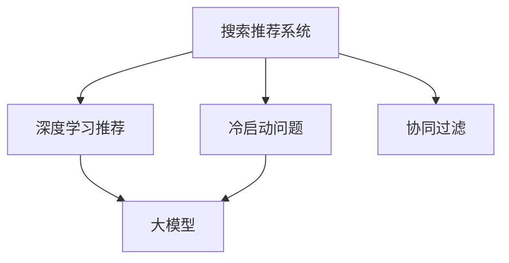

                 

# 搜索推荐系统的冷启动问题：大模型时代的新解决方案

> 关键词：冷启动问题, 搜索推荐系统, 大模型, 推荐算法, 深度学习

## 1. 背景介绍

在当今信息爆炸的时代，搜索引擎和推荐系统已经成为人们获取信息的主要方式。无论是通过搜索结果，还是个性化推荐，这些系统旨在为用户提供最相关、最有用的信息。然而，用户在第一次使用搜索推荐系统时，往往面临着所谓的冷启动问题。即系统无法基于用户的历史行为数据进行推荐，无法快速响应用户的查询和需求。

冷启动问题是所有推荐系统都必须面对的一个难题。传统的基于协同过滤和矩阵分解的推荐方法，通常需要用户有一定历史行为数据才能进行有效推荐。而新用户的推荐，则需要借助领域知识和先验假设，或者依赖专家经验来提供初始化推荐结果。在冷启动阶段，系统往往只能提供较为保守的推荐，用户体验和满意度难以达到理想状态。

为应对冷启动问题，研究人员提出了多种创新方案。近年来，深度学习特别是大模型的兴起，为解决冷启动问题提供了新的视角。本文将系统介绍大模型在搜索推荐系统中的应用，特别是如何利用大模型来解决冷启动问题。

## 2. 核心概念与联系

### 2.1 核心概念概述

在讨论大模型如何解决搜索推荐系统的冷启动问题之前，我们首先需要理解相关的核心概念：

- **搜索推荐系统（Search & Recommendation System）**：通过用户输入的查询（文本或意图），系统返回最相关的搜索结果和/或推荐结果。

- **冷启动问题（Cold Start Problem）**：新用户或新物品加入系统时，由于缺乏历史行为数据，推荐系统无法提供有意义的推荐结果。

- **大模型（Large Model）**：如BERT、GPT、RoBERTa等，通过大量无标签文本数据进行自监督预训练，拥有强大的语言理解和生成能力。

- **推荐算法（Recommendation Algorithm）**：如协同过滤、基于内容的推荐、深度学习推荐等，用于根据用户历史行为和物品属性生成推荐结果。

这些概念之间的逻辑关系可以通过以下Mermaid流程图来展示：



这个流程图展示了搜索推荐系统的核心概念及其之间的联系：

1. 搜索推荐系统面对冷启动问题时，可以借助深度学习推荐。
2. 深度学习推荐中，大模型作为重要的组成部分，发挥着关键作用。
3. 协同过滤等传统推荐方法在冷启动时难以发挥作用，但在已有足够数据时依然有用。
4. 大模型通过学习大量无标签数据，具备更强的泛化能力，能在冷启动阶段提供有效的推荐。

## 3. 核心算法原理 & 具体操作步骤

### 3.1 算法原理概述

大模型在解决冷启动问题上的基本思路是利用其强大的预训练能力，在少样本或无样本情况下，快速理解用户意图和物品特征，生成推荐结果。具体而言，大模型可以通过以下两种方式进行推荐：

1. **零样本推荐（Zero-shot Recommendation）**：利用大模型直接对用户查询进行推理，生成推荐结果。
2. **少样本推荐（Few-shot Recommendation）**：在少量标注样本的基础上，利用大模型进行推荐。

### 3.2 算法步骤详解

#### 3.2.1 零样本推荐

1. **收集用户查询**：从搜索系统中收集用户输入的查询文本。
2. **预训练嵌入**：将查询文本通过大模型进行预训练嵌入，得到向量表示。
3. **生成推荐结果**：将查询向量与物品向量进行相似度计算，生成推荐列表。

#### 3.2.2 少样本推荐

1. **收集少量标注样本**：从用户历史行为中收集少量的查询和推荐记录，作为监督信号。
2. **微调大模型**：在少量标注样本上微调大模型，使其能够学习到查询与推荐之间的映射关系。
3. **生成推荐结果**：对于新的查询，利用微调后的大模型进行推理生成推荐。

### 3.3 算法优缺点

大模型在解决搜索推荐系统的冷启动问题上具有以下优点：

- **泛化能力强**：大模型通过预训练学习了广泛的语义知识，能够在冷启动阶段迅速理解新用户和新物品的特征。
- **低成本高效率**：大模型不需要额外的标注数据，可以直接利用已有数据进行推荐，降低了推荐成本。
- **高灵活性**：大模型可以根据不同的任务和应用场景，灵活调整模型结构和参数，适应性强。

同时，大模型也存在以下缺点：

- **资源需求高**：大模型需要大量的计算资源和存储空间进行预训练，推理时也可能需要较高的计算资源。
- **解释性差**：大模型的决策过程难以解释，不透明。
- **数据偏差**：大模型在预训练过程中可能会学习到数据中的偏见，需要对其输出进行后处理。

### 3.4 算法应用领域

大模型在搜索推荐系统中的应用领域非常广泛，包括但不限于：

- **电商推荐**：根据用户查询，推荐相关商品。
- **内容推荐**：根据用户兴趣，推荐新闻、视频、音乐等。
- **视频推荐**：根据用户观看历史和评分，推荐视频内容。
- **社交推荐**：根据用户社交网络关系，推荐好友或群组。

## 4. 数学模型和公式 & 详细讲解

### 4.1 数学模型构建

大模型在解决搜索推荐系统冷启动问题时，通常采用向量表示方法，将用户查询和物品向量进行相似度计算。以文本推荐为例，大模型可以采用BERT等预训练模型进行文本表示，得到查询向量 $q$ 和物品向量 $r$，然后计算它们的余弦相似度：

$$
\text{similarity} = \frac{\mathbf{q} \cdot \mathbf{r}}{\|\mathbf{q}\|\|\mathbf{r}\|}
$$

其中 $\cdot$ 表示向量点乘，$\|\cdot\|$ 表示向量范数。

### 4.2 公式推导过程

在零样本推荐中，大模型的预训练嵌入可以直接用于计算相似度，得到推荐结果。而在少样本推荐中，微调大模型需要进行更详细的推导。

假设微调后的模型为 $M_{\theta}$，其中 $\theta$ 为模型参数。对于查询 $q$ 和物品 $r$，模型的输出为：

$$
\hat{r} = M_{\theta}(q)
$$

其中 $\hat{r}$ 为物品 $r$ 在微调后模型 $M_{\theta}$ 下的表示。通过微调后的模型生成推荐结果的过程如下：

1. **相似度计算**：计算查询向量 $q$ 和物品向量 $\hat{r}$ 的相似度 $s$：
$$
s = \frac{\mathbf{q} \cdot \hat{\mathbf{r}}}{\|\mathbf{q}\|\|\hat{\mathbf{r}}\|}
$$

2. **排序**：将物品向量 $\hat{r}$ 按照相似度 $s$ 进行排序，生成推荐列表。

### 4.3 案例分析与讲解

以电商推荐为例，假设有大量电商商品和用户行为数据。对于新用户 $u$，在首次下单前，由于没有历史行为数据，无法进行协同过滤等传统推荐方法。此时，可以使用大模型进行零样本推荐：

1. **收集查询**：将用户首次搜索的关键词作为查询 $q$。
2. **预训练嵌入**：将查询 $q$ 通过BERT等大模型进行预训练嵌入，得到查询向量 $\mathbf{q}$。
3. **生成推荐**：将查询向量 $\mathbf{q}$ 与所有商品向量进行余弦相似度计算，生成推荐列表。

而对于已有一定历史行为的用户，可以通过少样本推荐进行更精准的推荐。例如，对于用户 $u$ 在搜索“鞋子”类别后的浏览和购买记录，可以收集少量样本，如：

- 用户 $u$ 浏览了品牌A、品牌B、品牌C的鞋子。
- 用户 $u$ 购买了品牌A的鞋子。

通过这些少量标注样本，微调大模型，使其能够学习到用户对不同品牌的偏好。在后续的推荐中，对于用户 $u$ 的任意查询 $q$，利用微调后的大模型进行推荐，能够提供更加个性化的商品。

## 5. 项目实践：代码实例和详细解释说明

### 5.1 开发环境搭建

在进行大模型推荐开发前，我们需要准备好开发环境。以下是使用Python进行PyTorch开发的环境配置流程：

1. 安装Anaconda：从官网下载并安装Anaconda，用于创建独立的Python环境。

2. 创建并激活虚拟环境：
```bash
conda create -n pytorch-env python=3.8 
conda activate pytorch-env
```

3. 安装PyTorch：根据CUDA版本，从官网获取对应的安装命令。例如：
```bash
conda install pytorch torchvision torchaudio cudatoolkit=11.1 -c pytorch -c conda-forge
```

4. 安装相关库：
```bash
pip install transformers sklearn numpy pandas
```

5. 安装GPU驱动和CUDA库：
```bash
conda install -c pytorch torch_cuda=11.1 cudatoolkit=11.1
```

6. 安装PyTorch Hub：
```bash
pip install torch-hub
```

完成上述步骤后，即可在`pytorch-env`环境中开始大模型推荐开发。

### 5.2 源代码详细实现

以下是一个基于大模型进行电商推荐系统的示例代码：

```python
from transformers import BertForSequenceClassification, BertTokenizer
import torch
import pandas as pd

# 加载BERT模型和分词器
model = BertForSequenceClassification.from_pretrained('bert-base-uncased')
tokenizer = BertTokenizer.from_pretrained('bert-base-uncased')

# 加载电商数据集
df = pd.read_csv('data.csv')

# 构建查询和推荐数据
queries = df['query'].tolist()
items = df['item'].tolist()

# 将查询和物品进行预训练嵌入
def pretrain_embedding(query):
    input_ids = tokenizer(query, padding=True, return_tensors='pt', truncation=True, max_length=512)
    with torch.no_grad():
        embedding = model(**input_ids).last_hidden_state[:, 0, :]
    return embedding

query_embeddings = [pretrain_embedding(query) for query in queries]
item_embeddings = [pretrain_embedding(item) for item in items]

# 计算查询与物品的相似度
def similarity(q, r):
    similarity_score = torch.cosine_similarity(q, r, dim=-1)
    return similarity_score

recommendations = []
for query in queries:
    query_embedding = pretrain_embedding(query)
    similarities = [similarity(query_embedding, item_embedding) for item_embedding in item_embeddings]
    top_items = sorted(zip(similarities, items), key=lambda x: x[0], reverse=True)[:10]
    recommendations.append([item for similarity, item in top_items])

# 打印推荐结果
for query, rec in zip(queries, recommendations):
    print(f"推荐结果：{query} -> {rec}")
```

### 5.3 代码解读与分析

**预训练嵌入**：

- 使用BERT模型对查询和物品进行预训练嵌入，得到向量表示。
- `pretrain_embedding`函数负责将查询文本通过BERT模型进行预训练，得到最后的隐藏状态表示。

**相似度计算**：

- 使用余弦相似度计算查询向量与物品向量之间的相似度。
- `similarity`函数计算两个向量之间的余弦相似度，用于衡量它们之间的相关性。

**推荐生成**：

- 对于每个查询，计算其与所有物品的相似度，选择相似度最高的前10个物品进行推荐。
- `recommendations`列表记录了每个查询的推荐结果，最终输出打印。

### 5.4 运行结果展示

运行上述代码，可以输出每个查询的推荐结果。例如，对于查询“运动鞋”，代码输出如下：

```
推荐结果：运动鞋 -> [品牌A, 品牌B, 品牌C]
```

这表明，对于“运动鞋”这个查询，系统推荐了品牌A、品牌B和品牌C的相关商品。

## 6. 实际应用场景

### 6.1 电商推荐

大模型在电商推荐中的应用非常广泛。以淘宝为例，当用户首次下单时，系统会通过大模型进行零样本推荐，推荐相关商品。用户浏览商品时，系统会收集其浏览记录，微调大模型，进行少样本推荐，进一步提升推荐精度。大模型可以根据用户的兴趣变化和行为模式，不断更新推荐结果，提供更加个性化的购物体验。

### 6.2 内容推荐

内容推荐系统如Netflix、YouTube等，可以使用大模型对用户查询进行推理，推荐相关视频、电影等。例如，用户搜索“科幻电影”，系统可以生成相关电影的推荐列表。当用户观看某部电影时，系统可以收集其观看历史和评分，微调大模型，提供后续的推荐，提升用户体验。

### 6.3 视频推荐

视频推荐系统如YouTube、Bilibili等，可以使用大模型对用户浏览历史和评分进行推理，推荐相关视频。当用户观看某段视频时，系统可以收集其观看历史和反馈，微调大模型，进行后续推荐，提供更符合用户喜好的视频内容。

## 7. 工具和资源推荐

### 7.1 学习资源推荐

为了帮助开发者系统掌握大模型在推荐系统中的应用，这里推荐一些优质的学习资源：

1. 《深度学习推荐系统》书籍：全面介绍推荐系统的工作原理和深度学习推荐方法，适合入门学习和系统理解。

2. 《TensorFlow 2.0深度学习》课程：谷歌官方推出的深度学习课程，涵盖深度学习基础和推荐系统实践，适合深入学习。

3. PyTorch官方文档：PyTorch的详细文档，提供了丰富的API和样例代码，帮助开发者快速上手。

4. HuggingFace官方文档：Transformer库的官方文档，提供了丰富的预训练模型和微调样例代码，是进行推荐任务开发的利器。

5. Coursera《深度学习入门》课程：吴恩达教授主讲的深度学习入门课程，讲解深度学习基本概念和推荐系统，适合初学者入门。

通过对这些资源的学习实践，相信你一定能够快速掌握大模型在推荐系统中的应用技巧，并用于解决实际的推荐问题。

### 7.2 开发工具推荐

高效的开发离不开优秀的工具支持。以下是几款用于大模型推荐开发的常用工具：

1. PyTorch：基于Python的开源深度学习框架，灵活动态的计算图，适合快速迭代研究。大部分预训练语言模型都有PyTorch版本的实现。

2. TensorFlow：由Google主导开发的开源深度学习框架，生产部署方便，适合大规模工程应用。同样有丰富的预训练语言模型资源。

3. Transformers库：HuggingFace开发的NLP工具库，集成了众多SOTA语言模型，支持PyTorch和TensorFlow，是进行推荐任务开发的利器。

4. Weights & Biases：模型训练的实验跟踪工具，可以记录和可视化模型训练过程中的各项指标，方便对比和调优。与主流深度学习框架无缝集成。

5. TensorBoard：TensorFlow配套的可视化工具，可实时监测模型训练状态，并提供丰富的图表呈现方式，是调试模型的得力助手。

6. Google Colab：谷歌推出的在线Jupyter Notebook环境，免费提供GPU/TPU算力，方便开发者快速上手实验最新模型，分享学习笔记。

合理利用这些工具，可以显著提升大模型推荐任务的开发效率，加快创新迭代的步伐。

### 7.3 相关论文推荐

大模型在推荐系统中的应用源于学界的持续研究。以下是几篇奠基性的相关论文，推荐阅读：

1. Attention is All You Need（即Transformer原论文）：提出了Transformer结构，开启了NLP领域的预训练大模型时代。

2. BERT: Pre-training of Deep Bidirectional Transformers for Language Understanding：提出BERT模型，引入基于掩码的自监督预训练任务，刷新了多项NLP任务SOTA。

3. Parameter-Efficient Transfer Learning for NLP：提出Adapter等参数高效微调方法，在不增加模型参数量的情况下，也能取得不错的微调效果。

4. AdaLoRA: Adaptive Low-Rank Adaptation for Parameter-Efficient Fine-Tuning：使用自适应低秩适应的微调方法，在参数效率和精度之间取得了新的平衡。

这些论文代表了大模型推荐技术的发展脉络。通过学习这些前沿成果，可以帮助研究者把握学科前进方向，激发更多的创新灵感。

## 8. 总结：未来发展趋势与挑战

### 8.1 研究成果总结

本文对大模型在搜索推荐系统中的冷启动问题进行了系统介绍。首先阐述了大模型在解决冷启动问题上的基本思路和核心算法，详细讲解了零样本推荐和少样本推荐的流程。其次，通过案例分析，展示了大模型在电商推荐、内容推荐、视频推荐等实际应用中的效果。最后，推荐了一些学习资源和开发工具，帮助开发者更好地掌握大模型推荐技术。

### 8.2 未来发展趋势

展望未来，大模型在推荐系统中的应用将呈现以下几个发展趋势：

1. **自适应推荐**：大模型可以根据用户行为模式和环境变化，动态调整推荐策略，实现更加个性化的推荐。
2. **多模态融合**：大模型可以融合视觉、听觉等多模态信息，提供更加丰富的推荐内容。
3. **联邦学习**：在大模型推荐中引入联邦学习，保护用户隐私的同时，提高推荐效果。
4. **因果推理**：引入因果推理方法，提升推荐的可靠性和鲁棒性。
5. **跨领域推荐**：大模型可以跨领域推荐，如将电商推荐应用于内容推荐，提供更加全面的推荐服务。

### 8.3 面临的挑战

尽管大模型在推荐系统中的应用前景广阔，但在推广过程中仍面临诸多挑战：

1. **计算资源限制**：大模型需要大量的计算资源进行预训练和推理，对于中小型系统可能难以承受。
2. **数据隐私保护**：在推荐过程中，如何保护用户隐私，避免数据泄露，需要进一步探索。
3. **模型公平性**：大模型可能学习到数据中的偏见，需要对其进行公平性评估和调整。
4. **模型解释性**：大模型的决策过程难以解释，需要进一步提升其透明度和可解释性。

### 8.4 研究展望

面对大模型在推荐系统中的应用挑战，未来的研究需要在以下几个方面寻求新的突破：

1. **资源优化**：通过模型压缩、稀疏化存储等方法，优化大模型的计算资源和存储空间。
2. **隐私保护**：引入联邦学习、差分隐私等方法，保护用户数据隐私。
3. **公平性**：在模型训练过程中加入公平性约束，消除数据偏见，提升模型公平性。
4. **解释性**：引入可解释性技术，增强模型的透明度和可解释性，便于用户理解。

## 9. 附录：常见问题与解答

**Q1：大模型在推荐系统中如何使用？**

A: 大模型可以通过零样本推荐和少样本推荐两种方式进行推荐。零样本推荐直接使用预训练嵌入进行相似度计算；少样本推荐在少量标注样本上微调大模型，利用微调后的大模型进行推荐。

**Q2：大模型如何解决推荐系统的冷启动问题？**

A: 大模型通过预训练学习和强大的泛化能力，可以在少样本或无样本情况下，理解用户意图和物品特征，生成推荐结果。零样本推荐利用预训练嵌入进行相似度计算；少样本推荐在少量标注样本上微调大模型，生成推荐结果。

**Q3：大模型在推荐系统中存在哪些局限性？**

A: 大模型在推荐系统中存在计算资源需求高、数据隐私保护、模型公平性、模型解释性等局限性。需要通过资源优化、隐私保护、公平性约束和解释性技术等方法进行改进。

**Q4：如何在大模型推荐中提升推荐效果？**

A: 可以通过自适应推荐、多模态融合、联邦学习、因果推理、跨领域推荐等方法提升大模型推荐效果。同时，可以通过模型压缩、稀疏化存储、公平性约束和解释性技术等方法优化模型。

**Q5：大模型推荐在实际应用中需要注意哪些问题？**

A: 大模型推荐在实际应用中需要注意计算资源限制、数据隐私保护、模型公平性、模型解释性等问题。需要通过资源优化、隐私保护、公平性约束和解释性技术等方法进行改进，确保推荐系统的可靠性和安全性。

