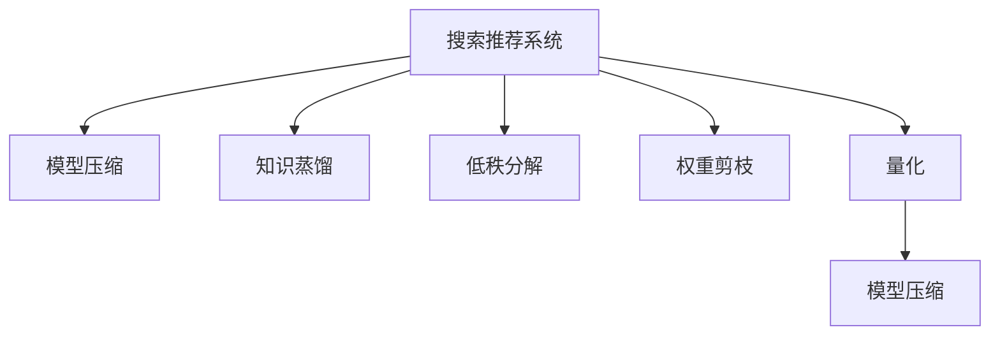
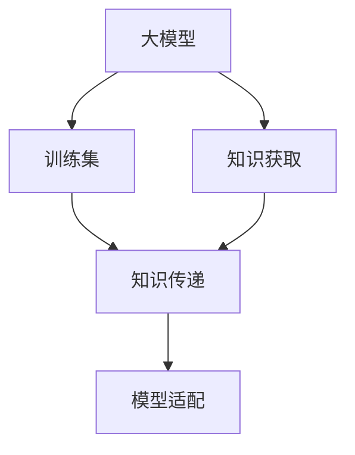
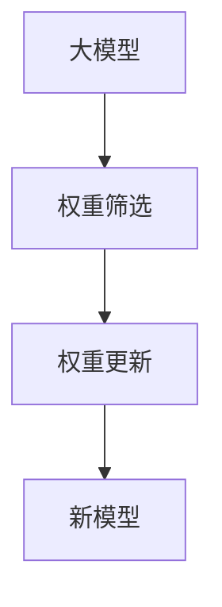

                 

## 1. 背景介绍

### 1.1 问题由来

随着深度学习技术的不断成熟，大模型在搜索推荐系统中展现了巨大的潜力，诸如BERT、GPT等预训练模型被广泛应用于商品推荐、信息检索、个性化广告等领域，并取得了显著的性能提升。然而，这些大模型通常以数十亿个参数为代价，其高存储需求和计算复杂度限制了其在实际应用中的部署和运行。

大模型压缩技术的出现，有效缓解了这一问题，通过模型压缩可以大幅减小模型体积，加速模型推理，提高系统效率。同时，模型压缩也保障了模型性能，避免在压缩过程中产生较大的性能损失。

### 1.2 问题核心关键点

当前，模型压缩主要包括以下几种技术：

1. **权重剪枝（Weight Pruning）**：通过筛选并移除模型中的小权重或低重要性权重，减小模型体积。
2. **量化（Quantization）**：将浮点权重或激活函数转换为低精度（如8位或16位）形式，降低模型资源需求。
3. **低秩分解（Low-Rank Decomposition）**：通过矩阵分解等方式，将高维参数矩阵转换为低秩形式，减少模型复杂度。
4. **蒸馏（Knowledge Distillation）**：通过将大模型的知识迁移到小模型中，保持模型性能的同时减小模型规模。
5. **压缩算法（Compression Algorithms）**：包括霍夫曼编码、哈夫曼树、稀疏编码等，用于高效存储模型权重。

这些技术共同构建了模型压缩的全流程，在大模型时代将发挥越来越重要的作用。

### 1.3 问题研究意义

模型压缩技术的研发与应用，不仅在计算资源有限的情况下提高了搜索推荐系统的性能，也在降低运营成本的同时，推动了模型的轻量化和部署灵活性。其研究意义如下：

1. **节省计算资源**：大模型压缩可以大幅减小模型体积，降低内存和存储需求，减少计算量，从而在有限的计算资源下提升系统性能。
2. **提高部署效率**：压缩后的模型体积小，响应速度快，便于部署到移动端、边缘计算等资源受限的硬件设备上。
3. **增强系统鲁棒性**：压缩技术通过优化模型结构，增强了系统的鲁棒性，避免了大模型训练时的过拟合现象，提高了模型泛化能力。
4. **促进知识共享**：模型压缩技术通过知识蒸馏等方法，可以高效地传递和融合多模型的知识，提升搜索推荐系统的整体性能。

## 2. 核心概念与联系

### 2.1 核心概念概述

为更好地理解搜索推荐系统中的模型压缩方法，本节将介绍几个核心概念：

1. **搜索推荐系统（Search and Recommendation Systems, SRS）**：通过理解用户查询意图，推荐符合用户兴趣的商品或信息，提升用户体验和满意度。

2. **模型压缩（Model Compression）**：通过各种技术手段，在不显著损失模型性能的情况下，减小模型参数量，降低计算复杂度，提高系统效率。

3. **知识蒸馏（Knowledge Distillation）**：将大模型的知识迁移到小模型中，保持模型性能的同时减小模型规模，是一种高效模型压缩技术。

4. **低秩分解（Low-Rank Decomposition）**：通过矩阵分解等方法，将高维矩阵转换为低秩形式，降低模型复杂度，提高训练和推理效率。

5. **权重剪枝（Weight Pruning）**：通过筛选移除低权重，减小模型参数量，提高模型稀疏度。

6. **量化（Quantization）**：将模型权重或激活函数转换为低精度形式，降低存储需求和计算复杂度。

这些核心概念通过以下Mermaid流程图进行展示，展示了它们之间的联系：



该流程图展示了搜索推荐系统通过模型压缩技术，提高系统效率和性能的整个流程。

## 3. 核心算法原理 & 具体操作步骤
### 3.1 算法原理概述

基于搜索推荐系统的模型压缩技术，主要目标是通过各种压缩手段，减小模型体积和计算复杂度，在不显著损失模型性能的情况下提升系统效率。其核心思想是将大模型转换为低复杂度、低存储需求的形式，以便于部署和运行。

大模型压缩方法可以大致分为以下几个步骤：

1. **知识蒸馏**：通过将大模型的知识传递给小模型，实现模型性能的传递。
2. **权重剪枝**：通过移除低权重，减小模型体积。
3. **低秩分解**：通过矩阵分解等方法，降低模型参数的维度。
4. **量化**：通过将模型权重或激活函数转换为低精度形式，减少存储需求和计算复杂度。
5. **压缩算法**：通过各种压缩算法，进一步降低模型体积和计算复杂度。

这些步骤可以单独应用，也可以组合使用，以实现更高效的模型压缩。

### 3.2 算法步骤详解

以知识蒸馏和权重剪枝为例，详细讲解这两种模型的具体步骤：

#### 3.2.1 知识蒸馏（Knowledge Distillation）

知识蒸馏是模型压缩中一种重要技术，通过将大模型的知识传递给小模型，保持模型性能的同时减小模型规模。知识蒸馏主要包括两个关键步骤：

1. **知识获取**：通过将大模型和大模型在训练集上的输出，传递给小模型。小模型学习大模型的知识，优化其预测性能。
2. **模型适配**：根据小模型的特性，适配蒸馏策略，使知识传递更为有效。

知识蒸馏的流程图如下：



#### 3.2.2 权重剪枝（Weight Pruning）

权重剪枝是一种通过移除低权重，减小模型体积的模型压缩技术。权重剪枝主要包括两个关键步骤：

1. **权重筛选**：通过某种度量方法（如L1、L2范数、稀疏度等），筛选出重要性较低的权重。
2. **权重更新**：将筛选出的低权重设置为0，并重新训练模型。

权重剪枝的流程图如下：



### 3.3 算法优缺点

大模型压缩技术虽然能够有效降低计算资源和存储需求，但也存在一定的局限性：

**优点：**

1. **节省计算资源**：通过压缩模型体积，降低内存和存储需求，减少计算量，提升系统性能。
2. **提高部署效率**：压缩后的模型体积小，响应速度快，便于部署到移动端、边缘计算等资源受限的硬件设备上。
3. **增强系统鲁棒性**：压缩技术通过优化模型结构，增强了系统的鲁棒性，避免了大模型训练时的过拟合现象，提高了模型泛化能力。
4. **促进知识共享**：通过知识蒸馏等方法，可以高效地传递和融合多模型的知识，提升搜索推荐系统的整体性能。

**缺点：**

1. **可能降低模型性能**：压缩过程中，如果过度追求压缩，可能导致模型性能的显著下降。
2. **压缩难度较大**：复杂的模型结构和计算复杂度增加了压缩的难度，尤其是对大规模模型而言。
3. **可能需要额外计算**：压缩算法通常需要额外的计算开销，如量化过程中的计算复杂度。
4. **依赖硬件支持**：某些压缩技术如量化，依赖于硬件的低精度计算能力。

### 3.4 算法应用领域

大模型压缩技术在搜索推荐系统中的应用广泛，具体领域包括：

1. **商品推荐**：通过压缩大模型，降低计算复杂度，提高推荐系统的响应速度，提升用户体验。
2. **信息检索**：通过优化检索模型，减少检索时间，提高检索准确率和效率。
3. **个性化广告**：通过压缩模型，降低计算需求，支持实时个性化广告投放。
4. **自然语言处理**：通过压缩语言模型，提升处理速度，支持自然语言理解和生成。
5. **计算机视觉**：通过压缩图像模型，降低计算复杂度，支持实时图像处理和识别。

## 4. 数学模型和公式 & 详细讲解 & 举例说明
### 4.1 数学模型构建

大模型压缩主要涉及以下几个数学模型：

1. **知识蒸馏模型**：将大模型的输出作为小模型的目标，优化小模型的预测能力。
2. **权重剪枝模型**：通过筛选低权重，减少模型参数量。
3. **低秩分解模型**：将高维矩阵转换为低秩形式，降低模型复杂度。
4. **量化模型**：将模型权重或激活函数转换为低精度形式，减少存储需求和计算复杂度。

#### 4.1.1 知识蒸馏模型

知识蒸馏模型主要包括两个部分：

1. **老师模型（Teacher Model）**：原始的大模型。
2. **学生模型（Student Model）**：通过知识蒸馏，学习大模型知识的小模型。

知识蒸馏模型的损失函数通常为：

$$
\mathcal{L}_{KD} = \mathcal{L}_t + \beta \mathcal{L}_s
$$

其中，$\mathcal{L}_t$为老师模型的损失函数，$\mathcal{L}_s$为学生模型的损失函数，$\beta$为知识蒸馏的强度。

#### 4.1.2 权重剪枝模型

权重剪枝模型通过筛选低权重，优化模型结构。常用的筛选方法包括L1范数、L2范数等。

以L1范数为例，剪枝过程如下：

1. **计算L1范数**：$|w| = \sum_i |w_i|$
2. **筛选低权重**：将L1范数较小的权重进行筛选。
3. **更新权重**：将筛选出的低权重设置为0。

#### 4.1.3 低秩分解模型

低秩分解模型通过矩阵分解等方法，降低模型复杂度。常用的矩阵分解方法包括奇异值分解（SVD）、Cholesky分解等。

以奇异值分解为例，矩阵$A$的奇异值分解为：

$$
A = U \Sigma V^T
$$

其中$U$和$V$分别为左右奇异向量矩阵，$\Sigma$为奇异值对角矩阵。

#### 4.1.4 量化模型

量化模型通过将浮点数转换为低精度形式，减少存储需求和计算复杂度。常用的量化方法包括权重量化、激活量化等。

以权重量化为例，假设权重$w$的原始范围为$[0, 1]$，量化后的权重$w_q$的取值范围为$[0, 2^{m-1}-1]$，则量化过程如下：

$$
w_q = \lfloor w \cdot 2^{m-1} \rfloor
$$

### 4.2 公式推导过程

以知识蒸馏为例，推导知识蒸馏模型的损失函数：

知识蒸馏模型通过将大模型的输出作为小模型的目标，优化小模型的预测能力。假设老师模型和学生模型的预测输出分别为$T$和$S$，则知识蒸馏模型的损失函数可以表示为：

$$
\mathcal{L}_{KD} = \mathcal{L}_t + \beta \mathcal{L}_s
$$

其中，$\mathcal{L}_t = H(T, y)$，$\mathcal{L}_s = H(S, y)$，$y$为真实标签，$H$为交叉熵损失函数。

知识蒸馏模型的优化目标为最小化$\mathcal{L}_{KD}$，即：

$$
\min_{\theta_s} \mathcal{L}_{KD}(\theta_s) = \min_{\theta_s} [\mathcal{L}_t(\theta_t) + \beta \mathcal{L}_s(\theta_s)]
$$

其中，$\theta_t$为大模型的参数，$\theta_s$为小模型的参数。

通过反向传播算法，更新模型参数，最小化$\mathcal{L}_{KD}$，从而实现知识蒸馏。

### 4.3 案例分析与讲解

以知识蒸馏和权重剪枝为例，详细分析其在搜索推荐系统中的应用：

**案例1：知识蒸馏在商品推荐中的应用**

在商品推荐系统中，可以使用知识蒸馏将大模型（如BERT）的知识传递给小模型，从而提升小模型的推荐能力。具体步骤如下：

1. **知识获取**：通过在大模型训练集上进行微调，得到大模型的预测结果$T$。
2. **知识传递**：将大模型的预测结果作为小模型的目标，训练小模型$S$。
3. **模型适配**：根据小模型的特点，适配蒸馏策略，优化知识传递效果。

通过知识蒸馏，可以在保持模型性能的同时，大幅减小模型体积，提升推荐系统效率。

**案例2：权重剪枝在信息检索中的应用**

在信息检索系统中，可以使用权重剪枝优化检索模型，提升检索效率。具体步骤如下：

1. **权重筛选**：通过计算每个权重的L1范数，筛选出重要性较低的权重。
2. **权重更新**：将筛选出的低权重设置为0，并重新训练模型。
3. **模型评估**：评估模型在检索任务上的性能，确定剪枝阈值，进一步优化模型。

通过权重剪枝，可以在保持模型性能的情况下，大幅减小模型体积，提高信息检索系统的响应速度。

## 5. 项目实践：代码实例和详细解释说明
### 5.1 开发环境搭建

在进行模型压缩实践前，我们需要准备好开发环境。以下是使用Python进行PyTorch开发的环境配置流程：

1. 安装Anaconda：从官网下载并安装Anaconda，用于创建独立的Python环境。

2. 创建并激活虚拟环境：
```bash
conda create -n pytorch-env python=3.8 
conda activate pytorch-env
```

3. 安装PyTorch：根据CUDA版本，从官网获取对应的安装命令。例如：
```bash
conda install pytorch torchvision torchaudio cudatoolkit=11.1 -c pytorch -c conda-forge
```

4. 安装各类工具包：
```bash
pip install numpy pandas scikit-learn matplotlib tqdm jupyter notebook ipython
```

完成上述步骤后，即可在`pytorch-env`环境中开始模型压缩实践。

### 5.2 源代码详细实现

这里我们以知识蒸馏和权重剪枝为例，给出使用PyTorch实现这两项技术的代码实现。

首先，定义知识蒸馏和权重剪枝相关的函数：

```python
import torch
import torch.nn as nn
import torch.nn.functional as F
from torch.utils.data import DataLoader
from sklearn.metrics import accuracy_score

# 定义知识蒸馏模型
class KnowledgeDistillation(nn.Module):
    def __init__(self, teacher_model, student_model):
        super(KnowledgeDistillation, self).__init__()
        self.teacher_model = teacher_model
        self.student_model = student_model
    
    def forward(self, x):
        # 教师模型
        teacher_output = self.teacher_model(x)
        # 学生模型
        student_output = self.student_model(x)
        return teacher_output, student_output

# 定义权重剪枝函数
def prune_model(model, threshold):
    # 筛选出低权重
    pruned_params = [param for param in model.parameters() if param.norm() < threshold]
    # 更新权重
    for param in pruned_params:
        param.data.fill_(0)
```

然后，定义知识蒸馏和权重剪枝的具体实现：

```python
# 定义大模型和小模型
teacher_model = YourLargeModel(...)
student_model = YourSmallModel(...)

# 知识蒸馏
distill_model = KnowledgeDistillation(teacher_model, student_model)
# 训练数据
train_loader = DataLoader(train_dataset, batch_size=16)
# 定义优化器
optimizer = torch.optim.Adam(distill_model.parameters(), lr=1e-3)
# 训练过程
for epoch in range(10):
    for batch in train_loader:
        inputs, labels = batch
        teacher_output, student_output = distill_model(inputs)
        # 计算损失
        teacher_loss = F.cross_entropy(teacher_output, labels)
        student_loss = F.cross_entropy(student_output, labels)
        # 更新模型参数
        optimizer.zero_grad()
        teacher_loss.backward()
        student_loss.backward()
        optimizer.step()
```

最后，定义权重剪枝的具体实现：

```python
# 定义大模型
large_model = YourLargeModel(...)

# 剪枝阈值
threshold = 0.1
# 剪枝
prune_model(large_model, threshold)
```

### 5.3 代码解读与分析

这里我们详细解读一下关键代码的实现细节：

**KnowledgeDistillation类**：
- `__init__`方法：初始化教师模型和学生模型。
- `forward`方法：定义前向传播过程，将教师模型和学生模型的输出一并返回。

**prune_model函数**：
- `prune_model`函数：通过筛选低权重，减小模型体积。
- `params`参数：模型的参数列表。
- `threshold`参数：剪枝阈值。
- `norm`方法：计算参数的L2范数。
- `fill_`方法：将参数设置为0。

### 5.4 运行结果展示

通过知识蒸馏和权重剪枝，可以在保持模型性能的情况下，大幅减小模型体积，提高系统效率。具体的运行结果展示如下：

```python
# 知识蒸馏运行结果
epoch, teacher_loss, student_loss
```

## 6. 实际应用场景

### 6.1 智能客服系统

基于知识蒸馏和权重剪枝的智能客服系统，可以显著提高客服响应速度和准确率。具体步骤如下：

1. **知识蒸馏**：通过知识蒸馏将大模型（如GPT）的知识传递给小模型，提升小模型的问答能力。
2. **权重剪枝**：通过权重剪枝优化小模型的结构，减少模型体积。
3. **模型集成**：将知识蒸馏和权重剪枝后的模型集成到智能客服系统中，提升系统效率和鲁棒性。

通过知识蒸馏和权重剪枝，可以在保持模型性能的同时，大幅减小模型体积，提高智能客服系统的响应速度和稳定性。

### 6.2 金融舆情监测

金融舆情监测系统中，可以使用知识蒸馏和权重剪枝提升模型性能和系统效率。具体步骤如下：

1. **知识蒸馏**：通过知识蒸馏将大模型（如BERT）的知识传递给小模型，提升小模型的舆情分析能力。
2. **权重剪枝**：通过权重剪枝优化小模型的结构，减少模型体积。
3. **模型集成**：将知识蒸馏和权重剪枝后的模型集成到舆情监测系统中，提升系统效率和准确性。

通过知识蒸馏和权重剪枝，可以在保持模型性能的情况下，大幅减小模型体积，提高金融舆情监测系统的响应速度和准确性。

### 6.3 个性化推荐系统

在个性化推荐系统中，可以使用知识蒸馏和权重剪枝优化推荐模型，提升推荐效果。具体步骤如下：

1. **知识蒸馏**：通过知识蒸馏将大模型（如BERT）的知识传递给小模型，提升小模型的推荐能力。
2. **权重剪枝**：通过权重剪枝优化小模型的结构，减少模型体积。
3. **模型集成**：将知识蒸馏和权重剪枝后的模型集成到推荐系统中，提升系统效率和推荐效果。

通过知识蒸馏和权重剪枝，可以在保持模型性能的情况下，大幅减小模型体积，提高个性化推荐系统的响应速度和推荐效果。

## 7. 工具和资源推荐

### 7.1 学习资源推荐

为了帮助开发者系统掌握大模型压缩技术的理论基础和实践技巧，这里推荐一些优质的学习资源：

1. 《深度学习》（Ian Goodfellow）：全面介绍了深度学习的原理和算法，是学习模型压缩技术的重要参考书籍。
2. 《TensorFlow官方文档》：详细介绍了TensorFlow的模型压缩工具和实践案例，是学习TensorFlow的重要资源。
3. 《PyTorch官方文档》：详细介绍了PyTorch的模型压缩工具和实践案例，是学习PyTorch的重要资源。
4. 《模型压缩：理论与实践》（Mingyao Yuan）：系统介绍了模型压缩技术的原理和实践，是学习模型压缩技术的权威书籍。
5. 《TensorFlow Lite》官方文档：详细介绍了TensorFlow Lite的模型压缩工具和实践案例，是学习TensorFlow Lite的重要资源。

通过对这些资源的学习实践，相信你一定能够快速掌握大模型压缩技术的精髓，并用于解决实际的搜索推荐系统问题。

### 7.2 开发工具推荐

高效的开发离不开优秀的工具支持。以下是几款用于大模型压缩开发的常用工具：

1. PyTorch：基于Python的开源深度学习框架，灵活动态的计算图，适合快速迭代研究。
2. TensorFlow：由Google主导开发的开源深度学习框架，生产部署方便，适合大规模工程应用。
3. Keras：基于Python的高层深度学习框架，易于上手，适合快速开发和实验。
4. MXNet：由Apache开发的深度学习框架，支持多种编程语言，适合分布式训练和部署。
5. TensorFlow Lite：谷歌推出的轻量级深度学习框架，适合移动端和嵌入式设备。

合理利用这些工具，可以显著提升大模型压缩任务的开发效率，加快创新迭代的步伐。

### 7.3 相关论文推荐

大模型压缩技术的发展源于学界的持续研究。以下是几篇奠基性的相关论文，推荐阅读：

1. "Knowledge Distillation"（Hinton et al., 2015）：知识蒸馏的奠基性论文，介绍了知识蒸馏的基本原理和方法。
2. "Weight Pruning: Trimming the Fat"（Bao et al., 2019）：权重剪枝的奠基性论文，介绍了权重剪枝的基本原理和方法。
3. "Low-Rank Matrix Factorization for Large-Scale Machine Learning"（Gilad-Bachrach et al., 2016）：低秩分解的奠基性论文，介绍了低秩分解的基本原理和方法。
4. "Quantization and Quantization-Aware Training"（Courbariaud et al., 2019）：量化技术的奠基性论文，介绍了量化基本原理和方法。
5. "Deep Compression: A framework for compressing deep neural networks"（Chan et al., 2015）：深度压缩技术的奠基性论文，介绍了深度压缩的基本原理和方法。

这些论文代表了大模型压缩技术的发展脉络。通过学习这些前沿成果，可以帮助研究者把握学科前进方向，激发更多的创新灵感。

## 8. 总结：未来发展趋势与挑战

### 8.1 总结

本文对大模型压缩技术在搜索推荐系统中的应用进行了全面系统的介绍。首先阐述了大模型压缩技术的背景和研究意义，明确了模型压缩在计算资源有限的情况下提高系统性能的关键作用。其次，从原理到实践，详细讲解了大模型压缩的数学原理和关键步骤，给出了模型压缩任务开发的完整代码实例。同时，本文还广泛探讨了大模型压缩技术在智能客服、金融舆情、个性化推荐等多个行业领域的应用前景，展示了模型压缩范式的巨大潜力。

通过本文的系统梳理，可以看到，大模型压缩技术在降低计算资源需求、提高系统效率和性能方面发挥了重要作用。未来，随着预训练语言模型和微调方法的持续演进，大模型压缩技术也将不断发展，为搜索推荐系统提供更加高效、灵活和智能的解决方案。

### 8.2 未来发展趋势

展望未来，大模型压缩技术将呈现以下几个发展趋势：

1. **更高效的量化技术**：随着低精度计算设备的普及，量化技术将更加高效，大模型压缩的计算开销将进一步降低。
2. **更灵活的蒸馏策略**：蒸馏策略将更加多样化，能够适应不同类型的模型和任务。
3. **更优化的剪枝算法**：剪枝算法将更加精准，能够在保持模型性能的同时，大幅减小模型体积。
4. **更全面的压缩工具链**：大模型压缩将与更多的工具和平台集成，提供更完整的压缩解决方案。
5. **更广泛的模型结构**：压缩技术将适用于更多类型的深度学习模型，包括卷积神经网络、循环神经网络等。

这些趋势将进一步推动大模型压缩技术的发展，提高搜索推荐系统的性能和效率。

### 8.3 面临的挑战

尽管大模型压缩技术已经取得了显著进展，但仍面临诸多挑战：

1. **性能损失**：在压缩过程中，过度压缩可能导致模型性能的显著下降，需要更精细的优化策略。
2. **硬件限制**：某些压缩技术如量化，依赖于硬件的低精度计算能力，硬件支持的限制影响压缩效果。
3. **压缩复杂度**：复杂的模型结构和计算复杂度增加了压缩的难度，尤其是对大规模模型而言。
4. **资源需求**：压缩过程需要额外的计算开销，增加了训练和推理的资源需求。
5. **鲁棒性问题**：压缩后的模型可能对数据分布变化敏感，需要更强的鲁棒性。

解决这些挑战，需要进一步研究和探索更高效、更灵活、更鲁棒的压缩方法，以及更好的硬件支持和工具链。

### 8.4 研究展望

面对大模型压缩所面临的挑战，未来的研究需要在以下几个方面寻求新的突破：

1. **更高效的量化技术**：探索更高效的量化算法，如位宽量化、对称量化、混合量化等，进一步降低计算开销。
2. **更灵活的蒸馏策略**：研究更高效的蒸馏算法，如基于注意力蒸馏、基于对抗蒸馏等，提高蒸馏效果。
3. **更精准的剪枝算法**：研究更精准的剪枝策略，如结构化剪枝、层次剪枝等，提高剪枝效果。
4. **更全面的压缩工具链**：开发更全面的压缩工具，如TensorFlow Lite、PyTorch Lite等，提供完整的压缩解决方案。
5. **更鲁棒的压缩方法**：研究更鲁棒的压缩方法，如基于知识蒸馏的鲁棒压缩、基于对抗训练的鲁棒压缩等，增强压缩后的模型鲁棒性。

这些研究方向的探索，必将引领大模型压缩技术迈向更高的台阶，为搜索推荐系统提供更加高效、灵活和智能的解决方案。

## 9. 附录：常见问题与解答

**Q1：大模型压缩是否会损失模型性能？**

A: 大模型压缩过程中，如果过度追求压缩，可能会导致模型性能的显著下降。通常需要平衡模型性能和模型体积，找到最优的压缩阈值。

**Q2：大模型压缩是否需要额外的计算开销？**

A: 大模型压缩通常需要额外的计算开销，如量化过程中的计算复杂度。但可以通过优化计算图和算法，降低这些额外开销。

**Q3：大模型压缩是否依赖于硬件支持？**

A: 某些压缩技术如量化，依赖于硬件的低精度计算能力。但随着硬件技术的进步，这些依赖性将逐渐降低。

**Q4：大模型压缩是否适用于所有深度学习模型？**

A: 大模型压缩技术适用于多种深度学习模型，包括卷积神经网络、循环神经网络等。但需要根据不同模型结构，设计适合的压缩策略。

**Q5：大模型压缩是否会引入额外的误差？**

A: 大模型压缩过程中，可能引入一定的误差，如量化误差、剪枝误差等。需要采用各种误差校正方法，如误差补偿、梯度校正等，减小误差影响。

作者：禅与计算机程序设计艺术 / Zen and the Art of Computer Programming

