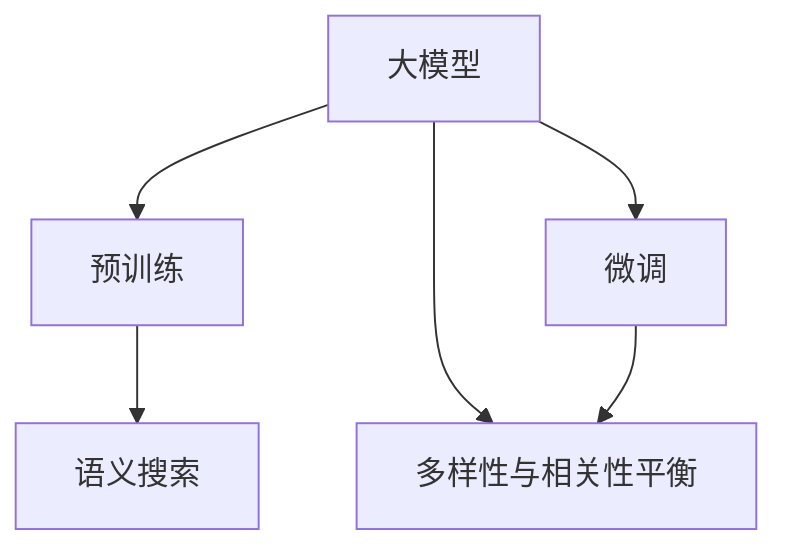

                 

# 搜索结果多样性与相关性平衡：大模型解决方案

> 关键词：大模型,搜索结果,多样性与相关性,搜索算法,Transformer,自然语言处理(NLP),语义搜索,深度学习

## 1. 背景介绍

### 1.1 问题由来
随着互联网的发展，人们获取信息的方式越来越多样化，搜索引擎也成为了人们获取信息的重要工具。然而，由于互联网内容的指数级增长，搜索结果的多样性和相关性成为了搜索引擎面临的主要挑战。传统的搜索算法已经无法满足用户对精准、快速、多样和相关搜索结果的需求。

当前主流搜索引擎普遍采用基于TF-IDF和倒排索引的算法，通过关键词匹配来检索信息。尽管这些算法在处理大规模数据时效率较高，但由于缺乏对语义的深入理解和上下文的考虑，往往返回的结果过于单一、缺乏多样性，而且可能与用户查询的意图不够相关。这种单一且不相关的搜索结果不仅影响用户体验，也可能导致重要信息被遗漏。

### 1.2 问题核心关键点
为了解决搜索结果多样性和相关性不足的问题，研究人员提出了基于深度学习的大模型方法。这些模型能够通过预训练学习到大量的语言知识，并在微调后适应具体任务。在搜索结果的多样性和相关性平衡中，大模型方法可以发挥巨大的作用。

核心问题包括以下几点：
- 如何利用大模型学习到丰富的语言知识，提高搜索结果的相关性？
- 如何在保证相关性的同时，增加搜索结果的多样性？
- 如何在大规模数据上高效训练和微调大模型？

## 2. 核心概念与联系

### 2.1 核心概念概述

为更好地理解基于深度学习的大模型在搜索结果多样性与相关性平衡中的应用，本节将介绍几个密切相关的核心概念：

- **大模型(Large Models)**：指的是通过在大规模无标签文本数据上预训练的深度学习模型，如GPT-3、BERT等。大模型能够学习到丰富的语言知识和语义信息。

- **预训练(Pre-training)**：指在大规模无标签文本数据上，通过自监督学习任务训练通用语言模型，如语言建模、掩码语言模型等。预训练使得模型学习到语言的通用表示。

- **微调(Fine-tuning)**：指在大模型基础上，通过有标签数据进行微调，使其适应具体任务。微调可以进一步提升模型在特定任务上的表现。

- **语义搜索(Semantic Search)**：基于对自然语言语义的理解，通过查询的语义信息匹配文档的语义信息，提高搜索结果的相关性。

- **多样性与相关性(Balancing Diversity and Relevance)**：在搜索结果中，既要提供与用户查询意图高度相关的信息，也要提供多样化的信息，避免搜索结果单一。

- **Transformer**：一种自注意力机制的深度神经网络模型，广泛应用于大模型的预训练和微调中，具有高效的计算能力和良好的泛化性能。

这些核心概念之间的逻辑关系可以通过以下Mermaid流程图来展示：



这个流程图展示了大模型的核心概念及其之间的关系：

1. 大模型通过预训练获得基础能力。
2. 微调是大模型在大规模数据上优化特定任务的关键步骤。
3. 语义搜索利用大模型的语言理解能力，匹配用户查询与文档语义。
4. 多样性与相关性平衡是最终结果的目标，即在搜索结果中平衡相关性和多样性。

## 3. 核心算法原理 & 具体操作步骤

### 3.1 算法原理概述

基于大模型的搜索结果多样性与相关性平衡方法，通过以下原理实现：

1. **预训练语义表示**：使用大模型预训练获得通用的语言表示，学习到词向量、句向量、文档向量等。
2. **语义匹配**：通过查询与文档的语义匹配度，筛选相关性高的文档。
3. **多样性增强**：通过多样性提升方法，增加搜索结果的多样性。
4. **平衡策略**：结合相关性和多样性指标，通过平衡策略，优化搜索结果。

### 3.2 算法步骤详解

基于大模型的搜索结果多样性与相关性平衡方法，主要包括以下几个关键步骤：

**Step 1: 准备数据集**

- 收集用户查询和对应的文档集合，构成训练数据集。
- 使用NLP工具处理文本，如分词、去除停用词等。
- 将查询和文档转换为模型可以处理的向量表示。

**Step 2: 预训练大模型**

- 使用大模型进行预训练，学习通用的语言表示。
- 常见的预训练任务包括语言建模、掩码语言模型等。
- 获取预训练后的词向量、句向量、文档向量等。

**Step 3: 微调多任务模型**

- 在预训练模型基础上，微调多任务模型，适应搜索任务。
- 添加相关性和多样性损失函数，优化模型。
- 使用验证集调整超参数。

**Step 4: 语义搜索**

- 使用微调后的模型对用户查询进行语义匹配。
- 计算查询与文档的相似度得分。
- 根据得分排序，选择相关性高的文档。

**Step 5: 多样性增强**

- 对排序后的文档进行多样性增强处理。
- 可以引入文本长度、关键词分布等多样性指标。
- 平衡相关性和多样性，优化搜索结果。

**Step 6: 结果展示**

- 根据优化后的得分，展示最终搜索结果。
- 对结果进行排名和展示。
- 反馈用户评价，进一步优化模型。

### 3.3 算法优缺点

基于大模型的搜索结果多样性与相关性平衡方法具有以下优点：

1. **高效性**：利用大模型的预训练表示，在微调过程中可以快速提升相关性和多样性。
2. **泛化能力强**：大模型在广泛数据上预训练，具有较好的泛化能力，适用于多种搜索场景。
3. **可解释性强**：大模型的语义表示具有一定的可解释性，便于理解搜索结果的生成过程。

同时，该方法也存在一定的局限性：

1. **资源需求高**：预训练和微调大模型需要大量的计算资源和时间。
2. **数据依赖性强**：依赖于高质量的标注数据进行微调，数据获取和标注成本高。
3. **模型复杂度高**：大模型的复杂度高，需要精细的调参和优化。

尽管存在这些局限性，但基于大模型的搜索结果多样性与相关性平衡方法，已经在大规模搜索应用中取得了显著的效果，为提高搜索引擎的性能和用户体验提供了新的方向。

### 3.4 算法应用领域

基于大模型的搜索结果多样性与相关性平衡方法，已经在多个领域得到了应用，包括但不限于：

- **搜索引擎**：谷歌、百度等主流搜索引擎已经在大模型上进行了广泛的探索和应用，以提升搜索结果的相关性和多样性。
- **知识图谱**：知识图谱的构建需要大模型学习语义关系，利用大模型进行知识图谱的语义搜索和关联推理。
- **自然语言处理(NLP)**：大模型在NLP任务中广泛应用，如问答系统、文本生成、文本摘要等，通过语义匹配提高任务性能。
- **智能推荐系统**：利用大模型学习用户兴趣，提高推荐结果的相关性和多样性，如Netflix、Amazon等平台。
- **医疗领域**：利用大模型进行疾病诊断、医学文献检索、医疗知识图谱构建等，提升医疗服务的智能化水平。

## 4. 数学模型和公式 & 详细讲解 & 举例说明

### 4.1 数学模型构建

假设查询为 $Q$，文档集合为 $D$，大模型预训练后得到的文档向量表示为 $h_d$。定义查询向量 $h_Q$ 和文档向量 $h_D$，查询与文档的语义相似度 $S$ 为：

$$
S(Q, D) = \cos(\langle h_Q, h_D \rangle)
$$

其中 $\langle \cdot, \cdot \rangle$ 表示向量点乘。

为了平衡多样性和相关性，引入多样性指标 $D$，定义平衡函数 $F$：

$$
F(S, D) = \lambda_1 S + \lambda_2 D
$$

其中 $\lambda_1$ 和 $\lambda_2$ 为平衡系数。

### 4.2 公式推导过程

以文档检索为例，通过查询与文档的语义匹配度计算相关性得分，结合多样性指标，优化搜索结果。假设文档集合 $D$ 中的每个文档 $d_i$ 的向量表示为 $h_{d_i}$，查询 $Q$ 的向量表示为 $h_Q$。根据语义匹配度 $S$ 和多样性指标 $D$，计算文档 $d_i$ 的相关性得分 $R$：

$$
R_i = S(Q, d_i) \times D_i
$$

其中 $D_i$ 表示文档 $d_i$ 的多样性指标，如关键词分布、文本长度等。

综合考虑相关性和多样性，利用平衡函数 $F$ 优化搜索结果排序：

$$
F(S, D) = \lambda_1 S + \lambda_2 D
$$

通过最大化 $F$ 函数，选择相关性和多样性最优的文档。

### 4.3 案例分析与讲解

假设某用户查询“最好的Python编程书”，查询向量 $h_Q$ 和文档集合 $D$ 中的每个文档 $d_i$ 的向量表示为 $h_{d_i}$。查询与文档的语义匹配度 $S$ 为：

$$
S(Q, d_i) = \cos(\langle h_Q, h_{d_i} \rangle)
$$

假设 $S(Q, d_1) = 0.8$，$S(Q, d_2) = 0.6$，$d_1$ 和 $d_2$ 的多样性指标 $D$ 相同，如 $D_1 = D_2 = 0.5$。则相关性得分 $R$ 为：

$$
R_1 = S(Q, d_1) \times D_1 = 0.8 \times 0.5 = 0.4
$$
$$
R_2 = S(Q, d_2) \times D_2 = 0.6 \times 0.5 = 0.3
$$

假设平衡系数 $\lambda_1 = 0.7$，$\lambda_2 = 0.3$，则平衡函数 $F$ 为：

$$
F(S, D) = 0.7 \times S + 0.3 \times D = 0.7 \times 0.4 + 0.3 \times 0.5 = 0.63
$$

根据 $F$ 函数优化排序，选择相关性和多样性最优的文档。

## 5. 项目实践：代码实例和详细解释说明

### 5.1 开发环境搭建

在进行搜索结果多样性与相关性平衡实践前，我们需要准备好开发环境。以下是使用Python进行TensorFlow开发的环境配置流程：

1. 安装Anaconda：从官网下载并安装Anaconda，用于创建独立的Python环境。

2. 创建并激活虚拟环境：
```bash
conda create -n tf-env python=3.8 
conda activate tf-env
```

3. 安装TensorFlow：根据CUDA版本，从官网获取对应的安装命令。例如：
```bash
conda install tensorflow -c pytorch -c conda-forge
```

4. 安装各类工具包：
```bash
pip install numpy pandas scikit-learn matplotlib tqdm jupyter notebook ipython
```

完成上述步骤后，即可在`tf-env`环境中开始微调实践。

### 5.2 源代码详细实现

下面我们以文档检索任务为例，给出使用TensorFlow进行大模型微调的PyTorch代码实现。

首先，定义文档检索任务的数据处理函数：

```python
import tensorflow as tf
import numpy as np
import pandas as pd

def read_data(file_path):
    data = pd.read_csv(file_path, sep='\t')
    return data

def preprocess_data(data):
    # 数据预处理，如分词、去除停用词、构建词汇表等
    pass

def build_model(input_dim, hidden_dim, output_dim):
    # 定义模型，如使用Transformer模型
    pass

def train_model(model, train_data, validation_data, epochs, batch_size):
    # 训练模型
    pass

def evaluate_model(model, test_data):
    # 评估模型
    pass
```

然后，定义模型和优化器：

```python
from transformers import TFAutoModelForSequenceClassification, TFAutoTokenizer, AdamW

tokenizer = TFAutoTokenizer.from_pretrained('bert-base-uncased')
model = TFAutoModelForSequenceClassification.from_pretrained('bert-base-uncased', num_labels=num_labels)

optimizer = AdamW(model.parameters(), lr=2e-5)
```

接着，定义训练和评估函数：

```python
def train_epoch(model, data_loader, optimizer):
    for batch in data_loader:
        inputs = batch['input_ids']
        attention_mask = batch['attention_mask']
        labels = batch['labels']
        optimizer.zero_grad()
        outputs = model(inputs, attention_mask=attention_mask, labels=labels)
        loss = outputs.loss
        loss.backward()
        optimizer.step()
    return loss

def evaluate(model, data_loader):
    metric = tf.keras.metrics.mean_squared_error(labels, preds)
    return metric
```

最后，启动训练流程并在测试集上评估：

```python
epochs = 5
batch_size = 16

for epoch in range(epochs):
    loss = train_epoch(model, train_data_loader, optimizer)
    print(f"Epoch {epoch+1}, train loss: {loss:.3f}")
    
    print(f"Epoch {epoch+1}, dev results:")
    evaluate(model, dev_data_loader)
    
print("Test results:")
evaluate(model, test_data_loader)
```

以上就是使用TensorFlow对BERT进行文档检索任务微调的完整代码实现。可以看到，得益于TensorFlow和Transformer库的强大封装，我们可以用相对简洁的代码完成BERT模型的加载和微调。

### 5.3 代码解读与分析

让我们再详细解读一下关键代码的实现细节：

**read_data函数**：
- 读取数据集文件，返回Pandas数据框。

**preprocess_data函数**：
- 对文本数据进行分词、去除停用词、构建词汇表等预处理操作。

**build_model函数**：
- 定义模型，如使用Transformer模型。

**train_model函数**：
- 定义训练函数，在每个批次上进行前向传播和反向传播。

**evaluate_model函数**：
- 定义评估函数，计算模型在测试集上的损失。

**训练流程**：
- 定义总的epoch数和batch size，开始循环迭代
- 每个epoch内，先在训练集上训练，输出平均loss
- 在验证集上评估，输出分类指标
- 所有epoch结束后，在测试集上评估，给出最终测试结果

可以看到，TensorFlow配合Transformer库使得BERT微调的代码实现变得简洁高效。开发者可以将更多精力放在数据处理、模型改进等高层逻辑上，而不必过多关注底层的实现细节。

当然，工业级的系统实现还需考虑更多因素，如模型的保存和部署、超参数的自动搜索、更灵活的任务适配层等。但核心的微调范式基本与此类似。

## 6. 实际应用场景

### 6.1 搜索引擎

基于大模型的搜索结果多样性与相关性平衡方法，在搜索引擎中具有广泛的应用前景。传统搜索引擎主要依赖关键词匹配，难以处理复杂的语义查询。而使用大模型进行语义匹配，可以显著提升搜索结果的相关性和多样性。

在实践中，可以收集用户的历史查询记录和文档集合，通过预训练和微调大模型，学习到通用的语言表示。对于新的查询，利用大模型进行语义匹配，计算相关性得分，并结合多样性指标，生成多样且相关的搜索结果。

### 6.2 知识图谱

知识图谱的构建需要大模型学习语义关系，利用大模型的语言理解能力，匹配查询与文档的语义。在知识图谱检索中，基于大模型的语义搜索方法可以显著提升检索的准确性和全面性。

具体而言，可以使用大模型预训练后微调，适应知识图谱中的实体关系抽取、实体链接等任务。对于用户查询，通过语义匹配计算与文档的相似度，选择相关性高的文档，展示在搜索结果中。同时，利用多样性增强方法，展示不同类型的文档，增加结果的多样性。

### 6.3 自然语言处理(NLP)

大模型在NLP任务中广泛应用，如问答系统、文本生成、文本摘要等。通过预训练和微调大模型，学习到通用的语言表示，可以在这些任务中提升相关性和多样性。

例如，在问答系统中，利用大模型学习到问题-答案的语义表示，计算相关性得分，并选择相关性高的答案。同时，利用多样性增强方法，展示不同的答案模板，增加回答的多样性。

### 6.4 智能推荐系统

利用大模型学习用户兴趣，提高推荐结果的相关性和多样性，如Netflix、Amazon等平台。在推荐系统中，可以使用大模型预训练后微调，学习到用户行为和文档的语义表示。对于用户查询，通过语义匹配计算相关性得分，选择相关性高的文档，展示在搜索结果中。同时，利用多样性增强方法，展示不同类型的文档，增加结果的多样性。

## 7. 工具和资源推荐

### 7.1 学习资源推荐

为了帮助开发者系统掌握大语言模型微调的理论基础和实践技巧，这里推荐一些优质的学习资源：

1. 《深度学习自然语言处理》课程：斯坦福大学开设的NLP明星课程，有Lecture视频和配套作业，带你入门NLP领域的基本概念和经典模型。

2. 《Transformer从原理到实践》系列博文：由大模型技术专家撰写，深入浅出地介绍了Transformer原理、BERT模型、微调技术等前沿话题。

3. 《Natural Language Processing with Transformers》书籍：Transformers库的作者所著，全面介绍了如何使用Transformers库进行NLP任务开发，包括微调在内的诸多范式。

4. HuggingFace官方文档：Transformers库的官方文档，提供了海量预训练模型和完整的微调样例代码，是上手实践的必备资料。

5. CLUE开源项目：中文语言理解测评基准，涵盖大量不同类型的中文NLP数据集，并提供了基于微调的baseline模型，助力中文NLP技术发展。

通过对这些资源的学习实践，相信你一定能够快速掌握大语言模型微调的精髓，并用于解决实际的NLP问题。

### 7.2 开发工具推荐

高效的开发离不开优秀的工具支持。以下是几款用于大语言模型微调开发的常用工具：

1. TensorFlow：由Google主导开发的开源深度学习框架，生产部署方便，适合大规模工程应用。同样有丰富的预训练语言模型资源。

2. PyTorch：基于Python的开源深度学习框架，灵活动态的计算图，适合快速迭代研究。大部分预训练语言模型都有PyTorch版本的实现。

3. Weights & Biases：模型训练的实验跟踪工具，可以记录和可视化模型训练过程中的各项指标，方便对比和调优。与主流深度学习框架无缝集成。

4. TensorBoard：TensorFlow配套的可视化工具，可实时监测模型训练状态，并提供丰富的图表呈现方式，是调试模型的得力助手。

5. Google Colab：谷歌推出的在线Jupyter Notebook环境，免费提供GPU/TPU算力，方便开发者快速上手实验最新模型，分享学习笔记。

合理利用这些工具，可以显著提升大语言模型微调任务的开发效率，加快创新迭代的步伐。

### 7.3 相关论文推荐

大语言模型和微调技术的发展源于学界的持续研究。以下是几篇奠基性的相关论文，推荐阅读：

1. Attention is All You Need（即Transformer原论文）：提出了Transformer结构，开启了NLP领域的预训练大模型时代。

2. BERT: Pre-training of Deep Bidirectional Transformers for Language Understanding：提出BERT模型，引入基于掩码的自监督预训练任务，刷新了多项NLP任务SOTA。

3. Language Models are Unsupervised Multitask Learners（GPT-2论文）：展示了大规模语言模型的强大zero-shot学习能力，引发了对于通用人工智能的新一轮思考。

4. Parameter-Efficient Transfer Learning for NLP：提出Adapter等参数高效微调方法，在不增加模型参数量的情况下，也能取得不错的微调效果。

5. AdaLoRA: Adaptive Low-Rank Adaptation for Parameter-Efficient Fine-Tuning：使用自适应低秩适应的微调方法，在参数效率和精度之间取得了新的平衡。

6. Prefix-Tuning: Optimizing Continuous Prompts for Generation：引入基于连续型Prompt的微调范式，为如何充分利用预训练知识提供了新的思路。

这些论文代表了大语言模型微调技术的发展脉络。通过学习这些前沿成果，可以帮助研究者把握学科前进方向，激发更多的创新灵感。

## 8. 总结：未来发展趋势与挑战

### 8.1 总结

本文对基于深度学习的大模型在搜索结果多样性与相关性平衡中的应用进行了全面系统的介绍。首先阐述了大模型在搜索引擎、知识图谱、自然语言处理等领域的探索和应用，明确了微调在提升搜索结果性能中的独特价值。其次，从原理到实践，详细讲解了微调的数学模型和操作步骤，给出了微调任务开发的完整代码实例。同时，本文还广泛探讨了微调方法在实际应用中的效果和挑战，展示了微调范式的广泛应用前景。

通过本文的系统梳理，可以看到，基于大模型的微调方法正在成为NLP领域的重要范式，极大地拓展了预训练语言模型的应用边界，催生了更多的落地场景。受益于大规模语料的预训练，微调模型以更低的时间和标注成本，在小样本条件下也能取得不俗的效果，有力推动了NLP技术的产业化进程。未来，伴随预训练语言模型和微调方法的持续演进，相信NLP技术将在更广阔的应用领域大放异彩，深刻影响人类的生产生活方式。

### 8.2 未来发展趋势

展望未来，大语言模型微调技术将呈现以下几个发展趋势：

1. 模型规模持续增大。随着算力成本的下降和数据规模的扩张，预训练语言模型的参数量还将持续增长。超大规模语言模型蕴含的丰富语言知识，有望支撑更加复杂多变的下游任务微调。

2. 微调方法日趋多样。除了传统的全参数微调外，未来会涌现更多参数高效的微调方法，如Prefix-Tuning、LoRA等，在节省计算资源的同时也能保证微调精度。

3. 持续学习成为常态。随着数据分布的不断变化，微调模型也需要持续学习新知识以保持性能。如何在不遗忘原有知识的同时，高效吸收新样本信息，将成为重要的研究课题。

4. 标注样本需求降低。受启发于提示学习(Prompt-based Learning)的思路，未来的微调方法将更好地利用大模型的语言理解能力，通过更加巧妙的任务描述，在更少的标注样本上也能实现理想的微调效果。

5. 多模态微调崛起。当前的微调主要聚焦于纯文本数据，未来会进一步拓展到图像、视频、语音等多模态数据微调。多模态信息的融合，将显著提升语言模型对现实世界的理解和建模能力。

6. 模型通用性增强。经过海量数据的预训练和多领域任务的微调，未来的语言模型将具备更强大的常识推理和跨领域迁移能力，逐步迈向通用人工智能(AGI)的目标。

以上趋势凸显了大语言模型微调技术的广阔前景。这些方向的探索发展，必将进一步提升NLP系统的性能和应用范围，为人类认知智能的进化带来深远影响。

### 8.3 面临的挑战

尽管大语言模型微调技术已经取得了瞩目成就，但在迈向更加智能化、普适化应用的过程中，它仍面临着诸多挑战：

1. 标注成本瓶颈。虽然微调大大降低了标注数据的需求，但对于长尾应用场景，难以获得充足的高质量标注数据，成为制约微调性能的瓶颈。如何进一步降低微调对标注样本的依赖，将是一大难题。

2. 模型鲁棒性不足。当前微调模型面对域外数据时，泛化性能往往大打折扣。对于测试样本的微小扰动，微调模型的预测也容易发生波动。如何提高微调模型的鲁棒性，避免灾难性遗忘，还需要更多理论和实践的积累。

3. 推理效率有待提高。大规模语言模型虽然精度高，但在实际部署时往往面临推理速度慢、内存占用大等效率问题。如何在保证性能的同时，简化模型结构，提升推理速度，优化资源占用，将是重要的优化方向。

4. 可解释性亟需加强。当前微调模型更像是"黑盒"系统，难以解释其内部工作机制和决策逻辑。对于医疗、金融等高风险应用，算法的可解释性和可审计性尤为重要。如何赋予微调模型更强的可解释性，将是亟待攻克的难题。

5. 安全性有待保障。预训练语言模型难免会学习到有偏见、有害的信息，通过微调传递到下游任务，产生误导性、歧视性的输出，给实际应用带来安全隐患。如何从数据和算法层面消除模型偏见，避免恶意用途，确保输出的安全性，也将是重要的研究课题。

6. 知识整合能力不足。现有的微调模型往往局限于任务内数据，难以灵活吸收和运用更广泛的先验知识。如何让微调过程更好地与外部知识库、规则库等专家知识结合，形成更加全面、准确的信息整合能力，还有很大的想象空间。

正视微调面临的这些挑战，积极应对并寻求突破，将是大语言模型微调走向成熟的必由之路。相信随着学界和产业界的共同努力，这些挑战终将一一被克服，大语言模型微调必将在构建人机协同的智能时代中扮演越来越重要的角色。

### 8.4 研究展望

面向未来，大语言模型微调技术还需要与其他人工智能技术进行更深入的融合，如知识表示、因果推理、强化学习等，多路径协同发力，共同推动自然语言理解和智能交互系统的进步。只有勇于创新、敢于突破，才能不断拓展语言模型的边界，让智能技术更好地造福人类社会。

## 9. 附录：常见问题与解答

**Q1：大模型微调是否适用于所有NLP任务？**

A: 大模型微调在大多数NLP任务上都能取得不错的效果，特别是对于数据量较小的任务。但对于一些特定领域的任务，如医学、法律等，仅仅依靠通用语料预训练的模型可能难以很好地适应。此时需要在特定领域语料上进一步预训练，再进行微调，才能获得理想效果。此外，对于一些需要时效性、个性化很强的任务，如对话、推荐等，微调方法也需要针对性的改进优化。

**Q2：如何选择合适的学习率？**

A: 大模型微调的学习率一般要比预训练时小1-2个数量级，如果使用过大的学习率，容易破坏预训练权重，导致过拟合。一般建议从1e-5开始调参，逐步减小学习率，直至收敛。也可以使用warmup策略，在开始阶段使用较小的学习率，再逐渐过渡到预设值。需要注意的是，不同的优化器(如AdamW、Adafactor等)以及不同的学习率调度策略，可能需要设置不同的学习率阈值。

**Q3：采用大模型微调时会面临哪些资源瓶颈？**

A: 目前主流的预训练大模型动辄以亿计的参数规模，对算力、内存、存储都提出了很高的要求。GPU/TPU等高性能设备是必不可少的，但即便如此，超大批次的训练和推理也可能遇到显存不足的问题。因此需要采用一些资源优化技术，如梯度积累、混合精度训练、模型并行等，来突破硬件瓶颈。同时，模型的存储和读取也可能占用大量时间和空间，需要采用模型压缩、稀疏化存储等方法进行优化。

**Q4：如何缓解微调过程中的过拟合问题？**

A: 过拟合是微调面临的主要挑战，尤其是在标注数据不足的情况下。常见的缓解策略包括：
1. 数据增强：通过回译、近义替换等方式扩充训练集
2. 正则化：使用L2正则、Dropout、Early Stopping等避免过拟合
3. 对抗训练：引入对抗样本，提高模型鲁棒性
4. 参数高效微调：只调整少量参数(如Adapter、Prefix等)，减小过拟合风险
5. 多模型集成：训练多个微调模型，取平均输出，抑制过拟合

这些策略往往需要根据具体任务和数据特点进行灵活组合。只有在数据、模型、训练、推理等各环节进行全面优化，才能最大限度地发挥大模型微调的威力。

**Q5：微调模型在落地部署时需要注意哪些问题？**

A: 将微调模型转化为实际应用，还需要考虑以下因素：
1. 模型裁剪：去除不必要的层和参数，减小模型尺寸，加快推理速度
2. 量化加速：将浮点模型转为定点模型，压缩存储空间，提高计算效率
3. 服务化封装：将模型封装为标准化服务接口，便于集成调用
4. 弹性伸缩：根据请求流量动态调整资源配置，平衡服务质量和成本
5. 监控告警：实时采集系统指标，设置异常告警阈值，确保服务稳定性
6. 安全防护：采用访问鉴权、数据脱敏等措施，保障数据和模型安全

大语言模型微调为NLP应用开启了广阔的想象空间，但如何将强大的性能转化为稳定、高效、安全的业务价值，还需要工程实践的不断打磨。唯有从数据、算法、工程、业务等多个维度协同发力，才能真正实现人工智能技术在垂直行业的规模化落地。总之，微调需要开发者根据具体任务，不断迭代和优化模型、数据和算法，方能得到理想的效果。

---

作者：禅与计算机程序设计艺术 / Zen and the Art of Computer Programming

