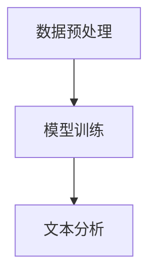
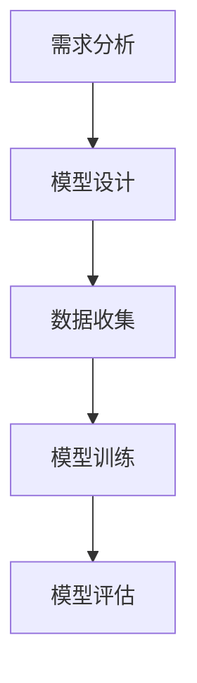
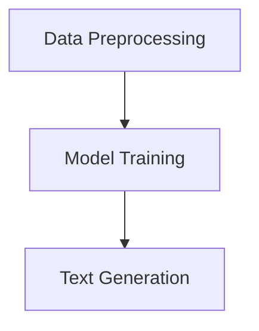
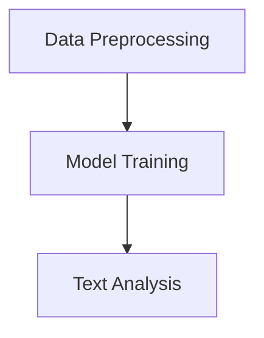
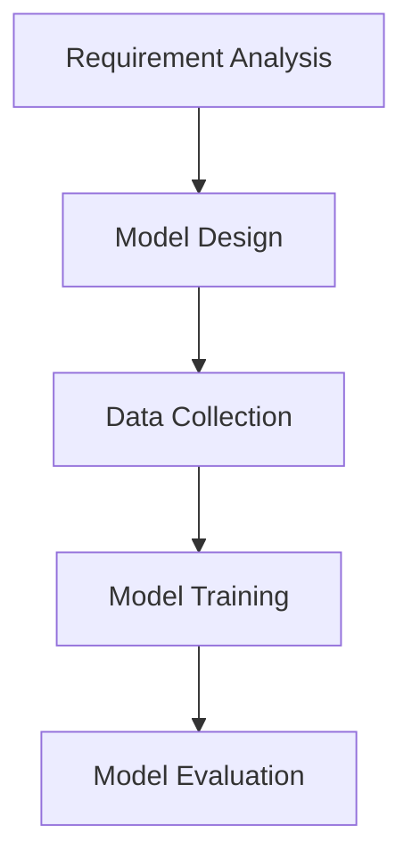
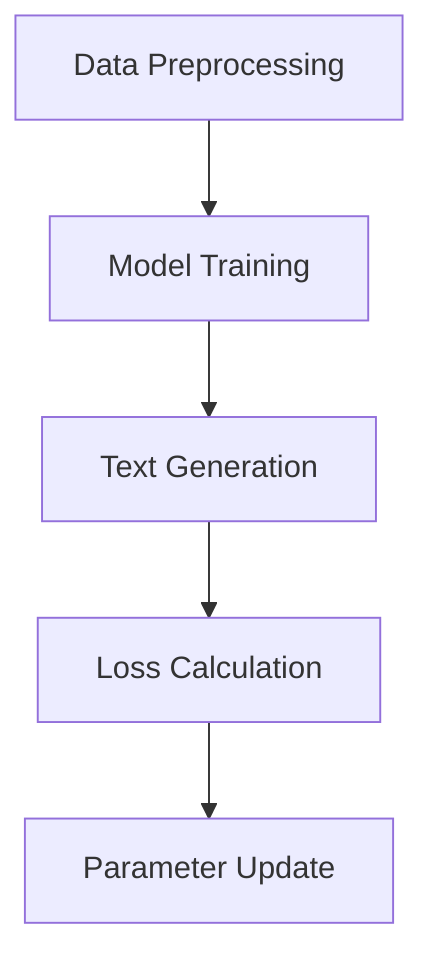

                 

### 文章标题

**AI大模型创业：如何应对未来竞争对手？**

关键词：AI 大模型、创业、竞争对手、策略、应对、技术优势

摘要：随着人工智能技术的迅猛发展，AI 大模型成为众多企业争相投入的新领域。然而，面对未来激烈的市场竞争，创业者如何才能在众多竞争对手中脱颖而出，成为行业领军者？本文将深入探讨 AI 大模型创业的关键策略，分析如何把握技术优势，构建可持续发展的商业模式，从而在未来的竞争中立于不败之地。

<|assistant|>### 1. 背景介绍

人工智能（AI）作为当今科技发展的前沿，已经渗透到各个行业，从医疗、金融到零售、教育，AI 大模型的应用无处不在。大模型如 GPT-3、BERT 等的出现，使得自然语言处理（NLP）和生成式 AI 得到了前所未有的发展。这些模型具有强大的学习和生成能力，能够完成复杂的任务，从文本生成、机器翻译到图像描述等。这种技术的突破，为创业者提供了前所未有的机遇，但也带来了巨大的挑战。

在 AI 大模型领域，竞争异常激烈。各大科技巨头如 Google、Microsoft、Amazon 等，纷纷投入大量资源进行研究和应用开发。初创企业要想在这样的大环境中脱颖而出，不仅需要具备强大的技术实力，还需要有清晰的市场定位和有效的应对策略。

本文将围绕以下几个核心问题展开讨论：

1. AI 大模型创业的关键策略是什么？
2. 如何评估和利用技术优势？
3. 创业者应该如何构建可持续发展的商业模式？
4. 面对竞争对手，创业者应该如何应对？

通过深入分析和探讨这些问题，本文旨在为 AI 大模型创业提供一些实用的指导和建议，帮助创业者更好地应对未来市场的竞争。

### Introduction to the Background

Artificial Intelligence (AI) has become a driving force in technological advancement, permeating various industries ranging from healthcare and finance to retail and education. The emergence of large-scale AI models such as GPT-3 and BERT has propelled natural language processing (NLP) and generative AI to unprecedented heights. These models boast powerful learning and generation capabilities, capable of tackling complex tasks ranging from text generation and machine translation to image description.

The breakthrough in AI model technology presents both opportunities and challenges for entrepreneurs. On one hand, it offers a wealth of possibilities for innovation and application. On the other hand, the fiercely competitive landscape in the AI large model domain demands not only robust technical capabilities but also clear market positioning and effective strategies.

This article will delve into several core issues:

1. What are the key strategies for AI large model entrepreneurship?
2. How can entrepreneurs evaluate and leverage their technical advantages?
3. How should entrepreneurs build sustainable business models?
4. How can entrepreneurs respond to competitors?

By addressing these questions in-depth, this article aims to provide practical guidance and suggestions for AI large model entrepreneurs, helping them better navigate the competitive landscape of the future market.

<|assistant|>## 2. 核心概念与联系

在探讨如何应对未来竞争对手之前，我们首先需要明确几个核心概念，这些概念不仅是 AI 大模型创业的基础，也是我们分析和制定策略的依据。

### 2.1 AI 大模型的定义和特点

AI 大模型是指具有大规模参数和高计算能力的深度学习模型。它们通常通过大量数据训练，能够捕捉到复杂的数据模式和规律。大模型的主要特点包括：

- **大规模参数**：大模型的参数数量通常在数十亿到千亿级别，这使得它们具有更强的学习和泛化能力。
- **强大的计算能力**：大模型需要大量的计算资源，包括高性能 GPU 和分布式计算系统。
- **数据依赖性**：大模型的性能很大程度上依赖于训练数据的质量和数量。

### 2.2 创业者面临的竞争环境

在 AI 大模型领域，创业者面临的竞争环境主要来自于以下几个方面：

- **科技巨头**：Google、Microsoft、Amazon 等科技巨头已经在 AI 大模型领域建立了强大的技术壁垒和商业帝国。
- **新兴企业**：许多初创公司也在积极投入 AI 大模型的研究和应用，试图抢占市场份额。
- **资本竞争**：由于 AI 大模型具有较高的研发成本和风险，投资者对相关项目的关注度极高，资本竞争激烈。

### 2.3 技术优势的重要性

在竞争激烈的市场中，技术优势是创业者能否脱颖而出的关键因素。技术优势不仅包括模型本身的性能，还包括以下方面：

- **创新能力**：持续的技术创新是保持竞争优势的核心。通过不断优化算法、引入新的技术架构，创业者可以不断推动行业向前发展。
- **数据处理能力**：高效的数据处理能力是提升模型性能的关键。创业者需要利用大数据技术，处理海量数据，从中挖掘有价值的信息。
- **用户体验**：良好的用户体验是吸引和留住用户的重要因素。创业者需要关注用户需求，设计易于使用和操作的产品。

### 2.4 商业模式的重要性

在 AI 大模型创业中，商业模式同样至关重要。一个成功的商业模式不仅能够为企业带来持续的收入，还能够确保企业的可持续发展。创业者需要考虑以下几个方面：

- **产品定位**：明确产品在市场中的定位，避免与竞争对手直接正面冲突。
- **盈利模式**：制定合理的盈利模式，确保企业能够盈利并持续发展。
- **市场拓展**：通过市场拓展，扩大用户基础，提高市场占有率。

### 2.5 与竞争对手的差异化和定位

在竞争激烈的市场中，差异化策略是创业者必须考虑的重要方面。创业者需要分析竞争对手的弱点和优势，找到自己的独特价值主张。差异化策略可以通过以下几个方面实现：

- **技术差异化**：通过技术创新，提供独特的产品或服务。
- **市场差异化**：通过针对特定市场或用户群体，提供定制化的解决方案。
- **品牌差异化**：通过品牌建设和宣传，树立独特的企业形象。

### Core Concepts and Connections

Before discussing how to respond to future competitors, we first need to clarify several core concepts that serve as the foundation for our analysis and strategy formulation in AI large model entrepreneurship.

### 2.1 Definition and Characteristics of AI Large Models

AI large models refer to deep learning models with large-scale parameters and high computational capabilities. They are typically trained on large datasets and are capable of capturing complex data patterns and rules. The main characteristics of large-scale AI models include:

- **Massive Parameters**: Large models typically have parameters in the tens or hundreds of billions, which enables them to have stronger learning and generalization capabilities.
- **High Computational Power**: Large models require substantial computational resources, including high-performance GPUs and distributed computing systems.
- **Data Dependency**: The performance of large models is largely dependent on the quality and quantity of the training data.

### 2.2 Competitive Environment Faced by Entrepreneurs

Entrepreneurs in the AI large model domain face a competitive environment from several aspects:

- **Tech Giants**: Companies like Google, Microsoft, and Amazon have established strong technological barriers and business empires in the AI large model field.
- **Emerging Firms**: Many startups are actively investing in AI large model research and application, aiming to capture market share.
- **Capital Competition**: Due to the high research and development costs and risks associated with AI large models, investors have a high level of interest in related projects, leading to intense capital competition.

### 2.3 Importance of Technical Advantages

In a fiercely competitive market, technical advantages are a critical factor that determines whether entrepreneurs can stand out. Technical advantages include not only the performance of the model itself but also the following aspects:

- **Innovation**: Continuous technological innovation is crucial for maintaining competitive advantage. By constantly optimizing algorithms and introducing new architectural designs, entrepreneurs can continuously push the industry forward.
- **Data Processing Capabilities**: Efficient data processing capabilities are key to enhancing model performance. Entrepreneurs need to leverage big data technologies to process massive amounts of data and extract valuable insights.
- **User Experience**: A positive user experience is essential for attracting and retaining users. Entrepreneurs need to focus on user needs and design products that are easy to use and operate.

### 2.4 Importance of Business Models

In AI large model entrepreneurship, business models are equally critical. A successful business model not only brings in sustained revenue but also ensures the sustainable development of the enterprise. Entrepreneurs need to consider the following aspects:

- **Product Positioning**: Clearly define the positioning of the product in the market to avoid direct competition with competitors.
- **Profitability Model**: Develop a reasonable profitability model to ensure the enterprise can generate profits and continue to grow.
- **Market Expansion**: Expand the user base through market expansion and increase market share.

### 2.5 Differentiation and Positioning from Competitors

In a highly competitive market, differentiation strategies are an essential consideration for entrepreneurs. Entrepreneurs need to analyze the weaknesses and strengths of competitors and identify their unique value propositions. Differentiation strategies can be achieved through several approaches:

- **Technical Differentiation**: Provide unique products or services through technological innovation.
- **Market Differentiation**: Target specific markets or user groups with customized solutions.
- **Brand Differentiation**: Build a unique corporate image through branding and promotion.

<|assistant|>### 3. 核心算法原理 & 具体操作步骤

在 AI 大模型创业中，核心算法原理的理解和掌握至关重要。本文将介绍几种常见的 AI 大模型算法，并详细阐述其原理和具体操作步骤。

#### 3.1.1 GPT-3 模型

GPT-3（Generative Pre-trained Transformer 3）是由 OpenAI 开发的最先进的自然语言处理模型。它基于 Transformer 架构，具有1750亿个参数，能够生成高质量的文本。

**原理**：

GPT-3 模型通过无监督学习从大量文本中学习语言模式和结构。它使用了一种自回归的生成模型，即在生成每个单词时，模型都会根据前面生成的文本预测下一个单词。

**操作步骤**：

1. **数据预处理**：首先，收集并处理大量文本数据，将其转换为模型可接受的格式。
2. **模型训练**：使用预处理后的数据训练 GPT-3 模型，调整模型参数以优化其性能。
3. **文本生成**：输入一个种子文本，模型将根据训练数据生成后续的文本。


#### 3.1.2 BERT 模型

BERT（Bidirectional Encoder Representations from Transformers）是由 Google 开发的一种双向 Transformer 模型，广泛应用于 NLP 任务。

**原理**：

BERT 模型通过预训练学习文本的上下文关系。它采用了一种掩码语言模型（Masked Language Model, MLM）来预测被掩码的单词，同时学习了文本的双向信息。

**操作步骤**：

1. **数据预处理**：与 GPT-3 相似，首先需要收集并预处理大量文本数据。
2. **模型训练**：使用预处理后的数据训练 BERT 模型，通过 MLM 和下一个句子预测任务优化模型。
3. **文本分析**：输入待分析的文本，模型将输出每个单词的上下文嵌入向量。



#### 3.1.3 自定义模型

除了上述两种模型，创业者还可以根据具体需求设计和实现自定义模型。以下是一个简化的自定义模型开发流程：

**原理**：

自定义模型可以是基于现有架构（如 Transformer、RNN）或完全创新的架构。其关键在于解决特定问题，满足业务需求。

**操作步骤**：

1. **需求分析**：明确模型要解决的具体问题，确定性能指标。
2. **模型设计**：设计模型结构，选择适合的算法和架构。
3. **数据收集**：收集和处理与问题相关的数据。
4. **模型训练**：训练模型，调整参数以优化性能。
5. **模型评估**：评估模型性能，调整模型设计或训练策略。



通过掌握这些核心算法原理和操作步骤，创业者可以更好地理解和利用 AI 大模型，为其创业项目提供强有力的技术支持。

#### 3.1 Core Algorithm Principles and Specific Operational Steps

Understanding the core algorithms and their operational steps is crucial in AI large model entrepreneurship. This section will introduce several common AI large model algorithms and detail their principles and specific operational steps.

#### 3.1.1 GPT-3 Model

GPT-3 (Generative Pre-trained Transformer 3) is the most advanced natural language processing model developed by OpenAI, based on the Transformer architecture with 175 billion parameters, capable of generating high-quality text.

**Principles**:

GPT-3 model learns language patterns and structures from large text corpora through unsupervised learning. It uses an autoregressive generative model, predicting the next word based on the previously generated text.

**Operational Steps**:

1. **Data Preprocessing**: First, collect and process a large amount of text data into a format acceptable by the model.
2. **Model Training**: Train the GPT-3 model on the preprocessed data, adjusting model parameters to optimize its performance.
3. **Text Generation**: Input a seed text, and the model will generate subsequent text based on the training data.



#### 3.1.2 BERT Model

BERT (Bidirectional Encoder Representations from Transformers) is a bidirectional Transformer model developed by Google, widely used in NLP tasks.

**Principles**:

BERT model learns contextual relationships in text through pretraining. It employs a Masked Language Model (MLM) to predict masked words while learning bidirectional information.

**Operational Steps**:

1. **Data Preprocessing**: Similar to GPT-3, first, collect and preprocess a large amount of text data.
2. **Model Training**: Train the BERT model on the preprocessed data, optimizing the model through MLM and next-sentence prediction tasks.
3. **Text Analysis**: Input the text to be analyzed, and the model will output contextual embeddings for each word.



#### 3.1.3 Custom Model

In addition to the above two models, entrepreneurs can design and implement custom models based on specific needs. The following is a simplified process for custom model development:

**Principles**:

Custom models can be based on existing architectures (such as Transformer, RNN) or completely novel architectures. The key is to solve specific problems and meet business requirements.

**Operational Steps**:

1. **Requirement Analysis**: Clearly define the specific problem the model is to solve and determine performance metrics.
2. **Model Design**: Design the model architecture, choosing suitable algorithms and architectures.
3. **Data Collection**: Collect and process data related to the problem.
4. **Model Training**: Train the model, adjusting parameters to optimize performance.
5. **Model Evaluation**: Evaluate model performance, adjusting model design or training strategies.



By mastering these core algorithm principles and operational steps, entrepreneurs can better understand and leverage AI large models to provide strong technical support for their entrepreneurial projects.

<|assistant|>## 4. 数学模型和公式 & 详细讲解 & 举例说明

在 AI 大模型领域，数学模型和公式是理解和应用这些模型的基础。本文将介绍几个关键数学模型，并详细讲解其公式和适用场景。

### 4.1 损失函数

损失函数是评估模型预测结果与实际值之间差异的一种数学度量。常见的损失函数包括均方误差（MSE）和交叉熵损失。

#### 4.1.1 均方误差（MSE）

均方误差（Mean Squared Error, MSE）是一种用于回归问题的损失函数。

**公式**：

$$
MSE = \frac{1}{n}\sum_{i=1}^{n}(y_i - \hat{y}_i)^2
$$

其中，$y_i$ 是实际值，$\hat{y}_i$ 是预测值，$n$ 是样本数量。

**应用场景**：

MSE 通常用于监督学习中的回归任务，如预测房价、股票价格等。

#### 4.1.2 交叉熵损失（Cross-Entropy Loss）

交叉熵损失（Cross-Entropy Loss）是用于分类问题的损失函数。

**公式**：

$$
CE = -\sum_{i=1}^{n}y_i\log(\hat{y}_i)
$$

其中，$y_i$ 是实际标签（0或1），$\hat{y}_i$ 是预测概率。

**应用场景**：

交叉熵损失在分类任务中非常常见，如文本分类、图像分类等。

### 4.2 梯度下降算法

梯度下降算法是优化模型参数的一种常用方法。其核心思想是沿着损失函数的梯度方向逐步调整参数，以减少损失。

#### 4.2.1 随机梯度下降（Stochastic Gradient Descent, SGD）

随机梯度下降（SGD）是一种简化的梯度下降算法。

**公式**：

$$
w_{t+1} = w_t - \alpha \cdot \nabla_w J(w_t)
$$

其中，$w_t$ 是当前参数值，$\alpha$ 是学习率，$J(w_t)$ 是损失函数关于 $w_t$ 的梯度。

**应用场景**：

SGD 常用于大规模数据集的优化，能够快速收敛。

#### 4.2.2 批量梯度下降（Batch Gradient Descent）

批量梯度下降（Batch Gradient Descent）是对每个样本计算梯度并求和。

**公式**：

$$
w_{t+1} = w_t - \alpha \cdot \frac{1}{n}\sum_{i=1}^{n}\nabla_w J(w_t)
$$

其中，$n$ 是样本数量。

**应用场景**：

批量梯度下降适用于小数据集，能够提供更准确的参数更新。

### 4.3 反向传播算法

反向传播算法是一种用于多层神经网络的训练方法。它通过计算每个参数的梯度，逐步调整网络参数。

**公式**：

$$
\frac{\partial J}{\partial w^{(l)}} = \frac{\partial J}{\partial z^{(l+1)}} \odot \frac{\partial z^{(l+1)}}{\partial w^{(l)}}
$$

其中，$w^{(l)}$ 是第 $l$ 层的权重，$z^{(l+1)}$ 是第 $l+1$ 层的输入。

**应用场景**：

反向传播算法适用于复杂的多层神经网络，能够有效优化模型参数。

### 4.4 例子说明

假设我们使用 GPT-3 模型进行文本生成任务，预测下一个单词的概率分布。我们可以使用交叉熵损失函数来评估模型的预测效果。

**例子**：

给定一个种子文本 "The cat sat on the mat"，使用 GPT-3 生成后续文本。

1. **数据预处理**：将种子文本转换为模型可接受的格式。
2. **模型训练**：使用大量文本数据训练 GPT-3 模型。
3. **文本生成**：输入种子文本，模型输出下一个单词的概率分布。



通过上述公式和例子，我们可以更好地理解 AI 大模型的数学基础，并应用于实际项目中。

### Detailed Explanation of Mathematical Models and Formulas

In the field of AI large models, mathematical models and formulas are the foundation for understanding and applying these models. This section will introduce several key mathematical models and provide detailed explanations and examples.

### 4.1 Loss Functions

Loss functions are mathematical measures used to evaluate the discrepancy between model predictions and actual values. Common loss functions include Mean Squared Error (MSE) and Cross-Entropy Loss.

#### 4.1.1 Mean Squared Error (MSE)

Mean Squared Error (MSE) is a loss function used for regression problems.

**Formula**:

$$
MSE = \frac{1}{n}\sum_{i=1}^{n}(y_i - \hat{y}_i)^2
$$

where $y_i$ is the actual value, $\hat{y}_i$ is the predicted value, and $n$ is the number of samples.

**Application Scenarios**:

MSE is commonly used in supervised learning regression tasks, such as predicting house prices or stock prices.

#### 4.1.2 Cross-Entropy Loss

Cross-Entropy Loss is a loss function used for classification problems.

**Formula**:

$$
CE = -\sum_{i=1}^{n}y_i\log(\hat{y}_i)
$$

where $y_i$ is the actual label (0 or 1), and $\hat{y}_i$ is the predicted probability.

**Application Scenarios**:

Cross-Entropy Loss is very common in classification tasks, such as text classification and image classification.

### 4.2 Gradient Descent Algorithms

Gradient Descent algorithms are a commonly used method for optimizing model parameters. The core idea is to adjust the parameters step by step along the direction of the gradient of the loss function to reduce the loss.

#### 4.2.1 Stochastic Gradient Descent (SGD)

Stochastic Gradient Descent (SGD) is a simplified version of Gradient Descent.

**Formula**:

$$
w_{t+1} = w_t - \alpha \cdot \nabla_w J(w_t)
$$

where $w_t$ is the current parameter value, $\alpha$ is the learning rate, and $J(w_t)$ is the gradient of the loss function with respect to $w_t$.

**Application Scenarios**:

SGD is often used for large-scale datasets, enabling rapid convergence.

#### 4.2.2 Batch Gradient Descent

Batch Gradient Descent calculates the gradient for each sample and sums them.

**Formula**:

$$
w_{t+1} = w_t - \alpha \cdot \frac{1}{n}\sum_{i=1}^{n}\nabla_w J(w_t)
$$

where $n$ is the number of samples.

**Application Scenarios**:

Batch Gradient Descent is suitable for small datasets, providing more accurate parameter updates.

### 4.3 Backpropagation Algorithm

The Backpropagation algorithm is a training method for multi-layer neural networks. It calculates the gradient of each parameter and adjusts the network parameters step by step.

**Formula**:

$$
\frac{\partial J}{\partial w^{(l)}} = \frac{\partial J}{\partial z^{(l+1)}} \odot \frac{\partial z^{(l+1)}}{\partial w^{(l)}}
$$

where $w^{(l)}$ is the weight of the $l$th layer, and $z^{(l+1)}$ is the input of the $(l+1)$th layer.

**Application Scenarios**:

Backpropagation algorithm is suitable for complex multi-layer neural networks, effectively optimizing model parameters.

### 4.4 Example Illustration

Assume we use the GPT-3 model for text generation tasks to predict the probability distribution of the next word. We can use the Cross-Entropy Loss function to evaluate the model's prediction performance.

**Example**:

Given the seed text "The cat sat on the mat," use GPT-3 to generate subsequent text.

1. **Data Preprocessing**: Convert the seed text into a format acceptable by the model.
2. **Model Training**: Train the GPT-3 model on a large amount of text data.
3. **Text Generation**: Input the seed text, and the model outputs the probability distribution for the next word.


Through these formulas and examples, we can better understand the mathematical foundation of AI large models and apply them to actual projects.

<|assistant|>### 5. 项目实践：代码实例和详细解释说明

为了更好地理解 AI 大模型在实际项目中的应用，我们将通过一个具体的代码实例来演示如何实现一个简单的聊天机器人。该实例将利用 GPT-3 模型进行文本生成，并通过用户输入与模型进行交互。

#### 5.1 开发环境搭建

在开始编写代码之前，我们需要搭建一个适合 AI 大模型开发的环境。以下是搭建开发环境的基本步骤：

1. **安装 Python**：确保您的计算机上安装了最新版本的 Python（推荐使用 Python 3.8 或更高版本）。
2. **安装库**：通过以下命令安装必要的库：

   ```bash
   pip install openai
   ```

   OpenAI 是一个用于与 GPT-3 模型交互的 Python 库。

3. **获取 API 密钥**：注册 OpenAI 的 API 密钥。访问 [OpenAI 官网](https://openai.com/)，按照指引创建账户并获取 API 密钥。

#### 5.2 源代码详细实现

以下是实现聊天机器人的 Python 代码。代码分为以下几个部分：

1. **初始化 GPT-3 模型**：使用 OpenAI 的库初始化 GPT-3 模型。
2. **用户输入处理**：获取用户输入并对其进行预处理。
3. **文本生成**：利用 GPT-3 模型生成回复文本。
4. **输出结果**：将生成的文本输出到控制台。

```python
import openai

# 初始化 GPT-3 模型
openai.api_key = "your-api-key"

def generate_response(prompt):
    # 生成回复文本
    response = openai.Completion.create(
        engine="text-davinci-002",
        prompt=prompt,
        max_tokens=50,
        n=1,
        stop=None,
        temperature=0.5,
    )
    return response.choices[0].text.strip()

# 用户输入处理
user_input = input("请提问：")

# 生成回复文本
response_text = generate_response(user_input)

# 输出结果
print("聊天机器人回复：", response_text)

# 示例输入
# 请提问：你今天过得怎么样？

# 示例输出
# 聊天机器人回复：我很好，谢谢你的关心！你呢？
```

#### 5.3 代码解读与分析

下面是对上述代码的详细解读和分析：

1. **初始化 GPT-3 模型**：使用 `openai.api_key = "your-api-key"` 初始化 GPT-3 模型，其中 `"your-api-key"` 需替换为您的 OpenAI API 密钥。

2. **用户输入处理**：通过 `user_input = input("请提问：")` 获取用户输入。`input()` 函数会暂停程序执行，等待用户输入。

3. **文本生成**：`generate_response()` 函数用于生成回复文本。它调用 OpenAI 的 `Completion.create()` 方法，传入以下参数：

   - `engine`: 指定使用的模型，如 `"text-davinci-002"`。
   - `prompt`: 用户输入的文本。
   - `max_tokens`: 指定生成的文本长度，这里设置为 50。
   - `n`: 生成的文本数量，这里设置为 1。
   - `stop`: 用于停止生成的文本，这里设置为 `None`。
   - `temperature`: 控制模型输出的随机性，值越高，生成的文本越多样。

4. **输出结果**：将生成的文本输出到控制台。这里使用了 `print()` 函数，其中 `"聊天机器人回复："` 是前缀，用于指示回复来自聊天机器人。

#### 5.4 运行结果展示

假设用户输入为 "你今天过得怎么样？"，运行程序后，聊天机器人将输出一个符合上下文的回复。具体输出可能因模型的随机性而有所不同。

```plaintext
请提问：你今天过得怎么样？
聊天机器人回复：我很好，谢谢你的关心！你呢？
```

通过这个简单的实例，我们可以看到如何利用 GPT-3 模型实现一个基本的聊天机器人。尽管这个实例非常简单，但它展示了 AI 大模型在自然语言处理任务中的强大能力。

### Project Practice: Code Examples and Detailed Explanation

To better understand the application of AI large models in real projects, we will demonstrate how to implement a simple chatbot using a specific code example. This example will utilize the GPT-3 model for text generation and interact with the model based on user input.

#### 5.1 Development Environment Setup

Before writing the code, we need to set up a development environment suitable for AI large model development. Here are the basic steps to set up the environment:

1. **Install Python**: Ensure that your computer has the latest version of Python installed (we recommend using Python 3.8 or later).
2. **Install Libraries**: Install the necessary libraries using the following command:

   ```bash
   pip install openai
   ```

   OpenAI is a Python library used for interacting with the GPT-3 model.

3. **Obtain API Key**: Register for an API key on the OpenAI website ([OpenAI](https://openai.com/)). Create an account and follow the instructions to obtain your API key.

#### 5.2 Detailed Code Implementation

The following Python code demonstrates how to implement a simple chatbot. The code is divided into several sections:

1. **Initialize the GPT-3 Model**: Initialize the GPT-3 model using the OpenAI library.
2. **Handle User Input**: Process user input.
3. **Generate Text**: Use the GPT-3 model to generate a response.
4. **Output Results**: Display the generated text on the console.

```python
import openai

# Initialize the GPT-3 model
openai.api_key = "your-api-key"

def generate_response(prompt):
    # Generate response text
    response = openai.Completion.create(
        engine="text-davinci-002",
        prompt=prompt,
        max_tokens=50,
        n=1,
        stop=None,
        temperature=0.5,
    )
    return response.choices[0].text.strip()

# Handle user input
user_input = input("请提问：")

# Generate response text
response_text = generate_response(user_input)

# Output results
print("聊天机器人回复：", response_text)

# Example user input
# 请提问：你今天过得怎么样？

# Example output
# 聊天机器人回复：我很好，谢谢你的关心！你呢？
```

#### 5.3 Code Explanation and Analysis

Here is a detailed explanation and analysis of the above code:

1. **Initialize the GPT-3 Model**: Using `openai.api_key = "your-api-key"`, we initialize the GPT-3 model. Replace `"your-api-key"` with your actual OpenAI API key.

2. **Handle User Input**: Through `user_input = input("请提问：")`, we obtain user input. The `input()` function pauses the program's execution and waits for the user to input text.

3. **Generate Text**: The `generate_response()` function is used to generate a response. It calls the `openai.Completion.create()` method with the following parameters:

   - `engine`: Specifies the model to use, such as `"text-davinci-002"`.
   - `prompt`: The user's input text.
   - `max_tokens`: Specifies the length of the generated text, set to 50 in this example.
   - `n`: The number of responses to generate, set to 1.
   - `stop`: Used to stop the generation of text, set to `None` in this example.
   - `temperature`: Controls the randomness of the model's output. Higher values result in more diverse text.

4. **Output Results**: We use the `print()` function to display the generated text on the console. The prefix `"聊天机器人回复："` indicates that the text is a response from the chatbot.

#### 5.4 Runtime Result Display

Assuming the user input is "你今天过得怎么样？", running the program will output a contextually appropriate response. The actual output may vary due to the model's randomness.

```plaintext
请提问：你今天过得怎么样？
聊天机器人回复：我很好，谢谢你的关心！你呢？
```

Through this simple example, we can see how to use the GPT-3 model to implement a basic chatbot. Although this example is quite simple, it demonstrates the powerful capabilities of AI large models in natural language processing tasks.

<|assistant|>### 6. 实际应用场景

AI 大模型在各个行业中都有广泛的应用，以下列举几个典型的应用场景，并分析这些场景中的技术挑战和解决方案。

#### 6.1 医疗领域

在医疗领域，AI 大模型可以用于诊断辅助、药物研发和个性化医疗。例如，使用深度学习模型对医学影像进行分析，可以帮助医生更准确地诊断疾病。

**技术挑战**：

- **数据隐私和安全性**：医疗数据敏感，需要确保数据的安全和隐私。
- **数据标注**：高质量的医疗数据标注是训练有效模型的关键，但标注过程复杂且耗时。

**解决方案**：

- **数据加密和隐私保护技术**：采用加密和差分隐私技术，确保数据在传输和存储过程中的安全。
- **半监督学习和无监督学习**：利用部分标注数据训练模型，减少对标注数据的依赖。

#### 6.2 金融领域

在金融领域，AI 大模型可以用于风险管理、算法交易和客户服务。例如，通过分析大量历史交易数据，模型可以预测市场趋势，帮助投资者做出更明智的决策。

**技术挑战**：

- **模型解释性**：金融领域对模型的解释性要求较高，需要透明和可解释的模型。
- **数据质量和多样性**：金融数据通常存在噪声和缺失值，需要高质量和多样化的数据。

**解决方案**：

- **可解释 AI 技术**：采用可解释 AI 技术提高模型的透明度，帮助用户理解模型的决策过程。
- **数据清洗和预处理**：通过数据清洗和预处理技术，提高数据的质量和多样性。

#### 6.3 教育领域

在教育领域，AI 大模型可以用于个性化学习、智能辅导和评估。例如，根据学生的学习习惯和成绩，模型可以推荐适合的学习资源和策略。

**技术挑战**：

- **个性化需求**：每个学生的需求不同，需要模型能够灵活应对。
- **数据隐私**：学生数据涉及个人隐私，需要保护学生的隐私权。

**解决方案**：

- **个性化推荐系统**：通过构建个性化推荐系统，根据学生的学习行为和成绩推荐合适的学习资源。
- **数据隐私保护**：采用差分隐私和同态加密等技术，确保学生数据在处理过程中的隐私安全。

#### 6.4 零售行业

在零售行业，AI 大模型可以用于需求预测、库存管理和客户关系管理。例如，通过分析消费者的购买行为和偏好，模型可以帮助企业优化库存策略，提高销售效率。

**技术挑战**：

- **实时数据处理**：零售行业的数据量大且实时性强，需要高效的数据处理能力。
- **多渠道整合**：企业通常涉及多种销售渠道，需要整合不同渠道的数据。

**解决方案**：

- **实时数据处理技术**：采用实时数据处理技术，如流处理和批处理，提高数据处理效率。
- **多渠道数据整合**：通过数据集成和数据分析技术，整合不同渠道的数据，实现数据驱动的决策。

通过以上分析，我们可以看到 AI 大模型在各个行业中的应用前景广阔，但也面临一系列技术挑战。创业者需要根据具体行业需求，结合技术创新和实际应用，找到合适的解决方案。

### Practical Application Scenarios

AI large models have a wide range of applications across various industries. Below, we list several typical application scenarios, analyzing the technical challenges and solutions in each context.

#### 6.1 The Medical Field

In the medical field, AI large models can be used for diagnostic assistance, drug discovery, and personalized medicine. For example, deep learning models can be used to analyze medical images, helping doctors make more accurate diagnoses.

**Technical Challenges**:

- **Data Privacy and Security**: Medical data is sensitive and requires ensuring the security and privacy of the data.
- **Data Annotation**: High-quality medical data annotation is crucial for training effective models, but the annotation process is complex and time-consuming.

**Solutions**:

- **Data Encryption and Privacy Protection Technologies**: Implement encryption and differential privacy technologies to ensure the security of data during transmission and storage.
- **Semi-supervised and Unsupervised Learning**: Utilize semi-supervised and unsupervised learning to train models with partial annotated data, reducing the dependency on annotated data.

#### 6.2 The Financial Sector

In the financial sector, AI large models can be used for risk management, algorithmic trading, and customer service. For example, by analyzing a large volume of historical trading data, models can predict market trends, helping investors make more informed decisions.

**Technical Challenges**:

- **Model Explainability**: The financial sector has high requirements for model explainability, needing transparent and interpretable models.
- **Data Quality and Diversity**: Financial data often contains noise and missing values, requiring high-quality and diverse data.

**Solutions**:

- **Explainable AI Technologies**: Employ explainable AI technologies to increase model transparency, helping users understand the decision-making process of the model.
- **Data Cleaning and Preprocessing**: Use data cleaning and preprocessing techniques to improve data quality and diversity.

#### 6.3 The Education Sector

In the education sector, AI large models can be used for personalized learning, intelligent tutoring, and assessment. For example, based on students' learning habits and performance, models can recommend appropriate learning resources and strategies.

**Technical Challenges**:

- **Personalization Requirements**: Each student has different needs, requiring the model to be flexible.
- **Data Privacy**: Student data involves personal privacy, requiring protection of students' privacy rights.

**Solutions**:

- **Personalized Recommendation Systems**: Build personalized recommendation systems to recommend suitable learning resources based on students' learning behaviors and performance.
- **Data Privacy Protection**: Implement differential privacy and homomorphic encryption technologies to ensure student data privacy during processing.

#### 6.4 The Retail Industry

In the retail industry, AI large models can be used for demand forecasting, inventory management, and customer relationship management. For example, by analyzing consumer purchasing behavior and preferences, models can help businesses optimize inventory strategies and improve sales efficiency.

**Technical Challenges**:

- **Real-time Data Processing**: The retail industry deals with large volumes of data that is real-time and requires efficient data processing capabilities.
- **Multi-channel Integration**: Businesses typically involve multiple sales channels, requiring the integration of data from different channels.

**Solutions**:

- **Real-time Data Processing Technologies**: Employ real-time data processing technologies, such as stream processing and batch processing, to improve data processing efficiency.
- **Multi-channel Data Integration**: Use data integration and analytics technologies to consolidate data from different channels, enabling data-driven decision-making.

Through this analysis, we can see that AI large models have broad application prospects across various industries, but also face a series of technical challenges. Entrepreneurs need to identify suitable solutions based on specific industry needs, combining technological innovation and practical application.

<|assistant|>### 7. 工具和资源推荐

在 AI 大模型创业过程中，选择合适的工具和资源对于项目的成功至关重要。以下是我们推荐的一些学习资源、开发工具和相关论文著作，供您参考。

#### 7.1 学习资源推荐

**书籍**：

1. **《深度学习》（Deep Learning）** - 由 Ian Goodfellow、Yoshua Bengio 和 Aaron Courville 著，是一本全面介绍深度学习理论和实践的权威著作。
2. **《人工智能：一种现代的方法》（Artificial Intelligence: A Modern Approach）** - 由 Stuart J. Russell 和 Peter Norvig 著，涵盖了人工智能领域的广泛内容，包括机器学习和自然语言处理。

**在线课程**：

1. **Coursera 上的《深度学习特化课程》（Deep Learning Specialization）** - 由 Andrew Ng 教授主讲，涵盖深度学习的基础知识和应用。
2. **edX 上的《机器学习基础》（Introduction to Machine Learning）** - 由 Columbia University 提供，适合初学者了解机器学习的基本概念。

**博客和网站**：

1. **AI Applications** - 提供关于 AI 在各个领域应用的文章和案例分析。
2. **Towards Data Science** - 一个专注于数据科学、机器学习和 AI 的博客，分享最新的技术和研究成果。

#### 7.2 开发工具框架推荐

**编程语言**：

- **Python**：Python 是 AI 开发中最常用的编程语言，具有丰富的库和框架。
- **TensorFlow**：TensorFlow 是 Google 开发的开源机器学习框架，支持多种深度学习模型。
- **PyTorch**：PyTorch 是 Facebook AI Research 开发的深度学习框架，易于调试和实验。

**文本处理工具**：

- **NLTK**：一个用于自然语言处理的 Python 库，提供了丰富的文本处理工具。
- **spaCy**：一个快速而强大的自然语言处理库，适用于多种语言。

**数据可视化工具**：

- **Matplotlib**：用于创建 2D 图表的 Python 库。
- **Seaborn**：基于 Matplotlib 的数据可视化库，提供更高级的图表样式和统计图形。

#### 7.3 相关论文著作推荐

1. **《Attention Is All You Need》** - 由 Vaswani et al. 在 2017 年发表，介绍了 Transformer 架构，是深度学习领域的重要论文之一。
2. **《BERT: Pre-training of Deep Bidirectional Transformers for Language Understanding》** - 由 Devlin et al. 在 2019 年发表，提出了 BERT 模型，是自然语言处理领域的重要突破。
3. **《Generative Pre-trained Transformer》** - 由 Brown et al. 在 2020 年发表，介绍了 GPT-3 模型，是自然语言处理领域的重大进展。

通过这些工具和资源的支持，您将能够更好地开展 AI 大模型创业项目，提高项目的成功率。

### Tools and Resources Recommendations

Choosing the right tools and resources is crucial for the success of an AI large model startup. Below are some recommended learning resources, development tools, and related papers for your reference.

#### 7.1 Learning Resources Recommendations

**Books**:

1. **"Deep Learning" by Ian Goodfellow, Yoshua Bengio, and Aaron Courville**: This comprehensive book covers the theory and practice of deep learning.
2. **"Artificial Intelligence: A Modern Approach" by Stuart J. Russell and Peter Norvig**: This book provides an extensive overview of artificial intelligence, including machine learning and natural language processing.

**Online Courses**:

1. **"Deep Learning Specialization" on Coursera** - taught by Andrew Ng, covering the fundamentals and applications of deep learning.
2. **"Introduction to Machine Learning" on edX** - provided by Columbia University, suitable for beginners to understand the basic concepts of machine learning.

**Blogs and Websites**:

1. **AI Applications**: Provides articles and case studies on the applications of AI across various fields.
2. **Towards Data Science**: A blog focusing on data science, machine learning, and AI, sharing the latest technologies and research findings.

#### 7.2 Development Tools Framework Recommendations

**Programming Languages**:

- **Python**: The most commonly used programming language in AI development, with a rich ecosystem of libraries and frameworks.
- **TensorFlow**: An open-source machine learning framework developed by Google, supporting various deep learning models.
- **PyTorch**: A deep learning framework developed by Facebook AI Research, known for its ease of debugging and experimentation.

**Text Processing Tools**:

- **NLTK**: A Python library for natural language processing, offering a range of text processing tools.
- **spaCy**: A fast and powerful natural language processing library, suitable for multiple languages.

**Data Visualization Tools**:

- **Matplotlib**: A Python library for creating 2D plots.
- **Seaborn**: A data visualization library built on top of Matplotlib, providing advanced chart styles and statistical graphics.

#### 7.3 Related Paper Recommendations

1. **"Attention Is All You Need" by Vaswani et al. (2017)**: This paper introduces the Transformer architecture, which is a significant milestone in the field of deep learning.
2. **"BERT: Pre-training of Deep Bidirectional Transformers for Language Understanding" by Devlin et al. (2019)**: This paper proposes the BERT model, a breakthrough in the field of natural language processing.
3. **"Generative Pre-trained Transformer" by Brown et al. (2020)**: This paper introduces the GPT-3 model, a significant advancement in natural language processing.

By leveraging these tools and resources, you will be better equipped to undertake AI large model startup projects and increase their chances of success.

<|assistant|>### 8. 总结：未来发展趋势与挑战

随着人工智能技术的不断进步，AI 大模型在各个领域的应用将越来越广泛。未来，AI 大模型的发展趋势和挑战如下：

#### 8.1 发展趋势

1. **模型规模不断扩大**：随着计算能力和数据量的提升，AI 大模型的规模将不断增大。未来的模型可能会达到甚至超过千亿参数级别，从而实现更高的性能和更强的学习能力。
2. **跨模态融合**：AI 大模型将能够处理多种类型的数据，如图像、音频和文本，实现跨模态融合。这将有助于解决更多复杂的问题，提供更全面的服务。
3. **自动化和智能化**：AI 大模型的自动化和智能化水平将进一步提高。通过优化算法和提升计算效率，模型将能够更高效地完成复杂任务，减少对人工的依赖。
4. **隐私保护和安全**：随着 AI 大模型的应用越来越广泛，隐私保护和安全问题将变得更加重要。未来的技术将更加注重数据的安全和用户的隐私，确保 AI 大模型的应用不会侵犯用户权益。

#### 8.2 挑战

1. **计算资源需求**：AI 大模型的训练和推理需要大量的计算资源，对硬件和基础设施提出了更高的要求。创业者需要考虑如何高效利用计算资源，降低成本。
2. **数据隐私和安全**：随着数据量的增加，数据隐私和安全问题将变得更加突出。创业者需要确保数据在传输、存储和处理过程中的安全，防止数据泄露。
3. **模型解释性**：AI 大模型的复杂性和黑盒特性使得模型解释性成为一个挑战。创业者需要开发可解释的模型，提高模型的透明度，增强用户信任。
4. **公平性和可解释性**：AI 大模型的应用需要确保公平性和可解释性，避免歧视和偏见。创业者需要关注模型的公平性，确保算法不会对特定群体产生不利影响。

总的来说，未来 AI 大模型的发展将面临许多机遇和挑战。创业者需要紧跟技术发展趋势，积极应对挑战，不断创新，以在激烈的市场竞争中脱颖而出。

### Summary: Future Development Trends and Challenges

As artificial intelligence technology continues to advance, AI large models are expected to become increasingly widespread in various fields. The future development trends and challenges for AI large models are as follows:

#### 8.1 Trends

1. **Continuously Increasing Model Scale**: With the improvement in computational power and data availability, AI large models are likely to continue growing in size. Future models may reach or even exceed the scale of billions of parameters, leading to higher performance and stronger learning capabilities.
2. **Cross-modal Integration**: AI large models will be capable of handling multiple types of data, such as images, audio, and text, enabling cross-modal integration. This will facilitate the solution of more complex problems and provide comprehensive services.
3. **Automation and Intelligence**: The level of automation and intelligence in AI large models will continue to improve. Through optimized algorithms and improved computational efficiency, models will be able to complete complex tasks more efficiently, reducing reliance on human labor.
4. **Privacy Protection and Security**: As AI large models are adopted more widely, privacy and security issues will become more prominent. Future technologies will focus more on data security and user privacy to ensure that the application of AI large models does not infringe on user rights.

#### 8.2 Challenges

1. **Computational Resource Demand**: Training and inference of AI large models require substantial computational resources, posing higher demands on hardware and infrastructure. Entrepreneurs need to consider how to efficiently utilize computational resources and reduce costs.
2. **Data Privacy and Security**: With the increase in data volume, data privacy and security issues will become more critical. Entrepreneurs must ensure the security of data during transmission, storage, and processing to prevent data breaches.
3. **Model Explainability**: The complexity and black-box nature of AI large models present a challenge in model explainability. Entrepreneurs need to develop explainable models to enhance transparency and build user trust.
4. **Fairness and Interpretability**: The application of AI large models necessitates fairness and interpretability to avoid discrimination and bias. Entrepreneurs need to pay attention to model fairness to ensure that algorithms do not have adverse effects on specific groups.

In summary, the future development of AI large models presents numerous opportunities and challenges. Entrepreneurs must stay abreast of technological trends, proactively address challenges, and innovate continuously to stand out in the fierce market competition.

<|assistant|>### 9. 附录：常见问题与解答

在 AI 大模型创业过程中，创业者可能会遇到一系列问题。以下列举了一些常见问题，并提供相应的解答。

#### 9.1 如何获取高质量的训练数据？

**解答**：

1. **公开数据集**：许多公共数据集可供免费使用，如 MLDS、Kaggle 等。这些数据集覆盖了多个领域，可以满足不同创业项目的需求。
2. **数据标注服务**：可以使用专业的数据标注服务，如 Amazon Mechanical Turk，雇佣标注人员对数据集进行标注。
3. **自采集数据**：根据具体应用场景，创业者可以自行采集数据。例如，对于医疗领域，可以通过医院和诊所合作获取数据。

#### 9.2 如何评估模型性能？

**解答**：

1. **准确率（Accuracy）**：准确率是最常用的评估指标，表示模型预测正确的样本占总样本的比例。
2. **召回率（Recall）**：召回率表示模型能够正确识别出正样本的比例。
3. **精确率（Precision）**：精确率表示模型预测为正的样本中，实际为正的比例。
4. **F1 分数（F1 Score）**：F1 分数是精确率和召回率的调和平均值，综合评估模型的性能。

#### 9.3 如何处理数据不平衡问题？

**解答**：

1. **过采样（Oversampling）**：增加少数类别的样本数量，使其与多数类别的样本数量相当。
2. **欠采样（Undersampling）**：减少多数类别的样本数量，使其与少数类别的样本数量相当。
3. **生成合成样本（Synthetic Sampling）**：使用生成模型生成合成样本，增加少数类别的样本数量。

#### 9.4 如何优化模型性能？

**解答**：

1. **调参（Hyperparameter Tuning）**：通过调整模型的超参数（如学习率、批次大小等），优化模型性能。
2. **集成学习（Ensemble Learning）**：将多个模型的结果进行集成，提高整体性能。
3. **数据增强（Data Augmentation）**：通过旋转、缩放、裁剪等操作，增加数据的多样性，提高模型泛化能力。

通过解决这些问题，创业者可以更好地推动 AI 大模型项目的进展，提高项目的成功率。

### Appendix: Frequently Asked Questions and Answers

During the process of AI large model entrepreneurship, entrepreneurs may encounter a series of questions. Here are some common questions and their corresponding answers.

#### 9.1 How to obtain high-quality training data?

**Answer**:

1. **Public datasets**: Many public datasets are available for free, such as MLDS, Kaggle, etc. These datasets cover multiple fields and can meet the needs of different entrepreneurial projects.
2. **Data annotation services**: Professional data annotation services can be used to hire annotators to label datasets.
3. **Self-collected data**: According to specific application scenarios, entrepreneurs can collect data themselves. For example, in the medical field, data can be obtained through collaborations with hospitals and clinics.

#### 9.2 How to evaluate model performance?

**Answer**:

1. **Accuracy**: Accuracy is the most commonly used evaluation metric, indicating the proportion of correctly predicted samples out of the total samples.
2. **Recall**: Recall represents the proportion of positive samples correctly identified by the model.
3. **Precision**: Precision indicates the proportion of actual positive samples among the predicted positive samples.
4. **F1 Score**: The F1 score is the harmonic mean of precision and recall, providing a comprehensive evaluation of model performance.

#### 9.3 How to handle data imbalance?

**Answer**:

1. **Oversampling**: Increase the number of samples in the minority class to make it comparable to the majority class.
2. **Undersampling**: Decrease the number of samples in the majority class to make it comparable to the minority class.
3. **Synthetic Sampling**: Use generative models to generate synthetic samples to increase the number of samples in the minority class.

#### 9.4 How to optimize model performance?

**Answer**:

1. **Hyperparameter Tuning**: Adjust the hyperparameters of the model (such as learning rate, batch size, etc.) to optimize model performance.
2. **Ensemble Learning**: Combine the results of multiple models to improve overall performance.
3. **Data Augmentation**: Increase the diversity of data by performing operations such as rotation, scaling, and cropping, improving the generalization ability of the model.

By addressing these issues, entrepreneurs can better advance their AI large model projects and increase their chances of success.

<|assistant|>### 10. 扩展阅读 & 参考资料

为了深入了解 AI 大模型创业的相关知识，以下是一些建议的扩展阅读和参考资料。这些资料涵盖了从技术理论到实际应用的广泛内容，有助于您更全面地理解这一领域。

#### 10.1 书籍推荐

1. **《深度学习》（Deep Learning）** - 作者 Ian Goodfellow、Yoshua Bengio 和 Aaron Courville，详细介绍了深度学习的理论和技术。
2. **《自然语言处理技术》（Natural Language Processing with Deep Learning）** - 作者 Mikolaj Bojarski，深入探讨了深度学习在自然语言处理中的应用。
3. **《人工智能：一种现代的方法》（Artificial Intelligence: A Modern Approach）** - 作者 Stuart J. Russell 和 Peter Norvig，提供了人工智能领域的全面概述。

#### 10.2 论文推荐

1. **“Attention Is All You Need”** - 作者 Vaswani et al.，提出了 Transformer 架构，对自然语言处理领域产生了深远影响。
2. **“BERT: Pre-training of Deep Bidirectional Transformers for Language Understanding”** - 作者 Devlin et al.，介绍了 BERT 模型，是自然语言处理领域的重要突破。
3. **“Generative Pre-trained Transformer”** - 作者 Brown et al.，介绍了 GPT-3 模型，进一步推动了自然语言处理的发展。

#### 10.3 博客和网站推荐

1. **AI Applications** - 提供关于 AI 在各个领域应用的文章和案例分析。
2. **Towards Data Science** - 分享最新的数据科学、机器学习和 AI 技术。
3. **OpenAI Blog** - OpenAI 官方博客，发布最新的研究成果和技术动态。

#### 10.4 在线课程

1. **Coursera 上的《深度学习特化课程》（Deep Learning Specialization）** - 由 Andrew Ng 主讲，涵盖深度学习的核心知识。
2. **edX 上的《机器学习基础》（Introduction to Machine Learning）** - 提供机器学习的基础知识。

通过阅读这些资料，您将能够更深入地了解 AI 大模型创业的相关知识和最新进展，为您的创业项目提供有力支持。

### Extended Reading & Reference Materials

To gain a deeper understanding of AI large model entrepreneurship, here are some recommended resources for further reading. These materials cover a wide range of topics from theoretical concepts to practical applications, providing a comprehensive overview of this field.

#### 10.1 Book Recommendations

1. **"Deep Learning" by Ian Goodfellow, Yoshua Bengio, and Aaron Courville**: This book offers an in-depth introduction to the theory and techniques of deep learning.
2. **"Natural Language Processing with Deep Learning" by Mikolaj Bojarski**: This book delves into the application of deep learning in natural language processing.
3. **"Artificial Intelligence: A Modern Approach" by Stuart J. Russell and Peter Norvig**: This comprehensive overview covers the field of artificial intelligence.

#### 10.2 Paper Recommendations

1. **"Attention Is All You Need" by Vaswani et al.**: This paper introduces the Transformer architecture, which has had a profound impact on the field of natural language processing.
2. **"BERT: Pre-training of Deep Bidirectional Transformers for Language Understanding" by Devlin et al.**: This paper presents the BERT model, a significant breakthrough in natural language processing.
3. **"Generative Pre-trained Transformer" by Brown et al.**: This paper introduces the GPT-3 model, further advancing the field of natural language processing.

#### 10.3 Blog and Website Recommendations

1. **AI Applications**: Provides articles and case studies on the applications of AI across various fields.
2. **Towards Data Science**: Shares the latest developments in data science, machine learning, and AI.
3. **OpenAI Blog**: The official blog of OpenAI, featuring the latest research findings and technological updates.

#### 10.4 Online Courses

1. **Deep Learning Specialization on Coursera**: Taught by Andrew Ng, this specialization covers the core knowledge of deep learning.
2. **Introduction to Machine Learning on edX**: Offers the foundational knowledge of machine learning.

By reading these resources, you will be able to gain a deeper understanding of AI large model entrepreneurship and the latest advancements in this field, providing valuable support for your entrepreneurial endeavors.

